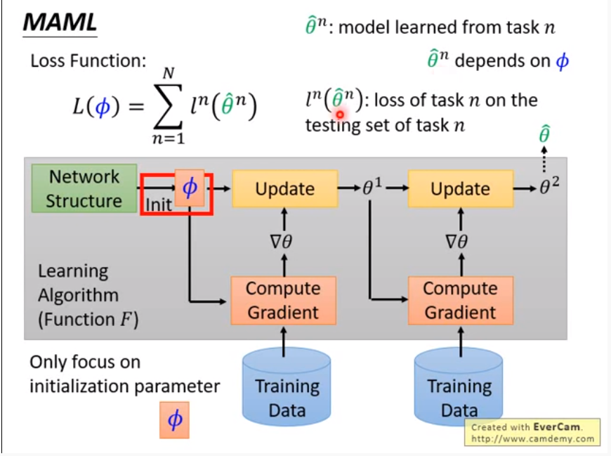
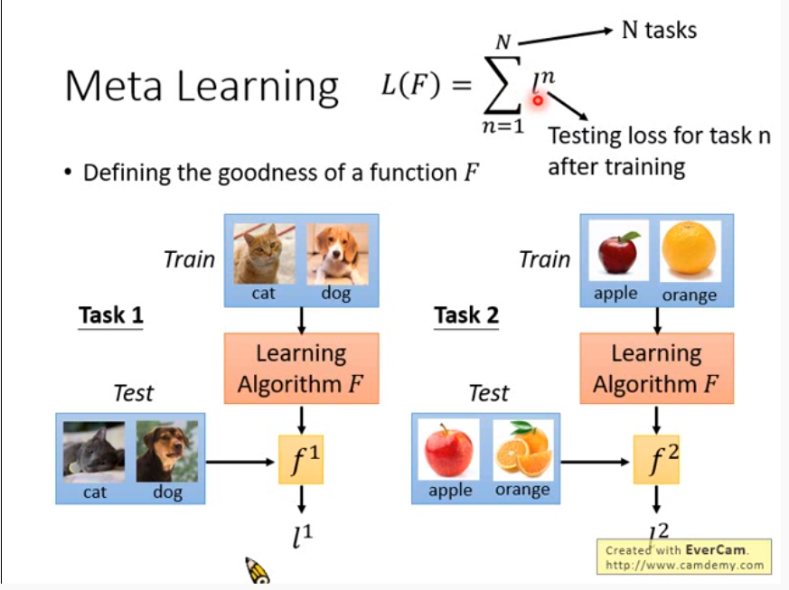
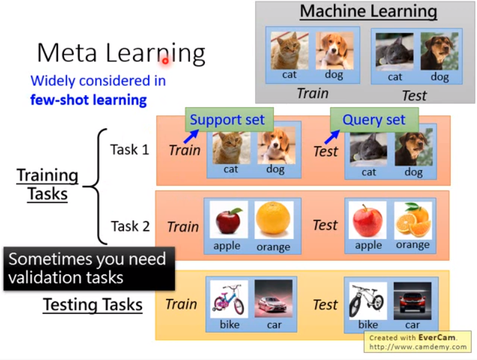
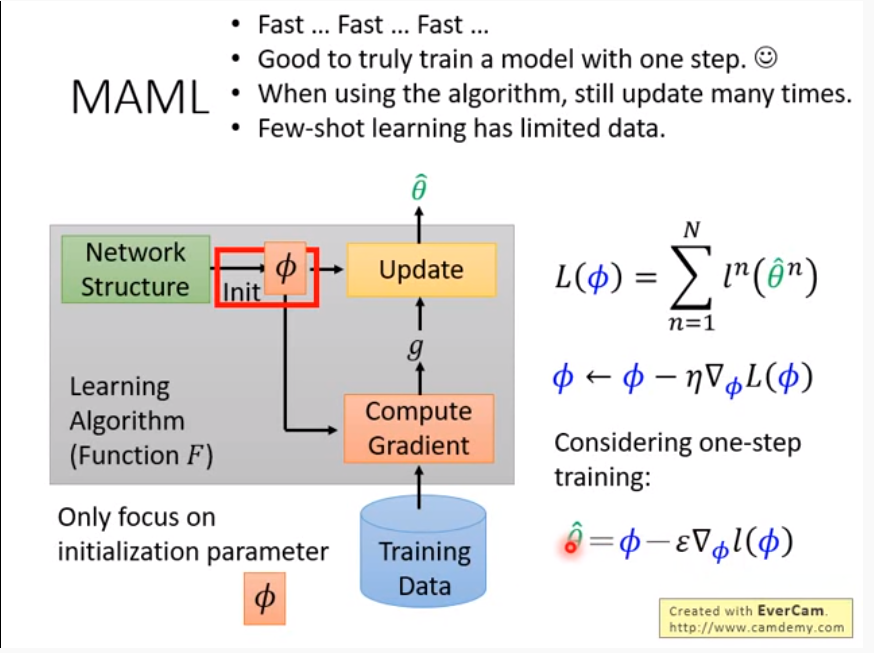
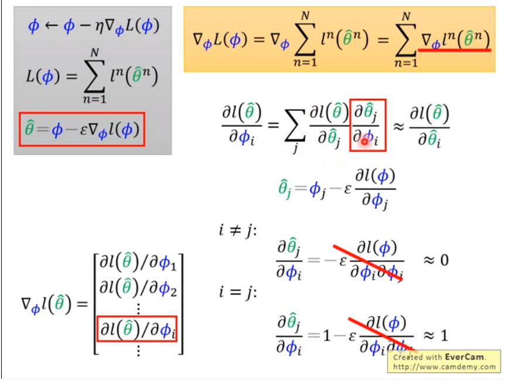
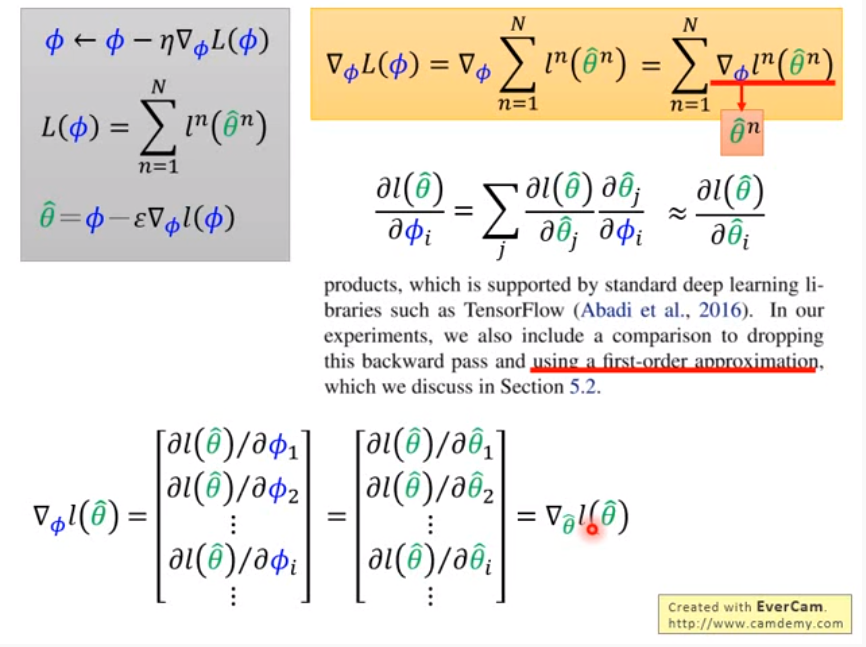
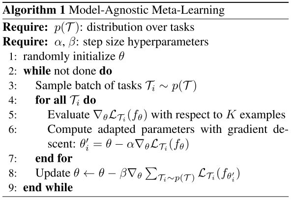
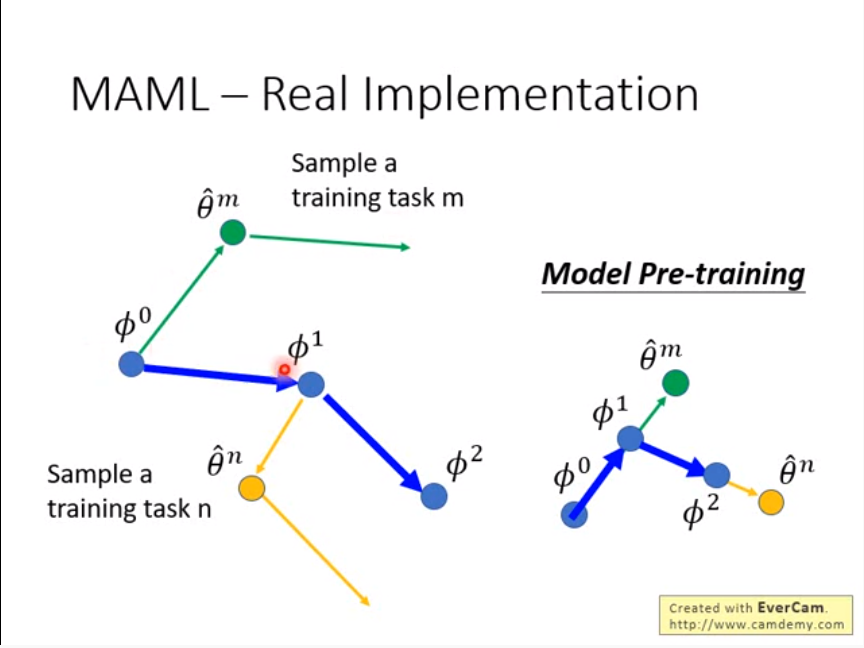
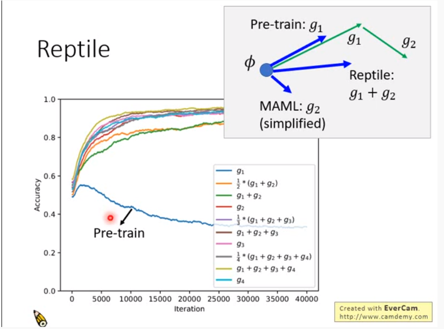

# Model-Agnostic Meta-Learning for Fast Adaptation of Deep Networks Chelsea

这是meta learning中的经典算法MAML。

meta learning即元学习，也可以称为"learning to learn"，即学习“如何更快更好地学习一个模型。

MAML用于算出初始参数，将该初始参数运用到模型的训练中会取得更好的效果。

一般地，训练模型时，设置初始参数$\phi$，然后不断地进行梯度下降，最终得到$\hat\theta$：

MAML是这样的一个模型：将数据集喂给它，它输出的是初始参数$\phi$，这个超参$\phi$使得最终的模型的loss大大降低：

注意，每个task都相当于一个独立的训练模型，即每个task都有train set和test set，每个task中的update被称为inner update。对于一个meta learning的模型，有多个task，每个task的模型的结构要求是相同的，在所有的task完成训练后有一个对初始参数$\phi$的更新，称为outer update。对于外部模型，也有train set和test set。因此为了不懂混，将task中的train set成为support set，test set称为query set：

那么对于MAML，Loss Function就为：$L(\phi)=\sum_{n=1}^{N}l^n({\hat\theta}^n)$，其中$\hat\theta$表示task n在初始参数为$\phi$的情况下训练出来的最终参数，$l^n({\hat\theta}^n)$表示task n的test set上的loss。

要注意的是，MAML中每个task只进行一次梯度更新：

原因有以下几点：

+ 速度更快
+ 使得模型求出的超参$\phi$能只在一次update的情况效果最好
+ （如果效果不理想也可以update多次，可以灵活设置）
+ 对于少量的数据，update多次可能会导致过拟合

进一步地推导：

为了降低计算量，将二阶偏微分忽略，就有了以下的式子：

即
$$
\nabla_{\phi}L(\phi)=\nabla_{\phi}\sum_{n=1}^{N}l^n({\hat\theta}^n)=\sum_{n=1}^{N}\nabla_{\phi}l^n({\hat\theta}^n)=\sum_{n=1}^{N}\nabla_{{\hat\theta}^n}l^n({\hat\theta}^n)
$$
下面是算法流程：

当数据量不够时或者训练速度过慢时，常常采用N ways K shot的方法，表示一个task中有N个class， 每个class有K个sample。

例如，对于分类任务来说，5 ways 5 shot表示一个task中的train set有5个class，每个class有5个sample。

下面这图很生动地描绘了计算过程：

除MAML之外，还有一个Reptile算法：

