# report02

深度学习在资源调度方面的应用主要在深度强化学习的方面（DQN），在读关于资源调度的paper时看到了很多使用DQN来解决组合优化问题的方法，但这些paper关于DQN的state、action、reward等的设计表述得非常模糊。这次主要汇报Q-Learning和一篇用DQN解决资源调度的文章。除此之外，一些paper使用聚类来分析现在的state与之前的state的关系，如果相似那么就可以参照以前的决策（这篇paper讲的也非常模糊，相似多少能参考以前的决策？如果能参考，那么决策是完全照搬还是需要进行改动？）

然后是关于FL的论文，都是关于个性化的paper。传统的FL假设用单一的模型能很好地fit所有的client，但对于非独立同分布的clients来说，将全局模型用于自身的效果肯定不好，传统的FL强调泛化能力，但是泛化与个性化是相互矛盾的，某个client参与到FL中只是想增加泛化能力，但是自身的个性肯定是不想弄丢的，因此个性化还是很重要的。汇报的三篇中一篇是综述，两篇是具体的技术，其中一篇关于联邦聚类的文章我认为非常好。

## Q-Learning

Critic是指如何评判一个状态到最后总共能得到多少分数。例如下面的两张图，第一张图的分数肯定很高，因为它的保护罩还完好无损，且有足够多的外星人给自己消灭，第二张图的分数就比第一张图低，它的保护罩已经没有了，且剩下的可以消灭的外星人非常少，因此这个状态的得分很低。那么我们需要learn一个$V^\pi(s)$这样一个function，输入状态s，输出得分。

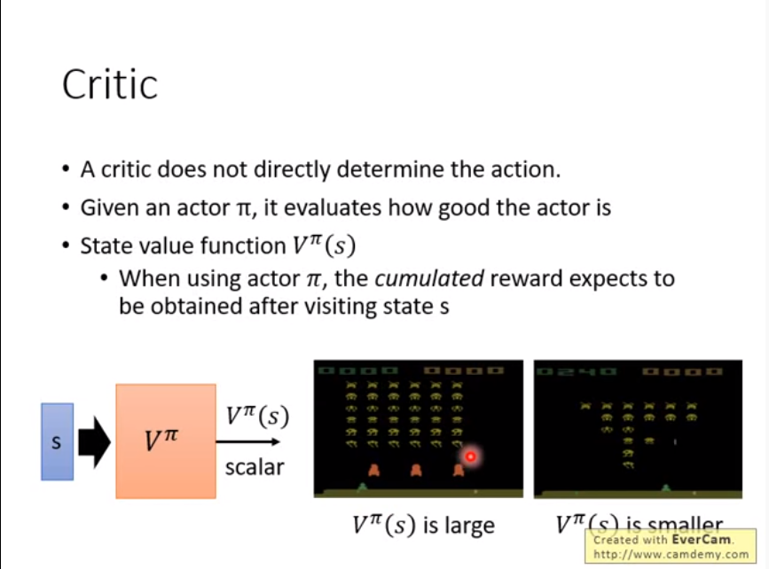

那么如何estimate $V^\pi(s)$呢？有两种方法：

第一种是蒙特卡洛式，critic观察$\pi$玩游戏，对于某个s，由$\pi$去玩，最终得到的分数$G$，然后critic将这种过程当成一个回归问题：

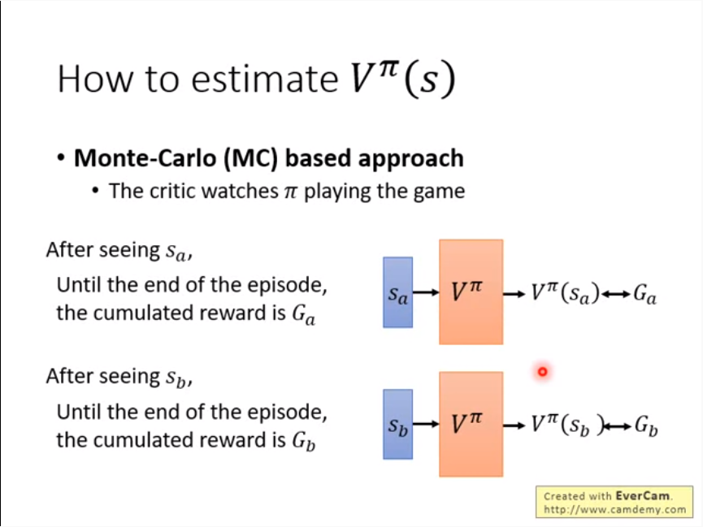

这种方式的缺点就是，需要玩完一整场游戏才能得到最终的分数，不现实。

第二种是Temporal-difference(TD)的方式，对于一个片段（episode） $s_t,a_t,r_t,s_{t+1}$，$s$表示state，$a$表示action，$r$表示reward。

那么有等式成立：$V^\pi(s_t)=V^\pi(s_{t+1})+r_t$。那么利用这个等式，可以对同一个网络$ V^\pi$的不同输入得到的输出做限制，即$V^\pi(s_t)-V^\pi(s_{t+1})=r_t$，那么得到了以下的网络结构：

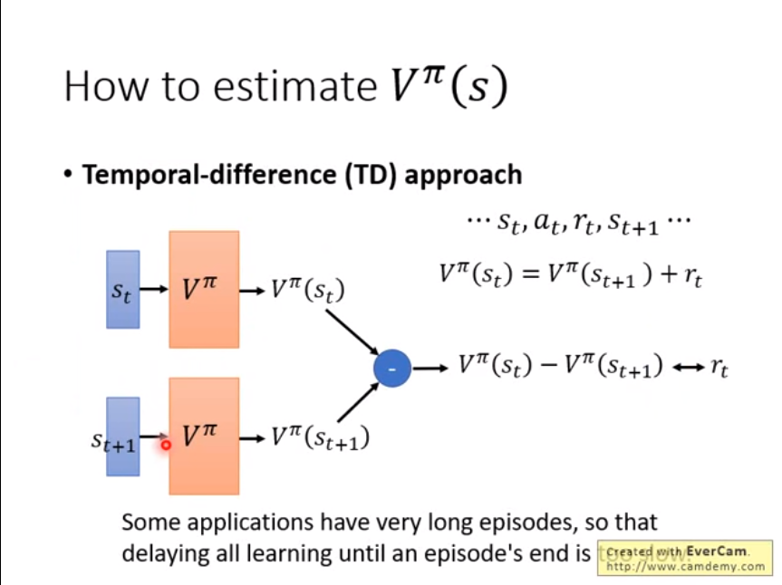

对于MC方式，方差可能会特别大，当游戏流程特别长时，最终分数由之间的所有step影响，因此累积起来的变化可能会特别大。

对于TD方式，方差会特别小（因为比较的是相邻的状态），但是只考虑了某个片段，没有考虑整体，因此可能会不准确。

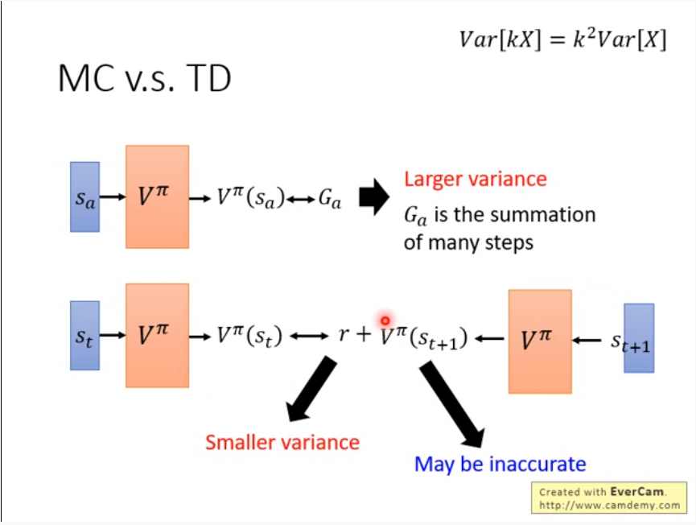

上面的critic都是只将state做为输入，接下来要引入Q-Learning的critic了：

Q function将state和action作为输入，对应的分数作为输出。它考虑的是某个state在采取某个action之后得到的分数。注意，与之前的critic不同的是，Q function固定了第一次的action，第二次及其之后的action没有固定，而之前的critic没有固定所有的action。

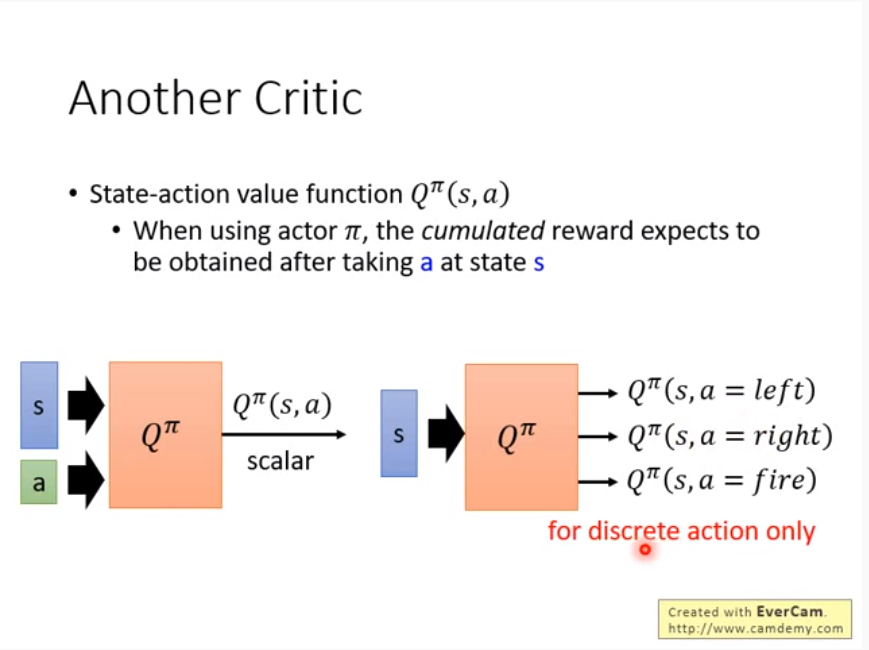

那么考虑TD方式的Q-Learning，那么在架构中有两个network，为了方便训练，引入evaluation network和target network，对target network进行固定，它提供$r+Q^\pi(s_{t+1},\pi(s_{t+1}))$，而evaluation network是实时更新的，在evaluation network更新N次后，将target network更新为evaluation network的最新状态。

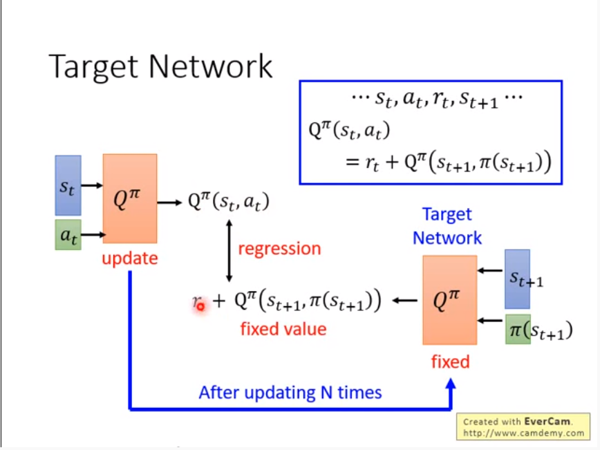

以下是Q-Learning的流程：

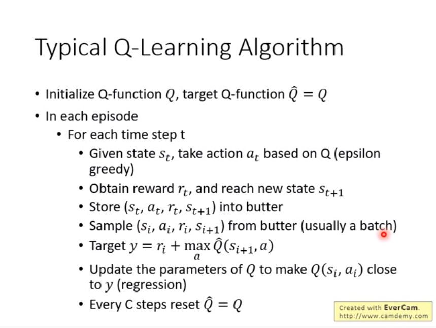

## Smart Resource Allocation for Mobile Edge Computing: A Deep Reinforcement Learning Approach

期刊：IEEE Transactions on Emerging Topics in Computing

年份：2019

### 摘要

提出了一个智能的、基于深度强化学习的资源分配（DRLRA）方案，该方案能够在不同的MEC环境下自适应地分配计算和网络资源，减少平均服务时间，平衡资源的使用。实验结果表明，该算法在可变MEC条件下的性能优于传统OSPF算法。

### 模型

网络资源状态的方差：

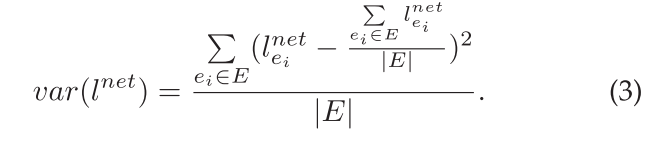

其中，$l_{e_i}^{net}$表示在datalink $e_i$上的资源量，$|E|$为datalink的总数。datalink指MEC之间的链路。

计算资源分配的方差：

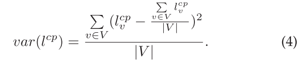

其中，$l_v^{cp}$表示MEC $v$上的计算资源数量，$|V|$表示MEC总数。

网络资源状态我认为指的是链路的带宽等，即链路的本身状态，而计算资源就是指MEC上的CPU等状态。

上面两个指标用于后面的DQN（深度强化学习网络）的Reward的计算。用这两个指标衡量整个网络的“健康”程度（方差大那么意味着可能存在单点问题，即一部分的MEC和链路有特别大的压力，然而其余部分的压力却很少）。

以下为DQN的框架示意图：

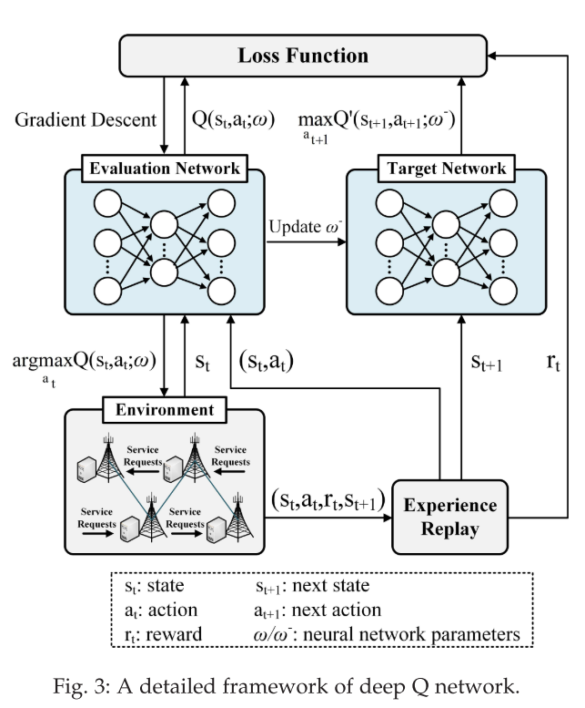

这篇文章更改了DQN的损失函数，使用均方误差：

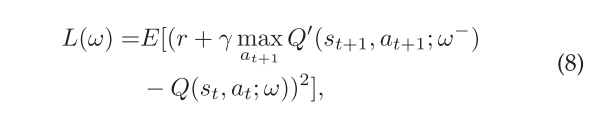

其中，$r+\gamma max_{a_{t+1}}Q'(s_{t+1},a_{t+1};\omega^-)$是由target network计算出来的，$Q(s_t,a_t;\omega)$是由evaluation network计算出来的。

初始化时两个network的$\omega$相等，他们之后的更新频率不同。evaluation network每次都更新，而target network在evaluation network更新n轮后才会更新一次，更新操作就是直接将evaluation network的$\omega$赋值给target network。

接下来是DQN的state、action、reward的定义：

+ state：$s=\{p_v^m,\forall v\in V,\forall m\in M\}$，$p_v^m$表示对于application m的请求在MEC v上的个数。（可以理解为某个MEC上对某个服务的请求的数量）。
+ action：$a=\{\alpha_v^m,\forall v\in V,\forall m\in M\}$，$\alpha_v^m$表示MEC v上的、对于applicatoin m的所有请求采取的action。采取的action可以是向相邻的MEC转发请求。
+ reward：$r=\{\omega_1\cdot T+\omega_2\cdot b^{net}+ \omega_3\cdot b^{cp}\}$，其中，$T$为所有请求的响应时间，$b^{net}$、$b^{cp}$分别可以由之前提到的两个指标$var(l^{net})$、$var(l^{cp})$来计算，分别表示网络链路状态的平衡、网络计算资源状态的平衡。$\omega$可调节的权重。

以下为算法流程图：

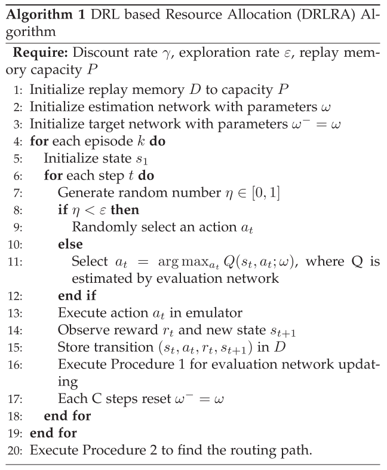

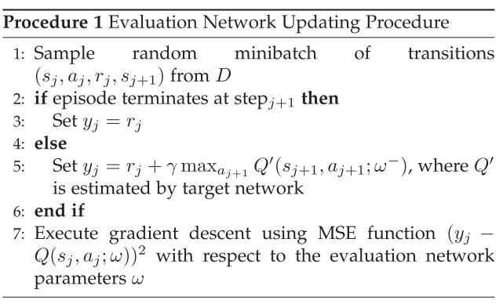

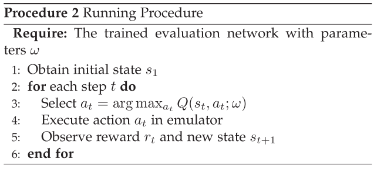

### 实验

网络拓扑结构参照了Topology Zoo，实验对照只有一个算法开放式最短路径优先（Open Shortest Path First (OSPF)）。

讨论了在application数量不同、MECS的处理能力不同、request聚集情况不同、application的计算需求不同的情况下，两个算法的平均相应时长的比较情况：

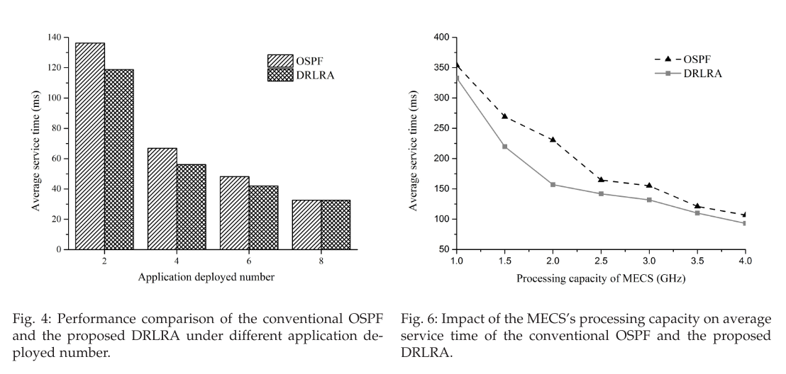

### 小结

这篇文章完全是基于裸的DQN框架做的，只是对state、actioin、reward进行了设计，同时使用了均方差作为损失函数（这篇文章也没有说为什么）。

同时state、action、reward等只是做了粗略的说明，没有透露细节。

不过对于reward的设计还是很新颖的，用方差来表示整个网络的计算资源的平衡。

## Survey of Personalization Techniques for Federated Learning

期刊：arXiv

年份：2020

### 摘要

这篇文章是关于联邦学习个性化的综述。客户参与联合学习的主要动机是获得更好的模型。没有足够的私人数据来开发准确的本地模型的客户将从联邦学习的模型中获益最大。然而，对于拥有足够的私有数据来训练精确的本地模型的客户来说，参与联合学习的好处是有争议的。因为全局模型的精确度可能会比只在本地模型的低。因此这篇文章的目的是调查最近关于在联合学习环境中为客户建立个性化模型的研究，这些模型比全局共享模型或局部个体模型更有效。

### 内容

#### Adding User Context

如果客户的上下文和个人信息被适当地特征化并合并到数据集中，共享全局模型也可以生成高度个性化的预测。然而，大多数公共数据集不包含上下文特征，开发有效结合上下文的技术仍然是一个重要的开放性问题，对于提高联邦学习模型的实用性具有巨大潜力[6]。如果这样的上下文特征化可以在不影响隐私的情况下执行，这也有待研究。作为单一全局模型和纯局部模型之间的中间方法，Masour等人[17]建议将相似的客户机分组在一起，并为每个组训练一个单独的模型。

#### Transfer Learning

迁移学习使深度学习模型能够利用在解决一个问题时获得的知识来解决另一个相关问题。迁移学习也被用于联邦环境中，例如Wang等人[20]，其中训练的全局模型的一些或所有参数在本地数据上被重新学习。文献[17]提供了一个具有泛化保证的学习理论框架。通过使用训练后的全局模型的参数对局部数据进行初始化训练，迁移学习能够利用全局模型提取的知识，而不是从头开始学习。为了避免灾难性遗忘的问题[21] [22]，必须注意不要在本地数据上对模型进行太长时间的重新训练。

#### Multi-task Learning

在多任务学习[23]中，同时解决多个相关任务，使得模型能够通过联合学习来利用任务之间的共性和差异。Smith等人[24]表明，多任务学习是构建个性化联邦模型的自然选择，联邦环境中开发用于多任务学习的MOCHA算法，可以应对与通信、掉队和容错相关的挑战。在联邦环境中使用多任务学习的一个缺点是，因为它为每个任务生成一个模型，所以所有客户机都必须参与每一轮。

#### Meta Learning

Jiang等人[15]指出，如果我们将联邦学习过程看作元训练，将个性化过程看作元测试，那么联邦平均(FedAvg)与流行的MAML算法reptile非常相似（即FL中的client对应着meta learning中的task）。作者还观察到，仔细的微调(fine-tune)可以产生一个易于个性化的高精度全局模型，但仅仅对全局精度的优化会损害模型的个性化能力（全局精度代表泛化，与个性化相冲突）。虽然其他用于联邦学习的个性化方法将全局模型的开发及其个性化视为两个不同的活动，但Jiang等人[15]提出了对联邦平均(FedAvg)算法的修改，可以同时处理这两个活动（全局模型和个性化模型），从而得到更好的个性化模型。

Fallah等人[27]提出的标准联邦学习问题的新公式结合MAML，并寻求找到一个全局模型，该模型在每个用户更新其自身损失函数后表现良好。此外，他们还提出了每一个FedAvg，一个联邦平均的个性化变体，来解决上述公式(formulation)。Khodak等人[28]提出了一种基于在线凸优化的元学习算法ARUBA，并将其应用于联合平均，证明了该算法在性能上的改进。Chen等人[29]提出了一个联邦元学习框架，用于构建个性化推荐模型，该模型和算法都是参数化的，需要优化。

#### Knowledge Distillation

Caruana等人[23]已经证明，可以将模型集合的知识压缩到一个更易于部署的模型中。knowledge distillation[30]进一步发展了这一思想，通过让学生模仿教师，将大型教师网络的知识提取到较小的学生网络中。过度拟合是个性化过程中的一个重大挑战，特别是对于本地数据集较小的客户。Yu等人[7]提出，将全局联合模型作为教师，将个性化模型作为学生，可以缓解个性化过程中过度拟合的影响。Li等人[31]提出了FedMD，这是一个基于knowledge distillation和transfer learning的联邦学习框架，允许客户使用本地私有数据集和全局公共数据集独立设计自己的网络。

### 文献

[6] P. Kairouz, H. B. McMahan, B. Avent, A. Bellet, M. Bennis, A. N. Bhagoji, K. Bonawitz, Z. Charles, G. Cormode, R. Cummings, et al., “Advances and open problems in federated learning,” arXiv preprint arXiv:1912.04977, 2019.

[15] Y. Jiang, J. Konecny, K. Rush, and S. Kannan, “Improv- ing federated learning personalization via model agnos- tic meta learning,” arXiv preprint arXiv:1909.12488, 2019.

[17] Y. Mansour, M. Mohri, J. Ro, and A. T. Suresh, “Three approaches for personalization with applications to federated learning,” arXiv preprint arXiv:2002.10619, 2020.

[20] K. Wang, R. Mathews, C. Kiddon, H. Eichner, F. Beaufays, and D. Ramage, “Federated evaluation of on-device personalization,” arXiv preprint arXiv:1910.10252, 2019.

[24] V. Smith, C.-K. Chiang, M. Sanjabi, and A. S. Tal- walkar, “Federated multi-task learning,” in Advances in Neural Information Processing Systems, pp. 4424– 4434, 2017.

[27] A. Fallah, A. Mokhtari, and A. Ozdaglar, “Personalized federated learning: A meta-learning approach,” arXiv preprint arXiv:2002.07948, 2020.

[28] M. Khodak, M.-F. F. Balcan, and A. S. Talwalkar, “Adaptive gradient-based meta-learning methods,” in
Advances in Neural Information Processing Systems, pp. 5915–5926, 2019.

[29] F. Chen, Z. Dong, Z. Li, and X. He, “Federated meta-learning for recommendation,” arXiv preprint arXiv:1802.07876, 2018.

[30] G. Hinton, O. Vinyals, and J. Dean, “Distilling the knowledge in a neural network,” arXiv preprint arXiv:1503.02531, 2015.

[31] D. Li and J. Wang, “Fedmd: Heterogenous feder- ated learning via model distillation,” arXiv preprint arXiv:1910.03581, 2019.

### 小结

这篇文章讲了个性化FL的技术。全局的模型代表的是泛化，但是这与个性化相冲突，因此如何在FL的环境下保证各个client不会丢失自己的个性。主要有增加用户上下文、迁移学习、多任务学习、元学习、知识蒸馏等方法，这是以后关于个性化FL的关键词。

## Personalized Federated Learning with Moreau Envelopes

期刊：NeurIPS

年份：2020

### 摘要

本文提出了一种个性化联邦学习方案，该方案引入了基于客户端损失函数的 Moreau envelopes 优化。通过该方案，客户端不仅可以像经典联邦学习一样构建全局模型，而且可以利用全局模型来优化其个性化模型。从几何的角度分析，该方案中的全局模型可以看作是所有客户端一致同意的“中心点”，而个性化模型是客户端根据其异构数据分布来构建的遵循不同方向的点。

### 模型

传统的FedAvg算法在将各个client的权重w aggragate后生成加权平均后的global w，然后将这个w作为所有client的新一轮的模型。

这篇文章与传统的FedAvg不同，并没有将这个global w直接作为所有client的新一轮模型，而是保留所有client的local w信息，即仍用本地的模型进行训练，不同的是，损失函数新增了一项Moreau envelopes，如下：

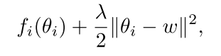

这个新项用于保留本地的个性化模型，同时向所有client的中心点靠拢。

因此整个模型为：

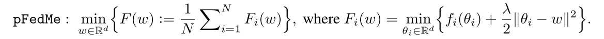

算法流程：

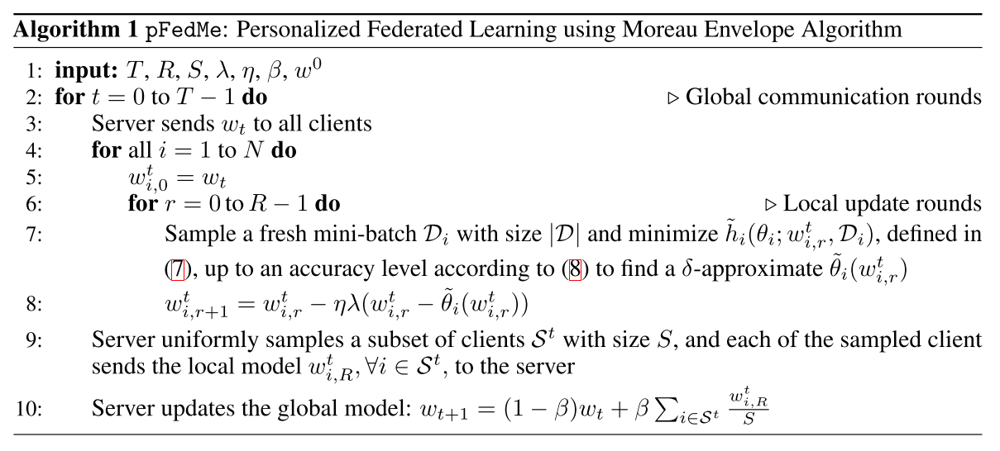

（7）中的$h$函数为：

（8）中的梯度更新使用了近似权重：

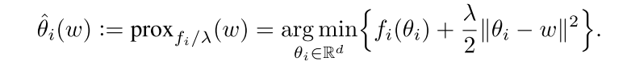

这篇文章对这个近似权重的收敛性做出了证明。

### 实验

实验对照的是经典的FedAvg以及基于元学习的Per-FedAvg，Per-FedAvg的模型如下：

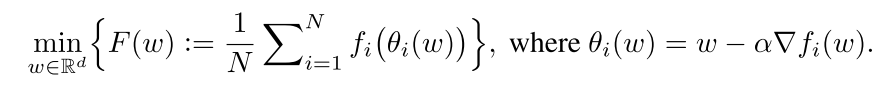

Per-FedAvg就是元学习在FL下的变式。因为这篇文章提出的pFedMe算法是个性化算法，而元学习也是个性化算法，因此将它作为实验的对照加了进来。

使用的是MNIST数据集，是一个手写数字数据集，作者将作者将完整的 MNIST 数据集分发给 N=20 个客户端。为了根据本地数据大小和类别对异构设置进行建模，每个客户端都被分配了一个不同的本地数据大小。

作者对 pFedMe、FedAvg 和 Per-FedAvg 进行了比较。MNIST 数据集中的实验结果见图 4。pFedMe 的个性化模型在强凸设置下的准确率分别比其全局模型 Per-FedAvg 和 FedAvg 高 1.1%、1.3% 和 1.5%。非凸设置下的相应数据为 0.9%、0.9% 和 1.3%。

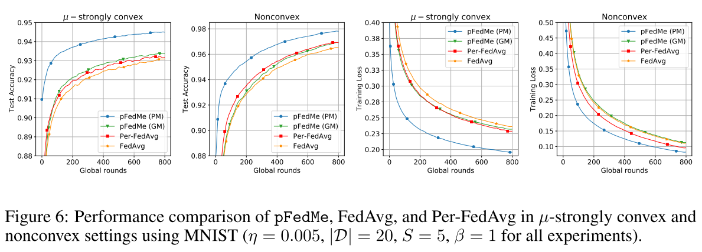

### 小结

本文提出了一种个性化联邦学习方法 pFedMe。pFedMe 利用了 Moreau envelope 函数，该函数有助于将个性化模型优化从全局模型学习中分解出来，从而使得 pFedMe 可以类似于 FedAvg 更新全局模型，但又能根据每个客户端的本地数据分布进行优化，得到个性化模型。

## Clustered Federated Learning: Model-Agnostic Distributed Multitask Optimization Under Privacy Constraints

期刊：IEEE TRANSACTIONS ON NEURAL NETWORKS AND LEARNING SYSTEMS
年份：2020

### 摘要

提出了一个新的联邦多任务学习（FMTL）框架，即聚类FL（CFL），该框架根据client之间的梯度更新相似度将客户群体聚类，得到具有联合可训练数据分布的聚类。CFL足够灵活，可以处理随时间变化的客户群体，并且可以以隐私保护的方式实现。

### 模型

首先，作者探讨了基于余弦相似度的二分算法。

Definition 1定义了一个好的划分：

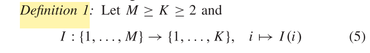

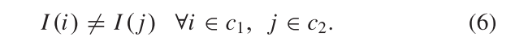

其中，$c_1,c_2$表示两个簇。

Definition 1表示所有同分布的client都在同一个划分里，后续的算法都设法使得Definition 1成立。

那么现在假设所有的client可以划分为两组$c_1,c_2$，且满足Definition 1，那么全局的loss function为：

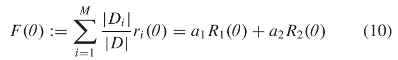

其中R的定义如下：

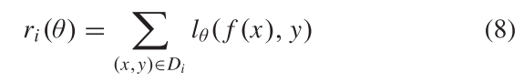

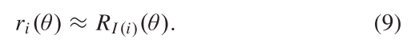

那么进行全局更新时，假设稳定点为$\theta^*$，那么有：

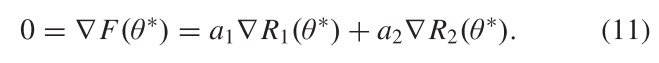

那么这个解可以分为两种情况：

+ $\nabla R_1(\theta^*)=\nabla R_2(\theta^*)=0$，那么意味着$c_1,c_2$都遵从同一分布（因为他们同时达到平衡点）
+ $\nabla R_1(\theta^*)=-\frac{a_2}{a_1}\nabla R_2(\theta^*)\neq 0$，意味着$c_1,c_2$没有遵从同一分布

对于第二种情况，可以计算他们之间的gradient update得余弦相似度：

可以发现有：

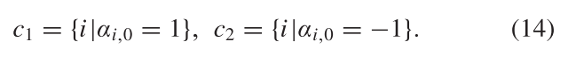

可以发现gradient update的余弦相似度能体现出cluster的类别。因此作者顺着这个insight做出了后续的工作。

Theorem 1：对于一个稳定解，始终有：

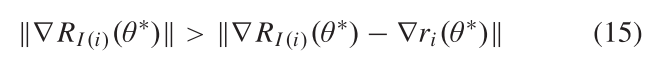

然后定义$\gamma_i$：

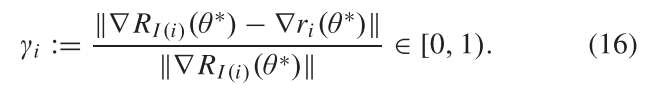

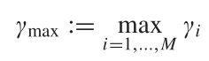

$\gamma_{max}$作为超参使用。

然后有：

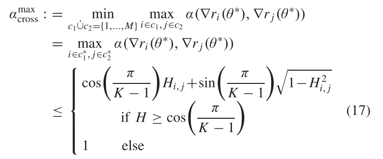

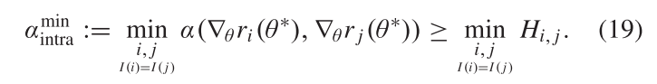

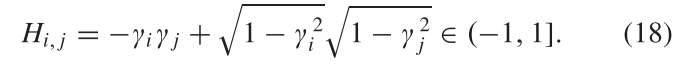

$\alpha_{cross}^{max}$表示在最优分配下两个所属不同cluster的client间的最大相似度，而最优分配将使得这个最大相似度降到最小。

$\alpha_{intra}^{min}$表示两个所属相同cluster的client间的最小相似度。

Corollary 1：

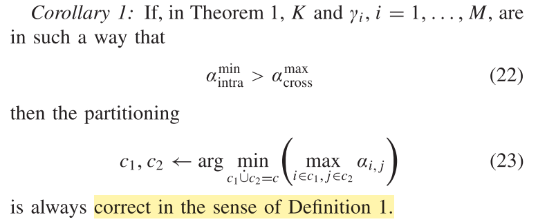

给出了一个划分方案，这个划分方案能满足Definition 1。

其次，由$\alpha_{intra}^{min}>\alpha_{cross}^{max}$这个不等式可以推出

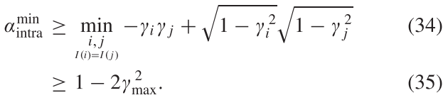

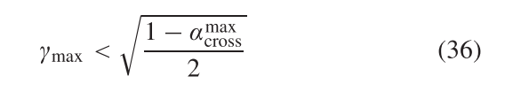

（36）将作为判断是否需要聚类的条件之一。（Definition 1是该条件的充分条件，因此可以使用（36）来限制）

Definition 2：

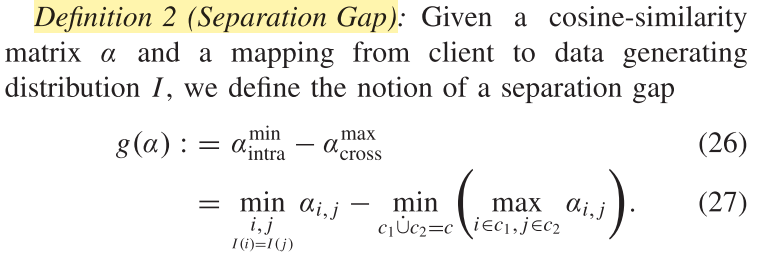

当$g(\alpha)>0$时，划分方案(23)始终是正确的。

那么，什么时候进行聚类操作呢？当发现client中存在不同分布的情况时聚类。那么什么时候能发现client中存在不同分布呢？

上面讨论二分算法的时候已经给出了答案，当全局模型$\theta^*$将要收敛时，但将$\theta^*$用于某些client上的本地模型并不收敛：

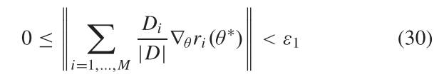

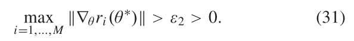

其中，$\xi_1,\xi_2$为超参。

CFL算法：

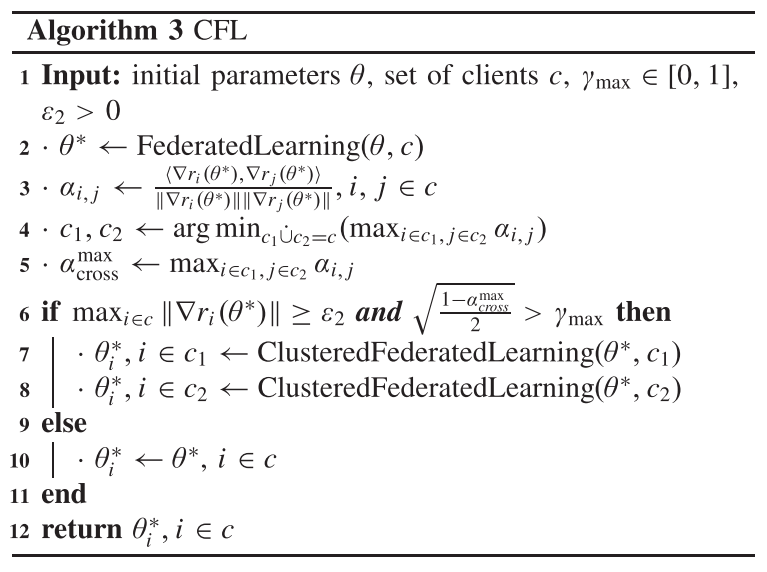

示意图：

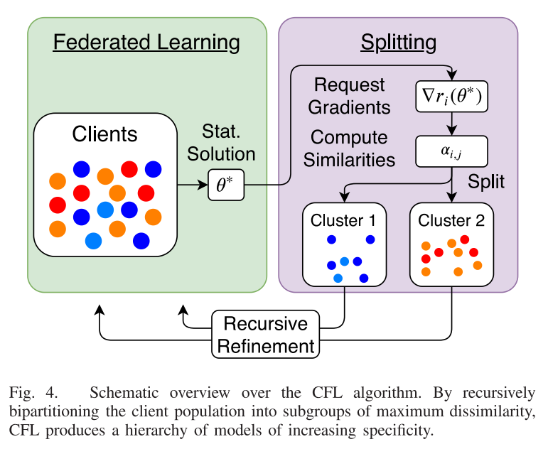

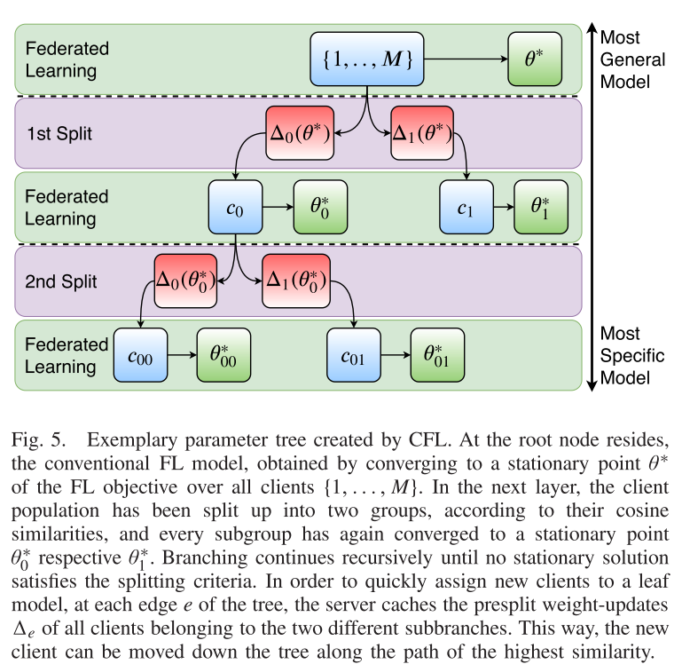

除此之外还有两个版本的算法，一个可以支持动态添加client，一个是支持隐私保护。这些就不列举了。

此前都是基于gradient计算相似度的，作者发现基于weight-updates计算相似度带来的效果会更好：

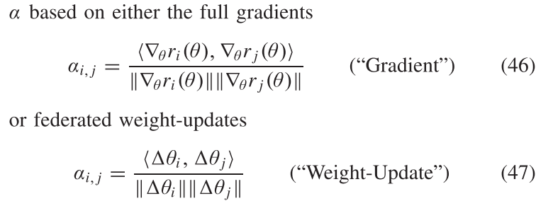

其次，关于超参$\xi_1,\xi_2$的选择，作者给出了他的设置：

+ $\xi_1\approx max_t||\Delta\theta_c^t||/10$
+ $\xi_2\in[\xi_1,10\xi_1]$

$\gamma_{max}$没有给出设置。

### 实验

实验所用的数据集为MNIST和CIFAR-10。

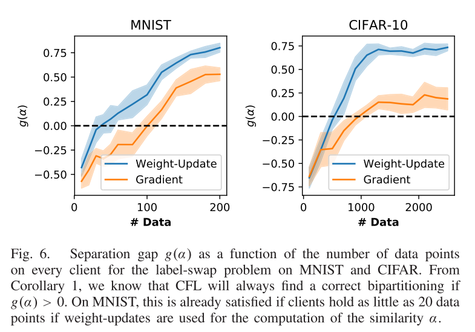

上图中，$g(\alpha)>0$表示聚类是正确的。由上面的实验可知，随着数据量的增大，聚类的正确性也随之增加。并且基于weight-update计算的相似度的效果要比基于gradient的要好。

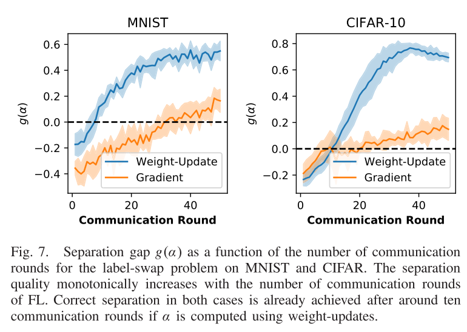

上图表示随着FL的communication round的增加，$g(\alpha)$随之增加。这原因很简单，因为FL的轮次越多，那么（30）这个条件就会越满足，聚类的效果会更好。

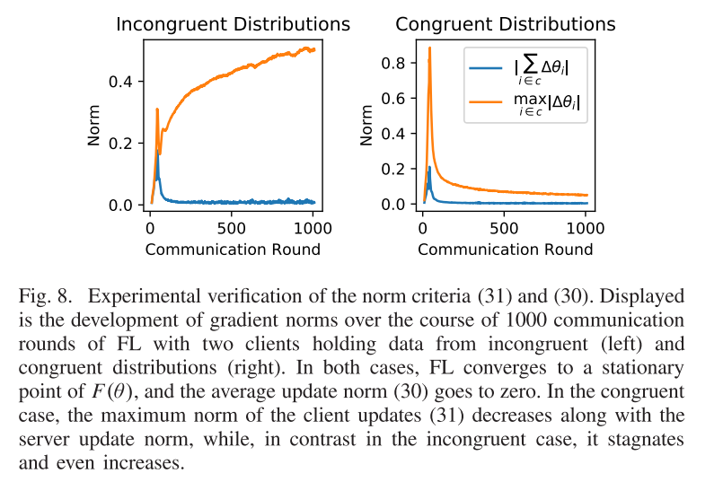

上图说明传统的FL在iid的clients上训练时，$|\sum\Delta\theta_i|$和$max|\Delta\theta_i|$都会减少；而在非iid的clients上训练时，$|\sum\Delta\theta_i|$减小，但是$max|\Delta\theta_i|$会增大。

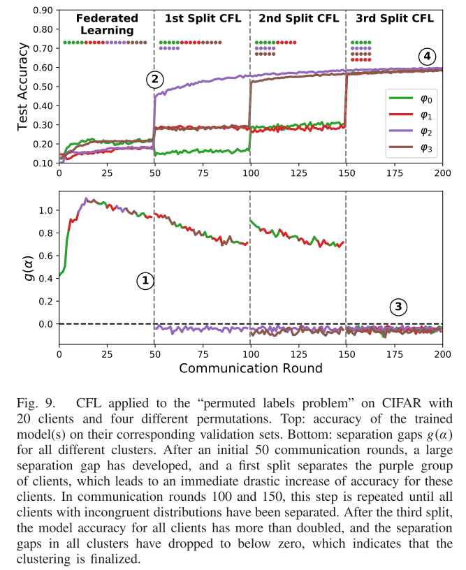

上图可以看出，传统的FL的准确率非常低，但是$g(\alpha)$很高，意味着聚类效果会很好，那么三次聚类操作执行后，各个簇的准确率大幅提高，各个簇的$g(\alpha)$降到0以下，不再进行聚类操作。

### 小结

这篇文章依据梯度来计算相似度执行聚类操作，将数据集分布相似的client联合训练。

FL的本意是指某个client的数据集不够，仅依靠自己的数据集无法训练出更加泛化的模型，因此希望借助与其他client联合的方式训练，但是不希望暴露自己的隐私。FL关心的终究还是本地模型的性能，因此选择与自身分布相似的client联合训练是很直觉的，因为地域等因素，一个client接触到的数据不会偏离自身分布太多，因此也没必要选择与自身相似度差距过大的client进行联合训练。

这篇文章提出的聚类算法是一个很好的工具。

