# report03

这次汇报的内容比较少，因为有很多文章都没读懂（关于长尾分布的论文）。长尾分布在计算机视觉领域非常火热。在分类任务中，某些类采集到的图像数量会非常多（比如猫和狗），某些类采集到的图像会非常少（比如北极熊），最终的分类结果会偏向样本数量多的类，这就是长尾分布的问题。长尾分布跟FL中的非iid的数据分布问题非常像。

这四篇中两篇是关于联邦学习的，两篇是关于长尾分布的。

第一篇讲聚类FL。第二篇和第三篇讲如何将长尾分布的影响降到最低。第四篇讲在FL中绕开固定K轮本地更新的次数，相反通过精度来判断哪个时候上传梯度的方式来执行FL。

## An Efficient Framework for Clustered Federated Learning

期刊：arXiv

年份：2020

### 摘要

提出了一种新的迭代联邦聚类算法（IFCA），该算法通过梯度下降交替估计用户的聚类身份，并优化用户聚类的模型参数。分析了该算法在具有平方损失的线性模型中的收敛速度，然后分析了一般强凸光滑损失函数的收敛速度。

### 模型

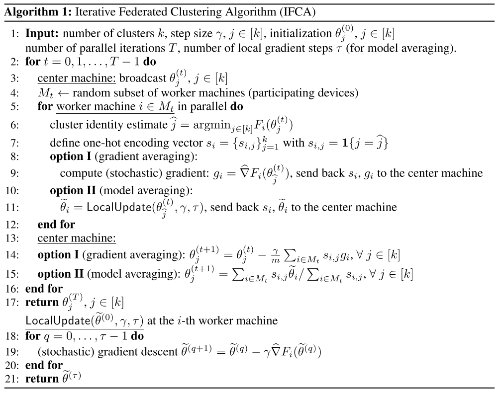

大致的思想是：首先确定簇的个数k，中心服务器生成k个初始权重$\theta_j^{(0)}$，将这k个发给所有的client。client进行对这些权重的挑选，选择一个能使本地的loss function最低的权重$\theta_i^{(0)}$，那么这个client就属于第$i$个簇，这一轮的global update就只与第$i$个簇的所有client进行FL。每一轮的clustering都可能不一样。

这篇文章给出了收敛性的证明。

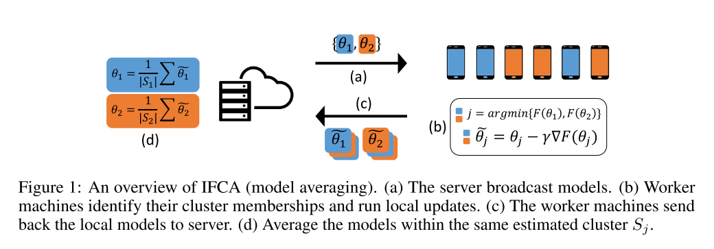

## Decoupling representation and classifier for noisy label learning

期刊：ICLR

年份：2020

### 摘要

视觉世界的长尾分布对基于深度学习的分类模型如何处理类不平衡问题提出了很大的挑战。现有的解决方案通常涉及类平衡（class-balanced）策略，例如通过损失重加权、数据重采样或从头尾类到尾类的转移学习，但大多数方案坚持结合学习表示和分类器的方案（端到端）。这项工作将学习过程拆分成特征学习和分类来解决这个困难。

### 模型

#### 采样策略

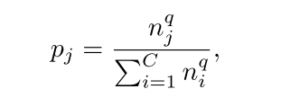

其中，$p_j$表示类别$j$的样本被采样的概率，$C$为类别总数，$n_j$表示类别$j$的个数，$q$根据策略不同而不同。

+ Instance-balanced sampling：在上面的式子中，$q$的值为1，即采样概率正比于该类的样本总数。
+ Class-balanced sampling：$q$的值为0，那么$p_j=1/C$，每个类的采样概率是一致的。
+ Square-root sampling：取$q=1/2$。
+ 等等等等以上方法的混合。

#### 模型

分类模型一般可以分为两个部分：特征提取和分类器。

第一步，不做任何处理，直接就像传统的分类一样，利用原始数据训练一个分类模型（特征提取+分类器）。

第二步，将第一步学到的模型中的特征提取部分固定（不再学习），然后单独接上一个分类器，然后进行class-balanced sampling学习。

然后作者通过实验发现分类器的weight的norm和对应的样本数正相关，也就是说样本数越多的类，weight的模越大，也就导致最终分类时大类的分数（logits）更高（对头部类的过拟合）。所以将第二步的分类器设计为归一化分类器，weight设计如下：

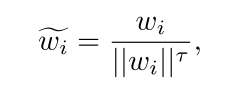

这篇文章的主要创新在于将整个模型拆分成两部分：特征提取和分类器。先用传统的方式训练模型，然后把特征提取部分的参数固定，然后重新训练分类器的学习。背后的思想很直观，特征提取的规律是客观存在的，不会被不平衡的数据分布所影响，而分类器受到数据分布的影响非常大。

## Meta-Weight-Net: Learning an Explicit Mapping For Sample Weighting

NeurIPS

2019

### 摘要

现有的深度神经网络（DNNs）很容易对标签损坏或类别不平衡的有偏训练数据进行过度拟合。样本重加权策略通常是通过设计从训练损失(loss)到样本权重的加权函数映射，然后在权重重新计算和分类器更新之间进行迭代来缓解这一问题。然而，目前的方法需要手动预先指定加权函数及其附加的超参数。由于依赖于所研究的问题和训练数据，加权方案会有很大的变化，使得它们很难在实际中得到普遍应用。为了解决这个问题，这篇文章提出了一种直接从数据中自适应学习显式加权函数的方法。加权函数是一个具有一个隐层的MLP，构成了几乎所有连续函数的通用逼近器，使得该方法能够适用于包括常规研究中假设的各种加权函数。在少量无偏元数据的引导下，分类器的学习过程可以同时精确地更新加权函数的参数。

### 模型

### The Meta-learning Objective

假设有$N$个训练集$\{x_i,y_i\}_{i=1}^N$，其中$x_i$表示第$i$个sample，$y_i\in\{0,1\}^c$是关于c个类的label vector。$f(x,w)$表示分类器，$w$是分类器的参数。

最优参数$w^*$可以通过最小化loss $\frac{1}{N}\sum_{i=1}^{N}l(y_i, f(x_i, w))$来得到。现在用$L_i^{train}(w)=l(y_i, f(x_1, w))$来表示。

对于非平衡的数据集，通过一个从loss到weight的加权函数映射$\mathcal{V}(L_i^{train}(w), \Theta)$来得到各个数据集对应的权重，同时$\mathcal{V}(l, \Theta)$是一个可训练的weight net。

那么最优参数$w^*$可以表示为：

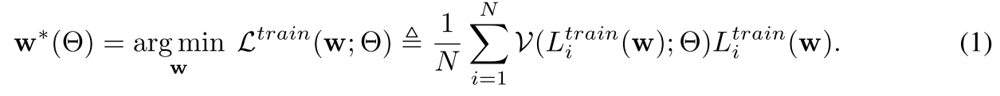

#### Meta-Weight-Net

主要目的是训练出$\mathcal{V}(l, \Theta)$。

#### Meta learning process

构建出一个平衡的数据集，称为meta-data set，使用这个meta-data set来训练Meta-Weight-Net。

假设meta-data set的数据集表示为：$\{x_i^{meta}, y_i^{meta}\}_{i=1}^M$，$M<<N$。最优参数$\Theta^*$可以通过最小化以下式子得到：

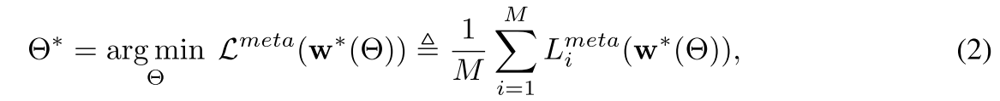

### The Meta-Weight-Net Learning Method

#### Formulating learning manner of classifier network

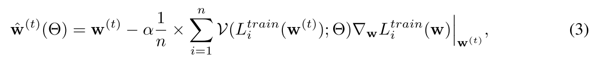

#### Updating parameters of Meta-Weight-Net

上回，根据$\Theta^{(t)}$可以得到$\hat{w}^{(t)}(\Theta)$，然后将meta data set喂给模型$\hat{w}^{(t)}(\Theta)$进行训练，训练出来的loss来作为meta-weight-net的loss function，以此来训练$\Theta$。

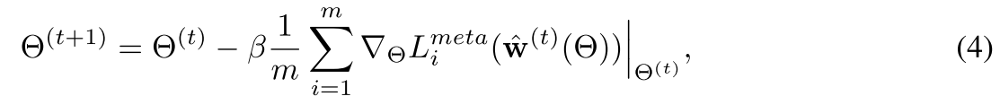

#### Updating parameters of classifier network

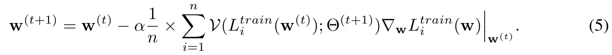

根据上回算出的$\Theta^{(t+1)}$重新在训练集上训练，得到$w^{(t+1)}$。

算法流程如下：

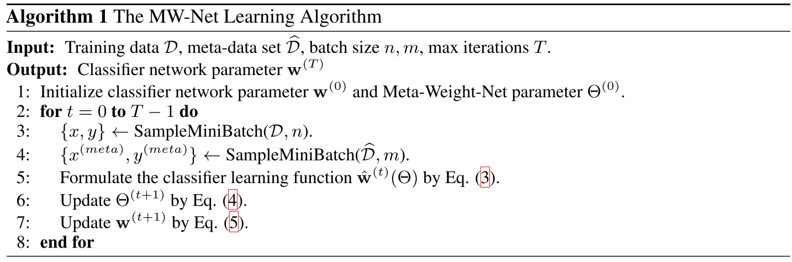

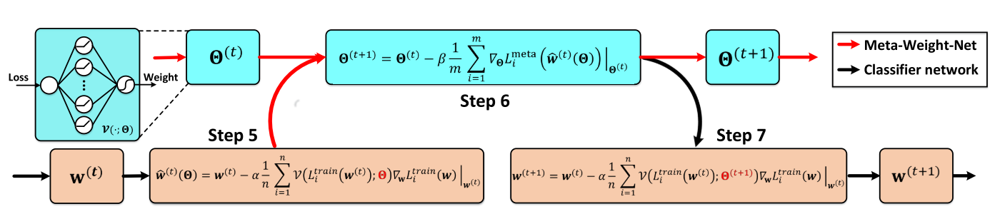

### 小结

这篇文章提出的场景跟FL非常相像，不平衡的数据集对应着FL中的不平衡的client。几乎可以不做任何修改直接移植到FL上。

## Federated Optimization in Heterogeneous Networks

Proceedings of the 3rd MLSys Conference

2020

### 摘要

联邦学习有两个关键的挑战，一个是统计异构，即数据非独立同分布，一个是系统异构，即每个设备的系统特性具有显著的可变性。这篇文章引入一个框架FedProx来解决联邦网络中的异构性。

### 模型

FedAvg 的一般步骤：在每个 Communication Round 内，参与更新的 K个设备在本地 SGD 迭代 E epochs，然后在将模型上传到 Server 端进行聚合。一方面，本地迭代次数 E 的增大能减少通信成本；另一方面，不同 local objectives $F_k$ 在本地迭代次数过多后容易偏离全局最优解，影响收敛。

并且 FedAvg 这种固定 E 的操作没考虑到不同硬件间的差异，如果在固定时间内未完成 E epochs 的迭代就会被系统 drop 掉。

文章指出**直接 drop 掉这些用户或者单纯把他们未迭代完成的模型进行聚合都会严重影响收敛的表现**。因为丢掉的这些设备可能导致模型产生 bias，并且减少了设备数量也会对结果精度造成影响。

文章定义了$\gamma_k^t$-inexact solution：

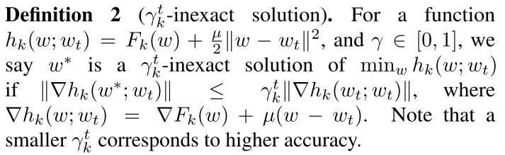

各个client的损失函数为：

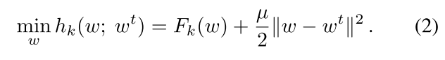

这个$\gamma_k^t$是自己选择的参数，当本地收敛到一定精度下时不再迭代，把梯度发送回服务器。

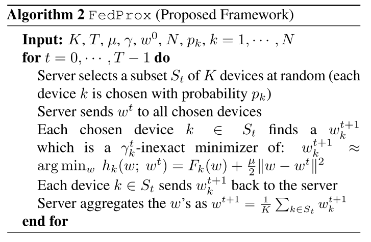

### 小结

这篇文章提出的问题很有意义。FL中的系统是的异构的，而现有的同步算法并没有考虑设备的迭代时长，大部分的算法都只从迭代轮次的角度来谈论效率，但实际上，如果某部分的device计算性能特别差，那么server将等待非常长的时间，就算算法的收敛速度再快，由于短板效应，训练总耗时也会大大增加。对于这种问题，大多数paper都没有考虑过。
