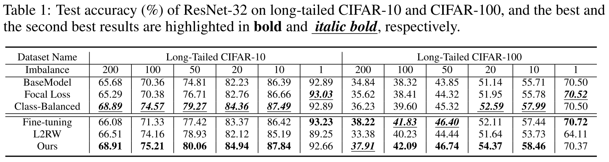
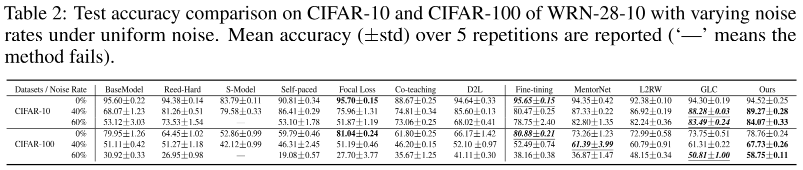
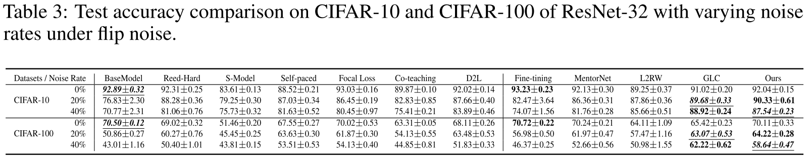

# report04

## Meta-Weight-Net实验补充

#### 类不平衡实验

选用Long-Tailed CIFAR数据集，与四个算法BaseModel、Focal loss、Fine-tuning、L2RW进行比较，实验结果如下：

imbalance因子表示最大类和最小类样本数量的比值。可以看出:

+ 在类不平衡的数据集上，提出的算法明显优于其他同类算法，显示了在这种数据偏差情况下的鲁棒性。
+ 当不平衡因子为1时，即所有类具有相同的样本数，微调运行最佳，并且提出的算法仍然可以获得相当的性能。
+ 当长尾CIFAR-100的不平衡因子为200时，最小的类只有两个样本。微调性能最好，而提出的算法仍然在这种极端的数据偏差表现良好。

#### 标签损坏实验

在训练集中添加噪声，与BaseModel、Reed、S-Model、SPL、Focal Loss、Co-teaching、D2L、Fine-tuning、MentorNet、L2RW、GLC算法进行比较，实验结果如下：

