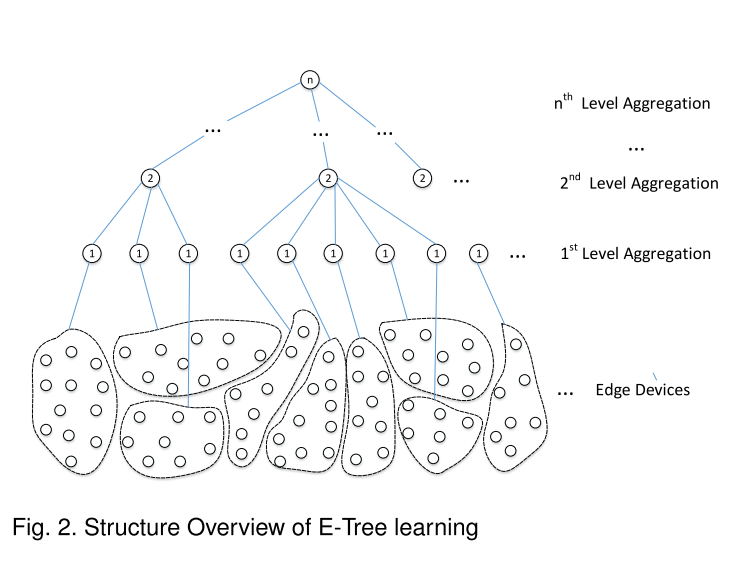
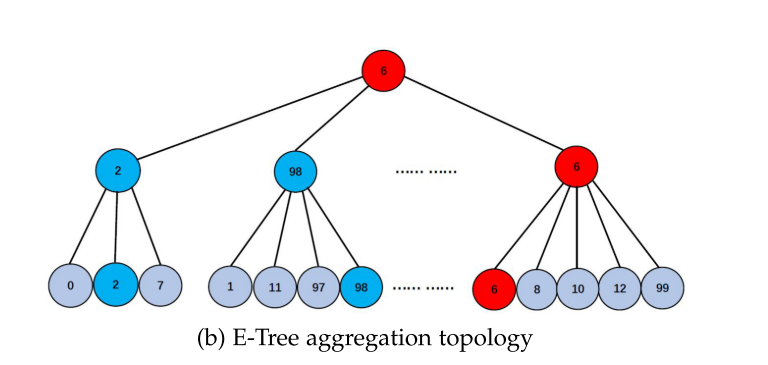
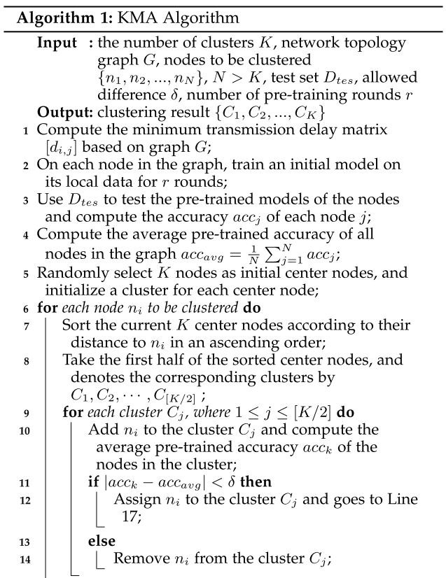
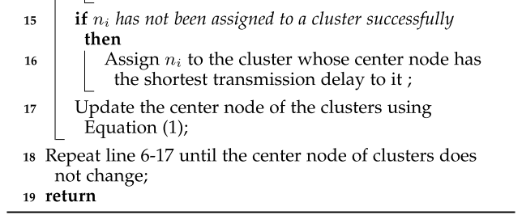
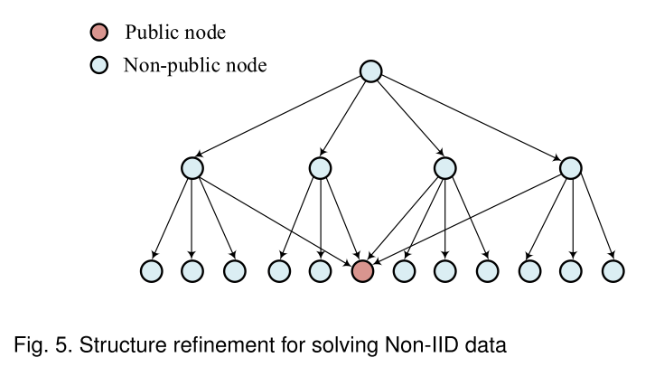
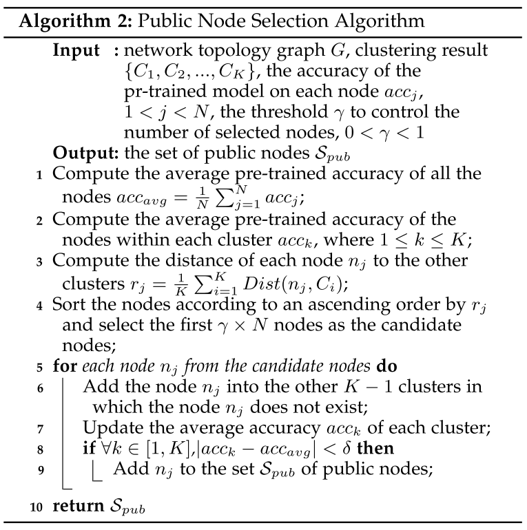
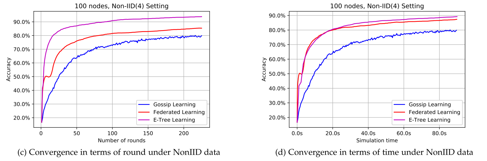
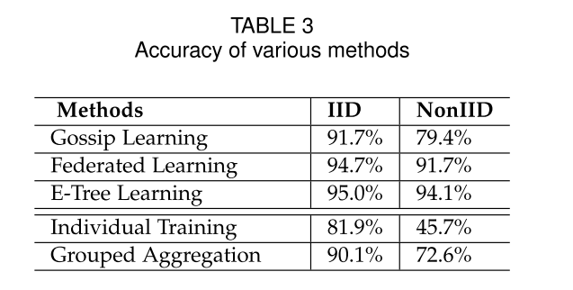

# report05

这期间主要是在搭建实验环境，安装cuda、conda、pytorch、gpu驱动等实验需要的组件，看的论文比较少。

这次的论文介绍E-Tree Learning这篇文章。

## E-Tree Learning: A Novel Decentralized Model Learning Framework for Edge AI

期刊：IEEE Internet of Things Journal

年份：2021

### motivation

+ 各个client硬件差异可能会使某些设备称为全局训练的瓶颈，作者提出可以制定局部的训练频次，但这只是一个提议，并没有给出具体的解决方案。
+ 因为中心服务器需要与central server进行交互，那么central server的带宽可能会成为瓶颈。
+ central server的单点问题。

### 模型

#### 建树

KMA算法：

随机选取k个中心点，对于其他需要被聚类的节点，根据距离排序选取前k/2的候选cluster，然后根据在公有测试集的精度的相似性判断属于哪个cluster，如果都没有，那么归到最近的cluster上。

#### 选取公共结点

这篇文章提出观点，各个cluster共享数据会减少loss，“The larger the overlap among the cluster is, the less loss function the model learning has”。

>这里的结论其实有问题的，重叠数量达到最大值就是传统的FL，与这篇文章的实验结果是冲突的。

用public node表示共享节点，将public node考虑进来，那么e-tree的结构如下：

public node的选取算法跟KMA算法很类似，先根据距离排序，取前$\gamma N$个node，然后试着将这些node加到其他cluster上，如果精度不符合要求，那么移除。

### 实验结果

跟两个算法进行了比较，Federated Learning、Gossip Learning：

table3中的individual trainning是使所有的node不参与联合训练，独自学习；grouped aggregation是将e-tree learning的顶层去了进行训练（这篇文章是三层）。

### 总结

创新点在于：

+ 提出树形结构，分担server的压力，并且有利于为各部分制定训练频数。
+ 提出重叠node的概念，各个cluster之间存在共享的node，共享数据集，来减少数据不平衡的影响。

缺点：

判断某个node属于哪个cluster的方法不妥，假设有两个node，它们都分别属于A类和B类，测试集是平衡的，因此这两个node的精度都不会很高，因此按照文章中的算法，这两个node大概率被归到同一个cluster中，但事实上这两个node的数据分布完全不同。

