# report06

### Anomaly Detection

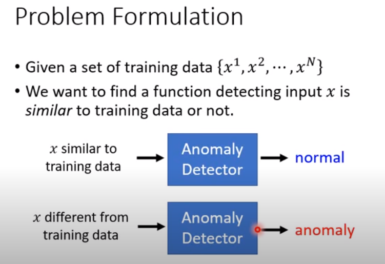

给一个训练集，找到一个函数，使得能检测任意一个输入是否与所给的训练集的数据相似，如果相似，那么就是normal的，如果不相似，那么就是anomaly的。

异常检测有很多应用，例如：

+ Fraud Detection：
  + Trainning Data：正常的刷卡行为，x：盗刷
+ Networking Instrusion Detection
  + Trainning Data：正常连线，x：攻击行为
+ Cancer Detection：
  + Traininng Data：正常细胞，x：癌细胞

#### 基于分类器的异常检测（监督学习）

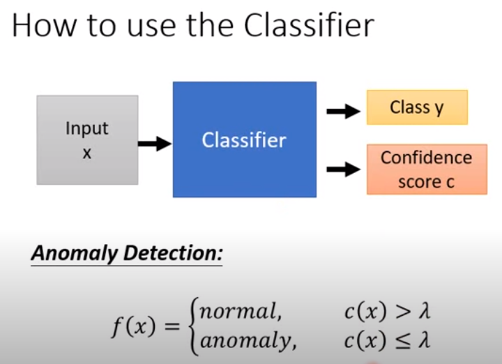

使用DNN做分类器，一般来说，有多少个类，那么就有多少个神经元，最后一层layer输出的是概率，一般取概率最大的作为分类结果。对于一个异常数据，因为训练集大部分为正常数据（甚至全部），这个异常数据在各个神经元的输出上都不是很高。因此设定一个阈值$\lambda$，如果最大值小于这个阈值$\lambda$，那么就被认为是异常。（Confidence score为最大的分数）

但是上面有一个不足，那就是对某些异常数据也给出一个很高的置信分数。那么现在有paper将异常数据加入训练集，训练模型使得对异常数据给出低分数，对于异常数据少的情况，使用GAN来生成数据。

#### 无监督学习

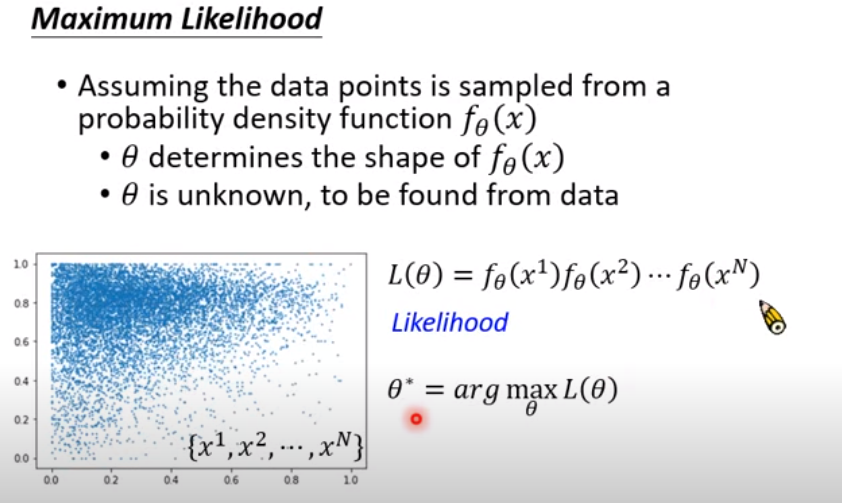

假设数据服从某个f分布，那么使用最大似然估计求出对应的参数，确定出这个分布。

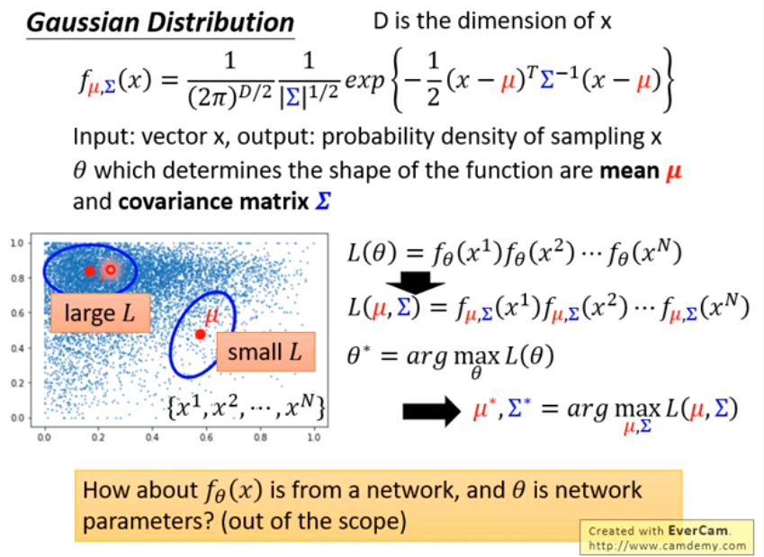

用正态分布举例，通过数据点可以将两个参数计算出，那么这个分布就确定了，对于某个输入就能计算它出现的概率值，根据概率值的大小来确定它是否是异常数据。

#### Auto-encoder

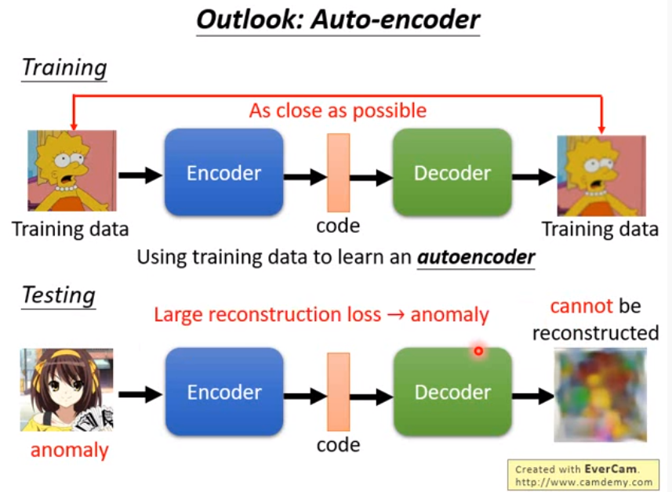

训练一个模型，这个模型对编码后的数据进行重建使得重建后的数据接近编码前的数据。

通过编码重建后的数据与原数据进行对比，根据两者的差值来决定数据是否是异常数据。

因为模型见过的都是正常的数据，因此重建的数据会与原数据非常接近，对于没有见过的数据（不相似的数据、异常的数据），重建出来的数据会与原数据差别非常大。

### 总结

异常检测结合一般来说有三种：

+ reconstruction-based：使用一个DNN来学习一个模型，这个模型会将初始输入encode，然后再由这个encode重构成接近原输入的结构。训练集是正常的数据集，因此这个模型会对与正常的数据相似的输入重构得与原数据非常相似，可以通过计算重构误差来判断数据是否是模型没有见过的数据，即异常数据。
+ representation-based：使用DNN提取特征向量，然后根据这个特征向量来做异常检测
+ one-class classification based：使用DNN来做分类，正常的数据为一类，异常的数据为另一类

异常检测首先需要有正常数据集和异常数据集，正常数据集的大小远大于异常数据集大小（或者说异常数据集几乎没有，当然也可以用GAN生成异常数据）。

## 高斯混合模型（GMM）

混合模型是一个可以用来表示在总体分布（distribution）中含有 K 个子分布的概率模型，换句话说，混合模型表示了观测数据在总体中的概率分布，它是一个由 K 个子分布组成的混合分布。混合模型不要求观测数据提供关于子分布的信息，来计算观测数据在总体分布中的概率。

### 单高斯模型

当样本数据 X 是一维数据（Univariate）时，高斯分布遵从下方概率密度函数（Probability Density Function）：

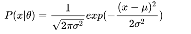

其中$\mu$为数据均值（期望），  $\sigma$为数据标准差。

当样本数据 X 是多维数据（Multivariate）时，高斯分布遵从下方概率密度函数：

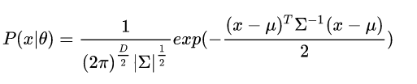

其中，$\mu$ 为数据均值（期望）， $\Sigma$ 为协方差（Covariance），D 为数据维度。

### 高斯混合模型

高斯混合模型可以看作是由 K 个单高斯模型组合而成的模型，这 K 个子模型是混合模型的隐变量（Hidden variable）。一般来说，一个混合模型可以使用任何概率分布，这里使用高斯混合模型是因为高斯分布具备很好的数学性质以及良好的计算性能。

举个不是特别稳妥的例子，比如我们现在有一组狗的样本数据，不同种类的狗，体型、颜色、长相各不相同，但都属于狗这个种类，此时单高斯模型可能不能很好的来描述这个分布，因为样本数据分布并不是一个单一的椭圆，所以用混合高斯分布可以更好的描述这个问题，如下图所示：

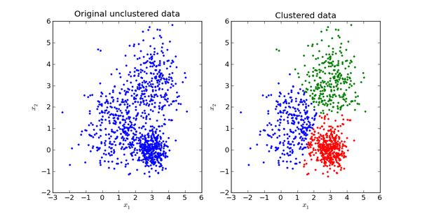

图中的每个点都由K个子模型中的某一个生成。

定义如下：

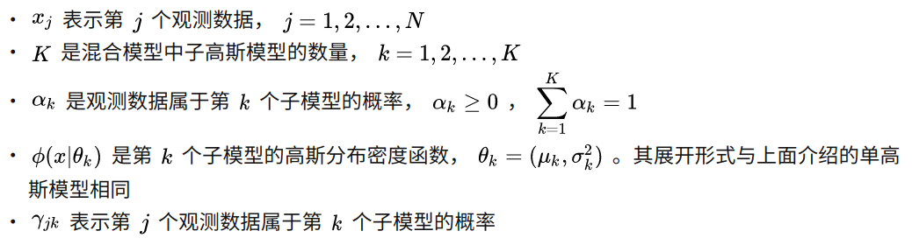

高斯混合模型的概率分布为：

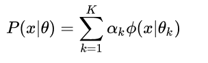

## Deep autoencoding Gaussian mixture model for unsupervised anomaly detection

ICLR 2018

异常检测是区分样本集中的少量异常样本，一般有两个特点：

- 异常样本很少，异常：正常分布很不均衡
- 由于应用范围涵盖很多方面，往往很难获取标签，所以一般都是采用无监督和半监督的方式学习。

本质上，可以认为异常检测的一种思路是通过密度估计找到异常样本的过程，诸如一些传统的聚类算法如K-means，GMM可以被用来异常检测，但这些方法很难推广到高维和多变量数据上。

> GMM为高斯混合模型，即多个高斯分布叠加在一起的模型。

同时也有一些用深度AE网络做的异常检测，**它的前提假设是异常样本在Encoder降维编码后很难再由Decoder重构出来，因为在一批训练数据中，大部分都是由正常样本训练出来的网络参数，异常样本的重构误差会比正常样本的大很多。** 在论文中作者也做了相关实验，如下图：

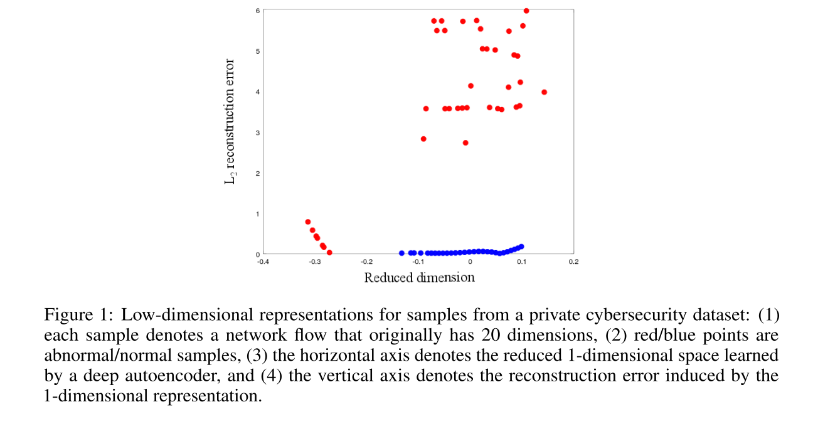

上图中，横轴是应用自编码器将数据压缩到一维空间的坐标，纵轴是数据点的重构误差。图中蓝色点是正常数据点，红色是异常数据点。显然，从图中我们可以看出，右上角这部分异常数据点可以通过重构误差跟其他点区别开来，而左下角这部分异常点则可以在低维特征空间（论文中压缩到了一维）很明显的跟其他点区分开。**这反应出这样一个信息：自编码器中间隐藏层特征（即压缩后的特征）和最后的重构误差对于识别异常都是有用的。这是也论文中关键一步的实验依据**。

从普遍意义上来说，对于高维数据的处理，传统方法分两步，先对高维数据进行降维，将原始数据映射到低维空间，然后在这个低维空间内做密度估计。这种方式存在的问题是：  - 这两个步是相互独立的过程，高维数据降维后的表征很难保留足够多的关键信息。  - 因为这两步是相互独立的，最终可能导致模型陷入局部最优的境地，试想降维过程完全独立于后面密度估计过程，并不知道为后面的密度估计过程保留哪些关键信息。所以这篇文章采用端到端的训练方式，来解决这个问题。

### 模型

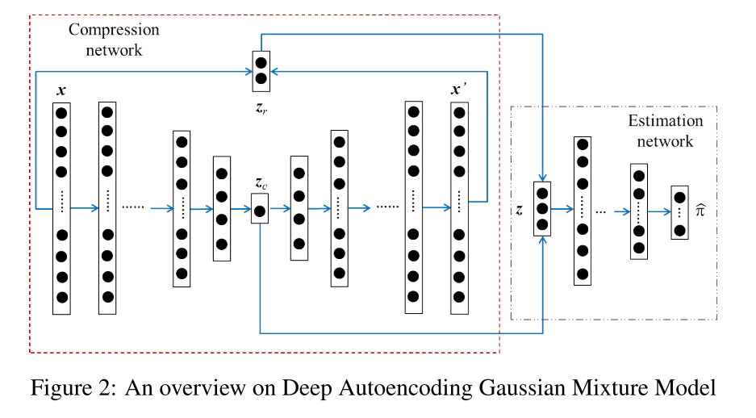

上图为DAGMM的整体网络结构，分两个子结构，左边部分为Compression network，是一个深度自编码网络，通过这个自编码我们可以得到输入x的低维表示 z_c，同时得到输入和重构输出的重构误差z_r。z_c和z_r拼接成z作为Estimation network的输入，经过多层神经网络的计算，得到的输出是一个softmax概率分布，代表各个高斯模型的权重概率，用于求解GMM中单高斯分布系数的分布。

关于重构误差，论文中采用的欧式距离、余弦相似度这两度量结合的方式计算重构误差。也就是实际上z是由[z_c, z_cosine, z_euclidean] concat得到。作者做实验时发现，在原始维度为20维的数据集上，大部分异常样本在低维空间（论文中讲20维降低到1维）上与正常样本有明显的分离，但是存在部分异常样本隐藏在正常样本内，同时这些异常样本在原始的20维空间内，与正常样本又有明显的不同。于是作者计算了所有样本的L2重构误差（欧式距离）。

### GMM参数计算

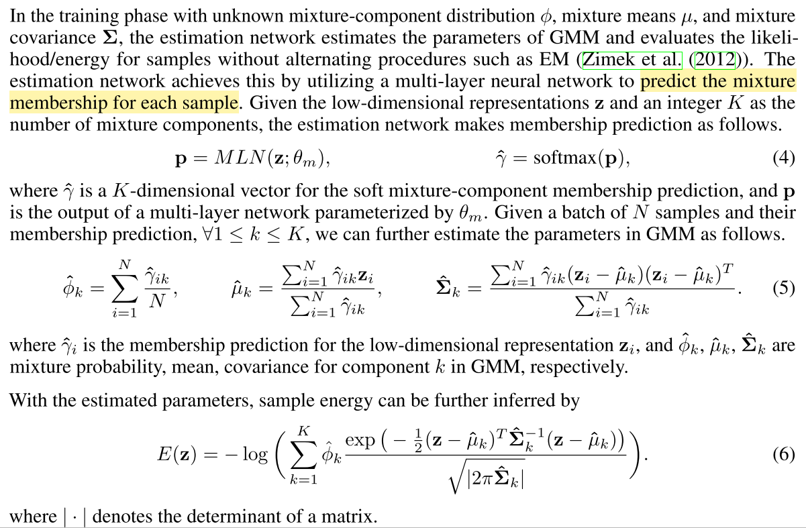

在得到 N 个样本分别归属不同单高斯分布的概率之后，我们可以用来估计 GMM 的几个重要参数：均值、方差、协方差矩阵.

Compression network + Estimation network 的作用就是模拟 GMM 得到样本归属各个 component 的概率，这部分信息进而用来更新 GMM 的参数，计算得到似然函数E(z)。而似然函数E(z)是目标函数的一部分，通过优化目标函数，估计网络的参数也会得到更新。

### 目标函数

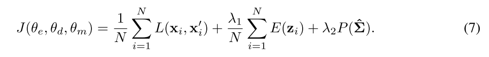

**第一项**：自编码网络的重构误差 

**第二项**：高斯混合模型的似然函数，可以方向更新自编码网络的参数，同时自编码网络又能更新GMM中的均值，协方差等。（为了统一朝着最小化loss的方向优化，在似然函数前添加了一个负号） 

**第三项**：这项的作用是防止 GMM 中的协方差矩阵的对角线上的值变为 0 并最终导致矩阵不可逆

### 实验

#### 数据集

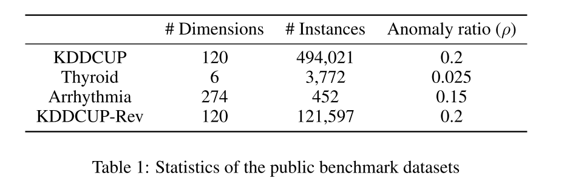

#### 结果

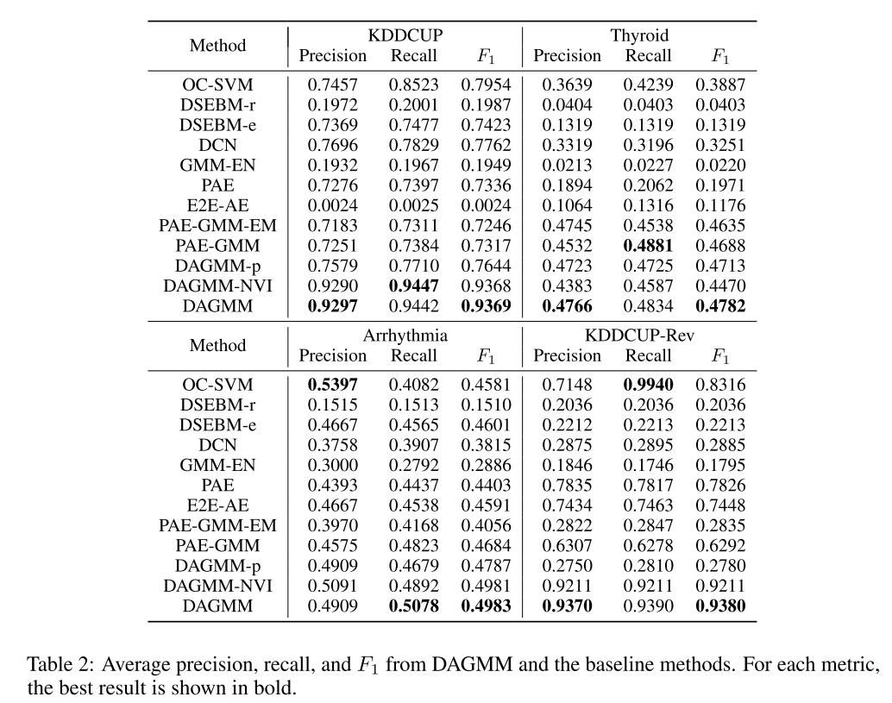

接着在被污染的数据集上测试（一半的数据是正常的数据，一半的数据是由正常的数据与c%的异常数据混合而成）：

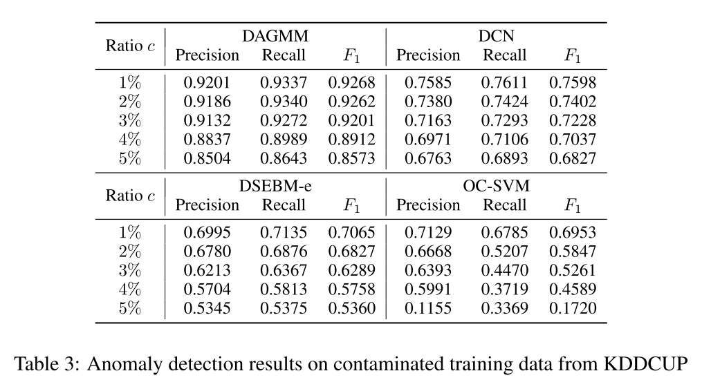

## 关于联邦学习和异常检测

联邦学习研究的是如何在不上传用户的数据的情况下训练模型。

如果跟异常检测相结合，那么场景应该是智能家居这一种。智能家居保留着用户的数据，因为敏感不能上传（或者与其他家居分享数据），那么就无法参与模型的训练。因此可以使用异常检测+联邦学习的方式来解决这个问题。因为无法上传数据的局限性，如果在本地训练异常检测的模型，可能会使模型见过的正常数据的样本、种类少，那么可能出现本来是正常的数据，但是因为不经常在该用户的环境中出现，而被本地模型识别为了异常数据。而联邦学习可以将各个用户的模型联合训练，那么这个正常的数据可能在其他用户的环境中经常出现，那么这个数据就会被全局模型学习到，从而避免将它识别为异常数据。

如果不考虑隐私，联邦学习这一机制也可以用来减少通信量，因为每次训练只需要传模型的参数，而不是数据流。（但是要以降低精确度为代价）