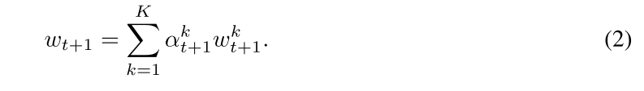
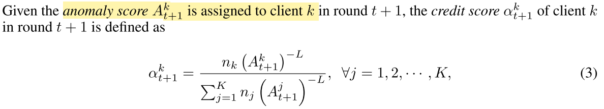
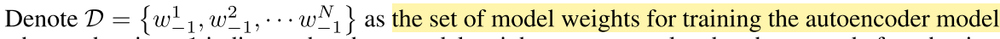
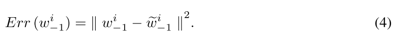
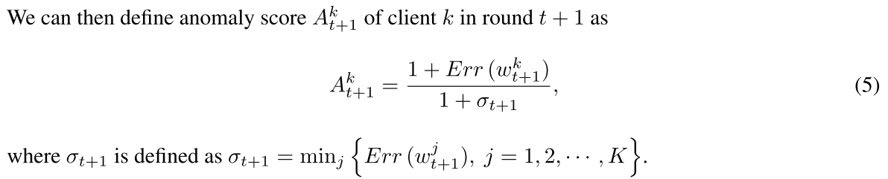
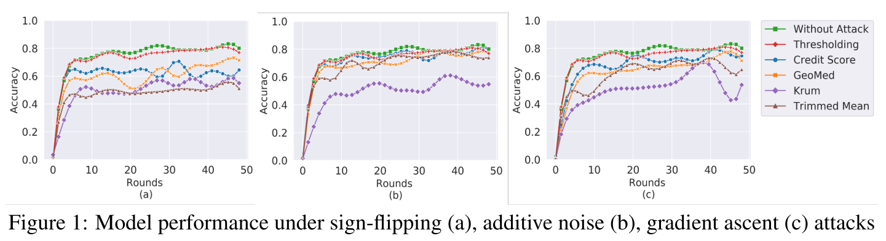
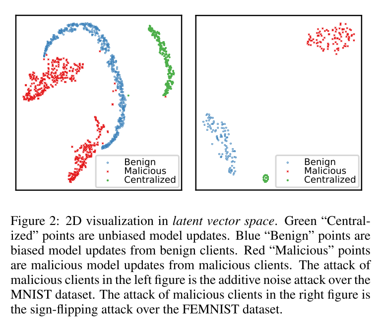
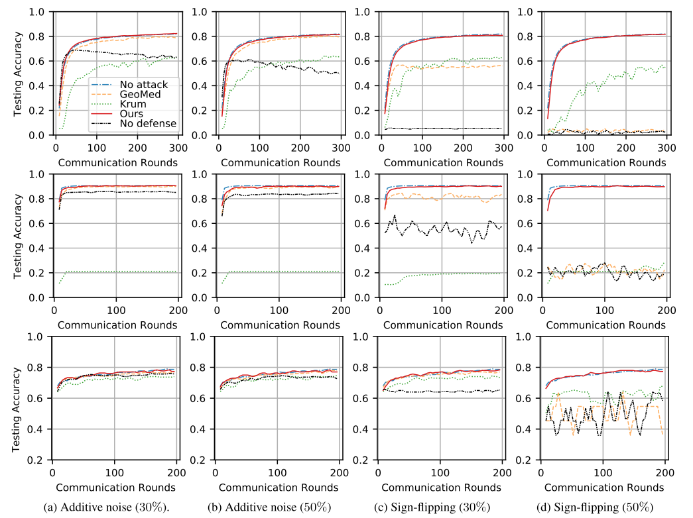

# report08

## Abnormal Client Behavior Detection in Federated Learning

在联邦学习系统中，客户端是自治的，因为它们的行为不完全由服务器控制。因此，客户机可能有意或无意地偏离联邦模型训练的规定过程，从而导致异常行为，例如变成恶意攻击者或出现故障的客户机。因此，及时发现这些异常客户对于将其不利影响降至最低至关重要。因此这篇文章提出了一个用于检测参与联邦学习的客户端异常检测算法。

异常客户端行为可能是故意造成的，例如，由伪装成正常客户端的恶意攻击者造成的，或者是非故意造成的，例如，由具有硬件和/或软件缺陷的客户端造成的。发现此类行为是非常重要的，因为：（1）尽量减少异常客户的影响（2）报告异常客户（3）避免模型泄漏给非预期客户（4）防止向异常客户分配奖励或激励。

这篇文章利用预先训练的异常检测模型来检测异常的客户行为并消除其不利影响。

### The Detection-Based Approach

核心思想在于为每一个客户端分配一个异常评分，这个异常评分跟该客户端异常的概率大小有关，这个异常评分会参与到权重的分配中，当某个客户端的异常评分很高时，他的权重会很小，以至于server不会采纳它上传的本地模型。

下面是聚合权重的计算公式，$\alpha_{t+1}^k$表示权重分配。

其中，$n_k$为第k个client的数据集的大小，$A_{t+1}^k$为第$t+1$轮训练时第k个client的异常评分。$L$是一个超参，需要调节。

从上式可以看出，当某个client的异常评分很高时（意味着它很可能是异常client），那么它上传的本地模型的权重会降低。

### Autoencoder-Based Anomaly Detection

这篇文章使用一个预收集的数据作为训练集：

然后用这些数据训练autoendocer网络，得到一个训练好的auto encoder。

那么对于每一个client上传的权重，都输入到auto encoder里，auto encoder输出重构后的权重$\tilde w$，然后计算出重构误差$Err$，根据$Err$来判断某个client的异常程度：

误差采用MSE（mean squared error），这个误差用于计算异常评分：

除此之外，作者也提出了另一个thresholding的方案，即权重的分配比例只有两种选择$n_k/n$或者0。当异常评分低于某个阈值时，置为$n_k/n$，否则置为0。这个阈值可以选择为所有client的异常评分的均值。

### 实验

数据集：FEMNIST

异常client的比例：30%

制造异常的方法：

+ sign-flipping：将上传的模型参数符号置反
+ additive noise：将上传的数据添加高斯噪声
+ gradient ascent：本地进行梯度上升而不是梯度下降

实验结果如下所示，Thresholding和Credit Score是作者提出的两种方案，可以看出Thresholding方案受攻击的影响程度较少，准确度很接近与未受攻击的FL。

### 缺陷

这篇文章提出将client的权重输入到encoder中后输出重构权重，然后根据重构误差来判断它的异常程度。这有点问题的，因为数据分布的不平衡，某些client上传的权重跟全局模型偏离得确实很远，但是我们不能因此判定它是异常节点，因此是否应该需要根据历史的序列来分析它是否是异常的。

## Learning to Detect Malicious Clients for Robust Federated Learning

arXiv 2020

### abstract

联邦学习系统容易受到来自恶意客户端的攻击。由于系统中的中心服务器无法控制客户端的行为，恶意客户端可能通过向服务器发送恶意模型更新来发起攻击，从而降低学习性能或实施有针对性的模型中毒攻击（又称后门攻击）。因此，及时检测这些恶意模型更新和底层攻击者就变得至关重要。这项工作提出了一个新的健壮联邦学习框架，其中中央服务器学习使用强大的检测模型来检测和重新移动恶意模型更新，从而实现有针对性的防御。

### motiovation

FL系统容易受到恶意客户端的攻击，这已成为其实际部署的主要障碍。在FL系统中，中央服务器不能控制客户机的行为，也不能访问他们的私有数据。因此，合法客户端可以通过发送修改的有害模型更新来欺骗服务器，对全局模型发起对抗性攻击。本文考虑了两种类型的对抗性攻击，即非目标攻击和目标攻击。非目标攻击旨在降低整体模型性能，可视为拜占庭式攻击，导致模型性能退化或模型训练失败。目标攻击（又称后门攻击）旨在修改攻击者选择的某些特定数据实例上的模型行为（例如，将猫的图像识别为狗），同时保持其他数据实例上的模型性能不受影响。非目标攻击和目标攻击都可能导致灾难性后果。因此，必须及时检测攻击者及其有害模型更新，并将其从FL系统中移除，以防止恶意模型损坏和向对手客户分发不适当的激励奖励。

### contribution

本文从一个新的角度研究了对FL系统的对抗性攻击，提出了一个基于光谱异常检测的框架, 基于低维嵌入检测异常模型更新，其中去除噪声和无关特征，同时保留基本特征。文章表明，在这样一个低维的潜在特征空间中，来自客户端的异常（即恶意）模型更新很容易被区分，因为它们的基本特征与正常更新的显著不同，从而导致有针对性的防御。

这篇文章是第一个采用光谱异常检测鲁棒FL系统。光谱异常检测框架提供了三个好处。首先，它适用于无监督和半监督两种情况，这使得它特别适合于恶意模型更新未知且无法事先准确预测的FL场景。第二，光谱异常检测模型使用动态阈值的变分自动编码器（VAE）。由于检测阈值仅在收到来自所有客户端的模型更新后确定，攻击者无法事先了解检测机制。第三，通过检测和删除中心服务器中的恶意更新，可以完全消除其负面影响。

### 内容

使用光谱异常检测来检测低维嵌入中的异常或恶意模型更新。这些嵌入有望保留捕获数据实例中基本变量的重要特性。其思想是在去除数据实例中的噪声和冗余特征后，在低维的潜在空间中很容易区分正常数据实例和异常数据实例的嵌入。一种有效的逼近低维嵌入的方法是采用编解码结构训练模型。编码器模块以原始数据实例为输入，输出低维嵌入。反编码模块然后接受嵌入，在此基础上重构原始数据实例并产生重构错误。然后利用重构误差对编解码模型参数进行优化，直至收敛。因此，该模型在对正常情况进行训练后，可以识别异常情况，因为异常情况会引发比正常情况更高的重建误差。

上图可以看出，映射到低维空间上后，可以明显地区分出异常的特征和良性的特征。

在得到频谱异常检测模型后，将其应用于每一轮FL模型训练中，检测恶意客户端更新。通过编码和解码，每个客户端的更新都会产生一个重构错误。恶意更新会导致比良性更新更大的重建错误。此重建错误是检测恶意更新的关键。

在每一轮通信中，我们将检测阈值设置为所有重建误差的平均值，从而得到一种动态阈值策略。重建错误高于阈值的更新被视为恶意更新，并从聚合步骤中排除。聚类过程只考虑良性更新，每个良性更新的权重根据其本地训练数据集的大小进行分配。请注意，我们的聚合规则与FedAvg算法之间的唯一区别是，我们在模型聚合步骤中排除了一定数量的恶意客户端。因此，该方法与FedAvg算法具有相同的收敛性[McMahan等人，2017；Li等人，2019e]。

### 实验

数据集：

+ MNIST
+ FEMNIST
+ Sentiment140

benchmark schemes:

+ GeoMed：GeoMed方法使用局部模型更新（包括恶意更新）的几何中值（GeoMed）生成全局模型更新，该几何中值可能不是局部模型更新之一
+ Krum：Krum只使用某个client 的update