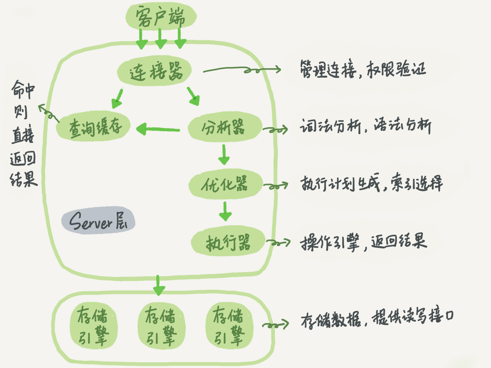

# MYSQL

## 基础架构：一条SQL查询语句是如何执行的？



### 连接器

就是登陆界面，输入`mysql -u root -p`命令的，进行登陆验证。

### 查询缓存

大多数情况不建议使用查询缓存，因为查询缓存的失效非常频繁，只要有对一个表的更新，这个表上所有的查询缓存都会被清空。

> MySQL 8.0 版本直接将查询缓存的整块功能删掉了

### 分析器

词法分析+语法分析。

### 优化器

优化器是在表里面有多个索引的时候，决定使用哪个索引；或者在一个语句有多表关联（join）的时候，决定各个表的连接顺序。

### 执行器

开始执行的时候，要先判断一下你对这个表 T 有没有执行查询的权限，如果没有，就会返回没有权限的错误，如下所示 (在工程实现上，如果命中查询缓存，会在查询缓存返回结果的时候，做权限验证。查询也会在优化器之前调用 precheck 验证权限)。

> 你会在数据库的慢查询日志中看到一个 rows_examined 的字段，表示这个语句执行过程中扫描了多少行。这个值就是在执行器每次调用引擎获取数据行的时候累加的。

> 如果表 T 中没有字段 k，而你执行了这个语句 select * from T where k=1, 那肯定是会报“不存在这个列”的错误，这个阶段是分析器。

## 一条SQL语句是如何执行的？

### redo log


write pos 是当前记录的位置，一边写一边后移。checkpoint 是当前要擦除的位置，擦除记录前要把记录更新到数据文件。

redo log是引擎层的日志。

### bin log

bin log是server层的日志。


> 扩容、搭建备库的时候一般采用全量备份+binlog实现的。

> 两阶段提交是为了保证两个log的一致性。

## undo log

undo log在MVCC中起着非常重要的作用。那么回滚日志什么时候删除呢？答案是，在不需要的时候才删除，就是当系统里没有比这个回滚日志更早的 read-view 的时候。所以建议尽量不要使用长事务。

长事务的缺点：

+ 长事务意味着系统里面会存在很老的事务视图。由于这些事务随时可能访问数据库里面的任何数据，所以这个事务提交之前，数据库里面它可能用到的回滚记录都必须保留，这就会导致大量占用存储空间。
+ 占用锁资源。

## 事务的驱动方式

+ 显式启动事务语句， begin 或 start transaction。配套的提交语句是 commit，回滚语句是 rollback。
+ set autocommit=0（默认），这个命令会将这个线程的自动提交关掉。意味着如果你只执行一个 select 语句，这个事务就启动了，而且并不会自动提交。这个事务持续存在直到你主动执行 commit 或 rollback 语句，或者断开连接。（这就可能导致长事务）

### 如何避免长事务的影响？

开发端：

+ 确认是否使用了 set autocommit=0。这个确认工作可以在测试环境中开展，把 MySQL 的 general_log 开起来，然后随便跑一个业务逻辑，通过 general_log 的日志来确认。一般框架如果会设置这个值，也就会提供参数来控制行为，你的目标就是把它改成 1。
+ 确认是否有不必要的只读事务。有些框架会习惯不管什么语句先用 begin/commit 框起来。我见过有些是业务并没有这个需要，但是也把好几个 select 语句放到了事务中。这种只读事务可以去掉。
+ 业务连接数据库的时候，根据业务本身的预估，通过 SET MAX_EXECUTION_TIME 命令，来控制每个语句执行的最长时间，避免单个语句意外执行太长时间。（为什么会意外？在后续的文章中会提到这类案例）

数据库端：

+ 监控 information_schema.Innodb_trx 表，设置长事务阈值，超过就报警 / 或者 kill；
+ Percona 的 pt-kill 这个工具不错，推荐使用；
+ 在业务功能测试阶段要求输出所有的 general_log，分析日志行为提前发现问题；
+ 如果使用的是 MySQL 5.6 或者更新版本，把 innodb_undo_tablespaces 设置成 2（或更大的值）。如果真的出现大事务导致回滚段过大，这样设置后清理起来更方便。

## 索引

什么时候使用业务字段做主键？（业务字段不是自增，容易发生页分裂）

答：只有一个索引的时候。因为业务字段做主键空间很大，如果有其他索引的话，二级索引的叶子节点将占用很大空间。

> 实现覆盖索引的最直接的办法就是组合索引。

### 组合索引、覆盖索引

### 索引下推

假设组合索引为(name, age)，有一下查询：

```sql
select * from tuser where name like '张%' and age=10 and ismale=1;
```

根据前缀索引规则，这个语句在搜索索引树的时候，只能用 “张”。在 MySQL 5.6 之前，只能从 ID3 开始一个个回表。到主键索引上找出数据行，再对比字段值。而 MySQL 5.6 引入的索引下推优化（index condition pushdown)， 可以在索引遍历过程中，对索引中包含的字段先做判断，直接过滤掉不满足条件的记录，减少回表次数。

也就是说，索引下推会利用age这个信息。

如下图所示：

+ 无索引下推：


+ 索引下推：

  

> 一个问题：
>
> 一张表如下所示：
>
> ```sql
> CREATE TABLE `geek` (
>   `a` int(11) NOT NULL,
>   `b` int(11) NOT NULL,
>   `c` int(11) NOT NULL,
>   `d` int(11) NOT NULL,
>   PRIMARY KEY (`a`,`b`),
>   KEY `c` (`c`),
>   KEY `ca` (`c`,`a`),
>   KEY `cb` (`c`,`b`)
> ) ENGINE=InnoDB;
> ```
>
> 上面哪个索引是多余的？答案是ca。
>
> 因为普通索引c的叶子节点就是主键(a, b)，因此可以视为组合索引(c, a, b)，因此ca这个索引是没有必要的。
>
> cb索引的作用举个例子：
>
> ```sql
> select * from geek where c=N order by b limit 1;
> ```

## 全局锁和表锁

MySQL 里面的锁大致可以分成全局锁、表级锁和行锁三类。

### 全局锁

MySQL 提供了一个加全局读锁的方法，命令是 Flush tables with read lock (FTWRL)。

全局锁的典型使用场景是，做全库逻辑备份。

但是让整库都只读，听上去就很危险：

+ 如果你在主库上备份，那么在备份期间都不能执行更新，业务基本上就得停摆；
+ 如果你在从库上备份，那么备份期间从库不能执行主库同步过来的 binlog，会导致主从延迟。

全局锁是为了保证一致性，那么MVCC的快照读的机制能否用于备份场景呢？

官方自带的逻辑备份工具是 mysqldump。当 mysqldump 使用参数–single-transaction 的时候，导数据之前就会启动一个事务，来确保拿到一致性视图。而由于 MVCC 的支持，这个过程中数据是可以正常更新的。

你一定在疑惑，有了这个功能，为什么还需要 FTWRL 呢？一致性读是好，但前提是引擎要支持这个隔离级别。比如，对于 MyISAM 这种不支持事务的引擎，如果备份过程中有更新，总是只能取到最新的数据，那么就破坏了备份的一致性。这时，我们就需要使用 FTWRL 命令了。

所以，single-transaction 方法只适用于所有的表使用事务引擎的库。如果有的表使用了不支持事务的引擎，那么备份就只能通过 FTWRL 方法。这往往是 DBA 要求业务开发人员使用 InnoDB 替代 MyISAM 的原因之一。

你也许会问，既然要全库只读，为什么不使用 `set global readonly=true` 的方式呢？确实 readonly 方式也可以让全库进入只读状态，但我还是会建议你用 FTWRL 方式，主要有两个原因：

+ 一是，在有些系统中，readonly 的值会被用来做其他逻辑，比如用来判断一个库是主库还是备库。因此，修改 global 变量的方式影响面更大，我不建议你使用。
+ 二是，在异常处理机制上有差异。如果执行 FTWRL 命令之后由于客户端发生异常断开，那么 MySQL 会自动释放这个全局锁，整个库回到可以正常更新的状态。而将整个库设置为 readonly 之后，如果客户端发生异常，则数据库就会一直保持 readonly 状态，这样会导致整个库长时间处于不可写状态，风险较高。

### 表级锁

MySQL 里面表级别的锁有两种：一种是表锁，一种是元数据锁（meta data lock，MDL)。

表锁的语法是 lock tables … read/write。与 FTWRL 类似，可以用 unlock tables 主动释放锁，也可以在客户端断开的时候自动释放。

需要注意，lock tables 语法除了会限制别的线程的读写外，也限定了本线程接下来的操作对象。

举个例子, 如果在某个线程 A 中执行 lock tables t1 read, t2 write; 这个语句，则其他线程写 t1、读写 t2 的语句都会被阻塞。同时，线程 A 在执行 unlock tables 之前，也只能执行读 t1、读写 t2 的操作。连写 t1 都不允许，自然也不能访问其他表。

另一类表级的锁是 MDL（metadata lock)。MDL 不需要显式使用，在访问一个表的时候会被自动加上。当对一个表做增删改查操作的时候，加 MDL 读锁；当要对表做结构变更操作的时候，加 MDL 写锁。

+ 读锁之间不互斥，因此你可以有多个线程同时对一张表增删改查。
+ 读写锁之间、写锁之间是互斥的，用来保证变更表结构操作的安全性。因此，如果有两个线程要同时给一个表加字段，其中一个要等另一个执行完才能开始执行。

> 如何安全地给小表加字段？
>
> 首先我们要解决长事务，事务不提交，就会一直占着 MDL 锁。在 MySQL 的 information_schema 库的 innodb_trx 表中，你可以查到当前执行中的事务，可以先暂停DDL，或者直接kill掉。
>
> 但考虑一下这个场景。如果你要变更的表是一个热点表，虽然数据量不大，但是上面的请求很频繁，而你不得不加个字段，你该怎么做呢？
>
> 这时候 kill 可能未必管用，因为新的请求马上就来了。比较理想的机制是，在 alter table 语句里面设定等待时间，如果在这个指定的等待时间里面能够拿到 MDL 写锁最好，拿不到也不要阻塞后面的业务语句，先放弃。

## 怎么减少行锁对性能的影响？

MySQL 的行锁是在引擎层由各个引擎自己实现的。但并不是所有的引擎都支持行锁，比如 MyISAM 引擎就不支持行锁。

### 两阶段锁

在 InnoDB 事务中，行锁是在需要的时候才加上的，但并不是不需要了就立刻释放，而是要等到事务结束时才释放。这个就是两阶段锁协议。

因此，如果你的事务中需要锁多个行，要把最可能造成锁冲突、最可能影响并发度的锁尽量往后放。

### 死锁

当出现死锁以后，有两种策略：

+ 一种策略是，直接进入等待，直到超时。这个超时时间可以通过参数 innodb_lock_wait_timeout 来设置。
+ 另一种策略是，发起死锁检测，发现死锁后，主动回滚死锁链条中的某一个事务，让其他事务得以继续执行。将参数 innodb_deadlock_detect 设置为 on，表示开启这个逻辑。

第一种策略需要设置超时时间，设置过长，对于在线服务是致命的，设置过短，对于普通的锁等待容易误伤（可能在等很短时间就获得了）。

所以，正常情况下我们还是要采用第二种策略，即：主动死锁检测，而且 innodb_deadlock_detect 的默认值本身就是 on。主动死锁检测在发生死锁的时候，是能够快速发现并进行处理的，但是它也是有额外负担的。（判断是否循环等待）

那如果是我们上面说到的所有事务都要更新同一行的场景呢？

每个新来的被堵住的线程，都要判断会不会由于自己的加入导致了死锁，这是一个时间复杂度是 O(n) 的操作。假设有 1000 个并发线程要同时更新同一行，那么死锁检测操作就是 100 万这个量级的。虽然最终检测的结果是没有死锁，但是这期间要消耗大量的 CPU 资源。

根据上面的分析，我们来讨论一下，怎么解决由这种热点行更新导致的性能问题呢？问题的症结在于，死锁检测要耗费大量的 CPU 资源。

一个思路是控制并发度，需要做在数据库服务端。如果你有中间件，可以考虑在中间件实现；如果你的团队有能修改 MySQL 源码的人，也可以做在 MySQL 里面。基本思路就是，对于相同行的更新，在进入引擎之前排队。这样在 InnoDB 内部就不会有大量的死锁检测工作了。

如果团队里暂时没有数据库方面的专家，不能实现这样的方案，能不能从设计上优化这个问题呢？

你可以考虑通过将一行改成逻辑上的多行来减少锁冲突。还是以影院账户为例，可以考虑放在多条记录上，比如 10 个记录，影院的账户总额等于这 10 个记录的值的总和。这样每次要给影院账户加金额的时候，随机选其中一条记录来加。这样每次冲突概率变成原来的 1/10，可以减少锁等待个数，也就减少了死锁检测的 CPU 消耗。

> 一个小问题：
>
> 如果你要删除一个表里面的前 10000 行数据，有以下三种方法可以做到：
>
> + 第一种，直接执行 delete from T limit 10000;
> + 第二种，在一个连接中循环执行 20 次 delete from T limit 500;
> + 第三种，在 20 个连接中同时执行 delete from T limit 500。
>
> 哪种方法更好？
>
> 第二种相对较好。
>
> 第一种的时间比较长，为长事务，长事务会导致主从延迟。
>
> 第三种方式可能会导致锁冲突。

## 事务的隔离

> begin/start transaction 命令并不是一个事务的起点，在执行到它们之后的第一个操作 InnoDB 表的语句，事务才真正启动。如果你想要马上启动一个事务，可以使用 start transaction with consistent snapshot 这个命令。


注意，事务C设置了自动提交。A读到的k值为1，B为3。

注意，MVCC的活跃事务ID列表是在事务开启时生成的。并且对于B来说，update会执行当前读操作，并且这个操作将数据行的trx_id修改为自己的事务id，因此后续的快照读能读到最新的值3，即能读到事务C的修改（贡献了1）。


这种情况要考虑行锁的问题了，别忘了。

## 普通索引和唯一索引应该如何选择？

> 不要将占用空间大的字段作为主键，因为所有的二级索引的叶子节点都存储着主键值。

对于查询过程来讲，唯一索引因为唯一性的约束，当查找到一个记录后就不需要往后找了，而普通索引仍需要往后找。两者的性能差距微乎其微。

但是考虑内存不命中的情况：

因为唯一索引有唯一性的约束，当插入一条记录时，因为内存未命中，只能去磁盘中取出放入内存检查唯一性；而普通索引不需要检查唯一性，只需要做个记录即可，然后找个时机merge到磁盘上。

change buffer就是用来记录普通索引的更新问题，但是因为唯一性的约束，不能作用于主键索引和唯一索引。

因此，对于写多读少的场景（账单、日志），用普通索引会好很多；而对于“写入之后马上做查询”的场景，用唯一索引会更好，因为写入之后，更新在change buffer中，然后马上访问，就会触发merge过程，那么io次数不会减少，反而增加了负担。

> 如果某次写入使用了 change buffer 机制，之后主机异常重启，是否会丢失 change buffer 和数据？
>
> 这个问题的答案是不会丢失，虽然是只更新内存，但是在事务提交的时候，我们把 change buffer 的操作也记录到 redo log 里了，所以崩溃恢复的时候，change buffer 也能找回来。

merge 的执行流程是这样的：

+ 从磁盘读入数据页到内存（老版本的数据页）；
+ 从 change buffer 里找出这个数据页的 change buffer 记录 (可能有多个），依次应用，得到新版数据页；
+ 写 redo log。这个 redo log 包含了数据的变更和 change buffer 的变更。

## 怎么给字符串字段加索引？

前缀索引。

比如，这两个在 email 字段上创建索引的语句：

```sql
alter table SUser add index index1(email);
alter table SUser add index index2(email(6));
```

那么两种索引的结构如下：


前缀索引带来的好处是减少空间，坏处就是可能会增加搜索次数。

那么，当要给字符串创建前缀索引时，有什么方法能够确定我应该使用多长的前缀呢？

实际上，我们在建立索引时关注的是区分度，区分度越高越好。因为区分度越高，意味着重复的键值越少。因此，我们可以通过统计索引上有多少个不同的值来判断要使用多长的前缀。

例如使用一下语句查看区分度：

```sql
select 
  count(distinct left(email,4)）as L4,
  count(distinct left(email,5)）as L5,
  count(distinct left(email,6)）as L6,
  count(distinct left(email,7)）as L7,
from SUser;
```

但是要注意，如果使用了前缀索引，那么将不会使用覆盖索引。

因为前缀索引树中key值并不是字段的全部，因此需要回主键索引上检查当前字段是否真的满足查询条件。

如果前缀的区分度不高，区分度高的字段在别处怎么办？

+ 使用倒序存储：

  ```sql
  select field_list from t where id_card = reverse('input_id_card_string');
  ```

+ 单独加一个hash字段，在这个字段上添加索引

要注意，他们都不支持范围查询。

## count(*)这么慢，该怎么办？

count的实现方式：

+ MyISAM 引擎把一个表的总行数存在了磁盘上，因此执行 count(\*) 的时候会直接返回这个数，效率很高；
+ 而 InnoDB 引擎就麻烦了，它执行 count(\*) 的时候，需要把数据一行一行地从引擎里面读出来，然后累积计数。

这里需要注意的是，上述讨论的是没有过滤条件的 count(*)，如果加了 where 条件的话，MyISAM 表也是不能返回得这么快的。

那为什么 InnoDB 不跟 MyISAM 一样，也把数字存起来呢？

这是因为即使是在同一个时刻的多个查询，由于多版本并发控制（MVCC）的原因，InnoDB 表“应该返回多少行”也是不确定的。

> 注意，show table status显示的行数不准确，是通过采样得到的。

那么是否可以使用缓存的思想来缓存count呢？例如用redis？然而可能导致不一致的情况。无论是先修改redis后修改数据库还是先修改数据库后修改redis，这两个操作都不是原子的。（例如读写问题，A先修改计数，然后B读取数据，A再插入数据，那么B读取到的计数是错误的。）

可以考虑用创建一张计数表，所有的加减操作都更新这张计数表。因为MVCC的机制，一个事务还未提交，那么他做的修改无论是插入主表的数据还是更新计数的操作，这些都对其他正在执行的事务不可见。

## 不同的count的用法

count() 是一个聚合函数，对于返回的结果集，一行行地判断，如果 count 函数的参数不是 NULL，累计值就加 1，否则不加。最后返回累计值。

所以，count(*)、count(主键 id) 和 count(1) 都表示返回满足条件的结果集的总行数；而 count(字段），则表示返回满足条件的数据行里面，参数“字段”不为 NULL 的总个数。

至于分析性能差别的时候，你可以记住这么几个原则：

1、server 层要什么就给什么；

2、InnoDB 只给必要的值；

3、现在的优化器只优化了 count(*) 的语义为“取行数”，其他“显而易见”的优化并没有做。

对于 count(主键 id) 来说，InnoDB 引擎会遍历整张表，把每一行的 id 值都取出来，返回给 server 层。server 层拿到 id 后，判断是不可能为空的，就按行累加。

对于 count(1) 来说，InnoDB 引擎遍历整张表，但不取值。server 层对于返回的每一行，放一个数字“1”进去，判断是不可能为空的，按行累加。

> 单看这两个用法的差别的话，你能对比出来，count(1) 执行得要比 count(主键 id) 快。因为从引擎返回 id 会涉及到解析数据行，以及拷贝字段值的操作。

对于 count(字段) 来说：

+ **如果这个“字段”是定义为 not null 的话，一行行地从记录里面读出这个字段，判断不能为 null，按行累加；**
+ **如果这个“字段”定义允许为 null，那么执行的时候，判断到有可能是 null，还要把值取出来再判断一下，不是 null 才累加。**

也就是前面的第一条原则，server 层要什么字段，InnoDB 就返回什么字段。

但是 count(\*) 是例外，并不会把全部字段取出来，而是专门做了优化，不取值。count(\*) 肯定不是 null，按行累加。

所以结论是：按照效率排序的话，count(字段)<count(主键 id)<count(1)≈count(\*)，所以我建议你，尽量使用 count(\*)。

## 崩溃恢复


如果时间点A崩溃了，binlog没有写入，那么事务肯定是需要回滚的。

那么如果时间点B崩溃了，恢复后应该怎么做呢？

我们先来看一下崩溃恢复时的判断规则。

+ 如果 redo log 里面的事务是完整的，也就是已经有了 commit 标识，则直接提交；
+ 如果 redo log 里面的事务只有完整的 prepare，则判断对应的事务 binlog 是否存在并完整：
  +  如果是，则提交事务；
  +  否则，回滚事务。

因此时间点B时binlog已经完整地写入了，因此崩溃恢复后会提交事务。

### MySQL怎么知道binlog是完整的？

回答：一个事务的 binlog 是有完整格式的：

+ statement 格式的 binlog，最后会有 COMMIT；
+ row 格式的 binlog，最后会有一个 XID event。

另外，在 MySQL 5.6.2 版本以后，还引入了 binlog-checksum 参数，用来验证 binlog 内容的正确性。对于 binlog 日志由于磁盘原因，可能会在日志中间出错的情况，MySQL 可以通过校验 checksum 的结果来发现。

### redo log和binlog是怎么关联的？

回答：它们有一个共同的数据字段，叫 XID。崩溃恢复的时候，会按顺序扫描 redo log：

+ 如果碰到既有 prepare、又有 commit 的 redo log，就直接提交；
+ 如果碰到只有 parepare、而没有 commit 的 redo log，就拿着 XID 去 binlog 找对应的事务。

### 处于 prepare 阶段的 redo log 加上完整 binlog，重启就能恢复，MySQL 为什么要这么设计?

回答：在时刻 B，也就是 binlog 写完以后 MySQL 发生崩溃，这时候 binlog 已经写入了，之后就会被从库（或者用这个 binlog 恢复出来的库）使用。

所以，在主库上也要提交这个事务。采用这个策略，主库和备库的数据就保证了一致性。

> 可以这样理解：两阶段提交是为了保证redo log和binlog之间的一致性。主库上的redo log用于自身的崩溃恢复，而binlog用于同步备库。因此在时间点B崩溃时，binlog已经写入，那么备库的事务肯定是要提交的，因此主库也需要提交。

### 如果这样的话，为什么还要两阶段提交呢？干脆先 redo log 写完，再写 binlog。崩溃恢复的时候，必须得两个日志都完整才可以。是不是一样的逻辑？

对于innodb引擎来说，如果redo log提交了，那么事务就不能回滚了，所以就引入了prepare中间状态。

### 不引入两个日志，也就没有两阶段提交的必要了。只用 binlog 来支持崩溃恢复，又能支持归档，不就可以了？

不行，因为binlog无法恢复数据页中的数据。

因为redo log有checkpoint和write pos，可以通过redo log了解到哪些数据是还没有刷盘的（未刷盘的数据就是checkpoint->write pos），但是binlog就不会记录这些信息。因此崩溃后进行恢复，查看binlog无法得知哪些事务已经刷盘了，哪些没有，因此无法做恢复。（关键在于，引擎认为写入内存和redo log（commmit）就认为事务已经提交成功了，因此数据可能还没有被刷盘）。

### 那能不能反过来，只用 redo log，不要 binlog？

回答：如果只从崩溃恢复的角度来讲是可以的。你可以把 binlog 关掉，这样就没有两阶段提交了，但系统依然是 crash-safe 的。

但是binlog有着redo log无法替代的功能：

一个是归档。redo log 是循环写，写到末尾是要回到开头继续写的。这样历史日志没法保留，redo log 也就起不到归档的作用。

一个就是 MySQL 系统依赖于 binlog，比如同步。

### 正常运行中的实例，数据写入后的最终落盘，是从 redo log 更新过来的还是从 buffer pool 更新过来的呢？

实际上，redo log 并没有记录数据页的完整数据，所以它并没有能力自己去更新磁盘数据页，也就不存在“数据最终落盘，是由 redo log 更新过去”的情况。

+ 如果是正常运行的实例的话，数据页被修改以后，跟磁盘的数据页不一致，称为脏页。最终数据落盘，就是把内存中的数据页写盘。这个过程，甚至与 redo log 毫无关系。
+ 在崩溃恢复场景中，InnoDB 如果判断到一个数据页可能在崩溃恢复的时候丢失了更新，就会将它读到内存，然后让 redo log 更新内存内容。更新完成后，内存页变成脏页，就回到了第一种情况的状态。

## order by

当需要外部排序的时候，一般有两种方式，一是全字段排序，二是rowid排序（rowid一般指主键）。

全字段排序如下：


rowid排序如下：


全字段方式内存占用大，而rowid方式io次数多。

一个小问题：

假设你的表里面已经有了 city_name(city, name) 这个联合索引，然后你要查杭州和苏州两个城市中所有的市民的姓名，并且按名字排序，显示前 100 条记录。如果 SQL 查询语句是这么写的 ：

```sql
select * from t where city in ('杭州',"苏州") order by name limit 100;
```

那么，这个语句执行的时候会有排序过程吗？

答：虽然有 (city,name) 联合索引，对于单个 city 内部，name 是递增的。但是由于这条 SQL 语句不是要单独地查一个 city 的值，而是同时查了"杭州"和" 苏州 "两个城市，因此所有满足条件的 name 就不是递增的了。也就是说，这条 SQL 语句需要排序。

如果业务端代码由你来开发，需要实现一个在数据库端不需要排序的方案，你会怎么实现呢？

答：这里，我们要用到 (city,name) 联合索引的特性，把这一条语句拆成两条语句，执行流程如下：

1、执行 `select * from t where city=“杭州” order by name limit 100;` 这个语句是不需要排序的，客户端用一个长度为 100 的内存数组 A 保存结果。

2、执行 `select * from t where city=“苏州” order by name limit 100;` 用相同的方法，假设结果被存进了内存数组 B。

3、现在 A 和 B 是两个有序数组，然后你可以用归并排序的思想，得到 name 最小的前 100 值，就是我们需要的结果了。

当然，如果全字段很长，也可以只查id、name，筛选出钱100个id，然后再回数据中查。

## 为什么这些SQL语句逻辑相同，性能却差异巨大？

### 案例一：条件字段函数操作

假设你现在维护了一个交易系统，其中交易记录表 tradelog 包含交易流水号（tradeid）、交易员 id（operator）、交易时间（t_modified）等字段。为了便于描述，我们先忽略其他字段。这个表的建表语句如下：

```sql
CREATE TABLE `tradelog` (
  `id` int(11) NOT NULL,
  `tradeid` varchar(32) DEFAULT NULL,
  `operator` int(11) DEFAULT NULL,
  `t_modified` datetime DEFAULT NULL,
  PRIMARY KEY (`id`),
  KEY `tradeid` (`tradeid`),
  KEY `t_modified` (`t_modified`)
) ENGINE=InnoDB DEFAULT CHARSET=utf8mb4;
```

假设，现在已经记录了从 2016 年初到 2018 年底的所有数据，运营部门有一个需求是，要统计发生在所有年份中 7 月份的交易记录总数。这个逻辑看上去并不复杂，你的 SQL 语句可能会这么写：

```sql
select count(*) from tradelog where month(t_modified)=7;
```

但是这条查询语句并不会走索引，因为对字段做了函数统计。

那么原因是什么呢？回想一下b+树的结构：


如果你的 SQL 语句条件用的是 where t_modified='2018-7-1’的话，引擎就会按照上面绿色箭头的路线，快速定位到 t_modified='2018-7-1’需要的结果。

实际上，B+ 树提供的这个快速定位能力，来源于同一层兄弟节点的有序性。

但是，如果计算 month() 函数的话，你会看到传入 7 的时候，在树的第一层就不知道该怎么办了。

也就是说，对索引字段做函数操作，可能会破坏索引值的有序性，因此优化器就决定放弃走树搜索功能。

但是优化器并不一定放弃这个索引，它可能还是会选择走t_modified索引，但是没有使用key值的有序性进行查找，而是遍历。（索引explain可能还是会看到use index）。

### 案例二：隐式类型转换

我们一起看一下这条 SQL 语句：

```sql
select * from tradelog where tradeid=110717;
```

交易编号 tradeid 这个字段上，本来就有索引，但是 explain 的结果却显示，这条语句需要走全表扫描。你可能也发现了，tradeid 的字段类型是 varchar(32)，而输入的参数却是整型，所以需要做类型转换。

对于优化器来说，这个语句相当于：

```sql
select * from tradelog where  CAST(tradid AS signed int) = 110717;
```

也就是说，这条语句触发了我们上面说到的规则：对索引字段做函数操作，优化器会放弃走树搜索功能。

**在 MySQL 中，字符串和数字做比较的话，是将字符串转换成数字。**

因此，假设id字段类型为int，如果执行下面的语句，还是会走索引的：

```sql
select * from tradelog where id="83126";
```

因为字符串和数字做比较，会将字符串转换成数字，因此只会对右式进行转换，不会对字段进行转换，因此还是会走索引。

### 案例三：隐式字符编码转换

如果有多张表联合，其中某些表之间的字符编码不同，那么会做隐式的编码转换，例如：

```sql
select * from trade_detail where tradeid=$L2.tradeid.value; 
```

会转换成：

```sql
select * from trade_detail  where CONVERT(traideid USING utf8mb4)=$L2.tradeid.value; 
```

这就再次触发了我们上面说到的原则：对索引字段做函数操作，优化器会放弃走树搜索功能。

那么如何优化呢？我们可以提前做好转换，在右式上做转换，而不是左式字段：

```sql
# 优化前，不走索引
select d.* from tradelog l, trade_detail d where d.tradeid=l.tradeid and l.id=2;
# 优化后，走索引
mysql> select d.* from tradelog l , trade_detail d where d.tradeid=CONVERT(l.tradeid USING utf8) and l.id=2; 
```

当然也可以直接修改数据库的字符集。

## 为什么我只查一行的语句，也执行这么慢？

### 第一类：查询长时间不返回

一般碰到这种情况的话，大概率是表 t 被锁住了。接下来分析原因的时候，一般都是首先执行一下 show processlist 命令，看看当前语句处于什么状态。

```sql
select * from t where id=1;
```

#### 等 MDL 锁

使用 show processlist 命令查看 Waiting for table metadata lock 的示意图。


出现这个状态表示的是，现在有一个线程正在表 t 上请求或者持有 MDL 写锁，把 select 语句堵住了。

但需要说明的是，那个复现过程是基于 MySQL 5.6 版本的。而 MySQL 5.7 版本修改了 MDL 的加锁策略，所以就不能复现这个场景了。

不过，在 MySQL 5.7 版本下复现这个场景，也很容易。如下图所示，我给出了简单的复现步骤。


session A 通过 lock table 命令持有表 t 的 MDL 写锁，而 session B 的查询需要获取 MDL 读锁。所以，session B 进入等待状态。

> session B使用的是当前读，无锁应该指的是行锁，而不是MDL表锁（代确定）。

这类问题的处理方式，就是找到谁持有 MDL 写锁，然后把它 kill 掉。

#### 等 flush

查出来这个线程的状态是 Waiting for table flush：


这个状态表示的是，现在有一个线程正要对表 t 做 flush 操作。MySQL 里面对表做 flush 操作的用法，一般有以下两个：

```sql
flush tables t with read lock;

flush tables with read lock;
```

但是正常这两个语句执行起来都很快，除非它们也被别的线程堵住了。

所以，出现 Waiting for table flush 状态的可能情况是：有一个 flush tables 命令被别的语句堵住了，然后它又堵住了我们的 select 语句。例如：


这个例子的排查也很简单，你看到这个 show processlist 的结果，肯定就知道应该怎么做了。


#### 等行锁

```sql
select * from t where id=1 lock in share mode; 
```

> 之前举的例子都是快照读，这里变成了当前读，是因为快照读是不需要获取行锁的。


这个问题并不难分析，但问题是怎么查出是谁占着这个写锁。如果你用的是 MySQL 5.7 版本，可以通过 sys.innodb_lock_waits 表查到。

查询方法是：

```sql
select * from t sys.innodb_lock_waits where locked_table='`test`.`t`'\G
```


可以看到，这个信息很全，4 号线程是造成堵塞的罪魁祸首。而干掉这个罪魁祸首的方式，就是 KILL QUERY 4 或 KILL 4。

## 第二类：查询慢

一是扫描的行数多，所以执行慢。

二是快照读回滚的日志多，所以执行慢。

例如：


