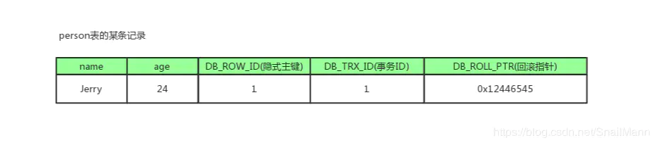
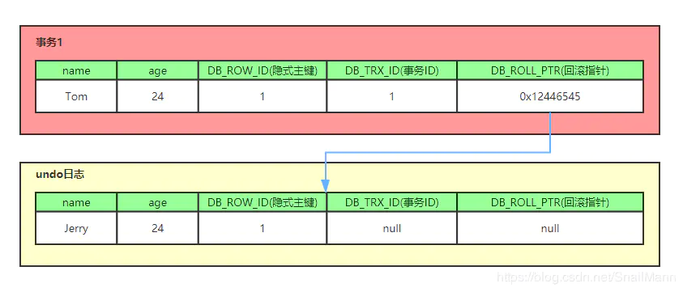
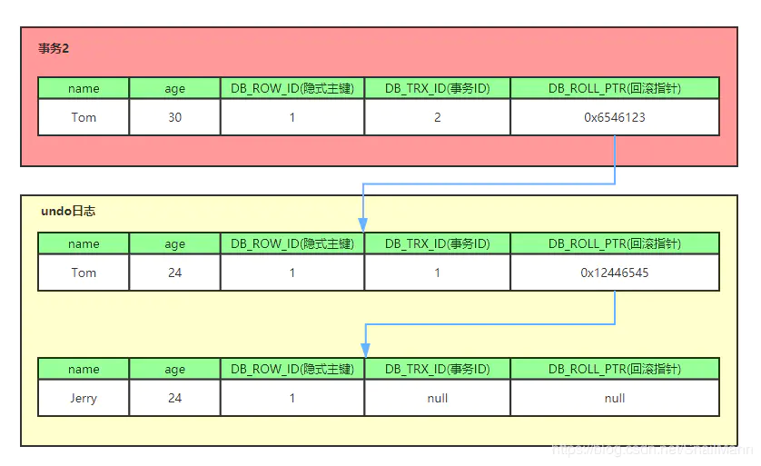

# MySQL

## 数据库的种类

 按照早期的数据库理论，比较流行的数据库模型有三种，分别为层次式数据库、网状数据库和关系型数据库。而在当今的互联网企业中，最常用的数据库模式主要有两种，即关系型数据库和非关系型数据库。

关系型数据库，是指采用了关系模型来组织数据的数据库，其以行和列的形式存储数据，以便于用户理解，关系型数据库这一系列的行和列被称为表，一组表组成了数据库。

非关系型数据库也被称为NoSQL数据库，NoSQL的本意是“Not Only SQL”。NoSQL的产生并不是要彻底否定关系型数据库，而是作为传统数据库的一个有效补充。

### 关系型数据库

关系型数据库模型是把复杂的数据结构归结为简单的二元关系（即二维表格形式）。在关系型数据库中，对数据的操作几乎全部建立在一个或多个关系表格上，通过这些关联的表格分类、合并、连接或选取等运算来实现数据的管理。

1）关系型数据库在存储数据时实际就是采用的一张二维表（和Word和excell里表格几乎一样）。

2）市场占有量较大的是MySQL和oracle数据库，而互联网场景最常用的是MySQL数据库。

3）它通过SQL结构化查询语言来存取、管理关系型数据库的数据。

4）关系型数据库在保持数据安全和数据一致性方面很强，遵循ACID理论

### 非关系型数据库

NoSQL是非关系型数据库的广义定义。它打破了长久以来关系型数据库与ACID理论大一统的局面。NoSQL数据存储不需要固定的表结构，通常也不存在连续操作。在大数据存取上具备关系型数据库无法比拟的性能优势。

当今的应用体系结构需要数据存储在横向伸缩性上能够满足需求。而NoSQL存储就是为了实现这个需求而诞生的。

1）NOSQL数据库不是否定关系型数据库，而是作为关系数据库的一个重要补充。

2）NOSQL数据库为了灵活及高性能、高并发而生，忽略影响高性能、高并发的功能。

3）在NOSQL数据库领域，当今的最典型产品为Redis（持久化缓存）、Mongodb、Memcached（纯内存）等。

4）NOSQL数据库没有标准的查询语言（SQL），通常使用REST式的数据接口或者查询API。

#### 非关系型数据库种类

+ 键值（Key-Value）存储数据库

  键值数据库就类似传统语言中使用的哈希表。可以通过key来添加、查询或者删除数据，因为使用key主键访问，所以会获得很高的性能及扩展性。

  键值（Key-Value）数据库主要是使用一个哈希表，这个表中有一个特定的键和一个指针指向特定的数据。Key-Value模型对于IT系统来说的优势在于简单、易部署、高并发。

  典型产品：Memcached、Redis、MemcacheDB、Berkeley DB

+ 列存储（Column-oriented）数据库

  将数据进行分区（即通过列进行分区），而不是将其按行存储。在这种数据存储布局中，同一列的值被连续地存储在磁盘上（而不是像前面的示例那样将行连续地存储）。

  **面向列的存储非常适合计算聚合的分析型工作负载**，例如查找趋势、计算平均值等。

  行列数据库使用场景不同。如果需要经常获取某个用户的大部分信息，那么行数据库会更好，因为读取一行，那么该行对应的用户所有的信息都被一同读取了。但是如果需要获取多个用户的某个字段的信息，那么列数据库会更好，因为行数据库每次读取一行，每行除了该字段都是冗余的。

  除此之外，行数据库的数据完整性要比列数据库要好。但是在对数据完整性要求不高的大数据处理领域，列数据库很受欢迎。

  典型产品：Cassandra，HBase

+ 面向文档（Document-Oriented）的数据库

  以文档为单位存储，这个文档的格式很灵活，可以是XML、JSON等，相比于关系数据库的固定的表结构，文档内的结构不固定，非常灵活。

  文档型数据库可以看作是键值数据库的升级版，允许之间嵌套键值。而且文档型数据库比键值数据库的查询效率更高。

  典型产品：MongDB、CouchDB

+ 图形（Graph）数据库

  图形数据库允许我们将数据以图的方式存储。实体会被作为顶点，而实体之间的关系则会被作为边。比如我们有三个实体，Steve Jobs、Apple和Next，则会有两个“Founded by”的边将Apple和Next连接到Steve Jobs。

  典型产品：Neo4J、InfoGrid

## 存储引擎

存储引擎也可以称为表类型。

### MyISAM

它是MySQL5.5之前的默认存储引擎。又可以分为静态MyISAM、动态MyISAM 和压缩MyISAM三种：

+ 静态MyISAM：静态表中的字段都是非变长字段，每个记录都是固定的长度，当表不包含变量长度列(VARCHAR, BLOB, 或TEXT)时，使用这个格式。
  + 优点：存储迅速，出现故障容易恢复
  + 缺点：占用空间比动态表大，静态表在进行数据存储时会按照事先定义的列宽度补足空格，但在访问的时候会去掉这些空格
+ 动态MyISAM：如果数据表中出现varchar、xxxtext或xxxBLOB字段时，服务器将自动选择这种表类型。相对于静态MyISAM，这种表存储空间比较小，但由于每条记录的长度不一，所以多次修改数据后，数据表中的数据就可能离散的存储在内存中，进而导致执行效率下降。同时，内存中也可能会出现很多碎片。因此，这种类型的表要经常用optimize table 命令或优化工具来进行碎片整理。
+ 压缩MyISAM：以上说到的两种类型的表都可以用myisamchk工具压缩。这种类型的表进一步减小了占用的存储，但是这种表压缩之后不能再被修改。另外，因为是压缩数据，所以这种表在读取的时候要先时行解压缩。

他们都不支持事务，行级锁和外键约束的功能，而且最大的缺陷就是崩溃后无法安全恢复。

### MyISAM Merge

这种类型是MyISAM类型的一种变种。合并表是将几个相同的MyISAM表合并为一个虚表。常应用于日志和数据仓库。MERGE表本身并没有数据，对它的操作实际上是对内部MYISAM表的操作。

### InnoDB

事务性数据库引擎，MySQL5.5之后的默认存储引擎。提供了事务、行级锁机制和外键约束的功能。因为支持事务和锁，因此写的效率会更低一些。

### memory

这种类型的数据表只存在于内存中。它使用散列索引，所以数据的存取速度非常快。因为是存在于内存中，所以这种类型常应用于临时表中。类似逻辑上的表。

因为存在于内存中，因此速度快，但是数据容易丢失。

### archive

这种类型只支持select 和 insert语句，而且不支持索引。常应用于日志记录和聚合分析方面。

### MyISAM与InnoDB的对比

**1.是否支持行级锁**

MyISAM只有表级锁，而 InnoDB 支持行级锁和表级锁，默认为行级锁。

**2.是否支持事务**

MyISAM 不提供事务支持。

InnoDB 提供事务支持，具有提交(commit)和回滚(rollback)事务的能力。

**3.是否支持外键**

MyISAM 不支持，而 InnoDB 支持。

**4.是否支持数据库异常崩溃后的安全恢复**

MyISAM 不支持，而 InnoDB 支持。

使用 InnoDB 的数据库在异常崩溃后，数据库重新启动的时候会保证数据库恢复到崩溃前的状态。这个恢复的过程依赖于 `redo log` 。

>- MySQL InnoDB 引擎使用 **redo log(重做日志)** 保证事务的**持久性**，使用 **undo log(回滚日志)** 来保证事务的**原子性**。
>- MySQL InnoDB 引擎通过 **锁机制**、**MVCC** 等手段来保证事务的隔离性（ 默认支持的隔离级别是 **`REPEATABLE-READ`** ）。
>- 保证了事务的持久性、原子性、隔离性之后，一致性才能得到保障。

**5.是否支持 MVCC**

MyISAM 不支持，而 InnoDB 支持。

MVCC 可以看作是行级锁的一个升级，可以有效减少加锁操作，提供性能。

### MySQL关于存储引擎的操作

#### 查看数据库可以支持的存储引擎

```sql
--命令可以显示当前数据库支持的存储引擎情况
show engines;
```

#### 查看表的结构等信息

```sql
--查看数据表的结构
desc tablename;
--显示表的创建语句
show create table tablename;
--显示表的状态
show table status like 'tablename'\G;
--设置或修改表的引擎
create table tablename(
) engine = engineName;
--or
alter table tablename engine = enginename;

```

## 事务


## MVCC

多版本并发控制(MVCC)，是一种用来解决读-写冲突的无锁并发控制，也就是为事务分配单向增长的时间戳，为每个修改保存一个版本，版本与事务戳关联，读操作只读事务开始前的数据库的快照。这样在读操作的时候不会阻塞写操作，写操作不会阻塞读操作的同时，也避免了脏读和不可重复读。

### 当前读和快照读

+ 当前读

  当前读指的就是它读取的记录是最新版本的。由于它要读取记录的版本是最新版本，所以读取时须保证其他事务不能修改当前记录，因此需要对读取的记录进行加锁。

+ 快照读

  快照读可以理解为不加锁的select操作就是快照读；快照读的前提是隔离级别不是串行级别，因为在串行隔离级别，快照读可以理解为当前读；快照读的出现，主要解决了在不加锁的情况下也可以进行读取，降低了锁开销；它的实现是基础多版本并发控制，即MVCC；由于它是基于多版本并发控制，所以使用快照读读取的记录并不一定是最新记录。

### 当前读、快照读和MVCC的关系

+ MVCC主要基于"维护一条数据的多个版本，进而保证在读操作的同时不会阻塞写操作，写操作的同时也不会阻塞读操作"
+ 快照读其实就是MVCC的一种体现方式，进行非阻塞读。而相对而言，当前读就是悲观锁的体现，每次进行查询操作时，mysql都认为其是不安全操作，为其加锁保证安全，但每次读取的数据为最新数据。
+ MVCC模型在MySQL中的具体实现则是由 3个隐式字段，undo日志 ，Read View 等去完成的

### MVCC能解决什么问题，好处是？

数据库并发场景有三种，分别为：

+ 读-读：不存在任何问题，也不需要并发控制
+ 读-写：有线程安全问题，可能会造成事务隔离性问题，可能遇到脏读，幻读，不可重复读
+ 写-写：有线程安全问题，可能会存在更新丢失问题，比如第一类更新丢失，第二类更新丢失

MVCC可以解决读写冲突的问题，悲观锁或者乐观锁可以解决写写冲突的问题。

### MVCC实现原理

MVCC主要是依赖记录中的 3个隐式字段，undo日志 ，Read View 来实现的。

#### 隐式字段

每行记录除了我们自定义的字段外，还有数据库隐式定义的`DB_TRX_ID`,`DB_ROLL_PTR`,`DB_ROW_ID`等字段。

+ `DB_TRX_ID`：6byte，记录创建这条记录/最后一次修改该记录的事务ID
+ `DB_ROLL_PTR`：7byte，回滚指针，指向这条记录的上一个版本（存储于rollback segment里）
+ `DB_ROW_ID`：6byte，隐含的自增ID（隐藏主键），如果数据表没有主键，InnoDB会自动以DB_ROW_ID产生一个聚簇索引
+ 实际还有一个删除flag隐藏字段, 既记录被更新或删除并不代表真的删除，而是删除flag变了




#### undo日志

undo log主要分为两种：

+ insert undo log

  代表事务在insert新记录时产生的undo log, 只在事务回滚时需要，并且在事务提交后可以被立即丢弃。

+ update undo log

  事务在进行update或delete时产生的undo log; 不仅在事务回滚时需要，在快照读时也需要；所以不能随便删除，只有在快速读或事务回滚不涉及该日志时，对应的日志才会被purge线程统一清除。

>purge
>
>- 从前面的分析可以看出，为了实现InnoDB的MVCC机制，更新或者删除操作都只是设置一下老记录的deleted_bit，并不真正将过时的记录删除。
>- 为了节省磁盘空间，InnoDB有专门的purge线程来清理deleted_bit为true的记录。为了不影响MVCC的正常工作，purge线程自己也维护了一个read view（这个read view相当于系统中最老活跃事务的read view）;如果某个记录的deleted_bit为true，并且DB_TRX_ID相对于purge线程的read view可见，那么这条记录一定是可以被安全清除的。

对MVCC有帮助的实质是update undo log ，undo log实际上就是存在rollback segment中旧记录链，它的执行流程如下：

1、有个事务插入一条数据：


2、现在来了一个事务1对该记录的name做出了修改，改为Tom，那么会将旧记录copy到undo log中作为副本，新记录的回滚指针指向旧记录：



3、又来了事务2,修改age为30：



可以看出，不同事务或者相同事务的对同一记录的修改，会导致该记录的undo log成为一条记录版本的链表，undo log的链首就是最新的旧记录，链尾就是最早的旧记录（当然就像之前说的该undo log的节点可能是会purge线程清除掉，像图中的第一条insert undo log，其实在事务提交之后可能就被删除丢失了，不过这里为了演示，所以还放在这里）

#### Read View（读视图）

Read View就是事务进行快照读操作的时候生产的读视图(Read View)，在该事务执行的快照读的那一刻，会生成数据库系统当前的一个快照，记录并维护系统当前活跃事务的ID(这个“活跃”指的是未提交。当每个事务开启时，都会被分配一个ID, 这个ID是递增的，所以最新的事务，ID值越大)。

Read View遵循一个可见性算法，主要是将要被修改的数据的最新记录中的DB_TRX_ID（即当前事务ID）取出来，与系统当前其他活跃事务的ID去对比（由Read View维护），如果不符合可见性，那就通过DB_ROLL_PTR回滚指针去取出Undo Log中的DB_TRX_ID再比较，即遍历链表的DB_TRX_ID（从链首到链尾，即从最近的一次修改查起），直到找到满足特定条件的DB_TRX_ID, 那么这个DB_TRX_ID所在的旧记录就是当前事务能看见的最新老版本。

Read View记录了三个域，一个是生成该Read View时正活跃的事务ID列表，一个是活跃列表中最小ID，一个是活跃列表中最大ID+1。

如果DB_TRX_ID<活跃事务最小ID，那么该记录没有被活跃事务修改，该事务肯定能看到。

如果DB_TRX_ID>=活跃列表最大ID+1，那么该记录在生成Read View后被修改了，当前事务不可见。

如果活跃事务最小ID<=DB_TRX_ID<=活跃列表最大ID，那么去判断当前活跃事务ID列表中有没有DB_TRX_ID，如果有，表示最近修改这记录的事务还在活跃，还没有提交（注意，在修改记录的DB_TRX_ID后才会提交），那不可见，如果没有就可见。

