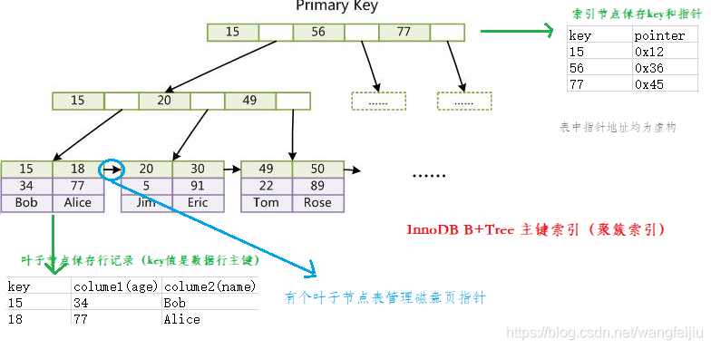
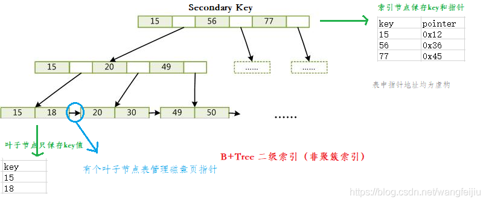
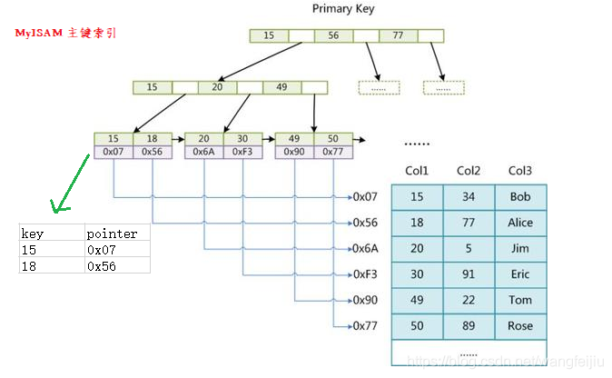
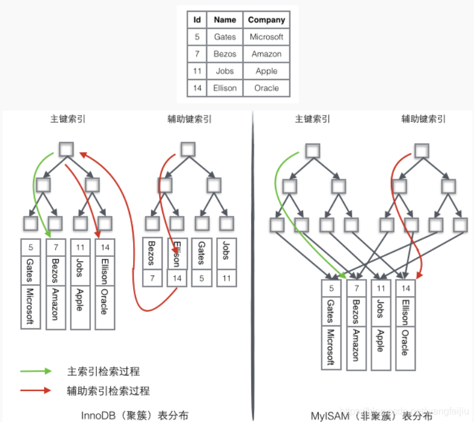
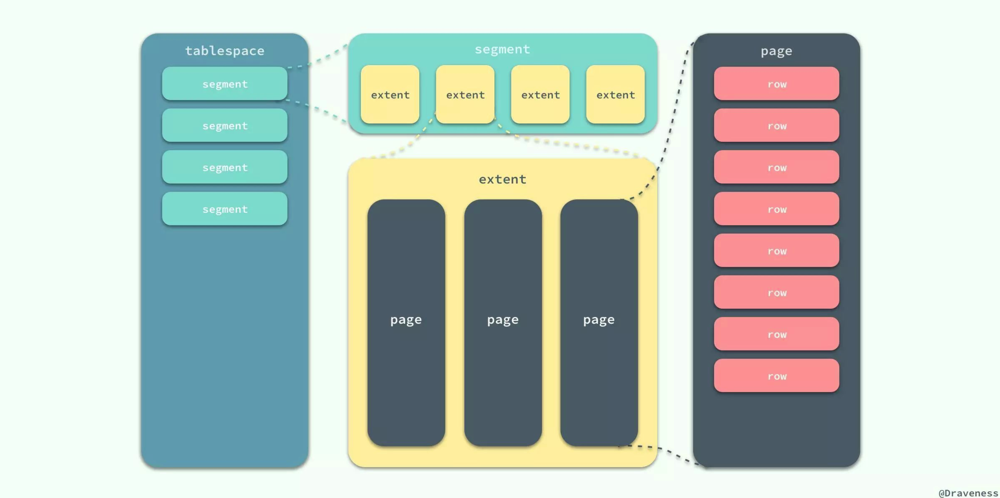

# MySQL

## 数据库的种类

 按照早期的数据库理论，比较流行的数据库模型有三种，分别为层次式数据库、网状数据库和关系型数据库。而在当今的互联网企业中，最常用的数据库模式主要有两种，即关系型数据库和非关系型数据库。

关系型数据库，是指采用了关系模型来组织数据的数据库，其以行和列的形式存储数据，以便于用户理解，关系型数据库这一系列的行和列被称为表，一组表组成了数据库。

非关系型数据库也被称为NoSQL数据库，NoSQL的本意是“Not Only SQL”。NoSQL的产生并不是要彻底否定关系型数据库，而是作为传统数据库的一个有效补充。

### 关系型数据库

关系型数据库模型是把复杂的数据结构归结为简单的二元关系（即二维表格形式）。在关系型数据库中，对数据的操作几乎全部建立在一个或多个关系表格上，通过这些关联的表格分类、合并、连接或选取等运算来实现数据的管理。

1）关系型数据库在存储数据时实际就是采用的一张二维表（和Word和excell里表格几乎一样）。

2）市场占有量较大的是MySQL和oracle数据库，而互联网场景最常用的是MySQL数据库。

3）它通过SQL结构化查询语言来存取、管理关系型数据库的数据。

4）关系型数据库在保持数据安全和数据一致性方面很强，遵循ACID理论

### 非关系型数据库

NoSQL是非关系型数据库的广义定义。它打破了长久以来关系型数据库与ACID理论大一统的局面。NoSQL数据存储不需要固定的表结构，通常也不存在连续操作。在大数据存取上具备关系型数据库无法比拟的性能优势。

当今的应用体系结构需要数据存储在横向伸缩性上能够满足需求。而NoSQL存储就是为了实现这个需求而诞生的。

1）NOSQL数据库不是否定关系型数据库，而是作为关系数据库的一个重要补充。

2）NOSQL数据库为了灵活及高性能、高并发而生，忽略影响高性能、高并发的功能。

3）在NOSQL数据库领域，当今的最典型产品为Redis（持久化缓存）、Mongodb、Memcached（纯内存）等。

4）NOSQL数据库没有标准的查询语言（SQL），通常使用REST式的数据接口或者查询API。

#### 非关系型数据库种类

+ 键值（Key-Value）存储数据库

  键值数据库就类似传统语言中使用的哈希表。可以通过key来添加、查询或者删除数据，因为使用key主键访问，所以会获得很高的性能及扩展性。

  键值（Key-Value）数据库主要是使用一个哈希表，这个表中有一个特定的键和一个指针指向特定的数据。Key-Value模型对于IT系统来说的优势在于简单、易部署、高并发。

  典型产品：Memcached、Redis、MemcacheDB、Berkeley DB

+ 列存储（Column-oriented）数据库

  将数据进行分区（即通过列进行分区），而不是将其按行存储。在这种数据存储布局中，同一列的值被连续地存储在磁盘上（而不是像前面的示例那样将行连续地存储）。

  **面向列的存储非常适合计算聚合的分析型工作负载**，例如查找趋势、计算平均值等。

  行列数据库使用场景不同。如果需要经常获取某个用户的大部分信息，那么行数据库会更好，因为读取一行，那么该行对应的用户所有的信息都被一同读取了。但是如果需要获取多个用户的某个字段的信息，那么列数据库会更好，因为行数据库每次读取一行，每行除了该字段都是冗余的。

  除此之外，行数据库的数据完整性要比列数据库要好。但是在对数据完整性要求不高的大数据处理领域，列数据库很受欢迎。

  典型产品：Cassandra，HBase

+ 面向文档（Document-Oriented）的数据库

  以文档为单位存储，这个文档的格式很灵活，可以是XML、JSON等，相比于关系数据库的固定的表结构，文档内的结构不固定，非常灵活。

  文档型数据库可以看作是键值数据库的升级版，允许之间嵌套键值。而且文档型数据库比键值数据库的查询效率更高。

  典型产品：MongDB、CouchDB

+ 图形（Graph）数据库

  图形数据库允许我们将数据以图的方式存储。实体会被作为顶点，而实体之间的关系则会被作为边。比如我们有三个实体，Steve Jobs、Apple和Next，则会有两个“Founded by”的边将Apple和Next连接到Steve Jobs。

  典型产品：Neo4J、InfoGrid

## 存储引擎

存储引擎也可以称为表类型。

### MyISAM

它是MySQL5.5之前的默认存储引擎。又可以分为静态MyISAM、动态MyISAM 和压缩MyISAM三种：

+ 静态MyISAM：静态表中的字段都是非变长字段，每个记录都是固定的长度，当表不包含变量长度列(VARCHAR, BLOB, 或TEXT)时，使用这个格式。
  + 优点：存储迅速，出现故障容易恢复
  + 缺点：占用空间比动态表大，静态表在进行数据存储时会按照事先定义的列宽度补足空格，但在访问的时候会去掉这些空格
+ 动态MyISAM：如果数据表中出现varchar、xxxtext或xxxBLOB字段时，服务器将自动选择这种表类型。相对于静态MyISAM，这种表存储空间比较小，但由于每条记录的长度不一，所以多次修改数据后，数据表中的数据就可能离散的存储在内存中，进而导致执行效率下降。同时，内存中也可能会出现很多碎片。因此，这种类型的表要经常用optimize table 命令或优化工具来进行碎片整理。
+ 压缩MyISAM：以上说到的两种类型的表都可以用myisamchk工具压缩。这种类型的表进一步减小了占用的存储，但是这种表压缩之后不能再被修改。另外，因为是压缩数据，所以这种表在读取的时候要先时行解压缩。

他们都不支持事务，行级锁和外键约束的功能，而且最大的缺陷就是崩溃后无法安全恢复。

默认使用B+TREE数据结构存储索引。

读写互相阻塞，只会缓存索引（通过key_buffer_size缓存索引，但是不会缓存数据）。

读取速度快。

### MyISAM Merge

这种类型是MyISAM类型的一种变种。合并表是将几个相同的MyISAM表合并为一个虚表。常应用于日志和数据仓库。MERGE表本身并没有数据，对它的操作实际上是对内部MYISAM表的操作。

### InnoDB

事务性数据库引擎，MySQL5.5之后的默认存储引擎。提供了事务、行级锁机制和外键约束的功能。因为支持事务和锁，因此写的效率会更低一些。默认使用B+TREE数据结构存储索引。

InnoDB更消耗资源，读取速度没有MyISAM快。

在InnoDB中存在着缓冲管理，通过缓冲池，将索引和数据全部缓存起来，加快查询的速度。因此既能缓存索引又能缓存数据。

对于InnoDB类型的表，其数据的物理组织形式是聚簇表。所有的数据按照主键来组织。数据和索引放在一块，都位于B+数的叶子节点上

### memory

这种类型的数据表只存在于内存中。它使用散列索引，所以数据的存取速度非常快。因为是存在于内存中，所以这种类型常应用于临时表中。类似逻辑上的表。

因为存在于内存中，因此速度快，但是数据容易丢失。

### archive

这种类型只支持select 和 insert语句，而且不支持索引。常应用于日志记录和聚合分析方面。

### MyISAM与InnoDB的对比

**1.是否支持行级锁**

MyISAM只有表级锁，而 InnoDB 支持行级锁和表级锁，默认为行级锁。

**2.是否支持事务**

MyISAM 不提供事务支持。

InnoDB 提供事务支持，具有提交(commit)和回滚(rollback)事务的能力。

**3.是否支持外键**

MyISAM 不支持，而 InnoDB 支持。

**4.是否支持数据库异常崩溃后的安全恢复**

MyISAM 不支持，而 InnoDB 支持。

使用 InnoDB 的数据库在异常崩溃后，数据库重新启动的时候会保证数据库恢复到崩溃前的状态。这个恢复的过程依赖于 `redo log` 。

>- MySQL InnoDB 引擎使用 **redo log(重做日志)** 保证事务的**持久性**，使用 **undo log(回滚日志)** 来保证事务的**原子性**。
>- MySQL InnoDB 引擎通过 **锁机制**、**MVCC** 等手段来保证事务的隔离性（ 默认支持的隔离级别是 **`REPEATABLE-READ`** ）。
>- 保证了事务的持久性、原子性、隔离性之后，一致性才能得到保障。

**5.是否支持 MVCC**

MyISAM 不支持，而 InnoDB 支持。

MVCC 可以看作是行级锁的一个升级，可以有效减少加锁操作，提供性能。

### 关于 MyISAM 和 InnoDB 的选择问题

大多数时候我们使用的都是 InnoDB 存储引擎，在某些读密集的情况下，使用 MyISAM 也是合适的。不过，前提是你的项目不介意 MyISAM 不支持事务、崩溃恢复等缺点。

### MySQL关于存储引擎的操作

#### 查看数据库可以支持的存储引擎

```sql
--命令可以显示当前数据库支持的存储引擎情况
show engines;
```

#### 查看表的结构等信息

```sql
--查看数据表的结构
desc tablename;
--显示表的创建语句
show create table tablename;
--显示表的状态
show table status like 'tablename'\G;
--设置或修改表的引擎
create table tablename(
) engine = engineName;
--or
alter table tablename engine = enginename;

```

## 事务

### 事务的定义

一个最小的不可再分的工作单元；通常一个事务对应一个完整的业务。

### 事务的四大特征

+ 原子性：事务是最小单位，不可再分
+ 一致性：事务要求所有的DML（数据操作语言，如insert、delete等）操作的时候，必须保证同时成功或同时失败
+ 隔离性：事务之间相互隔离
+ 持久性：是事务的保证，即持久化存储

### 与事务相关的两条重要SQL语句

+ commit
+ rollback

显式地开启事务：

```sql
begin;
-- or
start transaction;
```

当然也可以设置当前线程自动更新提交：

```sql
set autocommit=0;
```

在MYSQL中，默认情况下，事务是自动提交的，因此只要执行一条DML语句就开启了事务。这个事务持续到主动commit、rollback或者断开连接。

### 隔离性

+ 事务之间相互隔离

+ 隔离性有4个隔离级别：

  + 读未提交：read uncommited
  + 读已提交：read commited
  + 可重复读：repeatable read
  + 串行化：serializable

+ 读未提交：

  + A未提交的数据，B能读取到
  + 导致脏读
  + 这种隔离级别最低

+ 读已提交：

  + A提交后的数据，B才能读取到

  + 能避免脏读，但是不能避免不可重复读和幻读

    > 脏读是指读到了别的事务回滚前的脏数据。
    >
    > 不可重复读是指A读取某个数据，执行操作，后B修改该数据，然后A再次读取时发现不一致。
    >
    > 幻读：事务A首先根据条件索引得到N条数据，然后事务B改变了这N条数据之外的M条或者增添了M条符合事务A搜索条件的数据，导致事务A再次搜索发现有N+M条数据了，就产生了幻读。也就是说，当前事务读第一次取到的数据比后来读取到数据条目少。
    >
    > 不可重复读和幻读比较：
    > 两者有些相似，但是前者针对的是update或delete，且非范围查询，后者针对的是范围查询。

  + Oracle默认隔离级别

+ 可重复读：

  + 在可重复读中，该sql第一次读取到数据后，就将这些数据加锁（悲观锁），其它事务无法修改这些数据，就可以实现可重复读了。
  + 但这种方法却无法锁住insert的数据，所以当事务A先前读取了数据，或者修改了全部数据，事务B还是可以insert数据提交，这时事务A就会发现莫名其妙多了一条之前没有的数据，这就是幻读，不能通过行锁来避免。
  + InnoDB默认级别。

+ 串行读：

  + 完全串行化的读，每次读都需要获得表级共享锁，读写相互都会阻塞

## MVCC

多版本并发控制(MVCC)，是一种用来解决读-写冲突的无锁并发控制，也就是为事务分配单向增长的时间戳，为每个修改保存一个版本，版本与事务戳关联，读操作只读事务开始前的数据库的快照。这样在读操作的时候不会阻塞写操作，写操作不会阻塞读操作的同时，也避免了脏读和不可重复读。

### 当前读和快照读

+ 当前读

  当前读指的就是它读取的记录是最新版本的。由于它要读取记录的版本是最新版本，所以读取时须保证其他事务不能修改当前记录，因此需要对读取的记录进行加锁。

+ 快照读

  快照读可以理解为不加锁的select操作就是快照读；快照读的前提是隔离级别不是串行级别，因为在串行隔离级别，快照读可以理解为当前读；快照读的出现，主要解决了在不加锁的情况下也可以进行读取，降低了锁开销；它的实现是基础多版本并发控制，即MVCC；由于它是基于多版本并发控制，所以使用快照读读取的记录并不一定是最新记录。

### 当前读、快照读和MVCC的关系

+ MVCC主要基于"维护一条数据的多个版本，进而保证在读操作的同时不会阻塞写操作，写操作的同时也不会阻塞读操作"
+ 快照读其实就是MVCC的一种体现方式，进行非阻塞读。而相对而言，当前读就是悲观锁的体现，每次进行查询操作时，mysql都认为其是不安全操作，为其加锁保证安全，但每次读取的数据为最新数据。
+ MVCC模型在MySQL中的具体实现则是由 3个隐式字段，undo日志 ，Read View 等去完成的

### MVCC能解决什么问题，好处是？

数据库并发场景有三种，分别为：

+ 读-读：不存在任何问题，也不需要并发控制
+ 读-写：有线程安全问题，可能会造成事务隔离性问题，可能遇到脏读，幻读，不可重复读
+ 写-写：有线程安全问题，可能会存在更新丢失问题，比如第一类更新丢失，第二类更新丢失

MVCC可以解决读写冲突的问题，悲观锁或者乐观锁可以解决写写冲突的问题。

### MVCC实现原理

MVCC主要是依赖记录中的 3个隐式字段，undo日志 ，Read View 来实现的。

#### 隐式字段

每行记录除了我们自定义的字段外，还有数据库隐式定义的`DB_TRX_ID`,`DB_ROLL_PTR`,`DB_ROW_ID`等字段。

+ `DB_TRX_ID`：6byte，记录创建这条记录/最后一次修改该记录的事务ID
+ `DB_ROLL_PTR`：7byte，回滚指针，指向这条记录的上一个版本（存储于rollback segment里）
+ `DB_ROW_ID`：6byte，隐含的自增ID（隐藏主键），如果数据表没有主键，InnoDB会自动以DB_ROW_ID产生一个聚簇索引
+ 实际还有一个删除flag隐藏字段, 既记录被更新或删除并不代表真的删除，而是删除flag变了


#### undo日志

undo log主要分为两种：

+ insert undo log

  代表事务在insert新记录时产生的undo log, 只在事务回滚时需要，并且在事务提交后可以被立即丢弃。

+ update undo log

  事务在进行update或delete时产生的undo log; 不仅在事务回滚时需要，在快照读时也需要；所以不能随便删除，只有在快速读或事务回滚不涉及该日志时，对应的日志才会被purge线程统一清除。

>purge
>
>- 从前面的分析可以看出，为了实现InnoDB的MVCC机制，更新或者删除操作都只是设置一下老记录的deleted_bit，并不真正将过时的记录删除。
>- 为了节省磁盘空间，InnoDB有专门的purge线程来清理deleted_bit为true的记录。为了不影响MVCC的正常工作，purge线程自己也维护了一个read view（这个read view相当于系统中最老活跃事务的read view）;如果某个记录的deleted_bit为true，并且DB_TRX_ID相对于purge线程的read view可见，那么这条记录一定是可以被安全清除的。

对MVCC有帮助的实质是update undo log ，undo log实际上就是存在rollback segment中旧记录链，它的执行流程如下：

1、有个事务插入一条数据：


2、现在来了一个事务1对该记录的name做出了修改，改为Tom，那么会将旧记录copy到undo log中作为副本，新记录的回滚指针指向旧记录：


3、又来了事务2，修改age为30：


可以看出，不同事务或者相同事务的对同一记录的修改，会导致该记录的undo log成为一条记录版本的链表，undo log的链首就是最新的旧记录，链尾就是最早的旧记录（当然就像之前说的该undo log的节点可能是会purge线程清除掉，像图中的第一条insert undo log，其实在事务提交之后可能就被删除丢失了，不过这里为了演示，所以还放在这里）

#### Read View（读视图）

Read View就是事务进行快照读操作的时候生产的读视图(Read View)，在该事务执行的快照读的那一刻，会生成数据库系统当前的一个快照，记录并维护系统当前活跃事务的ID(这个“活跃”指的是未提交。当每个事务开启时，都会被分配一个ID, 这个ID是递增的，所以最新的事务，ID值越大)。

Read View遵循一个可见性算法，主要是将要被修改的数据的最新记录中的DB_TRX_ID（即当前事务ID）取出来，与系统当前其他活跃事务的ID去对比（由Read View维护），如果不符合可见性，那就通过DB_ROLL_PTR回滚指针去取出Undo Log中的DB_TRX_ID再比较，即遍历链表的DB_TRX_ID（从链首到链尾，即从最近的一次修改查起），直到找到满足特定条件的DB_TRX_ID, 那么这个DB_TRX_ID所在的旧记录就是当前事务能看见的最新老版本。

Read View记录了三个域，一个是生成该Read View时正活跃的事务ID列表，一个是活跃列表中最小ID，一个是活跃列表中最大ID+1。

如果DB_TRX_ID<活跃事务最小ID，那么该记录没有被活跃事务修改，该事务肯定能看到。

如果DB_TRX_ID>=活跃列表最大ID+1，那么该记录在生成Read View后被修改了，当前事务不可见。

如果活跃事务最小ID<=DB_TRX_ID<=活跃列表最大ID，那么去判断当前活跃事务ID列表中有没有DB_TRX_ID，如果有，表示最近修改这记录的事务还在活跃，还没有提交（注意，在修改记录的DB_TRX_ID后才会提交），那不可见，如果没有就可见。

InnoDB默认是可重复读，那么Read View如何保证可重复读呢？

| 事务A                                                     | 事务B                                                        |
| --------------------------------------------------------- | ------------------------------------------------------------ |
| 开启事务                                                  | 开启事务                                                     |
| 快照读，查询金额为500                                     | 快照读，查询金额为500                                        |
| 更新金额为400，此时DB_TRX_ID更新为事务A的ID，生成undo log |                                                              |
| 提交事务                                                  | 快照读，<br>因为Read View是一个快照，就算A提交结束事务后，Read View中的活跃事务列表中仍存在A的ID，此时因为DB_TRX_ID等于A的ID（就算是在活跃列表之外的事务修改了数据，那么DB_TRX_ID>活跃列表最大的ID，不可见），那么不可见，因此会去undo log中取出旧记录继续进行可见性的判断。<br>因此读取到的仍是500。 |

#### RC，RR级别下的InnoDB快照读有什么不同？

+ 在RR级别下的某个事务的对某条记录的第一次快照读会创建一个快照及Read View, 将当前系统活跃的其他事务记录起来，此后在调用快照读的时候，还是使用的是同一个Read View。Read View会记录当时所有其他活动事务的快照，这些事务的修改对于当前事务都是不可见的。而早于Read View创建的事务所做的修改均是可见。
+ 而在RC级别下的，事务中，每次快照读都会新生成一个快照和Read View, 这就是我们在RC级别下的事务中可以看到别的事务提交的更新的原因。

## 锁

根据加锁的范围，MySQL里面的锁大致可以分成全局锁、表级锁和行锁三类。

### 全局锁

全局锁就是对整个数据库实例加锁。MySQL提供了一个加全局读锁的方法，命令是`Flush tables with read lock`。当需要让整个库处于只读状态的时候，可以使用这个命令。

全局锁的典型使用场景是，做全库逻辑备份。也就是把整库每个表都select出来存成文本。

但是让整个库都只读，可能出现以下问题：

+ 如果在主库上备份，那么在备份期间都不能执行更新，业务基本上就得停摆
+ 如果在从库上备份，那么在备份期间从库不能执行主库同步过来的binlog，会导致主从延迟

如果使用事务引擎，也可以在可重复读隔离级别下开启一个事务来处理。官方自带的逻辑备份工具是mysqldump。当mysqldump使用参数–single-transaction的时候，导数据之前就会启动一个事务，来确保拿到一致性视图。而由于MVCC的支持，这个过程中数据是可以正常更新的。

>既然要全库只读，为什么不使用`set global readonly=true`的方式？
>
>+ 在有些系统中，readonly的值会被用来做其他逻辑，比如用来判断一个库是主库还是备库。因此修改global变量的方式影响面更大
>+ 在异常处理机制上有差异。如果执行Flush tables with read lock命令之后由于客户端发生异常断开，那么MySQL会自动释放这个全局锁，整个库回到可以正常更新的状态。而将整个库设置为readonly之后，如果客户端发生异常，则数据库会一直保持readonly状态，这样会导致整个库长时间处于不可写状态，风险较高。

### 表级锁

MySQL里面表级别的锁有两种：一种是表锁，一种是元数据锁（meta data lock，MDL）。

表锁的语法是lock tables … read/write。可以用unlock tables主动释放锁，也可以在客户端断开的时候自动释放。lock tables语法除了会限制别的线程的读写外，也限定了本线程接下来的操作对象。

如果在某个线程A中执行`lock tables t1 read,t2 wirte;`这个语句，则其他线程写t1、读写t2的语句都会被阻塞。同时，线程A在执行unlock tables之前，也只能执行读t1、读写t2的操作。连写t1都不允许。

另一类表级的锁是MDL。MDL不需要显式使用。当对一个表做增删改查操作的时候，加MDL读锁；当要对表做结构变更操作的时候，加MDL写锁：

> 注意是要对表做结构变更的操作才会加MDL写锁！

- 读锁之间不互斥，因此可以有多个线程同时对一张表增删改查
- 读写锁之间、写锁之间是互斥的，用来保证变更表结构操作的安全性。因此，如果有两个线程要同时给一个表加字段，其中一个要等另一个执行完才能开始执行

**事务中的MDL锁，在语句执行开始时申请，但是语句结束后并不会马上释放，而会等到整个事务提交后再释放**。

> + 如何安全地给小表加字段？
>
>   首先要解决长事务，事务不提交，就会一直占着DML锁。在MySQL的information_schema库的innodb_trx表中，可以查到当前执行的事务。如果要做DDL（database definition language）变更的表刚好有长事务在执行，要考虑先暂停DDL，或者kill掉这个长事务。
>
> + 如果要变更的表是一个热点表，虽然数据量不大，但是上面的请求很频繁，而又不得不加个字段，该怎么做？
>
>   在alter table语句里面设定等待时间，如果在这个指定的等待时间里面能够拿到MDL写锁最好，拿不到也不要阻塞后面的业务语句，先放弃。之后再通过重试命令重复这个过程。

### 行锁

MySQL的行锁是在引擎层由各个引擎自己实现的。但不是所有的引擎都支持行锁，比如MyISAM引擎就不支持行锁。

- 共享锁(读锁) S：对同一行的操作读不阻塞，阻塞写
- 排它锁(写锁) X：对同一行的操作读写都会阻塞
- 意向共享锁 IS：一个事物想要加S锁时必须先获得该表的IS
- 意向排它锁 IX：一个事物想要加X锁时必须先获得该表的IX


>为什么需要意向锁：
>意向锁是表级别的锁，用来标识该表上有数据被锁住或即将被锁，对于表级别的请求(LOCK TABLE…)，就可以直接判断是否有锁冲突，不需要逐行检查锁的状态

#### 两阶段锁协议

在InnoDB事务中，行锁是在需要的时候才加上的，但并不是不需要了就立刻释放，而是要等到事务结束时才释放。这个就是两阶段锁协议。

**如果事务中需要锁多个行，要把最可能造成锁冲突、最可能影响并发度的锁尽量往后放，因为只要在访问某行时才会加锁，加锁时刻到提交时刻的时长越短，那么对并发的影响越小**。

#### 死锁和死锁检测

当出现死锁以后，有两种策略：

+ 一种策略是，直接进入等待，直到超时。这个超时时间可以通过参数innodb_lock_wait_timeout来设置。
+ 另一种策略是，发起死锁检测，发现死锁后，主动回滚死锁链条中的某一个事务，让其他事务得以继续执行。将参数innodb_deadlock_detect设置为on，表示开启这个逻辑。

在InnoDB中，innodb_lock_wait_timeout的默认值是50s，意味着如果采用第一个策略，当出现死锁以后，第一个被锁住的线程要过50s才会超时退出，然后其他线程才有可能继续执行。对于在线服务来说，这个等待时间往往是无法接受的。

正常情况下还是要采用主动死锁检查策略，而且innodb_deadlock_detect的默认值本身就是on。主动死锁监测在发生死锁的时候，是能够快速发现并进行处理的，但是它有额外负担的。每当一个事务被锁的时候，就要看看它所依赖的线程有没有被别人锁住，如此循环，最后判断是否出现了循环等待，也就是死锁。

> 怎么解决由这种热点行更新导致的性能问题？
>
> 1. 如果确保这个业务一定不会出现死锁，可以临时把死锁检测关掉。
> 2. 控制并发度。
> 3. 将一行改成逻辑上的多行来减少锁冲突。以影院账户为例，可以考虑放在多条记录上，比如10个记录，影院的账户总额等于这10个记录的值的总和。这样每次要给影院账户加金额的时候，随机选其中一条记录来加。这样每次冲突概率变成员原来的1/10，可以减少锁等待个数，也就减少了死锁检测的CPU消耗。

> 可以使用以下命令查看语句处于什么状态：
>
> ```sql
> show processlist;
> --or
> select * from information_schema.processlist where id=1;
> ```

> 一种查询慢的例子：
>
> A开启事务，进行快照读，但其中事务B不断地对某行进行更新，生成数量极大的undo log，而A的快照读需要保证可重复读，因此需要照着undo log进行回溯，耗时巨大。

### 间隙锁

间隙锁锁的是索引叶子节点的next指针，可以解决mysql RR级别下幻读的问题。

> 在RR级别下，快照读是通过MVVC(多版本控制)和undo log来实现的，无需用锁也不会发生幻读的情况；当前读是通过加record lock(记录锁)和gap lock(间隙锁)来实现的。
>
> 快照读可以避免幻读，当前读需要使用gap lock来避免幻读。

建表等语句如下：

```sql
CREATE TABLE `t` (
  `id` int(11) NOT NULL,
  `c` int(11) DEFAULT NULL,
  `d` int(11) DEFAULT NULL,
  PRIMARY KEY (`id`),
  KEY `c` (`c`)
) ENGINE=InnoDB;

insert into t values(0,0,0),(5,5,5),
(10,10,10),(15,15,15),(20,20,20),(25,25,25);
```

这个表除了主键id外，还有一个索引c。

当执行`select * from t where d=5 for update`的时候，就不止给数据库已有的6个记录加上了行锁，还同时加上了7个间隙锁：(-$\infin$, 0), (0, 5), (5, 10), (10, 15), (15, 20), (20, 25), (25, $\infin$ )。

> select ... lock in share mode是共享锁，select ... for update是排他锁。

跟间隙锁存在冲突关系的是往这个间隙中插入一个记录这个操作。间隙锁之间不存在冲突关系。（两个事务同时获取重叠的间隙锁，没有影响）

> 间隙锁会带来死锁：
>
> 事务A与事务B获取同一个间隙锁后，A在间隙插入某个数，阻塞，B在间隙插入某个数，阻塞，两个事务相互等待，形成死锁。

### next-key lock

建表语句如下：

```sql
CREATE TABLE `t` (
  `id` int(11) NOT NULL,
  `c` int(11) DEFAULT NULL,
  `d` int(11) DEFAULT NULL,
  PRIMARY KEY (`id`),
  KEY `c` (`c`)
) ENGINE=InnoDB;

insert into t values(0,0,0),(5,5,5),
(10,10,10),(15,15,15),(20,20,20),(25,25,25);
```

id为主键，c为普通key。

#### next-key lock加锁规则

+ 原则一：加锁的基本单位是next-key lock，前开后闭（( , ]）
+ 原则二：查找过程中访问到的对象才会加锁
+ 优化一：索引上的等值查询，给唯一索引加锁的时候，next-key lock退化为行锁
+ 优化二：索引上的等值查询，向右遍历时且最后一个值不满足等值条件的时候，next-key lock退化为间隙锁（左开右开）
+ 一个bug：唯一索引上的范围查询会访问到不满足条件的第一个值为止

> 锁是加在索引上的！

#### 案例一：等值查询间隙锁

| session A                                | session B                                       | session C                                         |
| ---------------------------------------- | ----------------------------------------------- | ------------------------------------------------- |
| begin ;<br>update t set d=d+1 where id=7 |                                                 |                                                   |
|                                          | insert into t values(8, 8, 8);<br>(==blocked==) |                                                   |
|                                          |                                                 | update t set d=d+1 where id=10;<br>(==Query OK==) |

1. 由于表中没有7，单位为next-key lock因此加锁范围为(5, 10]
2. 根据优化二，id=10不满足查询条件，因此next-key lock退化为间隙锁，为(5, 10)
3. 因此session C对id=10这条记录修改成功

#### 案例二：非唯一索引等值锁

| session A                                                | session B                                        | session C                                       |
| -------------------------------------------------------- | ------------------------------------------------ | ----------------------------------------------- |
| begin;<br>select id from t where c=5 lock in share mode; |                                                  |                                                 |
|                                                          | update t set d=d+1 where id=5;<br>(==Query OK==) |                                                 |
|                                                          |                                                  | insert into t values(7, 7, 7);<br>(==blocked==) |

1. next-key lock, 首先加锁范围为(0, 5]
2. 因为是非唯一索引，因此后面可能还会有id=5的索引，需要继续向后搜索，因此给(5, 10]加next-key lock
3. 因为id=10不符合条件，因此退化成间隙锁(5, 10)
4. 因为锁是加载普通索引上的，对主键索引不影响，因此session B不会受到阻塞


## B树与B+树

### B-Tree

m阶的B-Tree有如下的特性：

+ 每个节点最多由m个孩子
+ 除了根节点和叶子节点外，其他的节点至少有ceil(m/2)个孩子
+ 若根节点不是叶子节点，则至少有2个孩子
+ 所有的叶子节点都在同一层，且不包含其他关键字信息
+ 每个非叶子节点的关键字数量为[ ceil(m/2)-1, m-1 ]（就是非叶子节点的孩子数量减一）
+ 关键字升序排序

下面是3阶B-Tree：


### B+Tree

B+Tree是在B-Tree基础上的一种优化，使其更适合实现外存储索引结构，InnoDB存储引擎就是用B+Tree实现其索引结构。

从上一节中的B-Tree结构图中可以看到每个节点中不仅包含数据的key值，还有data值。而每一个页的存储空间是有限的，如果data数据较大时将会导致每个节点（即一个页）能存储的key的数量很小，当存储的数据量很大时同样会导致B-Tree的深度较大，增大查询时的磁盘I/O次数，进而影响查询效率。在B+Tree中，所有数据记录节点都是按照键值大小顺序存放在同一层的叶子节点上，而非叶子节点上只存储key值信息，这样可以大大加大每个节点存储的key值数量，降低B+Tree的高度。

B+Tree相对于B-Tree有几点不同：

1. 非叶子节点只存储键值信息。
2. 所有叶子节点之间都有一个链指针。
3. 数据记录都存放在叶子节点中。


通常在B+Tree上有两个头指针，一个指向根节点，另一个指向关键字最小的叶子节点，而且所有叶子节点（即数据节点）之间是一种链式环结构。因此可以对B+Tree进行两种查找运算：一种是对于主键的范围查找和分页查找，另一种是从根节点开始，进行随机查找。

数据库中的B+Tree索引可以分为聚集索引（clustered index）和辅助索引（secondary index）。上面的B+Tree示例图在数据库中的实现即为聚集索引，聚集索引的B+Tree中的叶子节点存放的是整张表的行记录数据。辅助索引与聚集索引的区别在于辅助索引的叶子节点并不包含行记录的全部数据，而是存储相应行数据的聚集索引键，即主键。当通过辅助索引来查询数据时，InnoDB存储引擎会遍历辅助索引找到主键，然后再通过主键在聚集索引中找到完整的行记录数据。

### 插入操作

1）根据要插入的key的值，找到叶子结点并插入。

2）判断当前结点key的个数是否小于等于m-1，若满足则结束，否则进行第3步。

3）以结点中间的key为中心分裂成左右两部分，然后将这个中间的key插入到父结点中，这个key的左子树指向分裂后的左半部分，这个key的右子支指向分裂后的右半部分，然后将当前结点指向父结点，继续进行第3步。

## 索引

索引是对数据库表中一列或多列的值进行排序的一种结构。索引可以大大提高MySQL的检索速度。

索引一般以文件形式存在磁盘中（也可以存于内存中），建立索引之后，会将建立索引的KEY值放在一个n叉树上（BTree）。因为B树的特点就是适合在磁盘等直接存储设备上组织动态查找表，每次以索引进行条件查询时，会去树上根据key值直接进行搜索。

### 索引的优缺点

#### 优点

+ 索引大大减小了服务器需要扫描的数据量，从而大大加快数据的检索速度，这也是创建索引的最主要的原因。
+ 索引可以帮助服务器避免排序和创建临时表。
+ 索引可以将随机IO变成顺序IO。
+ 索引对于InnoDB（对索引支持行级锁）非常重要，因为它可以让查询锁更少的元组，提高了表访问并发性。
+ 关于InnoDB、索引和锁：InnoDB在二级索引上使用共享锁（读锁），但访问主键索引需要排他锁（写锁）。
+ 通过创建唯一性索引，可以保证数据库表中每一行数据的唯一性。
+ 可以加速表和表之间的连接，特别是在实现数据的参考完整性方面特别有意义。
+ 在使用分组和排序子句进行数据检索时，同样可以显著减少查询中分组和排序的时间。
+ 通过使用索引，可以在查询的过程中，使用优化隐藏器，提高系统的性能。

#### 缺点

+ 创建索引和维护索引要耗费时间，这种时间随着数据量的增加而增加。
+ 索引需要占物理空间，除了数据表占用数据空间之外，每一个索引还要占用一定的物理空间，如果需要建立聚簇索引，那么需要占用的空间会更大。
+ 对表中的数据进行增、删、改的时候，索引也要动态的维护，这就降低了整数的维护速度。
+ 如果某个数据列包含许多重复的内容，为它建立索引就没有太大的实际效果。
+ 对于非常小的表，大部分情况下简单的全表扫描更高效。

### 创建索引准则

索引是建立在数据库表中的某些列的上面。因此，在创建索引的时候，应该仔细考虑在哪些列上可以创建索引，在哪些列上不能创建索引。

#### 应该创建索引的列

+ 在经常需要搜索的列上，可以加快搜索的速度。
+ 在作为主键的列上，强制该列的唯一性和组织表中数据的排列结构。
+ 在经常用在连接（JOIN）的列上，这些列主要是一外键，可以加快连接的速度。
+ 在经常需要根据范围（<，<=，=，>，>=，BETWEEN，IN）进行搜索的列上创建索引，因为索引已经排序，其指定的范围是连续的。
+ 在经常需要排序（order by）的列上创建索引，因为索引已经排序，这样查询可以利用索引的排序，加快排序查询时间。
+ 在经常使用在WHERE子句中的列上面创建索引，加快条件的判断速度。

#### 不应该创建索引的列

+ 对于那些在查询中很少使用或者参考的列不应该创建索引。
+ 若列很少使用到，因此有索引或者无索引，并不能提高查询速度。相反，由于增加了索引，反而降低了系统的维护速度和增大了空间需求。
+ 对于那些只有很少数据值或者重复值多的列也不应该增加索引。这些列的取值很少，例如人事表的性别列，在查询的结果中，结果集的数据行占了表中数据行的很大比例，即需要在表中搜索的数据行的比例很大。增加索引，并不能明显加快检索速度。
+ 对于那些定义为text, image和bit数据类型的列不应该增加索引。这些列的数据量要么相当大，要么取值很少。
+ 当该列修改性能要求远远高于检索性能时，不应该创建索引。（修改性能和检索性能是互相矛盾的）。

### 索引结构

B-Tree、B+Tree、HASH

> HASH索引不支持任何范围查询。

### 索引分类

MySQL 的索引有两种分类方式：逻辑分类和物理分类。

#### 逻辑分类

有多种逻辑划分的方式，比如按功能划分，按组成索引的列数划分等。

按功能划分：

+ 主键索引：一张表只能有一个主键索引，不允许重复、不允许为 NULL；

  ```sql
  ALTER TABLE TableName ADD PRIMARY KEY(column_list); 
  ```

+ 唯一索引：数据列不允许重复，允许为 NULL 值，一张表可有多个唯一索引，索引列的值必须唯一，但允许有空值。如果是组合索引，则列值的组合必须唯一。

  ```sql
  CREATE UNIQUE INDEX IndexName ON `TableName`(`字段名`(length));
  # 或者
  ALTER TABLE TableName ADD UNIQUE (column_list); 
  ```

+ 普通索引：一张表可以创建多个普通索引，一个普通索引可以包含多个字段，允许数据重复，允许 NULL 值插入；

  ```sql
  CREATE INDEX IndexName ON `TableName`(`字段名`(length));
  # 或者
  ALTER TABLE TableName ADD INDEX IndexName(`字段名`(length));
  ```

+ 全文索引：它查找的是文本中的关键词，主要用于全文检索。（篇幅较长，下文有独立主题说明）

按列数划分：

+ 单例索引：一个索引只包含一个列，一个表可以有多个单例索引。
+ 组合索引：一个组合索引包含两个或两个以上的列。查询的时候遵循 mysql 组合索引的 “最左前缀”原则，即使用 where 时条件要按照建立索引的时候字段的排列方式放置索引才会生效。

#### 物理分类

分为聚簇索引和非聚簇索引（有时也称辅助索引或二级索引）。

聚簇索引（clustered index）不是单独的一种索引类型，而是一种数据存储方式。这种存储方式是依靠B+树来实现的，根据表的主键构造一棵B+树且B+树叶子节点存放的都是表的行记录数据时，方可称该主键索引为聚簇索引。聚簇索引也可理解为将数据存储与索引放到了一块，找到索引也就找到了数据。

非聚簇索引：数据和索引是分开的，B+树叶子节点存放的不是数据表的行记录。

虽然InnoDB和MyISAM存储引擎都默认使用B+树结构存储索引，但是只有InnoDB的主键索引才是聚簇索引，InnoDB中的辅助索引以及MyISAM使用的都是非聚簇索引。每张表最多只能拥有一个聚簇索引。

聚簇索引优点：

+ 数据访问更快，因为聚簇索引将索引和数据保存在同一个B+树中，因此从聚簇索引中获取数据比非聚簇索引更快
+ 聚簇索引对于主键的排序查找和范围查找速度非常快

聚簇索引缺点：

+ 插入速度严重依赖于插入顺序，按照主键的顺序插入是最快的方式，否则将会出现页分裂，严重影响性能。因此，对于InnoDB表，我们一般都会定义一个自增的ID列为主键（主键列不要选没有意义的自增列，选经常查询的条件列才好，不然无法体现其主键索引性能）
+ 更新主键的代价很高，因为将会导致被更新的行移动。因此，对于InnoDB表，我们一般定义主键为不可更新。
+ 二级索引访问需要两次索引查找，第一次找到主键值，第二次根据主键值找到行数据。

非聚簇索引的优点：


> key和index的含义
>
> key有两层含义：1、约束（约束和规范数据库的结构完整性）2、索引。
>
> key等价普通索引 key 键名（列）
>
> primary key：
>
> + 主键约束（unique, not null，一表一主键，唯一标识记录），规范存储主键和强调唯一性
> + 为这个key建立主键索引
>
> unique key：
>
> + unique约束，保证列或列集合唯一性
> + 为这个key建立唯一索引
>
> foreign key：
>
> + 外键约束，规范数据的引用完整性
> + 为这个key建立一个普通索引
>
> ```sql
> -- 查看表的索引
> show index from user;
> ```
>
> key值类型：
>
> + PRI：主键约束
> + UNI：唯一约束
> + MUL：允许重复
> + 优先级：PRI>UNI>MUL

### InnoDB索引实现

InnoDB使用B+TREE存储数据，除了主键索引为聚簇索引，其它索引均为非聚簇索引。

一个表中只能存在一个聚簇索引（主键索引），但可以存在多个非聚簇索引。

InnoDB表的索引和数据是存储在一起的，`.idb`表数据和索引的文件。


#### 聚簇索引（主键索引）

B+树 叶子节点包含数据表中行记录就是聚簇索引（索引和数据是存放在一块的）。



可以看到叶子节点包含了完整的数据记录，这就是聚簇索引。因为InnoDB的数据文件（.idb）按主键聚集，所以InnoDB必须有主键（MyISAM可以没有），如果没有显示指定主键，则选取首个为唯一且非空的列作为主键索引，如果还没具备，则MySQL自动为InnoDB表生成一个隐含字段作为主键，这个字段长度为6个字节，类型为长整形。

B+树单个叶子节点内的行数据按主键顺序排列，物理空间是连续的（聚簇索引的数据的物理存放顺序与索引顺序是一致的）；

叶子节点之间是通过指针连接，相邻叶子节点的数据在逻辑上也是连续的（根据主键值排序），实际存储时的数据页（叶子节点）可能相距甚远。

#### 非聚簇索引（辅助索引或二级索引）

在聚簇索引之外创建的索引（不是根据主键创建的）称之为辅助索引，辅助索引访问数据总是需要二次查找。辅助索引叶子节点存储的不再是行数据记录，而是主键值。首先通过辅助索引找到主键值，然后到主键索引树中通过主键值找到数据行。



> InnoDB索引优化：
>
> + InnoDB中主键不宜定义太大，因为辅助索引也会包含主键列，如果主键定义的比较大，其他索引也将很大。如果想在表上定义 、很多索引，则争取尽量把主键定义得小一些。InnoDB 不会压缩索引。
> + InnoDB中尽量不使用非单调字段作主键（不使用多列），因为InnoDB数据文件本身是一颗B+Tree，非单调的主键会造成在插入新记录时数据文件为了维持B+Tree的特性而频繁的分裂调整，十分低效，而使用自增字段作为主键则是一个很好的选择。

### MyISAM索引实现

MyISAM也使用B+Tree作为索引结构，但具体实现方式却与InnoDB截然不同。MyISAM使用的都是非聚簇索引。

MyISAM表的索引和数据是分开存储的，`.MYD`表数据文件 `.MYI`表索引文件：


#### MyISAM主键索引



可以看到叶子节点的存放的是数据记录的地址。也就是说索引和行数据记录是没有保存在一起的，所以MyISAM的主键索引是非聚簇索引。

#### MyISAM辅助索引

在MyISAM中，主索引和辅助索引（Secondary key）在结构上没有任何区别，只是主索引要求key是唯一的，而辅助索引的key可以重复。 MyISAM辅助索引也是非聚簇索引。

### InnoDB和MyISAM的索引检索过程

对于InnoDB和MyISAM而言，主键索引是根据主关键字来构建的B+树存储结构，辅助索引则是根据辅助键来构造的B+树存储结构，彼此的索引树都是相互独立的。

InnoDB辅助索引的访问需要两次索引查找，第一次从辅助索引树找到主键值，第二次根据主键值到主键索引树中找到对应的行数据。

MyISM使用的是非聚簇索引，表数据存储在独立的地方，这两棵（主键和辅助键）B+树的叶子节点都使用一个地址指向真正的表数据。由于索引树是独立的，通过辅助键检索无需访问主键的索引树。



### 聚簇索引和非聚簇索引的区别

- 聚簇索引的叶子节点存放的是数据行（主键值也是行内数据），支持覆盖索引；而二级索引的叶子节点存放的是主键值或指向数据行的指针。
- 由于叶子节点(数据页)只能按照一棵B+树排序，故一张表只能有一个聚簇索引。辅助索引的存在不影响聚簇索引中数据的组织，所以一张表可以有多个辅助索引。

### 索引操作

索引名称index_name是可以省略的，省略后，索引的名称和索引列名相同。

```sql
--创建普通索引
CREATE INDEX index_name ON table_name(col_name);
--创建唯一索引
CREATE UNIQUE INDEX index_name ON table_name(col_name);
--创建普通组合索引
CREATE INDEX index_name ON table_name(col_name_1, col_name_2);
--创建唯一组合索引
CREATE UNIQUE INDEX index_name ON table_name(col_name_1, col_name_2);
--修改表结构创建索引
ALTER TABLE table_name ADD INDEX index_name(col_name);
--创建表结构创建索引
CREATE TABLE table_name(
	ID INT NOT NULL,
    col_name VARCHAR(16) NOT NULL,
    INDEX index_name (col_name)
);
--直接删除索引
DROP INDEX index_name ON table_name;
--修改表结构删除索引
ALTER TABLE table_name DROP INDEX index_name;
--查看表结构
desc table_name;
--查看生成表的SQL
show create table table_name;
--查看索引信息
show index from table_name;
--查看SQL执行时间（精确到小数点后8位）
set pofiling = 1;
SQL...
show profiles;
```

## 分区

### InnoDB的存储结构

首先要先介绍一下InnoDB逻辑存储结构和区的概念，它的所有数据都被逻辑地存放在表空间，表空间又由段，区，页组成。



#### 段

段就是上图的segment区域，常见的段有数据段、索引段、回滚段等，在InnoDB存储引擎中，对段的管理都是由引擎自身所完成的。

#### 区

区就是上图的extent区域，区是由连续的页组成的空间，无论页的大小怎么变，区的大小默认总是为1MB。为了保证区中的页的连续性，InnoDB存储引擎一次从磁盘申请4-5个区，InnoDB页的大小默认为16kb，即一个区一共有64（1MB/16kb=16）个连续的页。每个段开始，先用32页（page）大小的碎片页来存放数据，在使用完这些页之后才是64个连续页的申请。这样做的目的是，对于一些小表或者是undo类的段，可以开始申请较小的空间，节约磁盘开销。

#### 页

页就是上图的page区域，也可以叫块。页是InnoDB磁盘管理的最小单位。默认大小为16KB，可以通过参数innodb_page_size来设置。常见的页类型有：数据页，undo页，系统页，事务数据页，插入缓冲位图页，插入缓冲空闲列表页，未压缩的二进制大对象页，压缩的二进制大对象页等。

### 分区概述

这里讲的分区的意思是指将同一表中不同行的记录分配到不同的物理文件中，几个分区就有几个.idb文件，不是我们刚刚说的区。

MySQL在5.1时添加了对水平分区的支持。分区是将一个表或索引分解成多个更小，更可管理的部分。每个区都是独立的，可以独立处理，也可以作为一个更大对象的一部分进行处理。这个是MySQL支持的功能，业务代码无需改动。

MySQL数据库的分区是局部分区索引，一个分区中既存了数据，又放了索引。也就是说，每个区的聚集索引和非聚集索引都放在各自区的（不同的物理文件）。目前MySQL数据库还不支持全局分区。

表分区，是指根据一定规则，将数据库中的一张表分解成多个更小的，容易管理的部分。从逻辑上看，只有一张表，但是底层却是由多个物理分区组成。

> 表分区和分表的区别：
>
> 前者逻辑上是一个表，后者逻辑上是多个表。

> 表分区有什么好处？
>
> 1. 与单个磁盘或文件系统分区相比，可以存储更多的数据。
> 2. 对于那些已经失去保存意义的数据，通常可以通过删除与那些数据有关的分区，很容易地删除那些数据。相反地，在某些情况下，添加新数据的过程又可以通过为那些新数据专门增加一个新的分区，来很方便地实现。
> 3. 一些查询可以得到极大的优化，这主要是借助于满足一个给定WHERE语句的数据可以只保存在一个或多个分区内，这样在查找时就不用查找其他剩余的分区。因为分区可以在创建了分区表后进行修改，所以在第一次配置分区方案时还不曾这么做时，可以重新组织数据，来提高那些常用查询的效率。
> 4. 涉及到例如SUM()和COUNT()这样聚合函数的查询，可以很容易地进行并行处理。这种查询的一个简单例子如 “SELECT salesperson_id, COUNT (orders) as order_total FROM sales GROUP BY salesperson_id；”。通过“并行”，这意味着该查询可以在每个分区上同时进行，最终结果只需通过总计所有分区得到的结果。
> 5. 通过跨多个磁盘来分散数据查询，来获得更大的查询吞吐量。

### 分区表的限制因素

1. 如果分区字段中有主键或者唯一索引的列，那么多有主键列和唯一索引列都必须包含进来。即：分区字段要么不包含主键或者索引列，要么包含全部主键和索引列。
2. 分区表中无法使用外键约束。
3. MySQL的分区适用于一个表的所有数据和索引，不能只对表数据分区而不对索引分区，也不能只对索引分区而不对表分区，也不能只对表的一部分数据分区。

### 如何判断当前MySQL是否支持分区？

```sql
show variables like '%partition%';
```

have_partintioning 的值为YES，表示支持分区。

### MySQL支持的分区类型有哪些？

+ RANGE分区：基于属于一个给定连续区间的列值，把多行分配给分区。
+ LIST分区：类似于按RANGE分区，区别在于LIST分区是基于列值匹配一个离散值集合中的某个值来进行选择。
+ HASH分区：于用户定义的表达式的返回值来进行选择的分区，该表达式使用将要插入到表中的这些行的列值进行计算。这个函数可以包含MySQL 中有效的、产生非负整数值的任何表达式。
+ KEY分区：类似于按HASH分区，区别在于KEY分区只支持计算一列或多列，且MySQL服务器提供其自身的哈希函数。必须有一列或多列包含整数值。

#### RANGE分区

根据数值范围：

```sql
drop table if exists employees;
create table employees(
    id int not null,
    fname varchar(30),
    lname varchar(30),
    hired date not null default '1970-01-01',
    separated date not null default '9999-12-31',
    job_code int not null default 0,
    store_id int not null default 0
)engine=myisam default charset=utf8;
partition by range(store_id)(
    partition p0 values less than (6),
    partition p1 values less than (11),
    partition p2 values less than (16),
    partition p4 values less than MAXVALUE
);
```

根据TIMESTAMP：

```sql
create table quarterly_report_status(
  report_id int not null,
  report_status varchar(20) not null,
  report_updated timestamp not null default current_timestamp on update current_timestamp
);
partition by range(unix_timestamp(report_updated))(
  partition p0 values less than (unix_timestamp('2008-01-01 00:00:00')),
  partition p1 values less than (unix_timestamp('2008-04-01 00:00:00')),
  partition p8 values less than (unix_timestamp('2010-01-01 00:00:00')),
  partition p9 values less than maxvalue
);
```

根据DATE、DATETIME范围：

```sql
create table member(
  firstname varchar(25) not null,
  lastname varchar(25) not null,
  username varchar(16) not null,
  email varchar(35),
  joined date not null
);
partition by range columns(joined)(
  partition p0 values less than ('1960-01-01'),
  partition p1 values less than ('1970-01-01'),
  partition p2 values less than ('1980-01-01'),
  partition p3 values less than ('1990-01-01'),
  partition p4 values less than maxvalue
);
```

根据多列范围：

```sql
create table rc3(
  a int,
  b int
);
partition by range columns(a,b)(
  partition p0 values less than (0,10),
  partition p1 values less than (10,20),
  partition p2 values less than (20,30),
  partition p3 values less than (30,40),
  partition p4 values less than (40,50),
  partition p5 values less than (maxvalue,maxvalue)
)
```

RANGE分区在如下场合时非常有用：

```sql
create table staff(
  id int not null,
  fname varchar(30),
  lname varchar(30),
  hired date not null default '1970-01-01',
  separated date not null default '9999-12-31',
  job_code int not null default 0,
  store_id int not null default 0
)engine=myisam default charset=utf8;
partition by range(year(separated))(
  partition p0 values less than (1991),
  partition p1 values less than (1996),
  partition p2 values less than (2001),
  partition p4 values less than MAXVALUE
);
```

1. 当需要删除一个分区上的“旧的”数据时，只删除分区即可。如果你使用上面最近的那个例子给出的分区方案，你只需简单地使用”alter table staff drop partition p0;”来删除所有在1991年前就已经停止工作的雇员相对应的所有行。对于有大量行的表，这比运行一个如”delete from staff WHERE year(separated) <= 1990;”这样的一个DELETE查询要有效得多。
2. 想要使用一个包含有日期或时间值，或包含有从一些其他级数开始增长的值的列。
3. 经常运行直接依赖于用于分割表的列的查询。例如，当执行一个如”select count(*) from staff where year(separated) = 200 group by store_id;”这样的查询时，MySQL可以很迅速地确定只有分区p2需要扫描，这是因为余下的分区不可能包含有符合该WHERE子句的任何记录。

#### LIST分区

类似于按RANGE分区，区别在于LIST分区是基于列值匹配一个离散值集合中的某个值来进行选择。

```sql
drop table if exists staff;
create table staff(
  id int not null,
  fname varchar(30),
  lname varchar(30),
  hired date not null default '1970-01-01',
  separated date not null default '9999-12-31',
  job_code int not null default 0,
  store_id int not null default 0
)
partition by list(store_id)(
  partition pNorth values in (3,5,6,9,17),
  partition pEast values in (1,2,10,11,19,20),
  partition pWest values in (4,12,13,14,18),
  partition pCentral values in (7,8,15,16)
);
```

如果试图插入列值（或分区表达式的返回值）不在分区值列表中的一行时，那么“INSERT”查询将失败并报错。

当插入多条数据出错时，如果表的引擎支持事务（`Innodb`），则不会插入任何数据；如果不支持事务，则出错前的数据会插入，后面的不会执行。

#### HASH分区

 `Hash`分区主要用来确保数据在预先确定数目的分区中平均分布，`Hash`括号内只能是整数列或返回确定整数的函数，实际上就是使用返回的整数对分区数取模。

要使用HASH分区来分割一个表，要在CREATE TABLE 语句上添加一个“PARTITION BY HASH (expr)”子句，其中“expr”是一个返回一个整数的表达式。它可以仅仅是字段类型为MySQL整型的一列的名字。此外，你很可能需要在后面再添加一个“PARTITIONS num”子句，其中num是一个非负的整数，它表示表将要被分割成分区的数量。

```sql
create table staff(
  id int not null,
  fname varchar(30),
  lname varchar(30),
  hired date not null default '1970-01-01',
  separated date not null default '9999-12-31',
  job_code int not null default 0,
  store_id int not null default 0
);
partition by hash(year(hired));
partitions 4;
```

#### KEY分区

`Key`分区与`Hash`分区很相似，只是`Hash`函数不同，定义时把`Hash`关键字替换成`Key`即可。

```sql
create table staff(
  id int not null,
  fname varchar(30),
  lname varchar(30),
  hired date not null default '1970-01-01',
  separated date not null default '9999-12-31',
  job_code int not null default 0,
  store_id int not null default 0
)
partition by key(store_id);
partitions 4;
```


