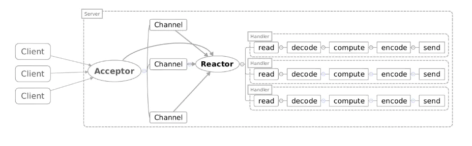
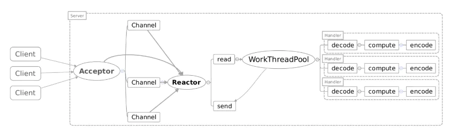
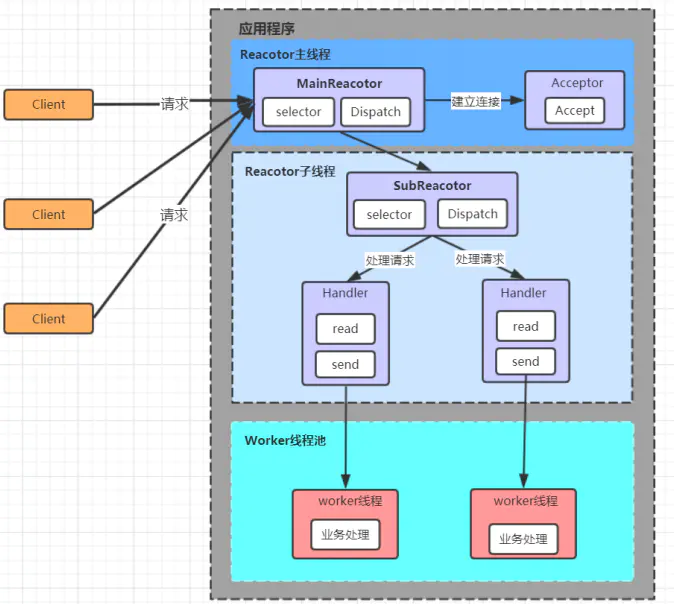
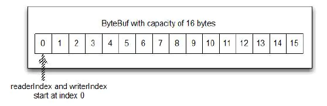
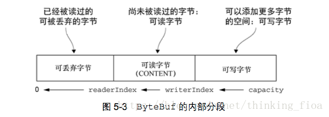
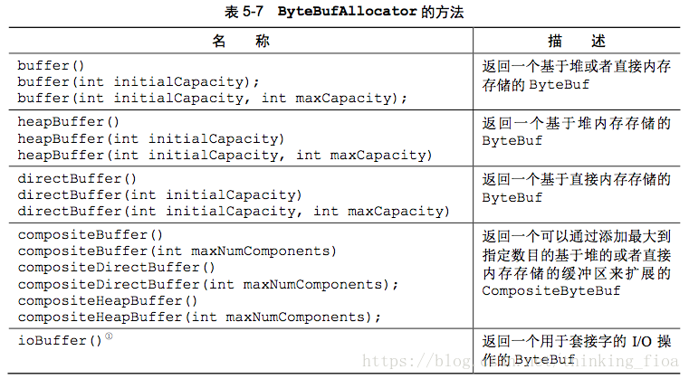
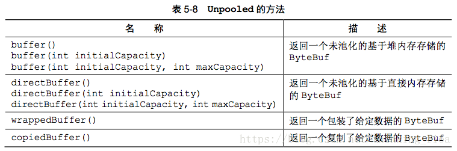

# Netty

## 介绍

### 什么是Netty？

Netty 是一个利用 Java 的高级网络的能力，隐藏其背后的复杂性而提供一个易于使用的 API 的客户端/服务器框架，是一个广泛使用的 Java 网络编程框架。

### Netty和Tomcat有什么区别？

Netty和Tomcat最大的区别就在于通信协议，Tomcat是基于Http协议的，他的实质是一个基于http协议的web容器，但是Netty不一样，他能通过编程自定义各种协议，因为netty能够通过codec自己来编码/解码字节流，完成类似redis访问的功能，这就是netty和tomcat最大的不同。

### 为什么Netty受欢迎？

如第一部分所述，netty是一款收到大公司青睐的框架，在我看来，netty能够受到青睐的原因有三：

1. 并发高
2. 传输快
3. 封装好

### Netty为什么并发高？

因为基于NIO模型。

### Netty为什么传输快？

因为NIO有一个特性就是零拷贝。传统的方式下，用户空间发起read请求，数据从硬件拷贝到内核空间，再拷贝到用户空间，此时的内核空间就是一个中转。零拷贝是指用户空间直接与硬件（网卡）进行数据交换，省去了拷贝到内核空间这一个步骤。

Netty针对这种情况，使用了NIO中的另一大特性——零拷贝，当他需要接收数据的时候，他会在堆内存之外开辟一块内存，数据就直接从IO读到了那块内存中去，在netty里面通过ByteBuf可以直接对这些数据进行直接操作，从而加快了传输速度。

传统方式：


零拷贝：


## Netty线程模型

netty基于Reactor模型，是对NIO模型的一种改进。

> Reactor就是经典的Java NIO模型，多Reactor模型就是将selector.select返回的key交由线程池来完成，而不是将所有的key都放到一个线程中完成。

### 单线程Reactor模型



这个模型和上面的NIO流程很类似，只是将消息相关处理独立到了Handler中去了。虽然上面说到NIO一个线程就可以支持所有的IO处理。但是瓶颈也是显而易见的，当只有一个客户端时，这个客户端需要处理多个请求，如果在Handler中的处理速度较慢，那么后续的客户端请求都会被积压，导致响应变慢，并且无法发挥多核CPU的性能，所以引入了Reactor多线程模型。

### 多线程Reactor模型



Reactor多线程模型就是将Handler中的IO操作和非IO操作分开，操作IO的线程称为IO线程，非IO操作的线程称为工作线程。这样的话，客户端的请求会直接被丢到线程池中，客户端发送请求就不会堵塞。

### 主从Reactor多线程



主线程只负责建立连接，将连接状态的key取出后注册到子Reactor，由子Reactor监听READ状态并派遣任务。

有多少个Reactor就有多少个线程，在主Reactor的线程上取出ACCEPT状态的channel需要注册到子Reactor上，那么如何进行线程之间的通信呢？其实只需要通过Reactor来传递，因为线程与Reactor是一一对应的，更改了对应的Reactor的状态也即改变了对应线程的状态。但是要注意，子Reactor线程需要不断地调用selector.select，这个方法是阻塞的，在将某个channel注册到某个子Selector上后，需要调用Selector.wakeup进行唤醒，使得能及时对新注册的channel进行监听。

多Reactor实例代码如下：

```java
public class NIOServer {

  private static final Logger LOGGER = LoggerFactory.getLogger(NIOServer.class);

  public static void main(String[] args) throws IOException {
    Selector selector = Selector.open();
    ServerSocketChannel serverSocketChannel = ServerSocketChannel.open();
    serverSocketChannel.configureBlocking(false);
    serverSocketChannel.bind(new InetSocketAddress(1234));
    serverSocketChannel.register(selector, SelectionKey.OP_ACCEPT);

    int coreNum = Runtime.getRuntime().availableProcessors();
    Processor[] processors = new Processor[2 * coreNum];
    for (int i = 0; i < processors.length; i++) {
      processors[i] = new Processor();
    }

    int index = 0;
    while (selector.select() > 0) {
      Set<SelectionKey> keys = selector.selectedKeys();
      for (SelectionKey key : keys) {
        keys.remove(key);
        if (key.isAcceptable()) {
          ServerSocketChannel acceptServerSocketChannel = (ServerSocketChannel) key.channel();
          SocketChannel socketChannel = acceptServerSocketChannel.accept();
          socketChannel.configureBlocking(false);
          LOGGER.info("Accept request from {}", socketChannel.getRemoteAddress());
          Processor processor = processors[(int) ((index++) % coreNum)];
          processor.addChannel(socketChannel);
          processor.wakeup();
        }
      }
    }
  }
}
```

```java
public class Processor {
  private static final Logger LOGGER = LoggerFactory.getLogger(Processor.class);
  private static final ExecutorService service =
      Executors.newFixedThreadPool(2 * Runtime.getRuntime().availableProcessors());

  private Selector selector;

  public Processor() throws IOException {
    this.selector = SelectorProvider.provider().openSelector();
    start();
  }

  public void addChannel(SocketChannel socketChannel) throws ClosedChannelException {
    socketChannel.register(this.selector, SelectionKey.OP_READ);
  }

  public void wakeup() {
    this.selector.wakeup();
  }

  public void start() {
    service.submit(() -> {
      while (true) {
        if (selector.select(500) <= 0) {
          continue;
        }
        Set<SelectionKey> keys = selector.selectedKeys();
        Iterator<SelectionKey> iterator = keys.iterator();
        while (iterator.hasNext()) {
          SelectionKey key = iterator.next();
          iterator.remove();
          if (key.isReadable()) {
            ByteBuffer buffer = ByteBuffer.allocate(1024);
            SocketChannel socketChannel = (SocketChannel) key.channel();
            int count = socketChannel.read(buffer);
            if (count < 0) {
              socketChannel.close();
              key.cancel();
              LOGGER.info("{}\t Read ended", socketChannel);
              continue;
            } else if (count == 0) {
              LOGGER.info("{}\t Message size is 0", socketChannel);
              continue;
            } else {
              LOGGER.info("{}\t Read message {}", socketChannel, new String(buffer.array()));
            }
          }
        }
      }
    });
  }
}
```

在Processor中，同样创建了一个静态的线程池，且线程池的大小为机器核数的两倍。每个Processor实例均包含一个Selector实例。同时每次获取Processor实例时均提交一个任务到该线程池，并且该任务正常情况下一直循环处理，不会停止。而提交给该Processor的SocketChannel通过在其Selector注册事件，加入到相应的任务中。由此实现了每个子Reactor包含一个Selector对象，并由一个独立的线程处理。

## Channel


+ Channel，表示一个连接，可以理解为每一个请求，就是一个Channel。

+ **ChannelHandler**，核心处理业务就在这里，用于处理业务请求。

+ ChannelHandlerContext，用于传输业务数据。

+ ChannelPipeline，用于保存处理过程需要用到的ChannelHandler和ChannelHandlerContext。

### 事件和ChannelHandler

1. 事件：发生某种事件触发适当的动作。比如入站触发事件: 链路激活(channelActive)／数据可读(channelRead)/发生异常(exceptionCaught)/...
2. Channelhandler：一组为了响应特定事件而被执行的回调函数。如:ChannelInboundHanderAdapter.java是一个入站事件

### Channel和EventLoop关系

1. 单个Channel只会映射到单个EventLoop
2. 单个EventLoop可以处理多个Channel(1:n关系)
3. 一个EventLoop在其生命周期内只能绑定到一个线程上
4. 由于单个Channel在其生命周期中只会有一个I/O线程，所以ChannelPipeline中多个ChannelHandler无需关心同步互斥问题

## Future

异步操作占位符。在操作完成时，提供结果的访问。

JDK提供的Future和ChannelFuture对比:

1. JDK提供的Future需要手动检查对应的操作是否完成，或一直阻塞直到它完成
2. ChannelFuture能够注册Listener监听器，监听器的回调函数operationComplete()能异步的在操作完成时被调用。

```java
public static void connect() {
    Channel channel = CHANNEL_FROM_SOMEWHERE;
 
    ChannelFuture future = channel.connect(new InetSocketAddress("127.0.0.1", 9080));
    future.addListener(new ChannelFutureListener() {
        @Override
        public void operationComplete(ChannelFuture future) throws Exception {
            if(future.isSuccess()) {
                ByteBuf buf = Unpooled.copiedBuffer("hello", Charset.defaultCharset());
                ChannelFuture wf = future.channel().writeAndFlush(buf);
                // ...
            } else {
                    // 失败后可尝试重连／切换链路
                future.cause().printStackTrace();
            }
        }
    })
}
```

## ByteBuf

### 原理

ByteBuf维护两个不同的索引: 读索引(readerIndex)和写索引(writerIndex)。如下图: 



+ ByteBuf维护了readerIndex和writerIndex索引
+ 当readerIndex > writerIndex时，则抛出IndexOutOfBoundsException
+ ByteBuf容量 = writerIndex。
+ ByteBuf可读容量 = writerIndex - readerIndex
+ readXXX()和writeXXX()方法将会推进其对应的索引。自动推进
+ getXXX()和setXXX()方法将对writerIndex和readerIndex无影响

### 使用模式

ByteBuf本质是: 一个由不同的索引分别控制读访问和写访问的字节数组。ByteBuf共有三种模式: 堆缓冲区模式(Heap Buffer)、直接缓冲区模式(Direct Buffer)和复合缓冲区模式(Composite Buffer)。

#### 堆缓冲区模式(Heap Buffer)

堆缓冲区模式又称为：支撑数组(backing array)。将数据存放在JVM的堆空间。

+ 堆缓冲的优点: 由于数据存储在Jvm堆中可以快速创建和快速释放，并且提供了数组直接快速访问的方法
+ 堆缓冲的缺点: 每次数据与I/O进行传输时，都需要将数据拷贝到直接缓冲区

```java
public static void heapBuffer() {
    // 创建Java堆缓冲区
    ByteBuf heapBuf = Unpooled.buffer(); 
    if (heapBuf.hasArray()) { // 是数组支撑
        byte[] array = heapBuf.array();
        int offset = heapBuf.arrayOffset() + heapBuf.readerIndex();
        int length = heapBuf.readableBytes();
        handleArray(array, offset, length);
    }
}
```

#### 直接缓冲区模式(Direct Buffer)

Direct Buffer属于堆外分配的直接内存，不会占用堆的容量。适用于套接字传输过程，避免了数据从内部缓冲区拷贝到直接缓冲区的过程，性能较好。

+ Direct Buffer的优点: 使用Socket传递数据时性能很好，避免了数据从Jvm堆内存拷贝到直接缓冲区的过程。提高了性能
+ Direct Buffer的缺点: 相对于堆缓冲区而言，Direct Buffer分配内存空间和释放更为昂贵
+ 对于涉及大量I/O的数据读写，建议使用Direct Buffer。而对于用于后端的业务消息编解码模块建议使用Heap Buffer

```java
public static void directBuffer() {
    ByteBuf directBuf = Unpooled.directBuffer();
    if (!directBuf.hasArray()) {
        int length = directBuf.readableBytes();
        byte[] array = new byte[length];
        directBuf.getBytes(directBuf.readerIndex(), array);
        handleArray(array, 0, length);
    }
}
```

#### 复合缓冲区模式(Composite Buffer)

Composite Buffer是Netty特有的缓冲区。本质上类似于提供一个或多个ByteBuf的组合视图，可以根据需要添加和删除不同类型的ByteBuf。

+ 它是一个组合视图。它提供一种访问方式让使用者自由的组合多个ByteBuf，避免了拷贝和分配新的缓冲区。
+ Composite Buffer不支持访问其支撑数组。因此如果要访问，需要先将内容拷贝到堆内存中，再进行访问。
+ 下图是将两个ByteBuf：头部+Body组合在一起，没有进行任何复制过程。仅仅创建了一个视图

```java
public static void byteBufComposite() {
    // 复合缓冲区，只是提供一个视图
    CompositeByteBuf messageBuf = Unpooled.compositeBuffer();
    ByteBuf headerBuf = Unpooled.buffer(); // can be backing or direct
    ByteBuf bodyBuf = Unpooled.directBuffer();   // can be backing or direct
    messageBuf.addComponents(headerBuf, bodyBuf);
    messageBuf.removeComponent(0); // remove the header
    for (ByteBuf buf : messageBuf) {
        System.out.println(buf.toString());
    }
}
```

### 字节级操作

#### 随机访问索引

ByteBuf的索引与普通的Java字节数组一样。第一个字节的索引是0，最后一个字节索引总是capacity()-1。并且：

- readXXX()和writeXXX()方法将会推进其对应的索引readerIndex和writerIndex。自动推进
- getXXX()和setXXX()方法用于访问数据，对writerIndex和readerIndex无影响

```java
public static void byteBufRelativeAccess() {
    ByteBuf buffer = Unpooled.buffer(); //get reference form somewhere
    for (int i = 0; i < buffer.capacity(); i++) {
        byte b = buffer.getByte(i);// 不改变readerIndex值
        System.out.println((char) b);
    }
}
```

#### 顺序访问索引

Netty的ByteBuf同时具有读索引和写索引，但JDK的ByteBuffer只有一个索引，所以JDK需要调用flip()方法在读模式和写模式之间切换。

ByteBuf被读索引和写索引划分成3个区域：可丢弃字节区域，可读字节区域和可写字节区域 ：



+ 可丢弃区域：
  + 可丢弃字节区域是指:[0，readerIndex)之间的区域。可调用discardReadBytes()方法丢弃已经读过的字节。
  + discardReadBytes()效果 ----- 将可读字节区域[readerIndex, writerIndex)往前移动readerIndex位，同时修改读索引和写索引。
    + discardReadBytes()方法会移动可读字节区域内容。如果频繁调用，会有多次数据复制开销，对性能有一定的影响。
+ 可读区域：
  + 可读字节区域是指:[readerIndex, writerIndex)之间的区域。任何名称以read和skip开头的操作方法，都会改变readerIndex索引。
+ 可写区域：
  + 可写字节区域是指:[writerIndex, capacity)之间的区域。任何名称以write开头的操作方法都将改变writerIndex的值。

### ByteBuf与JDK中的ByteBuffer对比

ByteBuf提供读访问索引(readerIndex)和写访问索引(writerIndex)来控制字节数组。ByteBuf API具有以下优点:

+ 允许用户自定义缓冲区类型扩展
+ 通过内置的复合缓冲区类型实现透明的零拷贝
+ 容量可按需增长
+ 读写这两种模式之间不需要调用类似于JDK的ByteBuffer的flip()方法进行切换
+ 读和写使用不同的索引
+ 支持方法的链式调用
+ 支持引用计数
+ 支持池化

### ByteBufHolder接口

ByteBufHolder为Netty的高级特性提供了支持，如缓冲区池化，可以从池中借用ByteBuf，并且在需要时自动释放。

1. ByteBufHolder是ByteBuf的容器，可以通过子类实现ByteBufHolder接口，根据自身需要添加自己需要的数据字段。可以用于自定义缓冲区类型扩展字段。

2. Netty提供了一个默认的实现DefaultByteBufHolder。

### ByteBuf分配

创建和管理ByteBuf实例的多种方式：按需分配(ByteBufAllocator)、Unpooled缓冲区和ByteBufUtil类。

#### 按需分配: ByteBufAllocator接口

Netty通过接口ByteBufAllocator实现了(ByteBuf的)池化。Netty提供池化和非池化的ButeBufAllocator: 

1. ChannelHandlerContext.channel().alloc().buffer() ----- 本质就是: ByteBufAllocator.DEFAULT

2. ByteBufAllocator.DEFAULT.buffer() ----- 返回一个基于堆或者直接内存存储的Bytebuf。默认是堆内存

3. ByteBufAllocator.DEFAULT ----- 有两种类型: UnpooledByteBufAllocator.DEFAULT(非池化)和PooledByteBufAllocator.DEFAULT(池化)。对于Java程序，默认使用PooledByteBufAllocator(池化)。对于安卓，默认使用UnpooledByteBufAllocator(非池化)

4. 可以通过BootStrap中的Config为每个Channel提供独立的ByteBufAllocator实例



### Unpooled缓冲区——非池化

Unpooled提供静态的辅助方法来创建未池化的ByteBuf。



```java
public void createByteBuf(ChannelHandlerContext ctx) {
    // 1. 通过Channel创建ByteBuf
    ByteBuf buf1 = ctx.channel().alloc().buffer();
    // 2. 通过ByteBufAllocator.DEFAULT创建
    ByteBuf buf2 =  ByteBufAllocator.DEFAULT.buffer();
    // 3. 通过Unpooled创建
    ByteBuf buf3 = Unpooled.buffer();
}
```

