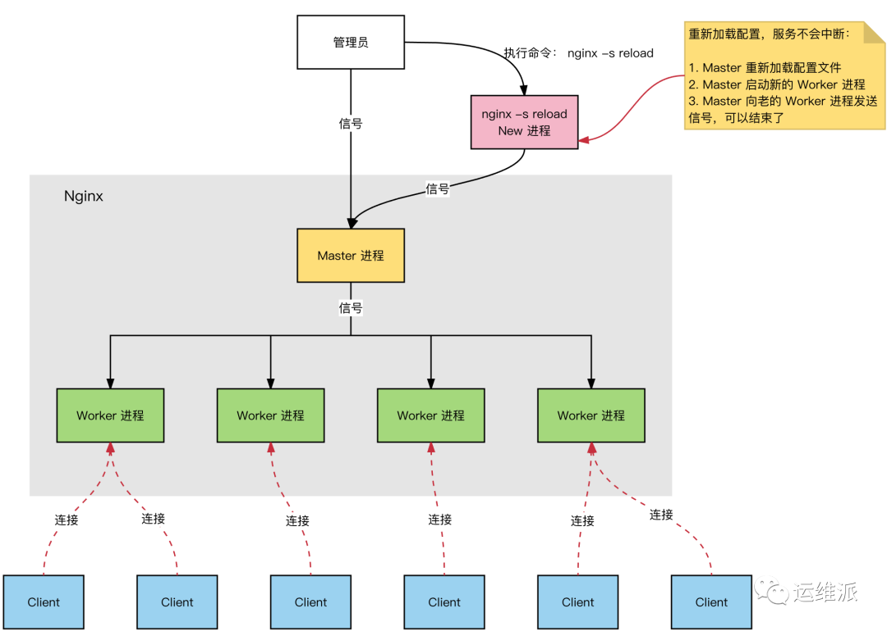

# Nginx

### 什么是Nginx？

Nginx是一个 轻量级/高性能的反向代理Web服务器，他实现非常高效的反向代理、负载平衡，他可以处理2-3万并发连接数，官方监测能支持5万并发，现在中国使用nginx网站用户有很多，例如：新浪、网易、 腾讯等。

### 为什么要用Nginx？

+ 跨平台、配置简单、方向代理、高并发连接：处理2-3万并发连接数，官方监测能支持5万并发，内存消耗小：开启10个nginx才占150M内存 ，nginx处理静态文件好，耗费内存少，

+ 而且Nginx内置的健康检查功能：如果有一个服务器宕机，会做一个健康检查，再发送的请求就不会发送到宕机的服务器了。重新将请求提交到其他的节点上。

+ 使用Nginx的话还能：
  + 节省宽带：支持GZIP压缩，可以添加浏览器本地缓存
  + 稳定性高：宕机的概率非常小
  + 接收用户请求是异步的

### 为什么Nginx性能这么高？

- 因为他的事件处理机制：异步非阻塞事件处理机制：运用了epoll模型，提供了一个队列，排队解决

### Nginx进程模型？

Nginx是多进程模型。

>为什么不是多线程模型？
>
>Nginx 要保证它的高可用 高可靠性, 如果Nginx 使用了多线程的时候,由于线程之间是共享同一个地址空间的,当某一个第三方模块引发了一个地址空间导致的断错时 (eg: 地址越界), 会导致整个Nginx全部挂掉; 当采用多进程来实现时, 往往不会出现这个问题。
>
>第二，对于每个worker进程来说，独立的进程，不需要加锁，所以省掉了锁带来的开销，同时在编程以及问题查找时，也会方便很多。

Nginx 服务器，正常运行过程中：

多进程：一个 Master 进程、多个 Worker 进程。

Master 进程：

（1）接收来自外界的信号。

（2）向各worker进程发送信号。

（3）监控woker进程的运行状态。

（4）当woker进程退出后（异常情况下），会自动重新启动新的woker进程。

Worker 进程：所有 Worker 进程都是平等的。实际处理：网络请求，由 Worker 进程处理。Worker 进程数量：在 nginx.conf 中配置，一般设置为CPU核心数，充分利用 CPU 资源，同时，避免进程数量过多，避免进程竞争 CPU 资源，增加上下文切换的损耗。

### Nginx最大连接数？

基础背景：

+ Nginx 是多进程模型，Worker 进程用于处理请求。
+ 单个进程的连接数（文件描述符 fd），有上限（nofile）：ulimit -n。
+ Nginx 上配置单个 Worker 进程的最大连接数：worker_connections 上限为 nofile。
+ Nginx 上配置 Worker 进程的数量：worker_processes。

因此，Nginx 的最大连接数：

+ Nginx 的最大连接数：Worker 进程数量 x 单个 Worker 进程的最大连接数。
+ 上面是 Nginx 作为通用服务器时，最大的连接数。
+ Nginx 作为反向代理服务器时，能够服务的最大连接数：（Worker 进程数量 x 单个 Worker 进程的最大连接数）/ 2。
+ Nginx 反向代理时，会建立 Client 的连接和后端 Web Server 的连接，占用 2 个连接。

### HTTP连接建立和请求处理过程？

HTTP 连接建立和请求处理过程如下：

- Nginx 启动时，Master 进程，加载配置文件。
- Master 进程，初始化监听的 Socket。
- Master 进程，Fork 出多个 Worker 进程。
- Worker 进程，竞争新的连接，获胜方通过三次握手，建立 Socket 连接，并处理请求。

### 什么是正向代理、反向代理？

正向代理是指帮助内网访问外网，从内到外；反向代理是指将外网的请求转发到内网服务器，从外到内。

**正向代理的用途：**

+ 访问原来无法访问的资源，如google

+ 可以做缓存，加速访问资源

+ 对客户端访问授权，上网进行认证

+ 代理可以记录用户访问记录（上网行为管理），对外隐藏用户信息

**反向代理的作用：**

（1）保证内网的安全，阻止web攻击，大型网站，通常将反向代理作为公网访问地址，Web服务器是内网

（2）负载均衡，通过反向代理服务器来优化网站的负载

另一种解释：

正向代理即是客户端代理, 代理客户端, 服务端不知道实际发起请求的客户端。

反向代理即是服务端代理, 代理服务端, 客户端不知道实际提供服务的服务端。

