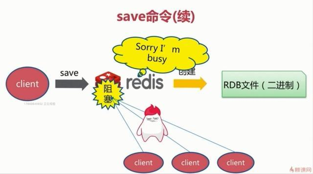
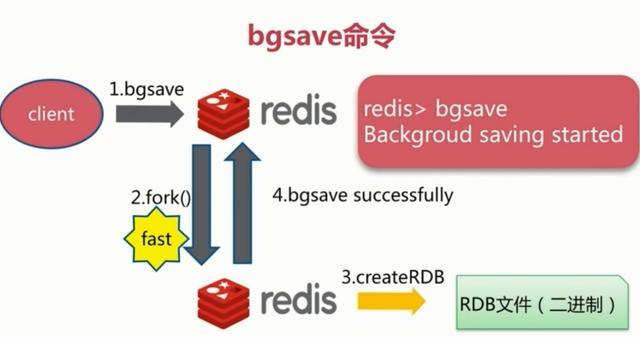
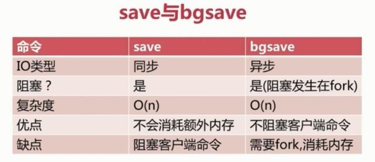
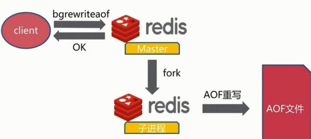
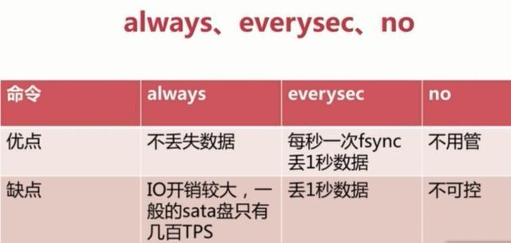
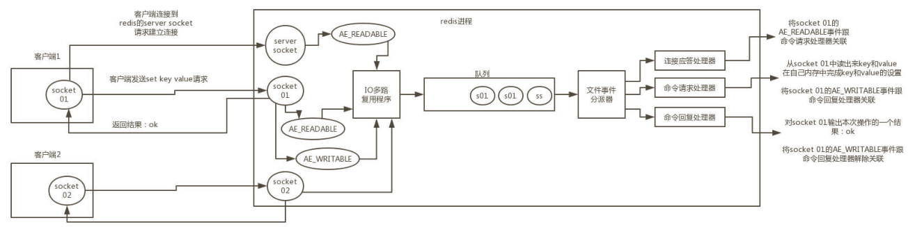
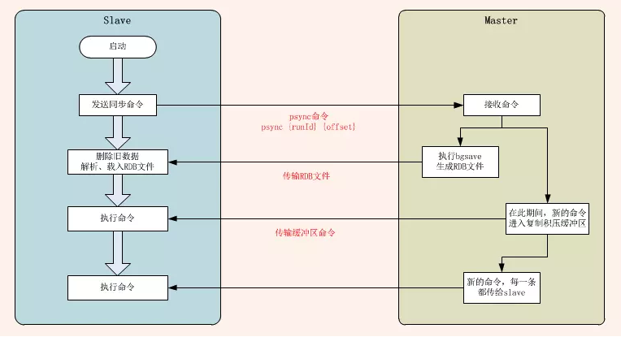
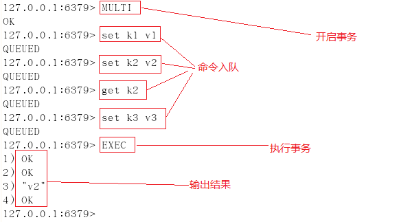
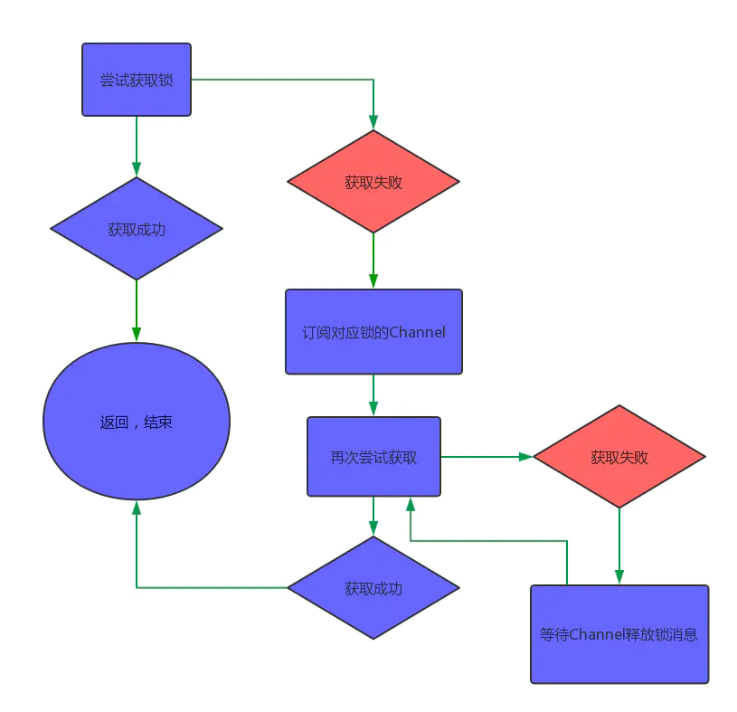
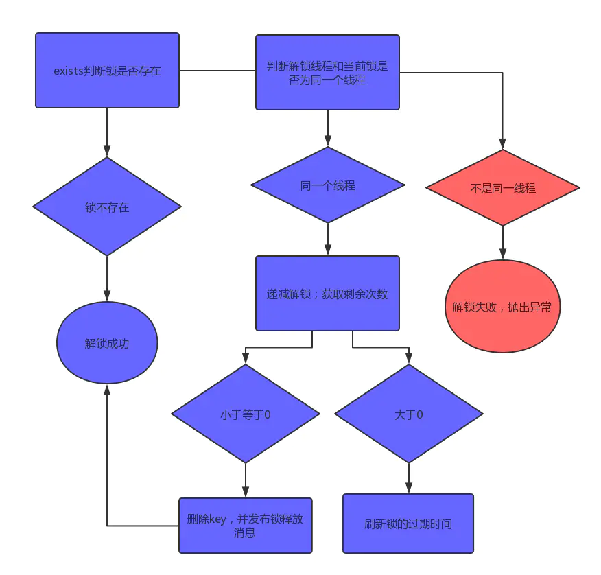

# Redis

## 什么是Redis

> Redis 是一个开源（BSD许可），内存存储的数据结构服务器，可用作数据库，高速缓存和消息队列代理。它支持字符串、哈希表、列表、集合、有序集合，位图，HyperLogLogs 等数据类型。内置复制、Lua 脚本、LRU 收回、事务，以及不同级别磁盘持久化功能，同时通过 Redis Sentinel 提供高可用，通过 Redis Cluster 提供自动分区。根据月度排行网站 DB-Engines的数据，Redis 是最流行的键值对存储数据库。

Redis 全称为：Remote Dictionary Server（远程数据服务），**由C语言编写**，是一个基于内存且支持持久化的高性能 key-value 数据库，官方提供的数据显示可以达到10w+的qps。具备一下三个基本特征：

- 多数据类型
- 持久化机制
- 主从同步

## Redis有什么优点和缺点？

### 优点

- 读写性能优异， Redis能读的速度是110000次/s，写的速度是81000次/s。
- 支持数据持久化，支持AOF和RDB两种持久化方式。
- 支持事务，Redis的所有操作都是原子性的，同时Redis还支持对几个操作合并后的原子性执行。
- 数据结构丰富，除了支持string类型的value外还支持hash、set、zset、list等数据结构。
- 支持主从复制，主机会自动将数据同步到从机，可以进行读写分离。

### 缺点

- 数据库容量受到物理内存的限制，不能用作海量数据的高性能读写，因此Redis 适合的场景主要局限在较小数据量的高性能操作和运算上。
- Redis 不具备自动容错和恢复功能，主机从机的宕机都会导致前端部分读写请求失败，需要等待机器重启或者手动切换前端的IP才能恢复。
- 主机宕机，宕机前有部分数据未能及时同步到从机，切换IP后还会引入数据不一致的问题，降低了系统的可用性。
- Redis 较难支持在线扩容，在集群容量达到上限时在线扩容会变得很复杂。为避免这一问题，运维人员在系统上线时必须确保有足够的空间，这对资源造成了很大的浪费。

### Redis的数据类型有哪些？

Redis 主要有以下几种数据类型：

- String：这是最简单的类型，就是普通的 set 和 get，做简单的 KV 缓存。

  ```
  > SET str "hello"
  > GET str
  "hello"
  ```

- Hash：这个是类似 map 的一种结构，这个一般就是可以将结构化的数据，比如一个对象（前提是这个对象没嵌套其他的对象）给缓存在 Redis 里，然后每次读写缓存的时候，可以就操作 hash 里的某个字段。

  ```
  > HMSET obj filed1 "hello" field2 "world"
  > HGET obj filed1
  "hello"
  > HGET obj field2
  "world"
  ```

- List：List 是有序列表，这个可以玩儿出很多花样。比如可以通过 list 存储一些列表型的数据结构，类似粉丝列表、文章的评论列表之类的东西。你可以添加一个元素到列表的头部（左边）或者尾部（右边）。

  ```
  > lpush runoob redis
  (integer) 1
  > lpush runoob mongodb
  (integer) 2
  > lpush runoob rabbitmq
  (integer) 3
  > lrange runoob 0 10
  1) "rabbitmq"
  2) "mongodb"
  3) "redis"
  ```

- Sets：是无序集合，自动去重。直接基于 set 将系统里需要去重的数据扔进去，自动就给去重了，如果你需要对一些数据进行快速的全局去重，你当然也可以基于 jvm 内存里的 HashSet 进行去重，但是如果你的某个系统部署在多台机器上呢？得基于 Redis 进行全局的 set 去重。

  ```
  > sadd runoob redis
  (integer) 1
  > sadd runoob mongodb
  (integer) 1
  > sadd runoob rabbitmq
  (integer) 1
  > sadd runoob rabbitmq
  (integer) 0
  > smembers runoob
  1) "redis"
  2) "rabbitmq"
  3) "mongodb"
  ```

- Sorted Set：排序的 set，去重但可以排序，写进去的时候给一个分数，自动根据分数排序。 可以用来做排行榜相关功能。

  ```
  zadd key score member 
  ```

  ```
  > zadd runoob 0 redis
  (integer) 1
  > zadd runoob 0 mongodb
  (integer) 1
  > zadd runoob 0 rabbitmq
  (integer) 1
  > zadd runoob 0 rabbitmq
  (integer) 0
  > ZRANGEBYSCORE runoob 0 1000
  1) "mongodb"
  2) "rabbitmq"
  3) "redis"
  ```

## Redis持久化

### 持久化流程

1. 客户端向服务端发送写操作(数据在客户端的内存中)。
2. 数据库服务端接收到写请求的数据(数据在服务端的内存中)。
3. 服务端调用write这个系统调用，将数据往磁盘上写(数据在系统内存的缓冲区中)。
4. 操作系统将缓冲区中的数据转移到磁盘控制器上(数据在磁盘缓存中)。
5. 磁盘控制器将数据写到磁盘的物理介质中(数据真正落到磁盘上)。

这5个过程是在理想条件下一个正常的保存流程，但是在大多数情况下，我们的机器等等都会有各种各样的故障，这里划分了两种情况：

（1）Redis数据库发生故障，只要在上面的第三步执行完毕，那么就可以持久化保存，剩下的两步由操作系统替我们完成。

（2）操作系统发生故障，必须上面5步都完成才可以。

Redis提供了两种策略机制，也就是RDB和AOF。

### RDB机制(Redis DataBase)

RDB持久化是指在指定的时间间隔内将内存中的数据集快照写入磁盘。也是默认的持久化方式，这种方式是就是将内存中数据以快照的方式写入到二进制文件中，先将数据集写入临时文件，写入成功后，再替换之前的文件，用二进制压缩存储。

既然RDB机制是通过把某个时刻的所有数据生成一个快照来保存，那么就应该有一种触发机制，是实现这个过程。对于RDB来说，提供了三种机制：save、bgsave、自动化。我们分别来看一下：

#### save

该命令会阻塞当前Redis服务器，执行save命令期间，Redis不能处理其他命令，直到RDB过程完成为止。具体流程如下：



#### bgsave

执行该命令时，Redis会在后台异步进行快照操作，快照同时还可以响应客户端请求。具体流程如下：



具体操作是Redis进程执行fork操作创建子进程，RDB持久化过程由子进程负责，完成后自动结束。阻塞只发生在fork阶段，一般时间很短。基本上 Redis 内部所有的RDB操作都是采用 bgsave 命令。

#### 自动触发

自动触发是由我们的配置文件来完成的。在redis.conf配置文件中，里面有如下配置，我们可以去设置：

+ save：这里是用来配置触发 Redis的 RDB 持久化条件，也就是什么时候将内存中的数据保存到硬盘。比如“save m n”。表示m秒内数据集存在n次修改时，自动触发bgsave。

> 不需要持久化，那么你可以注释掉所有的 save 行来停用保存功能。

+ stop-writes-on-bgsave-error：默认值为yes。当启用了RDB且最后一次后台保存数据失败，Redis是否停止接收数据。这会让用户意识到数据没有正确持久化到磁盘上，否则没有人会注意到灾难（disaster）发生了。如果Redis重启了，那么又可以重新开始接收数据了
+ rdbcompression：默认值是yes。对于存储到磁盘中的快照，可以设置是否进行压缩存储。
+ rdbchecksum：默认值是yes。在存储快照后，我们还可以让redis使用CRC64算法来进行数据校验，但是这样做会增加大约10%的性能消耗，如果希望获取到最大的性能提升，可以关闭此功能。
+ dbfilename：设置快照的文件名，默认是 dump.rdb。
+ dir：设置快照文件的存放路径，这个配置项一定是个目录，而不能是文件名。

我们可以修改这些配置来实现我们想要的效果。因为第三种方式是配置的，所以我们对前两种进行一个对比：



#### RDB的优势和劣势

+ 优势
  + RDB文件紧凑，全量备份，非常适合用于进行备份和灾难恢复。
  + 生成RDB文件的时候，redis主进程会fork()一个子进程来处理所有保存工作，主进程不需要进行任何磁盘IO操作。
  + 恢复更快。相比于 AOF 机制，RDB 的恢复速度更更快，更适合恢复数据，特别是在数据集非常大的情况。
+ 劣势
  
  + RDB快照是一次全量备份，存储的是内存数据的二进制序列化形式，存储上非常紧凑。当进行快照持久化时，会开启一个子进程专门负责快照持久化，子进程会拥有父进程的内存数据，父进程修改内存子进程不会反应出来，所以在快照持久化期间修改的数据不会被保存，可能丢失数据。
  
  + 如果你想保证数据的高可用性，即最大限度的避免数据丢失，那么 RDB 将不是一个很好的选择。因为系统一旦在定时持久化之前出现宕机现象，此前没有来得及写入磁盘的数据都将丢失。
  
    > 所以，RDB 实际场景下，需要和 AOF 一起使用。
  
  + 由于 RDB 是通过 fork 子进程来协助完成数据持久化工作的，因此，如果当数据集较大时，可能会导致整个服务器停止服务几百毫秒，甚至是 1 秒钟。
  
    > 所以，RDB 建议在业务低估，例如在半夜执行。

### AOF机制(Append Only File)

全量备份总是耗时的，有时候我们提供一种更加高效的方式AOF，工作机制很简单，redis会将每一个收到的写命令都通过write函数追加到文件中。通俗的理解就是日志记录。

#### 持久化原理


#### 文件重写原理

AOF的方式也同时带来了另一个问题。持久化文件会变的越来越大。为了压缩aof的持久化文件。redis提供了bgrewriteaof命令。将内存中的数据以命令的方式保存到临时文件中，同时会fork出一条新进程来将文件重写。



重写aof文件的操作，并没有读取旧的aof文件，而是将整个内存中的数据库内容用命令的方式重写了一个新的aof文件，这点和快照有点类似。

#### AOP的三种触发机制

（1）每修改同步always：同步持久化 每次发生数据变更会被立即记录到磁盘 性能较差但数据完整性比较好

（2）每秒同步everysec：异步操作，每秒记录 如果一秒内宕机，有数据丢失。默认策略。

（3）不同no：从不同步



#### 优点

（1）AOF可以更好的保护数据不丢失，一般AOF会每隔1秒，通过一个后台线程执行一次fsync操作，最多丢失1秒钟的数据。

（2）由于该机制对日志文件的写入操作采用的是 append 模式，因此在写入过程中即使出现宕机现象，也不会破坏日志文件中已经存在的内容。

（3）因为以 append-only 模式写入，所以没有任何磁盘寻址的开销，写入性能非常高。

（3）AOF日志文件即使过大的时候，出现后台重写操作，也不会影响客户端的读写。

（4）AOF日志文件的命令通过可读的方式进行记录（就是说可以易读，直接看就能明白恢复数据要怎么做），这个特性非常适合做灾难性的误删除的紧急恢复。比如某人不小心用flushall命令清空了所有数据，只要这个时候后台rewrite（这里应该指AOF的重写）还没有发生，那么就可以立即拷贝AOF文件，将最后一条flushall命令给删了，然后再将该AOF文件放回去，就可以通过恢复机制，自动恢复所有数据。

#### 缺点

（1）对于同一份数据来说，AOF日志文件通常比RDB数据快照文件更大

（2）AOF开启后，支持的写QPS会比RDB支持的写QPS低，因为AOF一般会配置成每秒fsync一次日志文件，当然，每秒一次fsync，性能也还是很高的

（3）以前AOF发生过bug，就是通过AOF记录的日志，进行数据恢复的时候，没有恢复一模一样的数据出来。

### RDB和AOF应该如何选择？

通常都是结合使用。


bgsave 做镜像全量持久化，AOF 做增量持久化。因为 bgsave 会耗费较长时间，不够实时，在停机的时候会导致大量丢失数据，所以需要 AOF 来配合使用。在 Redis 实例重启时，会使用 bgsave 持久化文件重新构建内存，再使用 AOF 重放近期的操作指令来实现完整恢复重启之前的状态。

### 如果突然机器掉电会怎样？

取决于 AOF 日志 sync 属性的配置，如果不要求性能，在每条写指令时都 sync 一下磁盘，就不会丢失数据。但是在高性能的要求下每次都 sync 是不现实的，一般都使用定时 sync，比如 1 秒 1 次，这个时候最多就会丢失 1 秒的数据。 实际上，极端情况下，是最多丢失 2 秒的数据。因为 AOF 线程，负责每秒执行一次 fsync 操作，操作完成后，记录最后同步时间。主线程，负责对比上次同步时间，如果超过 2 秒，阻塞等待成功。

### bgsave的原理是什么？

fork 和 cow。fork 是指 Redis 通过创建子进程来进行 bgsave 操作。cow 指的是 copy on write，子进程创建后，父子进程共享数据段，父进程继续提供读写服务，写脏的页面数据会逐渐和子进程分离开来。 这里 bgsave 操作后，会产生 RDB 快照文件。

> cow原理：
>
> fork()之后，kernel把父进程中所有的内存页的权限都设为read-only，然后子进程的地址空间指向父进程。当父子进程都只读内存时，相安无事。当其中某个进程写内存时，CPU硬件检测到内存页是read-only的，于是触发页异常中断（page-fault），陷入kernel的一个中断例程。中断例程中，kernel就会**把触发的异常的页复制一份**，于是父子进程各自持有独立的一份。
>
> cow的好处是什么？
>
> - COW技术可**减少**分配和复制大量资源时带来的**瞬间延时**。
> - COW技术可减少**不必要的资源分配**。比如fork进程时，并不是所有的页面都需要复制，父进程的**代码段和只读数据段都不被允许修改，所以无需复制**。
>
> cow的缺点是什么？
>
> - 如果在fork()之后，父子进程都还需要继续进行写操作，**那么会产生大量的分页错误(页异常中断page-fault)**，这样就得不偿失。

## Redis线程

### Redis是单线程的吗？

这里的单线程指的是 Redis 网络请求模块使用了一个线程（所以不需考虑并发安全性），即一个线程处理所有网络请求，其他模块仍用了多个线程。

### Redis为什么这么快？

1. 绝大部分请求是纯粹的内存操作（非常快速）

2. 采用单线程，避免了不必要的上下文切换和锁竞争条件

3. 使用多路I/O复用模型，非阻塞 IO，内部采用 epoll，epoll 中的读、写、关闭、连接都转化成了事件，然后利用 epoll 的多路复用特性，避免 IO 代价。

   >多路I/O复用模型是利用 select、poll、epoll 可以同时监察多个流的 I/O 事件的能力，在空闲的时候，会把当前线程阻塞掉，当有一个或多个流有 I/O 事件时，就从阻塞态中唤醒，于是程序就会轮询一遍所有的流（epoll 是只轮询那些真正发出了事件的流），并且只依次顺序的处理就绪的流，这种做法就避免了大量的无用操作。
   >
   >**这里“多路”指的是多个网络连接，“复用”指的是复用同一个线程。**采用多路 I/O 复用技术可以让单个线程高效的处理多个连接请求（尽量减少网络 IO 的时间消耗），且 Redis 在内存中操作数据的速度非常快，也就是说内存内的操作不会成为影响Redis性能的瓶颈，主要由以上几点造就了 Redis 具有很高的吞吐量。

### Redis为什么是单线程

官方FAQ表示，因为Redis是基于内存的操作，CPU不是Redis的瓶颈，Redis的瓶颈最有可能是机器内存的大小或者网络带宽。既然单线程容易实现，而且CPU不会成为瓶颈，那就顺理成章地采用单线程的方案了。（并且上下文切换的代价可以避免）

### Redis和Memcached的区别有哪些？

从以下8个方面来讲：

- Redis 和 Memcache 都是将数据存放在内存中，都是内存数据库。不过 Memcache 还可用于缓存其他东西，例如图片、视频等等。
- Memcache 仅支持key-value结构的数据类型，Redis不仅仅支持简单的key-value类型的数据，同时还提供list，set，hash等数据结构的存储。
- 虚拟内存– Redis 当物理内存用完时，可以将一些很久没用到的value 交换到磁盘分布式–设定 Memcache 集群，利用 magent 做一主多从; Redis 可以做一主多从。都可以一主一从
- 存储数据安全– Memcache 挂掉后，数据没了； Redis 可以定期保存到磁盘（持久化）
- Memcache 的单个value最大 1m，Redis 的单个value最大 512m。
- 灾难恢复– Memcache 挂掉后，数据不可恢复; Redis 数据丢失后可以通过 aof 恢复
- Redis 原生就支持集群模式， Redis3.0 版本中，官方便能支持Cluster模式了， Memcached 没有原生的集群模式，需要依赖客户端来实现，然后往集群中分片写入数据。
- Memcached 网络IO模型是多线程，非阻塞IO复用的网络模型，原型上接近于 nignx。而 Redis使用单线程的IO复用模型，自己封装了一个简单的 AeEvent 事件处理框架，主要实现类epoll，kqueue 和 select，更接近于Apache早期的模式。

### Redis的线程模型

Redis 内部使用文件事件处理器 file event handler，这个文件事件处理器是单线程的，所以Redis 才叫做单线程的模型。它采用 IO 多路复用机制同时监听多个 socket，根据 socket 上的事件来选择对应的事件处理器进行处理。

文件事件处理器的结构包含 4 个部分：

- 多个 socket。
- IO 多路复用程序。
- 文件事件分派器。
- 事件处理器（连接应答处理器、命令请求处理器、命令回复处理器）。

多个 socket 可能会并发产生不同的操作，每个操作对应不同的文件事件，但是 IO 多路复用程序会监听多个 socket，会将 socket 产生的事件放入队列中排队，事件分派器每次从队列中取出一个事件，把该事件交给对应的事件处理器进行处理。

#### 事件的类型

I/O多路复用程序可以监听多个套接字的ae.h/AE_READABLE事件和ae.h/AE_WRITABLE事件，这两类事件和套接字操作之间的对应关系如下：

- 当套接字变得可读时（客户端对套接字执行**write**操作，或者执行**close**操作），或者有新的可应答（acceptable）套接字出现时（客户端对服务器的监听套接字执行**connect**操作），套接字产生AE_READABLE事件；
- 当套接字变得可写时（客户端对套接字执行**read**操作），套接字产生AE_WRITABLE事件。

I/O多路复用程序允许服务器同时监听套接字的AE_READABLE事件和AE_WRITABLE事件，如果一个套接字同时产生了这两种事件，那么文件事件分派器会优先处理AE_READABLE事件，等到AE_READABLE事件处理完之后，才处理AE_WRITABLE事件。



上图的流程为：

1. 客户端 Socket01 向 Redis 的 Server Socket 请求建立连接，此时 Server Socket 会产生一个AE_READABLE 事件，IO 多路复用程序监听到 server socket 产生的事件后，将该事件压入队列 中。文件事件分派器从队列中获取该事件，交给连接应答处理器。连接应答处理器会创建一个 能与客户端通信的 Socket01，并将该 Socket01 的 AE_READABLE 事件与命令请求处理器关 联。
2. 假设此时客户端发送了一个 set key value 请求，此时 Redis 中的 Socket01 会产生AE_READABLE 事件，IO 多路复用程序将事件压入队列，此时事件分派器从队列中获取到该事 件，由于前面 Socket01 的 AE_READABLE 事件已经与命令请求处理器关联，因此事件分派器 将事件交给命令请求处理器来处理。命令请求处理器读取 Socket01 的 set key value 并在自己 内存中完成 set key value 的设置。操作完成后，它会将 Socket01 的 AE_WRITABLE 事件与令 回复处理器关联。
3. 如果此时客户端准备好接收返回结果了，那么 Redis 中的 Socket01 会产生一个AE_WRITABLE 事件，同样压入队列中，事件分派器找到相关联的命令回复处理器，由命令回复处理器对 Socket01 输入本次操作的一个结果，比如 ok，之后解除 Socket01 的AE_WRITABLE 事件与命令回复处理器的关联。

### 为什么Redis单线程模型的效率也能这么高？

可以从下面5个方面来回答：

1. C语言实现，效率高
2. 纯内存操作
3. 基于非阻塞的IO复用模型机制
4. 单线程的话就能避免多线程的频繁上下文切换问题
5. 丰富的数据结构（全称采用hash结构，读取速度非常快，对数据存储进行了一些优化，比如亚索表，跳表等）

### 为什么说CPU不是redis的瓶颈？

1. redis基于内存，CPU从内存读取数据非常快
2. redis基于单线程，不用进行多线程切换等调度消耗

内存大小和网络带宽才有可能是redis的瓶颈。

### Redis是单线程的，如何提高多核CPU的利用率？

为了最大限度的使用CPU，可以在同一个服务器部署多个Redis的实例，并把他们当作不同的服务器来使用，然后使用`taskset -pc kenel pid`的命令来将某个redis实例绑定到指定的CPU上。

## Redis同步机制

### 全量同步



Redis可以使用主从同步，从从同步。第一次同步时，主节点做一次bgsave，并同时将后续修改操作记录到内存buffer，待完成后将rdb文件全量同步到复制节点，复制节点接受完成后将rdb镜像加载到内存。

加载完成后，再通知主节点将期间修改的操作记录同步到复制节点进行重放就完成了同步过程。

### 增量同步

增量复制的过程主要是主服务器每执行一个写命令就会向从服务器发送相同的写命令，从服务器接收并执行收到的写命令。

### 主从同步策略

主从刚刚连接的时候，进行全量同步；全同步结束后，进行增量同步。当然，如果有需要，slave 在任何时候都可以发起全量同步。redis 策略是，无论如何，首先会尝试进行增量同步，如不成功，要求从机进行全量同步。

## Redis Pipelining

> 管道是一种技术，client不等待上一个请求的响应，只要server端按照请求的顺序返回响应即可。
>
> 管道带来了以下优势：
>
> + 减少了多个请求的整体环回时间，提高了性能
> + 对于Server端，能够在单位时间内接受到更多的请求，在server端性能满足的前提下，提高了server端的吞吐量
>
> 管道也有很多限制：
>
> + 请求之间应该保证无依赖，后一个请求不能依赖前一个请求的响应结果。
> + 非幂等性请求不能使用pipelining（如post请求），同样的post请求会改变资源的状态，在使用pipelining技术中，会导致不幂等。

Redis pipelining使得client能够无等待响应的方式连续发送多条命令请求至Redis Server端，然后Server端按照请求顺序返回响应结果。

## Redis有几种过期的策略？

### 设置过期时间

+ expire key time，以时间为单位
+ SETEX KEY_NAME TIMEOUT VALUE，这是字符串独有的方式

>1、除了字符串自己独有设置过期时间的方法外，其他方法都需要依靠expire方法来设置时间
>2、如果没有设置时间，那缓存就是永不过期
>3、如果设置了过期时间，之后又想让缓存永不过期，使用persist key

### 3种过期策略

+ 定时删除
  + 含义：在设置key的过期时间的同时，为该key创建一个定时器，让定时器在key的过期时间来临时，对key进行删除
  + 优点：保证内存被尽快释放
  + 缺点：
    + 若过期key很多，删除这些key会占用很多的CPU时间，在CPU时间紧张的情况下，CPU不能把所有的时间用来做要紧的事儿，还需要去花时间删除这些key
    + 定时器的创建耗时，若为每一个设置过期时间的key创建一个定时器（将会有大量的定时器产生），性能影响严重
+ 惰性删除
  + 含义：key过期的时候不删除，每次从数据库获取key的时候去检查是否过期，若过期，则删除，返回null
  + 优点：删除操作只发生在从数据库取出key的时候发生，而且只删除当前key，所以对CPU时间的占用是比较少的，而且此时的删除是已经到了非做不可的地步（如果此时还不删除的话，我们就会获取到了已经过期的key了）
  + 缺点：若大量的key在超出超时时间后，很久一段时间内，都没有被获取过，那么可能发生内存泄露（无用的垃圾占用了大量的内存）
+ 定期删除
  + 含义：每隔一段时间执行一次删除(在redis.conf配置文件设置hz，1s刷新的频率)过期key操作
  + 优点：
    + 通过限制删除操作的时长和频率，来减少删除操作对CPU时间的占用--处理"定时删除"的缺点
    + 定期删除过期key--处理"惰性删除"的缺点
  + 缺点：
    + 在内存友好方面，不如"定时删除"
    + 在CPU时间友好方面，不如"惰性删除"
  + 难点：
    + 合理设置删除操作的执行时长（每次删除执行多长时间）和执行频率（每隔多长时间做一次删除）（这个要根据服务器运行情况来定了）

看完上面三种策略后可以得出以下结论： 

+ 定时删除和定期删除为主动删除：Redis会定期主动淘汰一批已过去的key

  > 定时与定期的区别在于，前者通过每个key设置一个计时器，后者是周期性轮询

+ 惰性删除为被动删除：用到的时候才会去检验key是不是已过期，过期就删除

+ 惰性删除为redis服务器内置策略

定期删除可以通过：

- 第一、配置redis.conf 的hz选项，默认为10 （即1秒执行10次，100ms一次，值越大说明刷新频率越快，最Redis性能损耗也越大） 
- 第二、配置redis.conf的maxmemory最大值，当已用内存超过maxmemory限定时，就会触发主动清理策略

### Redis采用的过期策略

惰性删除+定期删除

- 惰性删除流程
  - 在进行get或setnx等操作时，先检查key是否过期，
  - 若过期，删除key，然后执行相应操作；
  - 若没过期，直接执行相应操作
- 定期删除流程（简单而言，对指定个数个库的每一个库随机删除小于等于指定个数个过期key）
  - 遍历每个数据库（就是redis.conf中配置的"database"数量，默认为16）
    - 检查当前库中的指定个数个key（默认是每个库检查20个key，注意相当于该循环执行20次，循环体时下边的描述）
      - 如果当前库中没有一个key设置了过期时间，直接执行下一个库的遍历
      - 随机获取一个设置了过期时间的key，检查该key是否过期，如果过期，删除key
      - 判断定期删除操作是否已经达到指定时长，若已经达到，直接退出定期删除。

## Redis有哪几种数据淘汰策略？

>最为大家所熟悉的，就是我们在进行redis存值的时候，可以针对每个key-value设置过期时间，时间到，数据自动删除。但是，当我们每个key-value都设置不过期的话，redis是不是就会被撑爆了呢？答案是不太会的，为什么这样说？是因为当我们的redis内存达到设置的maxmemory的时候，就会使用数据淘汰策略来保证redis的高可用性。

### redis的六种淘汰策略

+ volatile-lru： 从已设置过期的数据中中随机挑选最近最少使用的多个key进行数据淘汰。
+ volatile-ttl： 从已设置过期的数据中挑选即将要过期的数据进行淘汰。
+ volatile-random：从已设置过期的数据中任意淘汰数据。
+ allkeys-lru： 从数据集中挑选最近最少使用的数据淘汰。
+ allkeys-random：从数据集中任意选择数据淘汰。
+ noeviction: 不进行删除，达到最大内存时，直接返回错误信息。

以上六点的配置是在redis的配置是文件中maxmemory-policy来决定具体使用哪种淘汰策略。我们可以根据业务场景的不同使用不同的淘汰策略。

## 一个字符串类型的值能存储最大容量是多少？

512M。

## Redis事务

### 概念

Redis 事务的本质是一组命令的集合。事务支持一次执行多个命令，一个事务中所有命令都会被序列化。在事务执行过程，会按照顺序串行化执行队列中的命令，其他客户端提交的命令请求不会插入到事务执行命令序列中。

总结说：redis事务就是一次性、顺序性、排他性的执行一个队列中的一系列命令。

### 没有隔离级别的概念

批量操作在发送 EXEC 命令前被放入队列缓存，并不会被实际执行，也就不存在事务内的查询要看到事务里的更新，事务外查询不能看到。

### 不保证原子性

Redis中，单条命令是原子性执行的，但事务不保证原子性，且没有回滚。事务中任意命令执行失败，其余的命令仍会被执行。

### 事务的三个阶段

+ 开始事务
+ 命令入队
+ 执行事务

### 事务相关命令

+ watch key1 key2 ...：监视一或多个key,如果在事务执行之前，被监视的key被其他命令改动，则事务被打断 （ 类似乐观锁 ）
+ multi : 标记一个事务块的开始（ queued ）
+ exec : 执行所有事务块的命令 （ 一旦执行exec后，之前加的监控锁都会被取消掉 ）　
+ discard : 取消事务，放弃事务块中的所有命令
+ unwatch : 取消watch对所有key的监控

### 案例

#### 正常执行



#### 放弃事务


#### 若事务队列中存在语法错误，则执行EXEC时，所有命令都不会执行


#### 若事务队列中某个语句执行失败，则执行EXEC命令时，其他正确命令会执行，错误的命令抛出异常


### Redis事务的注意点有哪些？

1. 不支持回滚，如果事务中有错误的操作，无法回滚到处理前的状态，需要开发者处理。
2. 在执行完当前事务内所有指令前，不会同时执行其他客户端的请求。

### 为什么Redis事务不支持回滚？

Redis 事务不支持回滚，如果遇到问题，会继续执行余下的命令。 这一点和关系型数据库不太一致。这样处理的原因有：

1. 只有语法错误，Redis才会执行失败，例如错误类型的赋值， 这就是说从程序层面完全可以捕获以及解决这些问题
2. 支持回滚需要增加很多工作，不支持的情况下，Redis 可以保持简单、速度快的特性

## Redis有哪些应用场景？

### 缓存数据

Redis提供了键过期功能，也提供了灵活的键淘汰策略，所以，现在Redis用在缓存的场合非常多。

### 排行榜

很多网站都有排行榜应用的，如京东的月度销量榜单、商品按时间的上新排行榜等。Redis提供的有序集合数据类构能实现各种复杂的排行榜应用。

### 计数器

如电商网站商品的浏览量、视频网站视频的播放数等。为了保证数据实时效，每次浏览都得给+1，并发量高时如果每次都请求数据库操作无疑是种挑战和压力。

### 分布式会话

集群模式下，在应用不多的情况下一般使用容器自带的session复制功能就能满足，当应用增多相对复杂的系统中，一般都会搭建以Redis等内存数据库为中心的session服务，session不再由容器管理，而是由session服务及内存数据库管理。

### 分布式锁

分布式锁实现方案，常见有三种：数据库，Redis、zookeepr。Redis就是其中之一。

如全局ID、减库存、秒杀等场景，并发量不大的场景可以使用数据库的悲观锁、乐观锁来实现，但在并发量高的场合中，利用数据库锁来控制资源的并发访问是不太理想的，大大影响了数据库的性能。可以利用Redis的setnx功能来编写分布式的锁，如果设置返回1说明获取锁成功，否则获取锁失败，实际应用中要考虑的细节要更多。

### 社交网络

点赞、踩、关注/被关注、共同好友等是社交网站的基本功能，社交网站的访问量通常来说比较大，而且传统的关系数据库类型不适合存储这种类型的数据，Redis提供的哈希、集合等数据结构能很方便的的实现这些功能。

### 最新列表

Redis列表结构，LPUSH可以在列表头部插入一个内容ID作为关键字，LTRIM可用来限制列表的数量，这样列表永远为N个ID，无需查询最新的列表，直接根据ID去到对应的内容页即可。

### 消息系统

消息队列主要用于业务解耦、流量削峰及异步处理实时性低的业务。Redis提供了发布/订阅及阻塞队列功能，能实现一个简单的消息队列系统。但Redis不是一个专业的消息队列。建议使用其他消息队列：Kafka、RocketMQ、RabbitMQ等。

## 单点Redis实现分布式锁

因为Redis是单线程的，所以很容易实现。

### 加锁

加锁实际上就是在redis中定义一个锁的key键，然后给这个key键设置一个值，表示加锁成功，当然为了避免死锁，可以设置过期时间：

```
SET lock_key random_value NX PX 5000
```

其中，`random_value`是客户端生成的唯一的字符串，`NX`表示只有键不存在时，才对键进行设置操作，`PX 5000`设置键的过期时间为5000ms。

如果上面的命令执行成功，那么证明客户端获取到了锁。

### 解锁

解锁就是将key键删除，先判断这个锁是不是属于自己的，可以通过get与自己的唯一标识比对来判断，是的话就删除key，解锁成功。

## Redisson

Redisson是架设在Redis基础上的一个Java驻内存数据网格，充分的利用了Redis键值数据库提供的一系列优势，基于Java实用工具包中常用接口，为使用者提供了一系列具有分布式特性的常用工具类。

### 可重入锁

Redisson利用redis中的hash数据类型来实现可重入锁，key代表锁，field代表持有锁的线程的重入数，field本身能唯一定位一个客户端。

#### 获取锁



具体细节：


#### 解锁



> 这是单点redis的分布式锁，对于多点，可以参考RedLock。

## 如何使用 Redis 实现分布式锁？

使用redis实现分布式锁的思路：

1、setnx(String key,String value)

若返回1，说明设置成功，获取到锁；

若返回0，说明设置失败，已经有了这个key，说明其它线程持有锁，重试。

2、expire(String key, int seconds)

获取到锁（返回1）后，还需要用设置生存期，如果在多少秒内没有完成，比如发生机器故障、网络故障等，键值对过期，释放锁，实现高可用。

3、del(String key)

完成业务后需要释放锁。释放锁有2种方式：del删除key，或者expire将有效期设置为0（马上过期）。

在执行业务过程中，如果发生异常，不能继续往下执行，也应该马上释放锁。

如果你的项目中Redis是多机部署的，那么可以尝试使用Redisson实现分布式锁，这是Redis官方提供的Java组件。

## Redis和Zookeeper实现的分布式锁有什么区别，哪个更好的呢？

实现方式的不同，Redis 实现为去插入一条占位数据，而 ZK 实现为去注册一个临时节点。

遇到宕机情况时，Redis 需要等到过期时间到了后自动释放锁，而 ZK 因为是临时节点，在宕机时候已经是删除了节点去释放锁。

Redis 在没抢占到锁的情况下一般会去自旋获取锁，比较浪费性能，而 ZK 是通过注册监听器的方式获取锁，性能而言优于 Redis。

没有谁是最好的，对于性能要求很高的建议使用Redis来实现，否则，建议使用Zookeeper来实现。

## 如何使用Redis实现分布式限流？

限流的目的是通过对并发访问/请求进行限速或者一个时间窗口内的的请求进行限速来保护系统，一旦达到限制速率则可以拒绝服务。

Redis限流的实现方式有3种，分别是：

1、基于Redis的setnx的操作，给指定的key设置了过期实践；

2、基于Redis的数据结构zset，将请求打造成一个zset数组；

3、基于Redis的令牌桶算法，输出速率大于输入速率，就要限流。

## 如何使用 Redis 实现消息队列？

Redis 的 list(列表) 数据结构常用来作为异步消息队列使用，使用rpush/lpush操作入队列，使用lpop 和 rpop来出队列。rpush 和 lpop 结合 或者lpush 和rpop 结合。

客户端是通过队列的 pop 操作来获取消息，然后进行处理。处理完了再接着获取消息，再进行处理。如此循环往复，这便是作为队列消费者的客户端的生命周期。

## Redis 高可用方案有哪些？

### Redis 单副本

Redis 单副本，采用单个 Redis 节点部署架构，没有备用节点实时同步数据，不提供数据持久化和备份策略，适用于数据可靠性要求不高的纯缓存业务场景。

### Redis 多副本（主从）

Redis 多副本，采用主从（replication）部署结构，相较于单副本而言最大的特点就是主从实例间数据实时同步，并且提供数据持久化和备份策略。主从实例部署在不同的物理服务器上，根据公司的基础环境配置，可以实现同时对外提供服务和读写分离策略。

### Redis Sentinel（哨兵）

Redis Sentinel 是社区版本推出的原生高可用解决方案，其部署架构主要包括两部分：Redis Sentinel 集群和 Redis 数据集群。

其中 Redis Sentinel 集群是由若干 Sentinel 节点组成的分布式集群，可以实现故障发现、故障自动转移、配置中心和客户端通知。Redis Sentinel 的节点数量要满足 2n+1（n>=1）的奇数个。