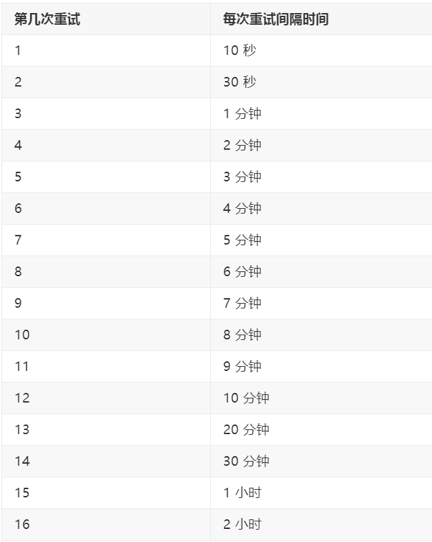
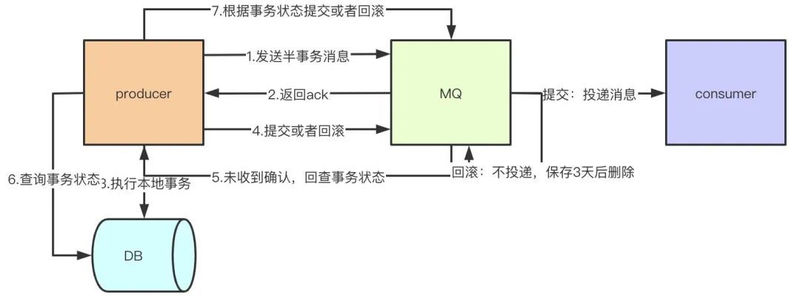
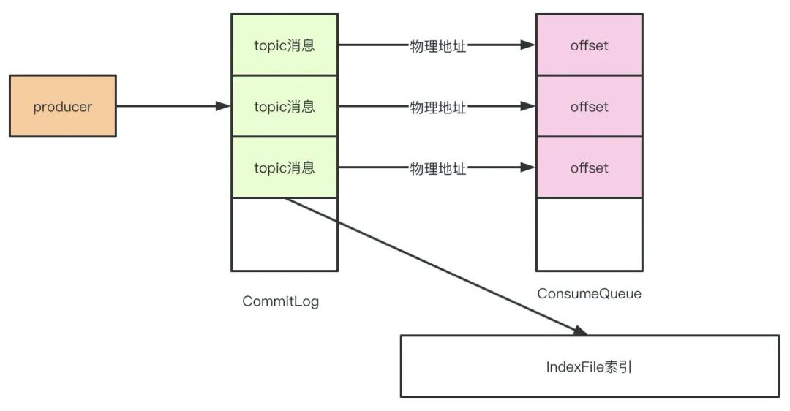
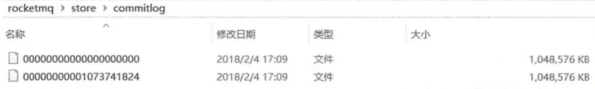
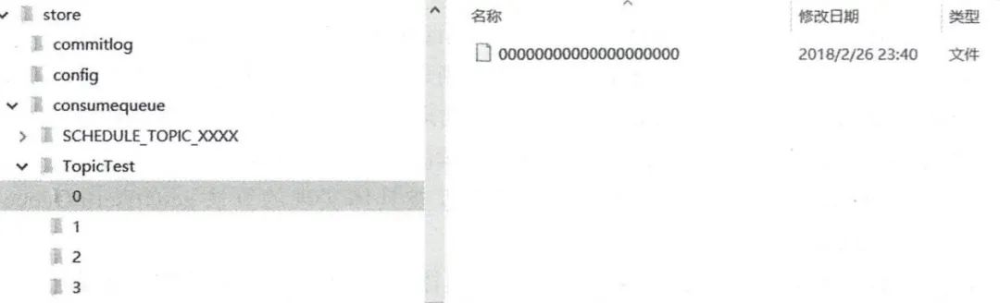

# RocketMQ

### 多个MQ如何选型？

| MQ       | 描述                                                         |
| -------- | ------------------------------------------------------------ |
| RabbitMQ | erlang开发，对消息堆积的支持并不好，当大量消息积压的时候，会导致 RabbitMQ 的性能急剧下降。每秒钟可以处理几万到十几万条消息。 |
| RocketMQ | java开发，面向互联网集群化功能丰富，对在线业务的响应时延做了很多的优化，大多数情况下可以做到毫秒级的响应，每秒钟大概能处理几十万条消息。 |
| Kafka    | Scala开发，面向日志功能丰富，性能最高。当你的业务场景中，每秒钟消息数量没有那么多的时候，Kafka 的时延反而会比较高。所以，Kafka 不太适合在线业务场景。 |
| ActiveMQ | java开发，简单，稳定，性能不如前面三个。小型系统用也ok，但是不推荐。推荐用互联网主流的。 |

### 为什么要使用MQ？

| 作用 | 描述                                                         |
| ---- | ------------------------------------------------------------ |
| 解耦 | 系统耦合度降低，没有强依赖关系                               |
| 异步 | 不需要同步执行的远程调用可以有效提高响应时间                 |
| 削峰 | 请求达到峰值后，后端service还可以保持固定消费速率消费，不会被压垮 |

> 削峰使用的是pull模式，pull模式下cosumer端来主导拉取消息的频率，因此cosumer端能保持固定消费速率消费，不会被压垮。
>
> push是mq进行主导，当mq上有消息时会主动推送给cosumer端。
>
> pull有三种模型，带有超时时间的同步pull、需要注册回调函数的异步pull、同步阻塞的pull。因为pull需要指定队列（MessageQueue），需要配合fetchSubscribeMessageQueues使用。并且pull模式下cosumer端需要自己维护offset（这个offset可以由result得到）。

### RocketMQ由哪些角色组成，每个角色作用和特点是什么？

| 角色       | 作用                                                         |
| ---------- | ------------------------------------------------------------ |
| Nameserver | 无状态，动态列表；这也是和zookeeper的重要区别之一。zookeeper是有状态的。 |
| Producer   | 消息生产者，负责发消息到Broker。                             |
| Broker     | 就是MQ本身，负责收发消息、持久化消息等。                     |
| Consumer   | 消息消费者，负责从Broker上拉取消息进行消费，消费完进行ack。  |

### RocketMQ中的Topic和JMS的queue有什么区别？

queue就是来源于数据结构的FIFO队列。而Topic是个抽象的概念，每个Topic底层对应N个queue，而数据也真实存在queue上的。

### RocketMQ Broker中的消息被消费后会立即删除吗？

不会，每条消息都会持久化到CommitLog中，每个Consumer连接到Broker后会维持消费进度信息，当有消息消费后只是当前Consumer的消费进度（CommitLog的offset）更新了。

#### 追问：那么消息会堆积吗？什么时候清理过期消息？

4.6版本默认48小时后会删除不再使用的CommitLog文件

- 检查这个文件最后访问时间
- 判断是否大于过期时间
- 指定时间删除，默认凌晨4点

### RocketMQ消费模式有几种？

消费模型由Consumer决定，消费维度为Topic。

- 集群消费

> 1.一条消息只会被同Group中的一个Consumer消费
>
> 2.多个Group同时消费一个Topic时，每个Group都会有一个Consumer消费到数据

- 广播消费

> 消息将对一 个Consumer Group 下的各个 Consumer 实例都消费一遍。即即使这些 Consumer 属于同一个Consumer Group ，消息也会被 Consumer Group 中的每个 Consumer 都消费一次。

### 消费消息是push还是pull？

RocketMQ没有真正意义的push，都是pull，虽然有push类，但实际底层实现采用的是**长轮询机制**，即拉取方式

> broker端属性 longPollingEnable 标记是否开启长轮询。默认开启

> 轮询和长轮询，这两种都是pull模式。
>
>  1 Polling<轮询>：不管服务端数据有无更新，客户端每隔定长时间请求拉取一次数据，可能有更新数据返回，也可能什么都没有。
>
>  2 Long Polling<长轮询>：客户端发起Long Polling，此时如果服务端没有相关数据，会hold住请求，直到服务端有相关数据，或者等待一定时间超时才会返回。返回后，客户端又会立即再次发起下一次Long Polling。（所谓的hold住请求指的服务端暂时不回复结果，保存相关请求，不关闭请求连接，等相关数据准备好，写会客户端。）

#### 追问：为什么要主动拉取消息而不使用事件监听方式？

事件驱动方式是建立好长连接，由事件（发送数据）的方式来实时推送。

如果broker主动推送消息的话有可能push速度快，消费速度慢的情况，那么就会造成消息在consumer端堆积过多，同时又不能被其他consumer消费的情况。而pull的方式可以根据当前自身情况来pull，不会造成过多的压力而造成瓶颈。所以采取了pull的方式。

### broker如何处理拉取请求的？

Consumer首次请求Broker

- Broker中是否有符合条件的消息

- 有 ->

- - 响应Consumer
  - 等待下次Consumer的请求

- 没有

- - DefaultMessageStore#ReputMessageService#run方法
  - PullRequestHoldService 来Hold连接，每个5s执行一次检查pullRequestTable有没有消息，有的话立即推送
  - 每隔1ms检查commitLog中是否有新消息，有的话写入到pullRequestTable
  - 当有新消息的时候返回请求
  - 挂起consumer的请求，即不断开连接，也不返回数据
  - 使用consumer的offset

### RocketMQ如何做负载均衡？

通过Topic在多Broker中分布式存储实现。

#### producer端

发送端指定message queue发送消息到相应的broker，来达到写入时的负载均衡

- 提升写入吞吐量，当多个producer同时向一个broker写入数据的时候，性能会下降
- 消息分布在多broker中，为负载消费做准备

**默认策略是随机选择**：

- producer维护一个index
- 每次取节点会自增
- index向所有broker个数取余
- 自带容错策略

**其他实现：**

- SelectMessageQueueByHash

- - hash的是传入的args

- SelectMessageQueueByRandom

- SelectMessageQueueByMachineRoom 没有实现

也可以自定义实现**MessageQueueSelector**接口中的select方法：

```java
MessageQueue select(final List<MessageQueue> mqs, final Message msg, final Object arg);
```

#### consumer端

采用的是平均分配算法来进行负载均衡。

**其他负载均衡算法**

平均分配策略(默认)(AllocateMessageQueueAveragely) 环形分配策略(AllocateMessageQueueAveragelyByCircle) 手动配置分配策略(AllocateMessageQueueByConfig) 机房分配策略(AllocateMessageQueueByMachineRoom) 一致性哈希分配策略(AllocateMessageQueueConsistentHash) 靠近机房策略(AllocateMachineRoomNearby)

#### 追问：当消费负载均衡consumer和queue不对等的时候会发生什么？

Consumer和queue会优先平均分配，如果Consumer少于queue的个数，则会存在部分Consumer消费多个queue的情况，如果Consumer等于queue的个数，那就是一个Consumer消费一个queue，如果Consumer个数大于queue的个数，那么会有部分Consumer空余出来，白白的浪费了。

### 消息重复消费

影响消息正常发送和消费的**重要原因是网络的不确定性。**

**引起重复消费的原因**：

- ACK

正常情况下在consumer真正消费完消息后应该发送ack，通知broker该消息已正常消费，从queue中剔除

当ack因为网络原因无法发送到broker，broker会认为词条消息没有被消费，此后会开启消息重投机制把消息再次投递到consumer

- 消费模式

在集群模式下，消息在broker中会保证相同group的consumer消费一次，但是针对不同group的consumer会推送多次

**解决方案**：

+ 对message设置key

- 数据库表

  建立一张日志表，使用消息主键作为表的主键，在处理消息前，先insert表，再做消息处理。这样可以避免消息重复消费

- Map

  单机时可以使用map *ConcurrentHashMap* -> putIfAbsent  guava cache

- Redis

  分布式锁。

### 如何让RocketMQ保证消息的顺序消费？

首先多个queue只能保证单个queue里的顺序，queue是典型的FIFO，天然顺序。多个queue同时消费是无法绝对保证消息的有序性的。所以总结如下：

同一topic，同一个QUEUE，发消息的时候一个线程去发送消息，消费的时候 一个线程去消费一个queue里的消息。

#### 追问：怎么保证消息发到同一个queue？

Rocket MQ给我们提供了MessageQueueSelector接口，可以自己重写里面的接口，实现自己的算法。

### RocketMQ如何保证消息不丢失

首先在如下三个部分都可能会出现丢失消息的情况：

- Producer端
- Broker端
- Consumer端

#### Producer端如何保证消息不丢失？

- 采取send()同步发消息，发送结果是同步感知的。

- 发送失败后可以重试，设置重试次数。默认3次。

  > producer.setRetryTimesWhenSendFailed(10);

- 集群部署，比如发送失败了的原因可能是当前Broker宕机了，重试的时候会发送到其他Broker上。

#### Broker端如何保证消息不丢失?

- 修改刷盘策略为同步刷盘。默认情况下是异步刷盘的。

  > flushDiskType = SYNC_FLUSH

- 集群部署，主从模式，高可用。

#### Consumer端如何保证消息不丢失?

- 完全消费正常后在进行手动ack确认。

### rocketMQ的消息堆积如何处理?

>下游消费系统如果宕机了，导致几百万条消息在消息中间件里积压，此时怎么处理?
>
>你们线上是否遇到过消息积压的生产故障?如果没遇到过，你考虑一下如何应对?

首先要找到是什么原因导致的消息堆积，是Producer太多了，Consumer太少了导致的还是说其他情况，总之先定位问题。

然后看下消息消费速度是否正常，正常的话，可以通过上线更多consumer临时解决消息堆积问题。

#### 追问：如果Consumer和Queue不对等，上线了多台也在短时间内无法消费完堆积的消息怎么办？

- 准备一个临时的topic
- queue的数量是堆积的几倍
- queue分布到多Broker中
- 上线一台Consumer做消息的搬运工，把原来Topic中的消息挪到新的Topic里，不做业务逻辑处理，只是挪过去
- 上线N台Consumer同时消费临时Topic中的数据
- 改bug
- 恢复原来的Consumer，继续消费之前的Topic

#### 追问：堆积时间过长消息超时了？

RocketMQ中的消息只会在commitLog被删除的时候才会消失，不会超时。也就是说未被消费的消息不会存在超时删除这情况。

#### 追问：堆积的消息会不会进死信队列？

不会，消息在消费失败后会进入重试队列，重试16次之后才会进入死信队列（%DLQ%+ConsumerGroup）。



### RocketMQ在分布式事务支持这块机制的底层原理?

>事务消息就是MQ提供的类似XA的分布式事务能力，通过事务消息可以达到分布式事务的最终一致性。
>
>半事务消息就是MQ收到了生产者的消息，但是没有收到二次确认，不能投递的消息。

1、生产者向MQ服务器发送half消息。
 2、half消息发送成功后，MQ服务器返回确认消息给生产者。
 3、生产者开始执行本地事务。
 4、根据本地事务执行的结果（`UNKNOW`、`commit`、`rollback`）向MQ Server发送提交或回滚消息。
 5、如果错过了（可能因为网络异常、生产者突然宕机等导致的异常情况）提交/回滚消息，则MQ服务器将向同一组中的每个生产者发送回查消息以获取事务状态。
 6、回查生产者本地事务状态。
 7、生产者根据本地事务状态发送提交/回滚消息。
 8、MQ服务器将丢弃回滚的消息，但已提交（进行过二次确认的half消息）的消息将投递给消费者进行消费。

`Half Message`：预处理消息，当broker收到此类消息后，会存储到`RMQ_SYS_TRANS_HALF_TOPIC`的消息消费队列中

`检查事务状态`：Broker会开启一个定时任务，消费`RMQ_SYS_TRANS_HALF_TOPIC`队列中的消息，每次执行任务会向消息发送者确认事务执行状态（提交、回滚、未知），如果是未知，Broker会定时去回调在重新检查。

超时：如果超过回查次数，默认回滚消息。
 也就是他并未真正进入Topic的queue，而是用了临时queue来放所谓的`half message`，等提交事务后才会真正的将half message转移到topic下的queue。



### 如果让你来动手实现一个分布式消息中间件，整体架构你会如何设计实现?

从以下几个点回答：

- 需要考虑能快速扩容、天然支持集群
- 持久化的姿势
- 高可用性
- 数据0丢失的考虑
- 服务端部署简单、client端使用简单

### RocketMQ源码？

待解决

### 高吞吐量下如何优化生产者和消费者的性能?

#### 开发

- 同一group下，多机部署，并行消费

- 单个Consumer提高消费线程个数

- 批量消费

- - 消息批量拉取
  - 业务逻辑批量处理

#### 运维

- 网卡调优
- jvm调优
- 多线程与cpu调优
- Page Cache

### 再说说RocketMQ 是如何保证数据的高容错性的?

- 在不开启容错的情况下，轮询队列进行发送，如果失败了，重试的时候过滤失败的Broker
- 如果开启了容错策略，会通过RocketMQ的预测机制来预测一个Broker是否可用
- 如果上次失败的Broker可用那么还是会选择该Broker的队列
- 如果上述情况失败，则随机选择一个进行发送
- 在发送消息的时候会记录一下调用的时间与是否报错，根据该时间去预测broker的可用时间

### 任何一台Broker突然宕机了怎么办？

Broker主从架构以及多副本策略。Master收到消息后会同步给Slave，这样一条消息就不止一份了，Master宕机了还有slave中的消息可用，保证了MQ的可靠性和高可用性。而且Rocket MQ4.5.0开始就支持了Dlegder模式，基于raft的，做到了真正意义的HA。

### Broker把自己的信息注册到哪个NameServer上？

全部。

### 为什么使用mq？

mq的作用很简单，削峰填谷。以电商交易下单的场景来说，正向交易的过程可能涉及到创建订单、扣减库存、扣减活动预算、扣减积分等等。每个接口的耗时如果是100ms，那么理论上整个下单的链路就需要耗费400ms，这个时间显然是太长了。

如果这些操作全部同步处理的话，首先调用链路太长影响接口性能，其次分布式事务的问题很难处理，这时候像扣减预算和积分这种对实时一致性要求没有那么高的请求，完全就可以通过mq异步的方式去处理了。同时，考虑到异步带来的不一致的问题，我们可以通过job去重试保证接口调用成功，而且一般公司都会有核对的平台，比如下单成功但是未扣减积分的这种问题可以通过核对作为兜底的处理方案。

> 在自己做的项目中，用到了redis缓存+异步更新数据库。因为更新数据库的耗时远远要比走redis缓存的耗时大，因此将最慢的部分异步化，这样在redis中操作成功后可以直接返回给用户，而异步使得redis与数据库能保证最终一致性。从用户的角度，只等待了redis查询的时间。

### RocketMQ如何保证线程安全？

RocketMQ低层是Netty，可以从Netty的角度回答。

### RocketMQ速度为什么这么快？

是因为使用了顺序存储、Page Cache和异步刷盘。

1. 我们在写入commitlog的时候是顺序写入的，这样比随机写入的性能就会提高很多
2. 写入commitlog的时候并不是直接写入磁盘，而是先写入操作系统的PageCache
3. 最后由操作系统异步将缓存中的数据刷到磁盘

### Master和Slave之间是怎么同步数据的呢？

消息在master和slave之间的同步是根据raft协议来进行的：

1. 在broker收到消息后，会被标记为uncommitted状态
2. 然后会把消息发送给所有的slave
3. slave在收到消息之后返回ack响应给master
4. master在收到超过半数的ack之后，把消息标记为committed
5. 发送committed消息给所有slave，slave也修改状态为committed

### RocketMQ实现原理

RocketMQ由NameServer注册中心集群、Producer生产者集群、Consumer消费者集群和若干Broker（RocketMQ进程）组成，它的架构原理是这样的：

+ Broker在启动的时候去向所有的NameServer注册，并保持长连接，每30s发送一次心跳

+ Producer在发送消息的时候从NameServer获取Broker服务器地址，根据负载均衡算法选择一台服务器来发送消息

+ Consumer消费消息的时候同样从NameServer获取Broker地址，然后主动拉取消息来消费

### 为什么RocketMQ不使用Zookeeper作为注册中心呢？

我认为有以下几个点是不使用zookeeper的原因：

+ 根据CAP理论，同时最多只能满足两个点，而zookeeper满足的是CP，也就是说zookeeper并不能保证服务的可用性，zookeeper在进行选举的时候，整个选举的时间太长，期间整个集群都处于不可用的状态，而这对于一个注册中心来说肯定是不能接受的，作为服务发现来说就应该是为可用性而设计。

+ 基于性能的考虑，NameServer本身的实现非常轻量，而且可以通过增加机器的方式水平扩展，增加集群的抗压能力，而zookeeper的写是不可扩展的，而zookeeper要解决这个问题只能通过划分领域，划分多个zookeeper集群来解决，首先操作起来太复杂，其次这样还是又违反了CAP中的A的设计，导致服务之间是不连通的。

+ 持久化的机制来带的问题，ZooKeeper 的 ZAB 协议对每一个写请求，会在每个 ZooKeeper 节点上保持写一个事务日志，同时再加上定期的将内存数据镜像（Snapshot）到磁盘来保证数据的一致性和持久性，而对于一个简单的服务发现的场景来说，这其实没有太大的必要，这个实现方案太重了。而且本身存储的数据应该是高度定制化的。

+ 消息发送应该弱依赖注册中心，而RocketMQ的设计理念也正是基于此，生产者在第一次发送消息的时候从NameServer获取到Broker地址后缓存到本地，如果NameServer整个集群不可用，短时间内对于生产者和消费者并不会产生太大影响。

### Broker是怎么保存数据的呢？

RocketMQ主要的存储文件包括commitlog文件、consumequeue文件、indexfile文件。

Broker在收到消息之后，会把消息保存到commitlog的文件当中，而同时在分布式的存储当中，每个broker都会保存一部分topic的数据，同时，每个topic对应的messagequeue下都会生成consumequeue文件用于保存commitlog的物理位置偏移量offset，indexfile中会保存key和offset的对应关系。



CommitLog文件保存于${Rocket_Home}/store/commitlog目录中，从图中我们可以明显看出来文件名的偏移量，每个文件默认1G，写满后自动生成一个新的文件。



由于同一个topic的消息并不是连续的存储在commitlog中，消费者如果直接从commitlog获取消息效率非常低，所以通过consumequeue保存commitlog中消息的偏移量的物理地址，这样消费者在消费的时候先从consumequeue中根据偏移量定位到具体的commitlog物理文件，然后根据一定的规则（offset和文件大小取模）在commitlog中快速定位。



>**Key** 一般用于消息在业务层面的唯一标识。对发送的消息设置好 Key，以后可以根据这个 Key 来查找消息。比如消息异常，消息丢失，进行查找会很 方便。RocketMQ 会创建专门的索引文件，用来存储 Key 与消息的映射，由于是 Hash 索引，应尽量使 Key 唯一，避免潜在的哈希冲突。
>
>**Tag** 和 **Key** 的主要差别是使用场景不同，**Tag** 用在 **Consumer** 代码中，用于服务端消息过滤，**Key** 主要用于通过命令进行查找消息
> **RocketMQ** 并不能保证 **message id** 唯一，在这种情况下，生产者在 **push** 消息的时候可以给每条消息设定唯一的 **key**, 消费者可以通过 **message key** 保证对消息幂等处理。

### RocketMQ有几种部署方式？

#### 单Master

单机模式, 即只有一个Broker, 如果Broker宕机了, 会导致RocketMQ服务不可用, 不推荐使用。

#### 多Master

组成一个集群, 集群每个节点都是Master节点, 配置简单, 性能也是最高, 某节点宕机重启不会影响RocketMQ服务

缺点：如果某个节点宕机了, 会导致该节点存在未被消费的消息在节点恢复之前不能被消费。

#### 多Master多Slave模式，异步复制

每个Master配置一个Slave, 多对Master-Slave, Master与Slave消息采用异步复制方式, 主从消息一致只会有毫秒级的延迟。

优点是弥补了多Master模式（无slave）下节点宕机后在恢复前不可订阅的问题。在Master宕机后, 消费者还可以从Slave节点进行消费。采用异步模式复制，提升了一定的吞吐量。总结一句就是，采用多Master多Slave模式，异步复制模式进行部署，系统将会有较低的延迟和较高的吞吐量。

缺点就是如果Master宕机, 磁盘损坏的情况下, 如果没有及时将消息复制到Slave, 会导致有少量消息丢失。

#### 多Master多Slave模式，同步双写

与多Master多Slave模式，异步复制方式基本一致，唯一不同的是消息复制采用同步方式，只有master和slave都写成功以后，才会向客户端返回成功。

优点：数据与服务都无单点，Master宕机情况下，消息无延迟，服务可用性与数据可用性都非常高

缺点：就是会降低消息写入的效率，并影响系统的吞吐量

实际部署中，一般会根据业务场景的所需要的性能和消息可靠性等方面来选择后两种。

### 消费消息时是从Master获取还是Slave获取？

可能从Master Broker获取消息，也有可能从Slave Broker获取消息。

消费者的系统在获取消息的时候会先发送请求到Master Broker上去，请求获取一批消息，此时Master Broker是会返回一批消息给消费者系统的
Master Broker在返回消息给消费者系统的时候，会根据当时Master Broker的 负载情况和Slave Broker的 同步情况，向消费者系统建议下一次拉取消息的时候是从Master Broker拉取还是从Slave Broker拉取。

### Master Broker 突然挂了，这样会怎么样？

RocketMQ 4.5之后支持了一种叫做 Dledger 机制，基于 Raft 协议实现的一个机制。
我们可以让一个 Master Broker 对应多个 Slave Broker， 一旦 Master Broker 宕机了，在多个 Slave 中通过 Dledger 技术 将一个 Slave Broker 选为新的 Master Broker 对外提供服务。
在生产环境中可以是用 Dledger 机制实现自动故障切换，只要10秒或者几十秒的时间就可以完成。

### 消息的定时实现

1、实际 RocketMQ 没有实现任意精度的定时消息，它只支持某些特定的时间精度的定时消息

2、实现定时消息的原理是：创建特定时间精度的 MessageQueue，例如生产者需要定时1s之后被消费者消费，你只需要将此消息发送到特定的 Topic，例如：MessageQueue-1 表示这个 MessageQueue 里面的消息都会延迟一秒被消费，然后 Broker 会在 1s 后发送到消费者消费此消息，使用 newSingleThreadScheduledExecutor 实现