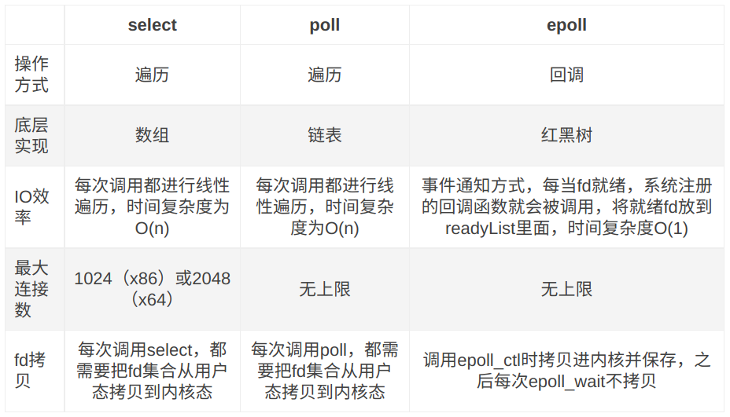

# Select, Poll, Epoll

## Select

`int select(int maxfdp1,fd_set *readset,fd_set *writeset,fd_set *exceptset,const struct timeval *timeout);`

**【参数说明】**
 **int maxfdp1** 指定待测试的文件描述字个数，它的值是待测试的最大描述字加1。
 **fd_set \*readset , fd_set \*writeset , fd_set \*exceptset**
 `fd_set`可以理解为一个集合，这个集合中存放的是文件描述符(file descriptor)，即文件句柄。中间的三个参数指定我们要让内核测试读、写和异常条件的文件描述符集合。如果对某一个的条件不感兴趣，就可以把它设为空指针。
 **const struct timeval \*timeout** `timeout`告知内核等待所指定文件描述符集合中的任何一个就绪可花多少时间。其timeval结构用于指定这段时间的秒数和微秒数。

**【返回值】**
**int** 若有就绪描述符返回其数目，若超时则为0，若出错则为-1。

### Select运行机制

select()的机制中提供一种`fd_set`的数据结构，实际上是一个long类型的数组，每一个数组元素都能与一打开的文件句柄（不管是Socket句柄,还是其他文件或命名管道或设备句柄）建立联系，建立联系的工作由程序员完成，当调用select()时，由内核根据IO状态修改fd_set的内容，由此来通知执行了select()的进程哪一Socket或文件可读。

从流程上来看，使用select函数进行IO请求和同步阻塞模型没有太大的区别，甚至还多了添加监视socket，以及调用select函数的额外操作，效率更差。但是，使用select以后最大的优势是用户可以在一个线程内同时处理多个socket的IO请求。用户可以注册多个socket，然后不断地调用select读取被激活的socket，即可达到在同一个线程内同时处理多个IO请求的目的。而在同步阻塞模型中，必须通过多线程的方式才能达到这个目的。

### Select机制的问题

1. 每次调用select，都需要把`fd_set`集合从用户态拷贝到内核态，如果`fd_set`集合很大时，那这个开销也很大
2. 同时每次调用select都需要在内核遍历传递进来的所有`fd_set`，如果`fd_set`集合很大时，那这个开销也很大
3. 为了减少数据拷贝带来的性能损坏，内核对被监控的`fd_set`集合大小做了限制，并且这个是通过宏控制的，大小不可改变(限制为1024)

## Poll

poll的机制与select类似，与select在本质上没有多大差别，管理多个描述符也是进行轮询，根据描述符的状态进行处理，但是poll没有最大文件描述符数量的限制。也就是说，poll只解决了上面的问题3，并没有解决问题1，2的性能开销问题。

下面是pll的函数原型：

```cpp
int poll(struct pollfd *fds, nfds_t nfds, int timeout);

typedef struct pollfd {
        int fd;                         // 需要被检测或选择的文件描述符
        short events;                   // 对文件描述符fd上感兴趣的事件
        short revents;                  // 文件描述符fd上当前实际发生的事件
} pollfd_t;
```

poll改变了文件描述符集合的描述方式，使用了`pollfd`结构而不是select的`fd_set`结构，使得poll支持的文件描述符集合限制远大于select的1024。

**【参数说明】**

**struct pollfd \*fds** `fds`是一个`struct pollfd`类型的链表，用于存放需要检测其状态的socket描述符，并且调用poll函数之后`fds`数组不会被清空；一个`pollfd`结构体表示一个被监视的文件描述符，通过传递`fds`指示 poll() 监视多个文件描述符。其中，结构体的`events`域是监视该文件描述符的事件掩码，由用户来设置这个域，结构体的`revents`域是文件描述符的操作结果事件掩码，内核在调用返回时设置这个域

**nfds_t nfds** 记录数组`fds`中描述符的总数量。

**【返回值】**
**int** 函数返回fds集合中就绪的读、写，或出错的描述符数量，返回0表示超时，返回-1表示出错；

## Epoll

在select/poll时代，服务器进程每次都把这100万个连接告诉操作系统(从用户态复制句柄数据结构到内核态)，让操作系统内核去查询这些套接字上是否有事件发生，轮询完后，再将句柄数据复制到用户态，让服务器应用程序轮询处理已发生的网络事件，这一过程资源消耗较大，因此，select/poll一般只能处理几千的并发连接。

epoll的设计和实现与select完全不同。epoll通过在Linux内核中申请一个简易的文件系统(文件系统一般用什么数据结构实现？B+树)。把原先的select/poll调用分成了3个部分：

1）调用epoll_create()建立一个epoll对象(在epoll文件系统中为这个句柄对象分配资源)

2）调用epoll_ctl向epoll对象中添加这100万个连接的套接字

3）调用epoll_wait收集发生的事件的连接

### 原理

在内核空间使用红黑树维护需要被监视的事件，因为红黑树，增添、删除、判重都可以很高效地进行。同时所有添加到epoll中的事件都会与设备（网卡）建立回调关系（注意，回调函数用于将文件句柄添加到就绪列表上的！！！因此不要看到“回调”就认为epoll是是异步的！），也就是说，当相应的事件发生时会调用这个回调方法。

#### 具体思路

当某一进程调用epoll_create方法时，Linux内核会创建一个eventpoll结构体，这个结构体中有两个成员与epoll的使用方式密切相关。eventpoll结构体如下所示：

```c++
struct eventpoll{
    ....
    /*红黑树的根节点，这颗树中存储着所有添加到epoll中的需要监控的事件*/
    struct rb_root  rbr;
    /*双链表中则存放着将要通过epoll_wait返回给用户的满足条件的事件*/
    struct list_head rdlist;
    ....
};
```

每一个epoll对象都有一个独立的eventpoll结构体，用于存放通过epoll_ctl方法向epoll对象中添加进来的事件。这些事件都会挂载在红黑树中，如此，重复添加的事件就可以通过红黑树而高效的识别出来(红黑树的插入时间效率是lgn，其中n为树的高度)。

而所有添加到epoll中的事件都会与设备(网卡)驱动程序建立回调关系，也就是说，当相应的事件发生时会调用这个回调方法。这个回调方法在内核中叫ep_poll_callback,它会将发生的事件添加到rdlist双链表中。

在epoll中，对于每一个事件，都会建立一个epitem结构体，如下所示：

```c++
struct epitem{
    struct rb_node  rbn;//红黑树节点
    struct list_head    rdllink;//双向链表节点
    struct epoll_filefd  ffd;  //事件句柄信息
    struct eventpoll *ep;    //指向其所属的eventpoll对象
    struct epoll_event event; //期待发生的事件类型
}
```

当调用epoll_wait检查是否有事件发生时，只需要检查eventpoll对象中的rdlist双链表中是否有epitem元素即可。如果rdlist不为空，则把发生的事件复制到用户态，同时将事件数量返回给用户。


> epoll模型中红黑树是维护在内核空间的，因此没有如select、poll那样存在大量的用户空间到内核空间的拷贝。

### 水平触发（LT）和边缘触发（ET）

epoll除了提供select/poll那种IO事件的水平触发（Level Triggered）外，还提供了边缘触发（Edge Triggered），这就使得用户空间程序有可能缓存IO状态，减少epoll_wait/epoll_pwait的调用，提高应用程序效率。

**水平触发（LT）：**默认工作模式，即当epoll_wait检测到某描述符事件就绪并通知应用程序时，应用程序可以不立即处理该事件；下次调用epoll_wait时，会再次通知此事件

**边缘触发（ET）：** 当epoll_wait检测到某描述符事件就绪并通知应用程序时，应用程序必须立即处理该事件。如果不处理，下次调用epoll_wait时，不会再次通知此事件。（直到你做了某些操作导致该描述符变成未就绪状态了，也就是说边缘触发只在状态由未就绪变为就绪时只通知一次）。

### 优点

1、没有最大并发连接的限制，能打开的FD的上限远大于1024（1G的内存上能监听约10万个端口）
2、效率提升，不是轮询的方式，不会随着FD数目的增加效率下降。只有活跃可用的FD才会调用callback函数
即Epoll最大的优点就在于它只管你“活跃”的连接，而跟连接总数无关，因此在实际的网络环境中，Epoll的效率就会远远高于select和poll

3、红黑树是维护在内核空间的，只有调用epoll_ctl时才会从用户空间拷贝到内核，大大减少了拷贝次数

## 总结



## 常见面试题

### epoll为什么要有ET触发模式？

如果采用EPOLLLT模式的话，系统中一旦有大量你不需要读写的就绪文件描述符，它们每次调用epoll_wait都会返回，这样会大大降低处理程序检索自己关心的就绪文件描述符的效率.。而采用EPOLLET这种边沿触发模式的话，当被监控的文件描述符上有可读写事件发生时，epoll_wait()会通知处理程序去读写。如果这次没有把数据全部读写完(如读写缓冲区太小)，那么下次调用epoll_wait()时，它不会通知你，也就是它只会通知你一次，直到该文件描述符上出现第二次可读写事件才会通知你！！！**这种模式比水平触发效率高，系统不会充斥大量你不关心的就绪文件描述符**。