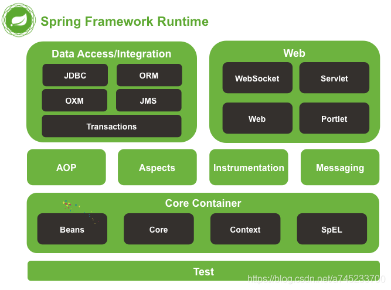
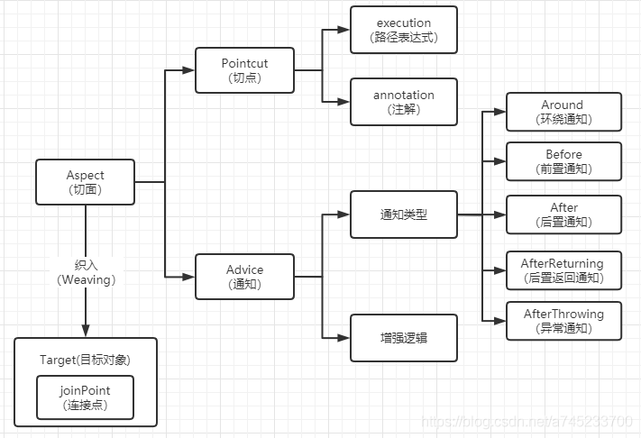
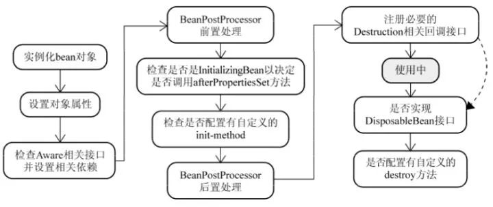
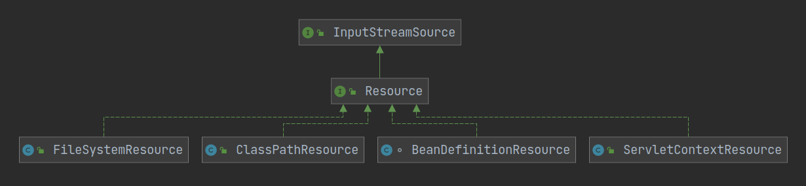
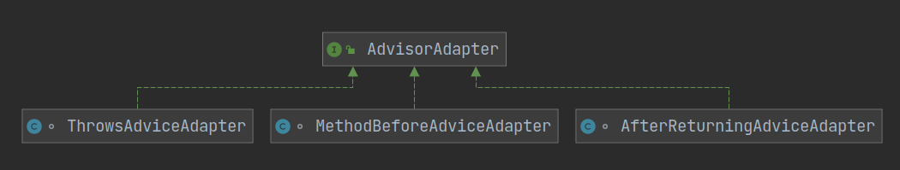
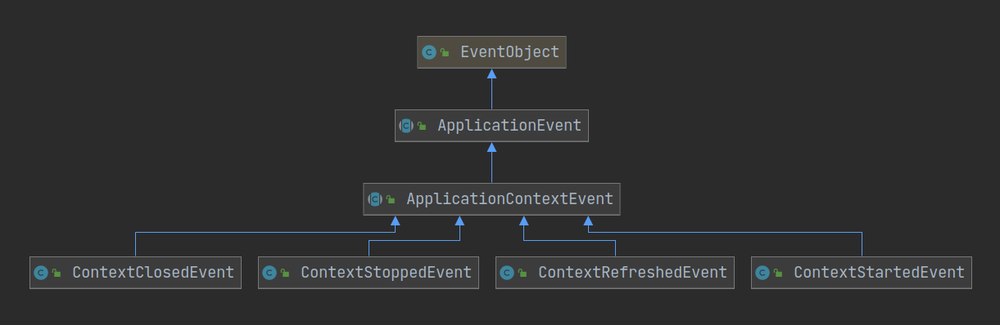

# Spring

## Spring是什么？

Spring是一个轻量级的IoC和AOP容器框架，目的是用于简化应用程序的开发，它使得开发者只需要关心业务需求。主要包括以下七个模块：

+ Spring Context：提供Bean的访问方式，以及企业级功能（JNDI、定时任务等）
+ Spring Core：核心类库，所有的功能都依赖于该类库，提供IOC和D服务
+ Spring AOP：提供AOP服务
+ Spring Web：提供了面向Web的综合特性，提供对常见框架的支持，Spring能够管理这些框架，将Spring的资源注入到框架中，也能在这些框架的前后插入拦截器
+ Spring MVC：提供MVC实现，即Model-View-Controller
+ Spring DAO：对JDBC的抽象封装，简化了数据访问异常的处理，并能统一管理JDBC事务
+ Spring ORM：对现有的ORM框架的支持

下面是Spring 4.x版本，5.x版本中Web模块的Portlet组件以及被弃用：



## Spring的优点？

+ Spring属于低侵入式设计，代码的污染极低
+ Spring的DI/IoC机制将对象之间的依赖关系交给框架处理，减轻组件的耦合性
+ Spring提供了AOP技术，支持将一些通用任务，如安全、事务、日志、权限等进行集中式管理，从而提供更好的复用
+ spring对于主流的应用框架提供了集成支持

## IoC的理解？

+ IOC就是控制反转，指创建对象的控制权转移给Spring框架进行管理，并由Spring根据配置文件去创建实例和管理各个实例之间的依赖关系，对象与对象之间松散耦合，也利于功能的复用。DI依赖注入，和控制反转是同一个概念的不同角度的描述，即 应用程序在运行时依赖IoC容器来动态注入对象需要的外部依赖。
+ 最直观的表达就是，以前创建对象的主动权和时机都是由自己把控的，IOC让对象的创建不用去new了，可以由spring自动生产，使用java的反射机制，根据配置文件在运行时动态的去创建对象以及管理对象，并调用对象的方法的。
+ Spring的IOC有三种注入方式 ：构造器注入、setter方法注入、根据注解注入。

## AOP的理解？

OOP面向对象，不适用于定义横向的关系，会导致大量代码的重复，而不利于各个模块的重用。

AOP，一般称为面向切面，作为面向对象的一种补充，用于将那些与业务无关，但却对多个对象产生影响的公共行为和逻辑，抽取并封装为一个可重用的模块，这个模块被命名为“切面”（Aspect），减少系统中的重复代码，降低了模块间的耦合度，提高系统的可维护性。可用于权限认证、日志、事务处理。

AOP实现的关键在于 代理模式，AOP代理主要分为静态代理和动态代理。静态代理的代表为AspectJ；动态代理则以Spring AOP为代表。

+ AspectJ是静态代理，也称为编译时增强，AOP框架会在编译阶段生成AOP代理类，并将AspectJ(切面)织入到Java字节码中，运行的时候就是增强之后的AOP对象。

+ Spring AOP使用的动态代理，所谓的动态代理就是说AOP框架不会去修改字节码，而是每次运行时在内存中临时为方法生成一个AOP对象，这个AOP对象包含了目标对象的全部方法，并且在特定的切点做了增强处理，并回调原对象的方法。
  + Spring AOP中的动态代理主要有两种方式，JDK动态代理和CGLIB动态代理：
    + JDK动态代理只提供接口的代理，不支持类的代理，要求被代理类实现接口。JDK动态代理的核心是InvocationHandler接口和Proxy类，在获取代理对象时，使用Proxy类来动态创建目标类的代理类（即最终真正的代理类，这个类继承自Proxy并实现了我们定义的接口），当代理对象调用真实对象的方法时， InvocationHandler 通过invoke()方法反射来调用目标类中的代码，动态地将横切逻辑和业务编织在一起；

		>InvocationHandler 的 invoke(Object  proxy,Method  method,Object[] args)：proxy是最终生成的代理对象;  method 是被代理目标实例的某个具体方法;  args 是被代理目标实例某个方法的具体入参, 在方法反射调用时使用。
		
		+ 如果被代理类没有实现接口，那么Spring AOP会选择使用CGLIB来动态代理目标类。CGLIB（Code Generation Library），是一个代码生成的类库，可以在运行时动态的生成指定类的一个子类对象，并覆盖其中特定方法并添加增强代码，从而实现AOP。CGLIB是通过继承的方式做的动态代理，因此如果某个类被标记为final，那么它是无法使用CGLIB做动态代理的。
	
+ 静态代理与动态代理区别在于生成AOP代理对象的时机不同，相对来说AspectJ的静态代理方式具有更好的性能，但是AspectJ需要特定的编译器进行处理，而Spring AOP则无需特定的编译器处理。

> IoC让相互协作的组件保持松散的耦合，而AOP编程允许你把遍布于应用各层的功能分离出来形成可重用的功能组件。

## Spring AOP里面的几个名词

+ 连接点（Join Point）：指程序运行过程中所执行的方法。在Spring AOP中，一个连接点总代表一个方法的执行。 

+ 切面（Aspect）：被抽取出来的公共模块，可以用来会横切多个对象。Aspect切面可以看成 Pointcut切点 和 Advice通知 的结合，一个切面可以由多个切点和通知组成。

  > 在Spring AOP中，切面可以在类上使用@AspectJ注解来实现

+ 切点（Pointcut）：切点用于定义 要对哪些Join point进行拦截。

  > 切点分为execution方式和annotation方式。execution方式可以用路径表达式指定对哪些方法拦截，比如指定拦截add*、search*。annotation方式可以指定被哪些注解修饰的代码进行拦截。

+ 通知（Advice）：指要在连接点（Join Point）上执行的动作，即增强的逻辑，比如权限校验和、日志记录等。通知有各种类型，包括Around、Before、After、After returning、After throwing。

+ 目标对象（Target）：包含连接点的对象，也称作被通知（Advice）的对象。 由于Spring AOP是通过动态代理实现的，所以这个对象永远是一个代理对象。

+ 织入（Weaving）：通过动态代理，在目标对象（Target）的方法（即连接点Join point）中执行增强逻辑（Advice）的过程。

+ 引入（Introduction）：添加额外的方法或者字段到被通知的类。Spring允许引入新的接口（以及对应的实现）到任何被代理的对象。例如，你可以使用一个引入来使bean实现 IsModified 接口，以便简化缓存机制。

关系图可以参考如下：



## Spring通知（Advice）有哪些类型？

+ 前置通知（Before Advice）：在连接点（Join point）之前执行的通知。
+ 后置通知（After Advice）：当连接点退出的时候执行的通知（不论是正常返回还是异常退出）。 
+ 环绕通知（Around Advice）：包围一个连接点的通知，这是最强大的一种通知类型。 环绕通知可以在方法调用前后完成自定义的行为。它也可以选择是否继续执行连接点或直接返回它们自己的返回值或抛出异常来结束执行。
+ 返回后通知（AfterReturning Advice）：在连接点正常完成后执行的通知（如果连接点抛出异常，则不执行）
+ 抛出异常后通知（AfterThrowing advice）：在方法抛出异常退出时执行的通知


## Spring容器的启动流程

1. 初始化Spring容器，注册内置的BeanPostProcessor的BeanDefinition到容器中：
   + 实例化BeanFactory【DefaultListableBeanFactory】工厂，用于生成Bean对象
   + 实例化BeanDefinitionReader注解配置读取器，用于对特定注解（如@Service、@Repository）的类进行读取转化成  BeanDefinition 对象，（BeanDefinition 是 Spring 中极其重要的一个概念，它存储了 bean 对象的所有特征信息，如是否单例，是否懒加载，factoryBeanName 等）
   + 实例化ClassPathBeanDefinitionScanner路径扫描器，用于对指定的包目录进行扫描查找 bean 对象
2. 将配置类的BeanDefinition注册到容器中
3. 调用refresh()方法刷新容器：
   + prepareRefresh()刷新前的预处理：
   + obtainFreshBeanFactory()：获取在容器初始化时创建的BeanFactory：
   + prepareBeanFactory(beanFactory)：BeanFactory的预处理工作，向容器中添加一些组件：
   + postProcessBeanFactory(beanFactory)：子类重写该方法，可以实现在BeanFactory创建并预处理完成以后做进一步的设置
   + invokeBeanFactoryPostProcessors(beanFactory)：在BeanFactory标准初始化之后执行BeanFactoryPostProcessor的方法，即BeanFactory的后置处理器
   + registerBeanPostProcessors(beanFactory)：向容器中注册Bean的后置处理器BeanPostProcessor，它的主要作用是干预Spring初始化bean的流程，从而完成代理、自动注入、循环依赖等功能
   + initMessageSource()：初始化MessageSource组件，主要用于做国际化功能，消息绑定与消息解析：
   + initApplicationEventMulticaster()：初始化事件派发器，在注册监听器时会用到：
   + onRefresh()：留给子容器、子类重写这个方法，在容器刷新的时候可以自定义逻辑
   + registerListeners()：注册监听器：将容器中所有的ApplicationListener注册到事件派发器中，并派发之前步骤产生的事件
   + finishBeanFactoryInitialization(beanFactory)：初始化所有剩下的单实例bean，核心方法是preInstantiateSingletons()，会调用getBean()方法创建对象
   + finishRefresh()：发布BeanFactory容器刷新完成事件

## BeanFactory和ApplicationContext的区别？

BeanFactory和ApplicationContext是Spring的两大核心接口，都可以当做Spring的容器。

+ BeanFactory是Spring里面最底层的接口，是IoC的核心，定义了IoC的基本功能，包含了各种Bean的定义、加载、实例化，依赖注入和生命周期管理。ApplicationContext接口作为BeanFactory的子类，除了提供BeanFactory所具有的功能外，还提供了更完整的框架功能：
  + 继承MessageSource，因此支持国际化。
  + 资源文件访问，如URL和文件（ResourceLoader）。
  + 载入多个（有继承关系）上下文（即同时加载多个配置文件） ，使得每一个上下文都专注于一个特定的层次，比如应用的web层。
  + 载入多个（有继承关系）上下文（即同时加载多个配置文件） ，使得每一个上下文都专注于一个特定的层次，比如应用的web层。
  + 提供在监听器中注册bean的事件。
+ 对Bean的加载方式不同：
  + BeanFactroy采用的是延迟加载形式来注入Bean的，只有在使用到某个Bean时(调用getBean())，才对该Bean进行加载实例化。这样，我们就不能提前发现一些存在的Spring的配置问题。如果Bean的某一个属性没有注入，BeanFacotry加载后，直至第一次使用调用getBean方法才会抛出异常。
  + ApplicationContext，它是在容器启动时，一次性创建了所有的Bean。这样，在容器启动时，我们就可以发现Spring中存在的配置错误，这样有利于检查所依赖属性是否注入。 
  + ApplicationContext启动后预载入所有的单实例Bean，所以在运行的时候速度比较快，因为它们已经创建好了。相对于BeanFactory，ApplicationContext 唯一的不足是占用内存空间，当应用程序配置Bean较多时，程序启动较慢。
+ BeanFactory和ApplicationContext都支持BeanPostProcessor、BeanFactoryPostProcessor的使用，但两者之间的区别是：BeanFactory需要手动注册，而ApplicationContext则是自动注册。
+ BeanFactory通常以编程的方式被创建，ApplicationContext还能以声明的方式创建，如使用ContextLoader。

## Spring Bean的生命周期？

简单来说，Spring Bean的生命周期只有四个阶段：实例化 Instantiation --> 属性赋值 Populate --> 初始化 Initialization --> 销毁 Destruction。

具体来说，Spring Bean的生命周期包含下图的流程：



1. 实例化Bean：

   + 对于BeanFactory容器，当客户向容器请求一个尚未初始化的bean时，或初始化bean的时候需要注入另一个尚未初始化的依赖时，容器就会调用createBean进行实例化。
   + 对于ApplicationContext容器，当容器启动结束后，通过获取BeanDefinition对象中的信息，实例化所有的bean。

2. 设置对象属性（依赖注入）：

   实例化后的对象被封装在BeanWrapper对象中，紧接着，Spring根据BeanDefinition中的信息 以及 通过BeanWrapper提供的设置属性的接口完成属性设置与依赖注入。

3. 处理Aware接口：Spring会检测该对象是否实现了xxxAware接口，通过Aware类型的接口，可以让我们拿到Spring容器的一些资源：

   + 如果这个Bean实现了BeanNameAware接口，会调用它实现的setBeanName(String beanId)方法，传入Bean的名字；
   + 如果这个Bean实现了BeanClassLoaderAware接口，调用setBeanClassLoader()方法，传入ClassLoader对象的实例。
   + 如果这个Bean实现了BeanFactoryAware接口，会调用它实现的setBeanFactory()方法，传递的是Spring工厂自身。
   + 如果这个Bean实现了ApplicationContextAware接口，会调用setApplicationContext(ApplicationContext)方法，传入Spring上下文；

4. BeanPostProcessor前置处理：如果想对Bean进行一些自定义的前置处理，那么可以让Bean实现了BeanPostProcessor接口，那将会调用postProcessBeforeInitialization(Object obj, String s)方法。

5. InitializingBean：如果Bean实现了InitializingBean接口，执行afterPropertiesSet()方法。

6. init-method：如果Bean在Spring配置文件中配置了 init-method 属性，则会自动调用其配置的初始化方法。

7. BeanPostProcessor后置处理：如果这个Bean实现了BeanPostProcessor接口，将会调用postProcessAfterInitialization(Object obj, String s)方法；由于这个方法是在Bean初始化结束时调用的，所以可以被应用于内存或缓存技术；

   > 以上几个步骤完成后，Bean就已经被正确创建了，之后就可以使用这个Bean了。

8. DisposableBean：当Bean不再需要时，会经过清理阶段，如果Bean实现了DisposableBean这个接口，会调用其实现的destroy()方法；

9. destroy-method：最后，如果这个Bean的Spring配置中配置了destroy-method属性，会自动调用其配置的销毁方法。

## Spring中bean的作用域

（1）singleton：默认作用域，单例bean，每个容器中只有一个bean的实例。

（2）prototype：为每一个bean请求创建一个实例。

（3）request：为每一个request请求创建一个实例，在请求完成以后，bean会失效并被垃圾回收器回收。

（4）session：与request范围类似，同一个session会话共享一个实例，不同会话使用不同的实例。

（5）global-session：全局作用域，所有会话共享一个实例。如果想要声明让所有会话共享的存储变量的话，那么这全局变量需要存储在global-session中。

## Spring框架中的Bean是线程安全的吗？如果线程不安全，那么如何处理？

Spring容器本身并没有提供Bean的线程安全策略，因此可以说Spring容器中的Bean本身不具备线程安全的特性，但是具体情况还是要结合Bean的作用域来讨论。

（1）对于prototype作用域的Bean，每次都创建一个新对象，也就是线程之间不存在Bean共享，因此不会有线程安全问题。

（2）对于singleton作用域的Bean，所有的线程都共享一个单例实例的Bean，因此是存在线程安全问题的。但是如果单例Bean是一个无状态Bean，也就是线程中的操作不会对Bean的成员执行查询以外的操作，那么这个单例Bean是线程安全的。比如Controller类、Service类和Dao等，这些Bean大多是无状态的，只关注于方法本身。

>有状态Bean(Stateful Bean) ：就是有实例变量的对象，可以保存数据，是非线程安全的。
>
>无状态Bean(Stateless Bean)：就是没有实例变量的对象，不能保存数据，是不变类，是线程安全的。

对于有状态的bean（比如Model和View），就需要自行保证线程安全，最浅显的解决办法就是将有状态的bean的作用域由“singleton”改为“prototype”。

也可以采用ThreadLocal解决线程安全问题，为每个线程提供一个独立的变量副本，不同线程只操作自己线程的副本变量。

## Spring基于xml注入bean的几种方式

+ set方法注入
+ 构造器注入：
  + 通过index设置参数的位置
  + 通过type设置参数类型
+ 静态工厂注入
+ 实例工厂

## Spring如何解决循环依赖问题

循环依赖问题在Spring中主要有三种情况：

- 通过构造方法进行依赖注入时产生的循环依赖问题。
- 通过setter方法进行依赖注入且是在多例（原型）模式下产生的循环依赖问题。
- 通过setter方法进行依赖注入且是在单例模式下产生的循环依赖问题。

在Spring中，只有第（3）种方式的循环依赖问题被解决了，其他两种方式在遇到循环依赖问题时都会产生异常。这是因为：

- 第一种构造方法注入的情况下，在new对象的时候就会堵塞住了，其实也就是”先有鸡还是先有蛋“的历史难题。
- 第二种setter方法（多例）的情况下，每一次getBean()时，都会产生一个新的Bean，如此反复下去就会有无穷无尽的Bean产生了，最终就会导致OOM问题的出现。

Spring在单例模式下的setter方法依赖注入引起的循环依赖问题，主要是通过二级缓存和三级缓存来解决的，其中三级缓存是主要功臣。解决的核心原理就是：在对象实例化之后，依赖注入之前，Spring提前暴露的Bean实例的引用在第三级缓存中进行存储。

## Spring的自动装配

在spring中，使用autowire来配置自动装载模式，对象无需自己查找或创建与其关联的其他对象，由容器负责把需要相互协作的对象引用赋予各个对象。

+ 在Spring框架xml配置中共有5种自动装配：

  + no：默认的方式是不进行自动装配的，通过手工设置ref属性来进行装配bean。
  + byName：通过bean的名称进行自动装配，如果一个bean的 property 与另一bean 的name 相同，就进行自动装配。 
  + byType：通过参数的数据类型进行自动装配。
  + constructor：利用构造函数进行装配，并且构造函数的参数通过byType进行装配。
  + autodetect：自动探测，如果有构造方法，通过 construct的方式自动装配，否则使用 byType的方式自动装配。

+ 基于注解的自动装配方式：

  + 使用@Autowired、@Resource注解来自动装配指定的bean。在使用@Autowired注解之前需要在Spring配置文件进行配置，<context:annotation-config />。在启动spring IoC时，容器自动装载了一个AutowiredAnnotationBeanPostProcessor后置处理器，当容器扫描到@Autowied、@Resource或@Inject时，就会在IoC容器自动查找需要的bean，并装配给该对象的属性。在使用@Autowired时，首先在容器中查询对应类型的bean：

    + 如果查询结果刚好为一个，就将该bean装配给@Autowired指定的数据；
    + 如果查询的结果不止一个，那么@Autowired会根据名称来查找；
    + 如果上述查找的结果为空，那么会抛出异常。解决方法时，使用required=false。

    >@Autowired可用于：构造函数、成员变量、Setter方法
    >
    >注：@Autowired和@Resource之间的区别：
    >
    >(1) @Autowired默认是按照类型装配注入的，默认情况下它要求依赖对象必须存在（可以设置它required属性为false）。
    >
    >(2) @Resource默认是按照名称来装配注入的，只有当找不到与名称匹配的bean才会按照类型来装配注入。

## @Component和@Bean的区别是什么

+ 作用对象不同。@Component作用于类，@Bean作用于方法，@Bean更加细粒度。
+ @Bean通常与@Configuration结合使用，@Configuration本身也是一个@Component，因此才能被Spring扫描到，将内部的被@Bean标注的方法才能注册为Bean。
+ 当引入第三方库时，第三方库的代码是没有@Component注解的，那么无法被Spring扫描到，如果希望将第三方库的某部分作为一个bean管理起来，那么可以用一个类继承第三方类，用@Configuration标记，然后在@Bean注解一个方法，该方法return一个需要被spring管理的类。


## Spring事务的实现方式和实现原理

Spring事务的本质其实就是数据库对事务的支持，没有数据库的事务支持，Spring是无法提供事务功能的。Spring只提供统一事务管理接口，具体实现都是由数据库自己实现的，数据库事务的提交和回滚是通过spring或者undo log实现的。Spring会在事务开始时，根据当前环境中设置的隔离级别，调整数据库隔离级别，由此保持一致。

### Spring事务的种类

Spring支持编程式事务管理和声明式事务管理两种方式：

+ 编程式事务管理使用TransactionTemplate。

+ 声明式事务管理建立在AOP之上的。其本质是通过AOP功能，对方法前后进行拦截，将事务处理的功能编织到拦截的方法中，也就是在目标方法开始之前启动一个事务，在执行完目标方法之后根据执行情况提交或者回滚事务。

  >声明式事务最大的优点就是不需要在业务逻辑代码中掺杂事务管理的代码，只需在配置文件中做相关的事务规则声明或通过@Transactional注解的方式，便可以将事务规则应用到业务逻辑中，减少业务代码的污染。唯一不足地方是，最细粒度只能作用到方法级别，无法做到像编程式事务那样可以作用到代码块级别。

### Spring的事务传播机制

Spring事务的传播机制说的是，当多个事务同时存在的时候，Spring如何处理这些事务的行为。事务传播机制实际上是使用简单的ThreadLocal实现的，所以，如果调用的方法是在新线程调用的，事务传播实际上是会失效的。

>① PROPAGATION_REQUIRED：（默认传播行为）如果当前没有事务，就创建一个新事务；如果当前存在事务，就加入该事务。
>
>② PROPAGATION_REQUIRES_NEW：无论当前存不存在事务，都创建新事务进行执行。
>
>③ PROPAGATION_SUPPORTS：如果当前存在事务，就加入该事务；如果当前不存在事务，就以非事务执行。‘
>
>④ PROPAGATION_NOT_SUPPORTED：以非事务方式执行操作，如果当前存在事务，就把当前事务挂起。
>
>⑤ PROPAGATION_NESTED：如果当前存在事务，则在嵌套事务内执行；如果当前没有事务，则按REQUIRED属性执行。
>
>⑥ PROPAGATION_MANDATORY：如果当前存在事务，就加入该事务；如果当前不存在事务，就抛出异常。
>
>⑦ PROPAGATION_NEVER：以非事务方式执行，如果当前存在事务，则抛出异常。

### Spring中的隔离级别

① ISOLATION_DEFAULT：这是个 PlatfromTransactionManager 默认的隔离级别，使用数据库默认的事务隔离级别。

② ISOLATION_READ_UNCOMMITTED：读未提交，允许事务在执行过程中，读取其他事务未提交的数据。

③ ISOLATION_READ_COMMITTED：读已提交，允许事务在执行过程中，读取其他事务已经提交的数据。

④ ISOLATION_REPEATABLE_READ：可重复读，在同一个事务内，任意时刻的查询结果都是一致的。

⑤ ISOLATION_SERIALIZABLE：所有事务逐个依次执行。

## Spring框架中都用到了哪些设计模式

### 概括

（1）工厂模式：Spring使用工厂模式，通过BeanFactory和ApplicationContext来创建对象

（2）单例模式：Bean默认为单例模式

（3）策略模式：例如Resource的实现类，针对不同的资源文件，实现了不同方式的资源获取策略

（4）代理模式：Spring的AOP功能用到了JDK的动态代理和CGLIB字节码生成技术

（5）模板方法：可以将相同部分的代码放在父类中，而将不同的代码放入不同的子类中，用来解决代码重复的问题。比如RestTemplate, JmsTemplate, JpaTemplate

（6）适配器模式：Spring AOP的增强或通知（Advice）使用到了适配器模式，Spring MVC中也是用到了适配器模式适配Controller

（7）观察者模式：Spring事件驱动模型就是观察者模式的一个经典应用。

（8）桥接模式：可以根据客户的需求能够动态切换不同的数据源。比如我们的项目需要连接多个数据库，客户在每次访问中根据需要会去访问不同的数据库

### 工厂模式

Spring的IOC就是控制反转，将对象的控制权转移给Spring，并由Spring创建实例和管理各个实例之间的依赖关系，其中，对象的创建就是通过BeanFactory和ApplicationContext完成的。

BeanFactory是Spring里面最底层的接口，是IoC的核心，定义了IoC的基本功能，包含了各种Bean的定义、加载、实例化，依赖注入和生命周期管理。BeanFactroy采用的是延迟加载形式来注入Bean的，只有在使用到某个Bean时(调用getBean())，才对该Bean进行加载实例化。这样，我们就不能提前发现一些存在的Spring的配置问题。

ApplicationContext接口作为BeanFactory的子类，除了提供BeanFactory所具有的功能外，还扩展了其他更完整功能，对于Bean创建，ApplicationContext在容器启动时，一次性创建了所有的Bean。

```java
public interface ApplicationContext extends EnvironmentCapable, ListableBeanFactory, HierarchicalBeanFactory,
MessageSource, ApplicationEventPublisher, ResourcePatternResolver {
    ...;
}
```

### 单例模式

在Spring中的Bean默认的作用域就是**singleton单例**的。单例模式的好处在于**对一些重量级的对象，省略了重复创建对象花费的时间，减少了系统的开销**，第二点是使用单例**可以减少new操作的次数，减少了GC线程回收内存的压力**。

Bean是由ConcurrentHashMap保存的。

### 策略模式



策略模式，简单来说就是封装好一组策略算法，外部客户端根据不同的条件选择不同的策略算法解决问题。比如在Spring的Resource类，针对不同的资源，Spring定义了不同的Resource类的实现类，以此实现不同的访问方式。

简单介绍一下Resource的实现类：

+ UrlResource：访问网络资源的实现类
+ ServletContextResource：访问相对于ServletContext路径里的资源的实现类
+ ByteArrayResource：访问字节数组资源的实现类
+ FileSystemResource：访问文件路径资源的实现类
+ ClassPathResource：访问类加载路径里资源的实现类

### 代理模式

Spring AOP的核心技术就是代理。

>JDK动态代理和Cglib动态代理的区别：
>
>+ JDK动态代理只能对实现了接口的类生成代理，没有实现接口的类不能使用。
>+ Cglib动态代理即使被代理的类没有实现接口，也可以使用，因为Cglib动态代理是使用继承被代理类的方式进行扩展。
>+ Cglib动态代理是通过继承的方式，覆盖被代理类的方法来进行代理，所以如果方法是被final修饰的话，就不能进行代理。

### 模板模式

所谓模板就是一个方法，这个方法定义了算法的骨架，即将算法的实现定义成了一组步骤，并将一些步骤延迟到子类中实现，子类重写抽象类中的模板方法实现算法骨架中特定的步骤。

### 适配器模式

适配器模式**能使接口不兼容的对象能够相互合作，将一个类的接口，转换成客户期望的另外一个接口**。

在SpringAOP中有一个很重要的功能就是使用的 Advice（通知） 来增强被代理类的功能，Advice主要有MethodBeforeAdvice、AfterReturningAdvice、ThrowsAdvice这几种。每个Advice都有对应的拦截器，如下所示：

| Advice（通知）       | Interceptor（拦截器）           |
| -------------------- | ------------------------------- |
| MethodBeforeAdvice   | MethodBeforeAdviceInterceptor   |
| AfterReturningAdvice | AfterReturningAdviceInterceptor |
| ThrowsAdvice         | ThrowsAdviceInterceptor         |

Spring需要将每个 Advice 都封装成对应的拦截器类型返回给容器，所以**需要使用适配器模式对 Advice 进行转换**。对应的就有三个适配器，我们看个类图：



AdvisorAdapter接口的方法如下：


getInterceptor方法会调用MethodInterceptor的实现类的构造方法，将Advisor传入，MethodInterceptor的实现类中保存了Advisor引用，在invoke方法中按照逻辑安排Advisor与MethodInvocation.proceed的顺序。

### 责任链模式

拦截器的执行使用的是责任链模式。

### 观察者模式

当一个对象发生变化时，这个对象所依赖的对象也会做出反应。

Spring 事件驱动模型就是观察者模式很经典的一个应用。

#### 事件角色

在Spring事件驱动模型中，首先有事件角色ApplicationEvent，这是一个抽象类，抽象类下有四个实现类代表四种事件。

+ ContextStartedEvent：ApplicationContext启动后触发的事件。
+ ContextStoppedEvent：ApplicationContext停止后触发的事件。
+ ContextRefreshedEvent：ApplicationContext初始化或刷新完成后触发的事件。
+ ContextClosedEvent：ApplicationContext关闭后触发的事件。



#### 事件发布者

发布者对应的类是ApplicationEventPublisher。

```java
@FunctionalInterface
public interface ApplicationEventPublisher {
    default void publishEvent(ApplicationEvent event) {
        publishEvent((Object) event);
    }
    
    void publishEvent(Object event);
 
}
```

@FunctionalInterface表示这是一个函数式接口，函数式接口只有一个抽象方法。ApplicationContext类又继承了ApplicationEventPublisher类，所以我们可以使用ApplicationContext发布事件。

#### 事件监听者

发布事件后需要有事件的监听者，事件监听者通过实现接口ApplicationListener来定义，这是一个函数式接口，并且带有泛型，要求E参数是ApplicationEvent的子类。

```java
@FunctionalInterface
public interface ApplicationListener<E extends ApplicationEvent> extends EventListener {

	void onApplicationEvent(E event);
}
```

下面我们演示一下怎么使用，首先继承抽象类ApplicationEvent定义一个事件角色PayApplicationEvent。

```java
public class PayApplicationEvent extends ApplicationEvent {

    private String message;

    public PayApplicationEvent(Object source, String message) {
        super(source);
        this.message = message;
    }

    public String getMessage() {
        return message;
    }
}
```

接着定义一个PayApplicationEvent事件的监听者PayListener。

```java
@Component
public class PayListener implements ApplicationListener<PayApplicationEvent> {
    
    @Override
    public void onApplicationEvent(PayApplicationEvent event) {
        String message = event.getMessage();
        System.out.println("监听到PayApplicationEvent事件，消息为：" + message);
    }
}
```

最后使用ApplicationContext发布事件：

```java
@SpringBootApplication
public class SpringmvcApplication {

    public static void main(String[] args) throws Exception {
        ApplicationContext applicationContext = SpringApplication.run(SpringmvcApplication.class, args);
        applicationContext.publishEvent(new PayApplicationEvent(applicationContext,"成功支付100元！"));
    }

}
```

## Spring框架中有哪些不同类型的事件

Spring 提供了以下5种标准的事件：

（1）上下文更新事件（ContextRefreshedEvent）：在调用ConfigurableApplicationContext 接口中的refresh()方法时被触发。

（2）上下文开始事件（ContextStartedEvent）：当容器调用ConfigurableApplicationContext的Start()方法开始/重新开始容器时触发该事件。

（3）上下文停止事件（ContextStoppedEvent）：当容器调用ConfigurableApplicationContext的Stop()方法停止容器时触发该事件。

（4）上下文关闭事件（ContextClosedEvent）：当ApplicationContext被关闭时触发该事件。容器被关闭时，其管理的所有单例Bean都被销毁。

（5）请求处理事件（RequestHandledEvent）：在Web应用中，当一个http请求（request）结束触发该事件。

如果一个bean实现了ApplicationListener接口，当一个ApplicationEvent 被发布以后，bean会自动被通知。