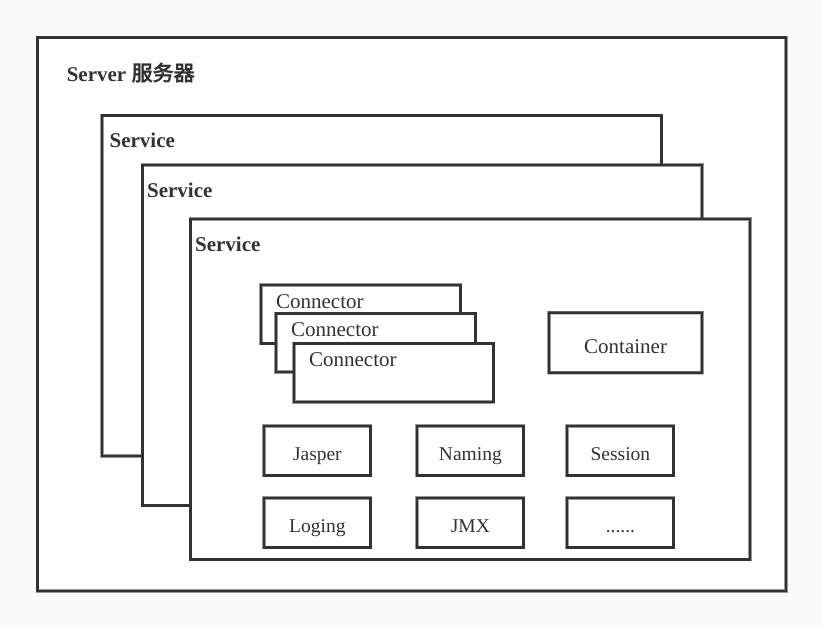
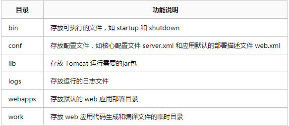
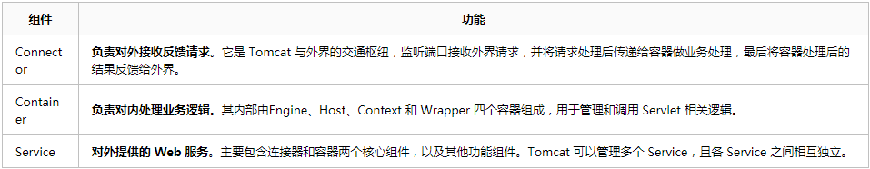
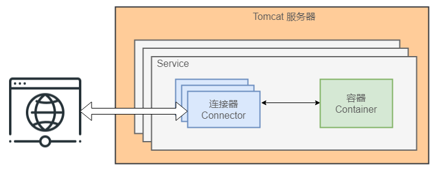
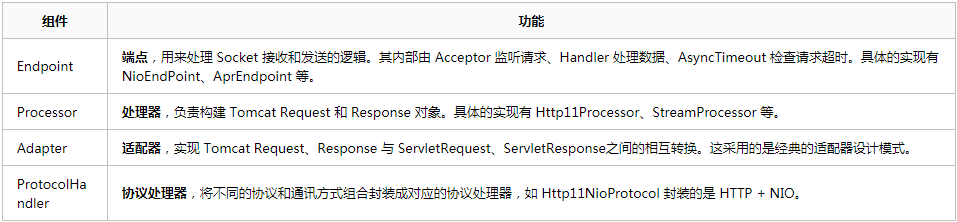
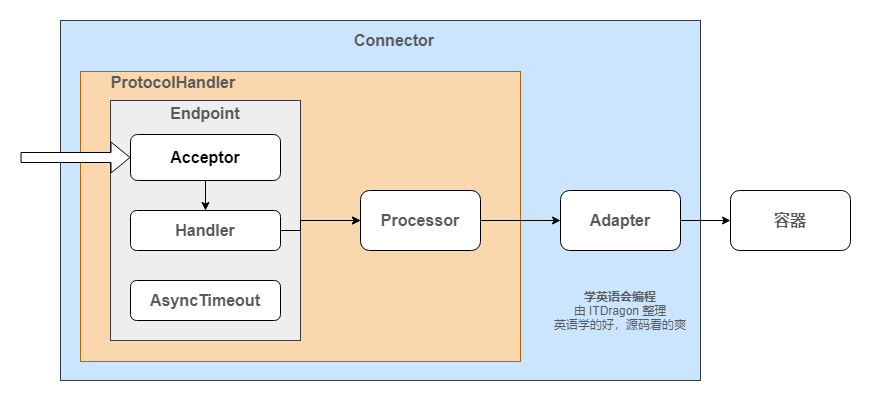
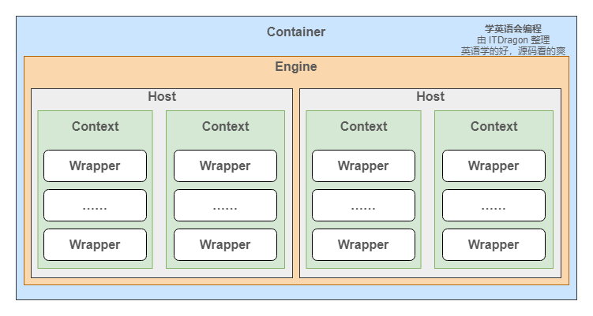
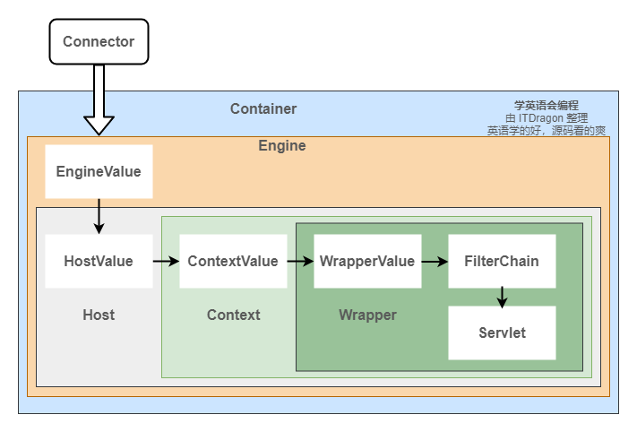

# Tomcat工作原理



Service主要包含两个部分：Connector和Container。从上图中可以看出 Tomcat 的心脏就是这两个组件，他们的作用如下：

> 1、Connector用于处理连接相关的事情，并提供Socket与Request和Response相关的转化;
> 2、Container用于封装和管理Servlet，以及具体处理Request请求；

一个Tomcat中只有一个Server，一个Server可以包含多个Service，一个Service只有一个Container，但是可以有多个Connectors，这是因为一个服务可以有多个连接，如同时提供Http和Https链接，也可以提供向相同协议不同端口的连接。

## 文件目录结构

以下是 Tomcat 8 主要目录结构：



## 功能组件结构

Tomcat 的核心功能有两个，分别是负责接收和反馈外部请求的连接器 Connector，和负责处理请求的容器 Container。其中连接器和容器相辅相成，一起构成了基本的 web 服务 Service。每个 Tomcat 服务器可以管理多个 Service。





## Tomcat连接器核心原理

Tomcat 连接器框架——Coyote

### 连接器核心功能

一、监听网络端口，接收和响应网络请求。

二、网络字节流处理。将收到的网络字节流转换成 Tomcat Request 再转成标准的 ServletRequest 给容器，同时将容器传来的 ServletResponse 转成 Tomcat Response 再转成网络字节流。

### 连接器模块设计

为满足连接器的两个核心功能，我们需要一个通讯端点来监听端口；需要一个处理器来处理网络字节流；最后还需要一个适配器将处理后的结果转成容器需要的结构。



对应的源码包路径 `org.apache.coyote` 。对应的结构图如：



### EndPoint、Processor、Adapter

（1）Endpoint用来处理底层Socket的网络连接，Processor用于将Endpoint接收到的Socket封装成Request，Adapter用于将Request交给Container进行具体的处理。

（2）Endpoint由于是处理底层的Socket网络连接，因此Endpoint是用来实现TCP/IP协议的，而Processor用来实现HTTP协议的，Adapter将请求适配到Servlet容器进行具体的处理。

（3）Endpoint的抽象实现AbstractEndpoint里面定义的Acceptor和AsyncTimeout两个内部类和一个Handler接口。Acceptor用于监听请求，AsyncTimeout用于检查异步Request的超时，Handler用于处理接收到的Socket，在内部调用Processor进行处理。

## Tomcat容器核心原理

Tomcat 容器框架——Catalina

### 容器结构分析

每个 Service 会包含一个容器。容器由一个引擎可以管理多个虚拟主机。每个虚拟主机可以管理多个 Web 应用。每个 Web 应用会有多个 Servlet 包装器。Engine、Host、Context 和 Wrapper，四个容器之间属于父子关系。


Context和Host的区别是Context表示一个web应用，我们的Tomcat中默认的配置下webapps下的每一个文件夹目录都是一个Context，其中ROOT目录中存放着主应用，其他目录存放着子应用，而整个webapps就是一个Host站点。

我们访问应用Context的时候，如果是ROOT下的则直接使用域名就可以访问，例如：www.ledouit.com,如果是Host（webapps）下的其他应用，则可以使用[http://www.ledouit.com/docs](https://link.zhihu.com/?target=http%3A//www.ledouit.com/docs)进行访问，当然默认指定的根应用（ROOT）是可以进行设定的，只不过Host站点下默认的主营用是ROOT目录下的。

对应的源码包路径 `org.apache.coyote` 。对应的结构图如下：



### 容器请求处理

容器的请求处理过程就是在 Engine、Host、Context 和 Wrapper 这四个容器之间层层调用，最后在 Servlet 中执行对应的业务逻辑。各容器都会有一个通道 Pipeline，每个通道上都会有一个 Basic Valve（如StandardEngineValve）， 类似一个闸门用来处理 Request 和 Response 。其流程图如下。



Container处理请求是使用Pipeline-Valve管道来处理的。Pipeline-Valve是责任链模式。

## Tomcat请求处理流程

上面的知识点已经零零碎碎地介绍了一个 Tomcat 是如何处理一个请求。简单理解就是连接器的处理流程 + 容器的处理流程 = Tomcat 处理流程。哈！那么问题来了，Tomcat 是如何通过请求路径找到对应的虚拟站点？是如何找到对应的 Servlet 呢？

### 映射器功能介绍

这里需要引入一个上面没有介绍的组件 Mapper。顾名思义，其作用是提供请求路径的路由映射。根据请求URL地址匹配是由哪个容器来处理。其中每个容器都会它自己对应的Mapper，如 MappedHost。不知道大家有没有回忆起被 Mapper class not found 支配的恐惧。在以前，每写一个完整的功能，都需要在 web.xml 配置映射规则，当文件越来越庞大的时候，各个问题随着也会出现

### HTTP请求流程

打开 tomcat/conf 目录下的 server.xml 文件来分析一个http://localhost:8080/docs/api请求。

第一步：连接器监听的端口是8080。由于请求的端口和监听的端口一致，连接器接受了该请求。

第二步：因为引擎的默认虚拟主机是 localhost，并且虚拟主机的目录是webapps。所以请求找到了 tomcat/webapps 目录。

第三步：解析的 docs 是 web 程序的应用名，也就是 context。此时请求继续从 webapps 目录下找 docs 目录。有的时候我们也会把应用名省略。

第四步：解析的 api 是具体的业务逻辑地址。此时需要从 docs/WEB-INF/web.xml 中找映射关系，最后调用具体的函数。

```xml
<?xml version="1.0" encoding="UTF-8"?>
<Server port="8005" shutdown="SHUTDOWN">

  <Service name="Catalina">

	<!-- 连接器监听端口是 8080，默认通讯协议是 HTTP/1.1 -->
    <Connector port="8080" protocol="HTTP/1.1" connectionTimeout="20000" redirectPort="8443" />

	<!-- 名字为 Catalina 的引擎，其默认的虚拟主机是 localhost -->
    <Engine name="Catalina" defaultHost="localhost">

	  <!-- 名字为 localhost 的虚拟主机，其目录是 webapps-->
      <Host name="localhost"  appBase="webapps" unpackWARs="true" autoDeploy="true">
          
      </Host>
    </Engine>
  </Service>
</Server>
```


上面的流程是根据配置文件来的简化版，下面是详细版的流程：

+ 用户在浏览器中输入网址localhost:8080/test/index.jsp，请求被发送到本机端口8080，被在那里监听的Coyote HTTP/1.1 Connector获得；
+ Connector把该请求交给它所在的Service的Engine（Container）来处理，并等待Engine的回应；
+ Engine获得请求localhost/test/index.jsp，匹配所有的虚拟主机Host；
+ Engine匹配到名为localhost的Host（即使匹配不到也把请求交给该Host处理，因为该Host被定义为该Engine的默认主机），名为localhost的Host获得请求/test/index.jsp，匹配它所拥有的所有Context。Host匹配到路径为/test的Context（如果匹配不到就把该请求交给路径名为“ ”的Context去处理）；
+ path=“/test”的Context获得请求/index.jsp，在它的mapping table中寻找出对应的Servlet。Context匹配到URL Pattern为*.jsp的Servlet，对应于JspServlet类；
+ 构造HttpServletRequest对象和HttpServletResponse对象，作为参数调用JspServlet的doGet()或doPost(),执行业务逻辑、数据存储等；
+ Context把执行完之后的HttpServletResponse对象返回给Host；
+ Host把HttpServletResponse对象返回给Engine；
+ Engine把HttpServletResponse对象返回Connector；
+ Connector把HttpServletResponse对象返回给客户Browser；

## 总结-各个组件的作用

### Server组件

+ Tomcat服务器的最顶层组件
+ 负责运行Tomcat服务器
+ 负责加载服务器资源和环境变量

### Service组件

+ 集合Connector和Engine(Container)的抽象组件
+ 一个Server可以包含多个Service
+ 一个Service可以包含多个Connector和一个Engine

### Connector组件

+ Connector提供基于不同特定协议的实现
+ Connector接受解析请求，返回响应
+ 经Processor派遣请求至Engine进行处理

### Engine组件

+ 容器是Tomcat用来处理请求的组件
+ 容器内部的组件按照层级排列
+ Engine是容器的顶层组件

### Host组件

+ Host代表一个虚拟主机
+ 一个Engine可以支持多个虚拟主机的请求
+ Engine通过解析请求来决定将请求发送给哪一个Host

### Context组件

+ Context代表一个Web Application
+ Tomcat最复杂的组件之一
+ 应用资源管理，应用类加载，Servlet管理，安全管理等

### Wrapper组件

+ Wrapper是容器的最底层的组件
+ 包裹住Servlet实例
+ 负责管理Servlet实例的生命周期

