# 一些知识点的汇总

## 计算机网络

### 分层

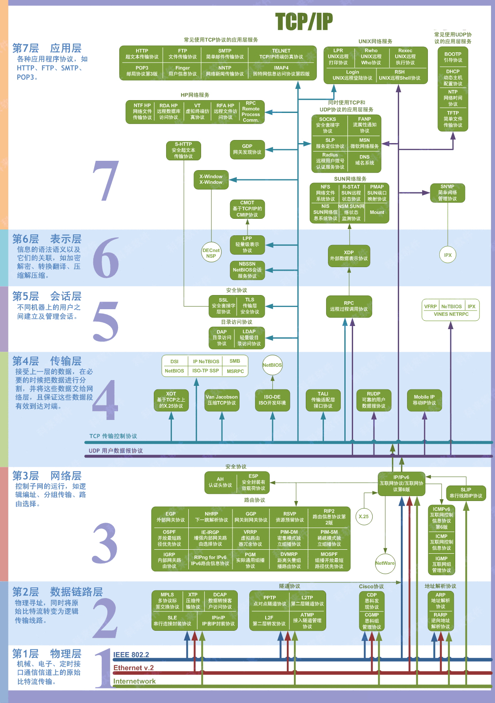

### 传输控制协议TCP简介

+ 面向连接、可靠的、基于字节流的传输层通信协议
+ 将应用层的数据流分割成报文段并发送给目标节点的TCP层
+ 数据包都有序号，对方收到则发送ACK确认，未收到则重传
+ 使用校验和（？）来检验数据在传输过程中是否有误

### TCP Flags

+ URG：紧急指针标志，一般和紧急指针（16位）部分配合使用，紧急指针可以定位紧急数据的位置。
+ ACK：确认序号标志，为1表示确认，为0表示未含确认信息
+ PSH：push标志，为1指示接收方在接受到这个报文后应尽快上交给应用程序
+ RST：重置连接装置标志，用于重置由于主机崩溃或者其他原因而出现错误的连接，或者拒绝非法的报文段，或者拒绝连接
+ SYN：同步序号，用于建立连接过程。在连接请求中，SYN=1,ACK=0表示这个数据段没有使用捎带的确认域
+ FIN：finish标志，用于释放连接

### 三次握手

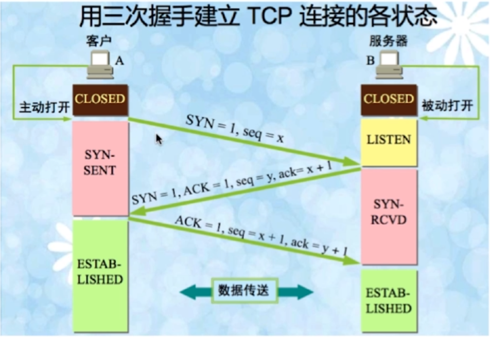

#### 为什么需要三次握手才能建立起连接？

为了初始化Sequence Number的初始值，需要互相通知对方自己的Sequence值，这些Sequence要作为以后数据通信的序号，以保证各自接受到的数据不会因为网络波动等原因而乱序，TCP会用这些序号来拼接数据，这是前两次握手的作用。第三次握手就是client通知server自己已经收到，如果server没有收到，那么将会重试第二次握手。

### 首次握手的隐患——SYN超时

#### 问题起因分析

+ server收到client的SYN，回复SYN-ACK的时候未收到ACK确认
+ server不断重试直到超时，linux默认等待63秒才断开连接

#### SYN Flood

Dos攻击。某个恶意程序给server发一个SYN报文，发完后立即下线，那么server会默认等63秒才会断开这个连接，那么攻击者就会将server的连接队列耗尽，使得不能处理正常的连接请求。

#### 针对SYN Flood的防护措施

SYN Cookie是对TCP服务器端的三次握手协议三次握手协议作一些修改，专门用来防范SYN Flood攻击的一种手段。它的原理是，在TCP服务器收到TCP SYN包并返回TCP SYN+ACK包时，不分配一个专门的数据区，而是根据这个SYN包计算出一个cookie值。在收到TCP ACK包时，TCP服务器再根据那个cookie值检查这个TCP ACK包的合法性。如果合法，再分配专门的数据区进行处理未来的TCP连接。

#### 建立连接后，client出现故障怎么办

保活机制：

+ 向对方发送保活探测报文，如果未收到响应则继续发送
+ 尝试次数达到上限就断开连接

### TCP四次挥手

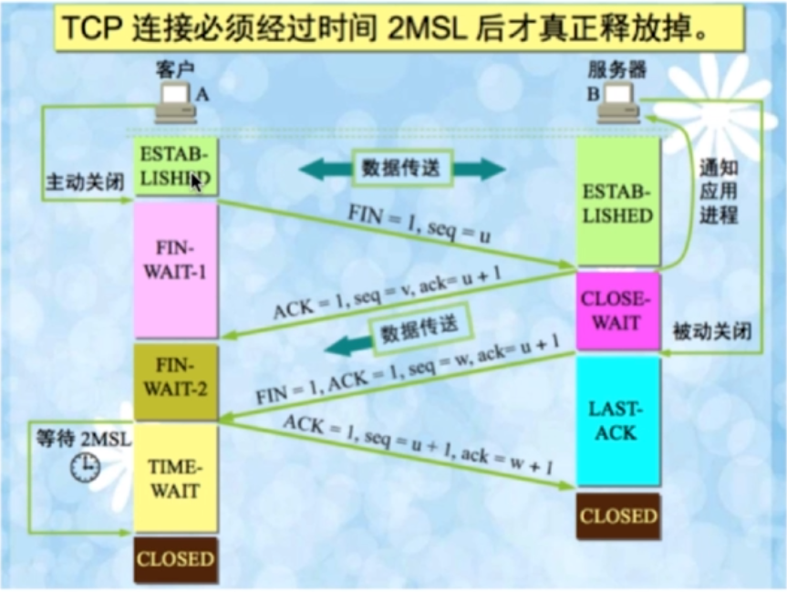

#### 为什么有TIME-WAIT状态

+ 确保有足够的时间让对方收到ACK包。
+ 避免新旧连接混淆，因为存在连接重用的可能，因此这些延迟收到的包可能会跟新的包混在一起。

#### 为什么需要四次握手才能断开连接

因为全双工，发送方和接受放都需要FIN报文和ACK报文。

而一方没有数据发送了，另一方可能还有数据没有发送，因此需要分别进行两次挥手。总共四次。

#### 服务器出现大量CLOSE_WAIT状态的原因

客户端发送FIN报文给服务器，而服务器没有发送ACK；或者服务器一直没有发送FIN报文。

最常见的原因是对方关闭socket连接，我方忙于读或写，没有及时关闭连接。

### UDP

#### 特点

+ 面向非连接
+ 不维护连接状态，支持同时向多个客户端传输相同的消息
+ 数据包报头子只有8个字节，相比TCP 20个，开销很小
+ 吞吐量不受拥挤算法的调节，只受限于数据生成速率、传输速率以及机器性能
+ 尽最大努力交付，不保证可靠交付，不需要维持复杂的链接状态表
+ 面向报文，不对应用程序提交的报文信息进行拆分或者合并

### TCP和UDP的区别

+ 面向连接vs无连接
+ 可靠性
+ 有序性
+ 速度
+ 量级，体现在头部大小

### TCP的滑动窗口

RTT和RTO：

+ RTT：发送一个数据包到收到对应的ACK，所花费的时间
+ RTO：重传时间间隔

TCP使用滑动窗口做流量控制和乱序重排。

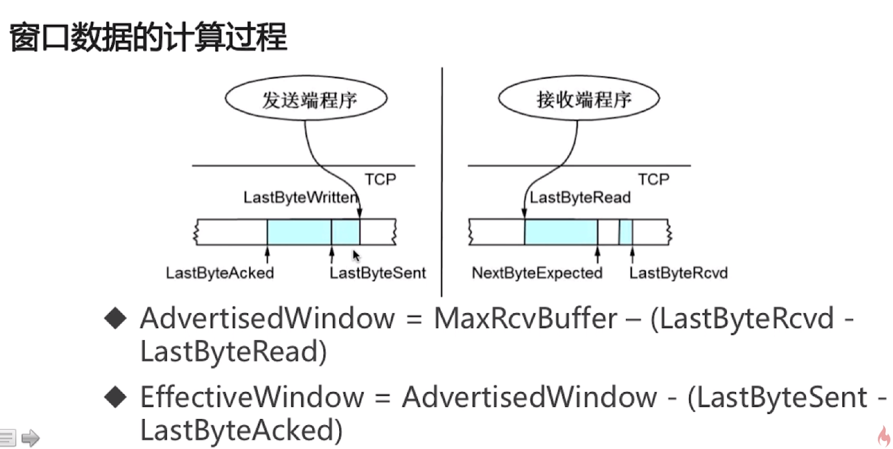

AdvertisedWindow表示接收方还能再接受多少数据；EffectiveWindow表示发送方还能再发送多少数据。

### HTTP

超文本传输协议。

#### 特点

+ 支持客户/服务器模式（请求响应模型）
+ 简单快速，客户端向服务器传输数据时，只需要传输请求方法和路径
+ 灵活
+ 无连接。每次连接只处理一个请求，做出了应答就断开连接，节省传输时间。但是从HTTP 1.1起，默认使用长连接（与close相对应），即服务器等待一定时间才断开。
+ 无状态。

> HTTP1.1相较于1.0，引入了keep-alive。

#### 请求/响应的步骤

+ 客户端链接到Web服务器
+ 发送HTTP请求
+ 服务器接受请求并返回HTTP响应
+ 释放连接TCP连接
+ 客户端浏览器解析HTML内容

#### 在浏览器地址栏输入URL，按下回车之后的流程？

+ DNS解析（从近到远依次是浏览器缓存、系统缓存、路由器缓存、IPS服务器缓存、根域名服务器缓存，顶级域名服务器缓存）
+ TCP连接（三次握手）
+ 发送HTTP请求
+ 服务器处理请求并返回HTTP报文
+ 浏览器解析渲染页面
+ 连接结束（四次挥手）

#### HTTP状态码？

五种可能的取值：

+ 1xx：指示信息——表示请求已接受，继续处理
+ 2xx：成功——表示请求已被成功接受
+ 3xx：重定向——要完成请求必须进行更进一步的操作
+ 4xx：客户端错误——请求由语法错误或请求无法实现
+ 5xx：服务器端错误——服务器未能实现合法的请求

#### 常见的HTTP状态码

+ 200 OK：正常返回信息
+ 400 Bad Request：客户端请求有语法错误，不能被服务器所理解
+ 401 Unauthorized：请求未经授权，这个状态码必须和WWW-Authenticate报头域一起使用
+ 403 Forbidden：服务器收到请求，但是拒绝提供服务（例如，访问IP被禁止）
+ 404 Not Found：请求资源不存在，eg，输入了错误的URL
+ 500 Internal Server Error：服务器发生不可预期的错误
+ 503 Server Unavailable：服务器当前不能处理客户端的请求，一段时间后可能回复正常

#### GET请求和POST请求的区别

从三个层面来解答：

+ Http报文层面：GET将请求信息放在URL，POST信息放在报文体中，抓包还是能抓出明文账号密码等
+ 数据库层面：GET符合幂等性（一般做查询用），POST不符合
+ 其他层面：GET可以被缓存（如浏览器的浏览记录中），而POST不行

#### Cookie和Session

Cookie：

+ 是由服务器发给客户端的特殊信息（放在请求头），以文本的形式存放在客户端
+ 客户端再次请求的时候，会把cookie回复
+ 服务器接受到后，回揭西cookie生成与客户端相对应的内容

Cookie的设置以及发送过程：

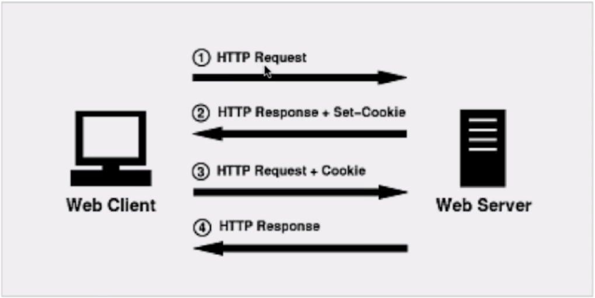

Sessoin：

+ 服务器端的机制，在服务器上保存的信息
+ 解析客户端请求并操作session id，按序保存状态信息

Session的实现方式：

+ 使用cookie来实现：

  服务器给每个cookie分配一个session id，即jsessionid，然后发给客户，客户在后续请求中，将这个id携带在cookie中，发给服务端。

  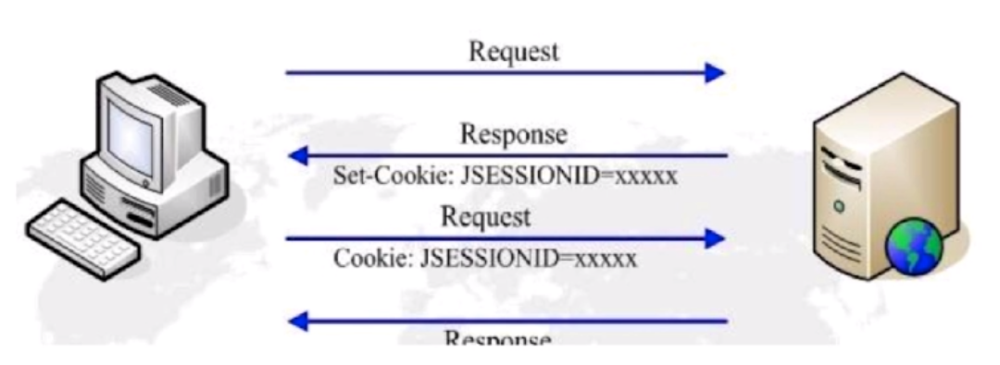

+ 使用URL回写来实现：服务器发送给浏览器的链接中携带jsessionid的参数，客户端点击任何链接，都会将这个id带回到服务器。

> Tomcat支持两种，如果发现客户端支持cookie，那么就用cookie。

#### Cookie和Session的区别

+ Cookie数据存放在客户的浏览器上，Session数据放在服务器上
+ Session相比Cookie更安全，因为Cookie存放在用户本地，可以被获取并分析。
+ 如果考虑减轻服务器负担，应当使用Cookie。

### HTTP和HTTPS的区别

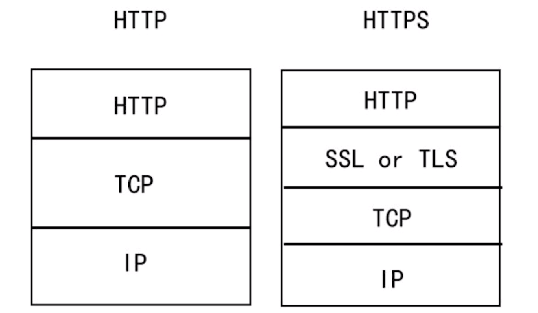

#### SSL(Security Sockets Layer，安全套接层)

+ 为网络通信提供安全及数据完整性的一种安全协议
+ 是操作系统对外的API，SSL3.0后更名为TLS
+ 采用身份验证和数据加密保证网络通信的安全和数据的完整性

#### 加密方式

+ 对称加密：加密和解密都使用同一个密钥

+ 非对称加密：加密使用的密钥和解密使用的密钥是不相同的

+ 哈希算法：将任意长度的信息转换为固定长度的值，算法不可逆

+ 数字签名：证明某个消息或者文件是某人发出/认同的（证明没有被修改过）

  > 数字签名：
  >
  > （1）甲使用乙的公钥对明文进行加密，生成密文信息。
  >
  > （2）甲使用HASH算法对明文进行HASH运算，生成数字指纹。
  >
  > （3）甲使用自己的私钥对数字指纹进行加密，生成数字签名。
  >
  > （4）甲将密文信息和数字签名一起发送给乙。
  >
  > （5）乙使用甲的公钥对数字签名进行解密，得到数字指纹。
  >
  > （6）乙接收到甲的加密信息后，使用自己的私钥对密文信息进行解密，得到最初的明文。
  >
  > （7）乙使用HASH算法对还原出的明文用与甲所使用的相同HASH算法进行HASH运算，生成数字指纹。然后乙将生成的数字指纹与从甲得到的数字指纹进行比较，如果一致，乙接受明文；如果不一致，乙丢弃明文。
  >
  > 
  >
  > 非对称加密和数字签名的区别：
  >
  > 对于非对称加密，**整个数据加密和解密过程用的都是接收方的密钥**，而数字签名则完全相反，**整个数据签名和解密的过程用的都是发送方的密钥**。

#### HTTPS证书

在服务器上生成CSR文件（证书申请文件，内容包括证书公钥、使用的Hash算法、申请的域名、公司名称、职位等信息），把CSR文件和其他可能的证件上传到CA认证机构，CA机构收到证书申请之后，使用申请中的Hash算法，对部分内容进行摘要，然后`使用CA机构自己的私钥对这段摘要信息进行签名`， 然后CA机构把签名过的证书通过邮件形式发送到申请者手中。申请者收到证书之后部署到自己的web服务器中。

浏览器端拥有CA的公钥，在获取到服务器发来的证书后，对签名进行解密，得到摘要1，然后对其他信息进行hash，得到摘要2，比对这两个摘要，如果不一致，那么不可信。

#### HTTPS流程

+ 浏览器将支持的加密算法信息发送给服务器
+ 服务器选择一套浏览器支持的加密算法，以证书的形式回发给浏览器
+ 浏览器验证证书合法性，然后做以下操作：
  + 定义一个握手信息，使用哈希算法进行加密，得到A
  + 生成随机的对称加密的密码，使用服务器的公钥进行加密，得到B
  + 用随机生成的密码对A进行对称加密，得到C
  + 将A，B，C发给server
+ server端进行验证，具体操作如下：
  + 使用server端的私钥对B进行解密，得到对称密钥
  + 使用上述的对称密钥对C进行解密，得到被哈希过的握手信息
  + 将这个握手信息与A进行比对，如果一致，则消息合法
+ 如果上述消息合法，server端使用上述对称密钥加密新的握手信息，发送给浏览器
+ 浏览器用对称密钥解密握手信息，然后计算握手信息的哈希值，如果与服务端发来的相同，那么消息合法
+ 之后就使用浏览器生成的随机密码和对称加密算法传输数据了

#### HTTP和HTTPS的区别

+ HTTPS需要到CA申请证书，HTTP不需要
+ HTTPS密文传输，HTTP明文传输
+ 连接方式不同，HTTPS默认443端口，HTTP使用80端口
+ HTTPS=HTTP+加密+认证+完整性保护，较HTTP安全

#### HTTPS真的安全吗

+ 浏览器默认填充http://，请求需要进行跳转，有被劫持的风险
+ 可以使用HSTS（HTTP Strict Transport Security）优化

### Socket简介

Sockt是对TCP/IP协议的抽象，方便于使用TCP/IP协议栈。是操作系统对外开放的接口。

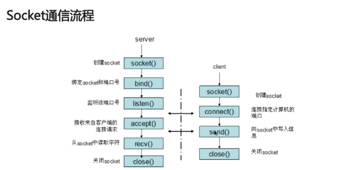

## 数据库

### 如何设计一个关系型数据库？

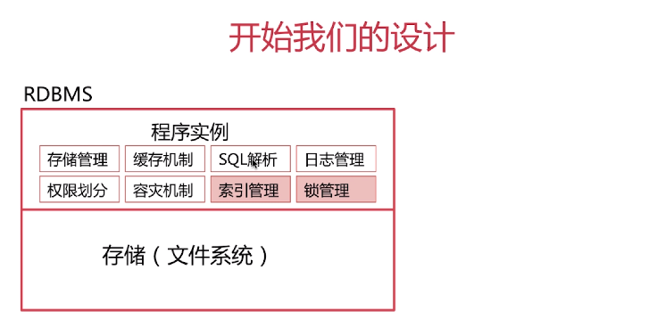

### 索引模块

#### B+树相比于B树的优点

+ B+树的磁盘读写代价更低。因为B+数非叶子节点不存储数据，只存储键，因此每个非叶子节点存储的数据要比B树更多，对于相同的读内存的次数，读入内存的键会更很多，读写代价更低。
+ B+树的查询效率更稳定，因为非叶子节点不存储数据，所有的数据必须在叶子节点上获得，所以查询效率很稳定
+ B+树的叶子节点之间形成了链表，有利于数据库的扫描

#### Hash索引的缺点

+ 只能满足“=”，“IN”，不能满足范围查询
+ 因为是无序的，所以无法用索引来排序
+ 不能利用部分索引键查询（最左前缀，B数和B+树都支持最左前缀）
+ hash可能存在冲突，因此即使找到对应的bucket，也需要遍历冲突链表来查找

#### 位图索引

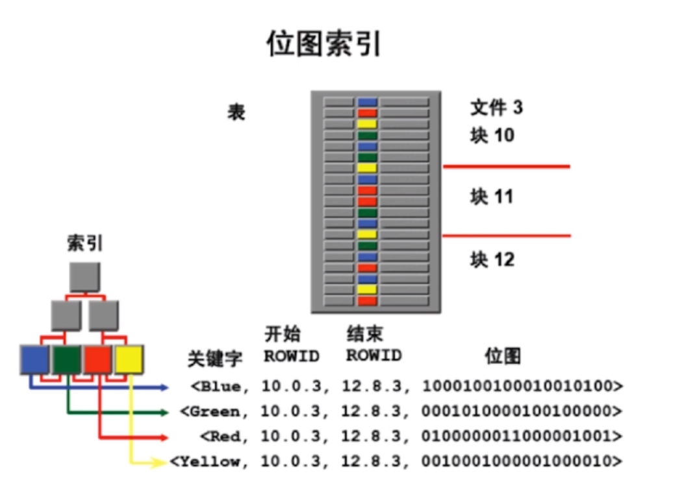

#### 密集索引和稀疏索引的区别

+ 密集索引文件中的每个搜索码值都对应一个索引值
+ 稀疏索引文件只为索引码的某些值建立索引项，比如只保存主键的信息

#### InnoDB的密集索引

+ 若一个主键被定义，该主键作为密集索引
+ 若没有主键被定义，该表的第一个唯一非空索引则作为密集索引
+ 若不满足以上条件，innodb内部会生成一个隐藏的主键做密集索引
+ 非主键索引存储相关键位和其对应的主键值，包含两次查找

### 如何定位并优化慢查询sql

#### 根据慢日志定位慢查询sql

+ `show variables like '%quer%'`，查找关于query的相关配置
  + `slow_query_log=off`（默认）表示慢日志关闭，需要开启
  + `slow_query_log_file`为慢日志存储位置(注意DDL数据定义语言不会被记录在内)
  + `long_query_time`是一个时长，查询时长超过它将会被记录在慢日志里
  + 使用`set global <name> <value>`语句更改上述配置
+ `show status like '%slow_queries%'`，显示慢查询语句的条数
+ 日志中，会显示查询时间、查询语句等

#### 使用explain等工具分析sql

在查询的语句前加上explain关键字，注意这样并不会真正地去查询数据，而是对该sql显示分析结果。

Explain关键字段：

+ type：

  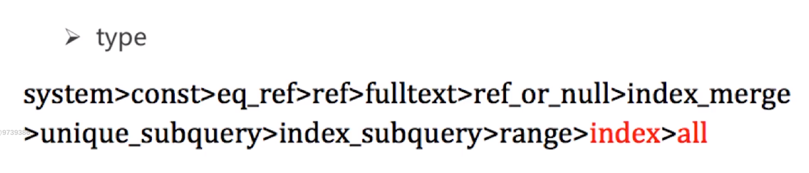

+ extra：

  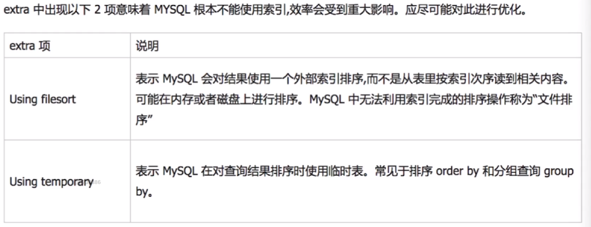

> 做测试的时候可以使用force index来强迫语句走指定的索引

#### 修改sql或者尽量让sql走索引

注意，走主键未必比走其他的索引要快。例如count(id)，直接走unique key要比primary key要快。因为辅助索引的叶子节点只存储主键，不存储其他数据，而count只需要统计个数，无需访问数据，因此主键索引的非叶子节点存储了其他数据而导致效率降低。

#### 最左匹配原则

+ mysql会一直向右匹配直到遇到范围查询（>, <, between, like）就停止匹配，比如a=3 and b=4 and c>5 and d=6，如果建立(a, b, c, d)顺序索引，d是用不到索引的，如果建立(a, b, d, c)则可以用到，a, b, d的顺序可以任意调整。
+ =和in可以乱序，比如a=1 and b=2 and c=3建立(a, b, c)索引可以任意顺序，mysql的查询优化器会帮助优化成索引可以识别的顺序。(也就是说，查询语句可以被优化，但是索引的顺序是固定的，无法被优化)

### 索引是建立得越多越好吗

+ 数据量小的表不需要建立索引，建立会增加额外的索引开销
+ 数据变更需要维护索引，因此更多的索引意味着更多的维护成本
+ 更多的索引意味着也需要更多的空间

### MyISAM与InnoDB关于锁方面的区别是什么？

+ MyISAM默认用的是表级锁，不支持行级锁
+ InnoDB默认用的是行级锁，也支持表级锁

对于MyISAM和InnoDB，select语句默认会加上读锁，是共享锁。当然也可以使用select for update加上排他锁。

使用select lock in share mode显式地加上共享锁。

对于InnoDB来说，如果sql没有走索引，那么会加上表级锁，而非行锁。

#### 锁的粒度越小越好？

粒度越小，加锁的代价越高。例如表锁只需要加载头结点，而行锁需要找到对应的行才能加锁。

### MyISAM适合的场景

+ 频繁执行全表count语句，因为MyISAM内部用了一个变量保存了这个统计信息。
+ 对数据进行增删改的频率不高，查询非常频繁
  + InnoDB要维护的东西多，例如维护MVCC等
  + InnoDB寻址要映射到块，再到行，MyISAM记录的是文件的offset，定位比InnoDB快
+ 没有事务

### InnoDB适合的场景

+ 数据增删改查都相当频繁
+ 可靠性要求非常高，要求支持事务

### MySQL乐观锁和悲观锁

乐观锁就是从应用层面上做并发控制。在数据库表中增加版本字段（或者时间戳），妹修改成功一次，版本号+1，每一次对数据的更新时带上原先获取的版本号，如果版本号变了，那么where条件自然不符合。

update t_goods  set status=2,version=version+1  where id=#{id} and version=#{version};

> 其实不需要版本号也能实现乐观锁，where条件中判断status是否是之前的status即可。这里引入版本号是为了解决ABA的问题。

> 虽说在应用层面避免了加锁，但是数据库层面上，update语句还是会自动加锁的。

悲观锁就是从数据库层面上做并发控制。

### 数据库事务的四大特性

#### ACID

+ 原子性（Atomic）
+ 一致性（Consistency）
+ 隔离性（Isolation）
+ 持久性（Durability）

### InnoDB可重复读隔离级别下如何避免幻读

+ 表象：快照读（非阻塞读）——伪MVCC

  > 为什么“伪”，因为undo log只是串行化的版本，并不是真正意义上的多版本。

+ 内在：next-key锁（行锁+gap锁）

### 当前读和快照读

select ... lock in share mode， select ... for update， update，delete，insert等均为当前读。

不加锁的非阻塞读，普通的select为快照读。

在RC的级别下，快照读和当前读的结果相同。

### next-key锁（行锁+gap锁）

#### 对主键索引或者唯一索引会用Gap锁吗

+ 如果where条件全部命中，则不会用Gap锁，只会加记录锁

  > 例如，where in (1, 2, 3)，如果123都存在，则不会加Gap锁，如果只存在其中的部分，那么会加Gap锁

+ 如果where条件部分命中或者全不命中，则会加Gap锁

#### Gap锁会用在非唯一索引或者不走索引的当前读中

+ 非唯一索引
+ 不走索引将锁住所有区间

#### Gap锁是锁在索引的指针上的

例如字段name为主键，id为非唯一索引，有如下数据：

| id   | 2    | 6    | 9    | 9    | 11   | 15   |
| ---- | ---- | ---- | ---- | ---- | ---- | ---- |
| name | h    | c    | b    | d    | f    | a    |

session A执行下列操作：

```sql
delete from tb where id = 9;
```

session A还未提交，那么因为id为非唯一索引，因此不能保证其他session同时插入id为9的数据，需要在(6, c)到(9, d)之间加gap锁。（如果id是唯一索引或主键，那么不需要加gap锁，因为唯一约束保证其他session不会插入id为9的数据）。

但是要注意的是，gap锁的实现是加在链表上的next指针上的，因此其他session还是能插入(6, b)的！因为id相同，那么按照name排序，因此(6, b)在(6, c)的左侧，不受gap锁的影响，同理，(6, d)在(6, c)的右侧，因为gap锁而无法插入！

## Redis

### 缓存中间件——Memcache和Redis的区别

Memcache：

+ 支持简单数据类型
+ 不支持数据持久化存储
+ 不支持主从
+ 不支持分片

Redis：

+ 数据类型丰富
+ 支持数据磁盘持久化存储
+ 支持主从
+ 支持分片

### Redis多路I/O复用模型

Redis采用的I/O多路复用函数：(linux)epoll/(freebsd)kqueue/evport/select?

+ 因系统不同而不同。
  + linux中的epoll
  + macos/freebsd中的kqueue
  + Solaries中的evport
  + select在不同的版本的系统上都会实现，作为保底方案
+ 优先选择时间复杂度为$O(1)$的I/O多路复用函数作为底层实现。
+ 以时间复杂度为$O(n)$的select作为保底方案。
+ 基于react设计模式监听I/O事件

### 如何从海量Key查询出某一固定前缀的Key？

#### 使用keys对线上业务的影响？

KEYS pattern：查找所有符合给定模式pattern的key。

+ keys指令一次性返回所有匹配的key
+ 键的数量过大会使服务卡顿
+ 消耗大量的内存

因此不推荐使用keys。

推荐使用scan指令。

```
SCAN cursor [MATCH pattern] [COUNT count]
```

+ 基于游标的迭代器，需要基于上一次的游标延续之前的迭代过程
+ 以0为游标开始一次新的迭代，直到命令返回游标0完成一次遍历
+ 不保证每次执行都返回某个给定数量的元素，支持模糊查询
+ 一次返回的数量不可控，只能大概率符合count参数

```
scan 0 match k1* count 10

output:
1) "11545336"
2) 1) "k123124"
   2) "k324324"
   3) "k343432"
```

其中，返回的第一行是游标，后面的是结果集。

> 注意，cursor不一定是递增的，因此每次scan可能得到相同的key值，因此需要判重。
>
> 为什么不一定是递增的？因为低层类似hashmap，动态地增加删除会引发rehash，扩容等操作，而cursor返回的是bucket所在的位置，而bucket的位置是会随着扩容rehash的变化而变化的。

### 使用Redis实现分布式锁，SETNX和EXPIRE的组合非原子性问题

虽然命令是原子性的，但是组合并不是原子性的，如果程序执行完SETNX指令，挂掉了，没有执行EXPIRE指令，应该怎么解决？

Redis2.6.12版本后提供了新的命令，使用set操作将上述两个功能组合在一起：

SET key value [EX second] [PX milliseconds] [NX|XX]

+ EX second：设置键的过期时间为second秒
+ PX milliseconds：设置键的过期时间为milliseconds毫秒
+ NX：只有当键不存在时，才对键进行设置操作
+ XX：只有在键已经存在时，才对键进行设置操作
+ SET操作成功时返回OK，否则返回NIL（注意这里返回的不是1或0）

### 大量的key同时过期的注意事项

集中过期，由于清除大量的key很耗时，会出现短暂的卡顿现象。并且如果有大量的流量涌入，因为缓存大量过期，会直接走数据库，对数据库造成压力。

解决方案：设计过期时间为随机时间

### 如何使用Redis做异步队列

+ 使用List作为队列，RPUSH生产消息，LPOP消费消息。
  + 缺点：LPOP不会等待队列里有值才会去消费
  + 弥补：应用层加入Sleep机制去调用LPOP重试

+ 当然也有BLPOP指令来解决上述缺陷
  + BLPOP key [key ...] timeout：阻塞直到队列有消息或者超时
  + 缺点：只能提供给一个消费者消费

+ pub/sub：主题订阅者模式

  + 发送者（pub）发送消息，订阅者（sub接受消息）

  + 订阅者可以订阅任意数量的频道

    ```shell
    subcribe topic
    ```

    ```shell
    publish topic "message"
    ```
    
  + 缺点：消息的发布是无状态的，无法保证可达。如果某个消费者下线了，那么下线的这段时间发布的消息他无法收到。
  

### 使用pipeline的好处

Redis基于请求/响应模型，单个请求处理需要一一应答。

PipeLine批量执行指令，节省多次IO往返的时间。

有顺序依赖的指令建议按顺序分批发送。

### Redis集群原理

#### 如何从海量数据里快速找到所需？

+ 分片：按照某种规则去划分数据，分散存储在多个节点上
+ 常规的按照哈希划分无法实现节点的动态增减
+ 解决：一致性哈希算法

#### 一致性哈希算法

对2^32取模，将哈希值空间组织成虚拟的圆环。

服务器节点分布在这个hash环上，对于某个数据，计算该数据的hash值，然后在换上从这个hash值出发，顺时针找到第一个服务器，这个服务器就是数据分布的位置。

如果需要动态添加节点C到A和B之间，那么只会影响AC之间的数据分布，而CB之间的数据分布不会收到影响，因此尽可能地降低数据分布的变化。

但是存在一个问题，那就是数据倾斜的问题，某段弧的长度远远大于其他弧。解决的方法是引入虚拟节点来填充那些空，使得数据分散在虚拟节点上。一个物理节点对应多个虚拟节点。

## Linux知识

### Linux体系结构

体系结构主要分为用户态和内核态。

内核本质是一段管理计算机硬件设备的程序。

系统调用：内核的访问接口，是一种原子操作。

公用函数库：系统调用的封装。

Shell：命令解释器，可编程。

### 查找特定的文件

可以使用man指令查看使用说明

```bash
man find
```

```bash
find [path] [-option] params
# -iname忽略大小写
find -iname "file"
```

### 检索文件内容

```bash
# 查找文件里符合条件的字符串
# 如果不指定file，那么默认从输入流中读取
grep [options] pattern file
```

```bash
# 从target打头的文件中查找含有moo的行
grep "moo" target*
```

管道操作符：

可将指令连接起来，前一个指令的输出作为后一个的输入。

```bash
# 后面的grep没有指定file，因此从输入流读取
# 因为用了管道，因此grep是从find ~的结果中读取
# 功能为查找所有文件中含有“target”的行
find ~ | grep "target"
# keyword为关键词，pattern为过滤的正则，先从file中查找包含关键词的行，然后过滤出想要的信息，比如错误日志中出错的ip之类的
grep keyword file | grep -o pattern
# 查找tomcat的进程
ps -ef | grep tomcat
# grep -v用于过滤信息，因为grep命令也包含tomcat字段，因此-v会过滤掉这个进程
ps -ef | grep tomcat | grep -v "grep"
```

> 注意：
>
> + 不处理错误输出。前一个命令的错误输出不会作为后面的输入。
> + 右边命令必须能够接受标准输入流，否则传递过程中数据会被抛弃。
> + 常用的接受标准输入流的命令：sed, awk, grep, cut, head, top, less, more, wc, join, sort, split等。

### 对日志内容做统计

```bash
awk [options] 'cmd' file
```

+ 一次读取一行文本，按输入分隔符进行切片，切成多个组成部分
+ 将切片直接保存在内建的变量中，\$1, \$2...（\$0表示行的全部）
+ 支持对单个切片的判断，支持循环判断，默认分隔符为空格

```shell
# 对netstat.txt文件每行进行切片（默认分隔符为空格），然后输入第一个切片和第4个切片
awk 'print $1, $4' netstat.txt
# 也可以添加过滤条件
awk '$1=="tcp" && $2==1 {print $0}' netstat.txt
# 把表头也打印出来
awk '($1=="tcp" && $2==1) || NR==1 {print $0}' netstat.txt
# 可以使用-F指定其他分隔符
awk -F "," '{print $2}' file
# 统计个数，arr[i]中的i为切片内容，arr[i]为i的出现个数
awk '{arr[$1]++}END{for(i in arr)print i "\t" arr[i]}'
```

### 批量替换文本内容

sed：

全名stream editor，流编辑器，适合用于对文本的行内容进行处理。

```bash
sed [option] 'sed command' filename
# -i是指将替换后的文本覆盖原文本，默认是将替换后的文本输出到控制台，而不是覆盖原文本
# s表示字符串操作，/.../.../，一二两个斜杠之间的pattern将会被二三两个斜杠间的字符串替换
sed -i 's/^Str/String/' filename
# 默认情况下，替换首个匹配到的字符串，如果需要全局匹配，需要加上g
sed -i 's/^Str/String/g' filename
# 删除匹配的关键词的行（注意是包含pattern的一整行）
sed -i '/pattern/d' filename
```

## JVM基础

### 谈谈对Java的理解

+ 平台无关性
+ GC
+ 语言特性
+ 面向对象
+ 类库
+ 异常处理

### 平台无关性如何理解？

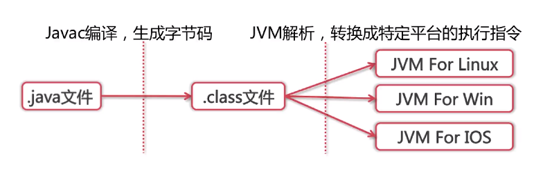

Java源码首先被编译成字节码，再由不同平台的JVM进行解析，Java语言在不同的平台上运行时不需要进行重新编译，Java虚拟机在执行字节码的时候，把字节码转换成具体平台上的机器指令。

### 为什么JVM不直接将源码解析成机器码去执行？

+ 准备工作：每次执行都需要各种检查
+ 兼容性：也可以将别的语言解析成字节码

### JVM如何加载.class文件？

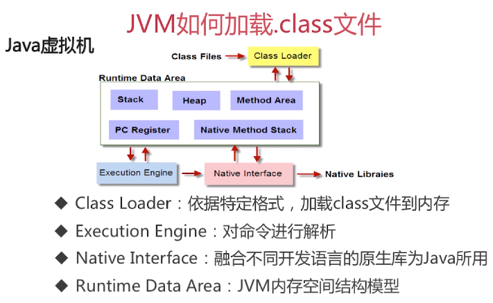

### 什么是反射？

Java反射机制是在运行状态中，对于任意一个类，都能够知道这个类的所有属性和方法；对于任意一个对象，都能够调用它的任意方法和属性；这种动态获取信息以及动态调用对象方法功能称为Java的反射机制。

### 类从编译到执行的过程

+ 编译器将Robot.java源文件编译为Robot.class字节码文件
+ ClassLoader将字节码（以byte数组的形式）转换为JVM中的Class\<Robot\>对象
+ JVM利用Class\<Robot\>对象实例化为Robot对象

### 谈谈ClassLoader

ClassLoader主要工作在Class装载的加载阶段，负责从系统外部获得Class二进制数据流。所有的Class都是由ClassLoader加载的。ClassLoader通过将Class文件里的二进制数据流装载进系统，然后交给Java虚拟机进行连接、初始化等操作。

### ClassLoader的种类

+ BootStrapClassLoader：C++编写，加载核心库 java.*
+ ExtClassLoader：Java编写，用户可见（指的是看得到实现，BootStrapClassLoader不可见，因为是C++编写的，只能去看JVM源码），加载jre/lib/ext/下的jar包，加载扩展库javax.*。用户可以将自定义的jar包放在jre/lib/ext/下也可以被加载
+ AppClassLoader：Java编写，用户可见，加载程序所在目录（classpath）
+ 自定义ClassLoader：Java编写，定制化加载

### 自定义ClassLoader

一般需要实现重写findClass方法。

查看ClassLoader的loadClass方法：

```java
protected Class<?> loadClass(String name, boolean resolve)
    throws ClassNotFoundException
{
    synchronized (getClassLoadingLock(name)) {
        // First, check if the class has already been loaded
        Class<?> c = findLoadedClass(name);
        if (c == null) {
            long t0 = System.nanoTime();
            try {
                if (parent != null) {
                    c = parent.loadClass(name, false);
                } else {
                    c = findBootstrapClassOrNull(name);
                }
            } catch (ClassNotFoundException e) {
                // ClassNotFoundException thrown if class not found
                // from the non-null parent class loader
            }

            if (c == null) {
                // If still not found, then invoke findClass in order
                // to find the class.
                long t1 = System.nanoTime();
                c = findClass(name);

                // this is the defining class loader; record the stats
                sun.misc.PerfCounter.getParentDelegationTime().addTime(t1 - t0);
                sun.misc.PerfCounter.getFindClassTime().addElapsedTimeFrom(t1);
                sun.misc.PerfCounter.getFindClasses().increment();
            }
        }
        if (resolve) {
            resolveClass(c);
        }
        return c;
    }
}
```

可以看出，优先使用父classloader去加载，如果没有父类的classloader，那么使用去查找BootStrapClass，如果都没有找到，那么会调用findClass方法，这个方法默认抛出异常，因此需要自己实现这个方法。

例如，在其他路径存在class文件，需要在别的路径下的项目加载进来，那么需要自定义classloader，获取到class文件的byte数组，然后使用defineClass返回对应的class：

```java
import java.io.*;

public class MyClassLoader extends ClassLoader {
    private String path;
    private String classLoaderName;

    public MyClassLoader(String path, String classLoaderName) {
        this.path = path;
        this.classLoaderName = classLoaderName;
    }

    @Override
    protected Class<?> findClass(String name) throws ClassNotFoundException {
        byte[] b = loadClassData(name);
        return defineClass(name, b, 0, b.length);
    }

    private byte[] loadClassData(String name) {
        name = path + name + ".class";
        InputStream in = null;
        ByteArrayOutputStream out = null;
        try {
            in = new FileInputStream(name);
            out = new ByteArrayOutputStream();
            int i = 0;
            while ((i = in.read()) != -1) {
                out.write(i);
            }
        } catch (FileNotFoundException e) {
            e.printStackTrace();
        } catch (IOException e) {
            e.printStackTrace();
        } finally {
            try {
                out.close();
                in.close();
            } catch (IOException e) {
                e.printStackTrace();
            }
        }
        return out.toByteArray();
    }
}
```

```java
public static void main(String[] args) throws ClassNotFoundException, IllegalAccessException, InstantiationException {
    MyClassLoader m = new MyClassLoader("/home/yikang/Document/", "myClassLoader");
    Class c = m.loadClass("Wali");
    System.out.println(c.getClassLoader());
    c.newInstance();
}
```

> 因为需要对findClass自定义，所以能做很多功能，例如从远程获取class byte数组，然后解析，或者对加密过的byte数组进行解密，然后解析等等。

### ClassLoader的双亲委派机制

 见其他笔记。

### 为什么要使用双亲委派机制去加载类

+ 具备带有优先级的层级关系，例如Object类，无论哪一个加载器要加载这个类，最终都会委派给最顶端的启动类，保证了Object类在各种类加载器环境中都是同一个类。
+ 避免多份同样字节码的加载

### 类的加载方式

+ 隐式加载：new
+ 显式加载：loadClass，forName等

### 类的装载过程

+ 加载：通过ClassLoader加载class文件字节码，生成class对象
+ 链接：
  + 校验：检查加载的class的正确性和安全性
  + 准备：为类变量（static）分配存储空间并设置类变量默认值（不是初始值）
  + 解析：JVM将常量池内的符号引用（限定名之类的）转换为直接引用（指针、偏移量或者句柄之类的）
+ 初始化：执行类变量赋值和静态代码块

#### loadClass和forName的区别

+ Class.forName得到的class是已经初始化完成的
+ ClassLoader.loadClass得到的class是还没有进行链接的

> 由框架初始化的类避免使用loadClass，应该使用forName。
>
> 很多框架采用延时加载的策略，例如Spring，那么这些class需要loadClass加载进来，而不是forName。

### Java的内存模型


#### 程序计数器

+ 当前线程所执行的字节码行号指示器，注意是逻辑计数器，而非物理计数器
+ 改变计数器的值来选取下一条需要执行的字节码指令
+ 线程私有
+ 对Java方法计数，如果是Native方法则计数器值为Undefined
+ 不会发生内存泄露

#### 虚拟机栈

+ Java方法执行的内存模型

+ 包含了多个栈帧，栈帧包含局部变量表、操作栈、动态链接、返回地址等。

  > 局部变量表和操作数栈？
  >
  > 局部变量表包含方法执行过程中的所有变量。
  >
  > 操作数栈是为了计算，保存当前计算所需要的操作数。
  >
  > 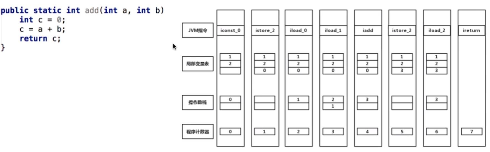

> 栈的内存不需要GC回收。

> 递归过深，栈帧数超出虚拟栈深度将会引发StackOverflowError异常。
>
> 当虚拟机栈允许动态扩展时，如果无法申请过多的虚拟机栈，就会抛出OutOfMemoryError异常。

### 本地方法栈

与虚拟机栈相似，主要作用于标注了native的方法。

### Metaspace

#### 从方法区到元空间

+ jdk1.8以前的JVM有方法区，也叫永久代

+ 方法区用于存放加载的类信息、常量、静态变量，即编译器编译后的代码

+ 方法区是一片连续的堆空间，通过-XX:MaxPermSize来设定永久代的最大空间，当JVM加载的类信息超过了这个值，会报OOM：PermGen错误

+ 永久代的GC是和老年代的GC绑定在一起的，无论谁满了，都会触发永久代和老年代的垃圾收集

+ JDK1.7开始了方法区的部分移除：符号引用移到native heap，字面量和静态变量移到java heap。

  > 为什么要用Metaspace替代方法区？
  >
  > 随着动态类加载的情况越来越多，这块内存变得不太可控，如果设置小了，系统运行过程中就容易出现内存溢出，设置大了又浪费内存。并且减少Full GC的频率。

#### 元空间与永久代的区别

+ 元空间使用本地内存，而永久代使用的是JVM内存

#### 元空间相比永久代的优势

+ 字符串常量池存在永久代中，容易出现性能问题和内存溢出
+ 类和方法的信息大小难确定，给永久代的大小指定带来困难
+ 永久代会为GC带来不必要的复杂性，永久代中的数据可能会在每次的full gc中移动，移除永久代可以降低Full GC的频率
+ 方便HotSpot与其他JVM的集成

### 堆（Heap）

+ 对象实例的分配区域
+ GC管理的主要区域，所以也称GC堆

### 三大性能调优参数

+ -Xss：规定每个线程虚拟机栈（堆栈）的大小
+ -Xms：堆的初始值
+ -Xmx：堆能达到的最大值

> 一般将-Xms和-Xmx设置为一样的值，防止它自动扩容，造成内存抖动，影响稳定性（？）（这里指对应的值忽高忽低）
>
> 内存抖动是指内存频繁地分配和回收，而频繁的gc会导致卡顿，严重时和内存泄漏一样会导致OOM。

### Java内存模型中堆和栈的区别（内存角度）

#### 内存分配策略

+ 静态存储：编译时确定每个数据目标在运行时的存储空间的需求
+ 栈式存储：数据区需求在编译时未知，运行时模块入口前确定
+ 堆式存储：编译时或运行时模块入口都无法确定，动态分配，如可变长度串、数组和对象实例

#### 联系

引用对象、数组时，栈里定义变量保存堆中目标的首地址

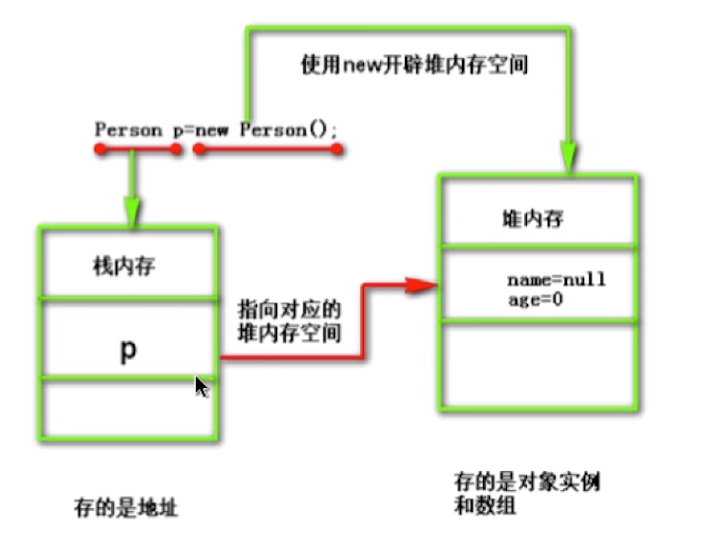

#### 区别

+ 管理方式：栈自动释放，堆需要GC
+ 空间大小：栈比堆小
+ 碎片相关：栈产生的碎片远小于堆
+ 分配方式：栈支持静态和动态分配，而堆仅支持动态分配
+ 效率：栈的效率比堆高

### 元空间、堆、线程独占部分间的联系（内存角度）

假设有以下一段代码：

```java
public class HelloWorld {
    private String name;

    public void sayHello() {
        System.out.println("Hello" + name);
    }

    public void setName(String name) {
        this.name = name;
    }

    public static void main(String[] args) {
        int a = 1;
        HelloWorld hw = new HelloWorld();
        hw.setName("test");
        hw.sayHello();
    }
}
```

当这个类被加载进来，那么各个部分保存的信息如下：

+ 元空间：
  + Class: HelloWorld -Method: sayHello\setName\main -Field: name
  + Class: System
+ Java堆：
  + Object: String("test")
  + Obejct: HelloWorld
+ 线程独占：
  + Parameter reference: "test" to String object
  + Variable reference: "hw" to HelloWorld object
  + Local Variables: a with 1, lineNo

### 不同JDK版本之间的intern方法的区别

```java
String s = new String("a");
s.intern();
```

JDK6：当调用intern方法时，如果字符串常量池先前已创建出该字符串对象，则返回池中的该字符串的引用。否则，将此字符串对象（副本）添加到字符串常量池中，并且返回该字符串对象的引用。

JDK6+：当调用intern方法时，如果字符串常量池先前已创建出该字符串对象，则返回池中的该字符串的引用。否则，如果该字符串对象已经存在于Java堆中，则将堆中此对象的引用添加到字符串常量池中，并且返回该引用；如果堆中不存在，则在池中创建该字符串并返回其引用。

看下面一段代码：

```java
String s1=new String("a");
s1.intern();
String s2="a";
System.out.println(s1==s2);
String s3=new String("a")+new String("a");
s3.intern();
String s4="aa";
System.out.println(s3==s4);
```

在JDK1.6中，如果常量池中没有对应的常量，那么会将对应字符串对象的副本添加到常量池。

第一行`new String("a")`声明了字符串`"a"`，因此在第一行已经将字符串a加入到常量池中，s1分配在堆中，因为常量池已经存在a，因此s1.intern()无效。两个a的地址不同，因此第一个输出为false。`new String("a")+new String("a")`引用的是字符串a，因此并不会提前把aa加入到常量池中。但是s3.intern()会将s3的副本添加到常量池中，因此s3!=s4，还是false。

在JDK1.6+中，如果常量池没有对应的常量，那么会将对应字符串对象的引用添加到常量池中。

第一个输出为false，跟JDK1.6的分析一样，第二个输出为true，因为添加到常量池中的是引用，而不是副本。

## JVM垃圾回收机制

### 对象被判定为垃圾的算法

+ 引用计数算法
  + 通过判断对象的引用数量来决定对象是否可以被回收
  + 每个对象实例都有一个引用计数器，被引用则+1，完成引用则-1
  + 任何引用计数为0的对象实例可以被当做垃圾收集
  + 优点：执行效率高，程序执行受影响较少
  + 缺点：无法检测出循环引用的情况，导致内存泄露
+ 可达性分析算法
  + 通过判断对象的引用链是否可达来决定对象是否可以被回收
  + 从GC ROOT出发，无法到达的对象就是不可达的
  + 可作为GC ROOT的对象：
    + 虚拟机栈中引用的对象（栈帧中的本地变量表）
    + 方法区中的常量引用的对象
    + 方法区中的类静态属性引用的对象
    + 本地方法栈中JNI（Native方法）的引用对象
    + 活跃线程的引用对象

### 垃圾回收算法

+ 标记-清除算法（使用可达性算法）
  + 标记：从根集合进行扫描，对存活的对象进行标记
  + 清除：对堆内存从头到尾进行线性遍历，回收不可达对象内存
  + 由于标记清除不需要进行对象的移动，仅对不可达的对象进行处理，因此会产生大量的不连续碎片，当需要分配大块的空间时，又需要触发另一次GC
+ 复制算法
  + 分为对象面和空闲面
  + 对象在对象面上创建
  + 当对象面上的空间用完了后，就将存活的对象从对象面中复制到空闲面，然后将对象面所有对象内存清楚
  + 优点：解决碎片化问题，顺序分配内存，简单高效，适用于对象存活率低的场景，因为需要复制的对象少（年轻代）
  + 缺点：不适用于存活率高的场景，且必须分配给空闲面一半的空间
+ 标记-整理算法
  + 标记：从根集合进行扫描，对存活的对象进行标记
  + 清除：移动所有存活的对象，且按照内存地址次序依次排列，然后将末端内存地址以后的内存全部回收 
+ 分代收集算法
  + 垃圾回收算法的组合
  + 按照对象生命周期的不同划分区域以采用不同的垃圾回收算法
  + 目的：提高JVM的回收效率
  + JDK6, 7将内存分为年轻代、老年代、永久代
  + JDK8以后讲永久代移除了，年轻代使用复制算法，老年代使用标记-整理算法
  + GC分类：
    + Minor GC：年轻代，复制算法
    + Full GC：老年代，标记-整理算法。因为老年代的GC通常伴随年轻代的GC，因此被称为Full GC

### 分代收集算法

+ 年轻代：尽可能快速地收集掉那些生命周期短的对象（8:1:1）

  + Eden区：新对象首先被分配在Eden区，如果放不下，也可能放在Survivor中，甚至老年代中
  + 两个Survivor区：from和to
  + 每次Minor GC，都会将from和Eden中的存活对象复制到to中，将他们的年龄+1，其余的清除，然后from和to的身份互换，当他们的年龄增加到一定程度会晋升到老年代中（默认15,可以使用`-XX:MaxTenuringThreshold`设置）。

+ 老年代：存放生命周期较长的对象
  + 标记-清理算法或者标记-整理算法
  + Full GC和Major GC，指对整个堆的GC
  + Full GC比Minor GC慢，但执行频率低
  + 触发Full GC的条件：
    + 老年代空间不足
    + 永久代空间不足（JDK7以前的版本）
    + CMS GC时出现promotion failed，concurrent mode failure
    + Minor GC晋升到老年代的平均大小大于老年代的剩余空间
    + 调用System.gc()，但是这只是一个提醒，JVM会决定要不要full  gc。
    + 使用RMI来进行RPC或管理的JDK应用，每小时执行1次Full GC

  > 对象如何晋升到老年代？
  >
  > + 经历一定Minor GC次数依然存活的对象啊你给
  > + Survivor区中放不下的对象
  > + 新生成的大对象直接进入老年代（`-XX:+PretenuerSizeThreshold`）

  > 常用的调优参数：
  >
  > + `-XX:SurvivorRatio`：Eden和Survivor的比值，默认8:1
  > + `-XX:NewRatio`：老年代和年轻代内存比例
  > + `-XX:MaxTenuringThreshold`：对象从年轻代晋升到老年代经过GC次数的最大阈值
  > + `-XX:+PretenuerSizeThreshold`：多大的新生成对象直接进入老年代

+ stop-the-world
  + JVM由于要执行GC而停止应用程序的执行
  + 任何一种GC算法中都会发生
  + 多数GC优化通过减少stop-the-world发生的时间来提高程序性能
+ Safepoint
  + 分析过程中对象引用关系不会发生变化的点
  + 产生Safepoint的地方：方法调用；循环跳转；异常跳转等
  + 安全点数量适中

### 常见的垃圾收集器

#### JVM的运行模式

+ Server
+ Client

Server采用的是重量级的JVM，启动慢，但是稳定后速度比Client的快。

使用`java -version`来查看JVM的运行模式。

#### 垃圾收集器之间的联系

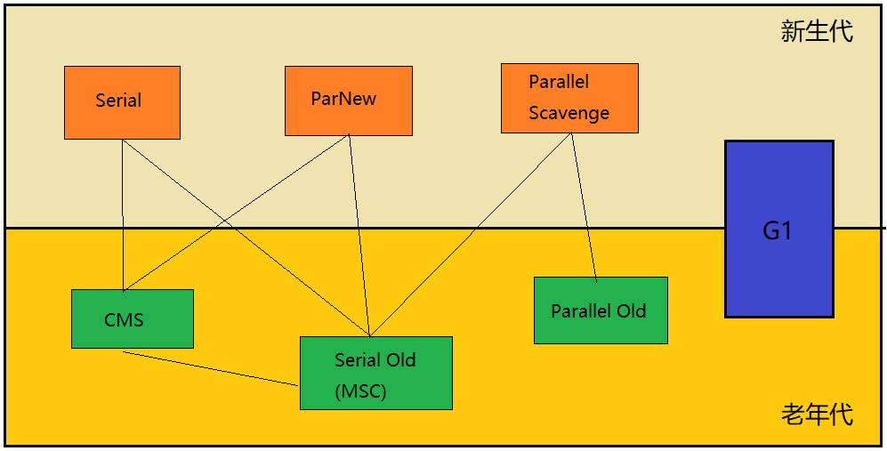

#### 年轻代垃圾收集器

Serial收集器（`-XX:+UseSerialGC`，复制算法）

+ 单线程收集，进行垃圾收集时，必须暂停所有工作线程
+ 简单高效，Client模式下默认的年轻代收集器

ParNew收集器（`-XX:+UseParNewGC`，复制算法）

+ 多线程收集，其余的行为、特点和Serial收集器一样
+ 单核执行效率不如Serial，在多核下执行才有优势

Parallel Scavenge收集器（`-XX:+UseParallelGC`，复制算法）

+ 吞吐量=运行用户代码时间/（运行用户代码时间+垃圾收集时间）

+ 比起关注用户线程停顿时间，更关注系统的吞吐量

+ 在多核下执行才有优势，Server模式下默认的年轻代收集器

  > 可以使用`-XX:+UseAdaptiveSizePolicy`，将调优任务由JVM自己调整。

#### 老年代垃圾收集器

Serial Old收集器（`-XX:+UseSerialOldGC`，标记-整理算法）

+ 单线程收集，进行垃圾收集时，必须暂停所有工作线程
+ 简单高效，Client模式下默认的老年代收集器

Parallel Old收集器（`-XX:+UseParallelOldGC`，标记-整理算法）

+ 多线程，吞吐量优先

CMS收集器（`-XX:+UseConcMarkSweepGC`，**标记-清除**算法）

+ 目的是获取最短回收停顿时间
+ 初始标记：stop-the-world
+ 并发标记：并发追溯标记，程序不会停顿
+ 并发预清理：查找执行并发标记阶段从年轻代晋升到老年代的对象
+ 重新标记：暂停虚拟机，扫描CMS堆中的剩余对象
+ 并发清理：清理垃圾对象，程序不会停顿
+ 并发重置：重置CMS收集器的数据结构
+ 缺点：因为采用的是清除算法，不会整理，因此会产生碎片，如果需要大量的连续空间，那么只能触发GC

G1收集器（`-XX:+UseG1GC`，复制+标记-整理算法）

+ 并行与并发：充分利用多CPU、多核来降低stop-the-world的影响
+ 分代收集：分代概念依然保留下来，对于年轻代和老年代采用不同的方式管理
+ 空间整合：因为使用的是标记-整理算法，因此不会产生碎片
+ 可预测的停顿：允许使用者指定在M毫秒的时间内，消耗GC的时间不得超过N毫秒
+ 将整个Java堆内存划分为多个大小相等的Region
+ 年轻代和老年代不再物理隔离，不需要连续

> 为什么CMS不能和Parallel Scavenge配合使用？
>
> 框架代码的兼容性问题。

### Object的finalize()方法的作用是否与C++的析构函数作用相同？

+ 与C++的析构函数不同，析构函数调用确定，在离开作用域后会被delete掉，而finalize不确定
+ JVM会将未被引用的对象放置到F-Queue队列中，并不会马上回收
+ 在放入队列后，会有低优先级的线程来回收，因为是低优先级，因此方法执行可能被终止
+ 可以在finalize方法中自救，重新将自己添加到GC ROOTS链上，但是因为方法的不确定性，所以一般没什么用

### Java中的强引用，软引用，弱引用，虚引用有什么用？

#### 强引用

+ 最普遍的引用：`Object obj=new Object()`
+ 抛出OutOfMemoryError终止程序也不会回收具有强引用的对象
+ 通过将对象设置为null来弱化引用，使其被回收

#### 软引用

+ 对象处在有用但非必须的状态
+ 只有当内存空间不足时，GC会回收该引用的对象的内存
+ 可以用来实现高速缓存

```java
String str=new String("abc");//强引用
SoftReference<String> softRef=new SoftReference<String>(str);//软引用
```

#### 弱引用

+ 非必须的对象，比软引用更弱一些
+ GC时会被回收
+ 被回收的概率也不大，因为GC线程优先级比较低
+ 适用于引用偶尔被使用且不影响垃圾收集的对象

```java
String str=new String("abc");
WeakReference<String> absWeakRef=new WeakReference<String>(str);
```

#### 虚引用

+ 不会决定对象的生命周期
+ 任何时候都可能被垃圾收集器回收
+ 跟踪对象被垃圾收集器回收的活动，起标记、哨兵作用
+ 必须和引用队列ReferenceQueue联合使用，当GC回收虚引用时，首先会将它放入与它关联的队列中，可以通过判断队列的状态来了解虚引用是否被GC回收

```java
String str=new String("abc");
ReferenceQueue queue=new ReferenceQueue();
PhantomReference ref=new PhantomReference(str, queue);
```

#### 引用队列

+ 无实际的存储结构，只保存head节点，链表的结构由内部节点的next域来维护。

+ 存储关联的且被GC的软引用，弱引用以及虚引用

+ 注意，存储的是这些引用对象，被引用的对象还是会被GC的

  > 如果不用引用队列，那么需要不断轮询弱引用等get方法来判断被引用对象是否被回收，而这并不适合PhantomReference，因为get始终返回null。

## Java多线程与并发

### 进程和线程的区别

进程：进程独占内存空间，保存各自运行状态，相互间不干扰且可以互相切换，为并发处理任务提供了可能。

线程：共享进程的内存资源，相互间切换更快捷，支持更细粒度的任务控制，使进程内的子任务得以并发执行。

进程是资源分配的最小单位，线程是CPU调度的最小单位。

+ 所有与进程相关的资源，都被记录在PCB中
+ 进程是抢占处理机的调度单位；线程属于某个进程，共享其资源
+ 线程只由堆栈寄存器、程序计数器和TCB（线程控制块）组成

> 总结：
>
> + 线程不能看做独立的应用，而进程可看做独立应用
> + 进程有独立的地址空间，相互不影响
> + 线程没有独立的地址空间，多线程共享同一地址空间，如果地址空间出现问题，那么所有的线程都将收到影响，因此多进程的程序比多线程程序健壮
> + 进程的切换比线程的切换开销大

### Java进程和线程的关系

+ 运行一个程序会产生一个进程，进程包含至少一个线程
+ 每个进程对应一个JVM实例，多个线程共享JVM里的堆
+ Java采用单线程编程模型，程序会自动创建主线程(main)
+ 主线程可以创建子线程，原则上要后于子线程完成执行

> 关于主线程与子线程的结束时间的关系：
>
> + Main线程是个非守护线程，不能设置成守护线程。
> + Main线程结束，其他线程一样可以正常运行
> + Main线程结束，其他线程也可以立刻结束，当且仅当这些子线程都是守护线程
> + JVM并不是只创建main一个线程，还有其他线程，例如GC线程是个守护线程。

### Thread中的start和run方法的区别

+ 调用start()方法会创建一个新的线程并启动
+ run()方法只是Thread的一个普通方法的调用

### Thread和Runnable是什么关系

Thread实现了Runnable的接口

### 如何给run方法传参

变量可以定义在runable里，然后通过runnable的构造方法传参，或者通过set方法传参。

### 如何实现处理线程的返回值

+ 主线程等待法，子线程将结果写在Runnable类的变量中，然后主线程轮询这个变量
+ 使用Thread类的join方法阻塞当前线程以等待子线程处理完毕
+ 通过Callable接口实现：通过FutureTask或线程池获取

### 线程的状态

共有六个状态：

+ 新建new：创建后尚未启动的线程的状态

+ 运行runnable：包含Running和Ready（等待被调度选中）

+ 无限期等待waiting：不会被分配CPU，需要显式被唤醒

  > 没有设置timeout的Object.wait方法
  >
  > 没有设置timeout的Thread.join方法
  >
  > LockSupport.park方法

+ 限期等待timed waiting：在一定时间后会由系统自动唤醒

  > Thread.sleep()
  >
  > 设置了timeout参数的Object.wait方法
  >
  > 设置了timeout参数的Thread.join方法
  >
  > LockSupport.parkNanos()方法
  >
  > LockSupport.parkUntil()方法

+ 阻塞blocked：等待获取排它锁

+ 结束terminated：已终止线程的状态，线程已经结束执行，一但被终止，那么无法再进行状态变更。

### sleep和wait的区别

+ sleep是Thread类的方法，wait是Object类中定义的方法
+ sleep方法可以在任何地方使用
+ wait方法只能在synchronized块中使用，因为wait方法会释放当前持有的监视器锁
+ thread.sleep只会让出cpu，不会导致锁行为的改变
+ wait不仅让出cpu，还会释放同步资源锁

### notify和notifyall的区别

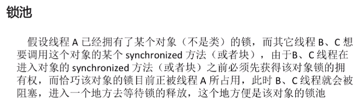

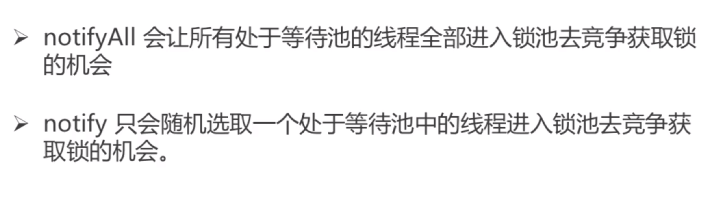

### yield

当调用`Thread.yield()`函数时，会给线程调度器一个当前线程愿意让出CPU使用的暗示，但是线程调度器可能会忽略这个暗示。

### 如何中断线程

#### 弃用的方法

+ 通过调用stop方法停止线程，但是这个方法已经被弃用，当A中断B，A无法得知B的具体情况，可能会中断B的清理工作，并且中断B会使B释放锁，可能造成数据不同步的问题
+ 调用suspend、resume方法，这些也被弃用了

#### 目前使用的方法

+ 调用interrupt()，通知线程中断
  + 如果线程处于被阻塞状态，那么线程将立即退出被阻塞状态，并抛出一个InterruptedException异常。
  + 如果线程处于正常活动状态，那么会将该线程的中断标志设置为true，被设置中断标志的线程将继续正常运行，不受影响。

### synchronized

#### 线程安全问题的诱因

+ 存在共享数据（临界资源）
+ 多条线程共同操作这些共享数据

#### 互斥锁的特性

+ 互斥性：同一时间只有一个线程持有某个对象锁
+ 可见性：对共享变量的修改，对后面获得锁的线程是可见的（最新的）

> synchronized锁的是对象。
>
> synchronized是可重入的。

#### 锁的分类

+ 对象锁
  + 同步代码块（`synchronized(this), synchronized(类实例对象)`），锁是小括号()中的实例对象
  + 同步非静态方法，锁是当前对象的实例对象
+ 类锁
  + 同步代码块（`synchronized(类.class)`），锁是小括号中的类对象
  + 同步静态方法，锁是当前对象的类对象

#### 对象锁和类锁的总结

+ 有线程访问对象的同步代码块时，另外的线程可以访问该对象的非同步代码块
+ 若锁住的是同一个对象，一个线程在访问对象的同步代码块时，另一个访问对象的同步代码块的线程会被阻塞
+ 若锁住的是同一个对象，一个线程在访问对象的同步方法时，另一个访问同步方法的线程会被阻塞
+ 同一个类的不同对象的对象锁互不干扰
+ 同一个类的不同对象使用类锁是同步的
+ 类锁和对象锁互不干扰

### synchronized低层实现原理

#### 实现synchronized的基础

+ Java对象头
+ Monitor

#### 对象在内存中的布局

+ 对象头
+ 实例数据
+ 对齐填充

#### 对象头

对象头包含两部分信息，一是Mark Word，用于存储对象自身的运行时数据、GC分代年龄、锁状态标志（轻量级锁、重量级锁(synchronized)）、线程持有的锁等；二是类型指针，指向对象的类元数据，根据这个指针来确定这个对象是哪个类的实例。

#### JDK6以后的优化

+ Adaptive Spinning
+ Lock Eliminate
+ Lock Coarsening
+ Lightweight Locking
+ Biased Locking

#### 自旋锁

+ 许多情况下，共享数据的锁定状态持续时间较短，切换线程不值得
+ 通过让线程执行忙循环等待锁的释放，不让出CPU
+ 缺点：若锁被其他线程长时间占用，会带来许多性能上的开销

#### 自适应自旋锁

+ 自旋的次数不再固定
+ 由前一次在同一个锁上的自旋时间及锁的拥有者的状态来决定

#### 锁消除

+ JIT编译时，对运行上下文进行扫描，取出不可能存在竞争的锁（比如StringBuffer是线程安全的，但如果只将它作为本地变量进行append操作，那么不可能由其他线程去操作它，因此JVM会消除它的锁）

> JIT（just-in-time compilation），及时编译，动态编译

#### 锁粗化

+ 通过扩大加锁的范围，避免反复加锁和解锁（例如在循环体中执行加锁操作，那么会被优化到循环体外部加锁）

#### synchronized的四种状态

无锁、偏向锁、轻量级锁、重量级锁。

锁膨胀方向：无锁->偏向锁->轻量级锁->重量级锁

+ 偏向锁：减少同一线程获取锁的代价
  + 大多数情况下，锁不存在多线程竞争，总是由同一线程多次获得
  + 核心思想：如果一个线程获得了锁，那么锁就进入偏向模式，此时Mark Word的结构也变为偏向锁结构，当该线程再次请求锁时，无需再做任何同步操作，即获取锁的过程只需要检查Mark Word的锁标记位为偏向锁以及当前线程Id等于Mark Word的ThreadID即可，这样就省去了大量有关锁申请的操作（CAS）。
  + 不适用于锁竞争比较激烈的多线程场合。
+ 轻量级锁
  + 轻量级锁是由偏向锁升级来的，偏向锁运行在一个线程进入同步快的情况下，当第二个线程加入锁争用的时候，偏向锁就会升级为轻量级锁。
  + 适应的场景：线程交替执行同步块
  + 若存在同一时间访问同一锁的情况，就会导致轻量级锁膨胀为重量级锁
+ 重量级锁
  + 线程竞争不使用自旋，不会消耗CPU
  + 缺点：线程阻塞，响应时间缓慢，在多线程下，频繁的获取释放锁，会带来巨大的性能消耗
  + 追求吞吐量，同步块或者同步方法执行时间较长的场景

> 锁的内存语义：
>
> 当线程释放锁时，Java内存模型会把该线程对应的本地内存中的共享变量刷新到主内存中；
>
> 当线程获取锁时，Java内存模型会把该线程对应的本地内存置为无效，从而使得被监视器保护的临界区代码必须从主内存中读取共享变量。

### Java内存模型JMM

#### JMM中的主内存

+ 存储Java实例对象
+ 包括成员变量、类信息、常量、静态变量等
+ 属于数据共享的区域，多线程并发操作时会引发线程安全问题

#### JMM中的工作内存

+ 存储当前方法的所有本地变量信息，本地变量对其他线程不可见
+ 字节码行号指示器、Native等方法信息
+ 属于线程私有数据区域，不存在线程安全问题

#### JMM与Java内存区域划分是不同的概念层次

+ JMM描述的是一组规则，围绕原子性、有序性、可见性展开
+ 相似点：存在共享区域和私有区域

#### 主内存与工作内存的数据存储类型以及操作方式归纳

+ 方法里的基本数据类型本地变量将直接存储在工作内存的栈帧结构中
+ 引用类型的本地变量：引用存储在工作内存中，实例存储在主内存中
+ 成员变量、static变量、类信息均会被存储在主内存中
+ 主内存共享的方式是线程各拷贝一份数据到工作内存，操作完成后刷新回主内存

#### 指令重排序需要满足的条件

+ 在单线程环境下不能改变程序运行的结果

+ 存在数据依赖关系的不允许重排序

  > 无法通过happens-before原则推导出来的，才能进行指令的重排序。

#### volatile

+ 保证被volatile修饰的共享变量对所有线程总是可见的
+ 禁止指令重排序优化
+ 可见性，但是不保证原子性

#### volatile变量为何立即可见？

当写一个volatile变量时，JMM会把该线程对应的工作内存中的共享变量值刷新到主内存中；

当读取一个volatile变量时，JMM会把该线程对应的工作内存置为无效。

#### volatile如何禁止重排优化？

内存屏障（一个CPU指令）：

+ 保证特定操作的执行顺序
+ 保证某些变量的内存可见性

通过插入内存屏障指令禁止在内存屏障前后的指令执行重排序优化。

强制刷出各种CPU的缓存数据，因此任何CPU上的线程都能读取到这些数据的最新版本。

#### volatile和synchronized的区别

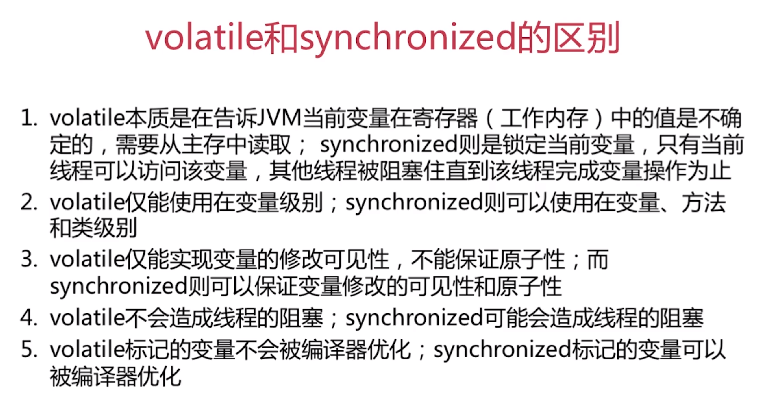

### CAS(compare and swap)

+ 属于乐观锁机制，lock-free
+ CAS操作失败时由开发者决定是继续尝试，还是执行别的操作
+ Unsafe类虽提供CAS服务，但因能够操纵任意内存地址读写而有隐患
+ Java9以后，可以使用Variable Handle API来替代Unsafe

缺点：

+ 若循环时间长，则开销很大（因为自旋+CAS是通用的做法）
+ 只能保证一个共享变量的原子操作
+ ABA问题（解决：AtomicStampedReference，通过控制版本来解决ABA问题）

### Java线程池

+ newFixedThreadPool(int nThreads)

  + 指定工作线程数量的线程池

+ newCachedThreadPool()

  + 处理大量短时间工作任务的线程池
  + 试图缓存线程并重用，当无缓存线程可用时，就会创建新的工作线程
  + 如果线程闲置的时间超过阈值，则会被终止并移出缓存
  + 系统长时间闲置的时候，不会消耗什么资源

+ newSingleThreadExecutor()

  + 创建唯一的工作线程来执行任务，如果线程异常结束，会有另一个线程取代它
  + 能保证顺序性

+ newSingleThreadScheduledExecutor()与newScheduledThreadPool(int corePoolSize)

  + 定时或者周期性的工作调度，两者的区别在于单一工作线程还是多个线程

+ newWorkStealingPool()

  + 内部会构建ForkJoinPool，利用working-stealing算法，并行地处理任务，不保证处理顺序

    > working-stealing算法：完成任务的空闲的线程从其他队列里窃取任务来执行

#### Fork/Join框架

+ 把大任务分割成若干小任务并行执行，最终汇总每个小任务结果后得到大任务结果的框架

#### 为什么要使用线程池？

+ 降低资源消耗（创建、销毁线程）
+ 提高线程的可管理性

#### 线程池的大小如何选定

+ CPU密集型（计算密集型）：线程数=按照核数或者核数+1设定
+ I/O密集型：线程数=CPU核数*（1+平均等待时间/平均工作时间）

## Java异常

### Error和Excepion的区别

+ Error：程序无法处理的系统错误，编译器不做检查
+ Exception：程序可以处理的异常，捕获后可能恢复

### Exception

+ RuntimeException：不可预知，程序应该自行避免（如空指针异常）
+ 非RuntimeException：可预知的，从编译器校验的异常（try catch或者将throw语句添加到签名上）

### 常见Error以及Exception

+ RuntimeException
  + NullPointerException：空指针引用异常
  + ClassCastException：类型强制转换异常
  + IllegalArgumentException：传递非法参数异常
  + IndexOutOfBoundsException：下标越界异常
  + NumberFormatException：数字格式异常
+ 非RuntimeException
  + ClassNotFoundException：找不到指定class的异常
  + IOException：IO操作异常
+ Error
  + NoClassDefFoundError：找不到class定义的异常
    + 类依赖的class或者jar不存在
    + 类文件存在，但是存在不同的域中
    + 大小写问题，javac编译的时候是无视大小写的，很有可能编译出来的class文件就与想要的不一样
  + StackOverflowError：深递归导致栈被耗尽而抛出的异常
  + OutOfMemoryError：内存溢出异常

### Java的异常处理机制

+ 抛出异常：创建异常对象，交由运行时系统处理
+ 捕获异常：寻找合适的异常处理器处理异常，否则终止运行

### Java异常的处理原则

+ 具体明确：抛出的异常应能通过异常类名和message准确说明异常的类型和产生异常的原因
+ 提早抛出：应尽可能早的发现并抛出异常，便于精确定位问题
+ 延迟捕获：异常的捕获和处理应尽可能延迟，让掌握更多信息的作用域来处理异常

### 高效主流的异常处理框架

+ 设计一个通用的继承自RuntimeException的异常来统一处理
+ 其余异常都统一转为上述异常
+ 在catch之后，抛出上述异常的子类，并提供足以定位的信息
+ 由前端接受AppException做统一处理

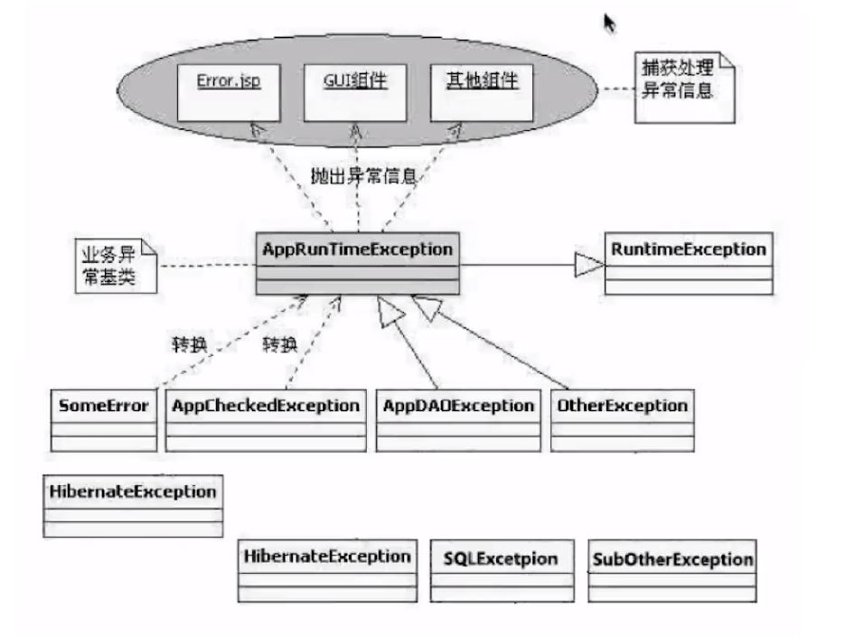

### Java异常处理消耗性能的地方

+ try-catche块影响JVM优化
+ 异常对象实例需要保存栈快照等信息，开销较大

## Java集合框架

考点：

+ 数组和链表的区别
+ 链表的操作，如反转、链表环路检测、双向链表、循环链表相关操作
+ 队列、栈的应用
+ 二叉树的遍历方式及其递归和非递归的实现
+ 红黑树的旋转
+ 内部排序：递归排序、冒泡、快排、选择、插入
+ 外部排序：应掌握如何利用有限的内存配合海量的外部存储来处理超大的数据集
+ 哪些排序是不稳定的
+ 不同的数据集，各种排序最好或是最差的情况

#### HashMap、HashTable、ConcurrentHashMap

+ HashMap：
  + java8以前：数组+链表
  + java8以后：数组+链表+红黑树
  + put方法逻辑：
    + 若HashMap未被初始化，则进行初始化操作
    + 对Key求hash，根据hash值计算下标
    + 若未发生碰撞，则直接放入桶中
    + 若发生碰撞，则以链表的方式链接到后面
    + 若链表长度超过阈值，且HashMap元素超过最低树化容量，则将链表转成红黑树
    + 若节点已经存在，则用新值替换旧值
    + 若桶满了，需要resize扩容
  + 如何有效减少碰撞：
    + 扰动函数（魔数）
  + 扩容问题：
    + 多线程环境下，调整大小存在竞争，容易造成死锁
    + rehashing是耗时的过程
+ Hashtable
  + 早期Java类库提供的哈希表的实现
  + 线程安全：涉及到修改Hashtable的方法，使用synchronized修饰
  + 串行化的方式运行，性能较差
+ 早期的ConcurrentHashMap
  + 分段锁
  + 数组+链表
+ 当前的ConcurrentHashMap
  + CAS+synchronized使锁更细化
  + 数组+链表+红黑树
  + put方法逻辑
    + 判断Node[] 数组是否初始化，没有则进行初始化操作
    + 通过hash定位数组的索引坐标，是否有Node节点，如果没有则CAS添加，添加失败则进入下次循环
    + 检查到内部正在扩容，就帮助它一块扩容
    + 如果f!=null，则使用synchronized锁住f元素（链表/红黑二叉树的头元素）
      + 如果是Node（链表结构）则执行链表的添加操作
      + 如果是TreeNode（树型结构）则执行树添加操作
    + 判断链表长度已经达到临界值8（默认值），如果超过，就将链表转换为红黑树
  + size方法和mappingocunt方法是否准确？

> 三者的区别：
>
> + HashMap线程不安全，数组+链表+红黑树
> + Hashtable线程安全，锁住整个对象，数组+链表
> + ConcurrentHashMap线程安全，CAS+同步锁，数组+链表+红黑树
> + HashMap的key、value均可为null，而其他的两个类不支持

### juc工具

+ CountDownLatch：让主线程等待一组事件发生后继续执行
+ CyclicBarrier：阻塞当前线程，等待其他线程
+ Semaphore：控制某个资源可被同时访问的线程个数
+ Exchanger：两个线程到达同步点后，相互交换数据
+ BlockingQueue：提供可阻塞的入队和出队操作
  + 主要用于生产者-消费者模式，在多线程场景时生产者线程在队列尾部添加元素，而消费者线程则在队列头部消费元素，通过这种方式能够达到将任务的生产和消费进行隔离的目的
  + ArrayBlockingQueue：一个由数组结构组成的有界阻塞队列
  + LinkedBlockingQueue：一个由链表结构组成的有界/无界阻塞队列
  + PriorityBlockingQueue：支持优先级排序的无界阻塞队列
  + DelayQueue：使用优先级队列实现的无界阻塞队列
  + SynchronousQueue：不存储元素的阻塞队列
  + LinkedTransferQueue：由链表结构组成的无界阻塞队列
  + LinkedBlockingDequeue：由链表结构组成的双向阻塞队列

### jdk7和jdk8的扩容条件有什么区别？

jdk7触发扩容需要满足两个条件：

+ 当前元素的个数大于等于阈值（例如初始化桶数为16，阈值为0.75，那么达到16*0.75=12时满足该条件）
+ 存放新值的时候当前存放数据发生hash碰撞

而jdk8只需要满足一个条件：

当前存放新值的时候已有元素个数大于等于阈值。

### 堆、栈、常量池

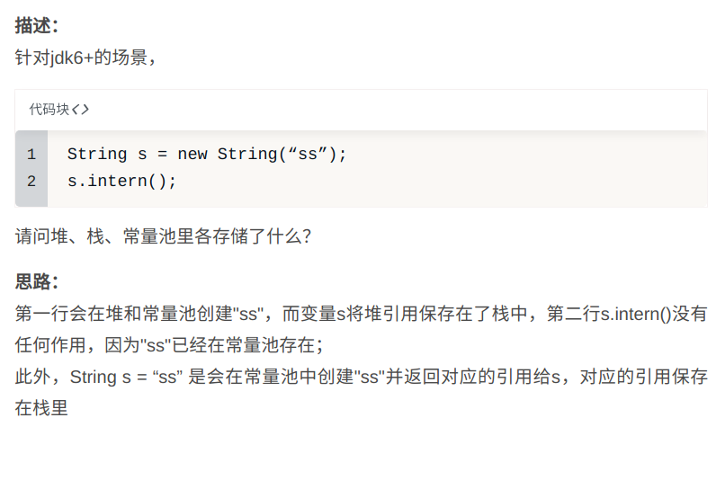

## 框架知识考点

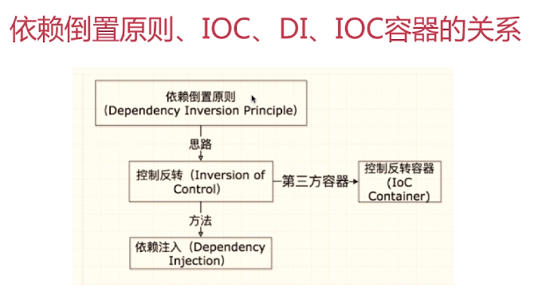

### IOC容器的优势

+ 避免在各处使用new来创建类，并且可以做到统一维护
+ 创建实例的时候不需要了解其中的细节

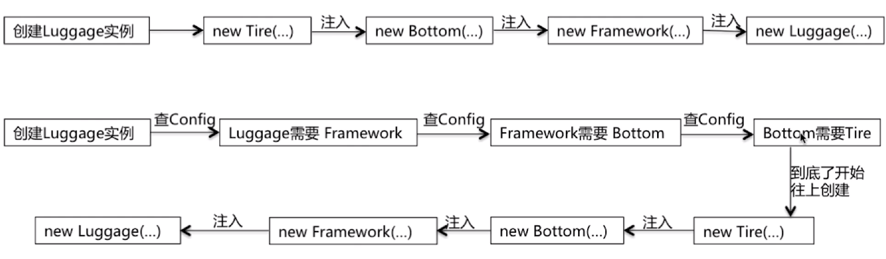

上面的图中，第一条路线是传统的做法，第二条路线是IOC的做法。

### Spring IOC支持的功能

+ 依赖注入
+ 依赖检查
+ 自动装配
+ 支持集合
+ 指定初始化方法和销毁方法
+ 支持回调方法

### BeanFactory

+ 提供IOC的配置机制
+ 包含Bean的各种定义，便于实例化Bean
+ 建立Bean之间的依赖关系
+ Bean生命周期的控制

### BeanFactory与ApplicationContex的比较

+ BeanFactory是Spring框架的基础设施，面向Spring
+ ApplicationContext面向使用Spring框架的开发者

### ApplicationContext的功能（继承自多个接口）

+ BeanFactory：能够管理、装配Bean
+ ResourcePatternResolver：能够加载资源文件
+ MessageSource：能够实现国际化等功能
+ ApplicatoinEventPublisher：能够注册监听器，实现监听机制

### AOP的实现：JdkProxy和Cglib

+ 由AopProxyFactory根据AdvisedSupport对象的配置来决定
+ 默认策略如果目标类是接口，则用JDKProxy来实现，否则用后者
+ JDKProxy的核心：InvocationHandler接口和Proxy类
+ Cglib：以继承的方式动态生成目标类的代理
+ JDKProxy：通过Java的内部反射机制实现
+ Cglib：借助ASM实现
+ 反射机制在生成类的过程中比较高效
+ ASM在生成类之后的执行过程中比较高效

