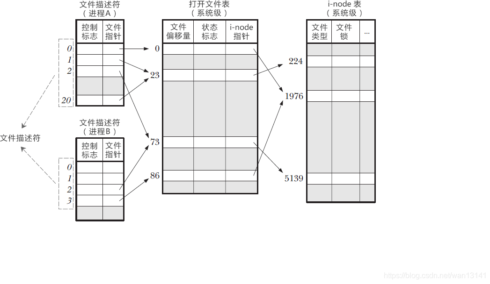
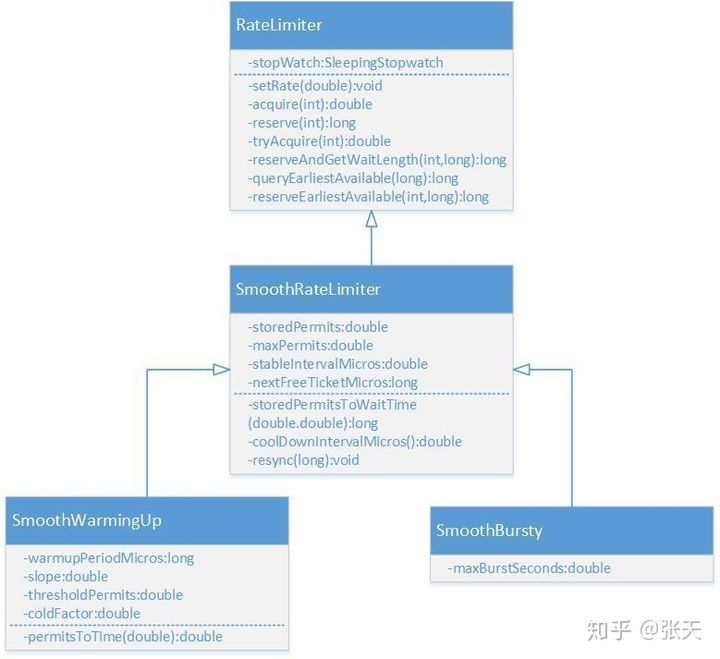
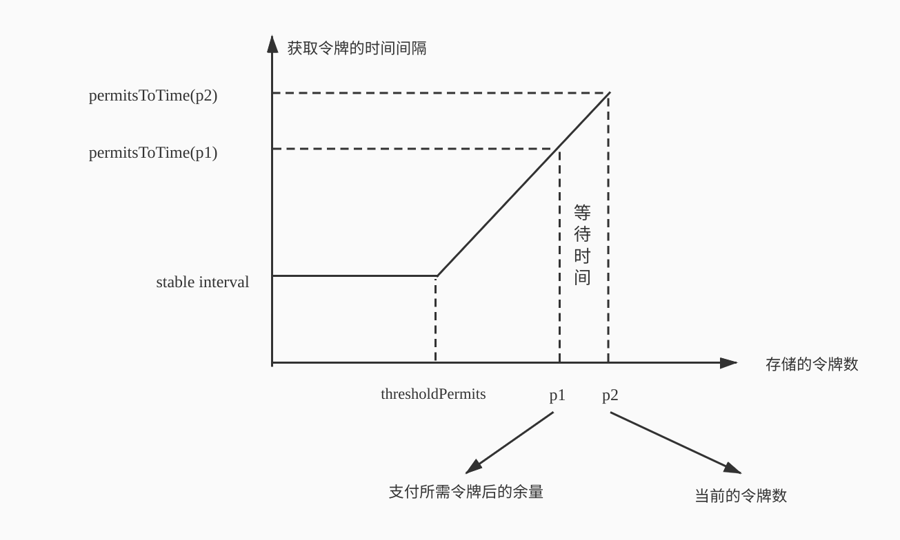

# 其他

## Linux文件描述符

一个 Linux 进程启动后，会在内核空间中创建一个 PCB 控制块，PCB 内部有一个文件描述符表（File descriptor table），记录着当前进程所有可用的文件描述符，也即当前进程所有打开的文件。

除此之外还有打开文件表，i-node表。文件描述符表每个进程都有一个，打开文件表和 i-node 表整个系统只有一个，它们三者之间的关系如下图所示。



通过文件描述符，可以找到文件指针，从而进入打开文件表。该表存储了以下信息：

- 文件偏移量，也就是文件内部指针偏移量。调用 read() 或者 write() 函数时，文件偏移量会自动更新，当然也可以使用 lseek() 直接修改。
- 状态标志，比如只读模式、读写模式、追加模式、覆盖模式等。
- i-node 表指针。

然而，要想真正读写文件，还得通过打开文件表的 i-node 指针进入 i-node 表，该表包含了诸如以下的信息：

- 文件类型，例如常规文件、套接字或 FIFO。
- 文件大小。
- 时间戳，比如创建时间、更新时间。
- 文件锁。

### 进程、fd和文件之间的关系

- 同一个进程的不同文件描述符可以指向同一个文件；
- 不同进程可以拥有相同的文件描述符；
- 不同进程的同一个文件描述符可以指向不同的文件（一般也是这样，除了 0、1、2 这三个特殊的文件）；
- 不同进程的不同文件描述符也可以指向同一个文件。

## Guava RateLimiter

限流、缓存和降级是保护高并发系统的三把利器。限流在很多场景中用来限制并发和请求量，比如说秒杀抢购，保护自身系统和下游系统不被巨型流量冲垮等。

限流的目的是通过对并发访问/请求进行限速或者一个时间窗口内的的请求进行限速来保护系统，一旦达到限制速率则可以拒绝服务或进行流量整形。

常用的限流方式和场景有：限制总并发数（比如数据库连接池、线程池）、限制瞬时并发数（如nginx的limit*conn模块，用来限制瞬时并发连接数，Java的Semaphore也可以实现）、限制时间窗口内的平均速率（如Guava的RateLimiter、nginx的limit*req模块，限制每秒的平均速率）；其他还有如限制远程接口调用速率、限制MQ的消费速率。另外还可以根据网络连接数、网络流量、CPU或内存负载等来限流。

比如说，我们需要限制方法被调用的并发数不能超过100（同一时间并发数），则我们可以用信号量 `Semaphore`实现。可如果我们要限制方法在一段时间内平均被调用次数不超过100，则需要使用 `RateLimiter`。

### 限流的基础算法

#### 漏桶算法

漏桶算法的实现往往依赖于队列，请求到达如果队列未满则直接放入队列，然后有一个处理器按照固定频率从队列头取出请求进行处理。如果请求量大，则会导致队列满，那么新来的请求就会被抛弃。

#### 令牌桶算法

令牌桶算法则是一个存放固定容量令牌的桶，按照固定速率往桶里添加令牌。桶中存放的令牌数有最大上限，超出之后就被丢弃或者拒绝。当流量或者网络请求到达时，每个请求都要获取一个令牌，如果能够获取到，则直接处理，并且令牌桶删除一个令牌。如果获取不同，该请求就要被限流，要么直接丢弃，要么在缓冲区等待。

#### 令牌桶和漏桶对比

- 令牌桶是按照固定速率往桶中添加令牌，请求是否被处理需要看桶中令牌是否足够，当令牌数减为零时则拒绝新的请求；漏桶则是按照常量固定速率流出请求，流入请求速率任意，当流入的请求数累积到漏桶容量时，则新流入的请求被拒绝；
- 令牌桶限制的是平均流入速率，允许突发请求，只要有令牌就可以处理，支持一次拿3个令牌，4个令牌；漏桶限制的是常量流出速率，即流出速率是一个固定常量值，比如都是1的速率流出，而不能一次是1，下次又是2，从而平滑突发流入速率；
- 令牌桶允许一定程度的突发，而漏桶主要目的是平滑流出速率；

### Guava RateLimiter

Guava的 `RateLimiter`提供了令牌桶算法实现：平滑突发限流(SmoothBursty)和平滑预热限流(SmoothWarmingUp)实现。



`RateLimiter`的类图如上所示，其中 `RateLimiter`是入口类，它提供了两套工厂方法来创建出两个子类。

```java
// RateLimiter提供了两个工厂方法，最终会调用下面两个函数，生成RateLimiter的两个子类。
static RateLimiter create(SleepingStopwatch stopwatch, double permitsPerSecond) {
 RateLimiter rateLimiter = new SmoothBursty(stopwatch, 1.0 /* maxBurstSeconds */);
    rateLimiter.setRate(permitsPerSecond);
 return rateLimiter;
}
static RateLimiter create(
 SleepingStopwatch stopwatch, double permitsPerSecond, long warmupPeriod, TimeUnit unit,
 double coldFactor) {
 RateLimiter rateLimiter = new SmoothWarmingUp(stopwatch, warmupPeriod, unit, coldFactor);
    rateLimiter.setRate(permitsPerSecond);
 return rateLimiter;
}
```

#### 平滑突发限流

使用 `RateLimiter`的静态方法创建一个限流器，设置每秒放置的令牌数为5个。返回的RateLimiter对象可以保证1秒内不会给超过5个令牌，并且以固定速率进行放置，达到平滑输出的效果。

```java
public void testSmoothBursty() {
 RateLimiter r = RateLimiter.create(5);
 while (true) {
 System.out.println("get 1 tokens: " + r.acquire() + "s");
 }
 /**
     * output: 基本上都是0.2s执行一次，符合一秒发放5个令牌的设定。
     * get 1 tokens: 0.0s 
     * get 1 tokens: 0.182014s
     * get 1 tokens: 0.188464s
     * get 1 tokens: 0.198072s
     * get 1 tokens: 0.196048s
     * get 1 tokens: 0.197538s
     * get 1 tokens: 0.196049s
     */
}
```

`RateLimiter`使用令牌桶算法，会进行令牌的累积，如果获取令牌的频率比较低，则不会导致等待，直接获取令牌。

```java
public void testSmoothBursty2() {
 RateLimiter r = RateLimiter.create(2);
 while (true)
 {
    System.out.println("get 1 tokens: " + r.acquire(1) + "s");
 try {
    Thread.sleep(2000);
 } catch (Exception e) {}
 System.out.println("get 1 tokens: " + r.acquire(1) + "s");
 System.out.println("get 1 tokens: " + r.acquire(1) + "s");
 System.out.println("get 1 tokens: " + r.acquire(1) + "s");
 System.out.println("end");
 /**
       * output:
       * get 1 tokens: 0.0s
       * get 1 tokens: 0.0s
       * get 1 tokens: 0.0s
       * get 1 tokens: 0.0s
       * end
       * get 1 tokens: 0.499796s
       * get 1 tokens: 0.0s
       * get 1 tokens: 0.0s
       * get 1 tokens: 0.0s
       */
 }
}
```

`RateLimiter`由于会累积令牌，所以可以应对突发流量。在下面代码中，有一个请求会直接请求5个令牌，但是由于此时令牌桶中有累积的令牌，足以快速响应。 `RateLimiter`在没有足够令牌发放时，采用滞后处理的方式，也就是前一个请求获取令牌所需等待的时间由下一次请求来承受，也就是代替前一个请求进行等待。

```java
public void testSmoothBursty3() {
 RateLimiter r = RateLimiter.create(5);
 while (true)
 {
    System.out.println("get 5 tokens: " + r.acquire(5) + "s");
    System.out.println("get 1 tokens: " + r.acquire(1) + "s");
    System.out.println("get 1 tokens: " + r.acquire(1) + "s");
    System.out.println("get 1 tokens: " + r.acquire(1) + "s");
    System.out.println("end");
 /**
       * output:
       * get 5 tokens: 0.0s
       * get 1 tokens: 0.996766s 滞后效应，需要替前一个请求进行等待
       * get 1 tokens: 0.194007s
       * get 1 tokens: 0.196267s
       * end
       * get 5 tokens: 0.195756s
       * get 1 tokens: 0.995625s 滞后效应，需要替前一个请求进行等待
       * get 1 tokens: 0.194603s
       * get 1 tokens: 0.196866s
       */
 }
}
```

#### 平滑预热限流

`RateLimiter`的 `SmoothWarmingUp`是带有预热期的平滑限流，它启动后会有一段预热期，逐步将分发频率提升到配置的速率。 比如下面代码中的例子，创建一个平均分发令牌速率为2，预热期为3分钟。由于设置了预热时间是3秒，令牌桶一开始并不会0.5秒发一个令牌，而是形成一个平滑线性下降的坡度，频率越来越高，在3秒钟之内达到原本设置的频率，以后就以固定的频率输出。这种功能适合系统刚启动需要一点时间来“热身”的场景。

```java
public void testSmoothwarmingUp() {
 RateLimiter r = RateLimiter.create(2, 3, TimeUnit.SECONDS);
 while (true)
 {
   System.out.println("get 1 tokens: " + r.acquire(1) + "s");
   System.out.println("get 1 tokens: " + r.acquire(1) + "s");
   System.out.println("get 1 tokens: " + r.acquire(1) + "s");
   System.out.println("get 1 tokens: " + r.acquire(1) + "s");
   System.out.println("end");
 /**
       * output:
       * get 1 tokens: 0.0s
       * get 1 tokens: 1.329289s
       * get 1 tokens: 0.994375s
       * get 1 tokens: 0.662888s  上边三次获取的时间相加正好为3秒
       * end
       * get 1 tokens: 0.49764s  正常速率0.5秒一个令牌
       * get 1 tokens: 0.497828s
       * get 1 tokens: 0.49449s
       * get 1 tokens: 0.497522s
       */
 }
}
```

### 原理

下面是重要的成员变量：

```java
//SmoothRateLimiter.java
//当前存储令牌数
double storedPermits;
//最大存储令牌数
double maxPermits;
//添加令牌时间间隔
double stableIntervalMicros;
/**
 * 下一次请求可以获取令牌的起始时间
 * 由于RateLimiter允许预消费，上次请求预消费令牌后
 * 下次请求需要等待相应的时间到nextFreeTicketMicros时刻才可以获取令牌
 */
private long nextFreeTicketMicros = 0L;
```

#### 平滑突发限流

根据`nextFreeTicketMicros`与当前时间进行比较，如果当前时间更早，那么需要承担上次请求的预支付的费用，即进行等待，如果当前时间更晚，那么无论当前令牌数够不够，因为可以预支付，因此无需等待，预支付的费用保存到`nextFreeTicketMicro`中，由下一个请求支付。

#### 平滑预热限流

`SmoothWarmingUp`实现预热缓冲的关键在于其分发令牌的速率会随时间和令牌数而改变，速率会先慢后快。表现形式如下图所示，令牌刷新的时间间隔由长逐渐变短。等存储令牌数从maxPermits到达thresholdPermits时，发放令牌的时间价格也由coldInterval降低到了正常的stableInterval。

注意，当存储的令牌数在thresholdPermits之下，直接按照stableIntervel的速率发放令牌；如果存储的令牌数在thresholdPermits之上，那么会用梯形的计算公式。（这里有一点问题，应该是当到达指定的时间后，不管存储的令牌数量，都会按照固定的速率发放，这个逻辑可能在permitsToTime中体现了）



```java
// SmoothWarmingUp，等待时间就是计算上图中梯形或者正方形的面积。
long storedPermitsToWaitTime(double storedPermits, double permitsToTake) {
 /**
    * 当前permits超出阈值的部分
    */
 double availablePermitsAboveThreshold = storedPermits - thresholdPermits;
 long micros = 0;
 /**
    * 如果当前存储的令牌数超出thresholdPermits
    */
 if (availablePermitsAboveThreshold > 0.0) {
 /**
     * 在阈值右侧并且需要被消耗的令牌数量
     */
 double permitsAboveThresholdToTake = min(availablePermitsAboveThreshold, permitsToTake);

 /**
        * 梯形的面积
        *
        * 高 * (顶 * 底) / 2
        *
        * 高是 permitsAboveThresholdToTake 也就是右侧需要消费的令牌数
        * 底 较长 permitsToTime(availablePermitsAboveThreshold)
        * 顶 较短 permitsToTime(availablePermitsAboveThreshold - permitsAboveThresholdToTake)
        */
    micros = (long) (permitsAboveThresholdToTake
 * (permitsToTime(availablePermitsAboveThreshold)
 + permitsToTime(availablePermitsAboveThreshold - permitsAboveThresholdToTake)) / 2.0);
 /**
        * 减去已经获取的在阈值右侧的令牌数
        */
    permitsToTake -= permitsAboveThresholdToTake;
 }
 /**
    * 平稳时期的面积，正好是长乘宽
    */
    micros += (stableIntervalMicros * permitsToTake);
 return micros;
}

double coolDownIntervalMicros() {
 /**
    * 每秒增加的令牌数为 warmup时间/maxPermits. 这样的话，在warmuptime时间内，增加的令牌数量
    * 为 maxPermits
    */
 return warmupPeriodMicros / maxPermits;
}
```