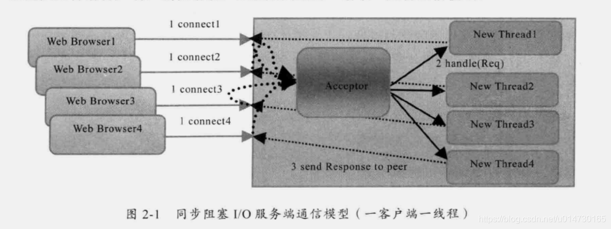
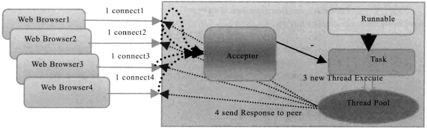
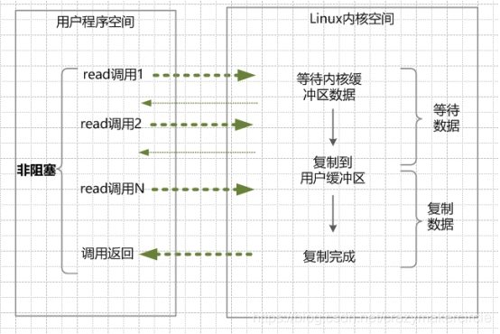
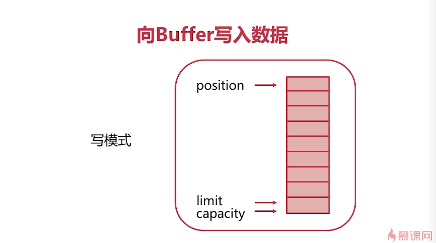

# 网络编程

## 同步、非同步、阻塞、非阻塞

同步、非同步指的是通信机制。

所谓同步，就是在发出一个*调用*时，在没有得到结果之前，该*调用*就不返回。但是一旦调用返回，就得到返回值了。

而异步则是相反，***调用\*在发出之后，这个调用就直接返回了，所以没有返回结果**。

换句话说，当一个异步过程调用发出后，调用者不会立刻得到结果。而是在*调用*发出后，*被调用者*通过状态、通知来通知调用者，或通过回调函数处理这个调用。

> 对于同步有另一个解释：
>
> 同步IO，是一种用户空间与内核空间的调用发起方式。同步IO是指用户空间线程是主动发起IO请求的一方，内核空间是被动接受方。异步IO则反过来，是指内核kernel是主动发起IO请求的一方，用户线程是被动接受方。
>
> 同步阻塞很好理解。
>
> 对于同步非阻塞，用户发出请求后，请求立即返回，用户线程需要不断地轮询数据是否已经准备好，但是在轮询之间的时间段可以执行别的任务。
>
> 对于异步非阻塞，用户发出请求后，用户线程不需要自己轮询，可以执行其他任务，通过内核空间主动通知自己数据是否已经准备完成。

阻塞和非阻塞关注的是**程序在等待调用结果（消息，返回值）时的状态.**

阻塞调用是指调用结果返回之前，当前线程会被挂起。调用线程只有在得到结果之后才会返回。

非阻塞调用指在不能立刻得到结果之前，该调用不会阻塞当前线程。

> 同步、非同步、阻塞、非阻塞之间可以两两组合，例如存在同步非阻塞、异步阻塞等方式！

## 主要的IO模型

服务器端编程经常需要构造高性能的IO模型，常见的IO模型以下几种：

+ 同步阻塞IO（Blocking IO）
+ 伪异步IO模型：
  + 就是BIO+线程池
+ 同步非阻塞IO（Non-blocking IO）：
  + 非阻塞IO，指的是用户程序不需要等待内核IO操作完成后，内核立即返回给用户一个状态值，用户空间无需等到内核的IO操作彻底完成，可以立即返回用户空间，执行用户的操作，处于非阻塞的状态。

## BIO



早期的jdk中，采用BIO通信模式。通常有一个acceptor(消费者) 去负责监听客户端的连接，它接收到客户端的连接请求之后为每个客户端创建一个线程进行链路处理，处理完成之后，线程销毁。从其通信结构图中，我们可以清晰的看到，一个客户端连接，对应赢处理线程。他们之间的对应关系是 1:1。

由于客户端连接和服务端的处理之间的对应关系是1:1，如果遇到任务比较大，处理比较慢。或者并发量比较大的情况下，系统会创建大量的线程。从而导致服务器线程暴增，性能急剧下降，甚至宕机。

### BIO中的阻塞

+ ServerSocket.accept()
+ InputStream.read()，OutputStream.write()
+ 无法在同一个线程里处理多个Stream I/O

## 伪异步IO模型

为了解决同步阻塞I/O面临的一个链路需要一个线程处理的问题，后来有人对它的线程模型进行了优化，后端通过一个线程池来处理多个客户端的请求接入，形成客户端个数M：线程池最大线程数N的比例关系，其中M可以远远大于N，通过线程池可以灵活的调配线程资源，设置线程的最大值，防止由于海量并发接入导致线程耗尽。

采用线程池和任务队列可以实现一种叫做伪异步的I/O通信框架，它的模型图如下所示：



当有新的客户端接入的时候，将客户端的Socket封装成一个Task（该任务实现java.lang.Runnable接口）投递到后端的线程池中进行处理，JDK的线程池维护一个消息队列和N个活跃线程对消息队列中的任务进行处理。由于线程池可以设置消息队列的大小和最大线程数。因此，它的资源占用是可控的，无论多少个客户端并发访问，都不会导致资源的耗尽和宕机。

## 同步非阻塞NIO（None Blocking IO）

在linux系统下，可以通过设置socket使其变为non-blocking。NIO 模型中应用程序在一旦开始IO系统调用，会出现以下两种情况：

（1）在内核缓冲区没有数据的情况下，系统调用会立即返回，返回一个调用失败的信息。

（2）在内核缓冲区有数据的情况下，是阻塞的，直到数据从内核缓冲复制到用户进程缓冲。复制完成后，系统调用返回成功，应用进程开始处理用户空间的缓存数据。



举个栗子。发起一个non-blocking socket的read读操作系统调用，流程是这个样子：

（1）在内核数据没有准备好的阶段，用户线程发起IO请求时，立即返回。用户线程需要不断地发起IO系统调用。

（2）内核数据到达后，用户线程发起系统调用，用户线程阻塞。内核开始复制数据。它就会将数据从kernel内核缓冲区，拷贝到用户缓冲区（用户内存），然后kernel返回结果。

（3）用户线程才解除block的状态，重新运行起来。经过多次的尝试，用户线程终于真正读取到数据，继续执行。

### 特点

应用程序的线程需要不断的进行 I/O 系统调用，轮询数据是否已经准备好，如果没有准备好，继续轮询，直到完成系统调用为止。

### 优点

每次发起的 IO 系统调用，在内核的等待数据过程中可以立即返回。用户线程不会阻塞，实时性较好。

### 缺点

需要不断的重复发起IO系统调用，这种不断的轮询，将会不断地询问内核，这将占用大量的 CPU 时间，系统资源利用率较低。

总之，NIO模型在高并发场景下，也是不可用的。一般 Web 服务器不使用这种 IO 模型。一般很少直接使用这种模型，而是在其他IO模型中使用非阻塞IO这一特性。java的实际开发中，也不会涉及这种IO模型。

再次说明，Java NIO（New IO） 不是IO模型中的NIO模型，而是另外的一种模型，叫做IO多路复用模型（ IO multiplexing ）。

## IO多路复用模型(I/O multiplexing）

如何避免同步非阻塞NIO模型中轮询等待的问题呢？这就是IO多路复用模型。

IO多路复用模型，就是通过一种新的系统调用，一个进程可以监视多个文件描述符，一旦某个描述符就绪（一般是内核缓冲区可读/可写），内核kernel能够通知程序进行相应的IO系统调用。

在这种模式中，首先不是进行read系统调动，而是进行select/epoll系统调用。当然，这里有一个前提，需要将目标网络连接，提前注册到select/epoll的可查询socket列表中。然后，才可以开启整个的IO多路复用模型的读流程。

（1）进行select/epoll系统调用，查询可以读的连接。kernel会查询所有select的可查询socket列表，当任何一个socket中的数据准备好了，select就会返回。

当用户进程调用了select，那么整个线程会被block（阻塞掉）。

（2）用户线程获得了目标连接后，发起read系统调用，用户线程阻塞。内核开始复制数据。它就会将数据从kernel内核缓冲区，拷贝到用户缓冲区（用户内存），然后kernel返回结果。

（3）用户线程才解除block的状态，用户线程终于真正读取到数据，继续执行。

目前支持IO多路复用的系统调用，有 select，epoll等等。select系统调用，是目前几乎在所有的操作系统上都有支持，具有良好跨平台特性。epoll是在linux 2.6内核中提出的，是select系统调用的linux增强版本。

IO多路复用模型的基本原理就是select/epoll系统调用，单个线程不断的轮询select/epoll系统调用所负责的成百上千的socket连接，当某个或者某些socket网络连接有数据到达了，就返回这些可以读写的连接。因此，好处也就显而易见了——通过一次select/epoll系统调用，就查询到到可以读写的一个甚至是成百上千的网络连接。

## 异步IO模型（asynchronous IO）

如何进一步提升效率，解除最后一点阻塞呢？这就是异步IO模型，全称asynchronous I/O，简称为AIO。

AIO的基本流程是：用户线程通过系统调用，告知kernel内核启动某个IO操作，用户线程返回。kernel内核在整个IO操作（包括数据准备、数据复制）完成后，通知用户程序，用户执行后续的业务操作。

kernel的数据准备是将数据从网络物理设备（网卡）读取到内核缓冲区；kernel的数据复制是将数据从内核缓冲区拷贝到用户程序空间的缓冲区。

（1）当用户线程调用了read系统调用，立刻就可以开始去做其它的事，用户线程不阻塞。

（2）内核（kernel）就开始了IO的第一个阶段：准备数据。当kernel一直等到数据准备好了，它就会将数据从kernel内核缓冲区，拷贝到用户缓冲区（用户内存）。

（3）kernel会给用户线程发送一个信号（signal），或者回调用户线程注册的回调接口，告诉用户线程read操作完成了。

（4）用户线程读取用户缓冲区的数据，完成后续的业务操作。

### 特点

在内核kernel的等待数据和复制数据的两个阶段，用户线程都不是block(阻塞)的。用户线程需要接受kernel的IO操作完成的事件，或者说注册IO操作完成的回调函数，到操作系统的内核。所以说，异步IO有的时候，也叫做信号驱动 IO 。

### 缺点

需要完成事件的注册与传递，这里边需要底层操作系统提供大量的支持，去做大量的工作。

目前来说， Windows 系统下通过 IOCP 实现了真正的异步 I/O。但是，就目前的业界形式来说，Windows 系统，很少作为百万级以上或者说高并发应用的服务器操作系统来使用。

而在 Linux 系统下，异步IO模型在2.6版本才引入，目前并不完善。所以，这也是在 Linux 下，实现高并发网络编程时都是以 IO 复用模型模式为主。

## Java中的NIO

+ 使用Channel代替Stream
  + Stream有方向性，而Channel即可以读也可以写，双向
  + Stream是阻塞的，而Channel提供了两种模式，阻塞和非阻塞
+ 使用Selector监控多条Channel
+ 可以在一个线程里处理多个Channel I/O

### Buffer

对Channel进行读和写需要经过Buffer。

#### Buffer的属性

+ 容量（capacity）：缓冲区能够容纳的数据元素的最大数量。这一容量在缓冲区创建时被设定，并且永远不能被改变 
+ 上界（limit）：缓冲区的第一个不能被读或写的元素。或者说，缓冲区中现存元素的计数 
+ 位置（position）：下一个要被读或写的元素的索引。位置会自动由相应的 get( )和 put( )函数更新 
+ 标记（mark）：下一个要被读或写的元素的索引。位置会自动由相应的 get( )和 put( )函数更新一个备忘位置。

上面四个属性用于实现buffer的读写切换。



#### flip翻转

在从缓冲区中读取数据时，get方法会从position的位置开始，依次读取数据，每次读取后position会自动加1，直至position到达limit处为止。因此，在写入数据后，开始读数据前，需要设置position和limit的值，以便get方法能够正确读入前面写入的元素。 
这个设置应该是让limit=position，然后position=0。

#### compact压缩

压缩compact()方法是为了将读取了一部分的buffer，其剩下的部分整体挪动到buffer的头部。

#### clear

如果所有的数据都被读完了，那么将position设置为0，limit设置为capacity。

> 一般来说，先往buffer中写入数据，然后调用flip，后从buffer中读出数据，如果数据没读完，那么调用compact，如果读完了，那么调用clear，如此循环。

### Channel

通常来说NIO中的所有IO都是从 Channel（通道） 开始的。

- **从通道进行数据读取** ：创建一个缓冲区，然后请求通道读取数据。
- **从通道进行数据写入** ：创建一个缓冲区，填充数据，并要求通道写入数据。

Java NIO Channel通道和流非常相似，主要有以下几点区别：

- 通道可以读也可以写，流一般来说是单向的（只能读或者写，所以之前我们用流进行IO操作的时候需要分别创建一个输入流和一个输出流）。
- 通道可以异步读写。
- 通道总是基于缓冲区Buffer来读写。

Java NIO中最重要的几个Channel的实现：

- **FileChannel：** 用于文件的数据读写
- **DatagramChannel：** 用于UDP的数据读写
- **SocketChannel：** 用于TCP的数据读写，一般是客户端实现
- **ServerSocketChannel:** 允许我们监听TCP链接请求，每个请求会创建会一个SocketChannel，一般是服务器实现

#### FileChannel

分别使用不用buffer的Stream、用buffer的Stream、通过buffer来传递数据的channel、channel间传递数据的方式来实现拷贝文件：

首先定义一个接口：

```java
interface FileCopyRunner {
    void copyFile(File source, File target);
}
```

`noBufferStreamCopy`：

```java
FileCopyRunner noBufferStreamCopy = new FileCopyRunner() {
    @Override
    public void copyFile(File source, File target) {
        InputStream fin = null;
        OutputStream fout = null;
        try {
            fin = new FileInputStream(source);
            fout = new FileOutputStream(target);

            int result;
            while ((result = fin.read()) != -1) {
                fout.write(result);
            }
        } catch (IOException e) {
            e.printStackTrace();
        } finally {
            close(fin);
            close(fout);
        }
    }

    @Override
    public String toString() {
        return "noBufferStreamCopy";
    }
};
```

`bufferedStreamCopy`：

```java
FileCopyRunner bufferedStreamCopy = new FileCopyRunner() {
    @Override
    public void copyFile(File source, File target) {
        InputStream fin = null;
        OutputStream fout = null;
        try {
            fin = new BufferedInputStream(new FileInputStream(source));
            fout = new BufferedOutputStream(new FileOutputStream(target));

            byte[] buffer = new byte[1024];

            int result;
            while ((result = fin.read(buffer, 0, buffer.length)) != -1) {
                fout.write(buffer, 0, result);
            }
        } catch (IOException e) {
            e.printStackTrace();
        } finally {
            close(fin);
            close(fout);
        }
    }

    @Override
    public String toString() {
        return "bufferedStreamCopy";
    }
};
```

`nioBufferCopy`：

```java
FileCopyRunner nioBufferCopy = new FileCopyRunner() {
    @Override
    public void copyFile(File source, File target) {
        FileChannel fin = null;
        FileChannel fout = null;

        try {
            fin = new FileInputStream(source).getChannel();
            fout = new FileOutputStream(target).getChannel();

            ByteBuffer buffer = ByteBuffer.allocate(1024);
            while (fin.read(buffer) != -1) {
                buffer.flip();
                while (buffer.hasRemaining()) {
                    fout.write(buffer);
                }
                buffer.clear();
            }
        } catch (IOException e) {
            e.printStackTrace();
        } finally {
            close(fin);
            close(fout);
        }
    }

    @Override
    public String toString() {
        return "nioBufferCopy";
    }
};
```

`nioTransferCopy`：

```java
FileCopyRunner nioTransferCopy = new FileCopyRunner() {
    @Override
    public void copyFile(File source, File target) {
        FileChannel fin = null;
        FileChannel fout = null;
        try {
            fin = new FileInputStream(source).getChannel();
            fout = new FileOutputStream(target).getChannel();
            long transferred = 0L;
            long size = fin.size();
            while (transferred != size) {
                transferred += fin.transferTo(0, size, fout);
            }
        } catch (IOException e) {
            e.printStackTrace();
        } finally {
            close(fin);
            close(fout);
        }
    }

    @Override
    public String toString() {
        return "nioTransferCopy";
    }
};
```

### Selector

**Selector** 一般称 为**选择器** ，当然你也可以翻译为 **多路复用器** 。它是Java NIO核心组件中的一个，用于检查一个或多个NIO Channel（通道）的状态是否处于可读、可写。如此可以实现单线程管理多个channels,也就是可以管理多个网络链接。

**使用Selector的好处在于：** 使用更少的线程来就可以来处理通道了， 相比使用多个线程，避免了线程上下文切换带来的开销。

#### 可选择的通道

并不是所有的Channel，都是可以被Selector 复用的。比方说，FileChannel就不能被选择器复用。为什么呢？

判断一个Channel 能被Selector 复用，有一个前提：判断他是否继承了一个抽象类SelectableChannel。如果继承了SelectableChannel，则可以被复用，否则不能。

SelectableChannel类提供了实现通道的可选择性所需要的公共方法。它是所有支持就绪检查的通道类的父类。所有socket通道，都继承了SelectableChannel类都是可选择的，包括从管道(Pipe)对象的中获得的通道。而FileChannel类，没有继承SelectableChannel，因此是不是可选通道。

一个通道可以被注册到多个选择器上，但对每个选择器而言只能被注册一次。

通道和选择器之间的关系，使用注册的方式完成。SelectableChannel可以被注册到Selector对象上，在注册的时候，需要指定通道的哪些操作，是Selector感兴趣的。

#### Channel注册到Selector

使用`Channel.register(Selector sel, int ops)`方法，将一个通道注册到一个选择器时。第一个参数，指定通道要注册的选择器是谁。第二个参数指定选择器需要查询的通道操作。

可以供选择器查询的通道操作，从类型来分，包括以下四种：

（1）可读 : SelectionKey.OP_READ

（2）可写 : SelectionKey.OP_WRITE

（3）连接 : SelectionKey.OP_CONNECT

（4）接收 : SelectionKey.OP_ACCEPT

如果Selector对通道的多操作类型感兴趣，可以用“位或”操作符来实现：int key = SelectionKey.OP_READ | SelectionKey.OP_WRITE 。

> 选择器查询的不是通道的操作，而是通道的某个操作的一种就绪状态。

> 什么是操作的就绪状态？
>
> 一旦通道具备完成某个操作的条件，表示该通道的某个操作已经就绪，就可以被Selector查询到，程序可以对通道进行对应的操作。比方说，某个SocketChannel通道可以连接到一个服务器，则处于“连接就绪”(OP_CONNECT)。再比方说，一个ServerSocketChannel服务器通道准备好接收新进入的连接，则处于“接收就绪”（OP_ACCEPT）状态。还比方说，一个有数据可读的通道，可以说是“读就绪”(OP_READ)。一个等待写数据的通道可以说是“写就绪”(OP_WRITE)。

#### 选择键(SelectionKey)

Channel和Selector的关系确定好后，并且一旦通道处于某种就绪的状态，就可以被选择器查询到。这个工作，使用选择器Selector的select（）方法完成。select方法的作用，对感兴趣的通道操作，进行就绪状态的查询。

Selector可以不断的查询Channel中发生的操作的就绪状态。并且挑选感兴趣的操作就绪状态。一旦通道有操作的就绪状态达成，并且是Selector感兴趣的操作，就会被Selector选中，放入选择键集合中。

#### 创建Selector

Selector对象是通过调用静态工厂方法open()来实例化的，如下：

```java
Selector selector = Selector.open();
```

#### 将Channel注册到Selector

```java
//获取通道
ServerSocketChannel serverSocketChannel = ServerSocketChannel.open();
//设置为非阻塞
serverSocketChannel.configureBlocking(false);
//绑定连接
serverSocketChannel.bind(new InetSocketAddress(SystemConfig.SOCKET_SERVER_PORT));
//将通道注册到选择器上,并制定监听事件为：“接收”事件
serverSocketChannel.register(selector，SelectionKey.OP_ACCEPT);
```

首先需要注意的是：

与Selector一起使用时，Channel必须处于非阻塞模式下，否则将抛出异常IllegalBlockingModeException。这意味着，FileChannel不能与Selector一起使用，因为FileChannel不能切换到非阻塞模式，而套接字相关的所有的通道都可以。

另外，还需要注意的是：

一个通道，并没有一定要支持所有的四种操作。比如服务器通道ServerSocketChannel支持Accept 接受操作，而SocketChannel客户端通道则不支持。可以通过通道上的validOps()方法，来获取特定通道下所有支持的操作集合。

#### 轮询查询就绪操作

通过Selector的select()方法，可以查询出已经就绪的通道操作，这些就绪的状态集合，包存在一个元素是SelectionKey对象的Set集合中。

下面是Selector几个重载的查询select()方法：

（1）select():阻塞到至少有一个通道在你注册的事件上就绪了。

（2）select(long timeout)：和select()一样，但最长阻塞事件为timeout毫秒。

（3）selectNow():非阻塞，只要有通道就绪就立刻返回。

select()方法返回的int值，表示有多少通道已经就绪，更准确的说，是自前一次select方法以来到这一次select方法之间的时间段上，有多少通道变成就绪状态。

一旦调用select()方法，并且返回值不为0时，通过调用Selector的selectedKeys()方法来访问已选择键集合，然后迭代集合的每一个选择键元素，根据就绪操作的类型，完成对应的操作：

```java
Set selectedKeys = selector.selectedKeys();
Iterator keyIterator = selectedKeys.iterator();
while(keyIterator.hasNext()) {
    SelectionKey key = keyIterator.next();
    if(key.isAcceptable()) {
        // a connection was accepted by a ServerSocketChannel.
    } else if (key.isConnectable()) {
        // a connection was established with a remote server.
    } else if (key.isReadable()) {
        // a channel is ready for reading
    } else if (key.isWritable()) {
        // a channel is ready for writing
    }
    keyIterator.remove();

}
```

处理完成后，直接将选择键，从这个集合中移除，防止下一次循环的时候，被重复的处理。键可以移除但不能添加。试图向已选择的键的集合中添加元素将抛出java.lang.UnsupportedOperationException。

> 注意SocketChannel无论是连接成功还是失败，都是变成CONNECT状态。
>
> 因此需要配合isConnectionPending()和finishConnect()来使用：
>
> ```java
> SocketChannel client = (SocketChannel) key.channel();
> if (client.isConnectionPending()) {
> 	client.finishConnect();
> 	// 处理用户的输入
> 	new Thread(new UserInputHandler(this)).start();
> }
> ```
>
> 其中，isConnectionPending用来判断是否connect operation是否在处理中；
>
> 当channel是非阻塞的且连接成功，finishConnect则会返回true，如果连接不成功则抛出异常。


## AIO

Java 异步 IO 提供了两种使用方式，分别是**返回 Future 实例**和使用**回调函数**。

### Future实例

- **future.isDone();**

  判断操作是否已经完成，包括了正常完成、异常抛出、取消

- **future.cancel(true);**

  取消操作，方式是中断。参数 true 说的是，即使这个任务正在执行，也会进行中断。

- **future.isCancelled();**

  是否被取消，只有在任务正常结束之前被取消，这个方法才会返回 true

- **future.get();**

  这是我们的老朋友，获取执行结果，阻塞。

- **future.get(10, TimeUnit.SECONDS);**

  如果上面的 get() 方法的阻塞你不满意，那就设置个超时时间。

### CompletionHandler回调

```java
public interface CompletionHandler<V,A> {

    /**
     * Invoked when an operation has completed.
     */
    void completed(V result, A attachment);

    /**
     * Invoked when an operation fails.
     */
    void failed(Throwable exc, A attachment);
}
```

当异步操作执行成功时completed方法会被调用，失败时failed方法会被调用。其中attachment可以由用户自定义。

### AsynchronousServerSocketChannel

#### 创建AsynchronousServerSocketChannel

创建一个channelGroup，用一个线程池将异步操作管理起来，当然也可以不用，直接调用`AsynchronousServerSocketChannel.open()`来获得channel。

```java
ExecutorService executorService = Executors.newFixedThreadPool(THREADPOOL_SIZE);
AsynchronousChannelGroup channelGroup = AsynchronousChannelGroup.withThreadPool(executorService);
AsynchronousServerSocketChannel serverChannel = AsynchronousServerSocketChannel.open(channelGroup);
```

> 如果不显示指定，那么系统会使用ChannelGroup，即系统层面上资源共享的group。

#### accept

有两种版本的accept，一种是使用Future的方式，另一种是使用CompletionHandler回调的方式：

```java
public abstract Future<AsynchronousSocketChannel> accept();
public abstract <A> void accept(A attachment,
                                CompletionHandler<AsynchronousSocketChannel,? super A> handler);
```

前者返回一个Future实例，后续使用阻塞式get或者不断轮询future.isDone；后者需要传入CompletionHandler，当异步操作完成后将回调对应的方法。

举个CompletionHandler的例子：

```java
private class AcceptHandler implements CompletionHandler<AsynchronousSocketChannel, Object> {
    @Override
    public void completed(AsynchronousSocketChannel clientChannel, Object attachment) {
        if (serverChannel.isOpen()) {
            //继续监听下一个请求
            serverChannel.accept(null, this);
        }
        if (clientChannel != null && clientChannel.isOpen()) {
            ClientHandler handler = new ClientHandler(clientChannel);
            ByteBuffer buffer = ByteBuffer.allocate(BUFFER);
            // 将新用户添加到在线用户列表
            addClient(handler);
            //AsynchronousSocketChannel#read是异步的，也需要传入一个Handler
            clientChannel.read(buffer, buffer, handler);
        }
    }

    @Override
    public void failed(Throwable exc, Object attachment) {
        System.out.println("连接失败：" + exc);
    }
}
```

### AsynchronousSocketChannel

#### connect

```java
public abstract Future<Void> connect(SocketAddress remote);
public abstract <A> void connect(SocketAddress remote,
                                     A attachment,
                                     CompletionHandler<Void,? super A> handler);
```

当连接成功时，Future版本的connect返回null，CompletionHandler版本将会执行回调函数。

#### read&write


其中类型A指的是attachment的类型，CompletionHandler的第一个Integer类型参数表示读取或者写入的数据的长度，如果无则为-1。

一般地，将buffer作为attachment传入CompletionHandler中，在completed方法里从buffer中读出数据进行后续操作，举个例子：

```java
private class ClientHandler implements CompletionHandler<Integer, Object> {

    private AsynchronousSocketChannel clientChannel;

    public ClientHandler(AsynchronousSocketChannel channel) {
        this.clientChannel = channel;
    }

    @Override
    public void completed(Integer result, Object attachment) {
        ByteBuffer buffer = (ByteBuffer) attachment;
        //无论是read还是write都使用这个handler
        //而write不需要执行什么逻辑，因此可以根据传入的attachment来表示这是属于read的handler还是write的handler
        if (buffer != null) {
            if (result <= 0) {
                // 客户端异常
                // 将客户移除出在线客户列表，并将client channel关闭
                removeClient(this);
            } else {
                buffer.flip();
                String fwdMsg = receive(buffer);
                System.out.println(getClientName(clientChannel) + ":" + fwdMsg);
                forwardMessage(clientChannel, fwdMsg);
                buffer.clear();

                // 检查用户是否退出
                if (readyToQuit(fwdMsg)) {
                    removeClient(this);
                } else {
                    //继续读取
                    clientChannel.read(buffer, buffer, this);
                }
            }
        }
    }

    @Override
    public void failed(Throwable exc, Object attachment) {
        System.out.println("读写失败：" + exc);
    }
}
```

### 聊天室例子

server端使用CompletionHandler版本，client端使用Future版本。

因为server端需要处理多个请求，而Future版本的要么使用Future.get阻塞，要么使用Future.isDone来不断轮询，这样做并发量将会大大降低，因此使用CompletionHandler版本。

对于client端，本来就需要开启两个线程，一个用于read，一个用于阻塞式IO Stream和write，因此使用Future即可。

对于client退出功能的实现放在了server端，在server端关闭对应的clientChannel。

Server端代码：

```java
package server;

import java.io.*;
import java.net.InetSocketAddress;
import java.nio.ByteBuffer;
import java.nio.CharBuffer;
import java.nio.channels.*;
import java.nio.charset.Charset;
import java.util.ArrayList;
import java.util.List;
import java.util.concurrent.ExecutorService;
import java.util.concurrent.Executors;

public class ChatServer {

    private static final String LOCALHOST = "localhost";
    private static final int DEFAULT_PORT = 8888;
    private static final String QUIT = "quit";
    private static final int BUFFER = 1024;
    private static final int THREADPOOL_SIZE = 8;

    private AsynchronousChannelGroup channelGroup;
    private AsynchronousServerSocketChannel serverChannel;
    private List<ClientHandler> connectedClients;
    private Charset charset = Charset.forName("UTF-8");
    private int port;

    public ChatServer() {
        this(DEFAULT_PORT);
    }

    public ChatServer(int port) {
        this.port = port;
        this.connectedClients = new ArrayList<>();
    }

    private boolean readyToQuit(String msg) {
        return QUIT.equals(msg);
    }

    private void close(Closeable closable) {
        if (closable != null) {
            try {
                closable.close();
            } catch (IOException e) {
                e.printStackTrace();
            }
        }
    }

    private void start() {
        try {
            ExecutorService executorService = Executors.newFixedThreadPool(THREADPOOL_SIZE);
            channelGroup = AsynchronousChannelGroup.withThreadPool(executorService);
            serverChannel = AsynchronousServerSocketChannel.open(channelGroup);
            serverChannel.bind(new InetSocketAddress(LOCALHOST, port));
            System.out.println("启动服务器，监听端口：" + port);

            while (true) {
                serverChannel.accept(null, new AcceptHandler());
                System.in.read();
            }
        } catch (IOException e) {
            e.printStackTrace();
        } finally {
            close(serverChannel);
        }
    }

    public static void main(String[] args) {
        ChatServer server = new ChatServer(7777);
        server.start();
    }


    private class AcceptHandler implements CompletionHandler<AsynchronousSocketChannel, Object> {
        @Override
        public void completed(AsynchronousSocketChannel clientChannel, Object attachment) {
            if (serverChannel.isOpen()) {
                //继续监听下一个请求
                serverChannel.accept(null, this);
            }
            if (clientChannel != null && clientChannel.isOpen()) {
                ClientHandler handler = new ClientHandler(clientChannel);
                ByteBuffer buffer = ByteBuffer.allocate(BUFFER);
                // 将新用户添加到在线用户列表
                addClient(handler);
                clientChannel.read(buffer, buffer, handler);
            }
        }

        @Override
        public void failed(Throwable exc, Object attachment) {
            System.out.println("连接失败：" + exc);
        }
    }

    private synchronized void addClient(ClientHandler handler) {
        connectedClients.add(handler);
        System.out.println(getClientName(handler.clientChannel) + "已连接到服务器");
    }

    private synchronized void removeClient(ClientHandler handler) {
        connectedClients.remove(handler);
        System.out.println(getClientName(handler.clientChannel) + "已断开连接");
        close(handler.clientChannel);
    }

    private class ClientHandler implements CompletionHandler<Integer, Object> {

        private AsynchronousSocketChannel clientChannel;

        public ClientHandler(AsynchronousSocketChannel channel) {
            this.clientChannel = channel;
        }

        @Override
        public void completed(Integer result, Object attachment) {
            ByteBuffer buffer = (ByteBuffer) attachment;
            if (buffer != null) {
                if (result <= 0) {
                    // 客户端异常
                    // 将客户移除出在线客户列表
                    removeClient(this);
                } else {
                    buffer.flip();
                    String fwdMsg = receive(buffer);
                    System.out.println(getClientName(clientChannel) + ":" + fwdMsg);
                    forwardMessage(clientChannel, fwdMsg);
                    buffer.clear();

                    // 检查用户是否退出
                    if (readyToQuit(fwdMsg)) {
                        removeClient(this);
                    } else {
                        clientChannel.read(buffer, buffer, this);
                    }
                }
            }
        }

        @Override
        public void failed(Throwable exc, Object attachment) {
            System.out.println("读写失败：" + exc);
        }
    }

    private synchronized void forwardMessage(AsynchronousSocketChannel clientChannel, String fwdMsg) {
        for (ClientHandler handler : connectedClients) {
            if (!clientChannel.equals(handler.clientChannel)) {
                try {
                    ByteBuffer buffer = charset.encode(getClientName(handler.clientChannel) + ":" + fwdMsg);
                    handler.clientChannel.write(buffer, null, handler);
                } catch (Exception e) {
                    e.printStackTrace();
                }
            }
        }
    }

    private String getClientName(AsynchronousSocketChannel clientChannel) {
        int clientPort = -1;
        try {
            InetSocketAddress address = (InetSocketAddress) clientChannel.getRemoteAddress();
            clientPort = address.getPort();
        } catch (IOException e) {
            e.printStackTrace();
        }
        return "客户端[" + clientPort + "]";
    }

    private String receive(ByteBuffer buffer) {
        CharBuffer charBuffer = charset.decode(buffer);
        return String.valueOf(charBuffer);
    }

}
```

Client端代码：

```java
package client;

import java.io.Closeable;
import java.io.IOException;
import java.net.InetSocketAddress;
import java.nio.ByteBuffer;
import java.nio.channels.*;
import java.nio.charset.Charset;
import java.util.concurrent.ExecutionException;
import java.util.concurrent.Future;

public class ChatClient {

    private static final String LOCALHOST = "localhost";
    private static final int DEFAULT_PORT = 8888;
    private static final String QUIT = "quit";
    private static final int BUFFER = 1024;

    private String host;
    private int port;
    private AsynchronousSocketChannel clientChannel;
    private Charset charset = Charset.forName("UTF-8");

    public ChatClient() {
        this(LOCALHOST, DEFAULT_PORT);
    }

    public ChatClient(String host, int port) {
        this.host = host;
        this.port = port;
    }

    public boolean readyToQuit(String msg) {
        return QUIT.equals(msg);
    }

    private void close(Closeable closable) {
        if (closable != null) {
            try {
                closable.close();
            } catch (IOException e) {
                e.printStackTrace();
            }
        }
    }

    private void start() {
        try {
            // 创建channel
            clientChannel = AsynchronousSocketChannel.open();
            Future<Void> future = clientChannel.connect(new InetSocketAddress(host, port));
            future.get();

            // 处理用户的输入
            new Thread(new UserInputHandler(this)).start();

            ByteBuffer buffer = ByteBuffer.allocate(BUFFER);
            while (true) {
                Future<Integer> readResult = clientChannel.read(buffer);
                int result = readResult.get();
                if (result <= 0) {
                    // 服务器异常
                    System.out.println("服务器断开");
                    close(clientChannel);
                    System.exit(1);
                } else {
                    buffer.flip();
                    String msg = String.valueOf(charset.decode(buffer));
                    buffer.clear();
                    System.out.println(msg);
                }
            }

        } catch (IOException | InterruptedException | ExecutionException e) {
            e.printStackTrace();
        }
    }

    public void send(String msg) {
        if (msg.isEmpty()) {
            return;
        }

        ByteBuffer buffer = charset.encode(msg);
        Future<Integer> writeResult = clientChannel.write(buffer);
        try {
            writeResult.get();
        } catch (InterruptedException | ExecutionException e) {
            System.out.println("发送消息失败");
            e.printStackTrace();
        }
    }

    public static void main(String[] args) {
        ChatClient client = new ChatClient("127.0.0.1", 7777);
        client.start();
    }
}
```

```java
package client;

import java.io.BufferedReader;
import java.io.IOException;
import java.io.InputStreamReader;

public class UserInputHandler implements Runnable {
    private ChatClient chatClient;

    public UserInputHandler(ChatClient chatClient) {
        this.chatClient = chatClient;
    }

    @Override
    public void run() {
        BufferedReader reader = new BufferedReader(new InputStreamReader(System.in));
        while (true) {
            String input = null;
            try {
                input = reader.readLine();
                chatClient.send(input);
                if (chatClient.readyToQuit(input)) {
                    break;
                }
            } catch (IOException e) {
                e.printStackTrace();
            }

        }
    }
}
```

