# O2O

## 前期准备工作

### 创建项目

#### 创建文件夹并标记

使用Maven的模板webapp创建项目，相比与quick start模板，webapp多了webapp文件夹，并且需要新建src/main/java、src/main/resources、src/test/java、src/test/resources等文件夹，并分别标记成sources root、resources root、test sources root、rest resources root。

创建文件夹并标记后的结构如下：

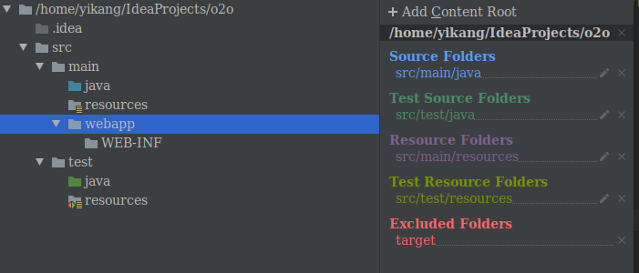

之后还需要创建一些文件夹，最终结构如下：

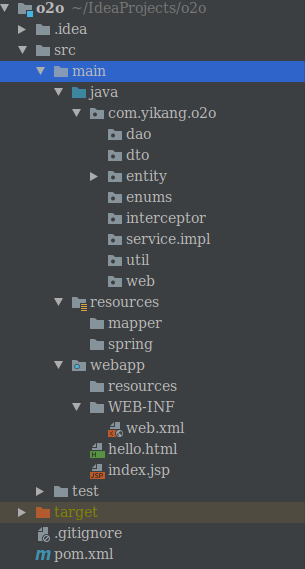

#### WEB-INF文件夹

+ `/WEB-INF/web.xml`：Web应用程序配置文件，描述了 servlet 和其他的应用组件配置及命名规则。
+ `/WEB-INF/classes/`：包含了站点所有用的 class 文件，包括 servlet class 和非servlet class，他们不能包含在 .jar文件中。
+ `/WEB-INF/lib/`：存放web应用需要的各种JAR文件，放置仅在这个应用中要求使用的jar文件,如数据库驱动jar文件。
+ `/WEB-INF/src/`：源码目录，按照包名结构放置各个java文件。
+ `/WEB-INF/database.properties`：数据库配置文件。
+ `/WEB-INF/tags/`：存放了自定义标签文件，该目录并不一定为 tags，可以根据自己的喜好和习惯为自己的标签文件库命名，当使用自定义的标签文件库名称时，在使用标签文件时就必须声明正确的标签文件库路径。例如：当自定义标签文件库名称为 simpleTags 时，在使用 simpleTags 目录下的标签文件时，就必须在 jsp 文件头声明为：`<%@ taglibprefix=“tags” tagdir="/WEB-INF /simpleTags" % >`。
+ `/WEB-INF/jsp/`：jsp 1.2 以下版本的文件存放位置。改目录没有特定的声明，同样，可以根据自己的喜好与习惯来命名。此目录主要存放的是 jsp 1.2 以下版本的文件，为区分 jsp 2.0 文件，通常使用 jsp 命名，当然你也可以命名为 jspOldEdition 。
+ `/WEB-INF/jsp2/`：与 jsp 文件目录相比，该目录下主要存放 Jsp 2.0 以下版本的文件，当然，它也是可以任意命名的，同样为区别 Jsp 1.2以下版本的文件目录，通常才命名为 jsp2。

> 外界不能通过url的方式访问WEB-INF文件夹，因此一般把html等资源放在WEB-INF文件夹下。

### 配置Tomcat

#### 安装

查看Tomcat各个版本的兼容性，可以在官网的`Download`列表下的子标签`which version`中找到。

这里使用Tomcat9。

下载Core下的tar.gz，解压到opt目录下。

```shell
cd /opt/tomcat9/bin
sudo gedit ./startup.sh
```

打开后，在最后一行之前添加以下内容：（这个步骤不做也行，如果前面已经配置了jdk的环境变量）

```shell
export JAVA_HOME=/opt/jdk1.8.0_281
export JRE_HOME=${JAVA_HOME}/jre
export CALSSPATH=.:${JAVA_HOME}/lib:${JRE_HOME}/lib
export PATH=${JAVA_HOME}/bin:$PATH
export TOMCAT_HOME=/opt/tomcat9
```

启动tomcat：

```shell
./startup.sh
```

前往[网址](http://localhost:8080/)查看是否正常运行。

#### 配置IDEA

run->Edit Configurations->Add->Tomcat Server->local，选择tomcat的安装路径，配置热部署。

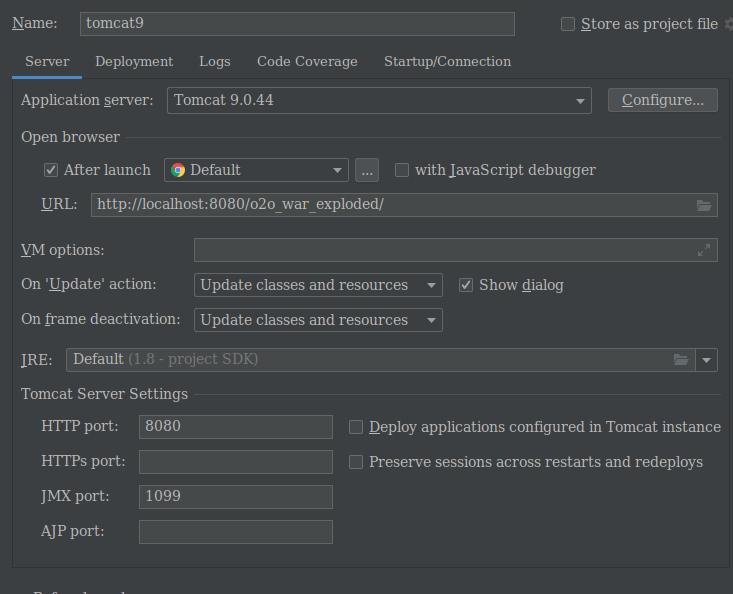

配置DeployMent：

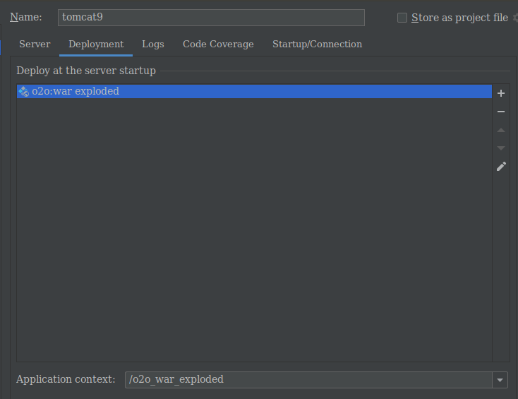

Application context默认为`/项目名_war_exploded`，可以修改为`/`使得直接使用`/`来访问资源。

##### war和war exploded的区别

是选择`war`还是`war exploded` 这里首先看一下他们两个的区别：

+ `war`模式：将WEB工程以包的形式上传到服务器 ； 
+ `war exploded`模式：将WEB工程以当前文件夹的位置关系上传到服务器；

`war`模式这种可以称之为是发布模式，看名字也知道，这是先打成war包，再发布；

`war exploded`模式是直接把文件夹、jsp页面 、classes等等移到Tomcat 部署文件夹里面，进行加载部署。因此这种方式支持热部署，一般在开发的时候也是用这种方式。

在平时开发的时候，使用热部署的话，应该对Tomcat进行相应的设置，这样的话修改的jsp界面什么的东西才可以及时的显示出来。

## 系统功能模块划分

### 整体

+ 前端展示系统
	+ 头条展示
	+ 店铺类别展示
	+ 区域展示
	+ 店铺
		+ 列表展示
		+ 查询
		+ 详情
	+ 商品
		+ 列表展示
		+ 查询
		+ 详情
+ 超级管理员系统
	+ 头条信息的维护
	+ 店铺类别信息维护
	+ 区域信息维护
	+ 权限验证
	+ 店铺管理
	+ 用户管理

### 实体类解析

#### 实体一览

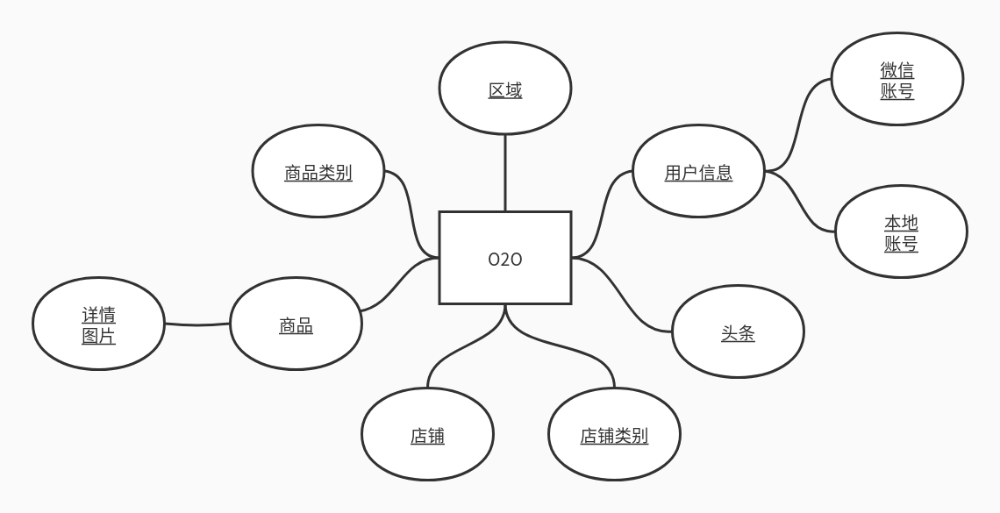

#### 实体类设计与数据库表创建

##### 区域

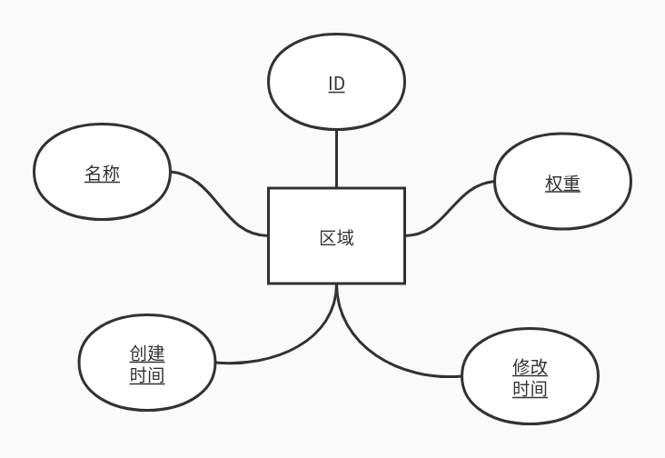

```java
public Class Area{
	private Integer areaId;
    private String areaName;
    private Integer priority;
    private Date createTime;
    private Date lastEditTime;
    //getter and setter......
}
```

注意，避免使用基础类型，而是使用对应的类，因为在默认情况下基础类型有值，而引用类型变量为null。

```mysql
create table tb_area
(
    area_id        int(2)       not null auto_increment,
    area_name      varchar(200) not null,
    priority       int(2)       not null default 0,
    create_time    datetime              default null,
    last_edit_time datetime              default null,
    primary key (area_id),
    unique key UK_AREA (area_name)
) engine = InnoDB
  AUTO_INCREMENT = 1
  default charset = utf8
```

##### 用户信息

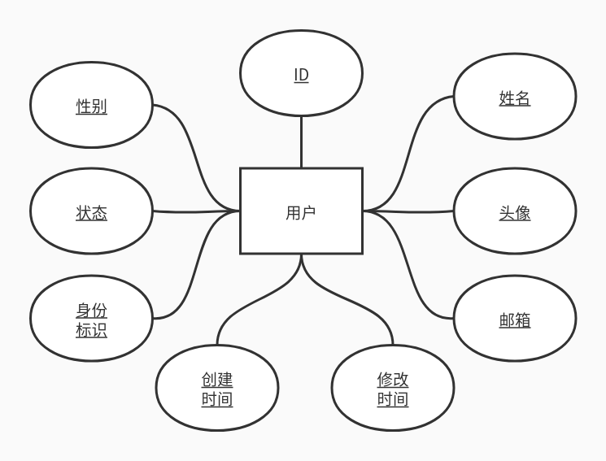

```java
public class PersonInfo {
    private Long userId;
    private String name;
    private String profileImg;
    private String email;
    private String gender;
    private Integer enableStatus;
    //userType:
    //1-顾客
    //2-店家
    //3-超级管理员
    private Integer userType;
    private Date createTime;
    private Date lastEditTime;
    //getter and setter......
}
```

```mysql
create table tb_person_info
(
    user_id        int(10) not null auto_increment,
    name           varchar(32)      default null,
    profile_img    varchar(1024)    default null,
    email          varchar(1024)    default null,
    gender         varchar(2)       default null,
    enable_status  int(2)  not null default 0 comment '0：禁止使用本商城；1：允许使用本商城',
    user_type      int(2)  not null default 1 comment '1：顾客；2：店家；3：超级管理员',
    create_time    datetime         default null,
    last_edit_time datetime         default null,
    primary key (user_id)
) engine = InnoDB
  auto_increment = 1
  default charset = utf8;
```

##### 微信账号和本地账号

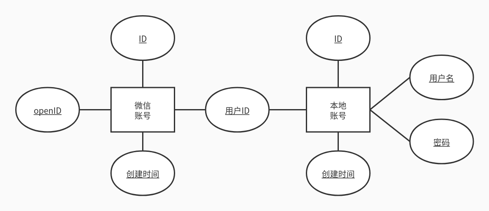

```java
public class WechatAuth {
    private Long wechatAuthId;
    private String openId;
    private Date createTime;
    private PersonInfo personInfo;
}
```

```java
public class LocalAuth {
    private Long localAuthId;
    private String username;
    private String password;
    private Date createTime;
    private Date lastEditTime;
    private PersonInfo personInfo;
}
```

```mysql
create table tb_wechat_auth
(
    wechat_auth_id int(10)       not null auto_increment,
    user_id        int(10)       not null,
    open_id        varchar(1024) not null,
    create_time    datetime default null,
    primary key (wechat_auth_id),
    constraint fk_wechatauth_profile foreign key (user_id) references tb_person_info (user_id)
) engine = InnoDB
  auto_increment = 1
  default charset = utf8;
create table tb_local_auth
(
    local_auth_id  int(10)      not null auto_increment,
    user_id        int(10)      not null,
    username      varchar(128) not null,
    password       varchar(128) not null,
    create_time    datetime default null,
    last_edit_time datetime default null,
    primary key (local_auth_id),
    unique key uk_local_profile (username),
    constraint fk_localauth_profile foreign key (user_id) references tb_person_info (user_id)
) engine = InnoDB
  auto_increment = 1
  default charset = utf8;
# 对open_id建立索引
alter table tb_wechat_auth add unique index (open_id);
```

##### 头条


```java
public class HeadLine {
    private Long lineId;
    private String lineName;
    private String lineLink;
    private String lineImg;
    private Integer priority;
    //0:可用；1：不可用
    private Integer enableStatus;
    private Date createTime;
    private Date lastEditTime;
}
```

```mysql
create table tb_head_line
(
    line_id        int(100)      not null auto_increment,
    line_name      varchar(1000)          default null,
    line_link      varchar(2000) not null,
    line_img       varchar(2000) not null,
    priority       int(2)                 default null,
    enable_status  int(2)        not null default 0,
    create_time    datetime               default null,
    last_edit_time datetime               default null,
    primary key (line_id)
) engine = InnoDB
  auto_increment = 1
  default charset = utf8;
```

##### 店铺类别

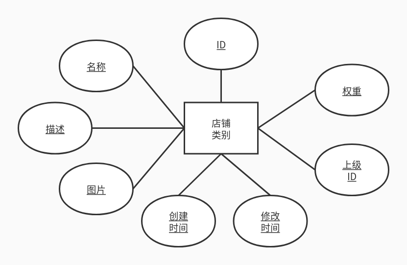

```java
public class ShopCategory {
    private Long shopCategoryId;
    private String shopCategoryName;
    private String shopCategoryDesc;
    private String shopCategoryImg;
    private Integer priority;
    private Date createTime;
    private Date lastEditTime;
    private ShopCategory parent;
}
```

##### 店铺

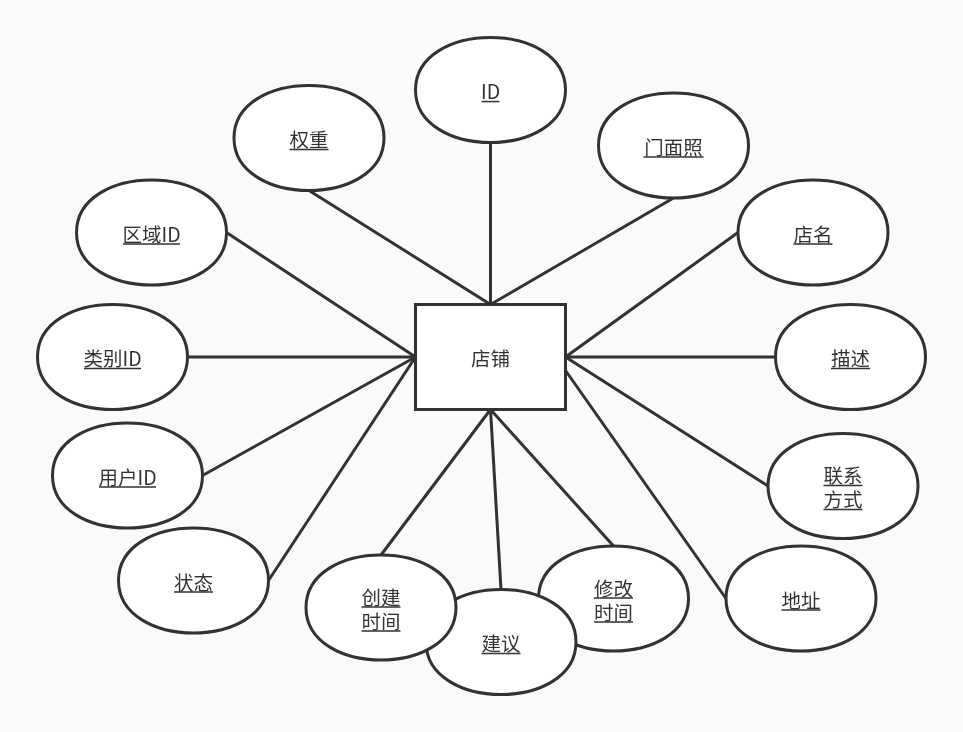

```java
public class Shop {
    private Long shopId;
    private String shopName;
    private String shopDesc;
    private String shopAddr;
    private String phone;
    private String shopImg;
    private Integer priority;
    private Date createTime;
    private Date lastEditTime;
    //-1-不可用，0-审核中，1-可用
    private Integer enableStatus;
    //超级管理员给店家的提醒
    private String advice;
    private Area area;
    private PersonInfo owner;
    private ShopCategory shopCategory;
}
```

```mysql
create table tb_shop
(
    shop_id          int(10)      not null auto_increment,
    owner_id         int(10)      not null comment '店铺创建人',
    area_id          int(5)                default null,
    shop_category_id int(11)               default null,
    shop_name        varchar(256) not null,
    shop_desc        varchar(1024)         default null,
    shop_addr        varchar(200)          default null,
    phone            varchar(128)          default null,
    shop_img         varchar(1024)         default null,
    priority         int(3)                default 0,
    create_time      datetime              default null,
    last_edit_time   datetime              default null,
    enable_status    int(2)       not null default 0,
    advice           varchar(255)          default null,
    primary key (shop_id),
    constraint fk_shop_area foreign key (area_id) references tb_area (area_id),
    constraint fk_shop_profile foreign key (owner_id) references tb_person_info (user_id),
    constraint fk_shop_shopcate foreign key (shop_category_id) references tb_shop_category (shop_category_id)
) engine = InnoDB
  auto_increment = 1
  default charset = utf8;
```

##### 商品类别

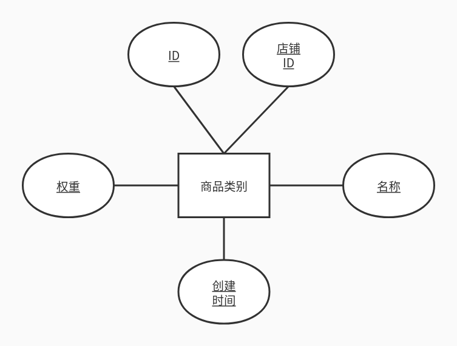

```java
public class ProductCategory {
    private Long productCategoryId;
    private Long shopId;
    private String productCategoryName;
    private Integer priority;
    private Date createTime;
}
```

```mysql
create table tb_product_category
(
    product_category_id   int(11)      not null auto_increment,
    product_category_name varchar(100) not null,
    priority              int(2)                default 0,
    create_time           datetime              default null,
    shop_id               int(20)      not null default 0,
    primary key (product_category_id),
    constraint fk_procate_shop foreign key (shop_id) references tb_shop (shop_id)
) engine = InnoDB
  auto_increment = 1
  default charset = utf8;
```

##### 详情图片

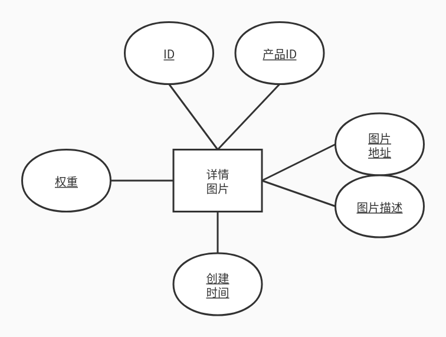

```java
public class ProductImg {
    private Long productImgId;
    private String imgAddr;
    private String imgDesc;
    private Integer priority;
    private Date createTime;
    private Long productId;
}
```

```mysql
# 注意这张表要在tb_product表之后创建
create table tb_product_img
(
    product_img_id int(20)       not null auto_increment,
    img_addr       varchar(2000) not null,
    img_desc       varchar(2000) default null,
    priority       int(2)        default 0,
    create_time    datetime      default null,
    product_id     int(20)       default null,
    primary key (product_img_id),
    constraint fk_proimg_product foreign key (product_id) references tb_product (product_id)
) engine = InnoDB
  auto_increment = 1
  default charset = utf8;
```

因为商品类需要引用详情图片类，因此对于类的定义，详情图片类在商品类之前。

因为详情图片表需要引用商品表，因此对于建表，商品表在详情图片表之前。

##### 商品

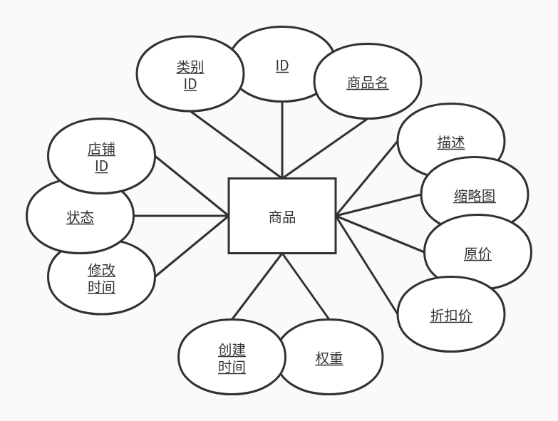

```java
public class Product {
    private Long productId;
    private String productName;
    private String productDesc;
    //简略图
    private String imgAddr;
    private String normalPrice;
    private String promotionPrice;
    private Integer priority;
    private Date createTime;
    private Date lastEditTime;
    //0-下架，1-在前端展示系统展示
    private Integer enableStatus;
    private List<ProductImg> productImgList;
    private ProductCategory productCategory;
    private Shop shop;
}
```

```mysql
create table tb_product
(
    product_id          int(100)     not null auto_increment,
    product_name        varchar(100) not null,
    product_desc        varchar(2000)         default null,
    img_addr            varchar(2000)         default '',
    normal_price        varchar(100)          default null,
    promotion_price     varchar(100)          default null,
    priority            int(2)       not null default 0,
    create_time         datetime              default null,
    last_edit_time      datetime              default null,
    enable_status       int(2)       not null default 0,
    product_category_id int(11)               default null,
    shop_id             int(20)      not null default 0,
    primary key (product_id),
    constraint fk_product_procate foreign key (product_category_id) references tb_product_category (product_category_id),
    constraint fk_product_shop foreign key (shop_id) references tb_shop (shop_id)
) engine = InnoDB
  auto_increment = 1
  default charset = utf8;
```

#### 用户信息关联

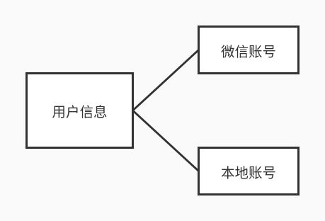

#### 店铺信息关联

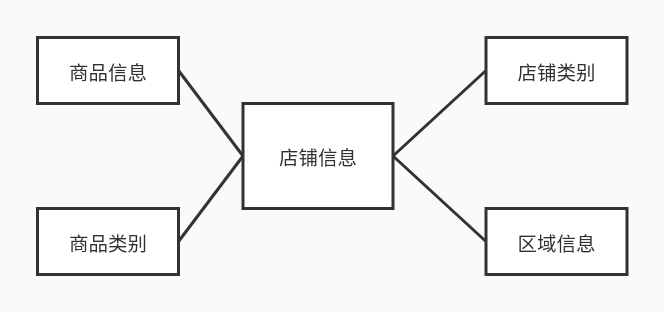

#### 商品信息关联

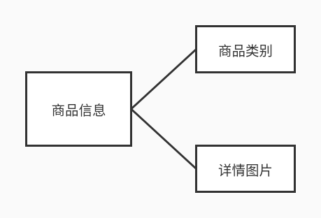

## 基本配置

### 目录结构

spring、mybatis等配置文件通常放在src/main/resources目录下。

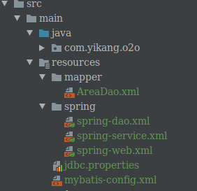

### jdbc.properties

```properties
jdbc.driver=com.mysql.jdbc.Driver
jdbc.url=jdbc:mysql://localhost:3306/o2o?useUnicode=true&characterEncoding=utf8&serverTimezone=UTC
jdbc.username=root
jdbc.password=159753
```

### mybatis-config.xml

```xml
<?xml version="1.0" encoding="UTF-8"?>
<!DOCTYPE configuration
        PUBLIC "-//mybatis.org//DTD Config 3.0//EN"
        "http://mybatis.org/dtd/mybatis-3-config.dtd">
<configuration>
    <!-- 配置全局属性 -->
    <settings>
        <!-- 使用jdbc的getGeneratedKeys获取数据库自增主键值 -->
        <setting name="useGeneratedKeys" value="true" />

        <!-- 使用列标签替换列别名 默认:true -->
        <setting name="useColumnLabel" value="true" />

        <!-- 开启驼峰命名转换:Table{create_time} -> Entity{createTime} -->
        <setting name="mapUnderscoreToCamelCase" value="true" />
    </settings>
</configuration>
```

### spring-dao.xml

```xml
<context:property-placeholder location="classpath:jdbc.properties"/>
```

`context:property-placeholder`会将properties文件的配置信息引入。

```xml
<?xml version="1.0" encoding="UTF-8"?>
<beans xmlns="http://www.springframework.org/schema/beans"
       xmlns:xsi="http://www.w3.org/2001/XMLSchema-instance"
       xmlns:context="http://www.springframework.org/schema/context"
       xsi:schemaLocation="http://www.springframework.org/schema/beans
    http://www.springframework.org/schema/beans/spring-beans.xsd
    http://www.springframework.org/schema/context
    http://www.springframework.org/schema/context/spring-context.xsd">
    <!-- 配置整合mybatis过程 -->
    <!-- 1.配置数据库相关参数properties的属性：${url} -->
    <context:property-placeholder location="classpath:jdbc.properties"/>

    <!-- 2.数据库连接池 -->
    <bean id="dataSource" class="com.mchange.v2.c3p0.ComboPooledDataSource">
        <!--配置连接池属性-->
        <property name="driverClass" value="${jdbc.driver}"/>
        <property name="jdbcUrl" value="${jdbc.url}"/>
        <property name="user" value="${jdbc.username}"/>
        <property name="password" value="${jdbc.password}"/>
        <!-- c3p0连接池的私有属性 -->
        <property name="maxPoolSize" value="30"/>
        <property name="minPoolSize" value="10"/>
        <!-- 关闭连接后不自动commit -->
        <property name="autoCommitOnClose" value="false"/>
        <!-- 获取连接超时时间 -->
        <property name="checkoutTimeout" value="10000"/>
        <!-- 当获取连接失败重试次数 -->
        <property name="acquireRetryAttempts" value="2"/>
    </bean>

    <!-- 3.配置SqlSessionFactory对象 -->
    <bean id="sqlSessionFactory" class="org.mybatis.spring.SqlSessionFactoryBean">
        <!-- 注入数据库连接池 -->
        <property name="dataSource" ref="dataSource"/>
        <!-- 配置MyBaties全局配置文件:mybatis-config.xml -->
        <property name="configLocation" value="classpath:mybatis-config.xml"/>
        <!-- 扫描entity包 使用别名 -->
        <property name="typeAliasesPackage" value="com.yikang.o2o.entity"/>
        <!-- 扫描sql配置文件:mapper需要的xml文件 -->
        <property name="mapperLocations" value="classpath:mapper/*.xml"/>
    </bean>

    <!-- 4.配置扫描Dao接口包，动态实现Dao接口，注入到spring容器中 -->
    <bean class="org.mybatis.spring.mapper.MapperScannerConfigurer">
        <!-- 注入sqlSessionFactory -->
        <property name="sqlSessionFactoryBeanName" value="sqlSessionFactory"/>
        <!-- 给出需要扫描Dao接口包 -->
        <property name="basePackage" value="com.yikang.o2o.dao"/>
    </bean>
</beans>
```

### spring-service.xml

```java
<?xml version="1.0" encoding="UTF-8"?>
<beans xmlns="http://www.springframework.org/schema/beans"
       xmlns:xsi="http://www.w3.org/2001/XMLSchema-instance"
       xmlns:context="http://www.springframework.org/schema/context"
       xmlns:tx="http://www.springframework.org/schema/tx"
       xsi:schemaLocation="http://www.springframework.org/schema/beans
    http://www.springframework.org/schema/beans/spring-beans.xsd
    http://www.springframework.org/schema/context
    http://www.springframework.org/schema/context/spring-context.xsd
    http://www.springframework.org/schema/tx
    http://www.springframework.org/schema/tx/spring-tx.xsd">
    <!-- 扫描service包下所有使用注解的类型 -->
    <context:component-scan base-package="com.yikang.o2o.service" />

    <!-- 配置事务管理器 -->
    <bean id="transactionManager"
          class="org.springframework.jdbc.datasource.DataSourceTransactionManager">
        <!-- 注入数据库连接池 -->
        <property name="dataSource" ref="dataSource" />
    </bean>

    <!-- 配置基于注解的声明式事务 -->
    <tx:annotation-driven transaction-manager="transactionManager" />
</beans>
```

### spring-web.xml

```xml
<?xml version="1.0" encoding="UTF-8"?>
<beans xmlns="http://www.springframework.org/schema/beans"
       xmlns:xsi="http://www.w3.org/2001/XMLSchema-instance" xmlns:context="http://www.springframework.org/schema/context"
       xmlns:mvc="http://www.springframework.org/schema/mvc"
       xsi:schemaLocation="http://www.springframework.org/schema/beans
    http://www.springframework.org/schema/beans/spring-beans.xsd
    http://www.springframework.org/schema/context
    http://www.springframework.org/schema/context/spring-context.xsd
    http://www.springframework.org/schema/mvc
    http://www.springframework.org/schema/mvc/spring-mvc-3.2.xsd">
    <!-- 配置SpringMVC -->
    <!-- 1.开启SpringMVC注解模式 -->
    <mvc:annotation-driven />

    <!-- 2.静态资源默认servlet配置 (1)加入对静态资源的处理：js,gif,png (2)允许使用"/"做整体映射 -->
    <mvc:resources mapping="/resources/**" location="/resources/" />
    <mvc:default-servlet-handler />

    <!-- 3.定义视图解析器 -->
    <bean id="viewResolver"
          class="org.springframework.web.servlet.view.InternalResourceViewResolver">
        <!--利用WEB-INF的安全性，在外界不能直接输入/WEB-INF/...url来访问文件的，
        而程序内部是可以通过WEB-INF去访问的，这时可以使用spring的dispatcher servlet来转向，
        我们先去请求一个controller，由controller分发到WEB-INF下面的页面就可以了-->
        <property name="prefix" value="/WEB-INF/html/"></property>
        <property name="suffix" value=".html"></property>
    </bean>

    <!-- 4.扫描web相关(controller)的bean -->
    <context:component-scan base-package="com.yikang.o2o.web" />
</beans>
```

### web.xml

使上述配置文件被识别。

```xml
<!DOCTYPE web-app PUBLIC
        "-//Sun Microsystems, Inc.//DTD Web Application 2.3//EN"
        "http://java.sun.com/dtd/web-app_2_3.dtd" >

<web-app>
    <display-name>Archetype Created Web Application</display-name>
    <servlet>
        <servlet-name>spring-dispatcher</servlet-name>
        <servlet-class>org.springframework.web.servlet.DispatcherServlet</servlet-class>
        <init-param>
            <param-name>contextConfigLocation</param-name>
            <param-value>classpath:spring/spring-*.xml</param-value>
        </init-param>
    </servlet>
    <servlet-mapping>
        <servlet-name>spring-dispatcher</servlet-name>
        <!--默认匹配所有的请求-->
        <url-pattern>/</url-pattern>
    </servlet-mapping>
</web-app>
```

下面的配置能识别resources/spring包下的所有spring的配置文件。

```xml
    <init-param>
        <param-name>contextConfigLocation</param-name>
        <param-value>classpath:spring/spring-*.xml</param-value>
    </init-param>
```


### pom.xml

```xml
<properties>
    <project.build.sourceEncoding>UTF-8</project.build.sourceEncoding>
    <maven.compiler.source>1.8</maven.compiler.source>
    <maven.compiler.target>1.8</maven.compiler.target>
    <spring.version>5.1.8.RELEASE</spring.version>
</properties>

<dependencies>
    <dependency>
        <groupId>junit</groupId>
        <artifactId>junit</artifactId>
        <version>4.12</version>
        <scope>test</scope>
    </dependency>
    <!-- https://mvnrepository.com/artifact/ch.qos.logback/logback-classic -->
    <dependency>
        <groupId>ch.qos.logback</groupId>
        <artifactId>logback-classic</artifactId>
        <version>1.2.3</version>
    </dependency>
    <!-- Spring -->
    <!-- 1)包含Spring 框架基本的核心工具类。Spring 其它组件要都要使用到这个包里的类，是其它组件的基本核心 -->
    <dependency>
        <groupId>org.springframework</groupId>
        <artifactId>spring-core</artifactId>
        <version>${spring.version}</version>
    </dependency>
    <!-- 2)这个jar 文件是所有应用都要用到的，它包含访问配置文件、创建和管理bean 以及进行Inversion of Control
        / Dependency Injection（IoC/DI）操作相关的所有类。如果应用只需基本的IoC/DI 支持，引入spring-core.jar
        及spring-beans.jar 文件就可以了。 -->
    <dependency>
        <groupId>org.springframework</groupId>
        <artifactId>spring-beans</artifactId>
        <version>${spring.version}</version>
    </dependency>
    <!-- 3)这个jar 文件为Spring 核心提供了大量扩展。可以找到使用Spring ApplicationContext特性时所需的全部类，JDNI
        所需的全部类，instrumentation组件以及校验Validation 方面的相关类。 -->
    <dependency>
        <groupId>org.springframework</groupId>
        <artifactId>spring-context</artifactId>
        <version>${spring.version}</version>
    </dependency>
    <!-- 4) 这个jar 文件包含对Spring 对JDBC 数据访问进行封装的所有类。 -->
    <dependency>
        <groupId>org.springframework</groupId>
        <artifactId>spring-jdbc</artifactId>
        <version>${spring.version}</version>
    </dependency>
    <!-- 5) 为JDBC、Hibernate、JDO、JPA等提供的一致的声明式和编程式事务管理。 -->
    <dependency>
        <groupId>org.springframework</groupId>
        <artifactId>spring-tx</artifactId>
        <version>${spring.version}</version>
    </dependency>
    <!-- 6)Spring web 包含Web应用开发时，用到Spring框架时所需的核心类，包括自动载入WebApplicationContext特性的类、Struts与JSF集成类、文件上传的支持类、Filter类和大量工具辅助类。 -->
    <dependency>
        <groupId>org.springframework</groupId>
        <artifactId>spring-web</artifactId>
        <version>${spring.version}</version>
    </dependency>
    <!-- 7)包含SpringMVC框架相关的所有类。 -->
    <dependency>
        <groupId>org.springframework</groupId>
        <artifactId>spring-webmvc</artifactId>
        <version>${spring.version}</version>
    </dependency>
    <!-- 8)Spring test 对JUNIT等测试框架的简单封装 -->
    <dependency>
        <groupId>org.springframework</groupId>
        <artifactId>spring-test</artifactId>
        <version>${spring.version}</version>
        <scope>test</scope>
    </dependency>
    <!-- Servlet web -->
    <dependency>
        <groupId>javax.servlet</groupId>
        <artifactId>javax.servlet-api</artifactId>
        <version>4.0.1</version>
    </dependency>
    <!-- json解析 -->
    <dependency>
        <groupId>com.fasterxml.jackson.core</groupId>
        <artifactId>jackson-databind</artifactId>
        <version>2.9.9</version>
    </dependency>
    <!-- Map工具类 对标准java Collection的扩展 spring-core.jar需commons-collections.jar -->
    <dependency>
        <groupId>commons-collections</groupId>
        <artifactId>commons-collections</artifactId>
        <version>3.2.2</version>
    </dependency>
    <!-- DAO: MyBatis -->
    <dependency>
        <groupId>org.mybatis</groupId>
        <artifactId>mybatis</artifactId>
        <version>3.5.1</version>
    </dependency>
    <dependency>
        <groupId>org.mybatis</groupId>
        <artifactId>mybatis-spring</artifactId>
        <version>2.0.1</version>
    </dependency>
    <!-- 数据库 -->
    <dependency>
        <groupId>mysql</groupId>
        <artifactId>mysql-connector-java</artifactId>
        <version>8.0.16</version>
    </dependency>
    <!-- https://mvnrepository.com/artifact/com.mchange/c3p0 -->
    <dependency>
        <groupId>com.mchange</groupId>
        <artifactId>c3p0</artifactId>
        <version>0.9.5.4</version>
    </dependency>

    <!-- 图片处理 -->
    <!-- https://mvnrepository.com/artifact/net.coobird/thumbnailator -->
    <dependency>
        <groupId>net.coobird</groupId>
        <artifactId>thumbnailator</artifactId>
        <version>0.4.8</version>
    </dependency>
    <!-- https://mvnrepository.com/artifact/com.github.penggle/kaptcha -->
    <dependency>
        <groupId>com.github.penggle</groupId>
        <artifactId>kaptcha</artifactId>
        <version>2.3.2</version>
    </dependency>
    <dependency>
        <groupId>commons-fileupload</groupId>
        <artifactId>commons-fileupload</artifactId>
        <version>1.3.2</version>
    </dependency>
    <!-- redis客户端:Jedis -->
    <dependency>
        <groupId>redis.clients</groupId>
        <artifactId>jedis</artifactId>
        <version>2.9.0</version>
    </dependency>

</dependencies>
```

### 验证

AreaDao接口：

```java
public interface AreaDao {
    /**
     * 列出区域列表
     * @return areaList
     */
    List<Area> queryAreas();
}
```

AreaDao的实现AreaDao.xml:

```xml
<?xml version="1.0" encoding="UTF-8"?>
<!DOCTYPE mapper
        PUBLIC "-//mybatis.org//DTD Mapper 3.0//EN"
        "http://mybatis.org/dtd/mybatis-3-mapper.dtd">
<mapper namespace="com.yikang.o2o.dao.AreaDao">
    <select id="queryAreas" resultType="com.yikang.o2o.entity.Area">
      SELECT area_id, area_name,
      priority, create_time, last_edit_time
      FROM tb_area
      ORDER BY priority
      DESC
   </select>
</mapper>
```

新建文件夹：

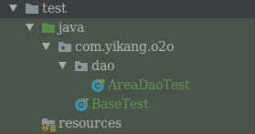

#### BaseTest.java

```java
/**
 * 配置spring和junit整合，junit启动时加载springIOC容器
 */
@RunWith(SpringJUnit4ClassRunner.class)
//告诉junit spring配置文件的位置
@ContextConfiguration({"classpath:spring/spring-dao.xml"})
public class BaseTest {

}
```

#### AreaDaoTest.java

```java
public class AreaDaoTest extends BaseTest {
    @Autowired
    private AreaDao areaDao;

    @Test
    public void testQueryArea() {
        List<Area> areaList = areaDao.queryAreas();
        assertEquals(2, areaList.size());
    }
}
```

## LogBack日志配置

```xml
<?xml version="1.0" encoding="UTF-8"?>
<!--每分钟扫描以下配置-->
<configuration scan="true" scanPeriod="60 seconds" debug="false">
    <!-- 定义参数常量 -->
    <!-- TRACE<DEBUG<INFO<WARN<ERROR -->
    <!-- logger.trace("msg") logger.debug... -->
    <property name="log.level" value="debug" />
    <property name="log.maxHistory" value="30" />
    <property name="log.filePath" value="${catalina.base}/logs/webapps" />
    <property name="log.pattern"
              value="%d{yyyy-MM-dd HH:mm:ss.SSS} [%thread] %-5level %logger{50} - %msg%n" />
    <!-- 控制台设置 -->
    <appender name="consoleAppender" class="ch.qos.logback.core.ConsoleAppender">
        <encoder>
            <pattern>${log.pattern}</pattern>
        </encoder>
    </appender>
    <!-- DEBUG -->
    <appender name="debugAppender" class="ch.qos.logback.core.rolling.RollingFileAppender">
        <!-- 文件路径 -->
        <file>${log.filePath}/debug.log</file>
        <rollingPolicy class="ch.qos.logback.core.rolling.TimeBasedRollingPolicy">
            <!-- 文件名称 -->
            <fileNamePattern>${log.filePath}/debug/debug.%d{yyyy-MM-dd}.log.gz
            </fileNamePattern>
            <!-- 文件最大保存历史数量 -->
            <maxHistory>${log.maxHistory}</maxHistory>
        </rollingPolicy>
        <encoder>
            <pattern>${log.pattern}</pattern>
        </encoder>
        <filter class="ch.qos.logback.classic.filter.LevelFilter">
            <level>DEBUG</level>
            <onMatch>ACCEPT</onMatch>
            <onMismatch>DENY</onMismatch>
        </filter>
    </appender>
    <!-- INFO -->
    <appender name="infoAppender" class="ch.qos.logback.core.rolling.RollingFileAppender">
        <!-- 文件路径 -->
        <file>${log.filePath}/info.log</file>
        <rollingPolicy class="ch.qos.logback.core.rolling.TimeBasedRollingPolicy">
            <!-- 文件名称 -->
            <fileNamePattern>${log.filePath}/info/info.%d{yyyy-MM-dd}.log.gz
            </fileNamePattern>
            <!-- 文件最大保存历史数量 -->
            <maxHistory>${log.maxHistory}</maxHistory>
        </rollingPolicy>
        <encoder>
            <pattern>${log.pattern}</pattern>
        </encoder>
        <filter class="ch.qos.logback.classic.filter.LevelFilter">
            <level>INFO</level>
            <onMatch>ACCEPT</onMatch>
            <onMismatch>DENY</onMismatch>
        </filter>
    </appender>
    <!-- ERROR -->
    <appender name="errorAppender" class="ch.qos.logback.core.rolling.RollingFileAppender">
        <!-- 文件路径 -->
        <file>${log.filePath}/erorr.log</file>
        <rollingPolicy class="ch.qos.logback.core.rolling.TimeBasedRollingPolicy">
            <!-- 文件名称 -->
            <fileNamePattern>${log.filePath}/error/error.%d{yyyy-MM-dd}.log.gz
            </fileNamePattern>
            <!-- 文件最大保存历史数量 -->
            <maxHistory>${log.maxHistory}</maxHistory>
        </rollingPolicy>
        <encoder>
            <pattern>${log.pattern}</pattern>
        </encoder>
        <filter class="ch.qos.logback.classic.filter.LevelFilter">
            <level>ERROR</level>
            <onMatch>ACCEPT</onMatch>
            <onMismatch>DENY</onMismatch>
        </filter>
    </appender>
    <!--name表示logger关注的是哪个package-->
    <!--additivity=true表示继承root里的appender，即也会包含控制台的输出-->
    <logger name="com.yikang.o2o" level="${log.level}" additivity="true">
        <appender-ref ref="debugAppender"/>
        <appender-ref ref="infoAppender"/>
        <appender-ref ref="errorAppender"/>
    </logger>
    <root level="info">
        <appender-ref ref="consoleAppender"/>
    </root>
</configuration>
```

其中，配置log.filePath时用到了`${catalina.base}`这个变量。

+ `catalina.home`：Tomcat 安装目录，一般是用来查找库 jar 的。
+ `catalina.base`：服务器配置目录。

在IDEA里启动Tomcat时会发现控制台输出以下信息：

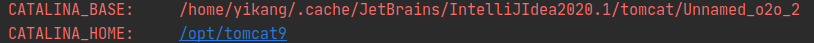

会发现`catalina.base`是IDEA下的当前项目的工作环境里的目录。

## Thumbnailator图片处理和封装Util

### ImageUtil

```java
public class ImageUtil {
    //获取resources目录路径
    private static String basePath = Thread.currentThread().getContextClassLoader().getResource("").getPath();
    private static final SimpleDateFormat sDateFormat = new SimpleDateFormat("yyyyMMddHHmmss");
    private static final Random r = new Random();
    private static final Logger logger= LoggerFactory.getLogger(ImageUtil.class);

    /**
     * 将CommonsMultipartFile转换成File类
     *
     * @param cFile
     * @return
     */
    public static File transferCommonsMultipartFileToFile(CommonsMultipartFile cFile) {
        File newFile = new File(cFile.getOriginalFilename());
        try {
            cFile.transferTo(newFile);
        } catch (IllegalStateException e) {
            logger.error(e.toString());
            e.printStackTrace();
        } catch (IOException e) {
            logger.error(e.toString());
            e.printStackTrace();
        }
        return newFile;
    }

    /**
     * 处理缩略图，并返回新生成图片的相对值路径
     *
     * @param thumbnail 文件流
     * @param targetAddr 相对路径，存储的文件夹地址
     * @return
     */
    public static String generateThumbnail(File thumbnail, String targetAddr) {
        // 获取不重复的随机名
        String realFileName = getRandomFileName();
        // 获取文件的扩展名如png,jpg等
        String extension = getFileExtension(thumbnail);
        // 如果目标路径不存在，则自动创建
        makeDirPath(targetAddr);
        // 获取文件存储的相对路径(带文件名)
        String relativeAddr = targetAddr + realFileName + extension;
        logger.debug("current relativeAddr is :" + relativeAddr);
        // 获取文件要保存到的目标路径
        File dest = new File(PathUtil.getImgBasePath() + relativeAddr);
        logger.debug("current complete addr is :" + PathUtil.getImgBasePath() + relativeAddr);
        logger.debug("basePath is :" + basePath);
        // 调用Thumbnails生成带有水印的图片
        try {
            Thumbnails.of(thumbnail).size(200, 200)
                    .watermark(Positions.BOTTOM_RIGHT, ImageIO.read(new File(basePath + "watermark.jpg")), 0.25f)
                    .outputQuality(0.8f).toFile(dest);
        } catch (IOException e) {
            logger.error(e.toString());
            throw new RuntimeException("创建缩略图失败：" + e.toString());
        }
        // 返回图片相对路径地址
        return relativeAddr;
    }
        /**
     * 递归创建目标路径所涉及到的目录
     *
     * @param targetAddr
     */
    private static void makeDirPath(String targetAddr) {
        String realFileParentPath = PathUtil.getImgBasePath() + targetAddr;
        File dirPath = new File(realFileParentPath);
        if (!dirPath.exists()) {
            dirPath.mkdirs();
        }
    }

    /**
     * 获取输入文件流的扩展名
     *
     * @param file
     * @return
     */
    private static String getFileExtension(File file) {
        String fileName = file.getName();
        return fileName.substring(fileName.lastIndexOf("."));
    }

    /**
     * 生成随机文件名，当前年月日小时分钟秒钟+五位随机数
     *
     * @return
     */
    public static String getRandomFileName() {
        // 获取随机的五位数
        int rannum = r.nextInt(89999) + 10000;
        String nowTimeStr = sDateFormat.format(new Date());
        return nowTimeStr + rannum;
    }

    public static void main(String[] args) throws IOException {
        Thumbnails.of(new File("/Users/baidu/work/image/xiaohuangren.jpg")).size(200, 200)
                .watermark(Positions.BOTTOM_RIGHT, ImageIO.read(new File(basePath + "/watermark.jpg")), 0.25f)
                .outputQuality(0.8f).toFile("/Users/baidu/work/image/xiaohuangrennew.jpg");
    }

    /**
     * storePath是文件的路径还是目录的路径， 如果storePath是文件路径则删除该文件，
     * 如果storePath是目录路径则删除该目录下的所有文件
     *
     * @param storePath
     */
    public static void deleteFileOrPath(String storePath) {
        File fileOrPath = new File(PathUtil.getImgBasePath() + storePath);
        if (fileOrPath.exists()) {
            if (fileOrPath.isDirectory()) {
                File files[] = fileOrPath.listFiles();
                for (int i = 0; i < files.length; i++) {
                    files[i].delete();
                }
            }
            fileOrPath.delete();
        }
    }
}
```

这里的实现并不是最终的，其中`generateThumbnail`的第一个参数类型设置为`File`是为了方便测试。

### PathUtil

```java
public class PathUtil {
    //获取系统的文件分隔符
    private static String seperator = System.getProperty("file.separator");

    public static String getImgBasePath() {
        String os = System.getProperty("os.name");
        String basePath = "";
        if (os.toLowerCase().startsWith("win")) {
            basePath = "D:/projectdev/image";
        } else {
            basePath = "/home/yikang/publicPro";
        }
        basePath = basePath.replace("/", seperator);
        return basePath;
    }

    public static String getShopImagePath(long shopId) {
        String imagePath = "/upload/images/item/shop/" + shopId + "/";
        return imagePath.replace("/", seperator);
    }

    public static String getHeadLineImagePath() {
        String imagePath = "/upload/images/item/headtitle/";
        return imagePath.replace("/", seperator);
    }

    public static String getShopCategoryPath() {
        String imagePath = "/upload/images/item/shopcategory/";
        return imagePath.replace("/", seperator);
    }
}
```

## Dao层：新增店铺、更新店铺

```java
public interface ShopDao {
    /**
     * 新增店铺
     */
    int insertShop(Shop shop);

    /**
     * 更新店铺信息
     */
    int updateShop(Shop shop);
}
```

```xml
<?xml version="1.0" encoding="UTF-8"?>
<!DOCTYPE mapper
    PUBLIC "-//mybatis.org//DTD Mapper 3.0//EN"
    "http://mybatis.org/dtd/mybatis-3-mapper.dtd">
<mapper namespace="com.yikang.o2o.dao.ShopDao">
  
  <insert id="insertShop" useGeneratedKeys="true" keyColumn="shop_id"
      keyProperty="shopId">
      INSERT INTO
      tb_shop(owner_id, area_id, shop_category_id,
      shop_name, shop_desc, shop_addr,
      phone, shop_img, priority,
      create_time, last_edit_time, enable_status,
      advice)
      VALUES
      (#{owner.userId},#{area.areaId},#{shopCategory.shopCategoryId},#{shopName},
      #{shopDesc},#{shopAddr},#{phone},#{shopImg},#{priority},
      #{createTime},#{lastEditTime}, #{enableStatus},#{advice})
   </insert>
   <update id="updateShop" parameterType="com.yikang.o2o.entity.Shop">
      update tb_shop
      <set>
         <if test="shopName != null">shop_name=#{shopName},</if>
         <if test="shopDesc != null">shop_desc=#{shopDesc},</if>
         <if test="shopAddr != null">shop_addr=#{shopAddr},</if>
         <if test="phone != null">phone=#{phone},</if>
         <if test="shopImg != null">shop_img=#{shopImg},</if>
         <if test="priority != null">priority=#{priority},</if>
         <if test="lastEditTime != null">last_edit_time=#{lastEditTime},</if>
         <if test="enableStatus != null">enable_status=#{enableStatus},</if>
         <if test="advice != null">advice=#{advice},</if>
         <if test="area != null">area_id=#{area.areaId},</if>
         <if test="shopCategory != null">shop_category_id=#{shopCategory.shopCategoryId}</if>
      </set>
      where shop_id=#{shopId}
   </update>
</mapper>
```

` useGeneratedKeys="true" keyColumn="shop_id"   keyProperty="shopId"`使用自增主键，当insert语句执行成功时，自增的主键会自动的注入到传入的shop参数，即shopId（传入前shop.shopId为null，执行后shop.shopId为自增的主键）。

## Dto层：ShopExecution

DTO层主要提供的作用：

数据传输对象层，该层负责屏蔽后端的实体层，将UI层需要的数据进行重新的定义和封装，在实际的业务场景下，后端实现或存储的数据远比用户需要的数据要庞大和复杂，所以前端需要的数据相对来说要么是组合的，要么是抽取的，不是完整的，因为我们在设计数据存储格式上都会有一些额外的设计和考虑。

前端的UI层，只是知道DTO的存在，同时前端需要的数据都在一个DTO中，这样，每次调用服务层的时候，只需要调用一次就可以完成所有的业务逻辑操作，而不是原来的直接调用业务逻辑层那样的，需要调用多次，对于分布式场景下，减少服务调用的次数，尤其重要。

### ShopStateEnum

Dto需要包含状态和状态信息，可以将这状态和状态信息封装为枚举类型。

将构造器定义为private，不开放setter，防止第三方修改枚举。

```java
package com.yikang.o2o.enums;

public enum ShopStateEnum {
    CHECK(0, "审核中"), OFFLINE(-1, "非法店铺"), SUCCESS(1, "操作成功"),
    PASS(2, "通过认证"), INNER_ERROR(-1001, "内部系统错误"),
    NULL_SHOPID(-1002, "shopId为空");
    private int state;
    private String stateInfo;

    //设置为private表示不想让第三方定义ShopStateEnum
    private ShopStateEnum(int state, String stateInfo) {
        this.state = state;
        this.stateInfo = stateInfo;
    }

    public static ShopStateEnum stateOf(int state) {
        for (ShopStateEnum stateEnum : values()) {
            if (stateEnum.getState() == state) return stateEnum;
        }
        return null;
    }

    public int getState() {
        return state;
    }

    public String getStateInfo() {
        return stateInfo;
    }
}
```

#### ShopExecution

增删改查可能涉及到多个shop，比如增删改涉及一个shop（大部分情况，小部分情况是多个），查询设计多个shop，因此需要分别引入`shop`和`shopList`。同时成员变量`count`来存储店铺数量。

```java
public class ShopExecution {
    //结果状态
    private int state;
    //状态标识
    private String stateInfo;
    //店铺数量
    private int count;
    //操作的shop（增删改店铺的时候用到）
    private Shop shop;
    //shop列表（查询店铺列表的时候使用）
    private List<Shop> shopList;

    public ShopExecution() {
    }

    //店铺操作失败的时候的构造器
    public ShopExecution(ShopStateEnum stateEnum) {
        this.state = stateEnum.getState();
        this.stateInfo = stateEnum.getStateInfo();
    }

    //店铺操作成功的构造器
    public ShopExecution(ShopStateEnum stateEnum, Shop shop) {
        this.state = stateEnum.getState();
        this.stateInfo = stateEnum.getStateInfo();
        this.shop = shop;
    }

    //店铺操作成功的构造器
    public ShopExecution(ShopStateEnum stateEnum, List<Shop> shopList) {
        this.state = stateEnum.getState();
        this.stateInfo = stateEnum.getStateInfo();
        this.shopList = shopList;
    }
    //getter and setter
}
```

## Service层：店铺注册

```java
public interface ShopService {
    ShopExecution addShop(Shop shop, File shopImg);
}
```
注意，因为addShop分为多个步骤，需要保证原子性，因此需要添加`@Transactional`注解。

当抛出RuntimeException异常或其子类时，事务会回滚。注意，抛出Exception并不会使事务回滚。

```java
@Service
public class ShopServiceImpl implements ShopService {


    @Autowired
    private ShopDao shopDao;

    @Override
    @Transactional
    public ShopExecution addShop(Shop shop, File shopImg) {
        //空值判断
        if (shop == null) {
            return new ShopExecution(ShopStateEnum.NULL_SHOP);
        }
        try {
            //初始值
            shop.setEnableStatus(0);
            shop.setCreateTime(new Date());
            shop.setLastEditTime(new Date());
            //添加店铺信息
            int effectedNum = shopDao.insertShop(shop);
            if (effectedNum <= 0) {
                //默认情况下SpringAOP只捕获ShopOperationException的异常
                //抛出Exception不会回滚
                throw new ShopOperationException("店铺创建失败");
            } else {
                if (shopImg != null) {
                    //存储图片
                    try {
                        addShopImg(shop, shopImg);
                    } catch (Exception e) {
                        throw new ShopOperationException("addShopImg error: " + e.getMessage());
                    }
                }
                //跟新店铺的图片地址
                effectedNum = shopDao.updateShop(shop);
                if (effectedNum <= 0) {
                    throw new ShopOperationException("跟新图片地址失败");
                }
            }
        } catch (Exception e) {
            //抛出异常，交给controller处理
            throw new ShopOperationException("addShop error: " + e.getMessage());
        }
        return new ShopExecution(ShopStateEnum.CHECK, shop);
    }

    private void addShopImg(Shop shop, File shopImg) {
        //获取shop的图片的目录的相对值路径
        String dest = PathUtil.getShopImagePath(shop.getShopId());
        String shopImgAddr = ImageUtil.generateThumbnail(shopImg, dest);
        shop.setShopImg(shopImgAddr);
    }
}
```

### 测试

注意，在test目录下执行junit测试，`Thread.currentThread().getContextClassLoader().getResource("").getPath()`输出的是`/home/yikang/IdeaProjects/o2o/target/test-classes/`路径，因此如果仅仅将资源文件放在src/main/resources是无法访问到的，应该放在src/test/resources目录下，编译整个项目后，在/target/test-classes目录下才会生成相应的资源文件。

```java
@Test
public void testAddShop() throws ShopOperationException, FileNotFoundException {
    Shop shop = new Shop();
    PersonInfo owner = new PersonInfo();
    Area area = new Area();
    ShopCategory shopCategory = new ShopCategory();
    owner.setUserId(1L);
    area.setAreaId(2);
    shopCategory.setShopCategoryId(1L);
    shop.setOwner(owner);
    shop.setArea(area);
    shop.setShopCategory(shopCategory);
    shop.setShopName("测试的店铺3");
    shop.setShopDesc("test3");
    shop.setShopAddr("test3");
    shop.setPhone("test3");
    shop.setCreateTime(new Date());
    shop.setEnableStatus(ShopStateEnum.CHECK.getState());
    shop.setAdvice("审核中");
    File shopImg = new File("/home/yikang/Picture/user_800_450.jpg");
    ShopExecution se = shopService.addShop(shop, shopImg);
    assertEquals(ShopStateEnum.CHECK.getState(), se.getState());
}
```

## HttpServletRequestUtil

简单的一个工具类，帮助从HttpServletRequest中获取对应的字段。

```java
public class HttpServletRequestUtil {
    public static int getInt(HttpServletRequest request, String key) {
        try {
            return Integer.decode(request.getParameter(key));
        } catch (Exception e) {
            return -1;
        }
    }

    public static long getLong(HttpServletRequest request, String key) {
        try {
            return Long.valueOf(request.getParameter(key));
        } catch (Exception e) {
            return -1;
        }
    }

    public static Double getDouble(HttpServletRequest request, String key) {
        try {
            return Double.valueOf(request.getParameter(key));
        } catch (Exception e) {
            return -1d;
        }
    }

    public static boolean getBoolean(HttpServletRequest request, String key) {
        try {
            return Boolean.valueOf(request.getParameter(key));
        } catch (Exception e) {
            return false;
        }
    }

    public static String getString(HttpServletRequest request, String key) {
        try {
            String result = request.getParameter(key);
            if (result != null) {
                result = result.trim();
            }
            if ("".equals(result)) {
                result = null;
            }
            return result;
        } catch (Exception e) {
            return null;
        }
    }
}
```

## Controller：店铺注册

对ImageUtil改动了些，这里省略。

```java
@Autowired
private ShopService shopService;

@RequestMapping(value = "/registershop", method = RequestMethod.POST)
@ResponseBody
private Map<String, Object> registerShop(HttpServletRequest request) {
    //接受并转化相应的参数，包括店铺信息以及图片信息
    Map<String, Object> modelMap = new HashMap<>();
    String shopStr = HttpServletRequestUtil.getString(request, "shopStr");
    ObjectMapper mapper = new ObjectMapper();
    Shop shop = null;
    try {
        shop = mapper.readValue(shopStr, Shop.class);
    } catch (Exception e) {
        modelMap.put("success", false);
        modelMap.put("errMsg", e.getMessage());
    }
    //文件流
    CommonsMultipartFile shopImg = null;
    CommonsMultipartResolver commonsMultipartResolver =
            new CommonsMultipartResolver(request.getSession().getServletContext());
    if (commonsMultipartResolver.isMultipart(request)) {
        MultipartHttpServletRequest multipartHttpServletRequest = (MultipartHttpServletRequest) request;
        shopImg = (CommonsMultipartFile) multipartHttpServletRequest.getFile("shopImg");
    } else {
        modelMap.put("success", false);
        modelMap.put("errMsg", "上传图片不能为空");
    }
    //注册店铺
    if (shop != null && shopImg != null) {
        PersonInfo owner = new PersonInfo();
        owner.setUserId(1L);
        shop.setOwner(owner);
        ShopExecution se = null;
        try {
            se = shopService.addShop(shop, shopImg.getInputStream(), shopImg.getOriginalFilename());
        } catch (IOException e) {
            modelMap.put("success", false);
            modelMap.put("errMsg", e.getMessage());
        }
        if (se.getState() == ShopStateEnum.CHECK.getState()) {
            modelMap.put("success", true);
        } else {
            modelMap.put("success", false);
            modelMap.put("errMsg", se.getStateInfo());
        }
    } else {
        modelMap.put("success", false);
        modelMap.put("errMsg", "请输入店铺信息");
    }
    //返回结果
    return modelMap;
}
```

## 验证码

将下列依赖添加到pom.xml中：

```xml
<dependency>
    <groupId>com.github.penggle</groupId>
    <artifactId>kaptcha</artifactId>
    <version>2.3.2</version>
</dependency>
```

修改web.xml，添加一个用于验证码的servlet：

```xml
<servlet>
    <servlet-name>Kaptcha</servlet-name>
    <servlet-class>com.google.code.kaptcha.servlet.KaptchaServlet</servlet-class>
    <!-- 是否有边框 -->
    <init-param>
        <param-name>kaptcha.border</param-name>
        <param-value>no</param-value>
    </init-param>
    <!-- 字体颜色 -->
    <init-param>
        <param-name>kaptcha.textproducer.font.color</param-name>
        <param-value>red</param-value>
    </init-param>
    <!-- 图片宽度 -->
    <init-param>
        <param-name>kaptcha.image.width</param-name>
        <param-value>135</param-value>
    </init-param>
    <!-- 使用哪些字符生成验证码 -->
    <init-param>
        <param-name>kaptcha.textproducer.char.string</param-name>
        <param-value>ACDEFHKPRSTWX345679</param-value>
    </init-param>
    <!-- 图片高度 -->
    <init-param>
        <param-name>kaptcha.image.height</param-name>
        <param-value>50</param-value>
    </init-param>
    <!-- 字体大小 -->
    <init-param>
        <param-name>kaptcha.textproducer.font.size</param-name>
        <param-value>43</param-value>
    </init-param>
    <!-- 干扰线的颜色 -->
    <init-param>
        <param-name>kaptcha.noise.color</param-name>
        <param-value>black</param-value>
    </init-param>
    <!-- 字符个数 -->
    <init-param>
        <param-name>kaptcha.textproducer.char.length</param-name>
        <param-value>4</param-value>
    </init-param>
    <!-- 字体 -->
    <init-param>
        <param-name>kaptcha.textproducer.font.names</param-name>
        <param-value>Arial</param-value>
    </init-param>
</servlet>
<servlet-mapping>
        <servlet-name>Kaptcha</servlet-name>
        <url-pattern>/Kaptcha</url-pattern>
</servlet-mapping>
```

这样，访问http://localhost:8080/Kaptcha?1就能得到验证码。对于点击更换验证码的实现，可以采用生成随机数作为id拼接到url后面。

注意，前后端没有分离的情况下，img的属性src应该取访问web.xml的路径，比如这种情况：


`shopoperation.html`中的验证码的路径应该写为`../../Kapcha?id`。

定义CodeUtil工具类从HttpServletRequest获取验证码的信息，并与HttpServletRequest中的verifyCodeActual字段进行比较。

```java
public class CodeUtil {
   /**
    * 检查验证码是否和预期相符
    * 
    * @param request
    * @return
    */
   public static boolean checkVerifyCode(HttpServletRequest request) {
      String verifyCodeExpected = (String) request.getSession()
            .getAttribute(com.google.code.kaptcha.Constants.KAPTCHA_SESSION_KEY);
      String verifyCodeActual = HttpServletRequestUtil.getString(request, "verifyCodeActual");
      if (verifyCodeActual == null || !verifyCodeActual.equals(verifyCodeExpected)) {
         return false;
      }
      return true;
   }
}
```

## 上传图片的文件流的配置

注意，需要在spring-web.xml中配置文件上传解析器，否则request中的所有key都会为空。

```xml
<!-- 文件上传解析器 -->
<bean id="multipartResolver"
      class="org.springframework.web.multipart.commons.CommonsMultipartResolver">
    <property name="defaultEncoding" value="utf-8"></property>
    <!-- 1024 * 1024 * 20 = 20M -->
    <property name="maxUploadSize" value="20971520"></property>
    <property name="maxInMemorySize" value="20971520"></property>
</bean>
```

同时需要引入库：

```xml
<!--文件上传-->
<dependency>
    <groupId>commons-fileupload</groupId>
    <artifactId>commons-fileupload</artifactId>
    <version>1.3.2</version>
</dependency>
```

前端js代码片段：

```javascript
var shop={};
//shop成员赋值......
var shopImg = $('#shop-img')[0].files[0];
var formData = new FormData();
formData.append('shopImg', shopImg);
formData.append('shopStr', JSON.stringify(shop));
var verifyCodeActual = $('#j_captcha').val();
if (!verifyCodeActual) {
    $.toast("请输入验证码！");
    return;
}
formData.append("verifyCodeActual", verifyCodeActual);
$.ajax({
    url: registerShopUrl,
    type: 'POST',
    data: formData,
    contentType: false,
    processData: false,
    cache: false,
    success: function (data) {
        if (data.success) {
            $.toast("提交成功!");
        } else {
            $.toast("提交失败!");
        }
        $('#captcha_img').click();
    }
})
```

至于获取图片文件流`CommonsMultipartFile`，需要用以下方式：

```java
//获取request中的名为shopImg的文件流
CommonsMultipartFile shopImg = null;
CommonsMultipartResolver commonsMultipartResolver =
        new CommonsMultipartResolver(request.getSession().getServletContext());
if (commonsMultipartResolver.isMultipart(request)) {
    MultipartHttpServletRequest multipartHttpServletRequest = (MultipartHttpServletRequest) request;
    shopImg = (CommonsMultipartFile) multipartHttpServletRequest.getFile("shopImg");
} else {
    modelMap.put("success", false);
    modelMap.put("errMsg", "上传图片不能为空");
}
```

## MySql主从分离实现

### 安装Mysql

首先在两台服务器上安装Mysql，系统为centos7。

安装Mysql：

```shell
yum localinstall https://dev.mysql.com/get/mysql57-community-release-el7-8.noarch.rpm
yum install -y mysql-community-server
systemctl start mysqld.service
```

修改密码：

```shell
vim /etc/my.cnf
```

将下列代码添加到`[mysqld]`下：

```text
skip-grant-tables=1   
```

重启：

```shell
systemctl restart mysqld
systemctl status mysqld
```

登录并修改密码：

```shell
# 不用输入密码，直接按enter就行了
mysql -uroot -p
use mysql
```

```sql
update user set authentication_string = password('159753'),password_expired = 'N',password_last_changed = now() where user = 'root';
flush privileges;
```

当然也可以用这个语句`ALTER USER 'root'@'localhost' IDENTIFIED BY '159753'`。

然后将/etc/my.cnf中的添加的代码注释掉。

重启后降低密码策略：

```sql
set global validate_password_policy=LOW;
set global validate_password_length=6; 
SHOW VARIABLES LIKE 'validate_password%';
use mysql;
# 开启允许所有地址以root身份登录访问
GRANT ALL PRIVILEGES ON *.* TO 'root'@'%' IDENTIFIED BY '159753!' WITH GRANT OPTION; 
```

### 配置Mysql

#### 主服务器

```shell
vim /etc/my.cnf
```

在`[mysqld]`下添加下列配置：

```Tex
server-id=1
log-bin=master-bin
log-bin-index=master-bin.index
```

重启服务器后，进入mysql，执行`show master status;`显示：

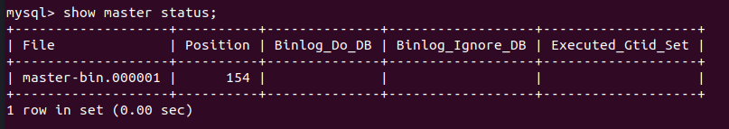

先改变密码策略，否则create user时会报错：

```mysql
SHOW VARIABLES LIKE 'validate_password%';
set global validate_password_policy=0; 
set global validate_password_mixed_case_count=0; 
set global validate_password_number_count=3;  
set global validate_password_special_char_count=0;
set global validate_password_length=3; 
```

```mysql
create user repl;
# 106.13.85.80是从服务器ip地址，表示从服务器用repl的账号以mysql的密码登录时，基于所有的数据库的所有的表的权限
GRANT REPLICATION SLAVE ON *.* TO 'repl'@'106.13.85.80' IDENTIFIED BY 'mysql';
flush privileges;
```

> 这里改变密码策略后还是报错不符合密码的规定。所以我这直接将这个检查插件给卸载了。
>
> uninstall plugin validate_password;
>
> 推测可能是之前设置密码的语句有问题？下次实验应该考虑换另一种方式设置密码，如果还不行，那就可能是插件的问题了。

#### 从服务器

同样地在/etc/my.cnf文件中添加以下配置：

```tex
server-id=2
relay-log-index=slave-relay-bin.index
relay-log=slave-relay-bin
```

进入mysql，执行以下命令：

```mysql
change master to master_host='1.15.172.26', master_port=3306, master_user='repl', master_password='mysql', master_log_file='master-bin.000007', master_log_pos=0;
start slave;
show slave status\G;
```

>这里有一个坑，当时租的是两个云服务器，用ifconfig查到的ip不是公网ip，而是内网ip，它进行了NAT转换。最好去控制台看看公网ip是多少。

最终结果如下：

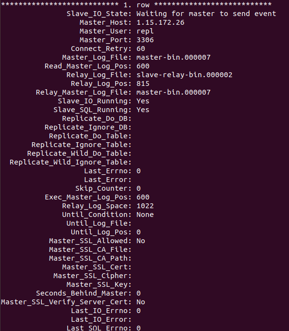

> 注意，从库只能读数据。
>
> 主库的mysql的版本可以与从库的mysql版本不一致，但是从库的版本必须要比主库的高（向后兼容）。

### 从本地数据库导入到云数据库

```shell
# 将所有的表以及数据都导入到o2o.sql文件中
mysqldump -uroot -p o2o > o2o.sql\
# 上传到master服务器
scp o2o.sql root@1.15.172.26:/root
```

切换到master服务器，进入mysql，导入sql文件：

```mysql
create database o2o;
use o2o;
source ~/o2o.sql;
```

这样，所有的表及其数据都已经导入到master上了，同时slave服务器上的数据也同步更新了。

### 允许本地服务器远程连接云数据库

在主服务器和从服务器授权增删改查给远程服务器，以`work`账号，`159753`为密码登录：

```mysql
GRANT select, insert, update, delete ON *.* TO 'work'@'%' IDENTIFIED BY '159753' WITH GRANT OPTION;
flush privileges;
```

### 重新配置jdbc

将locahost更改为远程服务器的地址，将账号和密码更改为`work`与`159753`。

```properties
jdbc.driver=com.mysql.cj.jdbc.Driver
jdbc.url=jdbc:mysql://1.15.172.26:3306/o2o?useUnicode=true&characterEncoding=utf8&serverTimezone=UTC
jdbc.username=work
jdbc.password=159753
```

### 代码层面的读写分离

主服务器负责写，从服务器负责读。

#### DynamicDataSource

`determineCurrentLookupKey`方法用来决定数据库的key。这个key会在spring-dao.xml文件中与datasource进行映射。

```java
public class DynamicDataSource extends AbstractRoutingDataSource {
    @Override
    protected Object determineCurrentLookupKey() {
        return DynamicDataSourceHolder.getDbType();
    }
}
```

#### DynamicDataSourceHolder

封装了两个key，类型是字符串，分别为`"master"`和`"slave"`。使用了ThreadLocal，因此是线程安全的。

```java
public class DynamicDataSourceHolder {
    private static Logger logger = LoggerFactory.getLogger(DynamicDataSourceHolder.class);
    private static ThreadLocal<String> contextHolder = new ThreadLocal<>();
    public static final String DB_MASTER = "master";
    public static final String DB_SLAVE = "slave";

    /**
     * 获取线程的DbType
     *
     * @return
     */
    public static String getDbType() {
        String db = contextHolder.get();
        if (db == null) {
            db = DB_MASTER;
        }
        return db;
    }

    /**
     * 设置线程的DbType
     *
     * @param str
     * @return
     */
    public static void setDbType(String str) {
        logger.debug("所使用的数据源为：" + str);
        contextHolder.set(str);
    }

    /**
     * 清理连接类型
     */
    public static void clearDbType() {
        contextHolder.remove();
    }
}
```

#### DynamicDataSourceInterceptor

实现一个拦截器，注意接口`Interceptor`是`org.apache.ibatis.plugin`下的。

用来拦截所有的sql操作，如果sql操作是事务的，那么交由主服务器；如果sql操作是增删改，那么交由主服务器。如果仅仅是查询，那么交由从服务器。

但是注意，查询操作中存在自增主键的情况，insert方法将调用`SELECT LAST_INSERT_ID()`来获取自增主键，因此查询语句中的`SELECT LAST_INSERT_ID()`需要交由主服务器。

```java
//增删改的操作全部被封装到了update中了
@Intercepts({
        @Signature(type = Executor.class, method = "update", args = {MappedStatement.class, Object.class}),
        @Signature(type = Executor.class, method = "query", args = {MappedStatement.class, Object.class, RowBounds.class, ResultHandler.class})})
public class DynamicDataSourceInterceptor implements Interceptor {
    private static Logger logger = LoggerFactory.getLogger(DynamicDataSourceInterceptor.class);
    private static final String REGEX = ".*insert\\u0020.*|.*delete\\u0020.*|.*update\\u0020.*";

    @Override
    public Object intercept(Invocation invocation) throws Throwable {
        //判断被拦截的方法是否是事务的（被@Transactional注解的）
        boolean synchronizationActive = TransactionSynchronizationManager.isActualTransactionActive();
        Object[] objects = invocation.getArgs();
        MappedStatement ms = (MappedStatement) objects[0];
        String lookupKey = DynamicDataSourceHolder.DB_MASTER;
        if (synchronizationActive != true) {//如果不是事务的
            // 读方法
            if (ms.getSqlCommandType().equals(SqlCommandType.SELECT)) {
                //selectKey为自增id查询主键(SELECT LAST_INSERT_ID())方法，使用主库
                //因为insert方法需要调用SELECT LAST_INSERT_ID()的方法(自增主键)，因此需要使用主库
                if (ms.getId().contains(SelectKeyGenerator.SELECT_KEY_SUFFIX)) {
                    lookupKey = DynamicDataSourceHolder.DB_MASTER;
                } else {
                    BoundSql boundSql = ms.getSqlSource().getBoundSql(objects[1]);
                    String sql = boundSql.getSql().toLowerCase(Locale.CHINA).replaceAll("[\\t\\n\\r]", " ");
                    if (sql.matches(REGEX)) {//增删改操作
                        lookupKey = DynamicDataSourceHolder.DB_MASTER;
                    } else {
                        lookupKey = DynamicDataSourceHolder.DB_SLAVE;
                    }
                }
            }
        } else {
            //所有事务的方法都经过主库
            lookupKey = DynamicDataSourceHolder.DB_MASTER;
        }
        logger.debug("设置方法[{}] use [{}] Strategy, SqlCommanType [{}]..", ms.getId(), lookupKey,
                ms.getSqlCommandType().name());
        DynamicDataSourceHolder.setDbType(lookupKey);
        return invocation.proceed();
    }

    @Override
    public Object plugin(Object target) {
        //Executor是用来支持增删改查的操作
        //如果是增删改查的操作就将它拦截下来
        if (target instanceof Executor) {
            return Plugin.wrap(target, this);
        }
        return target;
    }

    @Override
    public void setProperties(Properties properties) {

    }
}
```

#### jdbc.properties

新增了两个服务器url。

```properties
jdbc.driver=com.mysql.cj.jdbc.Driver
#主库：1.15.172.26
#从库：106.13.85.80
jdbc.master.url=jdbc:mysql://1.15.172.26:3306/o2o?useUnicode=true&characterEncoding=utf8&serverTimezone=UTC
jdbc.slave.url=jdbc:mysql://106.13.85.80:3306/o2o?useUnicode=true&characterEncoding=utf8&serverTimezone=UTC
jdbc.username=work
jdbc.password=159753
```

#### mybatis-config.xml

将自定义的`DynamicDataSourceInterceptor`配置到mybatis-config.xml中。

```xml
<plugins>
    <plugin interceptor="com.yikang.o2o.dao.split.DynamicDataSourceInterceptor">

    </plugin>
</plugins>
```

#### spring-dao.xml

定义一个抽象类型的连接池，提供公共属性。两个连接池分别为master与slave继承他，分别配置子集的ip与密码等。

配置动态数据源，将之前配置的两个连接池bean与holder中的两个字段`"master"`与`"slave"`映射上。

最后配置懒加载，当生成sql语句后才去生成数据源。

```xml
<!-- 2.数据库连接池 -->
<bean id="abstractDataSource" abstract="true" class="com.mchange.v2.c3p0.ComboPooledDataSource"
      destroy-method="close">
    <!-- c3p0连接池的私有属性 -->
    <property name="maxPoolSize" value="30"/>
    <property name="minPoolSize" value="10"/>
    <!-- 关闭连接后不自动commit -->
    <property name="autoCommitOnClose" value="false"/>
    <!-- 获取连接超时时间 -->
    <property name="checkoutTimeout" value="10000"/>
    <!-- 当获取连接失败重试次数 -->
    <property name="acquireRetryAttempts" value="2"/>
</bean>
<bean id="master" parent="abstractDataSource">
    <!--配置连接池属性-->
    <property name="driverClass" value="${jdbc.driver}"/>
    <property name="jdbcUrl" value="${jdbc.master.url}"/>
    <property name="user" value="${jdbc.username}"/>
    <property name="password" value="${jdbc.password}"/>
</bean>
<bean id="slave" parent="abstractDataSource">
    <!--配置连接池属性-->
    <property name="driverClass" value="${jdbc.driver}"/>
    <property name="jdbcUrl" value="${jdbc.slave.url}"/>
    <property name="user" value="${jdbc.username}"/>
    <property name="password" value="${jdbc.password}"/>
</bean>
<!--配置动态数据源，这里的targetDataSources就是路由数据源所对应的名称-->
<bean id="dynamicDataSource" class="com.yikang.o2o.dao.split.DynamicDataSource">
    <property name="targetDataSources">
        <map>
            <!--value-ref与上面定义的bean的id保持对应-->
            <!--key与DynamicDataSource类determineCurrentLookupKey方法返回的值保持一致-->
            <!--determineCurrentLookupKey返回的是holder中定义的两种字段-->
            <entry value-ref="master" key="master"></entry>
            <entry value-ref="slave" key="slave"></entry>
        </map>
    </property>
</bean>
<!--懒加载，当生成sql语句后才去生成数据源-->
<bean id="dataSource" class="org.springframework.jdbc.datasource.LazyConnectionDataSourceProxy">
    <property name="targetDataSource">
        <ref bean="dynamicDataSource"></ref>
    </property>
</bean>
```

## junit测试的顺序

在测试时，应该保证对数据库操作的回环，即测试前与测试后数据库是一致的。一般依次进行插入、查询、修改、删除等操作。那么这需要保证junit测试方法的执行顺序。

可以通过注解`@FixMethodOrder(MethodSorters.NAME_ASCENDING)`来实现，使得方法的执行顺序按照方法名来。

例如：

```java
@FixMethodOrder(MethodSorters.NAME_ASCENDING)
public class ProductCategoryDaoTest extends BaseTest {

    @Autowired
    private ProductCategoryDao productCategoryDao;
    
	@Test
    public void testABatchInsertProductCategory() {
        ProductCategory productCategory = new ProductCategory();
        productCategory.setProductCategoryName("商品类别1");
        productCategory.setPriority(0);
        productCategory.setCreateTime(new Date());
        productCategory.setShopId(11L);
        ProductCategory productCategory2 = new ProductCategory();
        productCategory2.setProductCategoryName("商品类别2");
        productCategory2.setPriority(1);
        productCategory2.setCreateTime(new Date());
        productCategory2.setShopId(11L);
        List<ProductCategory> list = new ArrayList<>();
        list.add(productCategory);
        list.add(productCategory2);
        int effectedNum = productCategoryDao.batchInsertProductCategory(list);
        assertEquals(2, effectedNum);
    }

    @Test
    public void testBQueryByShopId() {
        long shopId = 11;
        List<ProductCategory> productCategories = productCategoryDao.queryProductCategoryList(shopId);
        for (ProductCategory productCategory : productCategories) {
            System.out.println(productCategory.getProductCategoryName());
        }
    }

    @Test
    public void testCDeleteProductCategory() {
        long shopId = 11L;
        List<ProductCategory> list = productCategoryDao.queryProductCategoryList(shopId);
        for (ProductCategory productCategory : list) {
            if ("商品类别1".equals(productCategory.getProductCategoryName())
                    || "商品类别2".equals(productCategory.getProductCategoryName())) {
                int effectedNum = productCategoryDao.deleteProductCategory(productCategory.getProductCategoryId(), shopId);
                assertEquals(1, effectedNum);
            }
        }
    }

}
```

## 对关键配置信息进行DES加密

此前连接数据库的账号和密码都是明文，容易泄露，因此需要对这些关键配置信息进行DES加密。

### DESUtil

首先编写一个用于加密和解密的工具类，因为需要先得到加密后的字符串填写到properties文件中，然后当spring读取配置时解密，因此使用的是对称加密。

```java
public class DESUtil {

   private static Key key;
   // 设置密钥key
   private static String KEY_STR = "myKey";
   private static String CHARSETNAME = "UTF-8";
   private static String ALGORITHM = "DES";

   static {
      try {
         // 生成DES算法对象
         KeyGenerator generator = KeyGenerator.getInstance(ALGORITHM);
         // 运用SHA1安全策略
         SecureRandom secureRandom = SecureRandom.getInstance("SHA1PRNG");
         // 设置上密钥种子
         secureRandom.setSeed(KEY_STR.getBytes());
         // 初始化基于SHA1的算法对象
         generator.init(secureRandom);
         // 生成密钥对象
         key = generator.generateKey();
         generator = null;
      } catch (Exception e) {
         throw new RuntimeException(e);
      }
   }

   /**
    * 获取加密后的信息
    * 
    */
   public static String getEncryptString(String str) {
      // 基于BASE64编码，接收byte[]并转换成String
      BASE64Encoder base64encoder = new BASE64Encoder();
      try {
         // 按UTF8编码
         byte[] bytes = str.getBytes(CHARSETNAME);
         // 获取加密对象
         Cipher cipher = Cipher.getInstance(ALGORITHM);
         // 初始化密码信息
         cipher.init(Cipher.ENCRYPT_MODE, key);
         // 加密
         byte[] doFinal = cipher.doFinal(bytes);
         // byte[]to encode好的String并返回
         return base64encoder.encode(doFinal);
      } catch (Exception e) {
         // TODO: handle exception
         throw new RuntimeException(e);
      }
   }

   /**
    * 获取解密之后的信息
    *
    */
   public static String getDecryptString(String str) {
      // 基于BASE64编码，接收byte[]并转换成String
      BASE64Decoder base64decoder = new BASE64Decoder();
      try {
         // 将字符串decode成byte[]
         byte[] bytes = base64decoder.decodeBuffer(str);
         // 获取解密对象
         Cipher cipher = Cipher.getInstance(ALGORITHM);
         // 初始化解密信息
         cipher.init(Cipher.DECRYPT_MODE, key);
         // 解密
         byte[] doFinal = cipher.doFinal(bytes);
         // 返回解密之后的信息
         return new String(doFinal, CHARSETNAME);
      } catch (Exception e) {
         // TODO: handle exception
         throw new RuntimeException(e);
      }
   }

   public static void main(String[] args) {
      System.out.println(getEncryptString("work"));
      System.out.println(getEncryptString("159753"));
   }

}
```

### PropertyPlaceholderConfigurer子类

定义一个继承自`PropertyPlaceholderConfigurer`的子类，这个子类将会被spring-dao.xml配置文件所引用。当spring读取配置文件中的属性时，将会调用`convertProperty`方法获得对应属性的值。可以通过该方法来选择性地将被加密的字符串解密返回。

```java
package com.yikang.o2o.util;

import org.springframework.beans.factory.config.PropertyPlaceholderConfigurer;

public class EncryptPropertyPlaceholderConfigurer extends PropertyPlaceholderConfigurer {

    // 需要加密的字段数组
    private String[] encryptPropNames = {"jdbc.username", "jdbc.password"};

    /**
     * 对关键的属性进行转换
     */
    @Override
    protected String convertProperty(String propertyName, String propertyValue) {
        if (isEncryptProp(propertyName)) {
            // 对已加密的字段进行解密工作
            String decryptValue = DESUtil.getDecryptString(propertyValue);
            return decryptValue;
        } else {
            return propertyValue;
        }
    }

    /**
     * 该属性是否已加密
     *
     * @param propertyName
     * @return
     */
    private boolean isEncryptProp(String propertyName) {
        // 若等于需要加密的field，则已经被加密过了
        for (String encryptpropertyName : encryptPropNames) {
            if (encryptpropertyName.equals(propertyName))
                return true;
        }
        return false;
    }
}
```

### 加密后的jdbc.properties

将账号与密码用加密后的字符串代替。

```properties
jdbc.driver=com.mysql.cj.jdbc.Driver
#主库：1.15.172.26
#从库：106.13.85.80
jdbc.master.url=jdbc:mysql://1.15.172.26:3306/o2o?useUnicode=true&characterEncoding=utf8&serverTimezone=UTC
jdbc.slave.url=jdbc:mysql://106.13.85.80:3306/o2o?useUnicode=true&characterEncoding=utf8&serverTimezone=UTC
jdbc.username=zCKAAEaFQUI=
jdbc.password=IkzrzXv24ew=
```

### spring-dao.xml引用PropertyPlaceholderConfigurer子类

之前的spring-dao.xml关于properties文件的导入是以下语句：

```xml
<context:property-placeholder location="classpath:jdbc.properties"/>
```

现在将它替换成如下：引用我们之前定义的PropertyPlaceholderConfigurer子类：

```xml
<!--EncryptPropertyPlaceholderConfigurer为自定义的具备解密的类，继承自PropertyPlaceholderConfigurer-->
<bean class="com.yikang.o2o.util.EncryptPropertyPlaceholderConfigurer">
    <property name="locations">
        <list>
            <value>classpath:jdbc.properties</value>
        </list>
    </property>
    <property name="fileEncoding" value="UTF-8"/>
</bean>
```

注意，spring的配置文件都是共通的，后续的redis的properties也可以在这个bean下的list标签下引用。

## 引入缓存技术

### 服务器安装并配置Redis

将redis解压，修改redis.conf，设置支持远程连接以及后台运行：

将bind 127.0.0.1这句话注释掉，同时找到daemonize字段设置为yes，将protected-mode字段设置为no。

到redis目录下执行`make`命令，安装redis。

启动redis服务：

```shell
src/redis-server redis.conf
```

连接测试：

```shell
[root@VM-0-12-centos redis-4.0.2] src/redis-cli 
127.0.0.1:6379> ping
PONG
```

### redis.properties

```properties
redis.hostname=1.15.172.26
redis.port=6379
redis.database=0
redis.pool.maxActive=100
redis.pool.maxIdle=20
redis.pool.maxWait=3000
redis.pool.testOnBorrow=true
```

### spring-dao.xml

```xml
<!--将jdbc与redis的properties配置引入-->
<bean class="com.yikang.o2o.util.EncryptPropertyPlaceholderConfigurer">
    <property name="locations">
        <list>
            <value>classpath:jdbc.properties</value>
            <value>classpath:redis.properties</value>
        </list>
    </property>
    <property name="fileEncoding" value="UTF-8"/>
</bean>
```

### JedisPoolWriper

这个类就是JedisPool的包装类，给Jedispool提供get和set方法。这个类将会被spring-redis.xml作为bean注入，这个bean将会被注入到其他几个工具类bean中。

```java
/**
 * 强指定redis的JedisPool接口构造函数，这样才能在centos成功创建jedispool
 */
public class JedisPoolWriper {
    /**
     * Redis连接池对象
     */
    private JedisPool jedisPool;

    public JedisPoolWriper(final JedisPoolConfig poolConfig, final String host,
                           final int port) {
        try {
            jedisPool = new JedisPool(poolConfig, host, port);
        } catch (Exception e) {
            e.printStackTrace();
        }
    }

    /**
     * 获取Redis连接池对象
     *
     * @return
     */
    public JedisPool getJedisPool() {
        return jedisPool;
    }

    /**
     * 注入Redis连接池对象
     *
     * @param jedisPool
     */
    public void setJedisPool(JedisPool jedisPool) {
        this.jedisPool = jedisPool;
    }

}
```

### JedisUtil

这是一个工具类，它持有JedisPool的引用，向外提供不同类型key的各种方法。

不同类型的key在JedisUtil类中对应不同的子类，这些子类将会配置在spring-redis.xml中作为单例的bean，同时接受JedisPoolWriper类对象对应的bean来持有JedisPool的引用，在所需要的场景直接注入需要类型的bean即可。

各种类型的增删改之类的方法这里省略。

```java
public class JedisUtil {
    /**
     * 缓存生存时间
     */
    private final int expire = 60000;
    /**
     * 操作Key的方法
     */
    public Keys KEYS;
    /**
     * 对存储结构为String类型的操作
     */
    public Strings STRINGS;
    /**
     * 对存储结构为List类型的操作
     */
    public Lists LISTS;
    /**
     * 对存储结构为Set类型的操作
     */
    public Sets SETS;
    /**
     * 对存储结构为HashMap类型的操作
     */
    public Hash HASH;

    /**
     * Redis连接池对象
     */
    private JedisPool jedisPool;
    
    public class Keys{}
    public class Strings{}
    public class Lists{}
    public class Sets{}
    public class Hash{}
}
```

### spring-redis.xml

```xml
<?xml version="1.0" encoding="UTF-8"?>
<beans xmlns="http://www.springframework.org/schema/beans"
   xmlns:xsi="http://www.w3.org/2001/XMLSchema-instance" xmlns:context="http://www.springframework.org/schema/context"
   xsi:schemaLocation="http://www.springframework.org/schema/beans
    http://www.springframework.org/schema/beans/spring-beans.xsd
    http://www.springframework.org/schema/context
    http://www.springframework.org/schema/context/spring-context.xsd">
   <!-- Redis连接池的设置 -->
   <bean id="jedisPoolConfig" class="redis.clients.jedis.JedisPoolConfig">
      <!-- 控制一个pool可分配多少个jedis实例 -->
      <property name="maxTotal" value="${redis.pool.maxActive}" />
      <!-- 连接池中最多可空闲maxIdle个连接 ，这里取值为20，表示即使没有数据库连接时依然可以保持20空闲的连接，而不被清除，随时处于待命状态。 -->
      <property name="maxIdle" value="${redis.pool.maxIdle}" />
      <!-- 最大等待时间:当没有可用连接时,连接池等待连接被归还的最大时间(以毫秒计数),超过时间则抛出异常 -->
      <property name="maxWaitMillis" value="${redis.pool.maxWait}" />
      <!-- 在获取连接的时候检查有效性 -->
      <property name="testOnBorrow" value="${redis.pool.testOnBorrow}" />
   </bean>

   <!-- 创建Redis连接池，并做相关配置 -->
   <bean id="jedisWritePool" class="com.yikang.o2o.cache.JedisPoolWriper"
      depends-on="jedisPoolConfig">
      <constructor-arg index="0" ref="jedisPoolConfig" />
      <constructor-arg index="1" value="${redis.hostname}" />
      <constructor-arg index="2" value="${redis.port}" type="int" />
   </bean>

   <!-- 创建Redis工具类，封装好Redis的连接以进行相关的操作 -->
   <bean id="jedisUtil" class="com.yikang.o2o.cache.JedisUtil" scope="singleton">
      <property name="jedisPool">
         <ref bean="jedisWritePool" />
      </property>
   </bean>
   <!-- Redis的key操作 -->
   <bean id="jedisKeys" class="com.yikang.o2o.cache.JedisUtil$Keys"
      scope="singleton">
      <constructor-arg ref="jedisUtil"></constructor-arg>
   </bean>
   <!-- Redis的Strings操作 -->
   <bean id="jedisStrings" class="com.yikang.o2o.cache.JedisUtil$Strings"
      scope="singleton">
      <constructor-arg ref="jedisUtil"></constructor-arg>
   </bean>
   <!-- Redis的Lists操作 -->
   <bean id="jedisLists" class="com.yikang.o2o.cache.JedisUtil$Lists"
      scope="singleton">
      <constructor-arg ref="jedisUtil"></constructor-arg>
   </bean>
   <!-- Redis的Sets操作 -->
   <bean id="jedisSets" class="com.yikang.o2o.cache.JedisUtil$Sets"
      scope="singleton">
      <constructor-arg ref="jedisUtil"></constructor-arg>
   </bean>
   <!-- Redis的HashMap操作 -->
   <bean id="jedisHash" class="com.yikang.o2o.cache.JedisUtil$Hash"
      scope="singleton">
      <constructor-arg ref="jedisUtil"></constructor-arg>
   </bean>
</beans>    
```

### 缓存方案

这里采用的是非常简单的方案，对于所有取的操作，如果redis中没有对应key的数据（这个key自定义，能区分想要查询的信息即可），那么从数据库中取出放入redis中，然后返回；如果redis中存在对应key的数据，那么直接从redis中取。对于所有写的操作，全部走数据库，并且将redis中对应key的缓存清空。

Object与String之间的转化用jakson包来实现。

```java
//obj->string
ObjectMapper mapper = new ObjectMapper();
String jsonString = mapper.writeValueAsString(headLineList);

//string->obj
String jsonString = jedisStrings.get(key);
// 指定要将string转换成的集合类型
JavaType javaType = mapper.getTypeFactory().constructParametricType(ArrayList.class, HeadLine.class);
HeadLine headLineList = mapper.readValue(jsonString, javaType);
```

## MySql主从数据库重置

没想到过了几天从服务器的数据库就被劫持了=。=，说要拿比特币交换。然后我就把数据库删了，重新建立主从同步。

在从服务器上将主从关联重置：

```mysql
stop slave;
reset slave;
```

然后重启。之后将主服务器上的数据库备份成sql文件，将数据库删除（如果可以重新定位到主服务器的数据库为空时的log file以及log pos，那么就不需要删除数据库然后再还原了，但是我并没有记录下来，所以只好重新由sql文件导入，以便将所有的操作同步更新到从数据库）。

注意，在导入sql文件之前应该重新建立主从关联，且要注意保证master_log_file以及master_log_pos要一致。这个可以通过`show master status`来查看。

## 密码加密存储

数据库中的密码需要被加密。登录验证时，将用户输入的密码加密，与数据库中的密文进行匹配。

这里采用的是MD5加密。

```java
public class MD5 {

	/**
	 * 对传入的String进行MD5加密
	 * 
	 * @param s
	 * @return
	 */
	public static final String getMd5(String s) {
		// 16进制数组
		char hexDigits[] = { '5', '0', '5', '6', '2', '9', '6', '2', '5', 'q', 'b', 'l', 'e', 's', 's', 'y' };
		try {
			char str[];
			// 将传入的字符串转换成byte数组
			byte strTemp[] = s.getBytes();
			// 获取MD5加密对象
			MessageDigest mdTemp = MessageDigest.getInstance("MD5");
			// 传入需要加密的目标数组
			mdTemp.update(strTemp);
			// 获取加密后的数组
			byte md[] = mdTemp.digest();
			int j = md.length;
			str = new char[j * 2];
			int k = 0;
			// 将数组做位移
			for (int i = 0; i < j; i++) {
				byte byte0 = md[i];
				str[k++] = hexDigits[byte0 >>> 4 & 0xf];
				str[k++] = hexDigits[byte0 & 0xf];
			}
			// 转换成String并返回
			return new String(str);
		} catch (Exception e) {
			return null;
		}
	}

	public static void main(String[] args) {
		System.out.println(MD5.getMd5("123456"));
	}
}
```

## 拦截器实现登录验证以及权限认证

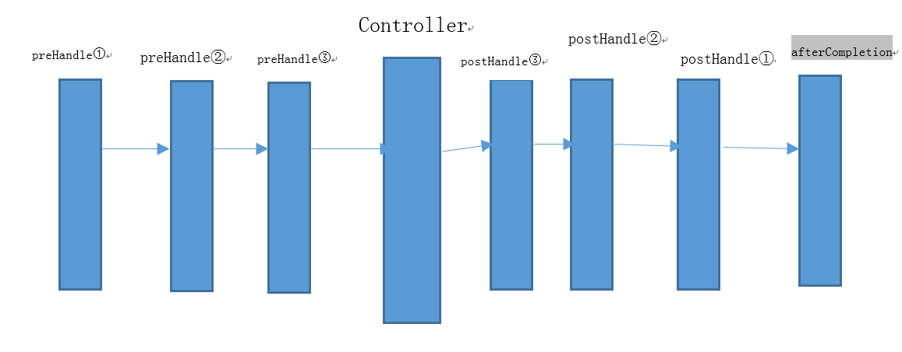

当设置多个拦截器时，先按顺序调用preHandle方法，然后逆序调用每个拦截器的postHandle和afterCompletion方法。

这里写一个例子，拦截实现登录验证：

### ShopLoginInterceptor

```java
/**
 * 店家管理系统登录验证拦截器
 * 
 */
public class ShopLoginInterceptor extends HandlerInterceptorAdapter {
	/**
	 * 主要做事前拦截，即用户操作发生前，改写preHandle里的逻辑，进行拦截
	 */
	@Override
	public boolean preHandle(HttpServletRequest request, HttpServletResponse response, Object handler)
			throws Exception {
		// 从session中取出用户信息来
		Object userObj = request.getSession().getAttribute("user");
		if (userObj != null) {
			// 若用户信息不为空则将session里的用户信息转换成PersonInfo实体类对象
			PersonInfo user = (PersonInfo) userObj;
			// 做空值判断，确保userId不为空并且该帐号的可用状态为1，并且用户类型为店家
			if (user != null && user.getUserId() != null && user.getUserId() > 0 && user.getEnableStatus() == 1)
				// 若通过验证则返回true,拦截器返回true之后，用户接下来的操作得以正常执行
				return true;
		}
		// 若不满足登录验证，则直接跳转到帐号登录页面
		PrintWriter out = response.getWriter();
		out.println("<html>");
		out.println("<script>");
		out.println("window.open ('" + request.getContextPath() + "/local/login?usertype=2','_self')");
		out.println("</script>");
		out.println("</html>");
		return false;
	}
}
```
### spring-web.xml

```xml
<mvc:interceptors>
	<!-- 校验是否已登录了店家管理系统的拦截器 -->
	<mvc:interceptor>
		<mvc:mapping path="/shopadmin/**" />
		<bean id="ShopInterceptor"
			class="com.yikang.o2o.interceptor.shopadmin.ShopLoginInterceptor" />
	</mvc:interceptor>
	<!-- 校验是否对该店铺有操作权限的拦截器 -->
	<mvc:interceptor>
		<mvc:mapping path="/shopadmin/**" />
		<!-- shoplist page -->
		<mvc:exclude-mapping path="/shopadmin/shoplist" />
		<mvc:exclude-mapping path="/shopadmin/getshoplist" />
		<!-- shopregister page -->
		<mvc:exclude-mapping path="/shopadmin/getshopinitinfo" />
		<mvc:exclude-mapping path="/shopadmin/registershop" />
		<mvc:exclude-mapping path="/shopadmin/shopoperation" />
		<!-- shopmanage page -->
		<mvc:exclude-mapping path="/shopadmin/shopmanagement" />
		<mvc:exclude-mapping path="/shopadmin/getshopmanagementinfo" />
		<bean id="ShopPermissionInterceptor"
			class="com.yikang.o2o.interceptor.shopadmin.ShopPermissionInterceptor" />
	</mvc:interceptor>
	<!-- 超级管理员系统拦截部分 -->
	<mvc:interceptor>
		<mvc:mapping path="/superadmin/**" />
		<mvc:exclude-mapping path="/superadmin/login" />
		<mvc:exclude-mapping path="/superadmin/logincheck" />
		<mvc:exclude-mapping path="/superadmin/main" />
		<mvc:exclude-mapping path="/superadmin/top" />
		<mvc:exclude-mapping path="/superadmin/clearcache4area" />
		<mvc:exclude-mapping path="/superadmin/clearcache4headline" />
		<mvc:exclude-mapping path="/superadmin/clearcache4shopcategory" />
		<bean id="SuperAdminLoginInterceptor"
			class="com.yikang.o2o.interceptor.superadmin.SuperAdminLoginInterceptor" />
	</mvc:interceptor>
</mvc:interceptors>
```
## SpringMVC迁移至SpringBoot

注意，这里迁移的是未配置mysql主从同步的版本！

### application.properties

```properties
server.port=8080
#默认是直接通过/访问的，这样设置使得需要加上/o2o前缀才能访问
server.servlet.context-path=/o2o

#DataSource
#数据库驱动
jdbc.driver=com.mysql.cj.jdbc.Driver
#数据库链接
jdbc.url=jdbc:mysql://1.15.172.26:3306/o2o?useUnicode=true&characterEncoding=utf8&useSSL=false&serverTimezone=UTC
#数据库用户名（已加密）
jdbc.username=WnplV/ietfQ=
#数据库密码（已加密）
jdbc.password=RxQNfAQRZdFbfLs72BFqeQ==

#Mybatis
mybatis_config_file=mybatis-config.xml
mapper_path=/mapper/**.xml
type_alias_package=com.yikang.entity

#Redis配置
redis.hostname=127.0.0.1
redis.port=6379
redis.pool.maxActive=100
redis.pool.maxIdle=20
redis.pool.maxWait=3000
redis.pool.testOnBorrow=true

#Kaptcha的配置
kaptcha.border=no
kaptcha.textproducer.font.color=red
kaptcha.image.width=135
kaptcha.textproducer.char.string=ACDEFHKPRSTWX345679
kaptcha.image.height=50
kaptcha.textproducer.font.size=43
kaptcha.noise.color=black
kaptcha.textproducer.char.length=4
kaptcha.textproducer.font.names=Arial

#Path管理
win.base.path=D:/projectdev/image
linux.base.path=/Users/baidu/work/image
shop.relevant.path=/upload/images/item/shop/
headline.relevant.path=/upload/images/item/headtitle/
shopcategory.relevant.path=/upload/images/item/shopcategory/
```

### mybatis-config.xml

这个文件与SpringMVC的没什么不同。

```xml
<?xml version="1.0" encoding="UTF-8"?>
<!DOCTYPE configuration
        PUBLIC "-//mybatis.org//DTD Config 3.0//EN"
        "http://mybatis.org/dtd/mybatis-3-config.dtd">
<configuration>
    <!-- 配置全局属性 -->
    <settings>
        <!-- 使用jdbc的getGeneratedKeys获取数据库自增主键值 -->
        <setting name="useGeneratedKeys" value="true" />

        <!-- 使用列标签替换列别名 默认:true -->
        <setting name="useColumnLabel" value="true" />

        <!-- 开启驼峰命名转换:Table{create_time} -> Entity{createTime} -->
        <setting name="mapUnderscoreToCamelCase" value="true" />
    </settings>
</configuration>
```

### Dao层的迁移

在原来的SpringMVC的spring-dao.xml中，我们配置了三个bean：dataSource, sqlSessionFactory以及用于扫描Dao接口包的bean。

在Springboot中我们需要用类的方式实现前两个，而第三个只需要通过注解来扫描。

我们会发现SpringBoot的配置类是与旧xml中的bean的配置是一一对应的。

以下是原spring-dao.xml中的配置：

```xml
<?xml version="1.0" encoding="UTF-8"?>
<beans>
    <context:property-placeholder location="classpath:jdbc.properties"/>

    <!-- 2.数据库连接池 -->
    <bean id="dataSource" class="com.mchange.v2.c3p0.ComboPooledDataSource">
        <property name="driverClass" value="${jdbc.driver}"/>
        <!-- 省略 -->
    </bean>

    <!-- 3.配置SqlSessionFactory对象 -->
    <bean id="sqlSessionFactory" class="org.mybatis.spring.SqlSessionFactoryBean">
        <property name="dataSource" ref="dataSource"/>
        <!-- 省略 -->
    </bean>

    <!-- 4.配置扫描Dao接口包，动态实现Dao接口，注入到spring容器中 -->
    <bean class="org.mybatis.spring.mapper.MapperScannerConfigurer">
        <property name="sqlSessionFactoryBeanName" value="sqlSessionFactory"/>
        <!-- 省略 -->
    </bean>
</beans>
```

#### bean：dataSource

```java
@Configuration
// 配置mybatis mapper的扫描路径
@MapperScan("com.yikang.o2o.dao")
public class DataSourceConfiguration {
	@Value("${jdbc.driver}")
	private String jdbcDriver;
	@Value("${jdbc.url}")
	private String jdbcUrl;
	@Value("${jdbc.username}")
	private String jdbcUsername;
	@Value("${jdbc.password}")
	private String jdbcPassword;

	/**
	 * 生成与spring-dao.xml对应的bean dataSource
	 * 
	 * @return
	 * @throws PropertyVetoException
	 */
	@Bean(name = "dataSource")
	public ComboPooledDataSource createDataSource() throws PropertyVetoException {
		// 生成datasource实例
		ComboPooledDataSource dataSource = new ComboPooledDataSource();
		// 跟配置文件一样设置以下信息
		// 驱动
		dataSource.setDriverClass(jdbcDriver);
		// 数据库连接URL
		dataSource.setJdbcUrl(jdbcUrl);
		// 设置用户名
		dataSource.setUser(DESUtil.getDecryptString(jdbcUsername));
		// 设置用户密码
		dataSource.setPassword(DESUtil.getDecryptString(jdbcPassword));
		// 配置c3p0连接池的私有属性
		// 连接池最大线程数
		dataSource.setMaxPoolSize(30);
		// 连接池最小线程数
		dataSource.setMinPoolSize(10);
		dataSource.setInitialPoolSize(10);
		// 关闭连接后不自动commit
		dataSource.setAutoCommitOnClose(false);
		// 连接超时时间
		dataSource.setCheckoutTimeout(10000);
		// 连接失败重试次数
		dataSource.setAcquireRetryAttempts(2);
		return dataSource;
	}

}
```

#### bean：sqlSessionFactory

注意，静态变量不能直接通过`@Value()`来注入值，需要一个非静态的set方法，在该方法上用`@Value()`来注解即可。

`sqlSessionFactory`需要引用我们配置好的dataSource，我们只需要把它注入进来就行了。

```java
@Configuration
public class SessionFactoryConfiguration {
	// mybatis-config.xml配置文件的路径
	private static String mybatisConfigFile;

	@Value("${mybatis_config_file}")
	public void setMybatisConfigFile(String mybatisConfigFile) {
		SessionFactoryConfiguration.mybatisConfigFile = mybatisConfigFile;
	}

	// mybatis mapper文件所在路径
	private static String mapperPath;

	@Value("${mapper_path}")
	public void setMapperPath(String mapperPath) {
		SessionFactoryConfiguration.mapperPath = mapperPath;
	}

	// 实体类所在的package
	@Value("${type_alias_package}")
	private String typeAliasPackage;

	@Autowired
	private DataSource dataSource;

	/**
	 * 创建sqlSessionFactoryBean 实例 并且设置configtion 设置mapper 映射路径 设置datasource数据源
	 * 
	 * @return
	 * @throws IOException
	 */
	@Bean(name = "sqlSessionFactory")
	public SqlSessionFactoryBean createSqlSessionFactoryBean() throws IOException {
		SqlSessionFactoryBean sqlSessionFactoryBean = new SqlSessionFactoryBean();
		// 设置mybatis configuration 扫描路径
		sqlSessionFactoryBean.setConfigLocation(new ClassPathResource(mybatisConfigFile));
		// 添加mapper 扫描路径
		PathMatchingResourcePatternResolver pathMatchingResourcePatternResolver = new PathMatchingResourcePatternResolver();
		String packageSearchPath = ResourcePatternResolver.CLASSPATH_ALL_URL_PREFIX + mapperPath;
		sqlSessionFactoryBean.setMapperLocations(pathMatchingResourcePatternResolver.getResources(packageSearchPath));
		// 设置dataSource
		sqlSessionFactoryBean.setDataSource(dataSource);
		// 设置typeAlias 包扫描路径
		sqlSessionFactoryBean.setTypeAliasesPackage(typeAliasPackage);
		return sqlSessionFactoryBean;
	}

}
```

## 其他坑

### mybatis中#{}与${}

写like语句的时候 一般都会写成 like '% %' 在mybatis里面写就是应该是 like '%\${name} %' 而不是 '%#{name} %' 。

\${name} 是不带单引号的，而#{name} 是带单引号的。

```xml
<if
   test="productCondition.productCategory!=null
    and productCondition.productCategory.productCategoryId!=null">
   and product_category_id =
   #{productCondition.productCategory.productCategoryId}
</if>
<if test="productCondition.productName!=null">
   and product_name like '%${productCondition.productName}%'
</if>
```

### 相对路径访问图片

因为数据库中存储图片的路径使用的是相对路径，因此前端访问图片时有两种办法：

+ 后端从数据库中取出相对路径后再进行拼接完整的url返回前端
+ 配置tomcat自动解析

这里使用第二种方式。

打开tomcat的conf目录下的server.xml文件，在`Host`标签下添加`Context`标签：

```xml
<Context docBase="/home/yikang/publicPro/upload" path="/upload"/>
```

表示如果发现有/upload路径，那么tomcat会将他替换成/home/yikang/publicPro/upload。

### tomcat部署

在服务器上安装tomcat后，需要配置server.xml，因为数据库存储的是相对路径，就是上一个问题所讲的：

```xml
<Context docBase="/home/yikang/publicPro/upload" path="/upload"/>
```

修改后，启动tomcat发现无法访问，执行./shutdown.sh命令报错，发现它根本就没有启动过。

可以用以下命令查看端口占用情况，发现根本就没有启动过。

```shell
netstat -tunlp|grep 8080
netstat -tunlp|grep 8005
```

查看logs目录下的catalina.out 文件，查看后1000行：

```shell
tail -n 1000 catalina.out
```

发现是因为服务器上没有创建目录/home/yikang/publicPro/upload：


创建后成功运行tomcat。

注意，访问url需要带上端口号8080/项目名，如果将tomcat的端口改成默认端口80就可以把端口省略，如果想把项目名省略，可以在server.xml里配置Context：

```java
<Context docBase="../webapps/o2o/" path="/" />
```

war包是放在tomcat的webapps目录下，然后tomcat会自动将war解压成o2o目录，其中包含所有的文件包括资源文件js、css等。

### Redis的保护模式

远程连接Redis时，报错：

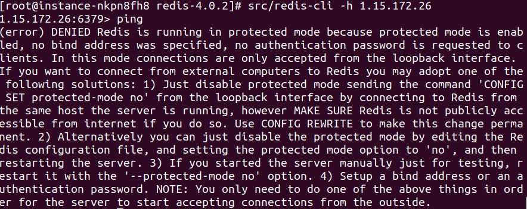

这需要去修改redis.conf的protected-mode字段为no。然后重启redis。

```shell
[root@VM-0-12-centos redis-4.0.2] ps -e |grep redis
31697 ?        00:00:13 redis-server
[root@VM-0-12-centos redis-4.0.2] ps -ef |grep redis
root     11536 11213  0 16:59 pts/0    00:00:00 grep --color=auto redis
root     31697     1  0 11:33 ?        00:00:13 src/redis-server *:6379
[root@VM-0-12-centos redis-4.0.2] kill -9 31697
[root@VM-0-12-centos redis-4.0.2] ps -e |grep redis
[root@VM-0-12-centos redis-4.0.2] src/redis-server redis.conf 
11695:C 24 Mar 17:00:26.129  oO0OoO0OoO0Oo Redis is starting oO0OoO0OoO0Oo
11695:C 24 Mar 17:00:26.129  Redis version=4.0.2, bits=64, commit=00000000, modified=0, pid=11695, just started
11695:C 24 Mar 17:00:26.129  Configuration loaded
```

