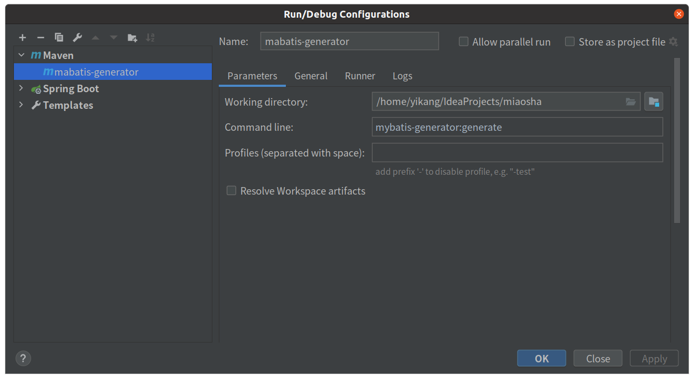

# miaosha

## 前期准备

用maven的quickstart模板创建项目，在src/main目录下创建resources资源文件夹，标记为资源文件夹，然后创建application.yaml
配置文件。

配置pom文件：

```xml
<parent>
    <groupId>org.springframework.boot</groupId>
    <artifactId>spring-boot-starter-parent</artifactId>
    <version>2.4.3</version>
</parent>
<dependencies>

    <dependency>
        <groupId>org.springframework.boot</groupId>
        <artifactId>spring-boot-starter-web</artifactId>
    </dependency>

    <dependency>
        <groupId>org.springframework.boot</groupId>
        <artifactId>spring-boot-starter-test</artifactId>
        <scope>test</scope>
    </dependency>

    <dependency>
        <groupId>junit</groupId>
        <artifactId>junit</artifactId>
        <version>4.11</version>
        <scope>test</scope>
    </dependency>
</dependencies>
```

在入口类添加@EnableAutoConfiguration，开启springboot的自动化配置，与SpringMVC不同的是，不需要xml等配置文件进行配置，这个注解将会自动扫描所有的bean。

然后在该入口类启动SpringApplication。

```java
@EnableAutoConfiguration
public class App {
    public static void main(String[] args) {
        System.out.println("Hello World!");
        SpringApplication.run(App.class, args);
    }
}
```

## Mybatis自动生成

首先要新建数据库，建库建表之后才能使用插件。

这个插件能自动生成dataobject、dao、以及dao对应的mapper，包括常用的各种操作。

### 配置pom

```xml
<plugin>
    <groupId>org.mybatis.generator</groupId>
    <artifactId>mybatis-generator-maven-plugin</artifactId>
    <version>1.3.5</version>
    <dependencies>
        <dependency>
            <groupId>org.mybatis.generator</groupId>
            <artifactId>mybatis-generator-core</artifactId>
            <version>1.3.5</version>
        </dependency>
        <dependency>
            <groupId>mysql</groupId>
            <artifactId>mysql-connector-java</artifactId>
            <version>5.1.41</version>
        </dependency>
    </dependencies>
    <executions>
        <execution>
            <id>mybatis generator</id>
            <phase>package</phase>
            <goals>
                <goal>generate</goal>
            </goals>
        </execution>
    </executions>
    <configuration>
        <!--允许移动生成的文件-->
        <verbose>true</verbose>
        <!--允许自动覆盖文件，注意合作时尽量不要开启-->
        <overwrite>true</overwrite>
        <configurationFile>
            src/main/resources/mybatis-generator.xml
        </configurationFile>
    </configuration>
</plugin>
```

### mybatis-generator.xml

```xml
<?xml version="1.0" encoding="UTF-8" ?>
<!DOCTYPE generatorConfiguration PUBLIC "-//mybatis.org//DTD MyBatis Generator Configuration 1.0//EN"
        "http://mybatis.org/dtd/mybatis-generator-config_1_0.dtd" >
<generatorConfiguration>
    <!-- 一个数据库一个context -->
    <context id="DB2Tables" targetRuntime="Mybatis3">
        <!-- jdbc连接 -->
        <jdbcConnection driverClass="com.mysql.jdbc.Driver"
                        connectionURL="jdbc:mysql://1.15.172.26:3306/miaosha?useSSL=false" userId="work"
                        password="159753"/>
        <!-- 生成实体类地址 -->
        <javaModelGenerator targetPackage="com.yikang.dataobject"
                            targetProject="src/main/java">
            <!-- 是否在当前路径下新加一层schema,eg：false路径com.oop.eksp.user.model， true:com.oop.eksp.user.model.[schemaName] -->
            <property name="enableSubPackages" value="true"/>
            <!-- 是否针对string类型的字段在set的时候进行trim调用 -->
            <property name="trimStrings" value="true"/>
        </javaModelGenerator>
        <!-- 生成mapxml文件 -->
        <sqlMapGenerator targetPackage="mapping"
                         targetProject="src/main/resources">
            <!-- 是否在当前路径下新加一层schema,eg：fase路径com.oop.eksp.user.model， true:com.oop.eksp.user.model.[schemaName] -->
            <property name="enableSubPackages" value="true"/>
        </sqlMapGenerator>

        <!-- 生成mapxml对应client，也就是接口dao -->
        <javaClientGenerator targetPackage="com.yikang.dao"
                             targetProject="src/main/java" type="XMLMAPPER">
            <!-- 是否在当前路径下新加一层schema,eg：false路径com.oop.eksp.user.model， true:com.oop.eksp.user.model.[schemaName] -->
            <property name="enableSubPackages" value="true"/>
        </javaClientGenerator>
        <!-- 配置表信息 -->
        <table tableName="user_info" domainObjectName="UserDO"
               enableCountByExample="false"
               enableUpdateByExample="false"
               enableDeleteByExample="false"
               enableSelectByExample="false"
               selectByExampleQueryId="false"/>
        <table tableName="user_password" domainObjectName="UserPasswordDO"
               enableCountByExample="false"
               enableUpdateByExample="false"
               enableDeleteByExample="false"
               enableSelectByExample="false"
               selectByExampleQueryId="false"/>
        <table tableName="item" domainObjectName="ItemDO"
               enableCountByExample="false"
               enableUpdateByExample="false"
               enableDeleteByExample="false"
               enableSelectByExample="false"
               selectByExampleQueryId="false"/>
        <table tableName="item_stock" domainObjectName="ItemStockDO"
               enableCountByExample="false"
               enableUpdateByExample="false"
               enableDeleteByExample="false"
               enableSelectByExample="false"
               selectByExampleQueryId="false"/>
        <table tableName="order_info" domainObjectName="OrderDO"
               enableCountByExample="false"
               enableUpdateByExample="false"
               enableDeleteByExample="false"
               enableSelectByExample="false"
               selectByExampleQueryId="false"/>
        <table tableName="sequence_info" domainObjectName="SequenceDO"
               enableCountByExample="false"
               enableUpdateByExample="false"
               enableDeleteByExample="false"
               enableSelectByExample="false"
               selectByExampleQueryId="false"/>
        <table tableName="promo" domainObjectName="PromoDO"
               enableCountByExample="false"
               enableUpdateByExample="false"
               enableDeleteByExample="false"
               enableSelectByExample="false"
               selectByExampleQueryId="false"/>
    </context>
</generatorConfiguration>
```

### 执行插件



### 配置application.yaml

```yaml
mybatis:
  mapper-locations: classpath:mapping/*.xml
spring:
  datasource:
    name: miaosha
    url: jdbc:mysql://1.15.172.26:3306/miaosha?useSSL=false
    username: work
    password: 159753
    type: com.alibaba.druid.pool.DruidDataSource
    driver-class-name: com.mysql.jdbc.Driver
```

### 重新配置启动类

在启动类上添加注解@SpringBootApplication，来扫描com.yikang包下的所有被注解的类，如service、controller等等。

用@MapperScan来扫描com.yikang.dao下的所有dao的接口。

```java
@SpringBootApplication(scanBasePackages = {"com.yikang"})
@MapperScan("com.yikang.dao")
public class App {

    public static void main(String[] args) {
        System.out.println("Hello World!");
        SpringApplication.run(App.class, args);
    }
}
```

## SpringMVC结构

### Dao层：dataobject

dataobject与数据库中的字段相对应。在这个项目里dataobject是有mybatis-generator自动生成的。

### Service层：model

dataobject与数据库中的字段是一一对应的，一个实体对象的属性可能会被分为多张表进行存储，例如用户实体类，它可能在数据库中对应两张表：user_info与user_password。而dataobject是属于dao层的，两者被分开，为了将他们整合到一起体现出真正的实体类，那么我们需要在service层定义model来将对应的dataobject整合到一起。

例如将UserDO与UserPasswordDO整合成UserModel：

```java
//DO是与数据库一一对应的关系，但是实际的模型数据可能包含多张表的属性，因此需要将多个DO转化成Model
private UserModel convertFromDataObject(UserDO userDO, UserPasswordDO userPasswordDO) {
    if (userDO == null) {
        return null;
    }
    UserModel userModel = new UserModel();
    BeanUtils.copyProperties(userDO, userModel);
    if (userPasswordDO != null) {
        userModel.setEncrptPassword(userPasswordDO.getEncrptPassword());
    }
    return userModel;
}
```

### Controller层：viewobject

viewobject是返回前端的数据结构，考虑userModel，它包含了用户的密码，而对于这种敏感信息我们不能直接返回到前端，需要进行筛选返回，因此有必要在controller层定义viewobject。

例如将UserModel中筛选部分字段生成UserVO：

```java
private UserVO convertFromUserModel(UserModel userModel) {
    if (userModel == null) return null;
    UserVO userVO = new UserVO();
    BeanUtils.copyProperties(userModel, userVO);
    return userVO;
}
```

## 通用的返回对象

这个对象有两个域，status用于指明返回结果是成功还是失败的，当status=success，那么data保存返回的数据，否则保存异常对象。

```java
package com.yikang.response;

public class CommonReturnType {
    //表明对应请求的返回处理结果："success"或"fail"
    private String status;
    private Object data;

    //如果status=success，则data内返回前端需要的json数据
    //如果status=fail，则data内使用通用的错误码格式
    public static CommonReturnType create(Object result) {
        return CommonReturnType.create(result, "success");
    }

    public static CommonReturnType create(Object result, String status) {
        CommonReturnType type = new CommonReturnType();
        type.setData(result);
        type.setStatus(status);
        return type;
    }

    public String getStatus() {
        return status;
    }

    public void setStatus(String status) {
        this.status = status;
    }

    public Object getData() {
        return data;
    }

    public void setData(Object data) {
        this.data = data;
    }
}
```

## 统一的异常处理

### 定义统一的异常

定义一个Enum类型的异常枚举类，包含错误状态码以及错误信息。

然后通过代理的方式定义一个该异常枚举类的代理类，使得可以通过set方法自定义异常信息。

#### 接口：CommonError

```java
public interface CommonError {
    public int getErrorCode();

    public String getErrorMsg();

    public CommonError setErrorMsg(String errorMsg);
}
```

#### 枚举类：EmBusinessError

```java
public enum EmBusinessError implements CommonError{
    //通用错误类型
    PARAMETER_VALIDATION_ERROR(10001, "参数不合法"),
    //未知错误
    UNKNOWN_ERROR(10002, "未知错误"),
    //10000开头为用户信息相关错误定义
    USER_NOT_EXIT(20001, "用户不存在"),
    USER_LOGIN_FAIL(20002, "用户手机号或密码不正确"),
    USER_NOT_LOGIN(20003, "用户还未登录"),
    //30000开头为交易信息错误
    STOCK_NOT_ENOUGH(30001, "库存不足"),

    ;

    private EmBusinessError(int errCode, String errMsg) {
        this.errCode = errCode;
        this.errMsg = errMsg;
    }

    private int errCode;
    private String errMsg;

    @Override
    public int getErrorCode() {
        return this.errCode;
    }

    @Override
    public String getErrorMsg() {
        return this.errMsg;
    }

    @Override
    public CommonError setErrorMsg(String errorMsg) {
        this.errMsg = errorMsg;
        return this;
    }
}
```

#### 代理类：BusinessException

```java
//包装器业务异常类实现
public class BusinessException extends Exception implements CommonError{

    private CommonError commonError;

    //直接接收EmBuinessError的传参用于构造业务异常
    public BusinessException(CommonError commonError) {
        super();
        this.commonError = commonError;
    }

    //接收自定义ErrMsg的方式构造业务异常
    public BusinessException(CommonError commonError, String errMsg) {
        super();
        this.commonError = commonError;
        this.commonError.setErrorMsg(errMsg);
    }

    @Override
    public int getErrorCode() {
        return this.commonError.getErrorCode();
    }

    @Override
    public String getErrorMsg() {
        return this.commonError.getErrorMsg();
    }

    @Override
    public CommonError setErrorMsg(String errorMsg) {
        this.commonError.setErrorMsg(errorMsg);
        return this;
    }
}
```

### Controller层异常处理

我们定义一个基类，这个基类负责处理异常，所有的controller类都继承这个基类。

如果捕获到的异常是我们定义的异常类型`BusinessException`的实例，那么就把它强制转换成`BusinessException`，将它的code和msg设置到`CommonReturnType`中；如果是其他异常，那么就使用定义好的`EmBusinessError.UNKNOWN_ERROR`来替换它。

```java
public class BaseController {
    @ExceptionHandler(Exception.class)
    @ResponseStatus(HttpStatus.OK)
    @ResponseBody
    public Object handlerException(HttpServletRequest request, Exception e) {
        Map<String, Object> responseData = new HashMap<>();
        CommonReturnType commonReturnType = new CommonReturnType();
        if (e instanceof BusinessException) {
            BusinessException businessException = (BusinessException) e;
            responseData.put("errCode", businessException.getErrorCode());
            responseData.put("errMsg", businessException.getErrorMsg());
        } else {
            responseData.put("errCode", EmBusinessError.UNKNOWN_ERROR.getErrorCode());
            responseData.put("errMsg", EmBusinessError.UNKNOWN_ERROR.getErrorMsg());
        }
        commonReturnType.setStatus("fail");
        commonReturnType.setData(responseData);
        return commonReturnType;
    }
}
```

## 设置跨域

```java
@Configuration
public class WebMvcConfig implements WebMvcConfigurer {
    @Override
    public void addCorsMappings(CorsRegistry registry) {
        // 设置允许跨域的路由
        registry.addMapping("/**")
                // 设置允许跨域请求的域名
                .allowedOriginPatterns("*")
                // 是否允许证书（cookies）
                .allowCredentials(true)
                // 设置允许的方法
                .allowedMethods("*")
                // 跨域允许时间
                .maxAge(3600);
    }
}
```

## 优化校验规则

### pom.xml

```xml
<!-- https://mvnrepository.com/artifact/org.hibernate.validator/hibernate-validator -->
<dependency>
    <groupId>org.hibernate.validator</groupId>
    <artifactId>hibernate-validator</artifactId>
    <version>6.2.0.Final</version>
</dependency>
```

### ValidationResult

ValidationResult类用于保存校验结果。

```java
import org.apache.commons.lang3.StringUtils;

import java.util.HashMap;
import java.util.Map;

public class ValidationResult {
    //检验结果是否有错
    private boolean hasErrors = false;

    //存放错误信息的map
    private Map<String, String> errorMsgMap = new HashMap<>();

    public boolean isHasErrors() {
        return hasErrors;
    }

    public void setHasErrors(boolean hasErrors) {
        this.hasErrors = hasErrors;
    }

    public Map<String, String> getErrorMsgMap() {
        return errorMsgMap;
    }

    public void setErrorMsgMap(Map<String, String> errorMsgMap) {
        this.errorMsgMap = errorMsgMap;
    }

    //实现通用的格式化字符串信息获得错误结果的msg方法
    public String getErrMsg() {
        return StringUtils.join(errorMsgMap.values().toArray(), "");
    }
}
```

### ValidatorImpl

InitializingBean接口为bean提供了初始化方法的方式，它只包括afterPropertiesSet方法，凡是继承该接口的类，在初始化bean的时候会执行该方法，具体说spring初始化bean之后执行该方法。

这其实起一个构造器的作用，将Validator变量通过Validation的工厂来创建初始化。

```java
import org.springframework.beans.factory.InitializingBean;
import org.springframework.stereotype.Component;

import javax.validation.ConstraintValidator;
import javax.validation.ConstraintViolation;
import javax.validation.Validation;
import javax.validation.Validator;
import java.util.Set;

@Component
public class ValidatorImpl implements InitializingBean {

    private Validator validator;

    //实现检验方法并返回检验结果
    public ValidationResult validate(Object bean) {
        final ValidationResult result = new ValidationResult();
        Set<ConstraintViolation<Object>> constraintValidatorSet = validator.validate(bean);
        if (constraintValidatorSet.size() > 0) {
            result.setHasErrors(true);
            constraintValidatorSet.forEach(constraintValidation->{
                String errMsg = constraintValidation.getMessage();
                String propertyName = constraintValidation.getPropertyPath().toString();
                result.getErrorMsgMap().put(propertyName, errMsg);
            });
        }
        return result;
    }

    @Override
    public void afterPropertiesSet() throws Exception {
        this.validator = Validation.buildDefaultValidatorFactory().getValidator();
    }
}
```

### 使用

```java
@Autowired
private ValidatorImpl validator;
```

```java
ValidationResult result = validator.validate(userModel);
if (result.isHasErrors()){
    throw new BusinessException(EmBusinessError.PARAMETER_VALIDATION_ERROR, result.getErrMsg());
}
```

## 坑

### 中文字符乱码

#### mysql设置

```mysql
show variables like 'char%';
# 查看哪些字段不是utf8，除了文件的编码是binary，然后按照如下的格式设置
set character_set_clinet=utf8;
```

#### application.yaml

连接的url添加上&characterEncoding=utf8。

```yaml
spring:
  datasource:
    url: jdbc:mysql://1.15.172.26:3306/miaosha?useSSL=false&characterEncoding=utf8
```