# 秒杀项目性能优化

## 打包与部署

maven打包命令：

```shell
mvn clean package -Dmaven.test.skip=true
```

但是这有个问题，得到的jar包里面并没有包含依赖库，且执行报错，显示找不到主清单文件。

在pom文件里添加plugin：

```xml
<plugins>
    <plugin>
        <groupId>org.springframework.boot</groupId>
        <artifactId>spring-boot-maven-plugin</artifactId>
    </plugin>
</plugins>
```

> 如果标红，可以先指定一个version，然后再把version删除。

然后再用maven打包即可。

在很多场景下需要变换不同的配置信息，在已经打好包的情况下不方便再次更改application.properties源码，可以使用外挂配置：

```shell
java -jar miaosha.jar --spring.config.addition-location=application.properties
```

编写sh脚本：

```sh
nohup java -Xms400m -Xmx400m -XX:NewSize=200m -XX:MaxNewSize=200m -jar miaosha.jar --spring.config.addition-location=/www/miaosha/application.properties &
```

## PV, TPS, QPS

+ PV=page view，指页面被浏览的次数，比如你打开一网页，那么这个网站的pv就算加了一次；
+ TPS=transactions per second，每秒内的事务数，比如执行了dml操作，那么相应的tps会增加；
+ QPS=queries per second，每秒内查询次数，比如执行了select操作，相应的qps会增加。
+ RPS=requests per second

### TPS与QPS是有区别的

事务表示客户端发起请求到收到服务端最终响应的整个过程，这是一个TPS。

而在这个TPS中，为了处理第一次请求可能会引发后续多次对服务端的访问才能完成这次工作，每次访问都算一个QPS。

**所以，一个TPS可能包含多个QPS**。

## 性能压测

### Jmeter

使用Jmeter压测工具。

更改字体大小和编码，编辑bin/jmeter.properties：

将以下两个开启：

```properties
jsyntaxtextarea.font.family=Hack
jsyntaxtextarea.font.size=25
```

注意，开启完后需要设置主题为system才能生效。

更改编码：

```properties
sampleresult.default.encoding=UTF-8
```

可以将云服务器的主机加入到/etc/hosts中，方便测试。

开始测试：


### 基础命令

#### pstree

pstree命令是用于查看进程树之间的关系，即哪个进程是父进程，哪个是子进程，可以清楚的看出来是谁创建了谁

几个重要的参数：

+ -A: 各进程树之间的连接以ASCII码字符来连接

+ -U:各进程树之间的连接以utf8字符来连接，某些终端可能会有错误

+ -p:同时列出每个进程的PID

+ -u: 同时列出每个进程的所属账号名称：

例如查看miaoshaserver的服务器进程：


使用管道查看线程总数：


#### top

top -H采用线程模式。


#### load average（系统平均负载）

- 系统平均负载是处于runnable或uninterruptable状态的进程数。R+D状态的进程数。
- 处于runnable状态的进程，正在使用CPU或正在等待使用CPU。
- 处于uninterruptable状态的进程，正在等待某些I/O访问，比如等待磁盘。
- 平均负载没有针对系统中CPU的数量进行归一化，因此平均负载为1表示单个CPU系统始终处于满载状态，而在4 CPU系统上则意味着75％的时间处于空闲状态。

从man资料可以看出，实际上系统平均负载包括了（R+D）状态的进程。所以，**Load avaerage与CPU使用率并不是完全同步的**：

- **CPU密集型进程**——使用大量CPU会导致平均负载升高，此时这两者是一致的；（大量浮点运算或乘除运算等）
- **I/O密集型进程**——等待I/O也会导致平均负载升高，但CPU使用率不一定高；（可能Load average虚高但是CPU不忙）
- **大量等待CPU的进程调度**也会导致平均负载升高，此时的CPU使用率也会比较高。

### 发现并发容量问题

#### 基本问题

使用Jmeter提高线程数，发现错误率飙升，用pstree -p pid | wc -l发现线程数并没有很多。

#### 默认内嵌Tomcat配置

SpringBoot的自动配置参数可以查看[spring-configuration-metadata.json](/home/yikang/.m2/repository/org/springframework/boot/spring-boot-autoconfigure/2.4.3/spring-boot-autoconfigure-2.4.3.jar!/META-INF/spring-configuration-metadata.json)。以下参数是关键信息：

+ **server.tomcat.accept-count**：等待队列长度，默认为100
+ **server.tomcat.max-connections**：最大可被连接数，默认为8192
+ **server.tomcat.threads.max**：最大工作线程数，默认为200
+ **server.tomcat.threads.min-spare**：最小工作线程数，默认为10

因此，默认配置下，连接超过8192后出现拒绝连接的情况；触发的请求超过200+100后拒绝处理。

现在我们编写application.properties，修改如下：

```properties
server.port=80
server.tomcat.accept-count=1000
server.tomcat.threads.max=300
server.tomcat.threads.min-spare=50
```

我们将等待队列的长度增加到1000，将最大工作线程数增加到300，将最小工作线程数增加到50，然后杀死进程重新启动，再使用pstree -p pid | wc -l命令发现线程数由25增加到65。当时用jmeter压测时（线程数1000），发现线程由之前的218增加到了318。

> 压测的结果相差不大。。。。。。

#### 定制化内嵌Tomcat开发

##### KeepAlive

要明确我们谈的是**TCP**的 **`KeepAlive`** 还是**HTTP**的 **`Keep-Alive`**。TCP的KeepAlive和HTTP的Keep-Alive**是完全不同的概念，不能混为一谈**。

+ TCP的**keepalive**是侧重在保持客户端和服务端的连接，一方会不定期发送心跳包给另一方，当一方断掉的时候，没有断掉的定时发送几次**心跳包**，如果间隔发送几次，对方都返回的是RST，而不是ACK，那么就释放当前链接。设想一下，如果tcp层没有keepalive的机制，一旦一方断开连接却没有发送FIN给另外一方的话，那么另外一方会一直以为这个连接还是存活的，几天，几月。那么这对服务器资源的影响是很大的。
+ HTTP的**keep-alive**一般我们都会带上中间的**横杠**，普通的http连接是客户端连接上服务端，然后结束请求后，由客户端或者服务端进行http连接的关闭。下次再发送请求的时候，客户端再发起一个连接，传送数据，关闭连接。这么个流程反复。但是一旦客户端发送connection:keep-alive头给服务端，且服务端也接受这个keep-alive的话，两边对上暗号，这个连接就可以复用了，一个http处理完之后，另外一个http数据直接从这个连接走了。减少新建和断开TCP连接的消耗。

二者的作用简单来说：

+ HTTP协议的Keep-Alive意图在于短时间内连接复用，希望可以短时间内在同一个连接上进行多次请求/响应。
+ TCP的KeepAlive机制意图在于保活、心跳，检测连接错误。当一个TCP连接两端长时间没有数据传输时(通常默认配置是2小时)，发送keepalive探针，探测链接是否存活。

##### 定制化

+ keepAliveTimeOut：多少毫秒后不响应的断开keepalive
+ maxKeepAliveRequests：多少次请求后keepalive断开失效
+ 使用`WebServerFactoryCustomizer<ConfigurableServletWebServerFactory>`定制化内嵌Tomcat配置

##### 配置类

```java
/**
 * 当Spring容器中没有TomcatEmbeddedServletContainerFactory这个bean时，会把此bean加载到Spring容器中
 */
@Component
public class WebServerConfiguration implements WebServerFactoryCustomizer<ConfigurableServletWebServerFactory> {
    @Override
    public void customize(ConfigurableServletWebServerFactory factory) {
        //使用对应工厂类提供给我们的接口定制化我们的tomcat connector
        ((TomcatServletWebServerFactory) factory).addConnectorCustomizers(new TomcatConnectorCustomizer() {
            @Override
            public void customize(Connector connector) {
                Http11NioProtocol protocol = (Http11NioProtocol) connector.getProtocolHandler();

                //定制化keepalivetimeout,设置30秒内没有请求则服务端自动断开keepalive链接
                protocol.setKeepAliveTimeout(30000);
                //当客户端发送超过10000个请求则自动断开keepalive链接
                protocol.setMaxKeepAliveRequests(10000);
            }
        });
    }
}
```

> 在customize方法里，可以利用Http11NioProtocol来设置各种参数，包括之前提到的默认内嵌Tomcat配置等。

#### 单Web容器上限

+ 线程数量：4核CPU 8G内存单进度调度线程数800~1000以上后将花费大量的时间在CPU调度上
+ 等待队列长度：队列做缓冲池用，但也不能无限长，消耗内存，出队入队也耗费CPU

#### MySql数据库QPS容量问题

+ 主键查询：千万级别数据=1~10毫秒
+ 唯一索引查询：千万级别数据=10~100毫秒
+ 非唯一索引查询：千万级别数据=100~1000毫秒
+ 无索引：百万条数据=1000毫秒+

#### MySql数据库TPS容量问题

+ 非插入更新删除操作：同查询，看where字段走的是哪种查询
+ 插入操作：1w~10w tps（依赖配置优化）

### 单机问题的解决方案（水平扩展）

以下为解决方案：

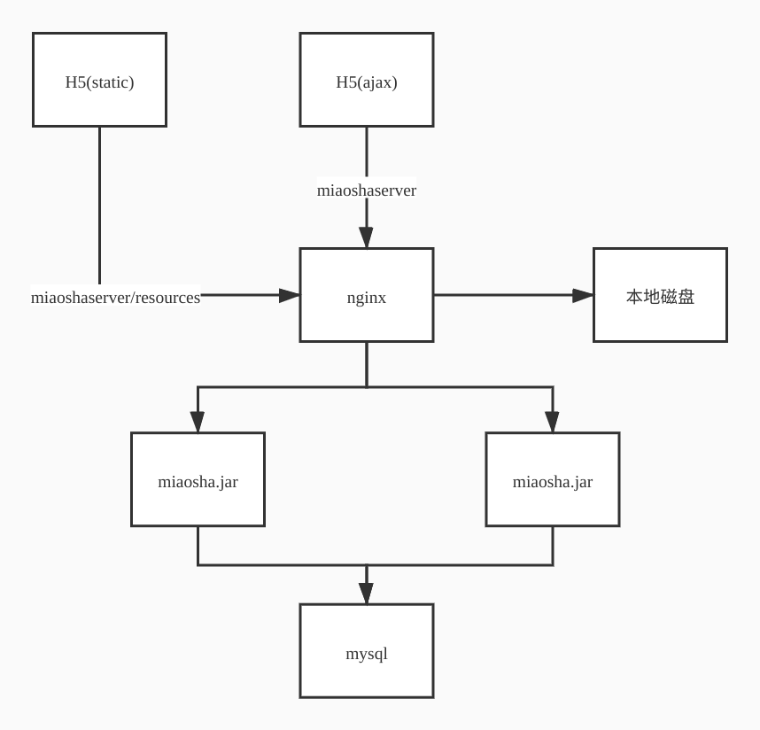

我们将nginx服务器用于三个方面：

+ 作为web服务器
+ 作为动静分离服务器
+ 作为反向代理服务器

对于前端的请求有两种，一种是静态资源的请求，一种是Ajax动态请求。对于静态资源的请求交由nginx服务器来处理，即静态资源放在nginx服务器上；对于动态请求，通过nginx反向代理来均衡到两台服务器上，这两台服务器处理处理这些动态请求，并且数据库的操作交由另一台数据库服务器来处理。

## 分布式扩展

### 配置nginx

这里使用的是openresty，将压缩包下载并解压。

首先安装必要的依赖：

```shell
yum install pcre-devel openssl-devel gcc curl
```

后进行安装：

```shell
./configure
make
make install
```

之后openresty会安装到/usr/local/openresty目录下。

在/usr/local/openresty/nginx目录下启动nginx测试：

```shell
sbin/nginx -c conf/nginx.conf
```

> 修改配置后可以使用`sbin/nginx -s reload`无缝重启

可以查看conf/nginx.conf，端口为80，用浏览器访问浏览器，有以下结果：

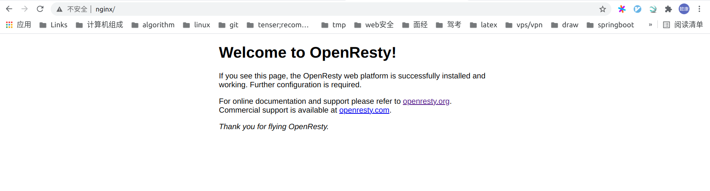

### nginx Web服务器

将前端代码scp到nginx服务器上的/usr/local/openresty/nginx/html目录下，我们在nginx.conf的文件中发现以下代码：

```
server {
        listen       80;
        server_name  localhost;

        #charset koi8-r;

        #access_log  logs/host.access.log  main;

        location / {
            root   html;
            index  index.html index.htm;
        }
        #省略
}
```

有以下信息：

+ location节点path：指定url映射key
+ location节点内容：root指定location path后对应的根路径，index指定默认的访问页

nginx服务器监听在80端口上，将/映射到html文件夹下，因此在浏览器中直接输入nginx/login.html就能访问到我们之前拷贝到服务器上的前端代码了：

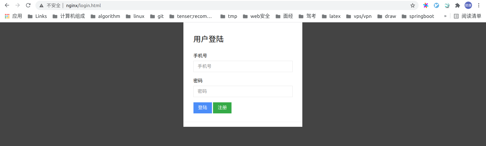

根据之前的架构图，我们应该将/resources定位到nginx目录的磁盘上的静态文件，因此需要修改nginx.conf文件：

修改如下，将/resources/路径映射到本地的nginx目录下的/html/resources/上，因此需要新建一个resources文件夹，然后将所有的静态文件转移到/resources目录下。

```
location /resources/ {
	alias       /usr/local/openresty/nginx/html/resources/;
	index  index.html index.htm;
}
```

使用新的路径访问：miaoshaserver/resources/login.html：

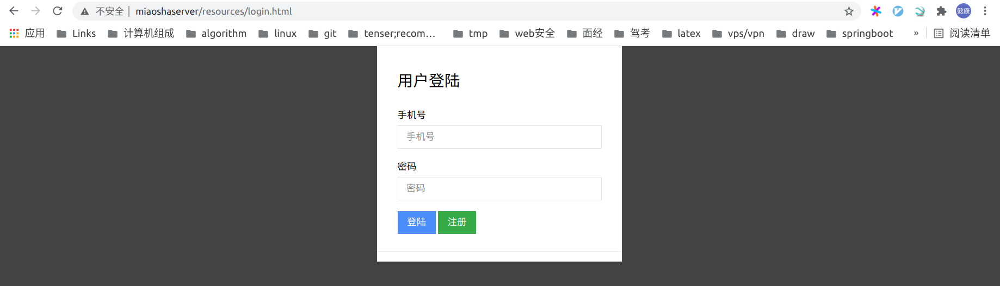

### nginx 动静分离服务器

#### nginx配置

修改nginx.conf文件：

    upstream backend_server{
        server miaoshaserver1 weight=1;
        server miaoshaserver2 weight=1;
    }
    
    server {
        listen       80;
        server_name  localhost;
    
        #charset koi8-r;
    
        #access_log  logs/host.access.log  main;
    
        location /resources/ {
            alias       /usr/local/openresty/nginx/html/resources/;
            index  index.html index.htm;
        }
    
        location / {
            proxy_pass http://backend_server;
            proxy_set_header Host $http_host:$proxy_port;
            proxy_set_header X-Real-IP $remote_addr;
            proxy_set_header X-Forwarded-For $proxy_add_x_forwarded_for;
        }
    }
首先添加**upstream**节点，设置权重**weight**。然后在/resources/的location节点后面再添加一个location节点（注意先后顺序，这将影响匹配的节点）。

**proxy_pass**字段填写需要转发的地址，**proxy_set_header**字段用于设置请求头。

如果后端服务器想知道用户的真实IP（因为默认下是nginx代理服务器发请求到后端服务器，后端服务器只能知道代理服务器的IP），我们必须配置**proxy_set_header**字段：

+ **proxy_set_header Host \$http_host:\$proxy_port**：

  设置Host为用户的真实IP与端口。

+ **proxy_set_header X-Real-IP $remote_addr**：

  X-Real-IP 代表的是客户端请求真实的 IP 地址。

+ **proxy_set_header X-Forwarded-For $proxy_add_x_forwarded_for**：

  X-Forwarded-For 记录着从客户端发起请求后访问过的每一个 IP 地址，当然第一个是发起请求的客户端本身的地址，各 IP 地址间由“英文逗号+空格”(`,`)分隔。

然后重启nginx服务器。

#### 后端服务器开启日志

在两个后端服务器的/www/miaosha路径下新建文件夹tomcat存放log日志。

在application.properties添加以下配置：

```properties
server.tomcat.accesslog.enabled=true
server.tomcat.accesslog.directory=/www/miaosha/tomcat
server.tomcat.accesslog.pattern=%h %l %u %t "%r" %s %b %D
```

pattern的含义：

+ `%h`：远端请求的IP地址
+ `%l`：
+ `%u`：远端主机的user
+ `%t`：时间
+ `"%r"`：http请求的第一行，例如：GET /item/list HTTP/1.0
+ `%s`：http返回状态码
+ `%b`：response的大小
+ `%D`：处理时长

例如：

```
172.22.228.146 - - [31/Mar/2021:21:50:39 +0800] "GET /item/list HTTP/1.0" 200 883 1089
```

#### 验证

现在可以访问浏览器，在两个后端服务器的tomcat日志中可以看到各自被转发的次数。

### 压测对比

服务器配置如下，一台用于nginx，两台用于后端服务器，一台用于数据库服务器。nginx服务器和数据库服务器的带宽都是10Mbps。

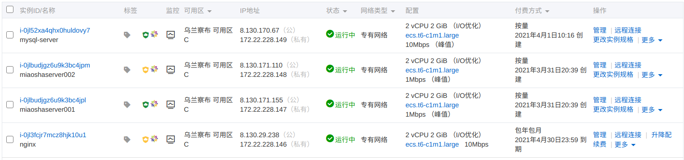

#### 单机压测

首先在数据库服务器上进行单机压测，数据库和web都部署在同一台服务器。

压测参数为：

+ 线程数：1000
+ ramp-up时间：10
+ 循环次数：40

压测的过程中，单机上的状态：

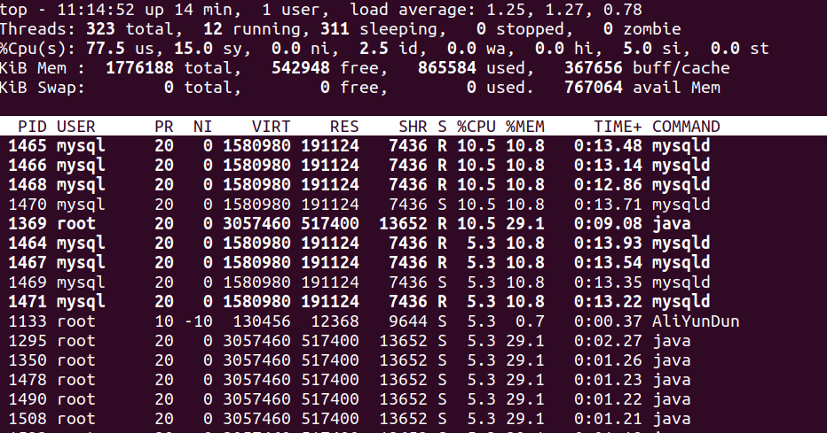

发现占用cpu的大头是mysql进程。

压测结果：

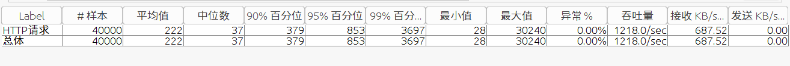

tps结果，常态在1900左右。

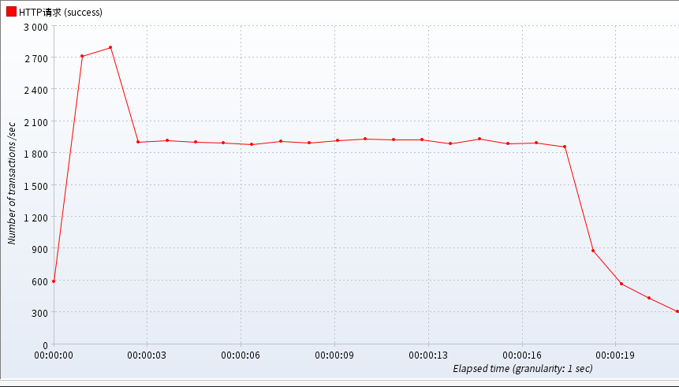

#### 分布式压测

压测的ip转向nginx服务器，压测参数与单机测试一致：

压测参数为：

+ 线程数：1000
+ ramp-up时间：10
+ 循环次数：40

压测结果：

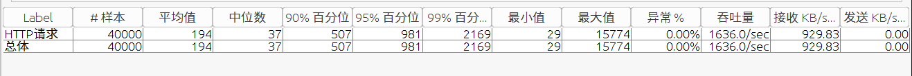

tps常态在2000左右。

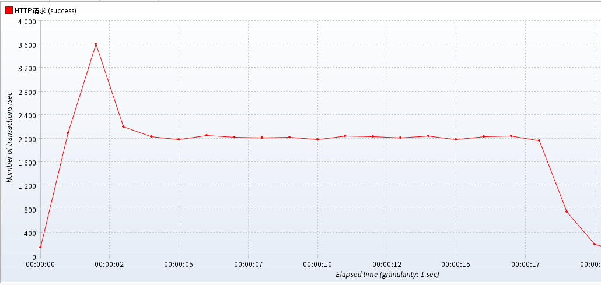

#### 问题

下图是断开连接的四次挥手，我们可以看到，哪边主动断开连接（发送FIN报文），哪边将会进入到TIME-WAIT状态。


上面的图中的客户端和服务端这两个名字有歧义，可以单纯地把它们看做两个不同的主机，只是告诉我们哪边主动断开哪边就会进入到TIME-WAIT状态。

一般的，对于短连接，服务器会主动断开连接，因此服务器端会出现大量的TIME-WAIT状态。

Nginx upstream与后端的连接默认为短连接，而Nginx与前端的连接默认为长连接。因此Nginx服务器在与客户端通信时，长连接占大头，我们可以使用以下命令统计各种状态的数量：

```shell
netstat -n | awk '/^tcp/ {++S[$NF]} END {for(a in S) print a, S[a]}'
```

现在用jmeter进行压测，分别在nginx服务器、后端服务器上使用命令查看各种状态的数量：

nginx服务器：

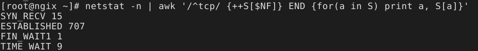

后端服务器：

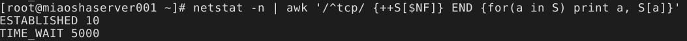

我们发现后端服务器上有大量的TIME-WAIT状态的TCP连接。

如果Nginx只是作为reverse proxy的话，可能一个用户连接就需要多个向后端的短连接，并且由于是秒杀系统，用户会进行频繁地操作，连接的频繁建立与关闭将会带来很大的消耗。

因此我们需要配置nginx服务器到后端服务器的长连接，但是如果建立长连接的话，后端认为是长连接而不会主动关闭连接一般有个空闲超时，关闭连接由nginx服务器来做了，所以 nginx服务器上可能会出现大量的 TIME_WAIT，有利也有弊。

> keepalive如果偏大的话会影响短连接的处理，长连接存在时间长，容易快速消耗资源。

> 注意，这里说的是http的keep-alive，我们是通过统计TIME-WAIT状态的TCP连接的数量来验证的。
>
> http keep-alive是为了让tcp活得更久一点，以便在同一个连接上传送多个http，提高socket的效率。而tcp keep-alive是TCP的一种检测TCP连接状况的保鲜机制，类似心跳包。

#### 开启keepalive

修改conf/nginx.conf文件：

    upstream backend_server{
    	server miaoshaserver1 weight=1;
    	server miaoshaserver2 weight=1;
    	keepalive 250;
    }
    location / {
        proxy_pass http://backend_server;
        # proxy_set_header Host $http_host:$proxy_port;
        proxy_set_header Host $http_host;
        proxy_set_header X-Real-IP $remote_addr;
        proxy_set_header X-Forwarded-For $proxy_add_x_forwarded_for;
        proxy_http_version 1.1;
        proxy_set_header Connection "";
    }

注意upstream处的keepalive的含义不是开启、关闭长连接的开关；也不是用来设置超时的timeout；更不是设置长连接池最大连接数。

官方解释：

+ 设置到upstream服务器的空闲keepalive连接的最大数量

+ 当这个数量被突破时，最近使用最少的连接将被关闭

+ 特别提醒：keepalive指令不会限制一个nginx worker进程到upstream服务器连接的总数量。

>根据官方的解释，容易清楚导致 nginx端出现大量TIME_WAIT的原因：
>
>keepalive设置的比较小（空闲数太小），导致高并发下nginx会频繁出现连接数震荡（超过该值会关闭连接），不停的关闭、开启和后端server保持的keepalive长连接。

重启后进行压测，nginx服务器和后端服务器的状态如下：

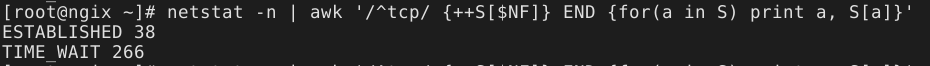

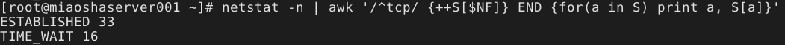

可以发现与之前不同的是，后端服务器的大量的TIME_WAIT状态转移到了nginx服务器上，但是相反地，由于长连接的复用，nginx服务器上的TIME_WAIT远远比开启keepalive前后端服务器上的状态少（5000）。

####  开启keepalive后的压测

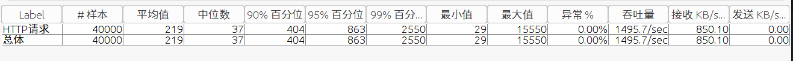

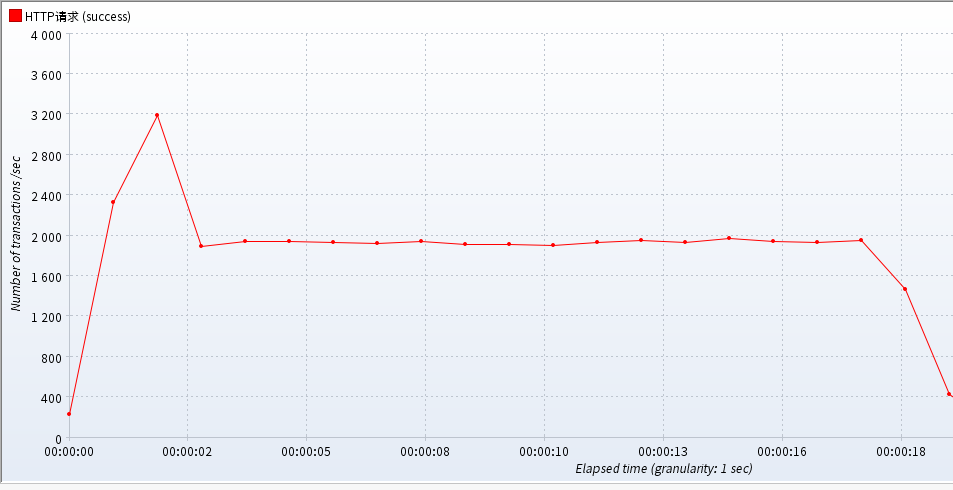

为什么吞吐量和TPS与未开启前差不多甚至更弱了点。。。。。。

但是90、95百分位的用时要比未开启的短。

## 分布式会话

### 为什么要引入分布式会话


在上图中，假设某位用户的登录请求被转发到了后端服务器A，那么session保存在A上，之后的某些需要session的操作请求被转发到了后端服务器B，而服务器B上并没有对应的session，因此需要用户重新进行登录。

因此我们需要引入分布式会话。

### 概况

#### 会话管理

+ 基于cookie传输sessionid：java tomcat容器session实现
+ 基于token传输sessionid：java代码session实现

#### 分布式会话

+ 基于cookie传输sessionid：java tomcat容器session实现迁移到redis
+ 基于cookie传输类似sessionid：java代码session实现迁移到redis

### 基于cookie的实现

#### 配置redis

redis安装在mysql服务器上。

因为安装在opt目录下，因此更改redis安装目录的所属为当前用户：

```shell
sudo chown $USER:$USER /opt/redis-6.2.1
```

配置日志，编辑redis.conf文件，找到**logfile**字段，设置log文件位置，然后用`redis-server redis.conf`的方式启动。

将protected-mode字段为no，允许远程连接。

将自己的内网地址bind上。

将默认端口更改，将requirepass字段设置密码。

redis-cli -h ip -p port 连接测试。

使用auth密码授权。

> 停止redis可以使用redis-cli的shutdown命令。

#### pom.xml引入依赖

```xml
<dependency>
    <groupId>org.springframework.boot</groupId>
    <artifactId>spring-boot-starter-data-redis</artifactId>
</dependency>
<dependency>
    <groupId>org.springframework.session</groupId>
    <artifactId>spring-session-data-redis</artifactId>
</dependency>
```

#### RedisConfig

```java
@Component
@EnableRedisHttpSession(maxInactiveIntervalInSeconds = 3600)
public class RedisConfig {
}
```

#### application.yaml

这里的host是用于本地测试的，需要改成redis所在的服务器地址。

```yaml
spring:
  redis:
    host: 127.0.0.1
    port: 6379
    database: 10
    jedis:
      pool:
        max-active: 50
        min-idle: 20
```

#### 相关的实体类序列化

因为需要将session保存到redis中，因此被set的model需要实现`Serializable`接口。

### 基于token的实现

基于cookie的实现方式是调用`httpServletRequest.getSession().setAttribute`的方法。

现在我们将信息基于token存储在redis中。

例如登录成功后，生成唯一的UUID作为redis中的key，将userModel作为value存入redis中：

```java
@Autowired
private RedisTemplate redisTemplate;
```

```java
//将登录凭证加入到用户登录成功的session内
//this.httpServletRequest.getSession().setAttribute("IS_LOGIN", true);
//this.httpServletRequest.getSession().setAttribute("LOGIN_USER", userModel);
//修改成若用户登录验证成功后将对应的登录信息和登录凭证一起存入redis中

//生成登录凭证token，UUID
String uuidToken = UUID.randomUUID().toString();
uuidToken = uuidToken.replace("-", "");
//建立token和用户登陆态之间的联系
redisTemplate.opsForValue().set(uuidToken,userModel);
redisTemplate.expire(uuidToken,1, TimeUnit.HOURS);
//下发token
return CommonReturnType.create(uuidToken);
```

前端把token存储下来，当用户下单时将token传到后端，后端根据token从redis中取出对应的userModel，进行下单的数据库操作：

```java
//Boolean isLogin = (Boolean) httpServletRequest.getSession().getAttribute("IS_LOGIN");
String token = httpServletRequest.getParameterMap().get("token")[0];
if (StringUtils.isEmpty(token)) {
    throw new BusinessException(EmBusinessError.USER_NOT_LOGIN, "用户尚未登录");
}
//获取用户登录信息
UserModel userModel = (UserModel) redisTemplate.opsForValue().get(token);
if (userModel == null) {
    throw new BusinessException(EmBusinessError.USER_NOT_LOGIN, "用户尚未登录");
}
//UserModel userModel = (UserModel) httpServletRequest.getSession().getAttribute("LOGIN_USER");
OrderModel orderModel = orderService.createOrder(userModel.getId(), itemId, amount, promoId);
```

## 多级缓存

### 缓存设计

+ 用快速存取设备
+ 将缓存推到离用户最近的地方
+ 脏缓存清理

### 多级缓存

+ redis缓存
+ 热点内存本地缓存
+ nginx proxy cache缓存
+ nginx lua缓存

### redis缓存

redis作为集中式缓存：

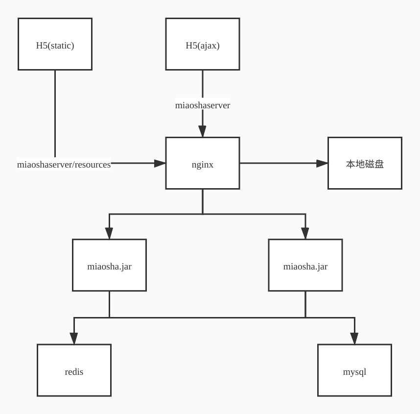

#### 单机版缺陷

容量问题，单点问题。

#### sentinal哨兵模式

主从切换技术的方法是：当主服务器宕机后，需要手动把一台从服务器切换为主服务器，这就需要人工干预，费事费力，还会造成一段时间内服务不可用。这不是一种推荐的方式，更多时候，我们优先考虑**哨兵模式**。

哨兵模式是一种特殊的模式，首先Redis提供了哨兵的命令，哨兵是一个独立的进程，作为进程，它会独立运行。其原理是**哨兵通过发送命令，等待Redis服务器响应，从而监控运行的多个Redis实例。**


这里的哨兵有两个作用：

- 通过心跳机制，让Redis服务器返回其运行状态，包括主服务器和从服务器。
- 当哨兵监测到master宕机，会自动将slave切换成master，然后通过**发布订阅模式**通知其他的从服务器，修改配置文件，让它们切换主机。

假设主服务器宕机，哨兵1先检测到这个结果，系统并不会马上进行failover过程，仅仅是哨兵1主观的认为主服务器不可用，这个现象成为**主观下线**。当后面的哨兵也检测到主服务器不可用，并且数量达到一定值时，那么哨兵之间就会进行一次投票，投票的结果由一个哨兵发起，进行failover操作。切换成功后，就会通过发布订阅模式，让各个哨兵把自己监控的从服务器实现切换主机，这个过程称为**客观下线**。这样对于客户端而言，一切都是透明的。

#### 集群cluster模式

### redis集中式缓存动态详情页

在itemController中更改getItem方法的逻辑：

```java
//商品详情页
@RequestMapping(value = "/get", method = {RequestMethod.GET})
@ResponseBody
public CommonReturnType getItem(@RequestParam(name = "id") Integer id) {
    //根据商品id到redis内获取
    ItemModel itemModel = (ItemModel) redisTemplate.opsForValue().get("item_" + id);
    if (itemModel == null) {
        itemModel = itemService.getItemById(id);
        //缓存
        redisTemplate.opsForValue().set("item_" + id, itemModel);
        redisTemplate.expire("item_"+id, 10, TimeUnit.MINUTES);
    }
    ItemVO itemVO = convertFromItemModel(itemModel);
    return CommonReturnType.create(itemVO);
}
```

进行测试后我们发现，存储在redis中的数据并不友好，可以考虑序列化成json串：

```java
@Component
@EnableRedisHttpSession(maxInactiveIntervalInSeconds = 3600)
public class RedisConfig {

    @Bean
    public RedisTemplate redisTemplate(RedisConnectionFactory redisConnectionFactory) {
        RedisTemplate redisTemplate = new RedisTemplate();
        redisTemplate.setConnectionFactory(redisConnectionFactory);
        //首先解决key的序列化方式
        StringRedisSerializer stringRedisSerializer = new StringRedisSerializer();
        redisTemplate.setKeySerializer(stringRedisSerializer);
        //解决value的序列化方式
        Jackson2JsonRedisSerializer jackson2JsonRedisSerializer = new Jackson2JsonRedisSerializer(Object.class);
        redisTemplate.setValueSerializer(jackson2JsonRedisSerializer);
        return redisTemplate;
    }
}
```

结果如下：

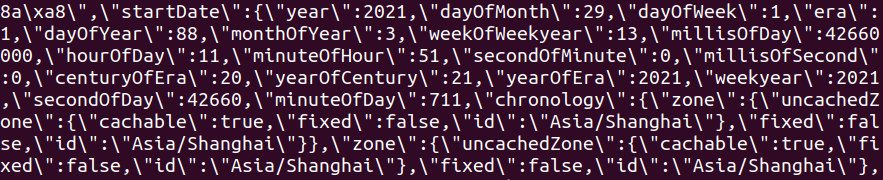

发现，时间这个属性序列化得并不好，我们需要为他定制一个序列化与反序列化方案：

序列化方案：

```java
public class JodaDateTimeJsonSerializer extends JsonSerializer<DateTime> {
    @Override
    public void serialize(DateTime dateTime, JsonGenerator jsonGenerator, SerializerProvider serializerProvider) throws IOException {
        jsonGenerator.writeString(dateTime.toString("yyyy-MM-dd HH:mm:ss"));
    }
}
```

反序列化方案：

```java
public class JodaDateTimeJsonDeserializer extends JsonDeserializer<DateTime> {
    @Override
    public DateTime deserialize(JsonParser jsonParser, DeserializationContext deserializationContext) throws IOException, JsonProcessingException {
        String dateString =jsonParser.readValueAs(String.class);
        DateTimeFormatter formatter = DateTimeFormat.forPattern("yyyy-MM-dd HH:mm:ss");

        return DateTime.parse(dateString,formatter);
    }
}
```

将这些方案应用到RedisConfig中：

```java
@Component
@EnableRedisHttpSession(maxInactiveIntervalInSeconds = 3600)
public class RedisConfig {

    @Bean
    public RedisTemplate redisTemplate(RedisConnectionFactory redisConnectionFactory) {
        RedisTemplate redisTemplate = new RedisTemplate();
        redisTemplate.setConnectionFactory(redisConnectionFactory);
        //首先解决key的序列化方式
        StringRedisSerializer stringRedisSerializer = new StringRedisSerializer();
        redisTemplate.setKeySerializer(stringRedisSerializer);
        //解决value的序列化方式
        Jackson2JsonRedisSerializer jackson2JsonRedisSerializer = new Jackson2JsonRedisSerializer(Object.class);
        //为joda.time.DateTime定制序列化与反序列化
        ObjectMapper objectMapper = new ObjectMapper();
        SimpleModule simpleModule = new SimpleModule();
        simpleModule.addSerializer(DateTime.class, new JodaDateTimeJsonSerializer());
        simpleModule.addDeserializer(DateTime.class, new JodaDateTimeJsonDeserializer());
        objectMapper.registerModule(simpleModule);
        jackson2JsonRedisSerializer.setObjectMapper(objectMapper);
        redisTemplate.setValueSerializer(jackson2JsonRedisSerializer);
        return redisTemplate;
    }
}
```

现在redis中存储的数据的格式已经非常的简洁了：

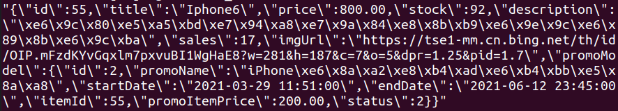

但是还有一个问题，进行浏览器访问时，从redis中取出数据强制装换成`UserModel`时出错：

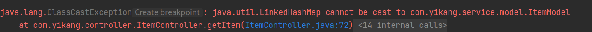

这时我们需要调用`objectMapper.activateDefaultTyping`，它会在序列化后的数据添加上类的信息，用于之后的反序列化的强制转换。

```java
@Component
@EnableRedisHttpSession(maxInactiveIntervalInSeconds = 3600)
public class RedisConfig {

    @Bean
    public RedisTemplate redisTemplate(RedisConnectionFactory redisConnectionFactory) {
        RedisTemplate redisTemplate = new RedisTemplate();
        redisTemplate.setConnectionFactory(redisConnectionFactory);
        //首先解决key的序列化方式
        StringRedisSerializer stringRedisSerializer = new StringRedisSerializer();
        redisTemplate.setKeySerializer(stringRedisSerializer);
        //解决value的序列化方式
        Jackson2JsonRedisSerializer jackson2JsonRedisSerializer = new Jackson2JsonRedisSerializer(Object.class);
        //为joda.time.DateTime定制序列化与反序列化
        ObjectMapper objectMapper = new ObjectMapper();
        SimpleModule simpleModule = new SimpleModule();
        simpleModule.addSerializer(DateTime.class, new JodaDateTimeJsonSerializer());
        simpleModule.addDeserializer(DateTime.class, new JodaDateTimeJsonDeserializer());

        objectMapper.activateDefaultTyping(objectMapper.getPolymorphicTypeValidator(), ObjectMapper.DefaultTyping.NON_FINAL);

        objectMapper.registerModule(simpleModule);
        jackson2JsonRedisSerializer.setObjectMapper(objectMapper);
        redisTemplate.setValueSerializer(jackson2JsonRedisSerializer);
        return redisTemplate;
    }
}
```

在redis中的数据添加上了类的信息：

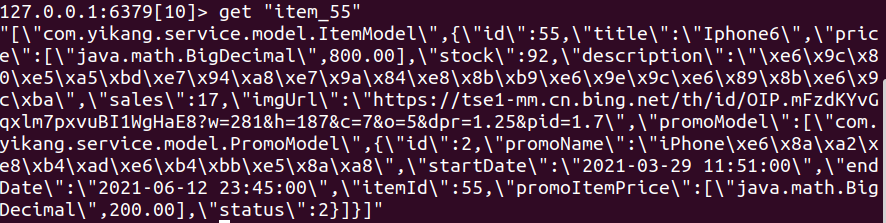

最终该功能成功实现。

### 本地热点缓存

+ 热点数据
+ 脏读不敏感
+ 内存可控

#### Guava cache

+ 可控制的大小和超时时间
+ 可配置的lru策略
+ 线程安全

#### 本地热点缓存实现

使用google提供的guava来实现本地热点缓存。

在pom文件加入以下依赖：

```xml
<!-- https://mvnrepository.com/artifact/com.google.guava/guava -->
<dependency>
    <groupId>com.google.guava</groupId>
    <artifactId>guava</artifactId>
    <version>18.0</version>
</dependency>
```

实现本地缓存的service：

```java
//封装本地缓存操作类
public interface CacheService {
    //存方法
    void setCommonCache(String key, Object value);

    //取方法
    Object getFromCommonCache(String key);
}

@Service
public class CacheServiceImpl implements CacheService {

    private Cache<String, Object> commonCache = null;

    @PostConstruct
    public void init() {
        commonCache = CacheBuilder.newBuilder()
                //设置缓存容器的初始容量为10
                .initialCapacity(10)
                //设置缓存中最大可以存储100个KEY,超过100个之后会按照LRU的策略移除缓存项
                .maximumSize(100)
                //设置写缓存后多少秒过期
                //设置成AfterAccess不合理，因为热点数据是频繁被访问的，那么将无法过期
                .expireAfterWrite(60, TimeUnit.SECONDS).build();
    }

    @Override
    public void setCommonCache(String key, Object value) {
        commonCache.put(key, value);
    }

    @Override
    public Object getFromCommonCache(String key) {
        return commonCache.getIfPresent(key);
    }
}
```

在itemController的getItem方法里使用本地缓存，如果本地缓存未命中，则使用redis缓存，如果redis缓存未命中，那么从数据库中查找：

```java
@Autowired
private CacheService cacheService;

//商品详情页
@RequestMapping(value = "/get", method = {RequestMethod.GET})
@ResponseBody
public CommonReturnType getItem(@RequestParam(name = "id") Integer id) {
    String key = "item_" + id;
    //先从本地缓存取
    ItemModel itemModel = (ItemModel) cacheService.getFromCommonCache(key);
    if (itemModel == null) {
        //本地缓存未命中，那么到redis中取
        itemModel = (ItemModel) redisTemplate.opsForValue().get(key);
        if (itemModel == null) {
            itemModel = itemService.getItemById(id);
            //redis缓存
            redisTemplate.opsForValue().set(key, itemModel);
            redisTemplate.expire(key, 10, TimeUnit.MINUTES);
        }
        //本地缓存
        cacheService.setCommonCache(key, itemModel);
    }
    //根据商品id到redis内获取
    ItemVO itemVO = convertFromItemModel(itemModel);
    return CommonReturnType.create(itemVO);
}
```

#### 压测

之前可能因为是带宽的原因，压测不理想，因此现在更新了服务器的带宽，现在的配置如下：

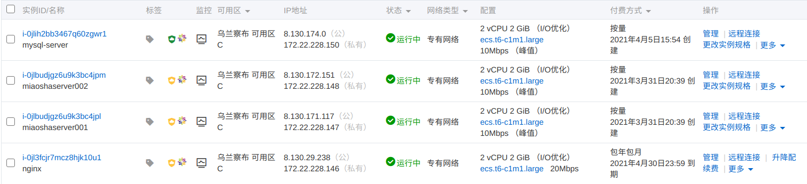

现在将nginx服务器的带宽由10Mbps升到了20Mbps，两个后端服务器由5Mbps升到了10Mbps，将带宽带来的影响尽可能地降低。

因为没有保存之前版本的jar包，因此这里只比较redis缓存版本与本地热点缓存+redis缓存的版本的压测结果。

压测参数与之前是一样的：

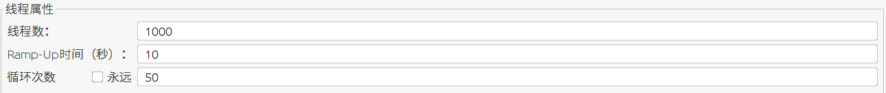

首先是redis缓存版本的压测结果：

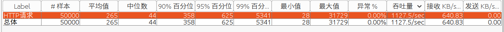

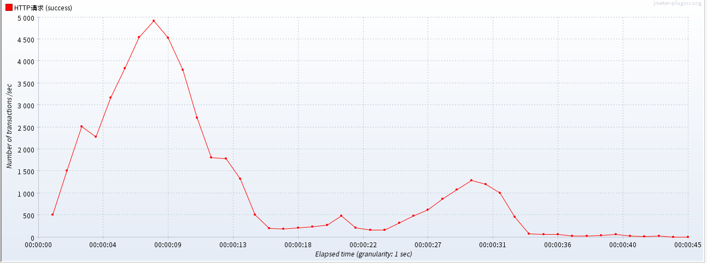

之后是本地热点缓存版本的压测结果：

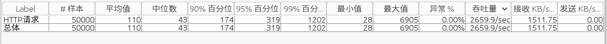

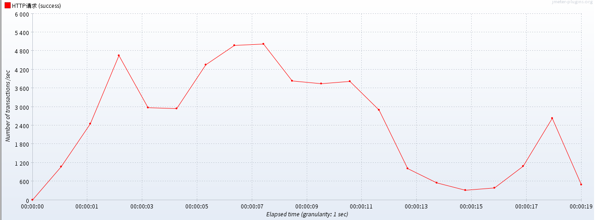

发现使用本地热点缓存，无论是用时还是吞吐量还是tps，新版本的性能要远远优于旧版本。

### nginx proxy cache

#### 简介

+ nginx反向代理前置
+ 依靠文件系统存索引级的文件
+ 依靠内存缓存文件地址

#### 实现

修改nginx.conf文件：

```
	#声明一个cache缓存节点的内容
	#缓存的地址为/usr/local/openresty/nginx/tmp_cache
	#levels=1:2表示建立二级索引
	#keys_zone=tmp_cache:100m类似于命名空间，100m的上限，如果超出则将进行LRU淘汰
	#inactive=7d表示7天的有效
	#max_size=10g是指总的大小
    proxy_cache_path /usr/local/openresty/nginx/tmp_cache levels=1:2 keys_zone=tmp_cache:100m inactive=7d max_size=10g;
    server {
    	...
    	location / {
	    proxy_pass http://backend_server;
	    #指定cache
	    proxy_cache tmp_cache;
	    #用uri作为key
	    proxy_cache_key $uri;
	    #只有这些状态码的请求结果会被缓存，404等错误码的结果不能缓存，否则一旦出现404，那么在有效期内永远都是404
	    proxy_cache_valid 200 206 304 302 7d;
	    #
	    # proxy_set_header Host $http_host:$proxy_port;
	    proxy_set_header Host $http_host;
	    proxy_set_header X-Real-IP $remote_addr;
	    proxy_set_header X-Forwarded-For $proxy_add_x_forwarded_for;
	    proxy_http_version 1.1;
	    proxy_set_header Connection "";
		}
    }
```

重启nginx，访问uri，可以看到在/tmp_cache/8/f6下生成了缓存：

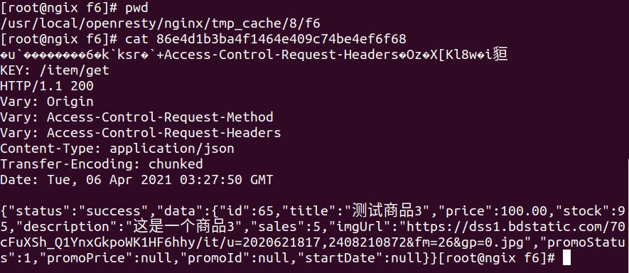

#### 压测

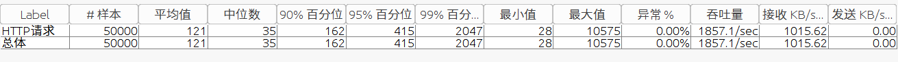

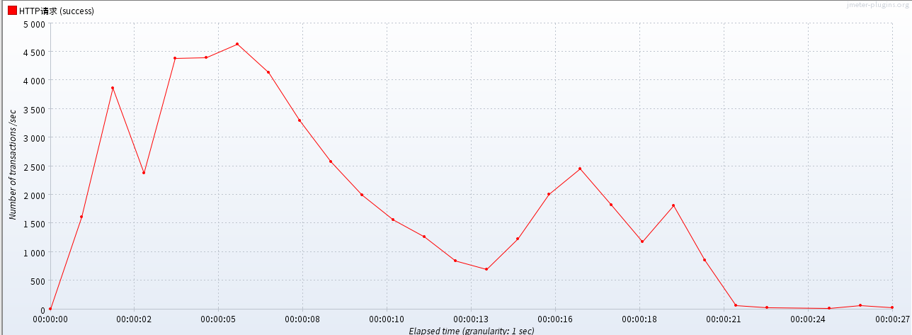

发现使用nginx proxy cache后，不管是用时、吞吐量还是tps，性能反而下降了？

这是因为nginx proxy cache并没有把缓存保存到内存，而是保存到本地文件系统中，因此读取本地文件的速度还不如反向代理到后端服务器通过热点缓存读取的速度。

### nginx lua挂载点

+ **init_by_lua**：系统启动时调用
+ **init_worker_by_lua**：worker进程启动时调用
+ **set_by_lua**：变量用复杂lua return
+ **rewrite_by_lua**：重写url规则
+ **access_by_lua**：权限验证阶段
+ **content_by_lua**：内容输出节点

### nginx shared dic

nginx的共享**内存**，称为**共享字典**项，对于所有的worker进程都可见，是一种全局变量, LRU淘汰。

这里使用ngxin shared dic的数据结构来缓存数据。

首先编写lua脚本：

```lua
function get_from_cache(key)
	local cache_ngx = ngx.shared.my_cache
	local value = cache_ngx:get(key)
	return value
end

function set_to_cache(key, value, expire)
	if not expire then
		expire = 0
	end
	local cache_ngx = ngx.shared.my_cache
	local succ, err, forcible = cache_ngx:set(key, value, expire)
	return succ
end

local args = ngx.req.get_uri_args()
local id = args["id"]
local item_model = get_from_cache("item_"..id)
if item_model == nil then
	local resp = ngx.location.capture("/item/get?id="..id)
	item_model = resp.body
	set_to_cache("item_"..id, item_model, 1*60)
end
ngx.say(item_model)
```

其中，`ngx.shared.my_cache`引用的是nginx.conf文件中的定义的共享字典：

```
lua_shared_dict my_cache 128m;
    server {
    ......
	}
```

还需要在nginx.conf定义一个location节点：

```
location /luaitem/get{
	    default_type "application/json";
	    content_by_lua_file ../lua/itemsharedic.lua;
}
```

这里的路径定义为`/luaitem/get`只是简单地做个测试。

这样就实现了nginx shared dic的本地缓存了。

但这样的方式使得压力全部在nginx服务器上了，并且脏读的现象不好处理，更新机制不方便。

### nginx连接redis

编写lua脚本：

```lua
local log = ngx.log
local ERR = ngx.ERR
local function errlog(...)
	log(ERR, "Redis:", ...)
end
local args = ngx.req.get_uri_args()
local id = args["id"]
local redis = require "resty.redis"
local cache = redis:new()
local ok, err = cache:connect("172.22.228.151", 6789)
local ok2, err2 = cache:auth("1131487340")
if not ok2 then
	errlog("failed to auth", err2)	
	return
end
local item_model = cache:get("item_"..id)
if item_model == ngx.null or item_model == nil then
	local resp = ngx.location.capture("/item/get?id="..id)
	item_model = resp.body
end

ngx.say(item_model)
```

修改nginx.conf：

```
location /luaitem/get{
	    default_type "application/json";
	    content_by_lua_file ../lua/itemredis.lua;
}
```

这样就能将nginx将部分业务直接请求redis。

可以考虑再添加一台redis服务器，用作从服务器，从服务器负责读，而nginx只处理读的请求，写的请求转发到后端服务器到主redis服务器上处理。

那么新的架构如下：

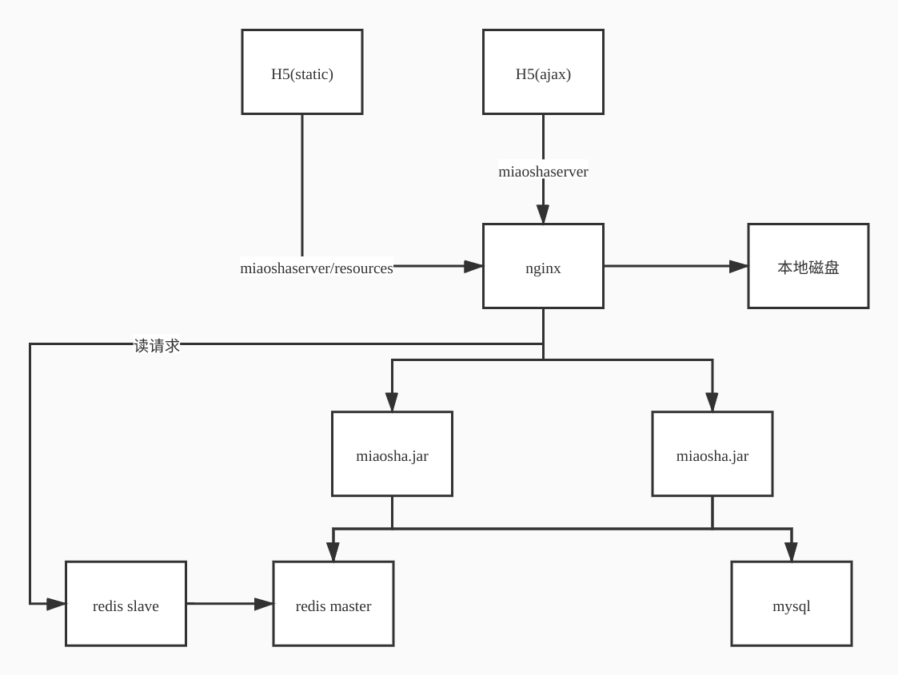

## 静态资源CDN

> 因为域名需要备案才能使用CDN，所以就不做这块的功能了。这里只写原理以及解决方案。

### CDN的工作原理

内容分发网络（Content Delivery Network，简称CDN）是建立并覆盖在承载网之上，由分布在不同区域的边缘节点服务器群组成的分布式网络。

CDN应用广泛，支持多种行业、多种场景内容加速，例如：图片小文件、大文件下载、视音频点播、直播流媒体、全站加速、安全加速。

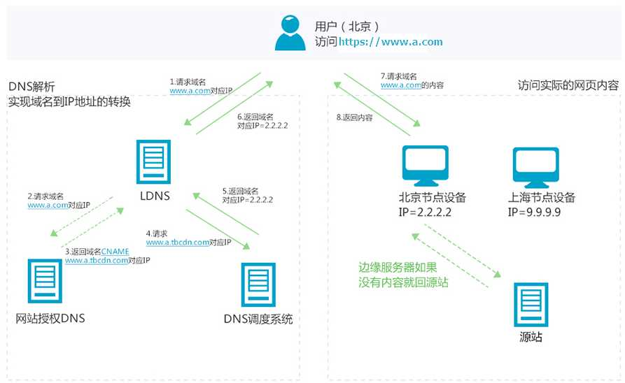

借用阿里云官网的例子，来简单介绍CDN的工作原理。

假设通过CDN加速的域名为`www.a.com`，接入CDN网络，开始使用加速服务后，当终端用户（北京）发起HTTP请求时，处理流程如下：

1. 当终端用户（北京）向`www.a.com`下的指定资源发起请求时，首先向LDNS（本地DNS）发起域名解析请求。
2. LDNS检查缓存中是否有`www.a.com`的IP地址记录。如果有，则直接返回给终端用户；如果没有，则向授权DNS查询。
3. 当授权DNS解析`www.a.com`时，返回域名CNAME `www.a.tbcdn.com`对应IP地址。
4. 域名解析请求发送至阿里云DNS调度系统，并为请求分配最佳节点IP地址。
5. LDNS获取DNS返回的解析IP地址。
6. 用户获取解析IP地址。
7. 用户向获取的IP地址发起对该资源的访问请求。

+ 如果该IP地址对应的节点已缓存该资源，则会将数据直接返回给用户，例如，图中步骤7和8，请求结束。

+ 如果该IP地址对应的节点未缓存该资源，则节点向源站发起对该资源的请求。获取资源后，结合用户自定义配置的缓存策略，将资源缓存至节点，例如，图中的北京节点，并返回给用户，请求结束。

从这个例子可以了解到：

（1）CDN的加速资源是跟域名绑定的。
（2）通过域名访问资源，首先是通过DNS分查找离用户最近的CDN节点（边缘服务器）的IP
（3）通过IP访问实际资源时，如果CDN上并没有缓存资源，则会到源站请求资源，并缓存到CDN节点上，这样，用户下一次访问时，该CDN节点就会有对应资源的缓存了。

### cache control响应头

+ private：客户端可以缓存
+ public：客户端和代理服务器都可以缓存
+ max-age：缓存的内容将在XXX秒后失效
+ no-cache：会缓存，但是取缓存时强制向服务端再验证一次
+ no-store：不缓存请求的任何返回内容

选择流程如下：

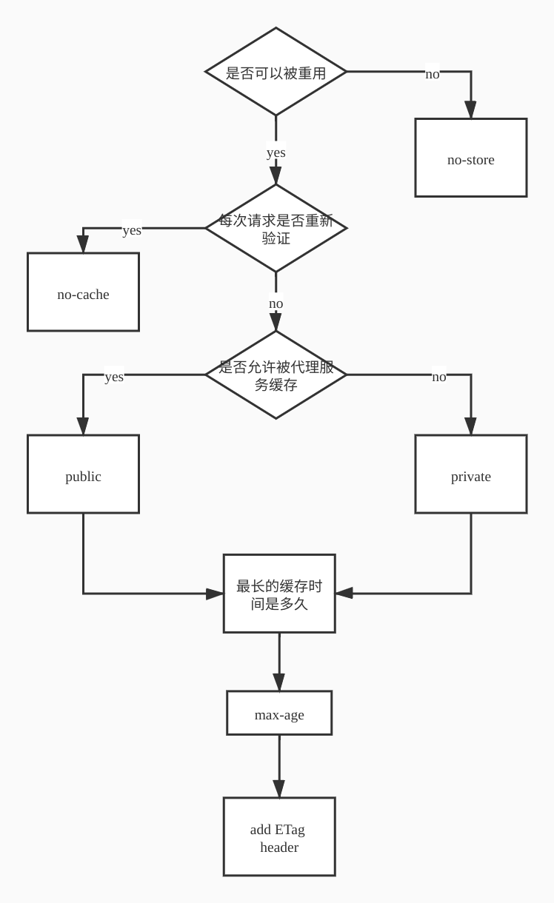

### 有效性判断

+ **ETag**：服务端响应后发送资源唯一标识
+ **If-None-Match**：客户端发送的匹配Etag标识符，它的值是上一次服务端发送给自己的ETag
+ **Last-Modified**：服务端响应后会发送资源最后被修改的时间
+ **If-Modified-Since**：客户端发送的匹配资源随后修改时间的标识符

**ETag**与**If-None-Match**是一对，**Last-Modified**与**If-Modified-Since**是一对。

一下为用户请求资源涉及到缓存的流畅：

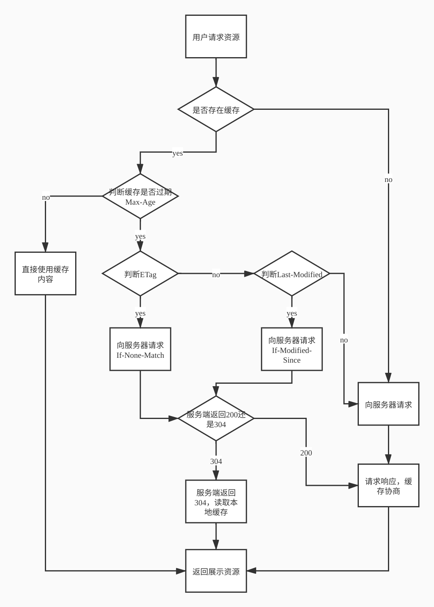

### 浏览器的三种刷新方式

+ 回车刷新或a链接：看cache-control对应的max-age是否仍然有效，有效则直接from cache，若cache-control中为no-cache，则进入缓存协商逻辑
+ F5刷新或command+R刷新：去掉cache-control中的max-age或直接设置max-age为0，然后进入缓存协商逻辑
+ ctrl+F5或commond+shift+R刷新：去掉cache-control和协商头，强制刷新，将cache-control改成no-cache
+ 协商机制，比较Last-Modified和ETag到服务端，若服务端判断没变化则304不返回数据，否则200返回数据

### 静态资源部署策略

+ css，js，img等元素使用版本号部署，例如a.js?v=1.0，不便利，且维护困难。比如部分静态文件发生了变化，那么所有的静态元素的版本号是应该更新吗？按理来说，每次更新都算一个新版本，那么所有静态元素的版本号都应该需要更新，维护困难。
+ css，js，img等元素使用带摘要部署，例如a.js?v=45edw，这样解决了所有元素的版本号需要同时更新的问题，需要更新的元素只需要生成新的摘要部署上去即可，因为摘要替换了版本号，因此各个元素的更新可以相互独立。但是存在先部署html还是先部署资源文件的覆盖问题。如果先部署资源文件，那么新的资源文件将会覆盖旧的资源文件，而旧的html引用的是旧的资源文件，还没有更新，因此存在一种状态为旧html引用新资源文件，如果新的资源文件可以兼容旧的资源文件还好，如果不兼容将会出现问题。反之也是一样的。
+ css，js，img等元素使用摘要做文件名部署，例如45edw.js，新老版本并存且可以回滚，资源部署完后再部署html。
  + 对应静态资源保持生命周期内不会变，max-age可以设置很长，无视失效更新周期
  + html文件设置no-cache或较短max age，以便于更新
  + html文件也可以设置较长的max age，但需要依靠动态的获取版本号请求发送给后端，异步下载最新的版本号的html后展示渲染在前端

> 版本号只用于回源，CDN上只存在一个资源文件的一个版本，不存在多个版本（即版本号不做文件名的标识）。

+ 动态请求也可以静态化成json资源推送到CDN上，例如/将item/get?id=55请求返回的json资源推送到CDN上，前端首先将CDN上的对应请求的json资源拉取展示，然后同时发送ajax请求到后端询问是否是最新的版本号，如果不是最新的再从后端请求最新数据，然后再覆盖展示。
+ 依靠异步请求获取后端节点对应资源状态做紧急下架处理。
+ 可通过跑批紧急推送CDN内容以使其下架等操作。

### 新架构

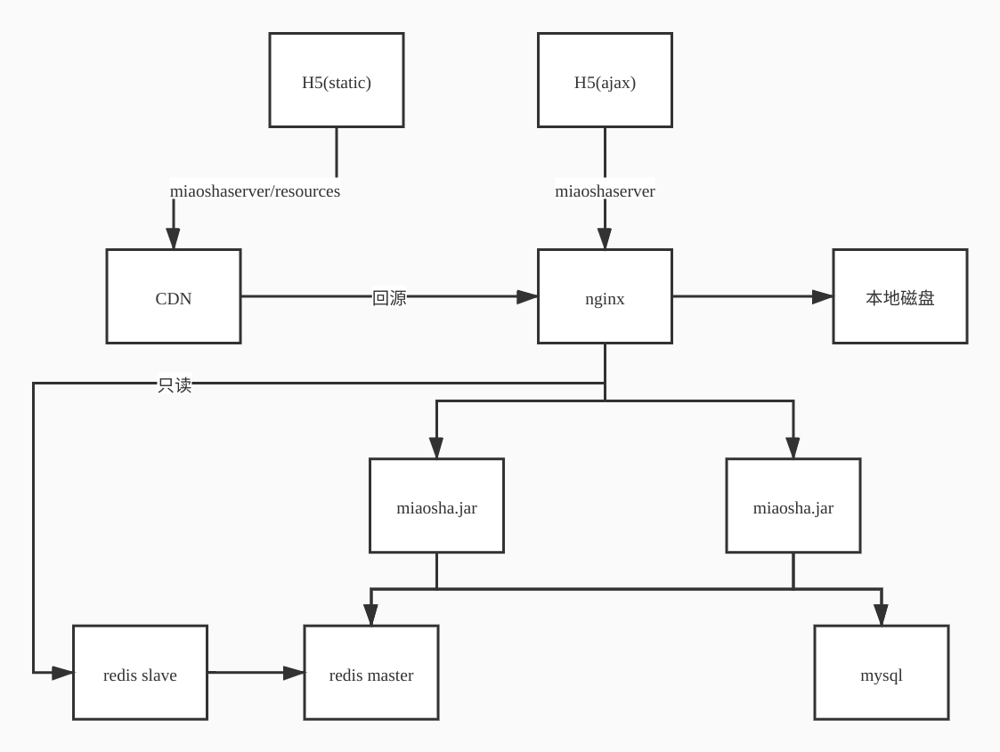

### 全页面静态化

#### 引入

之前将静态资源文件推送到CDN缓存下来，将动态请求也静态化成json资源推送到CDN上。那么现在是浏览器从CDN访问静态资源以及动态请求json资源，然后再浏览器端将他们组合渲染成页面展示。

既然静态资源文件和动态请求json资源都缓存在CDN上，那么是否可以直接在CDN上渲染成页面，将页面返回呢？

这就引入了全页面静态化。

#### 定义

在服务端完成html、css甚至js的load渲染成纯html文件后直接以静态资源的方式部署到CDN上。

#### 实现

**phantomjs**是一个无头浏览器，没有UI的浏览器，可以使用它来渲染html生成静态文件部署到CDN上。

使用**phantomjs**编写html解析脚本，将html渲染完成后输出为html文件：

```js
var page = require("webpage").create();
var fs = require("fs");
page.open("http://miaoshaserver/resources/getitem.html?id=55", function(status){
    console.log("status = "+status);
    var isInit = "0";
    setInterval(function(){
        if(isInit != "0"){
            page.evaluate(function(){
                initView();
            });
            isInit = page.evaluate(function(){
                return hasInit();
            });
        }else{
            fs.write("getitem.html", page.content, "w");
    		phantom.exit();
        }
    }, 1000);
});
```

在前端的js代码中也有对应的`isInit`的变量来判断页面的数据是否初始化成功。这段**phantomjs**代码采用轮询的机制，每隔一秒检查页面是否初始化完，如果没有那么调用前端js代码的初始化页面的方法，如果初始化完了，那么输出渲染完成的html文件后退出。

## 交易性能优化

### 下单接口压测

登录后，进入下单页面，点击下单，查看对应的请求，信息如下：

请求url：

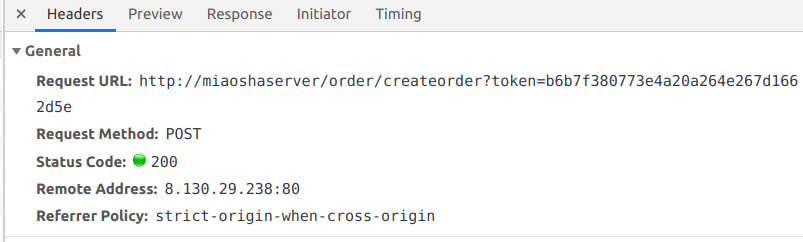

请求表单：


根据以上参数使用jmeter压测：

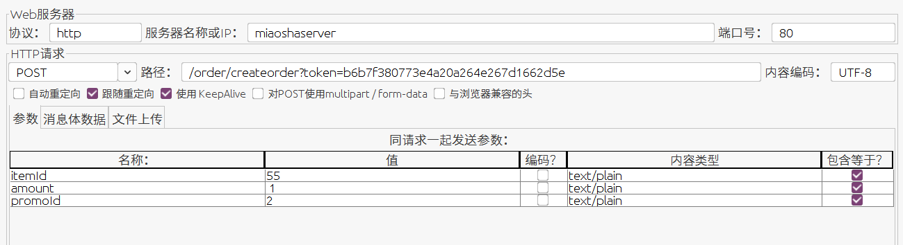

### 交易性能瓶颈

+ 交易验证完全依赖数据库
+ 落单减库存这一操作会对库存加行锁
+ 后置处理逻辑，如校验活动信息等

以下为交易流程：

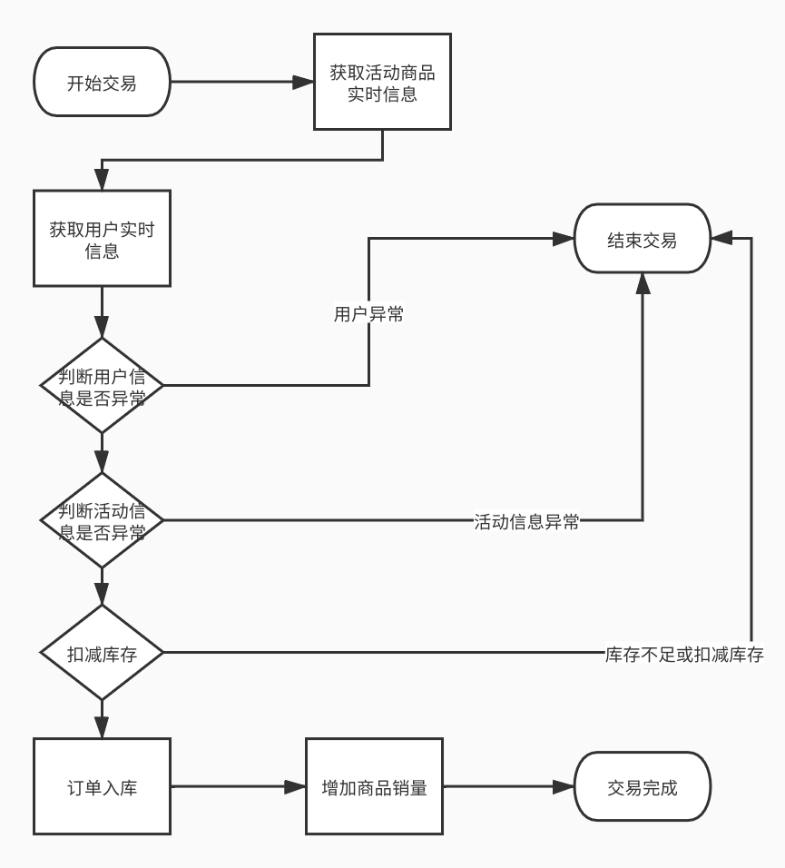

### 交易验证优化

+ 用户风控策略优化：策略缓存模型化
+ 活动校验策略优化：引入活动发布流程，模型缓存化，紧急下线能力

### 用户风控策略优化：策略缓存模型化

这里只是简单地将user和item的数据缓存到redis中：

```java
@Override
public UserModel getUserByIdInCache(Integer id) {
    UserModel userModel = (UserModel) redisTemplate.opsForValue().get("user_validate_" + id);
    if (userModel == null) {
        userModel = this.getUserById(id);
        redisTemplate.opsForValue().set("user_validate_" + id, userModel);
        redisTemplate.expire("user_validate_" + id, 10, TimeUnit.MINUTES);
    }
    return userModel;
}
```

```java
@Override
public ItemModel getItemByIdInCache(Integer id) {
    ItemModel itemModel = (ItemModel) redisTemplate.opsForValue().get("item_validate_" + id);
    if (itemModel == null) {
        itemModel = this.getItemById(id);
        redisTemplate.opsForValue().set("item_validate_" + id, itemModel);
        redisTemplate.expire("item_validate_" + id, 10, TimeUnit.MINUTES);
    }
    return itemModel;
}
```

### 活动缓存库存方案

#### 库存行锁优化

MySQL的innodb存储引擎支持行级锁，innodb的行锁是通过给索引项加锁实现的，这就意味着只有通过索引条件检索数据时，innodb才使用行锁，否则使用表锁。

在这个项目中落单减库存是update操作，因此如果没有给相应字段`item_id`添加索引，那么mysql检索数据时将会使用表锁，大大降低性能。

```xml
<update id="decreaseStock">
    update item_stock
    set stock = stock - #{amount}
    where item_id = #{itemId}
      and stock >= #{amount}
</update>
```

使用如下alter语句添加索引：

```mysql
alter table item_stock add unique index item_id_index(item_id);
```

#### 扣减库存缓存化

##### 方案

（1）活动发布同步库存进缓存

（2）下单交易减缓存库存

##### 实现

在PromoService中新增一个接口`void publishPromo(Integer promoId)`，用于秒杀商品的发布，发布的同时将商品的库存数缓存到redis中：

```java
@Override
public void publishPromo(Integer promoId) {
    PromoDO promoDO = promoDOMapper.selectByPrimaryKey(promoId);
    if (promoDO.getItemId() == null || promoDO.getItemId().intValue() == 0) {
        return;
    }
    ItemModel itemModel = itemService.getItemById(promoDO.getItemId());
    //将库存同步到redis内
    redisTemplate.opsForValue().set("promo_item_stock_" + itemModel.getId(), itemModel.getStock());
}
```

然后再减库存的实现方法里面更改逻辑，直接走redis缓存：

```java
@Override
@Transactional
public boolean decreaseStock(Integer itemId, Integer amount) throws BusinessException {
    int affectedRow = itemStockDOMapper.decreaseStock(itemId, amount);
    long result = redisTemplate.opsForValue().increment("promo_item_stock_" + itemId, amount.intValue() * -1);
    if (result >= 0) {
        //更新库存成功
        return true;
    } else {
        //更新库存失败
        return false;
    }
}
```

##### 问题

（1）数据库记录不一致

##### 优化后的方案

（1）活动发布同步库存进缓存

（2）下单交易减缓存库存

（3）**异步消息扣减数据库内库存**

### 异步消息队列rocketmq

#### 简介

高性能，高并发，分布式消息中间件。

典型应用场景：分布式事务，异步解耦。

#### rocketmq安装与配置

##### 安装

将rocketmq解压，进入rocketmq文件夹。

首先配置启动参数，默认运行内存设置得很大，需要调小，需要修改bin目录下的三个文件**runserver.sh**、**runbroker.sh**、**tools.sh**：

设置runserver.sh：

```sh
JAVA_OPT="${JAVA_OPT} -server -Xms256m -Xmx256m -Xmn512m -XX:MetaspaceSize=128m -XX:MaxMetaspaceSize=320m"
```

设置runbroker.sh：

```sh
JAVA_OPT="${JAVA_OPT} -server -Xms256m -Xmx256m -Xmn128m"
```

设置tools.sh：

```sh
JAVA_OPT="${JAVA_OPT} -server -Xms256m -Xmx256m -Xmn256m -XX:PermSize=128m -XX:MaxPermSize=128m"
```

##### 测试

开启Name Server：

```bash
nohup sh bin/mqnamesrv &
tail -f ~/logs/rocketmqlogs/namesrv.log
# The Name Server boot success...
```

开启Broken：

```shell
nohup sh bin/mqbroker -n localhost:9876 &
# nohup sh bin/mqbroker -c conf/broker.conf &
tail -f ~/logs/rocketmqlogs/broker.log 
# The broker[%s, 172.30.30.233:10911] boot success...
```

发送以及接受信息：

```shell
export NAMESRV_ADDR=localhost:9876
sh bin/tools.sh org.apache.rocketmq.example.quickstart.Producer
# SendResult [sendStatus=SEND_OK, msgId= ...
```

```shell
export NAMESRV_ADDR=localhost:9876
sh bin/tools.sh org.apache.rocketmq.example.quickstart.Consumer
# ConsumeMessageThread_%d Receive New Messages: [MessageExt...
```

如下图，开启两个终端，一个发送消息，一个接受消息：


关闭服务

```shell
> sh bin/mqshutdown broker
The mqbroker(36695) is running...
Send shutdown request to mqbroker(36695) OK

> sh bin/mqshutdown namesrv
The mqnamesrv(36664) is running...
Send shutdown request to mqnamesrv(36664) OK
```

##### 创建topic

在bin目录下执行`./mqadmin`方法会显示所有的命令，然后执行`./mqadmin help <command>`方法会显示对应command的文档。

```shell
# 创建topic
./mqadmin updateTopic -n localhost:9876 -t stock -c DefaultCluster
```


##### 坑

阿里云在localhost上启动rocketmq，会发现启动在内网上，导致本地调试无法访问。

并且使用`nohup sh bin/mqbroker -n <IP>:9876 &`也还是绑定在内网上。

需要修改配置文件**conf/broker.conf**：

```
brokerClusterName = DefaultCluster
brokerName = broker-a
brokerId = 0
deleteWhen = 04
fileReservedTime = 48
brokerRole = ASYNC_MASTER
flushDiskType = ASYNC_FLUSH

namesrvAddr=8.130.165.253:9876
brokerIP1=8.130.165.253
```

低下两行是新添加的，绑定在公网IP上。

启动namesvr的命令还是一样的，但是启动broker的命令不同：

```shell
nohup sh bin/mqbroker -c conf/broker.conf &
```

因为服务器是内网间访问，因此本地调试完，部署后需要将broker.con改回来。

注意本地调试时创建topic也需要在公网IP上创建。

### 使用rocketmq实现redis与数据库同步

因为我们把交易的减库存缓存到redis，这样读取都直接在redis中，提高了性能，但是带来一个问题，那就是redis与数据库的数据不同步的问题。如果redis缓存丢了，那么减库存这些信息也丢失了，那么如何保证redis与数据库同步呢？

可以使用rocketmq来实现redis与数据库同步。

流程如下：

管理者先发布秒杀活动，发布的同时将商品的信息存入redis缓存中，当用户下单时，直接在在redis中减去库存，如果在redis中减去库存成功，那么使用rocketmq producer异步发送消息的方式通知consumer操作数据库进行减库存，从而使redis与数据库得到同步。这些都是在一个事务里的。

#### 发布秒杀活动

```java
@RequestMapping(value = "/publishpromo", method = {RequestMethod.GET})
@ResponseBody
public CommonReturnType publishpromo(@RequestParam(name = "id") Integer id) {
    promoService.publishPromo(id);
    return CommonReturnType.create(null);

}
```

发布的同时会将item的数据缓存到redis中。

#### producer

producer负责通知consumer进行数据库减库存操作，需要发送itemId、amount两个参数。

```java
@Component
public class MqProducer {
    private DefaultMQProducer producer;

    @Value("${mq.nameserver.addr}")
    private String nameAddr;

    @Value("${mq.topicname}")
    private String topicName;

    @PostConstruct
    public void init() throws MQClientException {
        //做mq producer的初始化
        producer = new DefaultMQProducer("producer_group");
        producer.setNamesrvAddr(nameAddr);
        producer.start();
    }

    //同步库存扣减消息
    public boolean asyncReduceStock(Integer itemId, Integer amount) {
        Map<String, Object> bodyMap = new HashMap<>();
        bodyMap.put("itemId", itemId);
        bodyMap.put("amount", amount);

        Message message = new Message(topicName, "increase",
                JSON.toJSON(bodyMap).toString().getBytes(Charset.forName("UTF-8")));
        try {
            producer.send(message);
        } catch (MQClientException e) {
            e.printStackTrace();
            return false;
        } catch (RemotingException e) {
            e.printStackTrace();
            return false;
        } catch (MQBrokerException e) {
            e.printStackTrace();
            return false;
        } catch (InterruptedException e) {
            e.printStackTrace();
            return false;
        }
        return true;
    }
}
```

#### consumer

当consumer收到producer发送的消息后调用`itemStockDOMapper`的减库存操作，直接操作数据库。

```java
@Component
public class MqConsumer {

    private DefaultMQPushConsumer consumer;

    @Value("${mq.nameserver.addr}")
    private String nameAddr;

    @Value("${mq.topicname}")
    private String topicName;

    @Autowired
    private ItemStockDOMapper itemStockDOMapper;

    @PostConstruct
    public void init() throws MQClientException {
        consumer = new DefaultMQPushConsumer("stock_consumer_group");
        consumer.setNamesrvAddr(nameAddr);
        consumer.subscribe(topicName, "*");
        consumer.registerMessageListener(new MessageListenerConcurrently() {
            @Override
            public ConsumeConcurrentlyStatus consumeMessage(List<MessageExt> list, ConsumeConcurrentlyContext consumeConcurrentlyContext) {
                //实现库存真正到数据库内扣减逻辑
                Message msg = list.get(0);
                String jsonString = new String(msg.getBody());
                Map<String, Object> map = JSON.parseObject(jsonString, Map.class);
                Integer itemId = (Integer) map.get("itemId");
                Integer amount = (Integer) map.get("amount");
                itemStockDOMapper.decreaseStock(itemId, amount);
                return ConsumeConcurrentlyStatus.CONSUME_SUCCESS;
            }
        });
        consumer.start();
    }
}
```

#### 业务层

整个业务流程到包裹在一个事务里。

首先更新redis，更新redis成功后使用mq异步通知更新数据库。

注意，如果mq异步操作失败时redis需要回滚，重新加上扣减的值。

```java
@Override
@Transactional
public boolean decreaseStock(Integer itemId, Integer amount) throws BusinessException {
    long result = redisTemplate.opsForValue().increment("promo_item_stock_" + itemId, amount.intValue() * -1);
    if (result >= 0) {
        //更新库存成功
        boolean mqResult = mqProducer.asyncReduceStock(itemId, amount);
        if (!mqResult) {
            redisTemplate.opsForValue().increment("promo_item_stock_" + itemId, amount.intValue());
            return false;
        }
        return true;
    } else {
        //更新库存失败,result<0表示现有的资源，现有资源经过减变为负，那么需要加回去
        redisTemplate.opsForValue().increment("promo_item_stock_" + itemId, amount.intValue());
        return false;
    }
}
```

### 仍然存在的问题

（1）异步消息producer发送失败，只能回滚

（2）异步消息consumer处理失败，丢失操作

（3）扣减操作执行失败，只能回滚

（4）下单失败，无法正确地回补库存：因为使用的是落单减库存的方案，我们是先进行减库存操作：

```java
@Override
@Transactional
public OrderModel createOrder(Integer userId, Integer itemId, Integer amount, Integer promoId) throws BusinessException {
    //1. 检验下单状态，下单商品是否存在，用户是否合法，购买数量是否正确
    //校验活动信息
    //2. 落单减库存
    boolean result = itemService.decreaseStock(itemId, amount);
    if (!result) {
        throw new BusinessException(EmBusinessError.STOCK_NOT_ENOUGH);
    }
    //3. 订单入库
    //生成交易流水号
    //4. 返回前端
    return orderModel;
}
```

`createOrder`是一个事务，它掉用了另一个事务的方法`decreaseStock`：

```java
@Override
@Transactional
public boolean decreaseStock(Integer itemId, Integer amount) throws BusinessException {
    long result = redisTemplate.opsForValue().increment("promo_item_stock_" + itemId, amount.intValue() * -1);
    if (result >= 0) {
        //更新库存成功
        boolean mqResult = mqProducer.asyncReduceStock(itemId, amount);
        if (!mqResult) {
            redisTemplate.opsForValue().increment("promo_item_stock_" + itemId, amount.intValue());
            return false;
        }
        return true;
    } else {
        //更新库存失败,result<0表示现有的资源，现有资源经过减变为负，那么需要加回去
        redisTemplate.opsForValue().increment("promo_item_stock_" + itemId, amount.intValue());
        return false;
    }
}
```

`decreaseStock`也是一个事务，默认下，内嵌的事务与外部的事务是同一个事务，在没有引入redis以及rocketmq时，当后续的订单入库等操作如果发生异常，那么`decreaseStock`就会被回滚。但是现在引入了redis以及rocketmq来进行数据的更新操作，那么在`decreaseStock`后面的操作如果失败，那么这些更新将不会回滚！

## 交易优化技术之事务型消息

### 事务型消息应用

我们之前提到，`createOrder`是一个事务，内部调用`decreaseStock`事务，他们同属一个事务，如果直接走数据库即调用mapper方法，他们能够保证同时commit成功或者同时回滚成功。但是我们将`decreaseStock`直接操作redis以及mq发送异步消息同步数据库，redis与mq的异步消息是无法通过`@Transactional`注解回滚的。

spring提供了一种方法，当前事务提交成功时，调用指定的方法，我们将mq的异步消息放在commit成功后做：

```java
    @Override
    @Transactional
    public OrderModel createOrder(Integer userId, Integer itemId, Integer amount, Integer promoId) throws BusinessException {
        //1. 检验下单状态，下单商品是否存在，用户是否合法，购买数量是否正确
        //校验活动信息
        //2. 落单减库存
        //3. 订单入库
        //生成交易流水号
        
        TransactionSynchronizationManager.registerSynchronization(new TransactionSynchronizationAdapter() {
            @Override
            public void afterCommit() {
                //异步更新库存
                boolean mqresult = itemService.asyncDecreaseStock(itemId, amount);
                //如果将异步发送消息的方法放在外面，即先异步发送消息，然后再commit，但是因为网络的原因等等也可能commit失败，这种情况下这个异步更新就不能回滚了
                //但是如果指定异步更新在commit成功后进行，也存在一个问题，就是如果异步更新失败，throw出的runtimeException将不会回滚事务，因为事务已经commit了
//                if (!mqresult) {
//                    itemService.increaseStock(itemId, amount);
//                    throw new BusinessException(EmBusinessError.MQ_SEND_FAIL);
//                }
            }
        });
        //4. 返回前端
        return orderModel;
    }
```

但是仍然存在问题，如果mq异步更新失败，那么方法回调函数中抛出runtimeException也无法将当前事务回滚，因为已经commit成功了。这种方法不可行。

我们可以使用rocketmq的事务机制来解决。

更改MqProducer代码，通过`TransactionMQProducer`类的`sendMessageInTransaction`发送事务型消息：

```java
sendResult = transactionMQProducer.sendMessageInTransaction(message, argsMap);
```

然后在初始化时注册事务监听器，需要重写两个方法，一个是`executeLocalTransaction`，当执行完方法体，返回是否需要回滚的标识，我们可以将spring的事务放在这个方法体中；还有一个是`checkLocalTransaction`，当一直没有收到`executeLocalTransaction`返回的消息，就会调用这个方法。：

```java
transactionMQProducer.setTransactionListener(new TransactionListener() {
            @Override
            public LocalTransactionState executeLocalTransaction(Message message, Object o) {
                //创建订单
                Integer userId = (Integer) ((Map) o).get("userId");
                Integer promoId = (Integer) ((Map) o).get("promoId");
                Integer itemId = (Integer) ((Map) o).get("itemId");
                Integer amount = (Integer) ((Map) o).get("amount");
                try {
                    orderService.createOrder(userId, itemId, amount, promoId);
                } catch (BusinessException e) {
                    e.printStackTrace();
                    //注意这里没有抛出异常，因此需要在上层调用getLocalTransactionState方法来了解异常情况
                    return LocalTransactionState.ROLLBACK_MESSAGE;
                }
                return LocalTransactionState.COMMIT_MESSAGE;
            }

            //当executeLocalTransaction一直没有发送明确的消息（可能断链，也可能延时）
            //那么会调用checkLocalTransaction方法
            @Override
            public LocalTransactionState checkLocalTransaction(MessageExt msg) {
                //根据是否扣减库存成功，来判断要返回COMMIT、ROLLBACK还是继续UNKNOWN
                //这一部分在之后会完善
                String jsonString = new String(msg.getBody());
                Map<String, Object> map = JSON.parseObject(jsonString, Map.class);
                Integer itemId = (Integer) map.get("itemId");
                Integer amount = (Integer) map.get("amount");
                return null;
            }
        });
```

完整代码如下：

```java
@Component
public class MqProducer {
    private DefaultMQProducer producer;

    private TransactionMQProducer transactionMQProducer;

    @Value("${mq.nameserver.addr}")
    private String nameAddr;

    @Value("${mq.topicname}")
    private String topicName;

    @Autowired
    private OrderService orderService;

    @PostConstruct
    public void init() throws MQClientException {
        //做mq producer的初始化
        producer = new DefaultMQProducer("producer_group");
        producer.setNamesrvAddr(nameAddr);
        producer.start();
        transactionMQProducer = new TransactionMQProducer("transaction_producer_group");
        transactionMQProducer.setNamesrvAddr(nameAddr);
        transactionMQProducer.start();
        //当createOrder方法执行成功后，consumer端才会执行
        //即createOrder失败回滚时，consumer端也一起回滚
        transactionMQProducer.setTransactionListener(new TransactionListener() {
            @Override
            public LocalTransactionState executeLocalTransaction(Message message, Object o) {
                //创建订单
                Integer userId = (Integer) ((Map) o).get("userId");
                Integer promoId = (Integer) ((Map) o).get("promoId");
                Integer itemId = (Integer) ((Map) o).get("itemId");
                Integer amount = (Integer) ((Map) o).get("amount");
                try {
                    orderService.createOrder(userId, itemId, amount, promoId);
                } catch (BusinessException e) {
                    e.printStackTrace();
                    //注意这里没有抛出异常，因此需要在上层调用getLocalTransactionState方法来了解异常情况
                    return LocalTransactionState.ROLLBACK_MESSAGE;
                }
                return LocalTransactionState.COMMIT_MESSAGE;
            }

            //当executeLocalTransaction一直没有发送明确的消息（可能断链，也可能延时）
            //那么会调用checkLocalTransaction方法
            @Override
            public LocalTransactionState checkLocalTransaction(MessageExt msg) {
                //根据是否扣减库存成功，来判断要返回COMMIT、ROLLBACK还是继续UNKNOWN
                //这一部分在之后会完善
                String jsonString = new String(msg.getBody());
                Map<String, Object> map = JSON.parseObject(jsonString, Map.class);
                Integer itemId = (Integer) map.get("itemId");
                Integer amount = (Integer) map.get("amount");
                return null;
            }
        });
    }

    //事务型同步库存扣减消息
    public boolean transactionAsyncReduceStock(Integer userId, Integer promoId, Integer itemId, Integer amount) {
        Map<String, Object> bodyMap = new HashMap<>();
        bodyMap.put("itemId", itemId);
        bodyMap.put("amount", amount);

        Map<String, Object> argsMap = new HashMap<>();
        argsMap.put("userId", userId);
        argsMap.put("promoId", promoId);
        argsMap.put("itemId", itemId);
        argsMap.put("amount", amount);

        Message message = new Message(topicName, "increase",
                JSON.toJSON(bodyMap).toString().getBytes(Charset.forName("UTF-8")));
        TransactionSendResult sendResult = null;
        try {
            sendResult = transactionMQProducer.sendMessageInTransaction(message, argsMap);
        } catch (MQClientException e) {
            e.printStackTrace();
            return false;
        }
        //让上层了解错误信息
        if (sendResult.getLocalTransactionState() == LocalTransactionState.ROLLBACK_MESSAGE) {
            return false;
        } else if (sendResult.getLocalTransactionState() == LocalTransactionState.COMMIT_MESSAGE) {
            return true;
        } else {
            return false;
        }
    }
}
```

我们用producer的方法包裹了spring的事务，因此进行业务处理时只需要调用producer的方法即可：

在controller层：

```java
//        OrderModel orderModel = orderService.createOrder(userModel.getId(), itemId, amount, promoId);
        if (!mqProducer.transactionAsyncReduceStock(userModel.getId(), promoId, itemId, amount)) {
            throw new BusinessException(EmBusinessError.UNKNOWN_ERROR, "下单失败");
        }
```

### 库存流水

#### 问题

之前我们在spring事务提交成功后执行，如果spring事务提交失败后回滚。但是有一个问题，如果`orderService.createOrder`执行时间过长或者服务器断链使得没有及时返回状态(COMMIT、ROLLBACK、UNKNOWN)，这种情况如何应对？

这种情况下会执行`checkLocalTransaction`方法，`checkLocalTransaction`可以获得message中的itemId、userId等参数，那么如果通过这些参数判断当前状态呢？可以利用库存流水。

#### 数据类型

（1）主业务数据：master data

（2）操作型数据：log data

#### 实现

我们在所有的操作之前创建一个库存流水，设status为1，表示初始化状态。

当spring事务（如落单减库存（redis）、生成订单流水号等）执行完后将对应的库存流水的status设为2，表示已经完成。注意这些操作都是在一个事务里的。

> 注意，虽然又引入了一个关于库存流水的操作，但是这种操作对性能的影响是很小的，因为每次的下单记录都是不同的，因此不存在行锁竞争的问题。

然后在`checkLocalTransaction`中获得库存流水ID，当中间件长时间没有收到消息时可以通过库存流水ID去查询当前状态，如果状态为2，那么直接返回COMMIT，如果状态为1，那么返回UNKONW，下次再来查询，如果状态为3，那么返回ROLLBACK。

```java
transactionMQProducer.setTransactionListener(new TransactionListener() {
    @Override
    public LocalTransactionState executeLocalTransaction(Message message, Object o) {
        //创建订单
        Integer userId = (Integer) ((Map) o).get("userId");
        Integer promoId = (Integer) ((Map) o).get("promoId");
        Integer itemId = (Integer) ((Map) o).get("itemId");
        Integer amount = (Integer) ((Map) o).get("amount");
        String stockLogId = (String) ((Map) o).get("stockLogId");
        try {
            orderService.createOrder(userId, itemId, amount, promoId, stockLogId);
        } catch (BusinessException e) {
            e.printStackTrace();
            //注意这里没有抛出异常，因此需要在上层调用getLocalTransactionState方法来了解异常情况

            //设置stockLog为回滚状态
            StockLogDO stockLogDO = stockLogDOMapper.selectByPrimaryKey(stockLogId);
            stockLogDO.setStatus(3);
            stockLogDOMapper.updateByPrimaryKeySelective(stockLogDO);
            return LocalTransactionState.ROLLBACK_MESSAGE;
        }
        return LocalTransactionState.COMMIT_MESSAGE;
    }

    //当executeLocalTransaction一直没有发送明确的消息（可能断链，也可能延时）
    //那么会调用checkLocalTransaction方法
    @Override
    public LocalTransactionState checkLocalTransaction(MessageExt msg) {
        //根据是否扣减库存成功，来判断要返回COMMIT、ROLLBACK还是继续UNKNOWN
        //如果为UNKNOWN，将在之后重新尝试，尝试的间隔不断增大，超过一定次数后将不再尝试
        String jsonString = new String(msg.getBody());
        Map<String, Object> map = JSON.parseObject(jsonString, Map.class);
        String stockLogId = (String) map.get("stockLogId");
        StockLogDO stockLogDO = stockLogDOMapper.selectByPrimaryKey(stockLogId);
        if (stockLogDO == null) {
            return LocalTransactionState.UNKNOW;
        }
        if (stockLogDO.getStatus() == 2) return LocalTransactionState.COMMIT_MESSAGE;
        else if (stockLogDO.getStatus() == 1) return LocalTransactionState.UNKNOW;
        else return LocalTransactionState.ROLLBACK_MESSAGE;
    }
});
```

> 还有一个问题，因为使用的落单减库存方案，肯定是要先走redis才能判断是否有剩余库存，但是如果包裹着它的spring事务挂掉了，redis是不会回滚的。

### 库存数据库最终一致性保证

#### 方案

（1）引入库存操作流水

（2）引入事务型消息机制

#### 问题

（1）redis不可用时如何处理：当redis不可用时，将回源数据库，但是不能保证异步更新消息全部处理完成，因此存在不一致的状态

（2）扣减流水错误如何处理

### 业务场景决定高可用技术实现

+ 设计原则：
  + 宁可少卖，不能超卖（这其实跟场景有关，如果商家能在短时间内进到货，那么是允许的）
+ 方案：
  + redis可以比实际数据库中少
  + 超时释放

### 库存售罄

+ 库存售罄标识
+ 售罄后不去操作后续流程
+ 售罄后通知各系统售罄
+ 回补上新