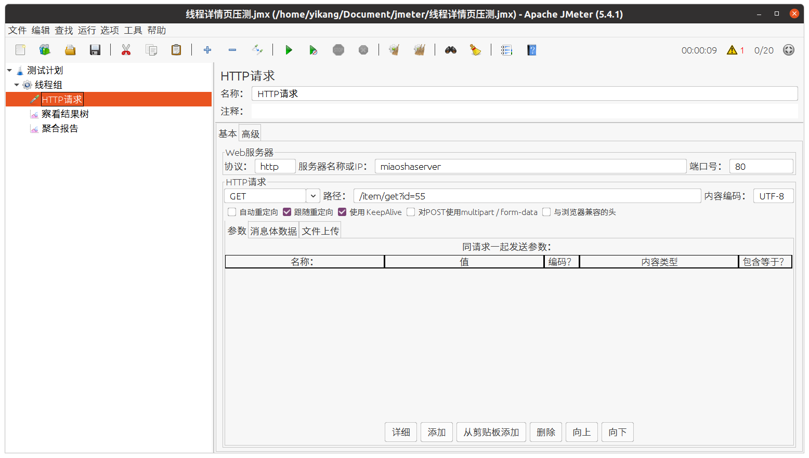
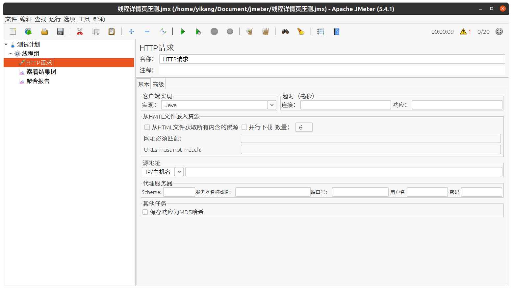
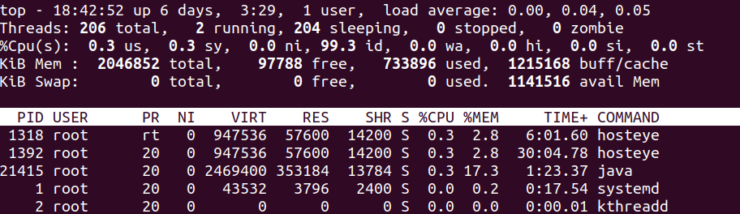

# 秒杀项目性能优化

## 打包与部署

maven打包命令：

```shell
mvn clean package -Dmaven.test.skip=true
```

但是这有个问题，得到的jar包里面并没有包含依赖库，且执行报错，显示找不到主清单文件。

在pom文件里添加plugin：

```xml
<plugins>
    <plugin>
        <groupId>org.springframework.boot</groupId>
        <artifactId>spring-boot-maven-plugin</artifactId>
    </plugin>
</plugins>
```

> 如果标红，可以先指定一个version，然后再把version删除。

然后再用maven打包即可。

在很多场景下需要变换不同的配置信息，在已经打好包的情况下不方便再次更改application.properties源码，可以使用外挂配置：

```shell
java -jar miaosha.jar --spring.config.addition-location=application.properties
```

编写sh脚本：

```sh
nohup java -Xms400m -Xmx400m -XX:NewSize=200m -XX:MaxNewSize=200m -jar miaosha.jar --spring.config.addition-location=/www/miaosha/application.properties &
```

## Jmeter

更改字体大小和编码，编辑bin/jmeter.properties：

将以下两个开启：

```properties
jsyntaxtextarea.font.family=Hack
jsyntaxtextarea.font.size=25
```

注意，开启完后需要设置主题为system才能生效。

更改编码：

```properties
sampleresult.default.encoding=UTF-8
```

可以将云服务器的主机加入到/etc/hosts中，方便测试。

开始测试：





## 基础命令

### pstree

pstree命令是用于查看进程树之间的关系，即哪个进程是父进程，哪个是子进程，可以清楚的看出来是谁创建了谁

几个重要的参数：

+ -A: 各进程树之间的连接以ASCII码字符来连接

+ -U:各进程树之间的连接以utf8字符来连接，某些终端可能会有错误

+ -p:同时列出每个进程的PID

+ -u: 同时列出每个进程的所属账号名称：

例如查看miaoshaserver的服务器进程：


使用管道查看线程总数：


### top

top -H采用线程模式。



#### load average（系统平均负载）

- 系统平均负载是处于runnable或uninterruptable状态的进程数。R+D状态的进程数。
- 处于runnable状态的进程，正在使用CPU或正在等待使用CPU。
- 处于uninterruptable状态的进程，正在等待某些I/O访问，比如等待磁盘。
- 平均负载没有针对系统中CPU的数量进行归一化，因此平均负载为1表示单个CPU系统始终处于满载状态，而在4 CPU系统上则意味着75％的时间处于空闲状态。

从man资料可以看出，实际上系统平均负载包括了（R+D）状态的进程。所以，**Load avaerage与CPU使用率并不是完全同步的**：

- **CPU密集型进程**——使用大量CPU会导致平均负载升高，此时这两者是一致的；（大量浮点运算或乘除运算等）
- **I/O密集型进程**——等待I/O也会导致平均负载升高，但CPU使用率不一定高；（可能Load average虚高但是CPU不忙）
- **大量等待CPU的进程调度**也会导致平均负载升高，此时的CPU使用率也会比较高。

## 发现并发容量问题

### 问题

使用Jmeter提高线程数，发现错误率飙升，用pstree -p pid | wc -l发现线程数并没有很多。

### 默认内嵌Tomcat配置

SpringBoot的自动配置参数可以查看[spring-configuration-metadata.json](/home/yikang/.m2/repository/org/springframework/boot/spring-boot-autoconfigure/2.4.3/spring-boot-autoconfigure-2.4.3.jar!/META-INF/spring-configuration-metadata.json)。以下参数是关键信息：

+ **server.tomcat.accept-count**：等待队列长度，默认为100
+ **server.tomcat.max-connections**：最大可被连接数，默认为8192
+ **server.tomcat.threads.max**：最大工作线程数，默认为200
+ **server.tomcat.threads.min-spare**：最小工作线程数，默认为10

因此，默认配置下，连接超过8192后出现拒绝连接的情况；触发的请求超过200+100后拒绝处理。

现在我们编写application.properties，修改如下：

```properties
server.port=80
server.tomcat.accept-count=1000
server.tomcat.threads.max=300
server.tomcat.threads.min-spare=50
```

我们将等待队列的长度增加到1000，将最大工作线程数增加到300，将最小工作线程数增加到50，然后杀死进程重新启动，再使用pstree -p pid | wc -l命令发现线程数由25增加到65。当时用jmeter压测时（线程数1000），发现线程由之前的218增加到了318。

> 压测的结果相差不大。。。。。。分析了下，可能是因为单核的cpu，增大工作线程数（大于200）时上下文切换会带来性能的损耗。