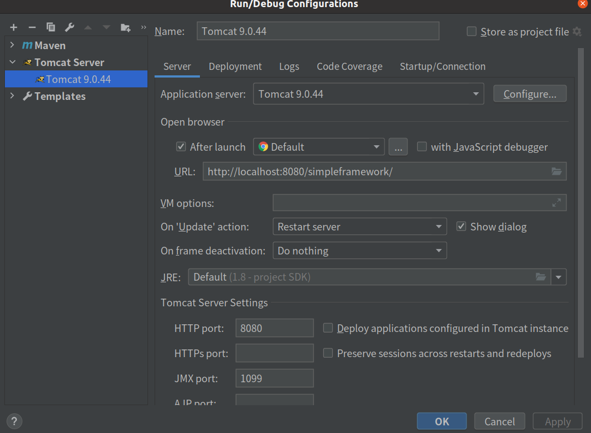

# 简易spring框架

## 基本雏形

新建maven项目，不用任何模板。

### pom

编写pom文件：

添加了servlet、jsp的依赖，以及maven compile。

```xml
<?xml version="1.0" encoding="UTF-8"?>
<project xmlns="http://maven.apache.org/POM/4.0.0"
         xmlns:xsi="http://www.w3.org/2001/XMLSchema-instance"
         xsi:schemaLocation="http://maven.apache.org/POM/4.0.0 http://maven.apache.org/xsd/maven-4.0.0.xsd">
    <modelVersion>4.0.0</modelVersion>

    <groupId>com.yikang</groupId>
    <artifactId>simpleframework</artifactId>
    <version>1.0-SNAPSHOT</version>
    <packaging>war</packaging>

    <properties>
        <maven.compiler.source>8</maven.compiler.source>
        <maven.compiler.target>8</maven.compiler.target>
        <project.build.sourceEncoding>UTF-8</project.build.sourceEncoding>
    </properties>

    <dependencies>
        <!-- https://mvnrepository.com/artifact/javax.servlet/javax.servlet-api -->
        <dependency>
            <groupId>javax.servlet</groupId>
            <artifactId>javax.servlet-api</artifactId>
            <version>4.0.1</version>
            <scope>provided</scope>
        </dependency>
        <!-- https://mvnrepository.com/artifact/javax.servlet.jsp/javax.servlet.jsp-api -->
        <dependency>
            <groupId>javax.servlet.jsp</groupId>
            <artifactId>javax.servlet.jsp-api</artifactId>
            <version>2.3.3</version>
            <scope>provided</scope>
        </dependency>

    </dependencies>

    <build>
        <finalName>simpleframework</finalName>
        <pluginManagement>
            <plugins>
                <plugin>
                    <!-- https://mvnrepository.com/artifact/org.apache.maven.plugins/maven-compiler-plugin -->
                    <groupId>org.apache.maven.plugins</groupId>
                    <artifactId>maven-compiler-plugin</artifactId>
                    <version>3.8.1</version>
                    <configuration>
                        <source>8</source>
                        <target>8</target>
                    </configuration>
                </plugin>
            </plugins>
        </pluginManagement>
    </build>

</project>
```

### HelloServlet

```java
@WebServlet("/hello")
public class HelloServlet extends HttpServlet {
    @Override
    protected void doGet(HttpServletRequest req, HttpServletResponse resp) throws ServletException, IOException {
        String name = "简易框架";
        req.setAttribute("name", name);
        req.getRequestDispatcher("/WEB-INF/jsp/hello.jsp").forward(req, resp);
    }
}
```

### hello.jsp

```html
<%@ page pageEncoding="UTF-8" %>
<html>
<head>
    <title>Hello</title>
</head>
<body>
<h1>Hello!</h1>
<h2>${name}</h2>
</body>
</html>
```

### tomcat配置



### 启动测试

运行tomcat插件，访问[地址](http://localhost:8080/simpleframework/hello)。

## 业务层基本架构搭建

### 拦截请求

拦截请求，根据不同的url转发给不同的controller处理。

```java
/**
 * 这个类起拦截功能，根据不同的url转发到不同的controller处理
 */
@WebServlet("/")
//注意，不能拦截"/*"，否则会进入死循环。因为"/*"会拦截转发行为（forward hello.jsp）
//"/"不会拦截jsp请求
public class DispatcherServlet extends HttpServlet {

    @Override
    protected void service(HttpServletRequest req, HttpServletResponse resp) throws ServletException, IOException {
        System.out.println(req.getServletPath());
        System.out.println(req.getMethod());
        if (req.getServletPath().equals("/frontend/getmainpageinfo") && req.getMethod().equals("GET")) {
            new MainPageController().getMainPageInfo(req, resp);
        } else if (req.getServletPath().equals("/superadmin/addheadline") && req.getMethod().equals("POST")) {
            new HeadLineOperationController().addHeadLine(req, resp);
        }
    }
}
```

### service层

```java
public interface HeadLineShopCategoryCombineService {
    Result<MainPageInfoDTO> getMainPageInfo();
}
```

```java
public interface HeadLineService {
    Result<Boolean> addHeadLine(HeadLine headLine);

    Result<Boolean> removeHeadLine(int headLineId);

    Result<Boolean> modifyHeadLine(HeadLine headLine);

    Result<HeadLine> queryHeadLineById(int headLineId);

    Result<List<HeadLine>> queryHeadLineList(HeadLine headLineCondition, int pageIndex, int pageSize);
}
```

```java
public interface ShopCategoryService {
    Result<Boolean> addShopCategory(ShopCategory shopCategory);

    Result<Boolean> removeShopCategory(int shopCategoryId);

    Result<Boolean> modifyShopCategory(ShopCategory shopCategory);

    Result<ShopCategory> queryShopCategoryById(int shopCategoryId);

    Result<List<ShopCategory>> queryShopCategory(ShopCategory shopCategoryCondition, int pageIndex, int pageSize);
}
```

### controller层

主要有处理主页、处理headline（包含增删查改）、处理shopcategory（包含增删查改），各个方法是各service加上参数检验的代理。

## 根据package获取类集合

根据包名获取该包下的所有类。

首先需要获取类的加载器，以获取项目发布的实际路径，为什么不让用户传入绝对路径？因为不同机器之间的路径可能不同，且如果打的是war包或者jar包，那么根本找不到路径，因此通用的做法是通过项目的类加载器来获取。

根据包名，类加载器可以返回对应的URL，然后从这个URL中递归遍历查找class文件，将他们都加入集合中。

```java
package org.simpleframework.util;

import lombok.extern.slf4j.Slf4j;

import java.io.File;
import java.io.FileFilter;
import java.net.URL;
import java.util.HashSet;
import java.util.Set;

@Slf4j
public class ClassUtil {

    public static final String FILE_PROTOCOL = "file";

    /**
     * 获取包下类集合
     * 1、获取到类的加载器，以获取项目发布的实际路径
     * 为什么不让用户传入绝对路径？因为不同机器之间的路径可能不同；如果打的是war包或者jar包，那么根本找不到路径
     * 因此通用的做法是通过项目的类加载器来获取
     * 2、通过类加载器获取到加载的资源信息
     * 3、依据不同的资源类型，采用不同的方式获取资源的集合
     *
     * @param packageName 包名
     * @return 类集合
     */
    public static Set<Class<?>> extractPackageClass(String packageName) {
        ClassLoader classLoader = getClassLoader();
        //注意包名中的点替换成反斜杠
        URL url = classLoader.getResource(packageName.replace(".", File.separator));
        if (url == null) {
            log.warn("unable to retrieve anything from package:" + packageName);
            return null;
        }
        Set<Class<?>> classSet = null;
        //过滤出本地文件类型的资源
        if (url.getProtocol().equalsIgnoreCase(FILE_PROTOCOL)) {
            classSet = new HashSet<>();
            File packageDirectory = new File(url.getPath());
            extractClassFile(classSet, packageDirectory, packageName);
        }
        //TODO 此处可以加入针对其他类型资源的处理
        return classSet;
    }

    /**
     * 递归获取目标package里面的所有class文件（包括子package里的class文件）
     *
     * @param classSet    装载目标的集合
     * @param fileSource  文件或者目录
     * @param packageName 报名
     */
    private static void extractClassFile(Set<Class<?>> classSet, File fileSource, String packageName) {
        if (!fileSource.isDirectory()) {
            return;
        }
        //如果是文件夹，则调用其listFiles方法获取文件夹下的文件或文件夹
        File[] files = fileSource.listFiles(new FileFilter() {
            @Override
            public boolean accept(File file) {
                if (file.isDirectory()) {
                    return true;
                } else {
                    //获取文件的绝对值路径
                    String absolutePath = file.getAbsolutePath();
                    if (absolutePath.endsWith(".class")) {
                        //若是class文件，则直接加载
                        addToClassSet(absolutePath);
                    }
                }
                return false;
            }

            //根据class文件的绝对值路径，获取并生成class对象，并放入classSet中
            private void addToClassSet(String absolutePath) {
                //1.从class文件的绝对值路径里提取出包含了package的类名
                //如/home/yikang/IdeaProjects/springframework/simpleframework/target/classes/com/yikang/entity/dto/MainPageInfoDTO.class
                //需要弄成com.yikang.entity.dto.MainPageInfoDTO
                absolutePath = absolutePath.replace(File.separator, ".");
                String className = absolutePath.substring(absolutePath.indexOf(packageName));
                className = className.substring(0, className.lastIndexOf("."));
                //2、通过反射机制获取对应的class对象并加入到classSet里
                Class targetClass = loadClass(className);
                classSet.add(targetClass);
            }
        });
        if (files != null) {
            for (File f : files) {
                extractClassFile(classSet, f, packageName);
            }
        }
    }

    /**
     * 获取classLoader
     *
     * @return classLoader
     */
    public static ClassLoader getClassLoader() {
        return Thread.currentThread().getContextClassLoader();
    }

    /**
     * 根据类的全名获取class对象
     *
     * @param className 类的全名
     * @return Class
     */
    public static Class<?> loadClass(String className) {
        try {
            return Class.forName(className);
        } catch (ClassNotFoundException e) {
            log.error("load class error", e);
            throw new RuntimeException(e);
        }
    }
}
```

## 无视反射和序列化攻击的单例

一般有两种方式实现单例，一种使用静态初始化，一种使用锁+二重检查：

```java
public class StarvingSingleton {
    private static final StarvingSingleton starvingSingleton = new StarvingSingleton();
    private StarvingSingleton(){ }
    public static StarvingSingleton getInstance(){
        return starvingSingleton;
    }
}
```

```java
public class LazyDoubleCheckSingleton {
    private volatile static LazyDoubleCheckSingleton instance;

    private LazyDoubleCheckSingleton(){}

    public static LazyDoubleCheckSingleton getInstance(){

        //第一次检测
        if (instance==null){
            //同步
            synchronized (LazyDoubleCheckSingleton.class){
                if (instance == null){
                    //memory = allocate(); //1.分配对象内存空间
                    //instance(memory);    //2.初始化对象
                    //instance = memory;   //3.设置instance指向刚分配的内存地址，此时instance！=null
                    instance = new LazyDoubleCheckSingleton();
                }
            }
        }
        return instance;
    }
}
```

> 注意，在第二种方式里，instance必须为volatile的，因为可能会发生指令重排，导致可能会发生instance有值而并未初始化完成的情况。

这些都能被反射攻破。

对于第一种，原理在于将构造函数设置为private，静态初始化，那么反射直接调用该静态的构造函数就能攻破了。

对于第二种也是一样的情况。

对于序列化攻击，序列化会通过反射调用无参数的构造方法创建一个新的对象。

那么如何实现出无视反射和序列化攻击的单例呢？使用枚举，枚举不允许反射来创建对象。

```java
public class EnumStarvingSingleton {
    private EnumStarvingSingleton() {
    }

    public static EnumStarvingSingleton getInstance() {
        return ContainerHolder.HOLDER.instance;
    }

    private enum ContainerHolder {
        HOLDER;
        private EnumStarvingSingleton instance;

        ContainerHolder() {
            instance = new EnumStarvingSingleton();
        }
    }

}
```

如果使用反射获取到构造函数，那么将报错：`cannot reflectively create enum objects`。

## 小tip

可以设置VM参数来更好地研究源码：

```bash
# 将中间生成的代理类保存下来
-Djdk.proxy.ProxyGenerator.saveGeneratedFiles=true
# 将加载的类打印出来
-XX:+TraceClassLoading
```


