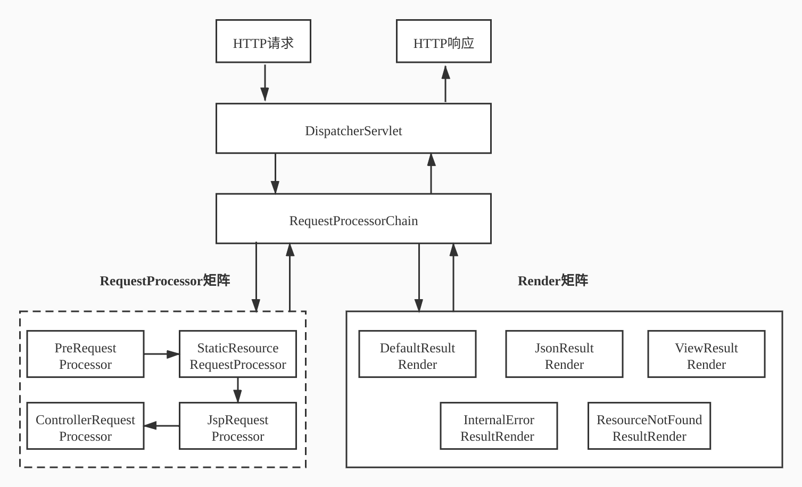

# 简易spring框架

## 基本雏形

新建maven项目，不用任何模板。

### pom

编写pom文件：

添加了servlet、jsp的依赖，以及maven compile。

```xml
<?xml version="1.0" encoding="UTF-8"?>
<project xmlns="http://maven.apache.org/POM/4.0.0"
         xmlns:xsi="http://www.w3.org/2001/XMLSchema-instance"
         xsi:schemaLocation="http://maven.apache.org/POM/4.0.0 http://maven.apache.org/xsd/maven-4.0.0.xsd">
    <modelVersion>4.0.0</modelVersion>

    <groupId>com.yikang</groupId>
    <artifactId>simpleframework</artifactId>
    <version>1.0-SNAPSHOT</version>
    <packaging>war</packaging>

    <properties>
        <maven.compiler.source>8</maven.compiler.source>
        <maven.compiler.target>8</maven.compiler.target>
        <project.build.sourceEncoding>UTF-8</project.build.sourceEncoding>
    </properties>

    <dependencies>
        <!-- https://mvnrepository.com/artifact/javax.servlet/javax.servlet-api -->
        <dependency>
            <groupId>javax.servlet</groupId>
            <artifactId>javax.servlet-api</artifactId>
            <version>4.0.1</version>
            <scope>provided</scope>
        </dependency>
        <!-- https://mvnrepository.com/artifact/javax.servlet.jsp/javax.servlet.jsp-api -->
        <dependency>
            <groupId>javax.servlet.jsp</groupId>
            <artifactId>javax.servlet.jsp-api</artifactId>
            <version>2.3.3</version>
            <scope>provided</scope>
        </dependency>

    </dependencies>

    <build>
        <finalName>simpleframework</finalName>
        <pluginManagement>
            <plugins>
                <plugin>
                    <!-- https://mvnrepository.com/artifact/org.apache.maven.plugins/maven-compiler-plugin -->
                    <groupId>org.apache.maven.plugins</groupId>
                    <artifactId>maven-compiler-plugin</artifactId>
                    <version>3.8.1</version>
                    <configuration>
                        <source>8</source>
                        <target>8</target>
                    </configuration>
                </plugin>
            </plugins>
        </pluginManagement>
    </build>

</project>
```

### HelloServlet

```java
@WebServlet("/hello")
public class HelloServlet extends HttpServlet {
    @Override
    protected void doGet(HttpServletRequest req, HttpServletResponse resp) throws ServletException, IOException {
        String name = "简易框架";
        req.setAttribute("name", name);
        req.getRequestDispatcher("/WEB-INF/jsp/hello.jsp").forward(req, resp);
    }
}
```

### hello.jsp

```html
<%@ page pageEncoding="UTF-8" %>
<html>
<head>
    <title>Hello</title>
</head>
<body>
<h1>Hello!</h1>
<h2>${name}</h2>
</body>
</html>
```

### tomcat配置


### 启动测试

运行tomcat插件，访问[地址](http://localhost:8080/simpleframework/hello)。

## 业务层基本架构搭建

### 拦截请求

拦截请求，根据不同的url转发给不同的controller处理。

```java
/**
 * 这个类起拦截功能，根据不同的url转发到不同的controller处理
 */
@WebServlet("/")
//注意，不能拦截"/*"，否则会进入死循环。因为"/*"会拦截转发行为（forward hello.jsp）
//"/"不会拦截jsp请求
public class DispatcherServlet extends HttpServlet {

    @Override
    protected void service(HttpServletRequest req, HttpServletResponse resp) throws ServletException, IOException {
        System.out.println(req.getServletPath());
        System.out.println(req.getMethod());
        if (req.getServletPath().equals("/frontend/getmainpageinfo") && req.getMethod().equals("GET")) {
            new MainPageController().getMainPageInfo(req, resp);
        } else if (req.getServletPath().equals("/superadmin/addheadline") && req.getMethod().equals("POST")) {
            new HeadLineOperationController().addHeadLine(req, resp);
        }
    }
}
```

### service层

```java
public interface HeadLineShopCategoryCombineService {
    Result<MainPageInfoDTO> getMainPageInfo();
}
```

```java
public interface HeadLineService {
    Result<Boolean> addHeadLine(HeadLine headLine);

    Result<Boolean> removeHeadLine(int headLineId);

    Result<Boolean> modifyHeadLine(HeadLine headLine);

    Result<HeadLine> queryHeadLineById(int headLineId);

    Result<List<HeadLine>> queryHeadLineList(HeadLine headLineCondition, int pageIndex, int pageSize);
}
```

```java
public interface ShopCategoryService {
    Result<Boolean> addShopCategory(ShopCategory shopCategory);

    Result<Boolean> removeShopCategory(int shopCategoryId);

    Result<Boolean> modifyShopCategory(ShopCategory shopCategory);

    Result<ShopCategory> queryShopCategoryById(int shopCategoryId);

    Result<List<ShopCategory>> queryShopCategory(ShopCategory shopCategoryCondition, int pageIndex, int pageSize);
}
```

### controller层

主要有处理主页、处理headline（包含增删查改）、处理shopcategory（包含增删查改），各个方法是各service加上参数检验的代理。

## 根据package获取类集合

根据包名获取该包下的所有类。

首先需要获取类的加载器，以获取项目发布的实际路径，为什么不让用户传入绝对路径？因为不同机器之间的路径可能不同，且如果打的是war包或者jar包，那么根本找不到路径，因此通用的做法是通过项目的类加载器来获取。

根据包名，类加载器可以返回对应的URL，然后从这个URL中递归遍历查找class文件，将他们都加入集合中。

```java
package org.simpleframework.util;

import lombok.extern.slf4j.Slf4j;

import java.io.File;
import java.io.FileFilter;
import java.net.URL;
import java.util.HashSet;
import java.util.Set;

@Slf4j
public class ClassUtil {

    public static final String FILE_PROTOCOL = "file";

    /**
     * 获取包下类集合
     * 1、获取到类的加载器，以获取项目发布的实际路径
     * 为什么不让用户传入绝对路径？因为不同机器之间的路径可能不同；如果打的是war包或者jar包，那么根本找不到路径
     * 因此通用的做法是通过项目的类加载器来获取
     * 2、通过类加载器获取到加载的资源信息
     * 3、依据不同的资源类型，采用不同的方式获取资源的集合
     *
     * @param packageName 包名
     * @return 类集合
     */
    public static Set<Class<?>> extractPackageClass(String packageName) {
        ClassLoader classLoader = getClassLoader();
        //注意包名中的点替换成反斜杠
        URL url = classLoader.getResource(packageName.replace(".", File.separator));
        if (url == null) {
            log.warn("unable to retrieve anything from package:" + packageName);
            return null;
        }
        Set<Class<?>> classSet = null;
        //过滤出本地文件类型的资源
        if (url.getProtocol().equalsIgnoreCase(FILE_PROTOCOL)) {
            classSet = new HashSet<>();
            File packageDirectory = new File(url.getPath());
            extractClassFile(classSet, packageDirectory, packageName);
        }
        //TODO 此处可以加入针对其他类型资源的处理
        return classSet;
    }

    /**
     * 递归获取目标package里面的所有class文件（包括子package里的class文件）
     *
     * @param classSet    装载目标的集合
     * @param fileSource  文件或者目录
     * @param packageName 报名
     */
    private static void extractClassFile(Set<Class<?>> classSet, File fileSource, String packageName) {
        if (!fileSource.isDirectory()) {
            return;
        }
        //如果是文件夹，则调用其listFiles方法获取文件夹下的文件或文件夹
        File[] files = fileSource.listFiles(new FileFilter() {
            @Override
            public boolean accept(File file) {
                if (file.isDirectory()) {
                    return true;
                } else {
                    //获取文件的绝对值路径
                    String absolutePath = file.getAbsolutePath();
                    if (absolutePath.endsWith(".class")) {
                        //若是class文件，则直接加载
                        addToClassSet(absolutePath);
                    }
                }
                return false;
            }

            //根据class文件的绝对值路径，获取并生成class对象，并放入classSet中
            private void addToClassSet(String absolutePath) {
                //1.从class文件的绝对值路径里提取出包含了package的类名
                //如/home/yikang/IdeaProjects/springframework/simpleframework/target/classes/com/yikang/entity/dto/MainPageInfoDTO.class
                //需要弄成com.yikang.entity.dto.MainPageInfoDTO
                absolutePath = absolutePath.replace(File.separator, ".");
                String className = absolutePath.substring(absolutePath.indexOf(packageName));
                className = className.substring(0, className.lastIndexOf("."));
                //2、通过反射机制获取对应的class对象并加入到classSet里
                Class targetClass = loadClass(className);
                classSet.add(targetClass);
            }
        });
        if (files != null) {
            for (File f : files) {
                extractClassFile(classSet, f, packageName);
            }
        }
    }

    /**
     * 获取classLoader
     *
     * @return classLoader
     */
    public static ClassLoader getClassLoader() {
        return Thread.currentThread().getContextClassLoader();
    }

    /**
     * 根据类的全名获取class对象
     *
     * @param className 类的全名
     * @return Class
     */
    public static Class<?> loadClass(String className) {
        try {
            return Class.forName(className);
        } catch (ClassNotFoundException e) {
            log.error("load class error", e);
            throw new RuntimeException(e);
        }
    }
}
```

## 无视反射和序列化攻击的单例

一般有两种方式实现单例，一种使用静态初始化，一种使用锁+二重检查：

```java
public class StarvingSingleton {
    private static final StarvingSingleton starvingSingleton = new StarvingSingleton();
    private StarvingSingleton(){ }
    public static StarvingSingleton getInstance(){
        return starvingSingleton;
    }
}
```

```java
public class LazyDoubleCheckSingleton {
    private volatile static LazyDoubleCheckSingleton instance;

    private LazyDoubleCheckSingleton(){}

    public static LazyDoubleCheckSingleton getInstance(){

        //第一次检测
        if (instance==null){
            //同步
            synchronized (LazyDoubleCheckSingleton.class){
                if (instance == null){
                    //memory = allocate(); //1.分配对象内存空间
                    //instance(memory);    //2.初始化对象
                    //instance = memory;   //3.设置instance指向刚分配的内存地址，此时instance！=null
                    instance = new LazyDoubleCheckSingleton();
                }
            }
        }
        return instance;
    }
}
```

> 注意，在第二种方式里，instance必须为volatile的，因为可能会发生指令重排，导致可能会发生instance有值而并未初始化完成的情况。

这些都能被反射攻破。

对于第一种，原理在于将构造函数设置为private，静态初始化，那么反射直接调用该静态的构造函数就能攻破了。

对于第二种也是一样的情况。

对于序列化攻击，序列化会通过反射调用无参数的构造方法创建一个新的对象。

那么如何实现出无视反射和序列化攻击的单例呢？使用枚举，枚举不允许反射来创建对象。

```java
public class EnumStarvingSingleton {
    private EnumStarvingSingleton() {
    }

    public static EnumStarvingSingleton getInstance() {
        return ContainerHolder.HOLDER.instance;
    }

    private enum ContainerHolder {
        HOLDER;
        private EnumStarvingSingleton instance;

        ContainerHolder() {
            instance = new EnumStarvingSingleton();
        }
    }

}
```

如果使用反射获取到构造函数，那么将报错：`cannot reflectively create enum objects`。

## IOC容器

### 容器的载体以及容器的加载

需要保证容器是单例，可以使用上面讲到的枚举类来实现，避免被反射和序列化破坏 。

在初始化时，容器将所有被特定注解（如`@Component, @Controller`等）标注的类进行初始化构建，用一个map来存储，其中，键为`Class<?>`，值为`Object`，通过class对象可以获取对应类的实例。

定义一个`loadBean`的方法，传入包名，扫描包下的所有类，如果该类被特定注解标记，那么通过反射获取它的无参构造函数，`newInstance`出一个实例放入map中。

```java
@Slf4j
@NoArgsConstructor(access = AccessLevel.PRIVATE)
public class BeanContainer {

    /**
     * 存放所有被配置标记的目标对象的map
     */
    private final Map<Class<?>, Object> beanMap = new ConcurrentHashMap<>();

    /**
     * 加载bean的注解列表
     */
    private static final List<Class<? extends Annotation>> BEAN_ANNOTATION =
            Arrays.asList(Component.class, Controller.class, Service.class, Repository.class);

    /**
     * 获取bean容器实例
     *
     * @return
     */
    public static BeanContainer getInstance() {
        return ContainerHolder.HOLDER.instance;
    }


    private enum ContainerHolder {
        HOLDER;
        private BeanContainer instance;

        ContainerHolder() {
            instance = new BeanContainer();
        }
    }

    /**
     * 容器是否被加载过
     */
    private boolean loaded = false;

    /**
     * 容器是否已经被加载过
     *
     * @return 容器是否已经被加载过
     */
    public boolean isLoaded() {
        return loaded;
    }

    /**
     * Bean实例数量
     *
     * @return 数量
     */
    public int size() {
        return beanMap.size();
    }

    /**
     * 扫描加载所有的bean
     *
     * @param packageName 包名
     */
    public synchronized void loadBeans(String packageName) {
        //判断bean容器是否被加载过
        if (isLoaded()) {
            log.warn("BeanContainer has been loaded");
            return;
        }
        Set<Class<?>> classSet = ClassUtil.extractPackageClass(packageName);
        if (ValidationUtil.isEmpty(classSet)) {
            log.warn("extract nothing from packageName " + packageName);
            return;
        }
        for (Class<?> clazz : classSet) {
            for (Class<? extends Annotation> annotation : BEAN_ANNOTATION) {
                //如果类上面标记了定义的注解
                if (clazz.isAnnotationPresent(annotation)) {
                    //将目标类本身作为键，目标类的实例作为值，放入到beanMap中
                    beanMap.put(clazz, ClassUtil.newInstance(clazz, true));
                }
            }
        }
        loaded = true;
    }
}
```

### 提供容器对外操作的方法

```java
/**
 * 添加一个class对象及其Bean实例
 *
 * @param clazz class对象
 * @param bean  bean实例
 * @return 原有的bean实例，没有则返回null
 */
public Object addBean(Class<?> clazz, Object bean) {
    return beanMap.put(clazz, bean);
}

/**
 * 移除一个IOC容器管理的对象
 *
 * @param clazz class对象
 * @return 删除的bean实例，没有则返回null
 */
public Object removeBean(Class<?> clazz) {
    return beanMap.remove(clazz);
}

/**
 * 根据class对象获取bean实例
 *
 * @param clazz class对象
 * @return bean实例
 */
public Object getBean(Class<?> clazz) {
    return beanMap.get(clazz);
}

/**
 * 获取容器管理的所有class对象集合
 *
 * @return class集合
 */
public Set<Class<?>> getClasses() {
    return beanMap.keySet();
}

/**
 * 获取所有bean的集合
 *
 * @return bean集合
 */
public Set<Object> getBeans() {
    return new HashSet<>(beanMap.values());
}

/**
 * 根据注解筛选出bean的class集合
 *
 * @param annotation 注解
 * @return class集合
 */
public Set<Class<?>> getClassesByAnnotation(Class<? extends Annotation> annotation) {
    //1、获取beanMap的所有class对象
    Set<Class<?>> keySet = getClasses();
    if (ValidationUtil.isEmpty(keySet)) {
        log.warn("nothing in beanMap");
        return null;
    }
    Set<Class<?>> classSet = new HashSet<>();
    //2、通过注解筛选出被注解标记的class对象，并添加到classSet中
    for (Class<?> clazz : keySet) {
        if (clazz.isAnnotationPresent(annotation)) {
            classSet.add(clazz);
        }
    }
    return classSet.size() > 0 ? classSet : null;
}

/**
 * 通过接口或者父类获取实现类或者子类的class集合，不包括其本身
 *
 * @param interfaceOrClass 接口class或者父类class
 * @return class集合
 */
public Set<Class<?>> getClassesBySuper(Class<?> interfaceOrClass) {
    //1、获取beanMap的所有class对象
    Set<Class<?>> keySet = getClasses();
    if (ValidationUtil.isEmpty(keySet)) {
        log.warn("nothing in beanMap");
        return null;
    }
    Set<Class<?>> classSet = new HashSet<>();
    //2、判断keySet里的元素是否是传入的接口或者类的子类，如果是，就将其添加到classSet中
    for (Class<?> clazz : keySet) {
        //注意，isAssignableFrom还包括自己本身，需要排除在外
        if (interfaceOrClass.isAssignableFrom(clazz) && !clazz.equals(interfaceOrClass)) {
            classSet.add(clazz);
        }
    }
    return classSet.size() > 0 ? classSet : null;
}
```

以下是测试类：

```java
@TestMethodOrder(MethodOrderer.OrderAnnotation.class)
public class BeanContainerTest {
    private static BeanContainer beanContainer;

    @BeforeAll
    static void init() {
        beanContainer = BeanContainer.getInstance();
    }

    @DisplayName("加载目标类及其实例到BeanContainer：loadBeansTest")
    @Order(1)
    @Test
    public void loadBeansTest() {
        Assertions.assertEquals(false, beanContainer.isLoaded());
        beanContainer.loadBeans("com.yikang");
        Assertions.assertEquals(7, beanContainer.size());
        Assertions.assertEquals(true, beanContainer.isLoaded());
    }

    @DisplayName("根据获取其实例：getBeanTest")
    @Order(2)
    @Test
    public void getBean() {
        MainPageController mainPageController = (MainPageController) beanContainer.getBean(MainPageController.class);
        Assertions.assertEquals(true, mainPageController instanceof MainPageController);
        DispatcherServlet dispatcherServlet = (DispatcherServlet) beanContainer.getBean(DispatcherServlet.class);
        Assertions.assertEquals(null, dispatcherServlet);
    }

    @DisplayName("根据注解获取对应的实例：getClassesByAnnotationTest")
    @Order(3)
    @Test
    public void getClassesByAnnotationTest() {
        Assertions.assertEquals(true, beanContainer.isLoaded());
        Assertions.assertEquals(3, beanContainer.getClassesByAnnotation(Controller.class).size());
    }

    @DisplayName("根据接口获取实现类：getClassesBySuperTest")
    @Order(4)
    @Test
    public void getClassesBySuperTest() {
        Assertions.assertEquals(true, beanContainer.isLoaded());
        Assertions.assertEquals(true, beanContainer.getClassesBySuper(HeadLineService.class).contains(HeadLineServiceImpl.class));
    }
}
```

### 实现容器的依赖注入

上述实现是不够的，可以注意到，在一些类的实现中可能会注入其他类，例如`@Autowired`注解，我们在进行实例化某个类时还需要将它需要的类依赖注入到其中。

首先需要定义相关注解标签，实现创建被注解标记的成员变量实例，并将其注入到成员变量里。

首先定义`@Autowired`注解：

```java
/* 
* Autowired 目前仅支持成员变量的注入
*/
@Target(ElementType.FIELD)
@Retention(RetentionPolicy.RUNTIME)
public @interface Autowired {
    String value() default "";
}
```

其中`value`变量用于指定注入的实具体现类（如果有多个实现类的话）。

然后编写注入的代码：

大致的流程是这样的：

1、遍历Bean容器中所有的class对象

2、遍历class对象的所有成员变量

3、找出被Autowired标记的成员变量

4、获取这些成员变量的类型即class

5、获取这些成员变量的类型在容器里对应的实例

6、通过反射将对应的成员变量实例注入到成员变量所在类的实例里

之前我们已经编写了BeanContainer类中的getClassesBySuper的方法来获取某个父类或容器的所有实现，可以调用该方法来获取所有的实现，然后根据`@Autowired`的成员变量`value`来具体地选择具体的实现类。

```java
@Slf4j
public class DependencyInjector {
    /**
     * bean容器
     */
    private BeanContainer beanContainer;

    public DependencyInjector() {
        beanContainer = BeanContainer.getInstance();
    }

    /**
     * 执行Ioc
     */
    public void doIoc() {
        //1、遍历Bean容器中所有的class对象
        Set<Class<?>> classSet = beanContainer.getClasses();
        if (ValidationUtil.isEmpty(classSet)) {
            log.warn("empty classSet in BeanContainer");
            return;
        }
        for (Class<?> clazz : classSet) {
            //2、遍历class对象的所有成员变量
            Field[] fields = clazz.getDeclaredFields();
            if (ValidationUtil.isEmpty(fields)) {
                continue;
            }
            for (Field field : fields) {
                //3、找出被Autowired标记的成员变量
                if (field.isAnnotationPresent(Autowired.class)) {
                    Autowired autowired = field.getAnnotation(Autowired.class);
                    String autowiredValue = autowired.value();
                    //4、获取这些成员变量的类型
                    Class<?> fieldClass = field.getType();
                    //5、获取这些成员变量的类型在容器里对应的实例
                    Object fieldValue = getFieldInstance(fieldClass, autowiredValue);
                    if (fieldValue == null) {
                        throw new RuntimeException("unable to inject relevant type, target fieldClass is:" + fieldClass.getName() + " " + autowiredValue);
                    } else {
                        //6、通过反射将对应的成员变量实例注入到成员变量所在类的实例里
                        Object targetBean = beanContainer.getBean(clazz);
                        ClassUtil.setField(field, targetBean, fieldValue, true);
                    }
                }
            }
        }
    }

    /**
     * 根据class在beanContainer里获取其实例或者实现类
     *
     * @param fieldClass     class
     * @param autowiredValue 如果实现类有多个，那么指定注入哪种实现类
     * @return class实例
     */
    private Object getFieldInstance(Class<?> fieldClass, String autowiredValue) {
        Object fieldValue = beanContainer.getBean(fieldClass);
        if (fieldValue != null) {
            return fieldValue;
        } else {
            //fieldClass可能是接口的接口
            Class<?> implementedClass = getImplementClass(fieldClass, autowiredValue);
            if (implementedClass != null) {
                return beanContainer.getBean(implementedClass);
            } else {
                return null;
            }
        }
    }

    /**
     * 获取接口的实现类
     *
     * @param fieldClass     class
     * @param autowiredValue 如果实现类有多个，那么指定注入哪种实现类
     * @return 实现类
     */
    private Class<?> getImplementClass(Class<?> fieldClass, String autowiredValue) {
        Set<Class<?>> classSet = beanContainer.getClassesBySuper(fieldClass);
        if (!ValidationUtil.isEmpty(classSet)) {
            if (ValidationUtil.isEmpty(autowiredValue)) {
                if (classSet.size() == 1) {
                    return classSet.iterator().next();
                } else {
                    //如果有多个实现类，但是用户没有指定哪种，则抛出异常
                    throw new RuntimeException("multiple implemented classes for" + fieldClass.getName() + "please set @Autowired's value to pick one");
                }
            } else {
                for (Class<?> clazz : classSet) {
                    if (autowiredValue.equals(clazz.getSimpleName())) {
                        return clazz;
                    }
                }
            }
        }
        return null;
    }

}
```

以下为测试类：

```java
public class DependencyInjectorTest {

    @DisplayName("依赖注入doIoc")
    @Test
    public void doIocTest() {
        BeanContainer beanContainer = BeanContainer.getInstance();
        beanContainer.loadBeans("com.yikang");
        Assertions.assertEquals(true, beanContainer.isLoaded());
        MainPageController mainPageController = (MainPageController) beanContainer.getBean(MainPageController.class);
        Assertions.assertEquals(true, mainPageController instanceof MainPageController);
        Assertions.assertEquals(null, mainPageController.getHeadLineShopCategoryCombineService());
        new DependencyInjector().doIoc();
        Assertions.assertNotEquals(null, mainPageController.getHeadLineShopCategoryCombineService());
        Assertions.assertEquals(true, mainPageController.getHeadLineShopCategoryCombineService() instanceof HeadLineShopCategoryCombineServiceImpl);
    }
}
```

## SpringAOP

### CGLIB动态代理

+ 不要求被代理类实现接口
+ 内部主要封装了ASM Java字节码操控框架
+ 动态生成子类以覆盖非final的方法，绑定钩子回调自定义拦截器

### JDK动态代理和CGLIB

#### 实现机制

+ JDK动态代理：基于反射机制实现，要求业务必须实现接口
+ CGLIB：基于ASM机制实现，生成业务类的子类作为代理类

#### JDK动态代理的优势

+ JDK原生，在JVM里运行较为可靠
+ 平滑支持JDK版本的升级

#### CGLIB

+ 被代理对象无需实现接口，能实现代理类的无侵入

#### SpringAOP的低层机制

+ CGLIB和JDK动态代理共存
+ 默认策略：Bean实现了接口则用JDK，否则使用CGLIB

## 实现AOP1.0

### AOP 1.0总览

使用CGLIB来实现：不需要业务类实现接口，相对灵活

+ 解决标记的问题，定义横切逻辑的骨架
+ 定义Aspect横切逻辑以及被代理方法的执行顺序
+ 将横切逻辑织入到被代理的对象以生成动态代理对象

### 解决横切逻辑的标记问题以及定义Aspect骨架

+ 定义与横切逻辑相关的注解
+ 定义供外部使用的横切逻辑的骨架

首先定义与横切逻辑相关的注解`@Aspect`, `@Order`：

```java
@Target(ElementType.TYPE)
@Retention(RetentionPolicy.RUNTIME)
public @interface Aspect {
    /**
     * 需要被织入横切逻辑的注解标签
     */
    Class<? extends Annotation> value();
}
```

```java
@Target(ElementType.METHOD)
@Retention(RetentionPolicy.RUNTIME)
public @interface Order {
    /**
     * 控制类的执行顺序，值越小优先级越高
     */
    int value();
}
```

定义供外部使用的横切逻辑的骨架。

这里不实现`@Before`等注解，反之用继承的方式来实现`before`，`afterReturning`，`afterThrowing`等方法，如果需要实现切面，那么需要继承这个抽象类：

```java
public abstract class DefaultAspect {
    /**
     * 钩子方法，用于事前拦截
     *
     * @param targetClass 被代理的目标类
     * @param method      被代理的目标方法
     * @param args        被代理的目标方法对应的参数列表
     * @throws Throwable
     */
    public void before(Class<?> targetClass, Method method, Object[] args) throws Throwable {

    }

    /**
     * 钩子方法，用于事后拦截
     *
     * @param targetClass 被代理的目标类
     * @param method      被代理的目标方法
     * @param args        被代理的目标方法对应的参数列表
     * @param returnValue 被代理的目标方法执行后的返回值
     * @return 被目标方法执行后的返回值
     * @throws Throwable
     */
    public Object afterReturning(Class<?> targetClass, Method method, Object[] args, Object returnValue) throws Throwable {
        return returnValue;
    }

    /**
     * @param targetClass 被代理的目标类
     * @param method      被代理的目标方法
     * @param args        被代理的目标方法对应的参数列表
     * @param e           被代理的目标方法抛出的异常
     * @throws Throwable
     */
    public void afterThrowing(Class<?> targetClass, Method method, Object[] args, Throwable e) throws Throwable {

    }
}
```

### 实现Aspect横切逻辑以及被代理方法的定序执行

+ 创建MethodInterceptor的实现类
+ 定义必要的成员变量——被代理的类以及Aspect的列表
+ 按照Order对Aspect进行排序
+ 实现对横切逻辑以及被代理对象方法的定序执行

一个aspect有三个属性，需要织入横切逻辑的对象，order，对应的aspect事件逻辑（before、after等）。

将“需要织入横切逻辑的对象”保存在MethodInterceptor实现类中，并且MethodInterceptor实现类中保存某对象被织入的所有aspect。

将“order”、“aspect事件逻辑”合并到一个类`AspectInfo`中：

```java
@AllArgsConstructor
@Getter
public class AspectInfo {
    private int orderIndex;
    private DefaultAspect aspectObject;
}
```

重点是MethodInterceptor的实现类，该实现类某个对象拥有的所有Aspect的引用列表，在重写的`intercept`方法中的`methodProxy.invokeSuper`前后分别调用相应的before与after方法：

```java
public class AspectListExecutor implements MethodInterceptor {
    //被代理的类
    private Class<?> targetClass;

    //排好序的列表
    @Getter
    List<AspectInfo> sortedAspectInfoList;

    public AspectListExecutor(Class<?> targetClass, List<AspectInfo> aspectInfoList) {
        this.targetClass = targetClass;
        this.sortedAspectInfoList = sortAspectInfoList(aspectInfoList);
    }

    /**
     * 按照order的值进行升序排序，确保order值小的aspect先被织入
     *
     * @param aspectInfoList aspectInfo列表
     * @return 排好序后的aspectInfo列表
     */
    private List<AspectInfo> sortAspectInfoList(List<AspectInfo> aspectInfoList) {
        Collections.sort(aspectInfoList, Comparator.comparingInt(AspectInfo::getOrderIndex));
        return aspectInfoList;
    }

    @Override
    public Object intercept(Object o, Method method, Object[] args, MethodProxy methodProxy) throws Throwable {
        Object returnValue = null;
        if (ValidationUtil.isEmpty(sortedAspectInfoList)) return returnValue;
        //1、按照order的顺序升级执行完所有Aspect的before方法
        invokeBeforeAdvices(method, args);
        try {
            //2、执行被代理类的方法
            returnValue = methodProxy.invokeSuper(o, args);
            //3、如果被代理方法正常返回，则按照order的顺序降序执行完所有Aspect的afterReturning方法
            invokeAfterReturningAdvices(method, args, returnValue);
        } catch (Exception e) {
            //4、如果被代理方法抛出异常，则按照order的顺序降序执行完所有Aspect的afterThrowing方法
            invokeAfterThrowingAdvices(method, args, e);
        }
        return returnValue;
    }

    //4、如果被代理方法抛出异常，则按照order的顺序降序执行完所有Aspect的afterThrowing方法
    private void invokeAfterThrowingAdvices(Method method, Object[] args, Exception e) throws Throwable {
        for (int i = sortedAspectInfoList.size() - 1; i >= 0; i--) {
            sortedAspectInfoList.get(i).getAspectObject().afterThrowing(targetClass, method, args, e);
        }
    }

    //3、如果被代理方法正常返回，则按照order的顺序降序执行完所有Aspect的afterReturning方法
    private void invokeAfterReturningAdvices(Method method, Object[] args, Object returnValue) throws Throwable {
        for (int i = sortedAspectInfoList.size() - 1; i >= 0; i--) {
            sortedAspectInfoList.get(i).getAspectObject().afterReturning(targetClass, method, args, returnValue);
        }
    }

    //1、按照order的顺序升级执行完所有Aspect的before方法
    private void invokeBeforeAdvices(Method method, Object[] args) throws Throwable {
        for (AspectInfo aspectInfo : sortedAspectInfoList) {
            aspectInfo.getAspectObject().before(targetClass, method, args);
        }
    }
}
```

然后创建工具类，用于创建动态代理对象返回：

```java
public class ProxyCreator {
    /**
     * 创建动态代理对象并返回
     *
     * @param targetClass       被代理的Class对象
     * @param methodInterceptor 方法拦截器
     * @return 代理对象
     */
    public static Object createProxy(Class<?> targetClass, MethodInterceptor methodInterceptor) {
        return Enhancer.create(targetClass, methodInterceptor);
    }
}
```

### 将横切逻辑织入到被代理的对象以生成动态代理对象

大致的逻辑为：使用`BeanContainer`获取所有的切面类（即被`@Aspect`标注的bean），因为多个切面类可以织入同一个对象，因此需要维护一个map对象，通过某个对象可以获取它的织入切面列表。通过某个对象以及它的织入切面列表可以构造出MethodInterceptor实现类，进而构造出动态代理对象，将动态代理对象替换未被代理前的类实例放入到`BeanContainer`中。

```java
public class AspectWeaver {
    private BeanContainer beanContainer;

    public AspectWeaver() {
        beanContainer = BeanContainer.getInstance();
    }

    public void doAop() {
        //1、获取所有的切面类
        Set<Class<?>> aspectSet = beanContainer.getClassesByAnnotation(Aspect.class);
        //2、将切面类按照不同的织入目标进行切分
        //实现的是简化版的，只能对注解标注的对象织入切面
        Map<Class<? extends Annotation>, List<AspectInfo>> categorizedMap = new HashMap<>();
        if (ValidationUtil.isEmpty(aspectSet)) return;
        for (Class<?> aspectClass : aspectSet) {
            if (verifyAspect(aspectClass)) {
                categorizedAspect(categorizedMap, aspectClass);
            } else {
                throw new RuntimeException("@Aspect and @Order have not been added to the Aspect class," +
                        "or Aspect class does not extend from DefaultAspect, or the value in Aspect Tag equals @Aspect");
            }
        }
        //3、按照不同的织入目标分别去按序织入aspect的逻辑
        if (ValidationUtil.isEmpty(categorizedMap)) return;
        for (Class<? extends Annotation> category : categorizedMap.keySet()) {
            weaveByCategory(category, categorizedMap.get(category));
        }
    }

    private void weaveByCategory(Class<? extends Annotation> category, List<AspectInfo> aspectInfoList) {
        //1、获取被代理类的集合
        Set<Class<?>> classSet = beanContainer.getClassesByAnnotation(category);
        if (ValidationUtil.isEmpty(classSet)) return;
        //2、遍历被代理类，分别为每个被代理类生成动态代理实例
        for (Class<?> targetClass : classSet) {
            //创建动态代理对象
            AspectListExecutor executor = new AspectListExecutor(targetClass, aspectInfoList);
            Object proxyBean = ProxyCreator.createProxy(targetClass, executor);
            //3、将动态代理对象实例添加到容器里，取代未被代理前的类实例
            beanContainer.addBean(targetClass, proxyBean);
        }
    }

    /**
     * 将切面类按照不同的织入目标进行切分
     *
     * @param categorizedMap 分类map
     * @param aspectClass    aspect对象
     */
    private void categorizedAspect(Map<Class<? extends Annotation>, List<AspectInfo>> categorizedMap, Class<?> aspectClass) {
        Order orderTag = aspectClass.getAnnotation(Order.class);
        Aspect aspectTag = aspectClass.getAnnotation(Aspect.class);
        DefaultAspect aspect = (DefaultAspect) beanContainer.getBean(aspectClass);
        AspectInfo aspectInfo = new AspectInfo(orderTag.value(), aspect);
        if (!categorizedMap.containsKey(aspectTag.value())) {
            //如果织入的join point第一次出现，则以该join point为key，以新创建的List<AspectInfo>为value
            List<AspectInfo> aspectInfoList = new ArrayList<>();
            aspectInfoList.add(aspectInfo);
            categorizedMap.put(aspectTag.value(), aspectInfoList);
        } else {
            //如果织入的join point不是第一次出现，则往join point对应的value里添加新的aspectInfo
            categorizedMap.get(aspectTag.value()).add(aspectInfo);
        }
    }

    /**
     * 框架中一定要遵守给Aspect类添加@Aspect和@Order标签的规范，同时，必须继承自DefaultAspect.class
     * 此外，@Aspect的属性值不能是他本身
     *
     * @param aspectClass 需要验证的Aspect对象
     * @return
     */
    private boolean verifyAspect(Class<?> aspectClass) {
        return aspectClass.isAnnotationPresent(Aspect.class)
                && aspectClass.isAnnotationPresent(Order.class)
                && DefaultAspect.class.isAssignableFrom(aspectClass)
                && aspectClass.getAnnotation(Aspect.class).value() != Aspect.class;
    }
}
```

测试代码如下：

注意，应该先进行切面织入再进行依赖注入。

```java
public class AspectWeaverTest {
    @DisplayName("织入通用逻辑测试：doAop")
    @Test
    public void doAopTest() {
        BeanContainer beanContainer = BeanContainer.getInstance();
        beanContainer.loadBeans("com.yikang");
        new AspectWeaver().doAop();
        new DependencyInjector().doIoc();
        HeadLineOperationController headLineOperationController = (HeadLineOperationController) beanContainer.getBean(HeadLineOperationController.class);
        headLineOperationController.addHeadLine(null, null);
    }
}
```

### 待改进的地方

+ Aspect只支持对被某个标签标记的类进行横切逻辑的织入
+ 需要借助AspectJ来达到上述目的

## AspectJ框架

提供了完整的AOP解决方案，是AOP的Java实现版本

+ 定义切面语法以及切面语法的解析机制
+ 提供了强大的织入工具

AspectJ框架的织入时机：静态织入和LTW

+ 编译时织入：利用ajc，将切面逻辑织入到类里生成class文件（静态织入）
+ 编译后织入：利用ajc，修改javac编译出来的class文件（静态织入）
+ 类加载期织入：利用java agent，在类加载的时候织入切面逻辑（动态织入）

对于SpringAOP2.0，仅仅用到了AspectJ的切面语法，并没有使用ajc编译工具

+ 避免增加用户的学习成本
+ 只是默认不使用，如果想用ajc还是可以引入的
+ 织入机制沿用自己的CGLIB和JDK动态代理机制

## 折衷方案改进框架里的AOP

之前的pointcut并不灵活，只支持对被某个标签标记的类进行横切逻辑的织入，因此需要引入AspectJ的切面表达式和相关的定位解析机制。

使用最小的改造成本，换取尽可能大的收益：

+ 让Pointcut更灵活
+ 调研结果：只需要引入AspectJ的切面表达式和相关的定位解析机制

首先在pom文件中引入依赖：

```xml
<dependency>
    <groupId>org.aspectj</groupId>
    <artifactId>aspectjweaver</artifactId>
    <version>1.9.5</version>
</dependency>
```

创建`PointcutLocator`，用于解析AspectJ表达式并且定位被织入的目标，每个aspect都有自己的一个`PointcutLocator`，对每个class对象/method，可以调用当前aspect对应的pointcutLocator.roughMatch/accurateMatch来判断是否是当前aspect织入的对象。

```java
/**
 * 解析Aspect表达式并且定位被织入的目标，与aspect一一对应
 */
public class PointcutLocator {
    /**
     * Pointcut解析器，直接给它赋值上AspectJ的所有表达式，以便支持对众多表达式的解析
     */
    private PointcutParser pointcutParser = PointcutParser.getPointcutParserSupportingSpecifiedPrimitivesAndUsingContextClassloaderForResolution(
            PointcutParser.getAllSupportedPointcutPrimitives()
    );
    /**
     * 表达式解析器
     */
    private PointcutExpression pointcutExpression;

    public PointcutLocator(String expression) {
        this.pointcutExpression = pointcutParser.parsePointcutExpression(expression);
    }

    /**
     * 判断传入的Class对象是否是Aspect的目标代理类，即匹配Pointcut表达式（初筛）
     * 例如，需要去匹配class a，则需要这样调用：
     * pointcutLocator.roughMatches(a)
     *
     * @param targetClass 目标类
     * @return 是否匹配
     */
    public boolean roughMatches(Class<?> targetClass) {
        //couldMatchJoinPointsInType只能校验within
        //不能校验(execution, call, get, set)，面对无法校验的表达式，直接返回true
        return pointcutExpression.couldMatchJoinPointsInType(targetClass);
    }

    /**
     * 判断传入的Method对象是否是AspectJ的目标代理方法，即匹配Pointcut表达式（精筛）
     *
     * @param method
     * @return
     */
    public boolean accurateMatches(Method method) {
        ShadowMatch shadowMatch = pointcutExpression.matchesMethodExecution(method);
        return shadowMatch.alwaysMatches();
    }
}
```

在之前，`@Aspect`的`value`类型为`Class<? extend Annotation>`，只能作用于被注解标注的类，现在引入了AspectJ，作用的范围会更广，因此需要改成`String`类型：

```java
@Target(ElementType.TYPE)
@Retention(RetentionPolicy.RUNTIME)
public @interface Aspect {
    String pointcut();
}
```

同时，每个aspect都有着自己的PointcutLocator，这是用于识别织入对象的工具，因此需要将PointcutLocator整合进`AspectInfo`中：

```java
@AllArgsConstructor
@Getter
public class AspectInfo {
    private int orderIndex;
    private DefaultAspect aspectObject;
    private PointcutLocator pointcutLocator;
}
```

筛选织入对象分为两个阶段，一是初筛，调用的是`PointcurLocator#roughMatches`方法，放在`AspectWeaver`中调用（`roughMatches`只需要接受`Class`参数，在`AspectWeaver`中可以满足条件）；二是精筛，调用的是`PointcutLocator#accurateMatches`，需要传入`Method`参数，在`AspectWeaver`中不太方便，需要遍历`Method`，因此放在MethodInterceptor的实现类中调用。

`AspectWeaver`：

```java
public class AspectWeaver {
    private BeanContainer beanContainer;

    public AspectWeaver() {
        beanContainer = BeanContainer.getInstance();
    }

    public void doAop() {
        //1、获取所有的切面类
        Set<Class<?>> aspectSet = beanContainer.getClassesByAnnotation(Aspect.class);
        if (ValidationUtil.isEmpty(aspectSet)) return;
        //2、拼装AspectInfoList
        List<AspectInfo> aspectInfoList = packAspectInfoList(aspectSet);
        //3、遍历容器里的类
        Set<Class<?>> classSet = beanContainer.getClasses();
        for (Class<?> targetClass : classSet) {
            //排除AspectClass自身
            if (targetClass.isAnnotationPresent(Aspect.class)) {
                continue;
            }
            //4、粗筛符合条件的Aspect
            List<AspectInfo> roughMatchedAspectList = collectRoughMatchedAspectListForSpecificClass(aspectInfoList, targetClass);
            //5、尝试进行Aspect的织入
            wrapIfNecessary(roughMatchedAspectList, targetClass);
        }

    }

    private void wrapIfNecessary(List<AspectInfo> roughMatchedAspectList, Class<?> targetClass) {
        if (ValidationUtil.isEmpty(roughMatchedAspectList)) return;
        //创建动态代理对象
        AspectListExecutor aspectListExecutor = new AspectListExecutor(targetClass, roughMatchedAspectList);
        Object proxyBean = ProxyCreator.createProxy(targetClass, aspectListExecutor);
        beanContainer.addBean(targetClass, proxyBean);
    }

    private List<AspectInfo> collectRoughMatchedAspectListForSpecificClass(List<AspectInfo> aspectInfoList, Class<?> targetClass) {
        List<AspectInfo> roughMatchedAspectList = new ArrayList<>();
        for (AspectInfo aspectInfo : aspectInfoList) {
            //初筛
            if (aspectInfo.getPointcutLocator().roughMatches(targetClass)) {
                roughMatchedAspectList.add(aspectInfo);
            }
        }
        return roughMatchedAspectList;
    }

    private List<AspectInfo> packAspectInfoList(Set<Class<?>> aspectSet) {
        List<AspectInfo> aspectInfoList = new ArrayList<>();
        for (Class<?> aspectClass : aspectSet) {
            if (verifyAspect(aspectClass)) {
                Order orderTag = aspectClass.getAnnotation(Order.class);
                Aspect aspectTag = aspectClass.getAnnotation(Aspect.class);
                DefaultAspect defaultAspect = (DefaultAspect) beanContainer.getBean(aspectClass);
                //初始化表达式定位器
                PointcutLocator pointcutLocator = new PointcutLocator(aspectTag.pointcut());
                AspectInfo aspectInfo = new AspectInfo(orderTag.value(), defaultAspect, pointcutLocator);
                aspectInfoList.add(aspectInfo);
            } else {
                throw new RuntimeException("@Aspect and @Order must be added to the Aspect class," +
                        " and Aspect class must extend from DefaultAspect");
            }
        }
        return aspectInfoList;
    }

    /**
     * 框架中一定要遵守给Aspect类添加@Aspect和@Order标签的规范，同时，必须继承自DefaultAspect.class
     * 此外，@Aspect的属性值不能是他本身
     *
     * @param aspectClass 需要验证的Aspect对象
     * @return
     */
    private boolean verifyAspect(Class<?> aspectClass) {
        return aspectClass.isAnnotationPresent(Aspect.class)
                && aspectClass.isAnnotationPresent(Order.class)
                && DefaultAspect.class.isAssignableFrom(aspectClass);
    }
}
```

MethodInterceptor实现类：

```java
package org.simpleframework.aop;

import lombok.Getter;
import net.sf.cglib.proxy.MethodInterceptor;
import net.sf.cglib.proxy.MethodProxy;
import org.simpleframework.aop.aspect.AspectInfo;
import org.simpleframework.util.ValidationUtil;

import java.lang.reflect.Method;
import java.util.Collections;
import java.util.Comparator;
import java.util.Iterator;
import java.util.List;

public class AspectListExecutor implements MethodInterceptor {
    //被代理的类
    private Class<?> targetClass;

    //排好序的列表
    @Getter
    List<AspectInfo> sortedAspectInfoList;

    public AspectListExecutor(Class<?> targetClass, List<AspectInfo> aspectInfoList) {
        this.targetClass = targetClass;
        this.sortedAspectInfoList = sortAspectInfoList(aspectInfoList);
    }

    /**
     * 按照order的值进行升序排序，确保order值小的aspect先被织入
     *
     * @param aspectInfoList aspectInfo列表
     * @return 排好序后的aspectInfo列表
     */
    private List<AspectInfo> sortAspectInfoList(List<AspectInfo> aspectInfoList) {
        Collections.sort(aspectInfoList, Comparator.comparingInt(AspectInfo::getOrderIndex));
        return aspectInfoList;
    }

    @Override
    public Object intercept(Object o, Method method, Object[] args, MethodProxy methodProxy) throws Throwable {
        Object returnValue = null;
        collectAccurateMatchedAspectList(method);
        if (ValidationUtil.isEmpty(sortedAspectInfoList)) {
            //这里要注意，如果没有匹配的切面，那么还是需要调用原方法
            returnValue = methodProxy.invokeSuper(o, args);
            return returnValue;
        }
        //1、按照order的顺序升级执行完所有Aspect的before方法
        invokeBeforeAdvices(method, args);
        try {
            //2、执行被代理类的方法
            returnValue = methodProxy.invokeSuper(o, args);
            //3、如果被代理方法正常返回，则按照order的顺序降序执行完所有Aspect的afterReturning方法
            invokeAfterReturningAdvices(method, args, returnValue);
        } catch (Exception e) {
            //4、如果被代理方法抛出异常，则按照order的顺序降序执行完所有Aspect的afterThrowing方法
            invokeAfterThrowingAdvices(method, args, e);
        }
        return returnValue;
    }

    private void collectAccurateMatchedAspectList(Method method) {
        if (ValidationUtil.isEmpty(sortedAspectInfoList)) return;
        Iterator<AspectInfo> it = sortedAspectInfoList.iterator();
        while (it.hasNext()) {
            AspectInfo aspectInfo = it.next();
            if (!aspectInfo.getPointcutLocator().accurateMatches(method)) {
                it.remove();
            }
        }
    }

    //4、如果被代理方法抛出异常，则按照order的顺序降序执行完所有Aspect的afterThrowing方法
    private void invokeAfterThrowingAdvices(Method method, Object[] args, Exception e) throws Throwable {
        for (int i = sortedAspectInfoList.size() - 1; i >= 0; i--) {
            sortedAspectInfoList.get(i).getAspectObject().afterThrowing(targetClass, method, args, e);
        }
    }

    //3、如果被代理方法正常返回，则按照order的顺序降序执行完所有Aspect的afterReturning方法
    private void invokeAfterReturningAdvices(Method method, Object[] args, Object returnValue) throws Throwable {
        for (int i = sortedAspectInfoList.size() - 1; i >= 0; i--) {
            sortedAspectInfoList.get(i).getAspectObject().afterReturning(targetClass, method, args, returnValue);
        }
    }

    //1、按照order的顺序升级执行完所有Aspect的before方法
    private void invokeBeforeAdvices(Method method, Object[] args) throws Throwable {
        for (AspectInfo aspectInfo : sortedAspectInfoList) {
            aspectInfo.getAspectObject().before(targetClass, method, args);
        }
    }
}
```

这样就可以使用与Spring框架相同的AspectJ表达式了。

## MVC的实现



PreRequestProcessor预处理请求，包括编码以及路径处理。

StaticResourceRequestProcessor处理静态资源请求，包括但不限于图片、css以及js文件等，转发到tomcat的DefaultServlet处理。

JspRequestProcessor处理jsp资源请求。

ControllerRequestProcessor：

+ 针对特定请求，选择匹配的Controller方法进行处理
+ 解析请求里的参数及其对应的值，并赋值给Controller方法的参数
+ 选择合适的Render，为后续请求处理结果的渲染做准备

### 注解、组合类、工具类

#### type

定义枚举类型`RequestMethod`，用来表示请求方法（GET，POST）。

```java
/**
 * 目前支持的请求方法
 */
public enum RequestMethod {
    GET,
    POST
}
```

定义组合类型`RequestPathInfo`，将请求方法和路径组合在一起：

```java
/**
 * 存储http请求路径和方法
 */
@Data
@AllArgsConstructor
@NoArgsConstructor
public class RequestPathInfo {
    //http请求方法
    private String httpMethod;
    //http请求路径
    private String httpPath;
}
```

定义`ControllerMethod`，将controller的class对象，controller method的实例，方法参数名称以及对应的参数类型组合在一起：

```java
/**
 * 待执行的Controller及其方法实例和参数的映射
 */
@Data
@AllArgsConstructor
@NoArgsConstructor
public class ControllerMethod {
    //controller对应的class对象
    private Class<?> controllerClass;
    //执行的controller方法实例
    private Method invokeMethod;
    //方法参数名称及其对应的参数类型
    private Map<String, Class<?>> methodParameters;
}
```

#### Annotation

定义三个注解：`@RequestMapping`，`@RequestParam`，`@ResponseBody`：

```java
/**
 * 标识Controller的方法与请求路径和请求方法的映射关系
 */
@Target({ElementType.TYPE, ElementType.METHOD})
@Retention(RetentionPolicy.RUNTIME)
public @interface RequestMapping {
    /**
     * 请求路径
     */
    String value() default "";

    /**
     * 请求方法
     */
    RequestMethod method() default RequestMethod.GET;
}
```

```java
/**
 * 请求的方法参数
 */
@Target(ElementType.PARAMETER)
@Retention(RetentionPolicy.RUNTIME)
public @interface RequestParam {
    /**
     * 方法参数名称
     */
    String value() default "";

    /**
     * 该参数是否是必须的
     */
    boolean required() default true;
}
```

```java
/**
 * 用于标记自动对返回值进行json处理
 */
@Target(ElementType.METHOD)
@Retention(RetentionPolicy.RUNTIME)
public @interface ResponseBody {

}
```

#### Util

primitiveNull用于返回基本数据类型的空值。

convert用于将String类型转换成对应的参数类型。

isPrimitive用于判定是否基本数据类型(包括包装类以及String)。

```java
public class ConverterUtil {

    /**
     * 返回基本数据类型的空值
     * 需要特殊处理的基本类型即int, double, short, long, byte, float, boolean
     *
     * @param type 参数类型
     * @return 对应的空值
     */
    public static Object primitiveNull(Class<?> type) {
        if (type == int.class || type == double.class ||
                type == short.class || type == long.class || type == byte.class || type == float.class) {
            return 0;
        } else if (type == boolean.class) {
            return false;
        } else return null;
    }

    /**
     * String类型转换成对应的参数类型
     *
     * @param type         参数类型
     * @param requestValue 值
     * @return 转换后的Object
     */
    public static Object convert(Class<?> type, String requestValue) {
        if (isPrimitive(type)) {
            if (ValidationUtil.isEmpty(requestValue)) {
                return primitiveNull(type);
            }
            if (type.equals(int.class) || type.equals(Integer.class)) {
                return Integer.parseInt(requestValue);
            } else if (type.equals(String.class)) {
                return requestValue;
            } else if (type.equals(Double.class) || type.equals(double.class)) {
                return Double.parseDouble(requestValue);
            } else if (type.equals(Float.class) || type.equals(float.class)) {
                return Float.parseFloat(requestValue);
            } else if (type.equals(Long.class) || type.equals(long.class)) {
                return Long.parseLong(requestValue);
            } else if (type.equals(Boolean.class) || type.equals(boolean.class)) {
                return Boolean.parseBoolean(requestValue);
            } else if (type.equals(Short.class) || type.equals(short.class)) {
                return Short.parseShort(requestValue);
            } else if (type.equals(Byte.class) || type.equals(byte.class)) {
                return Byte.parseByte(requestValue);
            }
            return requestValue;
        } else {
            throw new RuntimeException("count not support non primitive type conversion yet");
        }
    }

    /**
     * 判定是否基本数据类型(包括包装类以及String)
     *
     * @param type 参数类型
     * @return 是否为基本数据类型
     */
    private static boolean isPrimitive(Class<?> type) {
        return type == boolean.class
                || type == Boolean.class
                || type == double.class
                || type == Double.class
                || type == float.class
                || type == Float.class
                || type == short.class
                || type == Short.class
                || type == int.class
                || type == Integer.class
                || type == long.class
                || type == Long.class
                || type == String.class
                || type == byte.class
                || type == Byte.class
                || type == char.class
                || type == Character.class;
    }
}
```

### DispatcherServlet

DispatcherServlet用于拦截请求，将拦截到的请求交给责任链RequestProcessorChain处理。

首先进行loadBean、doAop、doIoc，然后安排好Processor的顺序，生成对应的List，根据List、request、response生成责任链RequestProcessorChain。

在DispatcherServlet中已经定义好了Processor的处理顺序：

PreRequestProcessor-->StaticResourceRequestProcessor-->JspRequestProcessor-->ControllerRequestProcessor。

```java
/**
 * 这个类起拦截功能，根据不同的url转发到不同的controller处理
 */
@WebServlet("/*")
//使用/*来拦截所有请求，包括拦截转发请求(forward hello.jsp)以及jsp请求等。
//而/不会拦截转发请求和jsp请求等
public class DispatcherServlet extends HttpServlet {

    List<RequestProcessor> PROCESSOR = new ArrayList<>();

    @Override
    public void init() throws ServletException {
        //1、初始化容器
        BeanContainer beanContainer = BeanContainer.getInstance();
        beanContainer.loadBeans("com.yikang");
        new AspectWeaver().doAop();
        new DependencyInjector().doIoc();
        //2、初始化请求处理器责任链
        //中间两个processor的顺序可以对调，
        //但必须保证PreRequestProcessor是第一个，ControllerRequestProcessor是最后一个
        PROCESSOR.add(new PreRequestProcessor());
        PROCESSOR.add(new StaticResourceRequestProcessor(getServletContext()));
        PROCESSOR.add(new JspRequestProcessor(getServletContext()));
        PROCESSOR.add(new ControllerRequestProcessor());
    }

    @Override
    protected void service(HttpServletRequest req, HttpServletResponse resp) throws ServletException, IOException {
        //1、创建责任链对象实例
        RequestProcessorChain requestProcessorChain = new RequestProcessorChain(PROCESSOR.iterator(), req, resp);
        //2、通过责任链模式来依次调用请求处理器对请求进行处理
        requestProcessorChain.doRequestProcessorChain();
        //3、对处理结果进行渲染
        requestProcessorChain.doRender();
    }
}
```

### RequestProcessorChain

RequestProcessorChain持有RequestProcessor矩阵的引用，使用责任链的模式，依次调用PreRequestProcessor、StaticResourceRequestProcessor、JspRequestProcessor、ControllerRequestProcessor。根据结果设置Render（渲染器，例如需要返回json格式时，需要使用JsonResultRender渲染等）。

保存了processor有序的List的迭代器，按顺序依次调用processor的process方法，直到迭代完或者processor返回false；

保存了ResultRender变量，这个变量一般在processor的process方法中初始化，如果到最后还为null，那么使用默认的DefaultResultRender。

```java
/**
 * 1、以责任链的模式执行注册的请求处理器
 * 2、委派给特定的Render实例对处理后的结果进行渲染
 */
@Data
@Slf4j
public class RequestProcessorChain {

    //请求处理器的迭代器
    private Iterator<RequestProcessor> requestProcessorIterator;
    //请求request
    private HttpServletRequest request;
    //请求response
    private HttpServletResponse response;
    //http请求方法
    private String requestMethod;
    //http请求路径
    private String requestPath;
    //http响应状态码
    private int responseCode;
    //请求结果渲染器
    private ResultRender resultRender;

    public RequestProcessorChain(Iterator<RequestProcessor> iterator, HttpServletRequest req, HttpServletResponse resp) {
        this.requestProcessorIterator = iterator;
        this.request = req;
        this.response = resp;
        this.requestMethod = req.getMethod();
        this.requestPath = req.getPathInfo();
        this.responseCode = HttpServletResponse.SC_OK;
    }

    /**
     * 以责任链的模式执行请求链
     */
    public void doRequestProcessorChain() {
        //1、通过迭代器遍历注册的请求处理器实现类列表
        try {
            while (requestProcessorIterator.hasNext()) {
                //2、直到某个请求处理器执行后返回false为止
                if (!requestProcessorIterator.next().process(this)) {
                    break;
                }
            }
        } catch (Exception e) {
            //3、期间如果出现异常，则交由内部异常渲染器处理
            this.resultRender = new InternalErrorResultRender();
            log.error("doRequestProcessorChain error:", e);
        }
    }

    /**
     * 执行处理器
     */
    public void doRender() {
        //1、如果请求处理器实现类均未选择合适的渲染器，则使用默认的
        if (this.resultRender == null) {
            this.resultRender = new DefaultResultRender();
        }
        //2、调用渲染器的render方法对结果进行渲染
        try {
            resultRender.render(this);
        } catch (Exception e) {
            log.error("doRender error:", e);
            throw new RuntimeException(e);
        }

    }
}
```

### RequestProcessor矩阵的实现

所有的Processor都实现了RequestProcessor接口：

```java
/**
 * 请求执行器
 */
public interface RequestProcessor {
    /**
     * 以责任链的模式执行processor
     * @param requestProcessorChain
     * @return
     * @throws Exception
     */
    boolean process(RequestProcessorChain requestProcessorChain) throws Exception;
}
```

#### PreRequestProcessor

这是第一个被调用的Processor，用于请求预处理，包括编码以及路径处理。

1、设置请求编码，将其统一设置成UTF-8

2、将请求路径末尾的/剔除，为后续匹配Controller请求路径做准备

```java
/**
 * 请求预处理，包括编码以及路径处理
 */
@Slf4j
public class PreRequestProcessor implements RequestProcessor {
    @Override
    public boolean process(RequestProcessorChain requestProcessorChain) throws Exception {
        //1、设置请求编码，将其统一设置成UTF-8
        requestProcessorChain.getRequest().setCharacterEncoding("UTF-8");
        //2、将请求路径末尾的/剔除，为后续匹配Controller请求路径做准备
        //（Controller的处理路径为/aaa/bbb，如果传入的路径为/aaa/bbb/，就需要处理成/aaa/bbb）
        String requestPath = requestProcessorChain.getRequestPath();
        if (requestPath.length() > 1 && requestPath.endsWith("/")) {
            requestProcessorChain.setRequestPath(requestPath.substring(0, requestPath.length() - 1));
        }
        log.info("preprocess request {} {}", requestProcessorChain.getRequestMethod(), requestProcessorChain.getRequestPath());
        return true;
    }
}
```

#### StaticResourceRequestProcessor

用于静态资源请求处理，包括但不限于图片、css以及js文件等，转发到tomcat的DefaultServlet处理。

1、通过请求路径判断是否是请求的静态资源，假设我们将所有的静态资源放在webapp/static下

2、如果是静态资源，则将请求转发给default servlet处理，已经交由tomcat的default servlet处理了，那么无需后续的责任链处，返回false

```java
/**
 * 静态资源请求处理，包括但不限于图片、css以及js文件等，转发到tomcat的DefaultServlet处理
 */
@Slf4j
public class StaticResourceRequestProcessor implements RequestProcessor {

    //tomcat默认请求派发器RequestDispatcher的名称
    public static final String DEFAULT_TOMCAT_SERVLET = "default";
    public static final String STATIC_RESOURCE_PREFIX = "/static/";
    //tomcat的default servlet实例
    private RequestDispatcher defaultDispatcher;

    public StaticResourceRequestProcessor(ServletContext servletContext) {
        this.defaultDispatcher = servletContext.getNamedDispatcher(DEFAULT_TOMCAT_SERVLET);
        if (defaultDispatcher == null) {
            throw new RuntimeException("There is no default tomcat servlet");
        }
        log.info("The default servlet for static resource is {}", DEFAULT_TOMCAT_SERVLET);
    }

    @Override
    public boolean process(RequestProcessorChain requestProcessorChain) throws Exception {
        //1、通过请求路径判断是否是请求的静态资源，假设我们将所有的静态资源放在webapp/static下
        if (isStaticResource(requestProcessorChain.getRequestPath())) {
            //2、如果是静态资源，则将请求转发给default servlet处理
            defaultDispatcher.forward(requestProcessorChain.getRequest(), requestProcessorChain.getResponse());
            //已经交由tomcat的default servlet处理了，无需后续的责任链处理
            return false;
        }
        return true;
    }

    /**
     * 通过请求路径前缀（目录）判断是否为对静态资源的请求 /static/
     * 注意，为什么不是/webapp/开头的path？因为/webapp/是classpath，不会出现在请求的路径里面
     *
     * @param requestPath 请求路径
     * @return 如果是对静态资源的请求则返回true
     */
    private boolean isStaticResource(String requestPath) {
        return requestPath.startsWith(STATIC_RESOURCE_PREFIX);
    }
}
```

#### JspRequestProcessor

同StaticResourceRequestProcessor。用于jsp资源请求的处理。

```java
/**
 * jsp资源请求处理
 */
@Slf4j
public class JspRequestProcessor implements RequestProcessor {

    //jsp请求的RequestDispatcher的名称
    private static final String JSP_SERVLET = "jsp";
    //jsp请求资源路径前缀
    private static final String JSP_RESOURCE_PREFIX = "/templates/";
    //jsp的RequestDispatcher，处理jsp资源
    private RequestDispatcher jspServlet;

    public JspRequestProcessor(ServletContext servletContext) {
        jspServlet = servletContext.getNamedDispatcher(JSP_SERVLET);
        if (jspServlet == null) {
            throw new RuntimeException("there is no jsp servlet");
        }
        log.info("The jsp servlet is {}", JSP_SERVLET);
    }

    @Override
    public boolean process(RequestProcessorChain requestProcessorChain) throws Exception {
        if (isJspResource(requestProcessorChain.getRequestPath())) {
            jspServlet.forward(requestProcessorChain.getRequest(), requestProcessorChain.getResponse());
            return false;
        }
        return true;
    }

    /**
     * 请求的资源是否是jsp
     *
     * @param requestPath 请求路径
     * @return 请求的是jsp资源，返回true
     */
    private boolean isJspResource(String requestPath) {
        return requestPath.startsWith(JSP_RESOURCE_PREFIX);
    }
}
```

#### ControllerRequestProcessor

这是最重要的Processor。用于将请求转发到对应controller的对应方法中处理。

在上面定义了两个组合类：

+ RequestPathInfo：存储了一个请求的path和method
+ ControllerMethod：存储了controller class、对应controller下的某个method实例、这个method实例的参数名称以及参数类型。这些映射到某个controller下的某个method。

因此RequestPathInfo与ControllerMethod是一一对应的。

维护一个`Map<RequestPathInfo, ControllerMethod>`，对于某个请求，都可以找到转发的controller method。

如何初始化这个映射map？

1、通过IOC容器获取所有被`@RequestMapping`标记的class

2、遍历这些class的所有method，将类上的`@RequestMapping`的属性值以及method上的`@RequestMapping`属性值组合成path，然后也能拿到RequestMethod，那么就能组成RequestPathInfo。目前规定所有的参数必须用`@RequestParam`注解，因此也能拿到参数名，用来组成ControllerMethod。（这个参数名非常重要，一是用来从HttpServletRequest中取出对应的value，二是用来从ControllerMethod中的map中取出该名称对应的参数类型，用于将请求参数从String转成需要的类型）

如何转发请求（invoke对应的method）？

1、根据请求的path以及method可以确定对应的ControllerMethod

2、ControllerMethod的map中存有参数名称与类型的映射，拿到参数名称可以从request中取出对应的值

3、从request中取出的值是String类型的，因此需要转成需要的类型，这个类型信息可以从ControllerMethod中拿到

4、调用invoke即可

> 注意，反射的invoke要求参数列表要一一对应，因此ControllerMethod中的map应该是有序的，如LinkedHashMap、TreeMap等

对于ResultRender的设置，当发现method有被`@ResponseBody`标记时，使用`JsonResultRender`，否则使用`ViewResultRender`。

> DefaultResultRender只有在责任链中途返回false时才会使用。
>
> 而只有对静态资源/static/的请求以及对jsp文件的请求/templates/才会返回false。

```java
/**
 * Controller请求处理器
 */
@Slf4j
public class ControllerRequestProcessor implements RequestProcessor {

    //IOC容器
    private BeanContainer beanContainer;
    //请求和controller方法的映射集合
    private Map<RequestPathInfo, ControllerMethod> pathControllerMethodMap = new ConcurrentHashMap<>();

    /**
     * 依靠容器的能力，建立起请求路径，请求方法与Controller方法实例的映射
     */
    public ControllerRequestProcessor() {
        this.beanContainer = BeanContainer.getInstance();
        Set<Class<?>> requestMappingSet = beanContainer.getClassesByAnnotation(RequestMapping.class);
        initPathControllerMethodMap(requestMappingSet);
    }

    /**
     * 初始化映射map
     *
     * @param requestMappingSet 所有被@RequestMapping标记的类
     */
    private void initPathControllerMethodMap(Set<Class<?>> requestMappingSet) {
        if (ValidationUtil.isEmpty(requestMappingSet)) return;
        //1、遍历所有被@RequestMapping标记的类，获取类上面该注解的属性值作为一级路径
        for (Class<?> requestMappingClass : requestMappingSet) {
            RequestMapping requestMapping = requestMappingClass.getAnnotation(RequestMapping.class);
            String basePath = requestMapping.value();
            if (!basePath.startsWith("/")) {
                basePath = "/" + basePath;
            }
            //2、遍历类里所有被@RequestMapping标记的方法，获取方法上面该注解的属性值，作为二级路径
            Method[] methods = requestMappingClass.getDeclaredMethods();
            if (ValidationUtil.isEmpty(methods)) continue;
            for (Method method : methods) {
                if (method.isAnnotationPresent(RequestMapping.class)) {
                    RequestMapping methodRequest = method.getAnnotation(RequestMapping.class);
                    String methodPath = methodRequest.value();
                    if (!methodPath.startsWith("/")) {
                        methodPath = "/" + methodPath;
                    }
                    String url = basePath + methodPath;
                    //3、解析方法里被@RequestParam标记的参数
                    //获取该注解的属性值，作为参数名
                    //获取被标记的参数的数据类型，建立参数名和参数类型的映射
                    Map<String, Class<?>> methodParams = new LinkedHashMap<>();
                    Parameter[] parameters = method.getParameters();
                    if (ValidationUtil.isEmpty(parameters)) continue;
                    for (Parameter parameter : parameters) {
                        RequestParam param = parameter.getAnnotation(RequestParam.class);
                        //目前暂定为Controller方法里面所有的参数都需要@RequestParam注解
                        if (param == null) {
                            throw new RuntimeException("The parameter must have @RequestParam");
                        }
                        methodParams.put(param.value(), parameter.getType());
                    }
                    //4、将获取到的信息封装成RequestPathInfo实例和ControllerMethod实现，放置到映射表里
                    String httpMethod = String.valueOf(methodRequest.method());
                    RequestPathInfo requestPathInfo = new RequestPathInfo(httpMethod, url);
                    if (this.pathControllerMethodMap.containsKey(requestPathInfo)) {
                        log.warn("duplicate url:{} registration, current class {} method {} will override the former one",
                                requestPathInfo.getHttpPath(), requestMappingClass.getName(), method.getName());
                    }
                    ControllerMethod controllerMethod = new ControllerMethod(requestMappingClass, method, methodParams);
                    this.pathControllerMethodMap.put(requestPathInfo, controllerMethod);
                }
            }
        }


    }

    @Override
    public boolean process(RequestProcessorChain requestProcessorChain) throws Exception {
        //1、解析HttpServletRequest的请求方法，请求路径，获取对应的ControllerMethod实例
        String method = requestProcessorChain.getRequestMethod();
        String path = requestProcessorChain.getRequestPath();
        ControllerMethod controllerMethod = this.pathControllerMethodMap.get(new RequestPathInfo(method, path));
        if (controllerMethod == null) {
            requestProcessorChain.setResultRender(new ResourceNotFoundResultRender(method, path));
            return false;
        }
        //2、解析请求参数，并传递给获取到的ControllerMethod实例去执行
        Object result = invokeControllerMethod(controllerMethod, requestProcessorChain.getRequest());
        //3、根据解析的结果，选择对应的render进行渲染
        setResultRender(result, controllerMethod, requestProcessorChain);
        return true;
    }

    /**
     * 根据不同的情况设置不同的渲染器
     *
     * @param result                执行结果
     * @param controllerMethod      controller method
     * @param requestProcessorChain 调用链
     */
    private void setResultRender(Object result, ControllerMethod controllerMethod, RequestProcessorChain requestProcessorChain) {
        if (result == null) {
            return;
        }
        ResultRender resultRender;
        boolean isJson = controllerMethod.getInvokeMethod().isAnnotationPresent(ResponseBody.class);
        if (isJson) {
            resultRender = new JsonResultRender(result);
        } else {
            resultRender = new ViewResultRender(result);
        }
        requestProcessorChain.setResultRender(resultRender);
    }

    /**
     * 转发请求（通过反射invoke对应的method）
     *
     * @param controllerMethod controller method
     * @param request          请求
     * @return 结果
     */
    private Object invokeControllerMethod(ControllerMethod controllerMethod, HttpServletRequest request) {
        //TODO:这存在一个问题，ControllerMethod中的Map是无序的，那么调用method的invoke时传入的参数顺序可能会出错，可以考虑在ControllerMethod中
        // 加入一个有序的List或者使用LinkedHashMap、TreeMap等数据结构。
        //1、从请求里获取GET或者POST的参数名及其对应的值
        Map<String, String> requestParamMap = new HashMap<>();
        //GET, POST方法的请求参数获取方式
        Map<String, String[]> parameterMap = request.getParameterMap();
        for (Map.Entry<String, String[]> parameter : parameterMap.entrySet()) {
            if (!ValidationUtil.isEmpty(parameter.getValue())) {
                //目前只支持一个参数对应一个值的形式
                requestParamMap.put(parameter.getKey(), parameter.getValue()[0]);
            }
        }
        //2、根据获取的请求参数名及其对应的值，以及controllerMethod里面的参数和类型的映射关系，去实例化出方法对应的参数
        List<Object> methodParams = new ArrayList<>();
        Map<String, Class<?>> methodParamMap = controllerMethod.getMethodParameters();
        for (String paramName : methodParamMap.keySet()) {
            Class<?> type = methodParamMap.get(paramName);
            String requestValue = requestParamMap.get(paramName);
            Object value;
            //只支持String以及基础类型char，int，short，byte，double，long。float，boolean，以及他们的包装类型
            if (requestValue == null) {
                //将请求里的参数值转成适配于参数类型的空值
                value = ConverterUtil.primitiveNull(type);
            } else {
                //url中的请求参数都是string，因此需要根据对应的controller method的类型做转换
                value = ConverterUtil.convert(type, requestValue);
            }
            methodParams.add(value);
        }
        //3、执行controller里面对应的方法并返回结果
        Object controller = beanContainer.getBean(controllerMethod.getControllerClass());
        Method invokeMethod = controllerMethod.getInvokeMethod();
        invokeMethod.setAccessible(true);
        Object result;
        try {
            if (methodParams.size() == 0) {
                result = invokeMethod.invoke(controller);
            } else {
                result = invokeMethod.invoke(controller, methodParams.toArray());
            }
        } catch (InvocationTargetException e) {
            //如果是调用异常的话，需要通过e.getTargetException()去获取执行方法抛出的异常
            throw new RuntimeException(e.getTargetException());
        } catch (IllegalAccessException e) {
            throw new RuntimeException(e);
        }
        return result;
    }
}
```

### Render矩阵的实现

#### DefaultResultRender

将response的状态码设置为200。

```java
/**
 * 默认渲染器
 * 对静态资源文件/static/或者jsp文件/templates的访问时，使用DefaultResultRender
 * 将response的状态码设置为200
 */
public class DefaultResultRender implements ResultRender {
    @Override
    public void render(RequestProcessorChain requestProcessorChain) throws Exception {
        requestProcessorChain.getResponse().setStatus(requestProcessorChain.getResponseCode());
    }
}
```

#### ResourceNotFoundResultRender

在ControllerRequestProcessor中，如果对某个请求不存在匹配的ControllerMethod，那么将会设置这个Render。

这个render会设置404状态码，并设置相应的错误信息。

```java
/**
 * 资源找不到时用到的渲染器
 */
public class ResourceNotFoundResultRender implements ResultRender {
    private String httpMethod;
    private String httpPath;

    public ResourceNotFoundResultRender(String method, String path) {
        this.httpMethod = method;
        this.httpPath = path;
    }

    @Override
    public void render(RequestProcessorChain requestProcessorChain) throws Exception {
        requestProcessorChain.getResponse().sendError(HttpServletResponse.SC_NOT_FOUND,
                "获取不到对应的请求：请求路径[" + httpPath + "]" + "请求方法[" + httpMethod + "]");

    }
}
```

#### InternalErrorResultRender

在所有processor中捕获异常时会设置该render，设置500状态码。

```java
/**
 * 内部异常渲染器
 */
public class InternalErrorResultRender implements ResultRender {

    private String errorMsg;

    public InternalErrorResultRender(String errorMsg) {
        this.errorMsg = errorMsg;
    }

    @Override
    public void render(RequestProcessorChain requestProcessorChain) throws Exception {
        requestProcessorChain.getResponse().sendError(HttpServletResponse.SC_INTERNAL_SERVER_ERROR, errorMsg);
    }
}
```

#### JsonResultRender

在ControllerRequestProcessor中发现method上有`@ResponseBody`注解标记时，将会设置render。

这个render会设置responser的响应头为"application/json"，设置编码为"UTF-8"，获取response输出流，将object类型的result转换成json字符串写入流中。

```java
/**
 * Json渲染器
 */
public class JsonResultRender implements ResultRender {

    private Object jsonData;

    public JsonResultRender(Object jsonData) {
        this.jsonData = jsonData;
    }

    @Override
    public void render(RequestProcessorChain requestProcessorChain) throws Exception {
        //设置响应头
        requestProcessorChain.getResponse().setContentType("application/json");
        requestProcessorChain.getResponse().setCharacterEncoding("UTF-8");
        //响应流写入gson格式化后的处理结果
        try (PrintWriter writer = requestProcessorChain.getResponse().getWriter()) {
            Gson gson = new Gson();
            writer.write(gson.toJson(jsonData));
            writer.flush();
        }
    }
}
```

#### ViewResultRender

要解析视图，需要两个信息：

+ 页面路径（比如/templates/addheadline.jsp）
+ 页面data

因此创建一个ModelAndView的类来表示上述信息的组合：

```java
/**
 * 存储处理完后的结果数据，以及显示该数据的视图
 */
public class ModelAndView {
    //页面所在的路径
    @Getter
    private String view;
    //页面的data数据
    @Getter
    private Map<String, Object> model = new HashMap<>();

    public ModelAndView setView(String view) {
        this.view = view;
        return this;
    }

    //为什么要返回this？
    //这样设置可以通过调用链的形式调用，如：
    //modelAndView.setView("addheadline.jsp").addViewData("aaa", "bbb");
    public ModelAndView addViewData(String attributeName, Object attributeValue) {
        model.put(attributeName, attributeValue);
        return this;
    }
}
```

一般的，如果controller method没有标记`@ResponseBody`，那么返回的是视图。这里只考虑两种情况：

+ return "视图所在的路径"，将直接渲染静态页面，没有数据
+ return modelAndView，将数据渲染到页面上返回

在构造出ViewResultRender实例时，ViewResultRender将会对内部ModelAndView进行初始化。

在ViewResultRender的process中，resquest将ModelAndView中的数据设置上，然后通过`request.getRequestDispatcher(path).forward(request, response)`的方法进行转发，转发到对应的视图上。（这一步会再走一遍dispatcher，render将会调用JspRequestRender）

```java
/**
 * 页面渲染器
 */
public class ViewResultRender implements ResultRender {

    public static final String VIEW_PATH = "/templates/";
    private ModelAndView modelAndView;

    public ViewResultRender(Object mv) {
        if (mv instanceof ModelAndView) {
            //1、如果入参类型是ModelAndView，则直接赋值给成员变量
            this.modelAndView = (ModelAndView) mv;
        } else if (mv instanceof String) {
            //2、如果入参类型是String，则为视图，需要包装后才赋值给成员变量
            this.modelAndView = new ModelAndView().setView((String) mv);
        } else {
            //3、针对其他情况，则直接抛出异常
            throw new RuntimeException("illegal request result type");
        }
    }

    /**
     * 将请求处理结果按照视图路径转发至对应视图进行展示
     *
     * @param requestProcessorChain 请求处理器责任链
     * @throws Exception
     */
    @Override
    public void render(RequestProcessorChain requestProcessorChain) throws Exception {
        HttpServletRequest request = requestProcessorChain.getRequest();
        HttpServletResponse response = requestProcessorChain.getResponse();
        String path = modelAndView.getView();
        Map<String, Object> model = modelAndView.getModel();
        for (Map.Entry<String, Object> entry : model.entrySet()) {
            request.setAttribute(entry.getKey(), entry.getValue());
        }
        request.getRequestDispatcher(VIEW_PATH + path).forward(request, response);
    }
}
```

## 小tip

可以设置VM参数来更好地研究源码：

```bash
# 将中间生成的代理类保存下来
-Djdk.proxy.ProxyGenerator.saveGeneratedFiles=true
# 将加载的类打印出来
-XX:+TraceClassLoading
```


